# 【10月最强王炸版新媒体运营教学】小红书运营全套玩法 起号／流量／涨粉／变现 打造爆款笔记 从入门到实战全程陪跑！ - P14：13、新媒体运营第八课：笔记关键词搜索排名布局 - 大咖运营课堂 - BV1Vw11YuEvz

Hello，大家好，我是方宇老师，欢迎大家来到我们这一堂课，那么这堂课呢我们继续为大家深度拆解，我们现在新媒体平台的这个搜索，排名的一个机制，也就是说影响我们搜索排名的一个结果，的这些因素。

也就是说我们在运营过程中，怎么才能保证尽可能的去提升我们的笔记，或者说我们的视频内容，在搜索结果下面的一个排名数据，Ok，那么首先呢我们来看第一点。

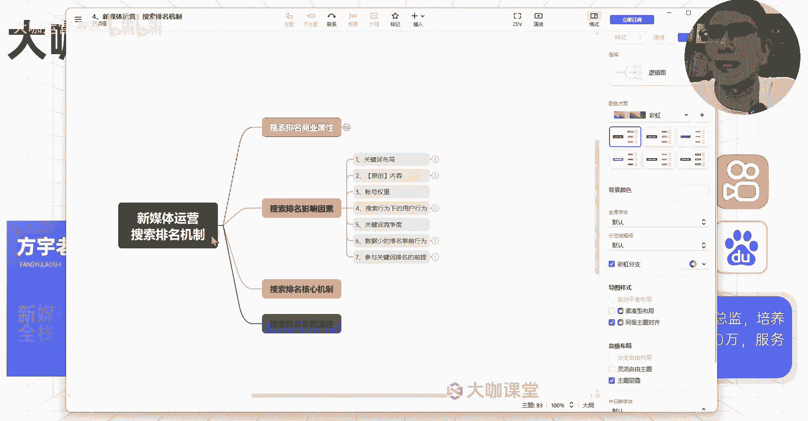

也是非常重要的一点，你想要把搜索排名做好，那么你就得结合关键词来做好，我们的关键词布局，什么是关键词布局呢，我们就拿某平台的一个单篇笔记来讲，你的一篇笔记上面有几个地方，是可以凸显我们的这个关键词的呀。

比如说封面对吧，封面上面呢，你有我们一般呢会把封面做的特别吸引人，但是呢你的封面，我们肯定是需要通过封面去告诉用户，我这个笔记是讲什么内容的，所以你的封面上是肯定会有关键词，如果你的封面上面没有关键词。

那么用户他看到你这个封面，哪怕你封面做得再优秀，他可能觉得你这份封面，不是他自己感兴趣的内容，那么它的点击率就可能会下降很多，是不是啊，所以说我们的封面上面是肯定要有关键词的，除了封面之外，还有哪里。

还有我们的内容图对吧，还有我们的标题，我们的文案以及我们的什么呀，tag标签，对不对，这几个点是我们非常明显的，能够去放置我们关键词的地方，然后呢除此之外还有一个点是哪里呢，就是我们现在我们的这个内容。

底下有一个叫做评论的这个东西，评论区评论的内容参与到哪些方向，他们评论的是哪些点，用户讲的是哪些点，这些也可能影响我们整个笔记，或者说呃我们视频内容的一个排名对吧，那么我们来看一下，首先第一个封面对吧。

我们刚才讲了封面上面的大标题加粗对吧，这个大标题呢一定要加粗，然后放大处理，这个是我们的关键词，大标题上的关键词加粗放大处理，然后其次呢就是我们的标题对吧，我们还记得我们在写这个关于英语口语训练。

这个我们比如说我们现在写一个关于英语，口语训练的标题，我们写个什么呢，额咳三天快速提升你的英语口语能力，英语口语能力，三天快速提升英语口语能力等，黄金训练，训练技巧吧，三天快速提升黄呃英语口语能力。

三天快速提升英语口语能力的训练技巧，我觉得这前面还要加一个什么东西，这个词怎么想的呃，黄金训练技巧，或者说嗯一些其他的这种吸金词汇吧，呃，先这样写吧，三天快速提升英语口语能力的黄金训练技巧。

OK那么我们可能这个时候有个疑惑，我们的关键词是英语口语训练，但是我们这个地方我们来给它加粗一下，这个地方是英语口语，然后后面呢我们训练放在这里，那么这个时候这个平台呀，它能不能匹配到我们这个关键词呢。

你想一想能不能，我们通过这样的一个放置方式，我们能不能提升，我告诉你们这种是可以提升的，好吧，这种是可以提升的，三天快速提升英语口语的黄金训练技巧，这里边标题只要你玩。

你包含了这个英语口英语口语的一个训练技巧，那么这个标题你在标题上面的关键词呢，就至少说做到合格了，那我们正常的在做这个大量的长尾词的时候，我更建议大家怎么去做呢，就是我更建议的方法。

比如说我们再取一个标题，我们叫做，清华大学不外传的英语口语，英语口语训练技巧，好我们这写的这么简单的哈，那么这里你们会发现，我把英语口语训练放在一起了呀对吧，这个应该能够明显看得到跟上面有一定的区分。

那么如果说你们在做大量长尾词，你们再去做笔记的内容的时候呢，你尽量把这个词儿呢，可以给它完完整的包含进去，也就是我们的这个要做的关键词，你在标题里边呢去进行完整的匹配，但这种完整的匹配呢。

我们一般会去讲搜索引擎呢，它在这一块它的一个偏靠性，可能会相对来讲，你下面呢比如说我们正常的在标题这一块，关键词的得分，比如说我们下面呢我们可能得个嗯0。2分，可能是上面这种你拆分开来的，可能就只有0。

1分啊，当然这是我们整体上的预测，但是从我们各种情况下来看，你的所有的笔记只要说内容质量做的足够过关，我们可能说这种拆分开来的也一样，是完全没有问题的，只不过我们做运营是什么呢。

我们做运营就是把所有能够影响我们账号的，一个流量分发，或者说我们搜索排名的所有的因素，我们给它做到极致啊，这叫它的运营，OK那么这个你们可以关注一下，然后正文正文的话我们来举个例子吧。

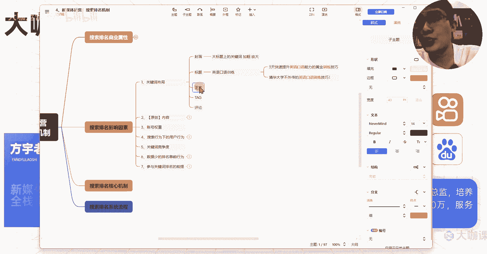

我们现场来演示一下，比如说英语啊。

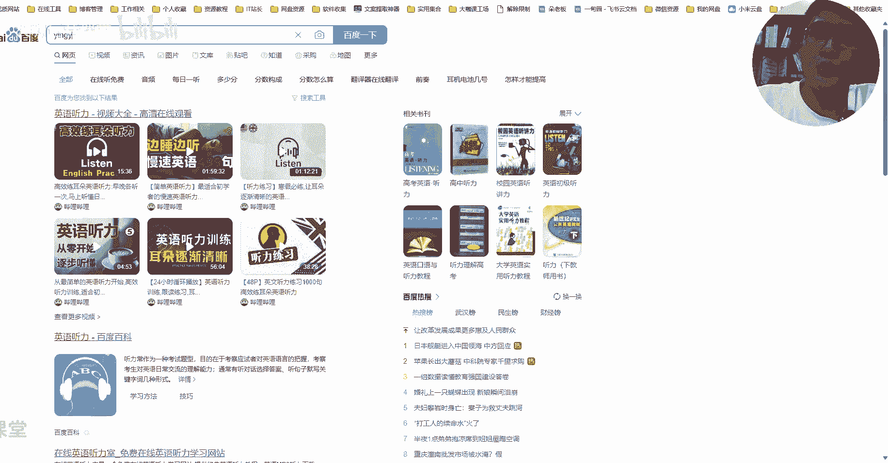

还是跟英语口语训练，我们看啊，呃训练方法吧。

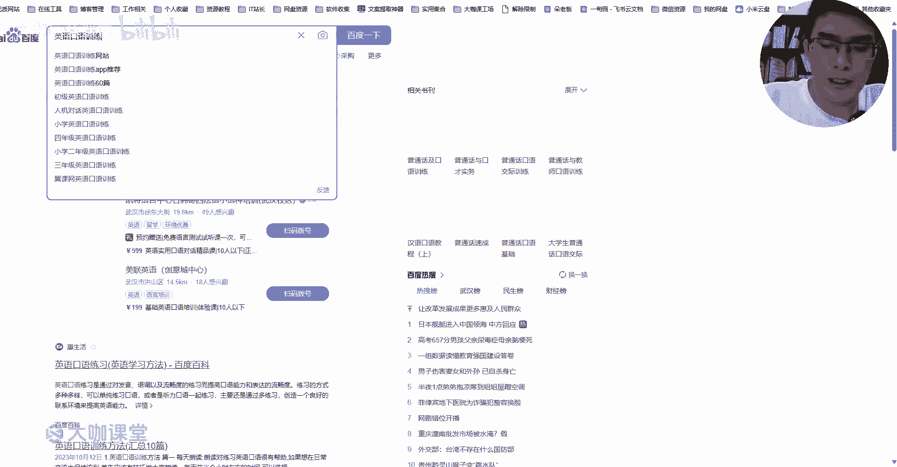

我们来找一篇文章嗯。

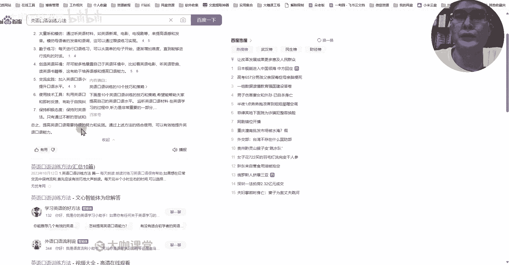

好，我们这里简单的以这个文案来做。

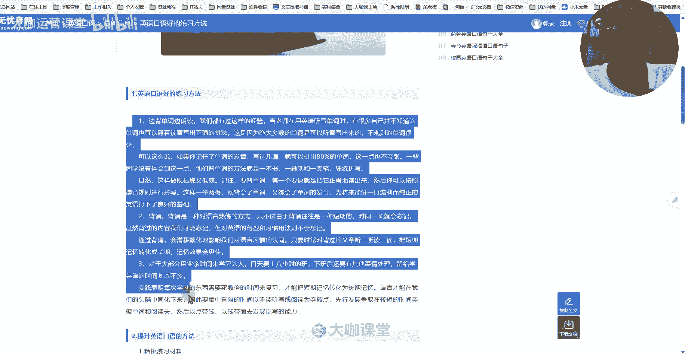

这个这个这个这个这个来。

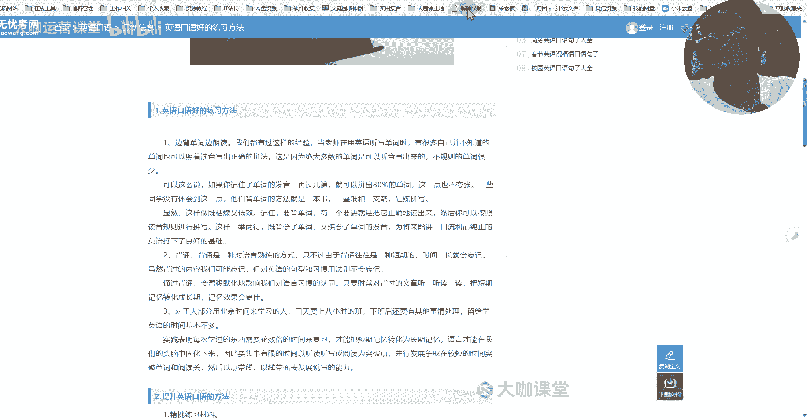

还不让我复制好。

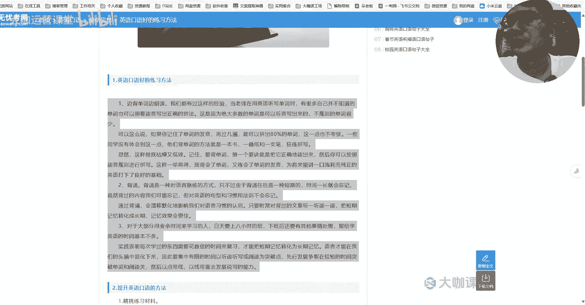

那么我们现在把这个文案拿过来了，是不是拿过来了之后我们怎么做呢，你比如说我们在文案当中呢要去布局关键词，我们先来看一下这个文案当中，有没有英语口语训练的关键词，我们按下CTRL加F。

我们来搜索一下英语口语训练，OK我们往下放在这里，往下翻一下，没有对吧，这里面没有完整包含它可能包含了什么呢，包含了英语口语耶，英语口语也没有好，那么我们现在来优化，我们来现在来做调整，怎么去调整呢。

首先啊我建议大家，你在做这一类文案内容的时候呢，你的前变前面对吧，你前面的这个内容一定要有，一定要先尽量的去包含，比如说英语口语训练，我们都有过这样的经验，呃我们看一下啊，我就不单独写了吧。

我就结合他这个优优化，边背单词边朗读，然后我们都有过这样的经验，当老师在用英语听写单词的时候，不规则的单词很少，英语口语的训练方法啊。

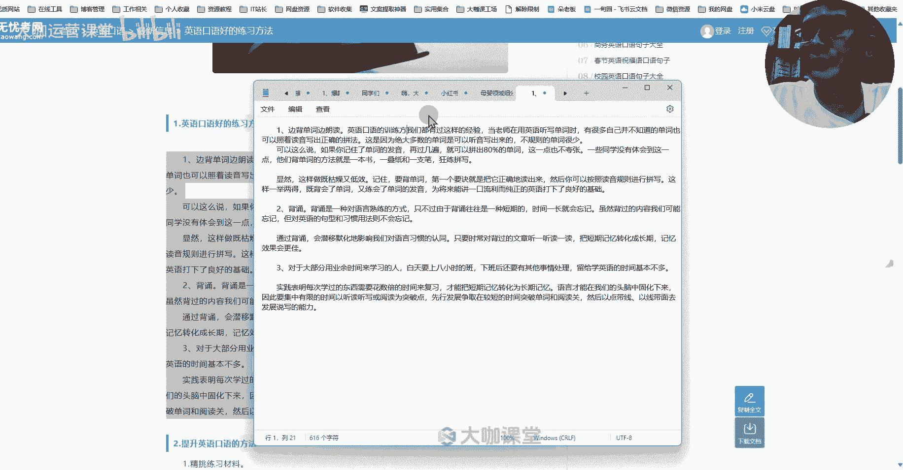

我们在这里植入，不好植入，我们重新来文案在前面写吧，我们在前面加一句，OK英语口语的训练方法有很多，但是真正能提升我们英语口语能力，英语口语能力的技巧嗯，但真正能提升我们英语口语能力的方法，却不是很多。

这篇笔记，我详细总结了。

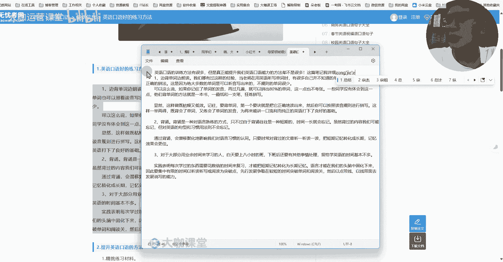

我自己平时做英语口语训练的几个方法，分享给，分享给大家，OK就这么简单好，这里加一个好，然后呢，这里呢我看还没地方可以这么说，哎我们把这句话给他改一改，有些同学喜欢去找一些。

嗯比较死板的英语口语训练方法，他们背单词的方法就是一本书，页纸管理语拼写，这样效率很低，效率比较低，这样效率比较低，显然这样做又枯燥，哎你看啊，这里又低效，哎他跟我的结合了，那么我们把这一段给他接上。

这样做既枯燥又低效，记住要背单词，一个口诀，第二个背诵，想要高效的做英语口语训练，背诵一定是一种对语言熟练的，背诵是一种对语言熟语言熟练比较好的方式，只不过由于背诵往往转了。

OK那么这个地方呢我们加了一个好，我们再来看，差不多了啊，正常去融合，我先我先把这个东西这个这个流程完成，对于大部分用业余时间的学习人，白天上八小时还学数，学生留给自己，自己做英语口语训练。

训练的时间基本不多，实践表明，每次，Ok，那么我这里差不多已经在这个文案当中，布局好了啊，我们来看一下，从这里开始搜索，我们现在开始搜索英语口语训练啊，啊一次啊，然后呢两次三次四次啊，这里呢能看到四次。

其实还远不止四次，那这里英语口语的训练这个地方也能组合出来，然后这里呢训练英语口语，这个也是能够跟我们的标题挂钩和组合的，那么我的这种方式，我现在在文案里面去加这种英语口语训练的，这种技巧啊。

其实就是我们把这个长尾词，要能够在这个文案当中一定程度的去比较连贯，比较通顺的去加进去，比较自然的加进去，你比如说你像这个地方嗯，呃我加的这个比较死板的英语口语训练方法，那如果说我不要这个不要这句话。

我不要这句话，这样可以吗，有同学喜欢去找一些比较死板的方法，可以吗，也可以对吧，从我们文案阅读通顺来讲，从用户的理解程度来讲，这种也可以，但是我们要想让系统在判断我们这篇内容，是跟什么东西挂钩。

是跟什么词儿，是跟什么呃分类挂钩的，我们就可以用这种不影响用户阅读的情况下，我们来把这个词放进来，这样是不是就能够有一定程度上去让系统，在拆分我们这篇笔记，他去通过中文分词法呀，一个词一个词的去分析。

或者说他通过他自己的这个筛选，提取内容的一个方式，他能够知道诶。

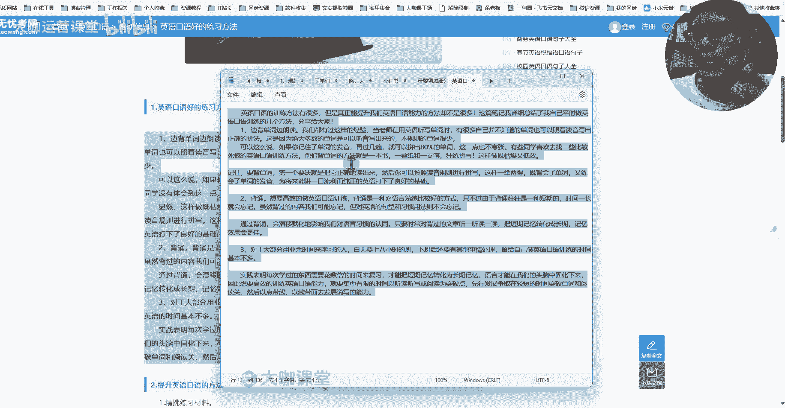

我们这个英语口语训练出现的频率比较高啊，相较于其他的这种文字出现的这个频率比较高，是不是能够更加偏向于让它正确地提炼出，我们这篇笔记的一个主题，那么这叫做一个什么呀，叫做我们在文案当中正确的去融入。

我们的一个关键词。

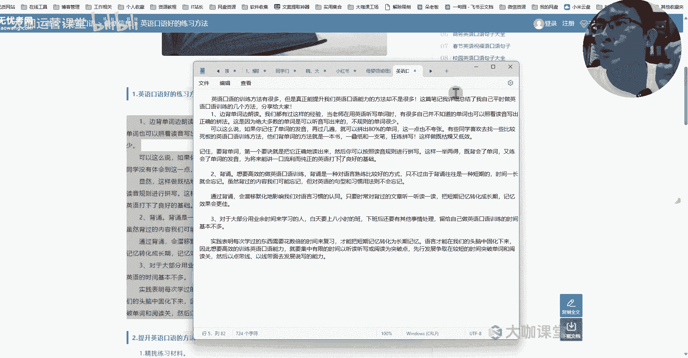

不知道大家有没有理解这一点，如果说你自己不太理解，我们可以下去之后呢去做一下这个训练，或者做一下尝试，OK这是正文，然后呢tag标签就不说了呗，tag标签的话是我们之前也讲过。

我们现在正常去发笔记或者发文案，发文案发内容的时候，其实我们都会在内容当中呢去怎么说呢，去呃在这个tag标签上面去合理的带，跟我们这个赛道，我们现在讲的这个内容比较相关的这种tag标签。

你不要去放一些不相关的，当然呢如果说你是蹭热点的这种呢，有时候我们可能会放一些呃跟热点有关的，但是这个一定是基于什么，基于我们当前笔记的内容来的，所以说你的tag标签里面完整包含你的关键词。

是比较重要的，然后评论这一块呢，评论这一块有时候不是特别好控，一般是用户的一个行为，但是呢我就这么跟你们讲，就是我们有时候作为运营，我们去人工控制一些东西的时候呢。

我们可能会控制某有些数据它的一个展现形式，它的展现形式对你越友好的话，那么你在这个整个关键词布局上面的加分，我们就能得到更多，比如说我们封面诶加0。1，我们标题加0。1，正文加0。1。

我们tag呢也加0。1，我们评论上呢也也能够加0。1，我们整体上是不是能能够得到0。5分，可能说你这篇笔记，原本在没有关键词布局的情况下，你对于这个关键词下面的一个体现，你只有0。1。

但是经过我们布局之后，你能在这个比例上得到0。5，那么你在关键词下面排名的一个展现，就是排名越靠前的一个机会，是不是就大了那么一些对吧，这就是我们讲的一个运营，OK那么这节课呢我们就先讲到这里。

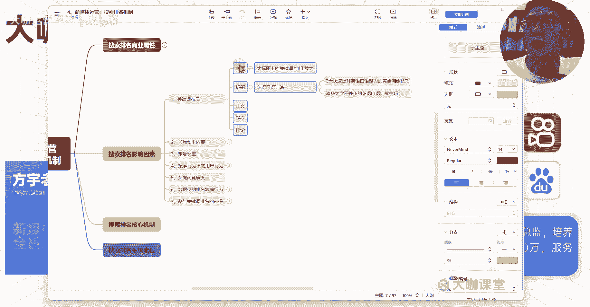