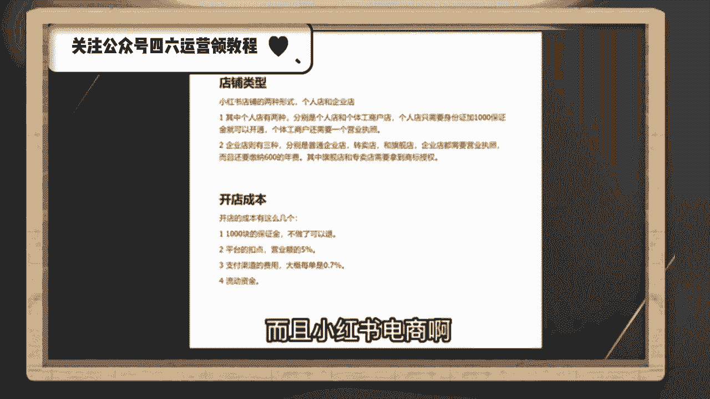
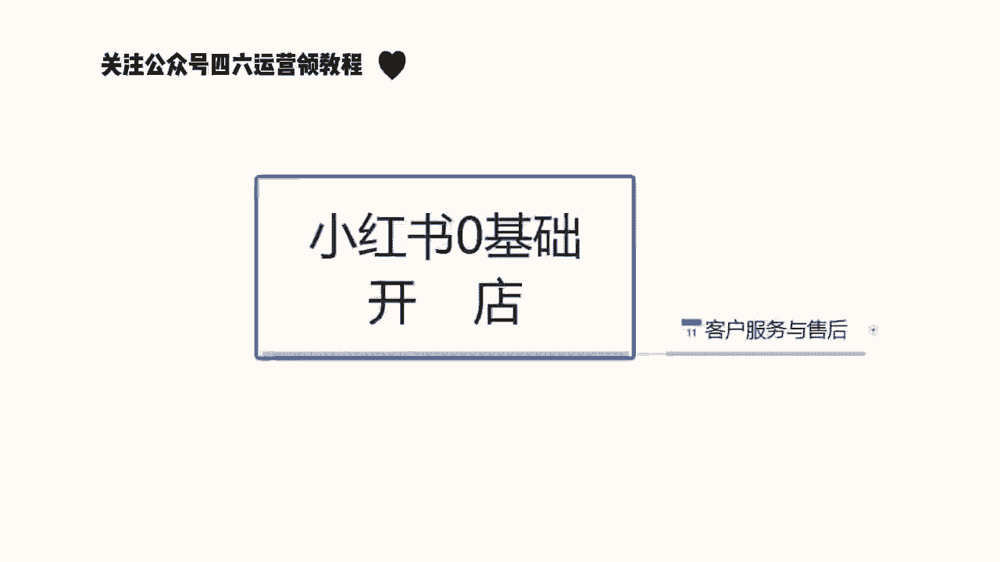

# 【150集精华教程】小红书运营新手起号 0-1新媒体运营必学课！不要荒废18-30岁，一切都还来得及 - P1 - bi张天琪 - BV1FN8FeiECY

要说最近什么项目最火啊，那就必须要提到小红书电商，最近几个月呢，几乎整个互联网都在讨论小红书电商，我关注的几个商业博主啊，包括一些付费社群都在讨论他，我朋友圈月入五位数甚至六位数的比比皆是。

这个项目在年初的时候，我其实就有让团队跟进测试，我还在市面上买了一些课程学习，到现在单人单店一个月也能做个一两万块吧，今天我就用一个视频详细的给大家拆解一下，就是小红书电商到底怎么玩。

我会把整个小红书电商的流程，包括一些注意点，比如怎么开店，怎么选品，怎么做流量，一次性给大家讲清楚，你甚至都不用再去看别的相关视频和培训了啊，你就跟着我的视频去按图索骥就足够，你在这个事情上开始盈利了。

视频的结尾呢我还会给大家准备一份资料，里面有我找的课程啊，对你运营小红书电商呢会有很大的帮助，有需要呢直接去拿就可以了，言归正传啊，整个项目的逻辑啊其实也非常简单，它就三件事，第一个呢开店，第二个选品。

第三个流量，我们一个一个来讲，先说开店呃，开店其实没什么好说的啊，首先就是打开小红书，然后点击左上角的菜单图标，再选择创作中心，然后点击更多服务这个选项，选择店铺，点击立即入住就可以了。

你就按他官方要求的提交资料入住就行了，我居然看到有人把小红书开店包装成一个项目，拿出来卖，居然还有不少人买，这也是很奇特，这里跟大家说一下小红书店铺的两种形式，个人店和企业店，其中个人店有两种。

分别是个人店和个体工商户店，个人店只需要身份证，加1000保证金就可以开通了，个体工商户呢还要多一个营业执照，企业店呢就多一点，企业店有三种呃，有包括那个普通的企业店，有专卖店和旗舰店。

企业店都需要营业执照，而且还要缴纳600的年费，我们刚开始运营小红书电商的时候，你直接选择个人店就可以了，我们实测下呀，企业店和个人店一样，平台并没有对企业店有什么流量倾斜。

唯一的区别是个人店你只能开一家，而一份营业执照呢，你可以开三个店，你一个店如果都没做好，你开再多的店都是没有用的，而且小红书电商啊。

我觉得是不适合店群形式去做的，这是因为小红书的流量机制，它的电商自然流占比非常低，那你铺再多的电，再多的货有什么用呢，所以只要你看到有博主跟你讲什么小红书店群，我都觉得是在扯淡，小红书是要做矩阵的哈。

但不是店铺矩阵，而是账号矩阵，这个后面在流量获取那里，我会跟大家细说，开店的成本呢有这么几个，第一个就是1000块钱的保证金啊，不做了可以退，第二个呢是平台的扣点营业额的5%，第三个呢是支付渠道的费用。

大概呢每单是0。7%，第四个就是自己的流动资金啊，一开始大家做呢可以用无货源的方式去做啊，对资金要求也不高，你刚开始呢准备个2000块，3000块完全够了呃，开完店以后呢，我们下一步就是选品。

我们应该在小红书上卖什么的，选品其实也简单哈哈，在其他平台上的爆款，大概率在小红书上也能爆，目前小红书呢我是推荐三个渠道进行选品的，第一个是通过某东，某宝上面找那种小红书平台调性的爆款产品，呃。

身边有做电商的朋友，他自己在某宝的店铺卖的爆款，搬到小红书上，第一篇笔记就开始出单，第二篇笔记单量就已经破百了，第二个呢是通过某音的那个精选联盟，你在某音的精选联盟排行榜，你可以看到现阶段哪些品卖的好。

只要符合小红书用户调性的产品，直接搬运测试就可以了，第三个就是某多多的这个销量排行榜，选择适合小红书的类目排行榜，从中选择相应的爆品搬运到小红书，整个选品的逻辑，就是我们要利用市场来帮助我们选品。

而不是自己在那瞎想，我们要借助大卖家的选品能力，来弥补自己选品上的不足，所以我们只要判断一个东西啊，就是这些排行榜上的爆品，是否跟小红书的人群有匹配的可能，如果有，我就搬过来测一下对吧。

相当于是借助了别人的能力来帮我们自己选品，这样反而是最快捷而且是最稳妥的选品方式，肯定比你瞎测成功率要高很多，然后等你这个产品上架以后呢，就到了最重要的环节了，我们应该如何获取流量。

小红书他是个种草平台，你店铺九成以上的流量啊，都是来自你发的发的笔记，这就是为什么我之前说小红书不要铺店群，而要做账号矩阵，尽可能多的发笔记耗流量，它的通路就是用户通过你的笔记，然对你推的产品产生兴趣。

然后到达你的店铺完成购买，你堆一堆店铺对吧，你铺一堆店铺一个还不如多发笔记，多发几篇笔记的这个效果好，所以怎么在小红书上发笔记对吧，就是你小红书电商是否成功的关键，小红书这个平台你直接发硬广。

我觉得效果非常差对吧，本来小红书的这个用户群体认知就比较高，你直接发广告，你没有办法获得信任的啊，更不要提转化了，你发笔记的时候一定要用一个素人的角度，你知道吧，就是用户的角度去切入。

站在用户的角度去做种草内容，而不是官方视角，这才是真正有效的呃，这种种草笔记怎么做其实也很简单，就是去各大平台的商品评论里找，比如某音某宝，某东的商品买家秀，找到好看的素材，你直接copy下来用嘛对吧。

文案呢在买家评价上去做修改，这些买家的评价就是商品用户的使用体验，天然的适合用来做这个中考笔记，而且可以说是取之不尽了啊，然后呃当你单个账号的sop跑通了是吧，我们就可以开始举证引流了啊。

通过批量上小红书账号，批量发布笔记给我们的店铺来引流，来放大，那基本上整个小红书的电商的运营啊，就是我上面分享的这些，外面不管多少钱的培训啊，3000块也好，6000块，1万块也好，其实就是这些东西。

有些培训可能还没有讲的清楚啊，根据上面的几个点，我给大家准备了一份资料，里面包括了小红书账号的旗号运营的方法，以及一份小红书电商的视频课程，你如果打算经营小红书电商，你也不用看别的东西。

就跟着这份资料做足够，你开始盈利了，有需要的点赞加关注，在评论区回复红书电商，我分享给你要有自信啊，你是最好滴，知道吗，大家好，今天给大家分享一个小红书，零基础开店的第二课时啊，小红书的一个店铺注册呃。

废话不多说呢，直接进入我们今天的一个内容店铺注册，小红书店铺注册的话，相当于来说的话，还是有一需要我们注意的一些选项，因为他的一些店铺注册的内容的话，它不是很好找啊，在我们戏台后台系统里面的话。

它隐藏的比较深，它不像其他的呃，其他的平台直接打开就可以注册，首先呢我们店铺注册的话，就说我们的用个人的手机就可以啊，当然你如果说有备用的多余的手机，用工作手机去操作的话也行啊。

用手机下载小红书他的一个系统就可以了，手机下载小红书系统以后的话，账号注册，首先我们手机号登录我们那个账号啊，账号登录进去以后的话，点击我们那个他这个的话其实和微信一样，在右下角啊。

点击我们的那个人物头像就可以，就可以进入到我们的个人中心，然后登录账号就行，登录账号的话呃，他这个里面的话有一个小红书，注册之前的话，上节课内容也给大家讲过了，我们的一些开店技术的一个准备。

让大家让大家是准备过，小红书注册的一个账号的，登录这个账号以后呢，在右上角啊，点击我打开，在右上角或者是左上角，他有一个三角的一个斜杠啊，点击这三条杠以后的话，选择创作中心，点击创作中心以后呢。

然后点击更多的一个服务，更多服务进去以后的话，大概在嗯第三排选择开通店铺啊，就是第三个方框，它那里面的话是分为了四五个方框，每个方框里面的选项内容不一样啊，那个呢是设置我们的一个账户信息的。

其他的不用管，直接选择我们的一个店铺开通就可以，然后点击进去以后，它还会显示一个界面，界面的话它是以广告的形式推荐给我们的，我们在里面的话，它有一个点击立即认证就可以了，点击进去就可以注册账号。

其他的东西的话其实是不用看的，因为看了也没什么作用，我们对我们新手来说的话，那些东西看不看无所谓啊，点击立即认证的以后的话，按照他的一个正常步骤走就可以了，然后提交我们之前准备提前准备好的一个材料。

提交身份证的一个正反面，然后选择店铺的类型，这个里面的话注意一点啊，店铺的类型的话，它是分为三个类型的个人店，企业店，或者说是啊旗舰店等等，这里面的话我们正常前期操作啊，不管大家怎么样。

如果说有熟悉的话，可能就不需要了解这一点了，如果说不熟悉的话啊，大家开个个人店就行了，用个人店的话，本来就是让我们上手去实验操作的，本来A做任何数据啊，我们不管是做电商也好，或者是做店下的店铺也好。

我们大家都要有一个熟悉的过程，熟悉了以后的话，我们再按照这个模式去操作就可以了，所以说大家一定就要注意了，我们前期开个个人店铺，自己先把所有的流程熟悉以后呢，再去操作，不然的话我们所有的一个信息的话。

基本上嗯就是我们前面用力过猛，你后面就会对这些东西失去兴趣，为什么，因为我们前面已经失败了，你后面再做的话，就会对自己产生不那么信任的一种感觉，如果你做多了以后的话，你自己就放弃了。

而我们在做任何东西的时候，一定要先把自己的一个基础确认好啊，我们基础确认好了以后，我们有一定的基础了再去操作，所以说我给大家讲这些内容的话，就说我们按照步骤一步一步走，不要操之过急。

前面的话我们没有必要直接就说上来一一下，投个几万上呃，上10万哎，我非要把这个店做起来，没有必要啊，我们刚开始做店的话，投个两三千块钱，三五千块钱，其实是花个一个多月，两个月时间。

把整套流程熟悉了以后的话，后面会节约我们很多时间的啊，所以说大家注意点啊，然后继续我们的一个内容，首先要登录到达我们的一个选择店铺类型啊，选个人店铺就行了，其他的不用选了。

因为能看这个课程的基本上都是新手，所以说大家了解一下就行啊，然后填写店铺的一个信息，这些信息的话后面是可以修改的，我们随便填写一下，把信息尽量填准确就行啊，尽量的话就是在后期不要去修改。

修改的话影响是有，但不是很大啊，就是说没有必要啊，一次性弄好就行了，店铺信息填写完成以后呢，我们再进入下一步啊，直接完成我们的一个认真完成，我们的一个小红铺，店铺基本上呢就已经注册成功了。

他注册成功的话是三天的，有三天的一个反馈时间，但是基本上的话五到10分钟，他的反应对于其他平台来说的话会稍微慢一点，如果说我们去某多呀或者说某宝去注册，或者说是呃其他的这种交易平台。

去网网络交易平台去做的话，可能会快一点，但是小红书这边的话，因为他的系统还不是很完善，所以说我们有很多操作的空间，但是呢它同时它的一个系统反应速度有点慢，快的话五到10分钟慢的话可能要一天左右啊。

基本上都在这个时间范围以内，他的店铺才会注册成功，注册成功利润以后的话，我们才会去操作项目，也然后呢，这节课最后一个点，就是说我们把账号注册成功以后，在手机里面还要下载一个东西。

这个东西呢叫小红书的一个客服工作台啊，客服工作台的话，他和小红书的店铺的话呃是类似的，但是他是做我们售后的，就是我们店铺里面来订单以后的话，会需要这个小红书的一个客服工作台，他直接在小红书里面操作好。

操作不了的，没办法去聊天沟通，他相当于是额外引流到了另外一个平台里面，去做啊，所以说大家一定要把那个小红书的客，客服工作台给下一下啊，这个呢就是这节课的一个店铺注册内容，下节课呢给大家讲解一下。

小红书整体的一个店铺类型的一个区分啊，我们前面要做的话，我们到底去做什么店，伺候我们，大家好，今天给大家分享一个小红书，零基础开店第三课啊，店铺的一个类型，店铺类型。

这一节课的话是让大家充分的了解小红书，他整个系统里面，他的所有店铺类型和他的一个类型区分，那么直接开始我们这节课的内容，小红书的话，我们正常的一个店铺类型的话，它其实是可以分为很多种的，这里面的话。

我给大家把它全部都单独的列出来了，诶因为要给大家详细讲解一下，让大家了解整个小红书的一个，店铺类型的一个体系，我们在什么阶段应该怎么去操作啊，小红书的整体个人嗯，整体的一个店铺体系的话就是第一个个体店。

第二个呢是个体工商店户啊，第三个是普通的一个企业店，第四四个呢是专卖，第五个是旗舰啊，最后的话就是说一个是卖场型旗舰店，他这个的话其实也就是品牌推销商而已啊，那首先我们来了解一下啊，个人店。

什么是个人店呢，申请主体额，个人用户就是我们个人使用的，就是我们刚毕业也好，或者说是辞了工作，自己想做点小事情，就跟我们平常在外面摆地摊一样啊，这就是属于个体店，摆地摊的话，你也要注册一个营业执照。

或者说是一个小小规模的一个示范营业啊，让银行给你开通卡，然后给你开通支付权限，这个个体店的话就类似于这种啊，经营特点的话，就是说经营限定的精英零星的小额商品啊，比方说首饰啊，服装包包包包。

手机壳呀等等这些啊，多个品牌就是杂货铺，什么都可以卖，就看我们自己怎么去操作了啊，入住要求的话，这个的话基本上是比较简单的，他没有什么特定的一个入住要求，就是我们个人有个身份证就行啊。

额然后呢店铺命名的一个格式啊，专业号成泥，就是然后加我们的一个店名，就我们个体店他自己会系统给我们匹配名称的，这个的话不用管保证金的话，内部保证金和浮动保证金嗯，二者取高，这个怎么说呢。

保证金这一块的话，我之前也给大家说过啊，就是说1000块钱的保证金，这个是个人店铺的一个数据准备，如果说是超过1000块钱的话，那都是个体工商或者说是旗舰店专卖店那种，而且他的这一个整个保证金的话。

他的浮动都很明显，待会的话最后一点我会给大家详细讲解一下，他这个整个小红书的一个保证内膜，它是怎么划分等级的，好吧，那下面呢我给大家讲一下，什么是个体工商的一个店铺，个体工商店铺的话。

他和个人店铺不同呢，就是说嗯他的入住要求可能会稍微麻烦点，需要我们有一个营业执照啊，对品牌授权是没有需求的，只要我们自己有营业执照就可以了，其他的基本上都是一样的啊，他和个体店的话就是一个入住需求。

多了一个营业执照，其他都没什么区别，普通企业店的话，他和和其他的话也是包括下面的一些店铺，他所有的一个区别就是在入驻要求这一块啊，入驻要求这一块，他每一个店铺入驻的一个要求是不同的。

就看我们自己有没有这个资质去认证了，当然了，这个企业所有店铺的一个入驻要求，越简单的，你的权重肯定也就越低啊，越复杂的你的权重也就越高，但是我们前面嗯新人刚开始操作店铺的时候啊，没有必要弄那么高的要求。

做个个人店啊，自己测试一下有没有这个潜力，这个产品在这个小红书系统里面，好不好做就行啊，没有必要投入太多，普通企业店的话，入驻要求的话就是说啊申请主体为企业，就是我也有自己的公司。

或者我也要有自己的产品，我这个是有国家认证的啊，必须持有企业的营业执照就可以了啊，其他的话没什么需求，专卖点旗舰店，包括卖场型旗舰店啊，他只是说换了一个名称，专卖店的话入驻要求的话就是营业执照啊。

品牌的一个认可自有品牌，非独立品牌啊，就是你的品牌我们自己啊，像阿迪啊那种都是国有的很知名的那种品牌，我们自己小企业也有自己的品牌，你只要在国家上面注册认认证认可就可以，这都是属于专卖店。

就是我卖我自己的产品啊，把我的资质刷上去就可以了，旗舰店的话也是一样的，他只不过是啊必须持有营业执照，必须持有品牌授权书，我自己没有品牌，但是我有别人品牌的一个授权书就行，卖场型专卖店的话。

这个具体要求回炉的话，可能根据平台的需求不同啊，它的内容也是不一样的，经营特点的话就是说零售的一个资质啊，并且开设经营多个品牌的一个旗舰店，但是嗯基本上在小红书里面没有这种店铺啊，因为这种店铺的话。

他小红书的流量和他不对标啊，因为小红书的整体流量的话，它是以女性为主，所以说它的产品的话不对标，很多的很多的那种大型的旗舰店的话，他不会在小红书上面去操作，所以说他会给了我们一个小卖家。

很有必要的一个生存空间，就是说他的竞争压力的话，没有其他其他平台那么大啊，就非常适合我们小卖家去操作一些嗯，小型的麦麦皮，这个就是说呃所有店铺类型的一个区分内容，最后一个啊，就是给大家讲解一下。

这些企业划分的一个保证金，因为他这个保证金的话嗯，基础保证金是1000块钱，但是基础保证金保证金之后的话，他还有额外的一个保证金，这个保证金的话呃，在这里呢给大家讲解一下内部保证金。

普通企业内部特殊类目和跨境内目，这里呢我给大家呃，把它具体内容呢给大家打出来，大家可以看一下啊，我在这里呢就不过多解释了，因为解释起来的话，其实大家搜资料的话其实也能找到，只是说有些人的话嗯。

他懒得去说是吧，那我在这里呢就给大家打出来了，大家看一下或者截图，对这方面感兴趣的话，可以去看一下，后面呢就是一个浮动保证金，内幕保证金的话，他基本上都是个固定的啊，下面呢就是浮动保证金。

这个的话就是说所有内容的话，浮动保证金是最重要的，大家一定要了解一下什么是浮动保证金，浮动保证金的话，它是根据我们店铺的一个成交金额来计算的啊，店铺成交金额小于5000。

就是我们店铺前面如果说没有交保证金，或者是没有其他东西，成交金额在5000块钱左右的话，他的保证金是零，但是我们起始资金保证金金是1000，不交这1000块钱的话。

你这个成交金额小于5000块钱是没有用的，我们交了这1000块钱的保证金以后的话，我们在5万以内的一个店铺，就是一个月的流动资金，在5万以内的话都是没有问题的，超过5万的话就不行。

5万到10万的一个保证金的话是3000，10万到50万到50万是5000，50万以上是2万，他的这个保证金都是浮动的啊，但是大致的一个需求的话都是在这个地方，就是我们店铺成交每个月的成交金额啊。

超过5万到10万，我们需要3000块的保证金，才能把这个店铺里面的钱提出来，不然提不出来，10万到50万是5000，50万以上是每个月是2万啊，当然了，我们做到这个时候的话。

如果说每真的每个月50万以上上的，一个成交金额的话，2万块钱的保证金也无可非厚非是吧，提现，然后呢提现的时候，他会查证我们店铺，就是保证金账户里面的一个资金是否充足，如果说资金不充足的话。

我们的资金一旦超过了5万，就是我交了1000块钱保证金，我我的资成交资金一旦超过5万，那我一毛钱都提不出来的啊，所以说大家一定要注意了，不有时候提提现这个东西的话。

一定要注意自己查看自己的保证金是否充足啊，就是说大家很多时候的话做东西就是往这些点，觉得自己的钱找不出来的，小红书坑我之类的啊，其实不会，他只是说他的一个类目的一个浮动保证金，在这个地方啊。

大家把这个这几个点注意好就可以了，这个呢就是我们这节课的一个内容啊，给大家讲解了一下店铺的一个类型，和我们店铺类型里面对应的资金保证金，和我们的一个替换方式，好吧。

那么下一个节课呢给大家讲解一下选品与货源，小红书上面我们做什么样的产品，选什么样的货源，怎么去操作啊，大家好，今天给大家分享一下小红书零基础开店，选品与货源啊的一个内容，嗯废话不多说。

直接进入我们今天的一个内容啊，给大家分享一下我们怎么去选品啊，怎么去选货，选品选货的话是我们小红书额的重重中之重，为什么，因为一个好的货源，才是我们一个赚钱最基本的一个选项的，最重要的基础条件。

因为我们的货源不好啊，我们选货不正确，我们怎么去操作这个店铺做起来了，你也赚不了多少钱，我们先不说赚不赚很多钱，你有可能还会亏本，所以说选品有货源的话，他在这个里面的话是非常重要的一个环节。

那首先我们了解一下什么是货源，会员的话，我在这里呢给大家分为了三个例子啊，第一个是线上会员，第二个是线下会员，第三个呢啊是工厂直销，首先我们了解一下什么是线上货源，线上货源的话就对我们小卖家来说。

或者说对我们新手来说的话，比较友好的一个东西呃，网络上面一件代发，或者说是其他网络上面，或者是我们所在百度啊，或者其他地方搜索的一些，这个就是线上会员一个平台，线上会员的话。

我在这里呢给大家随便举列列了一部分啊，这里面比较好的一个就是说啊，16881件代发，他这个里面的话产品比较多，在小红书上面去做的话，其实是非常好做的，而且它的产品价格比较低啊，量大啊，品类多。

因为他做的时间比较久，第二个呢就是再补一抹包，下面呢，我就不给大家详细解说它的好处和坏处了，这里呢我已经给大家列出来了一个字，母婴网五八批发货啊，315会员开箱网九幺啊，还有一个啊某多多。

某多多的话其实和1688是差不多的，我们可以把其他的资源型产品，拿来在小红书上面去操作，因为小红书的话，它对应的产品的话比较会会比较单一，不像嗯拼夕夕啊，母淘或者说是，京东啊之类的这种店铺一样。

因为他们基本上已经形成了一个固定的模式，小红书的话他是以笔记为搜索来源，而且他的一个货源的话呃也不是很稳定，他基本上的话和其他的平台一样，但是它的整体的一个后台系统，对比其他平台来说的话。

漏洞还是有点多，所以说我就给了我们一个操作空间，我们可以把其他的产品拿到小红书上面来卖啊，相当于小红书在抢其他平台的一个流量资源，而且他也成功了，它的一个整体的流量数据是非常大的，所以说线上货源的话。

我们拿其他产品在这个里面卖啊，其实也是能赚到钱的啊，就看我们自己怎么去操作，怎么去跟卖家谈，谈完以后的话，我们在小红书上面怎么去卖，怎么去包装我们自己的一个产品啊，其实就是二手货倒卖。

就看自己大家怎么去操作了，这个呢就比较好理解了啊，这个呢就是线上货源的一些平台，第二个呢是线下批发市场，线下批发市场的话，跟线上货源就区别就有点大了啊，嗯我们可以呢考虑全国我们本地区啊，你不管是县也好。

市也好啊，或者镇也好，他都当地的话，它都有一个批发市场，批发市场它它所有的东西出来以后都是成本价，我们只需要去这个里面的话去观察一下，跟批发市场的老板，或者说是我们中意的产品。

我总想拿它到小红书上面去卖，我们跟他商量一下价格，第一个我们可以说是二手会员或者是三种会员，这种会员的话，第一个价格比较低，第二个的话就是说竞争压力没有那么大，我们非常好的去操作，只要谈下来了。

我们不需要这么去囤货，我们或者说是我们每天卖出去多少，我再去拿货，再去直接弄，这是比较方便的一种方式，而且不需要囤货啊，货源也有保证啊，资金也充足，为什么说资金充足啊，因为钱到账以后我去发货。

他只需要我们之前预留的两三千块钱的，一个流动资金基本上就够了啊，再去怎么操作他的一个资金就循环起来了，所以说对我们前期要求就没那么高，不需要自己去囤货啊，去做什么对吧，当发现这个产品有市场以后。

我们再去操作效果就又不一样了，所以说线下批发市场的话，建议大家还是呃如果说网络上面你嫌麻烦，可以在线上平台收入会员，如果说不嫌麻烦，真想把小红书做好，或者说把我们这一个平台啊，这个产品做好。

我们都可以去搜索一下，去各地的一个市场，通过我们自己的一个运营模式，把我们的产品卖到其他市，来赚取这一个额外的流量，产品的一个交易差好吧，这个呢就是线下的一个批发市场，第三个点呢就是工厂直销。

工厂直销来说的话，他对于线下批发市场需求和要求会稍微高一点，因为的话他可能会囤货，而且需要找人家的老板去谈谈什么呢，我从你这拿货，或者是你帮我发货，我帮你去做推广，就看我们自己怎么谈。

而且你的一个所站在的立场是什么样的，你是想让他帮你发货，哎你只是说帮他代运营而已，然后的话从这个里面赚一些产品的，额外的一些成交金额也可以，或者说是你跟老板谈，我要你的是产品的货。

前期呢我到你这里先拿拿一点货啊，但是量不多，我先试一下，你这个产品在我这个平台里面好不好卖等等，看你自己怎么去交流，因为工厂直销的话是属于一手货源，刚刚的线下批发市场是属于二手货源，线上货源平台啊。

拼多多啊，1688啊，这些都是三手货源，他们三个的价格是不一样的啊，线上会员来说的话，它是比较贵的，线下货源的话只能算中等，但是工厂直销它是最便宜的啊，大家一定要注意这个点啊，这就是三个点的一个区别。

利润最大的就是功耗最小，利润最小的是线上货源，所以大家一定要清楚这个点，你自己适合做什么啊，想要多少利润，怎么去谈，怎么去聊啊，就看你们大家自己了，所有的产品的话，在小红书上面其实都可以做的。

只要你不要不要去找那种大型的家具啊，电器啊都可以做，小红书的话她女性居多，我们可以做饰品，服装服饰，后面的话我会单独拿一节课给大家讲一下，小红书上面的话，他什么样的一个产品比较适合我们去做啊。

这个呢就是货源，下面是选品啊，货源和选品它是不一样的啊，货源只是说我们有了一个选货的一个渠道，我们怎么去选货，选品的话不一样，他是在选货里面再去挑品啊，这个里面的话我给大家列出来几个点。

大家都去参考一下，然后再用我们自己的方式去做一下对比，就知道怎么去选品了，选品的参考内容是哪几个呢，第一个价格，第二个人群，第三个市场，第四个需求，选择方式的话就是利润稳定和时效性，先从价格开始啊。

参展的参考内容的价格，就是首先就是我们这个选择产品的一个价格，我们比方说工厂直销也好，或者线上批发市场也好，或者说是1688，或者其他的一些批发平台也好，首先考虑产品的价格。

然后拿这个产品去小红书上面搜索，同类产品的一个内容，记住了，不要拿我们注册的店铺去挪拿一个新号啊，一定要记住开一个新号去搜索对应的价格，看看这些产品，然后再对比我们所找到的货源。

不要只要店铺不超过50家以上，就是同类产品价格区间差别不大的情况下，我们如果说利润不是很多，比他稍微卖贵一点都没关系，只要店铺就是收的时候不超过50家以上，基本上都是可以做的，这是线上货源。

线下批发市场的话，只要说是不超过60或者70家，都可以做工厂直销更简单，不超过100都可以做啊，用户利润高，这是价格，第二个是人群，什么是人群呢，就是说我们对应产品的一个人群，我选产品。

我们选女性产品对吧，因为小红书基本上都是女性为主，那我所有的产品对应的人群就是女性，那我们一定要选择女性喜爱的用户产品啊，尽量的话少卖男性用品，男性用品也能做，但是他整体的话一个对标太高了。

我们前期操作的话，对整个系统不熟悉的话，我们去操作是不好操作的，那人群里面的话，我们主要就是女性和年龄年龄，小红书的年龄是20~40，那我们选产品的时候，一定要选这类人群里面喜欢的一个产品，知道吧。

20~40或者再小一点，16~40这个之间的产品，女性用品喜欢什么，我们就可以参照这个一个范围去吃，找我们的产品，这范围就小多了吧，价格有了，人群有了对吧，然后就是市场需求。

搜索同类目里面的一个产品的市场需求，这个产品在小红书上面，或者说是在这一个嗯人群使用广不广泛啊，用的人多不多，产品价格在什么范围，把这几个点比出来以后的话，这价格人群市场和需求就基本上全部都出来了。

我们就知道选什么产品，卖什么价格，怎么去卖，只要是同类竞竞争店铺的话，说实话，我那会儿前面给大家说的啊，这个价格参考里面50家，70+100家店铺里面啊，我说的是产品销量破500以上的啊。

产品销量破500以下，他爱有多少有多少，那些都没有关系的，知道吧，它不会影响我们任何店铺的一个信息，只要说是产品销量，单品销量在500以上的，不超过50家，我们都可以去做好吧。

这个就是我们选品的一个参考内容，今后呢就之后呢就是我们选择方式，利润稳定，时效性，什么是利润，我这个产品在拼多多上，不在小红书上面，我们能赚多少钱，一单我们能赚多少钱，一定要把利润算出来。

利润不算出来以后，你别说我产品卖出去了，我小红书店铺也做活了，结果我亏本了，那就是我们利润没算好，所以说一定要把利润利润给串除啊，别自己做到最后自己把价格调错了以后的话，亏本，那就得不偿失了啊。

第二个是稳定，什么是稳定呢，产品货源一定要稳定，如果说大家做线上会员的话，建议大家选两到三家做同类产品的，去跟老板去谈买价啊，而且这里面有个小技巧，就是说不管是两家也好，三家也好，四家也好。

我们谈的时候，每家里面都走一点货，一家走主，三家走副，就是一家里面可能一天如果说我们出30单，这一家里面的话，我们一天可能25单，另外两个两单的一单一单就可以了，为什么我们保证一个主店铺里面的货源。

稳定就行，货源如果说不稳定的话，我们产品没法做了啊，你去店铺刚做起来还没多久诶，产品没有了，你去卖什么去对吧，那整个店铺就没用了啊，所以说一定要注意货源的稳定性非常重要，最后一个是时效性。

什么叫时效性呢，实现性就是产品的一个季节，春夏秋冬四季，我们的产品对应的季节去卖什么样的一个产品，我们提前做规划啊，所以一定要有个思想性，比方说我们卖夏季的或者卖冬季的，卖秋季的也好。

提前一个月去做这个产品，因为我们店铺起店的话，前期最少有一个月的准备时间，店铺起来以后的话，刚好到应季的时候，我们这个产品去卖啊，是最好卖的，当然也有4G都使用的产品，但这种产品的话嗯比较少。

但是它的一个竞争压力是非常大的啊，别人可能做了一年，做了两年，做3年，做4年，这个小小红书的一个店铺，而我们只是刚开始怎么去跟别人竞争呢，所以说大家选品的时候，一定要注意这个时效性啊。

这个呢就是我们今天的一个课程内容，选品与货源的一个准备，下节课呢给大家详细讲解一下，小红书的一个账号测试啊，因为小红书所有的账号的话，他不都不是都有权重的啊，他是有区别的。

所以说下节课给大家详细讲解一下，小红书的一个账号测试，我怎么去测试我们的账号能不能做啊，需不需要换号好吧，大家好，今天给大家分享小红书零基础开店第五课时啊，账号的一个测试，为什么说是。

今天要给大家分享一个账号的测试呢，因为小红书店铺的话，它和其他的平台不一样，所有的账号创作出来都有权限，小红书的账号不一样啊，小红书的店铺账号我们创建好以后的话，嗯他不一定都是有权重的啊。

就说有的账号的话，拿新号也好，新的手机号也好，是新人的一个身份证也好，或者说是我们拿有的时候运气不好，拿老号去做，就是手机号使用3年以上，5年以上啊，去注册注册小红书的账号的话。

有时候这种账号都没有权重的，他这个东西写虽然说不是百分之百啊，那是10%的概率，就算是5%的概率，我们去操作你这5%的概率，你中中招人类对吧，整个账号都没有权重，我们做菜做的一个东西去操作这个小红。

投入再多的精力去操作小红书店铺也没用啊，对吧，因为你账号本来本身就没有权重，所以说我们在做电之前一定要测试造好，然后再去做小红书啊，那今天呢主要就是给大家讲解一下，这个账号测试我们怎么去操作就可以了。

小红店铺账号的一个测试的话，其实在测试之前啊，我先给大家讲解一下啊，账号测试可以在开店前进行操作啊，就是我们测账号的时候，不要把店铺注册完什么信息全部填写完了，再去做，再去测试这个账号。

我们一定要在开店之前去测试，也就这是小红书店铺没有开始之前，我们就可以去操作店铺正常的一个操作了啊，就是呃在小红书上面发笔记啊，发同类的一个产品信息啊，测试我们这个店铺有没有权重就行了啊。

操操作方式呢也比较简单，准备三个账号就可以了，多的也不用三个，就三个里面的话肯定有一个人操作，或者说我们如果说想多做一些店铺的话，嗯多准备一些账号也可以，但是在这里呢给大家说一下，就说我们前面做的话。

准备个两到三个账号就可以了啊，基本上都是百分之百破的，就差了，就怕百分之内5%啊，把我们这个号遗漏的话，如果说账号没权重，我们操作以后前期准备全浪费了，没必要啊，就测试一下，也花不了多长时间。

基本上的话也就三天左右吧，三天到五天左右就可以出结果了啊，这里我给大家把操作步骤列了一下，第一个呢是多个账号发小红书的一个笔记，发一个内容就可以了，内容不用多，这个笔记发出去以后的话。

它起始之源就说我们笔记纯新的一个账号，纯新的一个笔发出去以后，大概2分钟以内，他那个小眼睛的话大概是在20个以上啊，但这个小眼睛的话基本上没有太大的作用，它是小红书的一个强推流量啊。

他不能确认我们这个账号有没有权重的，我们要观察三天以内的一个数据量，三天以内数据量怎么去观察呢，每天响应应在50以上，三天以后，整体的一个小眼睛在150以上就可以了，当然了啊，测试账号里面的话嗯。

有几个点要注意一下啊，这点呢我也得给大家列出来了，测试账号哪一个账号有小金，小眼睛超过50就可以了，每天啊三天要超过150，这个账号的权重的话，就基础权重就是有的，第二个就是超5号的一个测试内容。

是必须是原创啊，必须必须是原创视频，而且你的原创视频时间要超过15秒啊，最好是控制在20秒钟左右，一定要超过15秒，不然视频都发布不上去啊，视频也好，图片也好，不管是什么内容，你就算是打歌相互的交流。

点赞关注之类的都可以啊，但是一定要注意了啊，唱好账号测试，小眼睛就是我们这个小眼睛的话，就是我们单品的一个流量推广啊，小眼睛越多代表我们的账号权重越高，观看我们的用户越多啊，三天150个小眼睛左右。

账号测试内容必须是原创，如果说不是原创的话，没有权重的，你复制别人的产品过来做的话，可能你这个账号有权做，你复制别人的产品过来就没有权做了啊，一定要注意内容必须是原创，我们可以做稍微做一些修改啊。

或者是把别人的产品拿过来以后的话，做修改以后也是原创啊，就看我们自己怎么去操作，下面一个点呢就是说不要在同一id进行测试，我们这两三个账号的话，就是什么叫不要在同一id下进行测试呢。

一个手机我准备了三张卡换卡操作，那样是不行的，手机的id是绑定的，他绑定的是我们整个手机不是绑定的，手机卡的id啊，手机卡是没有id的，手机才有id啊，就是不能换手机操作，我们拿拿这个操作的话。

你用电脑操作都可以啊，但是不能用手机操作，电脑操作里面的话，可能需要用到那些嗯一部分对应的一个软件，也就是插件啊，我们去操作也可以，但是会比较麻烦嗯，如果说嫌麻烦的话，建议大家就是拿自己家里面人的手机。

用不同的id去测两三个手机就够了，因为我们前面测账号的话也不用那么多，除非我们去做店群，可能用15个，20个或者是30个啊，但是我们前期的话没有必要啊，一定要记住了，不要在同一id进行测试啊。

同一id进行测试的话，账号是没有权重的啊，本来你有权重的两个店铺，和一个没权中的两个点一，一个没权中店铺，用一个id去测测的话，这三个店铺都没用了啊，一定要注意这个1。5，最后一个是不能连接无线网啊。

如果说这个手机或者说这这三部手机，我们曾经在同一个WIFI下面啊，使用无线网去操作，需要退出无线网，一个星期以后再去操作，大家一定要注意了啊，测试的时候一定不能使用无线网，一定要用手机流量。

同时手机流量操作的时候，我们这个手机里面的无线网就是WIFI，绝对不能在一起，如果说这三个手机都连过这个WIFI，一定要一个星期以后把WIFI断开，一个星期以后再去操作。

不然的话没有选中也测不测不出来效果，他的一个数据全部是叠加的啊，那样的话就这整个测账号测试的话，基本上就白做了，所以大家一定要把这几个点分分辨好，分辨好的以后的话，我们再去操作，把这些准备做好以后的话。

我们再怎么去操作都没关系了啊，比如说所以说我给大家说的这个账号设施的话，一定要在开店前就去做一下啊，这个呢就是我们今天的一个账号测试内容，下节课呢给大家详细讲解一下，小红书的一个整体操作模式啊。

我们怎么去做我们的小红书店铺啊，他的模式也是不一样的，操作方法也不一样，今天给大家分享小红书零基础开店的第六课时，店铺的一个操作模式，小红书店铺的操作模式的话，我们其实可以把它分为几种的一个类型。

这里呢我给大家简单列了两个点啊，第一个呢是单点模式，第二个呢是店群模式，后面的呢是讲解我们小红书开店，我们需要准备的一些数据，首先我们讲解一下什么是单电模式啊，单电模式的话，它其实呢是比较简单理解的。

他就是精细化操作，我们做一个店铺就可以了，就是小红书的店铺，我们不用做，多做一个店铺就可以了，第二个呢是店群模式，是多店铺同时操作，就说做的是店群，我们可能拥有的店铺是十个，20个，30个。

40个或者是50个，店铺越多，我们投收益也就越大，当然了它相对的一个投入也比较多，首先呢我们了解一下单点模式，精细化操作一个店铺，这个的话就是说我们在操作小红书的时候，我们不需要把这个精力的话。

全部用在那个电池模式里面，它和电驱模式的区别就是一个是单电，一个是多店，单店操作的话，它会相对来说，我们新人玩家操作，整个店铺的一个数据是简单一点啊，而且前期投入也比较小，嗯不像电池模式，投入的话。

可能会稍微大一点，单电模式它的优点在什么地方呢，嗯投入小，侧重点高，什么叫侧重点高呢，就是说我们操作这个店铺的话，他可以一直操作，而且店铺的话不需要经常更新啊，只需要定期的发布一下我们的一个笔记。

或者是更新一下我们的产品的一个内容，然后呢参与整个小红书店铺里面的一些活动啊，等等之类的，他整个整个投入的话，对比店群模式来说的话要小很多，但是他的一个利润点的话，其实和电气模式的话差不多。

嗯可能会比电讯模式还要高啊，也可能如果说我们操作不当的话，就会比电池模式稍微小一点，这个呢就是单点模式，它的一个操作模式的一个大概框架啊，为什么说大概框架呢，因为单电模式操作的话。

它精细化要求的话比电池模式要多很多，它所有的内容全部都是精细化的，也就是说我们要把这个单店啊做的非常精致，电群模式呢多店铺操作，这里呢我就给大家讲解一下什么是多电操作啊，多点操作的话。

它和单点模式不同的之处，就是说我们一个人要控制很多个账号，正常的话我们一个人控制甲虫数字，多电的话，一个人大概可以控制十个电铺左右，也就是说我们在操作电球模式的时候嗯，一个人一天。

因为他的操作是比较重复的，只能控制十个店铺左右，就是每天不不停的更新我们店铺里面的数据，一个人一个人的话大概可以招做十个，如果说说超作电驱模式，我们有很大的规模，或者说是我们整个产业链啊。

就是我单品产业链里面的话，我想把这个店铺做起来，我可能会找四个人，五个人或者六个人做5~60个店铺，然后每个店铺里面去操作啊，当然操作它都是统一的，因为不统一的话，我们没办法操作这么多电。

操作模式是统一的，但是它的内容的话是每天重复的，需要去更新发售，也就是说我们这个电取模式的话，是没办法像单电模式一样去精细化，我们整个店铺里面的一个数据的，他这个就是单电模式和巡电模式两个区别啊。

第一个呢单电模式要对个人来说的话，额投入小简单一点，电池模式的话就是投入大啊，操作复杂一点，但是它的一个收益效果的话会比它起电啊，比单店模式会容易很多，收益的话其实是差不多的。

只是说它起电的话就不像小红书那样呃，小红书我们做的话可能兼职啊，或者是做些什么的，其他的事情都可以做单店模式，但是店群模式的话就一定要全职了，为什么呢，因为你没有其他精力再去做别的事情了。

你每天光管理这十个店铺的一个时间量嗯，就够你忙的了，所以说这就是单电模式和纯电模式两个区别，那么下面呢我给大家讲解一下啊，单电模式嗯，今天在这节课里面呢，我就不给大家多讲，因为他的一个内容特别精细化啊。

会涉及到的点非常多，没办法多讲，那我这里呢给大家，今天主要着重讲解一下店群模式，电球模式的一个操作方式，电群模式的话嗯，它整体的一个操作模式的话其实都是差不多的，这里面的话开店，他这里面唯一涉及到一点。

就是我们店群模式开店，怎么去开小红书开店啊，我们前期呢也有课程给大家讲解了，小红书开店的话，一个身份证只认认这一个专业号啊，限定开机啊店铺，但是如果说我们有营业执照的话，是可以开三家店铺的啊。

也就是说我们一个是一个一个本人的身份证，可以开三家小红书的一个店铺，找三个人或者四个人，就可以开12家左右的一个店铺，适用于个体店铺，或者说是企业店普通店的一些营收，然后呢这个里面给大家讲解一下啊。

这个讲解的内容是什么呢，讲解的就是说我们怎么去办理，多个店铺的一个认证，个体供应商的话，法人若已认证个人专业店并开通个体店的话，无法再使使用同一身份证，所以说我们要找两三个人的身份证拿它去注册。

你自己注册也可以，你找别人代办也可以啊，这个里面的话看你们个人代办的，可能的话可能价格方面的话可能还便宜一点，如果说自己办的话，就说安全稳定一点，代办的话有一定的风险性啊，这里能给大家说清楚。

然后个人店铺的一个身份认证，个体店店铺营业执照认证费是600啊，如果说我们去拼夕夕，或者说是某宝办理营业执照的话，只需要100块钱，但是营业执照个人认证认证费，是我们自己出的啊，呃大家要搞清楚啊。

营业执照认证费是自己出的，那找别人帮你代办，只是说帮你去完成，完成了一个跑腿的一个工作而已啊，也就是700块钱左右，办一个下来，一个下来的话可以开三个店，三个店的话。

你整个一个人一个人操作十几个店铺下来的话，大概就是需要两三千块钱，3000块钱左右啊，这十个店铺你就能申请下来，也就是说你可以开十家店，但这十家店的话我们再去操作的话，每家店有1000的保证金。

就相当于是1万块钱，也就是13000UI3的话，再加上我们其他的一些投入，其他基本上也没什么投入了，因为它不需要像单点模式一样，需要去啊整理资料啊，囤货呀，或者说是一个资金周转，因为它不需要啊。

他只需要我们前面他也需要资金周转，但是没有像单店的话，可能需要左轮没那么多，他这个里面的资金周转的话，会费用会少很多啊，但是他前期的花费高，不过这些钱呢都是可以取出来的，就看我们自己怎么去判断了。

只是他前期第一笔投入的话，比对比单店的一个投入的话会大很多，单店前期投入的话大概在5000块钱左右，像店群模式，一个人一个人啊，自己去操作的话，可能就要1万3，1万5左右，如果说是你要操作更多的电两。

20个点，30个点，40个点，那么按照我这个方式，你们大家自己可以算一下大概需要多少钱啊，5万块钱左右，就是说整个电池模式做起来的话，大概前期投入的话需要5万块钱左右，所以大家一定要注意了啊。

单电模式和电锯模式，它的区别就在这个两个点，第一个单电模式的话投入小啊，收益可以，但是整体精细化的一个操作的话，就看我们个人的一个操作能力了啊，能不能把自己的小红书店铺做起来，电驱模式就不一样了。

电驱模式的话他的操作会简单一点，但是我们做小红书店铺之前，还可以做做电信模式，现在做电信模式的话，收益其实也没那么高了啊，所以说大家嗯，对于整个小红书店铺的一个操作模式的话，怎么去操作。

自己选什么模式去操作，就看我们大家自己了，然后现在的话嗯说实话现在整个系统里面的话，就是说嗯某淘也好，某多也好，他的一个店群模式都是不适合的，但是在小红书里面的话，整整体来说电驱模式可以操作。

但是嗯对比其他两个平台啊，它可以操作小红书里面建设，操作店区也有一定的收益，但是这个收益时间的话不能保证，因为它的整个系统的一个体系的话，正在慢慢的成熟，所以说我们大家在选择操作模式的时候啊。

大家多注意一下，建议大家的话还是说去做单店模式好一点，电取模式的话，因为前期投入太多了，没有必要啊，我们把单电模式学习透了以后的话，再去做电群也会容易很多，那么这节课的内容就到这里。

下节课呢给大家详细讲解一下我们整个的一个，小红书的一个商品管理啊，它里面包含了单店模式的一个商品管理，和一个店群模式的一个商品管理，大家好，今天给大家分享一个小红书，零基础开店的第七课时商品观点呃。

结合我们上节课的内容的话，这节课给大家讲解的一个商品管理呢，我们可以把它分为两个部分，第一个呢是单店的一个商品管理，第二个呢是店群的一个商品管理啊，这里呢给大家列的两个点是让大家好区分。

我们自己后面怎么选啊，到底是做什么模式啊，单电模式怎么操作，电池模式怎么操作那个商品规划，现在呢我给大家呃，先讲解一下单订模式的一个商品规划啊，单店模式的一个商品规划的话。

比店群模式的一个商品规划稍微复杂一点呃，电池模式的话可能会相对来说非常简单一点啊，首先我们了解一下单电模式，单店模式的一个产品规划啊，我们首先了解一下店铺产品的一个，基础数量的一个需求。

他是对于我们整个小红书店铺的话，一个整体基础数量的一个需求量啊，放在这个地方，首先我们了解一下啊，整体店铺，就说整个小红书整体店铺的一个商品数量的话，我们最好呢是把它保持在7~15之间啊。

不要多也不要太少啊，7~15个之间嗯，这为什么说是产品数量保证7~15个之间呢，因为所有的网络运营啊，不管是某多某宝也好，或者是小红书也好，或者说是京东也好等等，这些平台。

对所有的一个数据它都基本上都是差不多的，整个店铺的话，你单店模式本来就是精细化的一个产品，整个店铺里面的商品数量的话，它只不过是存在一个组一个组产品，几个副推款，然后其他的一些就是不量的一个产品。

实际上为了让我们店铺显得不那么孤单，主产品显得不那么孤单，同时呢提升我们店铺的整个的一个属性权重，什么叫属性权重呢，就是我们这个产品里面的话，它有一个动效率啊，有一个营效率，有一个成交金额。

他在整个数据里面的话，它所包含的数据是非常多的，那我们操作的时候，整体店铺的数据的话，首先要保证下来才有我们单品的一个权重啊，不是说先有单品权重，才有店铺权重的，是先有店铺权重，才有单品权重。

你店铺都没有权重，你单品有权重，你也上不去对吧，所以说我们要先把整体的规划先做好，也就是整个店铺的整体商品数量的话，要保持在7~15之间，这就看我们自己怎么去操作，怎么去规划了，但是最低数量不能低于七。

最大数量不能大于15啊，当然我们做到后期的话，单品店铺你可能报一个款包，两个款包，三个款，你的款式报多了以后的话，产品数量可以上去，但是整体的数量的话不要超过15啊，你只能说是把这整个店这几个店铺。

第一款包完了，上第二款副产品，把它做成主产品，第二款包完了再做第三个副产副产品就可以，但是补量的产品数量的话是不能增加的，保持在5~15个，5~10个之间就可以了，副产品的话两到四件。

你整个主产品的话一件合起来就是15件产品，那么也就是说我们有一件产主产品，你后面还有四个副产品，随时等着可以上做第二个爆款，第三个，第四个，第五个爆款，当你做第五个爆款的时候，你后面的产品的话。

你其实报不报都无所谓了，因为这五个产品你已经赚的够多了，我们再去做去开分店，去看第二个点，第三个点再按照这种方式去操作都可以，但是你不能说是拿这一个点，整个电你想把它做成最大的，这不可能啊。

因为他的所有的系统分流的话，基本上不可能把所有数据给你一个点，你做第二个点，第三个点的话可能效果会比这个更好，只是说我们做单电模式的时候，第一个是熟悉，第二个是了解我们整个小红书的一个过程啊。

也是对我们自己的熟悉的一个过程，我当我们知道技巧以后的话，我们再去重复操作的话，第一个投入小，第二个收入高，所以大家一定要了解好啊，也就是整个整个店铺的商品数量都最多的时候，也就15件商品啊。

一定要保持在这个范围之内，下面呢是给大家讲解一下，我们商品发布的一个技巧啊，单品单店模式里面，它商品的发布它是有技巧的，他不是说我们拿着产品哎，我想这个产品组推那个产品组推，他不是这样的。

他是有技巧的啊，所以说我们在这里给大家讲解一下商品发布，他的技巧点在什么地方，首先呢了解一下先上一到两件的副产品啊，啊每天产品上架不超过三件，先上一到两件的一个副产品，然后店铺正常运行一天以后。

我们再上主产品，为什么这一天的时间的话，是让小红书整个系统录入我们的产品以后，给我们产品瞬间排名，也就是我们小红书的一个后台，它的一个整体运营后台系统，把我们的店铺录入产品，录入给我们一个基础排名以后。

我们再上主产品，用这个主产品操作数据以后，提升我们整体的一个排名，副产品不行的，副产品前期不要任何操作，就是我们第一天的话，只需要把一到两件，或者附带一件不亮的一个产品放上去就可以了，其他什么都不用管。

也不用操作了吧，放上去让它自己运行就行，然后过一段时间，我们再去操作这个店铺的一个主产品啊，第二天第三天，第四天都可以，当我们想操作主产品，就是把主产品上传上去，然后重新更新资料，再去做他的一个数据。

我们店铺整体数据才能上来，第一天如果说我们直接把产主产品放上去，我们去操作的话，是没有任何作用的啊，因为第一个小红书系统录入录入以后的话，再有一个时间等待，等待时间的产品排名重新需要时间更新的。

我们先把店铺的一个排名做上去了以后，再去操作数据，你的排名下次更新你才会有排名提升，才会获得更多的一个访客和曝光啊，大家一定要这个点，第二个点呢就是上架时间啊，副产品避开避开高峰期。

所有的产品在上架的时候，它都是有高峰期和低峰阶段的，你比方说凌晨两点到五点这种低峰阶段，他不可能有人去逛小红书啊，或者说逛小红书店铺啊等等之类的，那么任何产品它都有一个高峰时间段啊，比方说家具也好。

服装也好，食品也好，玩具也好，首饰也好，那我们就要去分析整个店铺的一个人群，之前我也给大家讲过啊，数你不管是做什么小红书里面，他也是有店铺人群，他也是有分类管理的，因为是整个系统它基本上都透明化了以后。

所有的东西他都是可以模仿仿照的，只是看他的系统完不完善，有没有漏洞，让我们钻，所以在大家在上架产品时间的时候，一定要注意啦，副产品避开避开高峰期是为什么，第一个副产品的话，它本来就竞争力不大。

我们用副产品去跟别人的主产品抢流量，在高峰期抢流量是抢不到的，所以说我们还不如避开高峰期，用冷门时间去抢额外的一个流量，但是你不能去抢那种真的是凌晨两点到五点啊，你比方说我们随便拿一件。

嗯拿个什么产品呢，拿个女装吧，女装来说的话，它整体的一个高峰期在什么时间呢，早上十点以后到中午一点以前，它有一个高峰期，但这个高峰期的人流量的话不是特别大啊，但是也不小，第二个高峰期是在什么时候呢。

下午五点到06：30或者七点钟左右的时候，这是一个高峰期，然后是晚上八点到11点，这是一个高峰期，它分为三个高峰期的一个时间节点，当然了，你们我们如果说想要正确的去判断，其他的产品的一个高峰期。

你们其实嗯可以参考一下别的一些数据啊，可以去搜索一下，基本上都能搜到的，啊就可以看一下自己行业的高峰期，那我我们上架副产品的一个高峰期的话，避开凌晨两点到五点这个时间段，千万不要去上传产品。

因为一点流量都没有，没必要啊，我们可以把其他的一个副产品时间，避开这三个高峰期，在其他任何时间段进行投放都可以啊，主产品下面呢来给大家讲解一下主产品，主产品的话要在高峰期前30分钟上架。

为什么说是在高峰期前3分钟30分钟上架呢，第一个避开和同行内部产品的一个，正常的一个交锋，第二个给我们系统一个反应时间，30分钟的话足够系统一个反应时间，他每天的一个成交金额，你每成交一次。

你的成交的一个数据，在第二天以后的话，他会更新你的一个排名，你的排名就会越靠前，我们在前期操作的时候，当然你的店有一定的实际数据以后，在后期的话我们可以去抢高峰期，但在前期的话尽量不要去抢啊。

也就是第一件主产品不能抢高峰期，在高峰期前30分钟可以第二件组产品啊，也就是我们店铺做起来以后，第二件组织产品可以去抢，高峰期，在高峰期正红的时候去上传产品，就可以，第一件产品不行啊。

第一件第一定要隔30分钟，这30分钟就是给系统一个反应时间，给我们自己一个反应时间，去捡别人高峰期剩下的流量啊，来充实我们的店铺，当我们把数据做起来以后，再去跟别人竞争，就可以懂我意思吧。

就说我们在主产品，在高峰期前30分钟上架就可以了，这是它是一个小技巧啊，高峰期有两三个，就是我刚刚给大家例简单的拿女装做了个例子，就说三个高峰期我们选一个就可以了，然后这一个高峰期的一个时间段。

看我们自己怎么去安排，三个时间段都可以啊，前提前半个小时我们把产品发上去，把数据更新一下就可以了，好吧这个呢就是我们单店模式，整个店铺的一个才能提取基础数量和小需求，同时呢也教大家了。

一个商品发布的一个小技巧啊，大家把这几个点记下来就可以了，下面我讲解一下电驱模式啊，电驱模式对于单电模式来说的话，它会简单的多了啊，但是它操作比起来比较重复啊，需要大家有很强的一个耐心去操作。

电池模式相对于单店来说的话，他的一个差别就在于全部电网的电驱模式，只需要不停的发布产品就可以了，每天店铺上架50个左右的一个产品就可以了，其他的不需要任何操作了，当然你店铺破零的话。

你自己还是需要去操作一下的，因为你店铺不破零啊，小红书他不会给我们流量的，一个流量都没有啊，所以说产品一定要破零以后，再去每天上架50个产品，当然了，不是这50个产品都要破零啊，找个两三个产品啊。

把个数据破零就可以了，其他的正常的发布，他小红书还会正常的给我们流量的就可以了，然后这十个店铺同样的一个操作，这个操作的话他小红书里面的话，它后台系统里面有那个嗯一件代发啊，一键上传资料啊。

操作还是比较简单的，只是十个店铺操作起来，你可能需要一段时间啊，这个呢就是电驱模式和单电模式的一个区别啊，也是我们商品管理课程的一个简单的区分，大家了解一下这些内容以后的话。

我们再去做小红书店铺的一个产品，商家的话就会非常容易好吧，那么这节课的内容呢就讲解到这里，下节课呢给大家讲解一下我们单品小红书啊，他的一个产品详情怎么去做，大家好，今天给大家分享一个小红书。

零基础开店第八课时商品的一个详情，怎么制作，呃课程我们呢就直接进入正题，商品详情制作啊，这里面的话包含的内容稍微会多一点，而且这个呢是比较适合我们去做单店操作的啊，因为店群的话。

它的整体的一个模式的话是嗯非常容易的，所以说我在这里呢就不给大家多讲了，这里呢主要是给大家讲解一下，我们单店怎么去操作，包括后续的一些内容的话，我都会涉及到单店的一个详细讲解。

那这节课呢我们就来了解一下，商品的一个详情的一个设计啊，它这个里里面的话主要包括了一个主图，设计，一个标题和副标题，然后是商品描述主图SSKU啊，商品视频，后续的一个详情页和售后服务的一个说明。

这里面呢我给大家先从主图的一个设计开始啊，主图设计的话，这个他这个主图设计啊，小红书的一个主图设计的话，其实和其他的平台也好，或者是其他的，只要说是做过电商的人，他了解这个内容的话。

都比较了解主图的一个设计，这里呢主图设计的话呃，商品详情第一章组图图片是最重要的，后面四张啊他反而不那么重要了，所以说我们在做商品主图的时候啊，第一张他是最吸引眼球的，你的产品怎么样啊。

就通过这张图片展示给用户了，如果说你的图片不行，那么你这个店的话肯定是不好做起来的，所以说组图设计里面最重要的一点，就是第一章产品的一个主图，这个主图我们怎么去设计啊，这里呢给大家明确几个点，第一个啊。

根据产品的不同的话，我们组图设计的印象也是不一样的，如果说我们是做批发的，做那种小商品搞批发，或者说是我们一下子卖很多商品那种的话，他的文案就要多一点，小红书本来就是文案和视频双向都可以发的。

但是它多半都是以文案为主，那么如果说我们做批发做之类的，他的文案就要多一点，如果说我们是单单卖产品，比方说服装啊，家具啊等等，鞋帽啊，衣服啊或者是精致的小饰品的话啊，我们就一定不要在文案上。

文案上面加非常多的文字啊，你加几个吸引的主文字就可以，或者是不加啊，如果说你对你的图片内容非常相信的话，最好是不加，就是一张地图啊，把我们的产品的一个最好的一个角度拍摄出来，放上去就可以了。

因为第一张主图吸引了以后，别人拆就会观看你的第二张，第三张第四张，不然的话你后面的图片是没用的，所以说主图商品详解第一章的话是最重要的，这里面有几个点啊，第一个选择高清具有代表性的图片啊。

可以展示商品整体的外观和外观细节，你可以用一些文字来描述这些产品的优点，在什么地方，但是文字不要多，整体文字的话，你占屏幕的话不要超过1/5，除非说是我们做批发或者说是做这种小生呃，非常小的零零部件啊。

你的文字文字描述啊之类的可以多一点，但是正常来说的话，大类目的产品或者中小型类目的产品的话，它都不涉不涉及到满文，就是满屏文字的这种文案的啊，所以说我们产品主图啊一定要整洁干净啊，尽量少上在上面打字。

这个呢就是主图设计的一个初衷啊，大家一定要注意了啊，主图是商品详情的第一印象啊，三秒钟就能判断这个客户对你这个产品，你能不能从第一时间在这些商品里面，选中你的产品，这才是重点啊。

也是我们整个店铺最重要的一环，就是我们的一个主图设计一定要有吸引力，第二个是标题和副标题，产品标题和副标题的话，他是虽然说都是两个标题啊，但是它的作用是不一样的，在这里我给大家讲解一下产品标题的话。

它是用户搜索产品关键词，小红书里面虽然说它是以文案为主，但是它也有一个商品的搜索关键词，但是他搜索关键词的话只是说权重没有那么高，但正常对于在小红书里面，买商品的用户来说的话，呃。

可能文案的一个用户占比的话，可能占70%，商品搜索主关键词的话，或者说搜索同类目的一个产品的话，它可能只占30%，他虽然说没有整体文案，小红书文案的一个视觉效果和冲击效果大的话。

但是产品的一个标题也是比较重要的一环，它起码还有30%的流量啊，所以大家一定要注意了，标题的话我们去做的时候还是精细化一点好啊，用户搜索产品关键词，主关键词啊，像平台的一个搜索系统的话。

方便用户对产品进行搜索，正确的话，我们里面包含一到两个主关键词，其他的全部用那个呃长尾词替代就可以了，但是这个里面有一点大家记住啊，不要对切，就是尽量不要有重复的字眼，出现在这60个字符里面啊。

这个就是产品的标题，这个是让用户搜索的啊，这是产品标题的一个特性，第二个是副标题的一个特性，副标题的话它是没有权重的，它跟我们那个产品标题不一样，产品标题它还可以给我们引流。

但是副标题的话它没有这个作用啊，副标题它是没有权重转式的，他呢只是说详细的介绍了，我们产品的一个特点啊，用于提高用户的一个信任度和成交率的，这个就看我们自己怎么去编辑了啊，根据产品不同。

你们编辑的方式也是不一样，所以说在这里呢我就不做多过多讲解啊，也就是不跟大家分享案例之类的，怎么去做我们的这个服务产品的一个标题了啊，第三个呢就是商品的一个描述，商品描述的话。

这个这个的话大家一定要注意了，详细的一个商品介绍是至关重要的，因为我们商品介绍不详细的话，他的系统判定我们可能会是虚假宣传，第一个需要介绍，第二个是呃我们的描述和我们的产品不符啊，遭到投诉以后的话。

我们产品会下降，也就是我们所有的操作的话，基本上全部报废了，所以说我们在介绍商品的一个详细的规格，材质颜色尺寸，或者说是我们的一个大小啊，范围之类的，一定要详细一点啊，确保顾客能够全面秒了解商品。

如果说顾客了解商品全面了，但是他收到的货，或者说是被我们淘宝系统不嗯，被小红书的一个系统检测出来以后，对整个的一个商品就直接没用了啊，所以大家一定要注意这一点，小红书也好，淘淘宝也好，拼多多也好。

包括京东也好，他都是一样的，所有的一个商品的一个描述不符的话，系统它都是可以强制给你把产品下架的，后面的就是主图SSKU和商品视频，这个的话其实就比较好理解了，他只是说嗯主图主图的一个设计。

主图里面的话，我刚刚已经给大家讲解了，我这里就不多说，SKU就是我们商品里面的单品，多品种的一个选项而已，比方说颜色选项啊，款式选项啊，大小选项啊，价格选项啊等等这些一些分类而已，呃怎么去操作。

看我们产品你自己有什么产品，自己有什么格款式格式，自己把它编辑上去就行，这个呢也不过多说，然后这里面有一个商品视频，小红书的商品视频的话，大家做的时候呃，不要做太大了啊，大概在15秒左右就可以了。

太大的话怎么说啊，影响别人观看的一个网页速度，因为小红书别人打开你产品的话，他整个一个系统不是很健全，他的反应有点慢，那当然这个跟我们网络是手机，网络上面流速也有关系啊。

你4G网络和5G网络它的流速都不一样的，但是说你的视频太大了，一会儿别人更新慢了以后，你可等个两秒钟进不去啊，他可能就不会看你的产品了，就直接划走了，所以说视频的话，大小尽量保存在15秒左右就可以了。

包括后面的一个详情页，制作也是一样的，图片内容可以放，但是不用放太多，然后小红书的一个详情，详情的话就是展示我们整个商品的一个效果，也就是把主图把它分类，把它分开，然后呢。

再到里面插入额外的几张详情页就可以了，就是我们产展示产品的一些细节特征，优点就可以了，整个图片的话大概保存在12张左右就行，12张以内啊，九张以上，你要产品图片多的话，可能15张，17张，18张也行。

但是整体的话你的详情页多一点的话，那么你的商品视频时间要少一点啊，大家一定要把握这个度，整体的话看我们店铺单品的话，嗯整个浏览下来，包括视频加图片，全部所有的综合数据，浏览下来的话。

停留时间大概在40秒钟左右就可以了，太长的话不好啊，所以说这个就是详情页的一个制作，同时最后一点啊，售后服务说明，为什么说在这个地方要给大家讲解一下呢，束缚说明啊，这个是在详情页里面的。

而且是放在最后一张详情页啊，我们自己单独做一个那个售后的一个详情，就是我们的产品发货，包括7。56啊之类的，然后再做一个额外的证明，因为这个额外测评的话是对用户的一个保障。

提高我们整个店铺的一个成交率的，这个额外说明的话，就是说我们在额外声明里面的话，要清楚的详细写上我们的一个售后证明，包括退款信息也好，更换货信息也好啊，发货时间，或者说是嗯嗯快递通过什么方式送达啊。

这个都要详细备注，让别人有一种安全感，这个呢就是后售后服务的说明，如果说我们详情页里面没有，这个售后服务说明的话，他可能会自动的认为，我们的产品是24小时发货啊等等，一些我们其他自己设置的东西。

或者是七天无理由退款，到时候涉及到了售后，跟别人用户产生一个纠纷的话，投诉一多，或者说是别人给你两个差评，会很难受的啊，所以没必要我们提前把售后服务说明打上去，我们再去跟别人就说涉及到了小红书售后的话。

别人投诉我们，我们也可以去找管理，把这些投诉啊，呃差评啊之类的，在我们的申请范围以内，我们是可以把它算出的啊，所以说大家一定要了解这个点，有这个东西，就说就相当于给我们自己做了一个保证，做了一个证据。

也是对客户的一种保证，好吧，这个呢就是整个商品详情，我们需要注重的一个点啊，那么这节课的内容呢也就到这里啊，这节课主要是给大家讲解了一下，我们整个商品详情怎么去制作啊。

需要注意的点和我们自己编辑的一些内容啊，怎么去编辑，那么下节课呢给大家详细讲解一下，我们整个小红书的一个流量运行模式啊，它是通过什么方式给我们带来更多的一个访客，大家好。

今天给大家分享一个小红书零基础开店，第九课时啊，流量模式，这节课主要内容呢是给大家讲解一下，我们整个小红书运营体系里面，他的一个流量模式啊，是通过什么方式，来给我们店铺带来访客和收益的。

首先让我们了解一下浏览模式，它分为两组啊，第一个是笔记引流，第二个是搜索推荐引流，这点的话我虽然说我每节课里面打的内容不多，但是我讲的内容的话，大家仔细听的话，其实还是个有很多内容在里面。

需要我们大家自己去仔细思考啊，今天这节课的话，给大家讲解的是笔记引流和叔叔的引流推荐，首先我们了解一下啊，小红书的一个笔记引流，整个小红书系统它的一个流量模式的话，它是我们流量按百分比来计算啊。

就是100%，那比一流的话，它的整个流量占比是达到了70%，而搜索引流推荐的一个流量的话，只有30%，它是整个商品系统的一个管理流量啊，那这里呢大家一定要注意了啊，这70%的占比和30%的占比。

大家不要觉得啊，我操作店铺的话，我去做了70%就可以了，30%无所谓，其实是错误的啊，不要看这个笔记就占70%，搜索引流只占30%，但是我们如果说能把真的把控在，30%的流量。

其实比这70%的流量效果更好，因为比基引流70%的流量的话，它的转化率没有那么高，它的整体转化率的话可能没有搜索引流，转化率的可能会要低到三倍左右，比基引流的一个转化率的话，他的访客量是大。

但是他转化率低，搜索引流的话，它的一个流量比低，但是它的一个转化率非常高，因为他的目标是明确的，我们笔记引流，他只说是给我们店铺增加了一个人气权重，店铺今天进了多少访客啊，啊对吧。

有多少人能看到我家产品感觉不错啊，偶尔有那么一两单成交，但是搜索引流的话，他可能进来100个访客里面，可能就会成交7~8单，如果说我们的商品好的话，可能成交的单数会更多，所以大家不要不要小瞧搜索引流。

他只有30%的一个流量啊，上面只是说让我，我们用户更好的了解我们的商品啊，我们自己进行了一个推荐，下面的话是商用户主动搜索，我们产品获得的一个30%的流量，这个就是两种流量，比基引流和搜索推荐引流。

它的一个关键之处啊，一个是主动搜索，一个是被动搜索，所以说两个流量都很重要，第一个比一率流量，它的流动性，人口非常大，用户多，但是搜索引流的话，排名如果说坐上去了，整体店铺数据做上去了以后。

搜索引流的一个转化率是非常高的啊，就看我们自己选择一个侧重点，前期先做哪个啊，后续再去优化另外一个，这两个都是必须要做的啊，缺一不可啊，少一个我们店铺的一个数据都不好做，所以大家一定要注意这个点。

那首先讲解一下这个笔记，有70%的一个流量啊，新笔记刷新，我们就是说产品发布，笔记基本上都是一天发两个，或者一天发一个，或者是三天发一个，看我们自己的时间规划，做单店的话，其实说实话一天发两个流量左右。

也就是一天发两个比一左右，对我们前期店铺的一个引流的话会好一点，中后期的话一天发一个，或者是两天到三天发一个都可以，但是这个时间段的话，前期不用固定，后期是一定要固定的，也就是说你我们最少更新的话。

一天一更是最好的，或者是如果说我们时间不充裕啊，三天一更或者两天一更没有找到新的搜索，但是这个模式的话一定要固定下来啊，后中后期一定要固定下来，前期的话没有那么太重要，一天发两个都可以啊。

但是每天小红书单品笔记，整个店铺单品笔记只能发两个，再多整体权重下降啊，笔这是笔记引流里面最最重要的一点，大家一定要注意了，每天单品笔记每天最多发两个单品啊，其他副产品其实是不用发的。

就是主产品每天发两个左右就够了，再多的话没用，大概持续个十天到15天左右，基本上效果就出来了啊，然后这里面的话笔记内容它也是有区分的，这点话给大家大概讲解一下啊，我们笔记上新以后，小的笔记。

也就是说我们这个这个笔记如果说没有爆，最多持续引流三天，三天以后的话，他不会给我们店铺带来几，基本上每天也会带来一到两个，但是三天以前的话，每天给我们带来流量，访客的话就是这个呃小红书里面上面的小眼睛。

别人看我们的产品大概是在50左右，就看我们这个笔记啊，不是看产品啊，看产品的又是另外一个分组了啊，那是不一样的，看我们这个单品的一个小笔记的话，每天大概在50个往上走，持续三天，这是小型笔记。

大型笔记效果好的话，效果会持续七天左右，引流的话大概会在200到300，效果不错的话，就是每天引流大概在200到300，最好的一个引流数据就是我们这个小红书，如果说我把这个数据发上去。

这个小红书笔记爆了，他的引流持续时间也只有15天，就是这个一个单独的笔记在小红书上面，它最多给我们15天的一个推荐流量，15天以后的话，就是基本上自然搜搜索刷的话是刷不出来了，以后啊。

你基本上就刷不出来了，这是最好的那一种小红书笔记，非常棒的，上万上上万的那种一个访客量，他最多效果也就持续四五天，中型的话大概在3000~5000左右的话，它也就持续七天左右啊，小型笔记就三天。

就直接一个笔记效果不怎么样，发出去他持续效果就三天，也就是我们这70%的流量，根据我们笔记效果不同的话，它分为三天七天，15天，就是我们笔记做的再好，他最多给我们引流15天，15天以后的话。

你如果说没有第二款，第三款，第四款持续的一个笔记更新啊，来更新我们更多的流量化，那么我们的数据它也不好做，所以大家一定要注意这个点啊，任何小红书里面的笔记引流，我们不管做的再好。

他最多给我们流量的话是15天，这里面它有一个特别不稳定的因素，它流量不稳定，因为我无法判断我们小红书发出去的这个笔记，到底给我可以给我们引流多少啊，进入我们店铺的访客又有多少啊，观看的人数是多。

但是进入店铺的访客的人数的话，他就不会那么多了，所以说他流量不稳定，大家一定要注意了啊，流量如果说波动太大的话，不能持续进行效果，对我们店铺前面前面来说的话，嗯就说给我们店铺的访客。

但是没有太大的一个成效，转化的话，我们这个笔记效果他也不会持续进行推广的，正常来说的话，大型笔记的一个效果的话，它就是七天作用才能把B级做到15天引流的，这种产品很小很少，不是没有啊，很少。

所以大家一定要注意了啊，整个体系的笔记引流，他最多保证四五天，也就是一个好的笔记，最多保证15天的一个引流数据，但是它的流量占比70%，流量是流量性是非常大的啊，这个就是笔记引流。

下面呢给大家讲解一下搜索引流，搜索引流的话，它这个里面涉及到的内容，就比笔记引流多得多了，因为大家，但是大家不要看这30%的流量啊，这30%的流量可能比70%比一。

引流的流量进入的店铺的访客还要多得多啊，上面只是流量大，但是下面是转化高，而且数据稳定，他对比比基引流的话，它的流量是稳定的，而且效果的话也比比引流要好，只是说他没有那么多用户去搜索而已，好吧。

就看我们怎么操作，这个推荐的一个就是搜索推荐的一个引流，就是通过关键词搜索产品推荐的这个引流，他这个里面的话主要是一个关键词引流，一个排名引流，一个付费引流，关键词引流就是我们店铺之前啊。

上节课给大家讲解的时候，他那个产品详情里面的一个主观主题啊，就是产品的一个主标题，通过那60个字符搜索产品，如果说搜出来以后，我们这个产品字符里面每一个字，它都是有一个排名的啊，两个字一组合，三个字。

四个字，五个字，它是一个长尾词，长尾词又是一个组合，他每个组合词他都会有一个额外的单独排名，这个就是关键词引流的一个排名，然后是付费引流，付费引流的话，这里啊我在这里提醒大家，付费引流。

我们新店前期千万不要去做付费引流，它可以给我们引流引来很多的流量，而且这个付费引流的话，它的一个收费系统，对比其他平台来说的话不会高出太多，但是它的效果不好，除非我们把这个店做到中期。

中后期以后店铺做起来了，每天大概也能成交个几十单，上百单，碰到瓶颈了，没办法增加了，再去做这个付费引流效果会很好，但是我们前期的话去做这个付费引流可以做，但是你要有店铺基础，没有店铺基础的话。

尽量不要去做，因为把付费引流一停，你的整个店铺的话，数据会陡然间下降，你再去想把店铺做起来，然后再去做付费引流的话，难度会提升很多啊，不是不让大家做，是说尽量不要去做，就算我们资金再充裕的话。

我们其实可以选择其他的方式去投入，但是付费引流的话，建议前期的新店小店不要去做啊，就是说一步步子跨太大了以后，你收不回来，卡上刀卡卡着了是吧，会很难受的，这个就是推搜索推荐引流，而这节课呢就到这里呃。

今天呢主要说是给大家讲解一下，我们整个的一个小红书流量模式，它的一个运营方式啊，和我们需要注重的一个重点，往哪个方面去投入精力好吧，那么下一节课给大家讲解一下，我们小红书数据分析啊，数据分析的话。

这里面我就不讲比基引流的一个数据分析了，因为比基引流数据分析的话，这个是看我们笔记的一个效果的啊，下节课主要给大家讲解一下，我们那个搜索引流的一个数据分析，大家好，今天给大家分享一个小红书。

零九开篇第十节课啊，数据分析，这节课的内容的话，还是根据我们上节课的的一个延伸，主要呢是讲解一下我们小红书，搜索流量的30%流量如何去获取啊，怎么去分析，数据分析这一块的话，其实小红书的一个分析。

数据分析的话，他还是比较清晰明确的，它不像呃其他平台的一个流量分析，为什么说他分析稍微明确一点呢，因为他的分析权整体权重的话，没有那么没那么明显啊，但是我们也要去做，因为他这30%流量的话。

是非常的一个精准的一个流量，笔记分析这边的话我就不跟大家说了，因为笔记的话他说实话他做出来就是一个成品，他分析来分析去的话，无非也就是分析我们这个笔记呃，优点在什么地方出，缺点在什么地方。

我们下一步怎么去改进这个笔记，或者说是针对我们的产品，针对我们的一个客户，做一个人群变动的一个调整而已啊，他主要的话就是看我们的基础功扎不扎实而已，这个呢就是笔记分析，因为小红书笔记的话。

说实话他70%流量的话还是主体啊，那下面呢我们讲解一下我们的一个数据分析，数据分析的话，这个整体的一个小红书店铺的流量数据分析，这个里面的话它可以分为流量分析啊，销售数据分析，客户分析，商品分析。

竞争对手的一个分析，包括我们后面的一个营销活动的一个等等，分析系统，这里呢我刚刚呢只是给大家讲解了一下啊，我们这些所有的分析数据出来以后的话，其实也是可以改变我们笔记分析里面，为什么说呢。

因为我把下面的数据分析出来以后的话，我们会对店铺进行一一部分的数据调整，数据调整的话，它主要通过的话，还是说是我们推广笔记的一个方式，的一个调整来操作，但是这些数据分析出来的话。

我们对店铺里面的调整的话，还是靠流量分析为主啊，数据分析为辅，因为数学笔记的话，它毕竟不是太精准的一个流量流量分析啊，流量分析的话，他是通过关注店铺的一个访问点，也就是访客来源。

访客来源里面的话主要就是笔记分析和搜索啊，然后测试我们的一个流量质量指标等，算，就说我们小红书开店的话，可以通过分析这些术语，来了解我们的客户的一个渠道，是从什么地方来的。

到底是通过嗯笔记来的搜索流量来的，付费推广来的啊，通过哪种方式过来的，我们整体观察这个过程以后呢，我们可以去查看我们店铺的一个，整个的一个数据量在什么地方啊，从哪些流量过来，哪些渠道过来。

我们哪一个方面需要进行一个整体的一个更改，因为之前我也给大家说过了，笔记分析占30%，流量搜索或笔记分析在70%，流量搜索占30%啊，我们对比一下它的一个嗯，百分比的一个写协同力啊。

就是说我们数据做出来以后的话，我们去观察一下哪些数据是正常，哪些数据是不正常的，不是上都有数据的话，他的问题出在什么地方，我们再进行修改就可以啊，当然这个数据里面可能分析的不止这些东西。

这个里面还有额访客的性别年性别年龄啊，消费习惯，还有行为习惯，搜索习惯等等，他都在这给你就看我们怎么去看啊，销售数据分析的话就是说销售数据的话，它包括我们的一个整体的一个销售额，一个单品的销售情况啊。

产品的客单价对比嗯，购买频次等等啊，当然这个里面通过分析这些数据的话，这个里面的话它整体的话是确定我们顾客的，一个是确定顾客的，而不是确定我们店铺的，是确定顾客的，在我们逛我们店铺的是什么人。

这不是刚刚说的一个客户群体额，顾客经常逛的是什么商品啊，跟我们的商品有没有冲突，然后的话客单价购买范围是在多少，有没有需要去优化人群的购买频次，一个月购买几次产品，这些的话我分析通过分析这些数据的话。

就可以判断这个人的一个消费能力怎么样啊，我们是否需要进一步的跟进，推广其他的一个产品，这就是销售数据分析，销售数据跟分析明确以后的话，到下面呢就是一个客户分析，因为我们最了解了销售的一个数据。

我们店铺里面的一个销售习惯以后，才能分析客户的一个群体画像啊，简单来说就是流量分析，我们不管是怎么去做上面流向量分析也好，数据期销售分析也好，最后的话都是统计到我们客户分析上面。

再通过客户分析的话分析我们的商品，为什么这么说，访客进来以后购买商品，购买成交，我们要分析访客的一个数据，分析访客的数据以后的话，我们要分析我们商品的数据，通过访客反馈的一些情况，更改我们主推款。

或者说是我们推荐的一个产品，是否需要更改商品啊，这个产品适不适合做主推款，如果说不适合，我们就要赶紧换产品，懂意思吧，如果说我们的是内容范围是合格的啊，产品范围是合格的，客户范围不合格。

那我们就需要更改我们商品数据里面的一些嗯，就是引流，这个的话就要就要修改标题，修改笔记，修改笔记内容了，为什么呢，因为如如果说客户是正确的啊，访客是正确的，但是他的成交比例很低。

那就代表我们的商品推广方式有问题，引流的人群不准，这个呢是商品分析啊，主要的话就是关注商品的销量，受伤加工量，后面的是竞争对手分析啊，营销活动和店铺运营指标，这两点的话其实不是那么重要。

因为小红书整个店铺的一个权重，权重效果在这个地方啊，营销活动不是很重要，运营指标的话我们稍微注意一下，其实也就可以了啊，主要的话就是一个竞争对手分析啊，还有怎么去判断我们店铺的一个排名，在什么地方。

竞争对手分析的话，是通过竞争对手店铺的一个数据啊，就是小问商家这里面的话，我们可以去辉腾里面去搜一下，类似的一个竞争对手，或者是在我们小红书商家里面，他的一个后台系统里面就是工作台。

我们可以在四嗯工作台里面的一个数据分析，看我们的流量访客，基本上就是进入我们那次店铺的一个流量访客，他跑到什么地方去成交了，然后在别人的店铺啊，记住了，不要用自己的那个店铺号进去啊。

用用一个新号把他的店铺名记下来，然后通过这个新号去他的店铺里面观看，我们同类型就是竞争对手的一个产品啊，和我们店铺类产品一样的产品去观察一下，到底是嗯我们跟他们有有没有价格差距啊，价格差距有多大。

有没有其他的一个推广差距，推广差距的话，我们直接看他的一个销售数量就可以了，然后看他的客服，客服的一个反馈，然后对比一下我们的一个服务结果，就可以分析出嗯，我们竞争对手的一些基本信息。

然后进行完善修改就行，这里面的话我们修改的话，第一个价格是不能动的，我们能修改的话，也就无非就是营销活动啊，活动和一个收购这两个点啊，然后的话通过分析他们每天的一个成交金额，就说我跟他们在在做对手。

通过分析他们的一个转化率，一个营销金额，然后来观看我们店铺的一个成交金额和转化率，大概的一个范围在什么地方，你的竞争对手你大家一定要记住了，你的竞争对手，他的访客流量不会比你高多少啊。

就是你下面固定的那几个竞争对手，他的访客流量的话其实跟你是差不多的，就看你们怎么去理解啊，你只要把你的数据做的比他好，你的店铺排名就是比他高，大家一定要注意这几个点啊，就是我们通过分析竞争对手。

不是要把对对手弄垮啊，是我们店铺数据要超过他的店铺数据，我就能超过他的排名，他就不配成为我的竞争对手，我的竞争对手就会更换，如果说你做不到的话，他可能会一直压焊在脸上面啊。

我们通过分析他们每天成交多少单，成交多少金额，然后的话换算一下百分比的一个访客率，然后再算它的成交转化率是多少，数据做的比他好，我们的一个搜索数据的话就会就会比他高啊，这个是竞争内容分析和操作步骤啊。

也算是一个实操小技巧吧，但是具体运用的话还看自己啊，我们前期新电钢做的话，其实没有必要，因为下面的那个竞争对手，我们操作起来以后的话，他会更换的很快啊，基本上都会的话，都是在中期左右的时候比较实用。

营销活动分析这一块的话，说实话嗯小红书的话，他的一个小红书笔记分析的一个活动的话，全靠笔记，营销活动基本上没什么太大作用了啊，可做可不做，看你们大家自己，但是他这个里面有一个啊店铺的等级活动。

那个是要做的啊，后面如果说有时间的话，还是要给大家讲解一下小红书，小红书它里面有个店铺等级，就是每日任务那个还是要做一做的，但是那也不能说光为了完成任务，把我们其他东西都耽误了啊。

到时时候后续的话我会给大家嗯再讲解吧，然后呢是店铺运营的指标的一个分析啊，店铺运营指标和那个营销活动嗯，他们不一样的啊，店铺运营指标的话，这个里面的话主要是包括店铺的一个动态评分，DSR也是退款纠纷。

就是售后的一些服务，这些指标的话是反映店铺整体运营的一个，质量和客户满意度的啊，嗯稍微注意一下，评分不要低的太过分啊，尽量的话保证4。8左右就行，搜索排名，搜索排名分析的话，这个的话是综合我们上述啊。

所有的一个数据分析，然后的话小红书它会在系统里面，给我们一个整体的一个排名情况啊，商家的话就说我们需要了解，是影响排名的一个因素啊，比方说商品的标题，关键词，销量评价，数据优化啊。

包括我们笔记整体的一个引流，这都在里面啊，他是综合性的一个排名的，不是单独的啊，它是综合性的一个排名，这个里面的话，就是说我们如果说按搜索词做的话，它里面就包括了标题，关键词，销量评价。

还有我们的一个DSR啊，也就是上面的这个DSR它是整体，它是属于搜索排名速度排名，额外的话，他这个还有一个笔记排名，笔记排名的话，他这个里面主要是靠那个展示和点击给你了，3000个展示可能点击。

如果说你有20%到达600，那你这个产这这个小小的一个笔记分析的话，它就会成为一个小报小包出来的话，他会给你更多的访客，如果说你没有这个没有达到这么多的话，那么你就只能属于普通的那个普通笔记了啊。

也就三天流量左右，三天到五天流量稍微再多一点的话，也就大概五百五百左右，还是看我们店铺的一个整体的好吧，这个呢就是数据分析整个的一个内容，这节课呢就给大家讲解到这，我们下一节课是零基础开店的最后一节课。

我们的售后怎么去操作，大家好，今天给大家分享一个小红书，零基础开店的最后一节课啊，也是第11节课，客户的客户的一个服务啊，与售后，比如我们怎么去针对我们的一个售后，做一个修改和调整啊。

我们小红书整个系统里面，我们的这个售后客服啊，到底应该怎么去操作，其实小红书的售后和客服的话，他对于其他的一个平台做对比的话，其实都是差不多啊，我们这个小红书客服的话。

他这个里面的话主要是也是他的一个整体啊，小红书客服可能比其他平台还要严，因为他本来这个小红书里面的人群，是比较刁钻的啊，而且是90%的女性，她整体的一个人群是比较刁钻的，所以说我们在做小红书的客服。

服务与售后的时候，大家一定要注意啦啊，尽量是女性做售后，而且打字的语气要温柔一点，不能火或就是火气很大，我们去做这种的话，说实话，男性的一个沟通方式，和女性的沟通方式是不一样的。

男性的沟通方式的话会比较简洁，你愿意买，需要什么，我给你讲解解决，但是女性不一样，她会问很多东西啊，女性购买产品，她很少有那种直接购买的，她会用这个卡，比方说拿口红来说，是款式，口红色号。

还有什么价格好不好用，能保持多久嗯，出去以后掉不掉色等等一些问题他都会啧，在这个小红书里面他都会问的，问的一清二楚，你包括买衣服也是大小合不合适，我多少斤穿多少等等都是一样的啊。

所以说是小红书里面的售后，客服还是比较难做的啊，它整体的一个嗯怎么说呢，就说整体的一个素质在这个地方，不是说小红书里面的人员素质不好，他只是说人员购买货物，货物的一个购买行为习惯啊。

大家一定要注意这一点啊，那小红书售后的话，我们到底要注意什么呢，第一个呢响应速度，响应速度啊，顾客在咨询或遇到问题时快速响应，提供良好的服务基础啊，确保团队，就是说确保我们的客服能够快速回复啊。

无论是通过在线聊天也好，或者通过其他聊天也好，但是这个里面有一个点，我要给大家告诉大家啊，小红出快速响应速度是3分钟以内，但是小红书你只要超过五秒钟不乐不回复，这边的客户，他基本上就不见了啊。

就五秒钟一个反应时间，所以说我们设置小红书售后的里面，它有一个自动匹配，就是自动搜索词的一个关键机器人，大家一定要有，这是第一个点，而且第二个点我们回复的话，就是说机器人反馈的话。

可能给可以给我们节约20秒钟，到30秒钟的一个时间，但是30秒钟以后的话，你的机器人的一个反馈回回馈问题的话，可能会就会比较慢啊，还是要人工客服去恢复的，所以说如果说订单多了以后的话。

你的客服可能会忙不过来，那需要你们自己再去想办法再去解决了啊，前期的话不会出现这种问题啊，前期的话只是说你无，但是前期你的一个机器人恢复速度，没设置好的话，还是你人工客服去回复的话啊，一定要注意节奏。

五秒钟以内必须回复别人，不然的话店里面的客户，你前面几个问题没回复好，五秒钟以后他就消失不见了，你找都找不回来的啊，大家一定要注意了，快速响应系统是给了我们3分钟，但是我们最好在五秒钟以内就解决。

第二个是专业知识，像我刚刚刚给大家做的一个，解释啊，你拿口红单单独的一个色号，颜色分类等等这些东西的话，你一定要了解你对你的产品不了解的话，你就说就去做这个东西的话，你自己不熟悉的东西。

你没办法跟他们解释，知道吧，当然了，你前面解释不通的话，后面慢慢熟悉了以后也可以，但是那个时候的话你的店铺就不好做了呀，你数据已经掉下去了，所以你要先你一定要先自己了解这产品，或者说你自己招的客服。

一定要先了解你的产品，然后去做推广啊，一定要把专业知识给做起来，因为小红书他这个里面的一些小饰品也好，小口红也好，小车内装饰也好啊，包括服装等等东西，你的专专业知识不多，懂不不够的话，也没办法爱吃沟通。

然后个性化服务啊，个性化化服务的话，这个是属于售后里面的，售后里面的个个性化服务，也就是一个包装，产品包装啊，产品包装的话，说实话这个里面嗯你包装好看一点，那么你的客服客户反馈的一些信息。

就说他给你的商品评价也好，包括你的那个售后服务态度也好啊，都会很高，但是如果说我们产品是小件，包装精美一点的那种的话，你们可以把它装在成本价里面去啊，就是价格稍微拉高一点，把包装做好一点。

对你也是一个不错的，如果说你就是那种服务中多包装的话，那你的个性化服务的话，你去想办法把他引流到其他地方吧，啊我只能这么说，看你们自己怎么去操作了好吧，因为有些东西的话也不能说的。

自己不是不能告诉大家啊，只是说不能说的太清晰好吧，然后第四个点呢就是一个清晰的退换货策略啊，就是我之之前给大家上课的时候，我也给就是说之前给大家做分享的时候，我也给大家说过啊。

我们一定要有清晰的退换货政策，退换货政策这个东西的话，你不需要告诉客户啊，你的退换货政策是已经放在我们的详情里面了，这个退换货准则是跟你自己自己说的啊，跟你自己客服说的啊，合理的退换货随便他退。

千万不要给我们来差评，一个差评顶你20个好评，拉都拉不回来的那种哈，所以说一定要清楚你的退换货的一个政策，他不喜欢就给他退了，很多人喜欢贪小便宜，你就给他退了，无所谓的啊，不要影影响整体的一个销售情况。

嗯他这种人毕竟是少数，但是你碰到了也恶心啊，就说让让顾客在你这购买产品啊，了解相关的一个规定，能正常退就退，不能正常退，他有什么问题的，你就先反投诉他一波去啊，小红书对这个方面的话抓的还是比较严的。

你反投诉他，把他的账号封掉就可以了啊，所以说一定要有清晰的退换货政策，包括我之前给大家说的那个嗯，怎么说呢，就是说我们在神仙里面，最后做的那个退换或声明啊，也是有一定一定的效果作用的。

你在和你的客户在跟别人聊的时候，如果说对产品不喜欢也重复一下啊，下回他过来找事情的时候，你就拿着这个证据去找管理啊，投诉他就行好吧，然后呢是有效的售后服务啊，其实就是我刚刚跟大家说的这个。

看你怎么去沟通吧啊提供的有效，就是我刚跟大家说的，提供有效的售后服务，里面包括退货维修使用制等等啊，就是说你把产品商品的所有的利啊币啊，都跟他说了以后，如果说他不喜欢他人要找你麻烦。

但是你的商品又没问题，他买了以后又用过一段时间，已错过退货时间以后，你投诉他封他号啊，他给你的差评系统会自动给你刷下架删除啊，就是靠我们自己有效的一个售后服务去维护的，如果说你连这点技巧都没有的话。

那你的店铺差评一多就不是很好做了，知道吧，一个差评要靠20个好评去维护，你想一下这个的概率比例有多大，100个里面有五个差评能忍受，100个里面有七个差评，十个差评你就别人就忍受不了了。

觉得你这东西不是什么好东西，我不买了就直接走了，所以大家一定要注意这一个点啊，然后呢是最后一点啊，顾客的一个反馈收集，反馈收集的话，说实话嗯，顾客反馈收集的话是对我们产品不满意。

或者对我们这个整个产品的一个嗯优点和缺点，不足进行改进，这种人的话代表他对我们的产品还算是可以的，对比其他产品以后的话，大家对我们的产品还是比较理解的，你就可以哎跟他们交流别的东西了。

这些交流别的东西的话，我在这不明说，你们清楚的话，应该都是清楚的啊，怎么去交流，怎么去改进我们的产品，然后做二次服务，三次服四次服务，他就相当于是你的粉丝了，就看你们自己怎么去搜集啊。

怎么去做材料了好吧，这个呢就是客服与售后的一个操作技巧啊，和我们去个人需要注意的一些事项好吧，那这一节课呢也就到这里，我们本期的一个课程小红书零基础开店了啊，也就给大家基本上讲解完了。

当大家了解这整个的一个课程内容以后的话，小红书我们前面基础弱点基础去操作，整个店铺的话就非常清晰明确啊，知道我们该怎么做，怎么操作啊，做什么样的产品，或者说是我有什么样的资源，我怎么去做了啊。

了解这些东西的话，我们再去操场所做。

