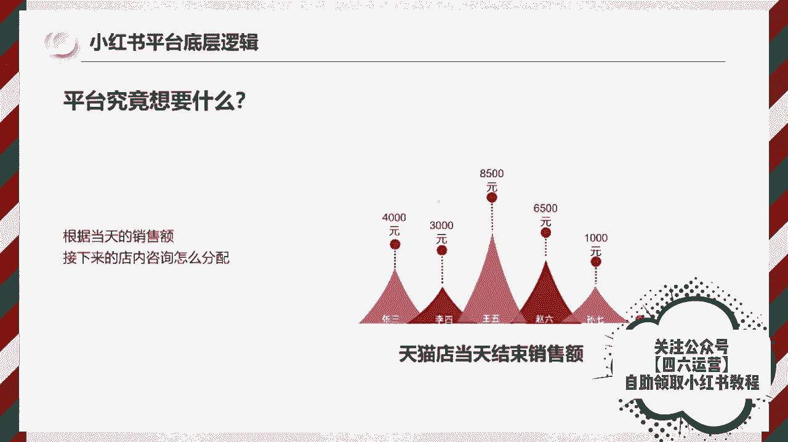

# 【150集精华教程】小红书运营新手起号 0-1新媒体运营必学课！不要荒废18-30岁，一切都还来得及 - P1 - b太和 - BV18L8teaES8

钱呢赚钱，哎，钱要不要啊钱我要啊。😡，要说最近什么项目最火啊，那就必须要提到小红书电商。最近几个月呢，几乎整个互联网都在讨论小红书电商。我关注的几个商业博主啊，包括一些付费社群都在讨论它。

我朋友圈月入5位数甚至6位数的比比皆是。这个项目在年初的时候，我其实就有让团队跟进测试，我还在市面上买了一些课程学习，到现在单人单店，一个月能做个一两万块吧。今天我就用一个视频详细的给大家拆解一下。

就是小红书电商到底怎么玩，我会把整个小红书电商的流程，包括一些注意点，比如怎么开店，怎么选品，怎么做流量，一次性给大家讲清楚，你甚至都不用再去看别的相关视频和培训了啊，你就跟着我的视频去按如佐骥。

就足够你在这个事情上开始盈利了。视频的结尾呢，我还会给大家准备一份资料，里面有我找的课程啊，对你运营小红书电商呢会有很大的帮助。有需要呢直接去拿就可以了。言归正传啊，整个项目的逻辑啊，其实也非常简单。

它就三件事，第一个呢开店。第二个选品，第三个流量。我们一个一个来讲，先说开店。呃，开店其实没什么好说的。那，首先就是打开小红书，然后点击左上角的菜单图标，再选择创作中心，然后点击更多服务这个选项。

选择店铺，点击立即入驻就可以了。你就按它官方要求的提交资料入住就行了。我居然看到有人把小红书开店包装成一个项目拿出来卖。居然还有不少人买，这也是很奇特。这里跟大家说一下，小红书店铺的两种形式。

个人店和企业店，其中个人店有两种分别是个人店和个体工商户店，个人店只需要身份证加1000保证金就可以开通了。个体工商户呢还要多一个营业执照，企业店呢就多一点，企业店有三种呃，有包括那个普通的企业店。

有专卖店和旗舰店，企业店都需要营业执照，而且还要缴纳600个年费。我们刚开始运营小红书电商的时候，你直接选择个人店就可以了。我们实测下呀，企业店和个人店一样，平台并没有对企业店有什么流量倾斜。

唯一的区别是个人店，你只能开一家，而一份营业执照呢，你可以开三个店。你一个店如果都没做好，你开再多的店都是没有用的。而且小红书电商，我觉得是。

适合店群形式去做的。这是因为小红书的流量机制，它的电商自然流占比非常低。那你铺再多的店再多的货有什么用呢？所以只要你看到有博主跟你讲什么小红书店群，我都觉得是在扯淡。小红书是要做矩阵的啊。

但不是店铺矩阵，而是账号矩阵。这个后面在流量获取那里，我会跟大家细说，开店的成本呢有这么几个。第一个就是1000钱的保证金啊，不做了可以退。第二个呢是平台的扣点营业额的5%。第三个呢是支付渠道的费用。

大概呢每单是0。7，第四个就是自己的流动资金啊，一开始大家做呢可以用无货源的方式去做？对资金要求也不高。你刚开始呢准备个20003000块完全够了。呃，开完店以后呢，我们下一步就是选品。

我们应该在小红书上卖什么呢？选品其实也简单在其他平台上的爆款大概率在小红书上也能报。目前小红书呢我是推荐三个渠道进行选品的。第一个是通过某东某宝上面找那种小红书平台调性的爆款产品。呃。

身边有做电商的朋友他自己在某宝的店铺卖爆款，搬到小红书上。第一篇笔记就开始。第二篇笔记单量就已经破百了。第二个呢是通过某音的那个精选联盟。你在某音的精选联盟排行榜，你可以看到现阶段哪些品卖的好。

只要符合小红书用户调性的产品，直接搬运测试就可以了。第三个就是某多多的这个销量排行榜选择适合小红书的类目排行榜，从中选择相应的爆品搬运到小红书整个选品的逻辑，就是我们要利用市场来帮助我们选品。

而不是自己在那瞎想，我们要借助大卖家的选品能力来弥补自己选品上的不足。所以我们只要判到一个东西啊，就是这些排行榜上的爆品是否跟小红书的人群有匹配的可能。如果有我就搬过来测一下，对吧？

相当于是借助了别人的能力来帮我们自己选品，这样反而是最快，而且是最稳妥的选品方式，肯定比你瞎测成功率要高很多。然后等你这个产品上架以后呢，就到了最重要的环节了，我们应该如何获取流量。

小红书它是个种草平台。你店铺九成以上的流量啊，都是来自你发发的笔记。这就是为什么我之前说小红书不要铺店群，而要做账号矩阵，尽可能多的发笔记耗流量。它的通路就是。用户通过你的笔记然后对你推的产品产生兴趣。

然后到达你的店铺完成购买，你堆一堆店铺，对吧？你铺一堆店铺一就还不如多发笔记，多发几篇笔记的这个效果好。所以怎么在小红书上发笔记，对吧？就是你小红书电商是否成功的关键。小红书这个平台，你直接发硬广。

我觉得效果非常差，对吧？本来小红书的这个用户群体认知就比较高。你直接发广告没有办法获得信任的啊，更不要提转化了，你发笔记的时候，一定要用一个素人的角度，你知道吧？就是用户的角度去切入。

站在用户的角度去做种草内容，而不是官方视角，这才是真正有效的。呃，这种种草笔记怎么做，其实也很简单，就是去各大平台的商品评论里找。比如某音某宝某东的商品买家秀找到好看的素材，你直接copy下来用嘛。

对吧？文案呢在买家评价上去做修改。这些买家的评价呢就是商品用户的使用体验，天然的适合用来做这个中考笔记，而且可以说是取之不尽了啊。然后呃当你单个账号的SOP跑通了是吧？我们就可以开始举阵引流了啊。

通过批量上小红书账号批量发布笔记。给我们的店铺来引流来放大。那基本上整个小红书的电商的运营啊，就是我上面分享的这些外面不管多少钱的培训啊，000块也好6000块、1万块也好，其实就是这些东西。

有些培训可能还没有讲的清楚啊。根据上面几个点，我给大家准备了一份资料，里面包括了小红书账号的起号运营的方法，以及一份小红书电商的视频课程。你如果打算经营小红书电商，你也不用看别的东西，就跟着这份资料做。

足够你开始盈利了，有需要的啊点赞加关注，在评论区回复红书电商，我分享给你。😊，🎼要有自信啊，你是最好的，知道吗？hello大家好，欢迎大家来到我们这一节课啊。那么这一节课呢我们跟大家来聊一聊小红书的呃。

我们所有人关心的一个点，也就是我们爆款笔记的一个创作问题啊，就是我们怎么才能打造出来能够可以啊产生爆款的这么一个笔记啊，那么再讲怎么去打造爆款笔记之前啊，我们先要了解一个问题，就是说呃在小红书上面啊。

就是任何一篇这个爆款笔记，它的一个产生啊，都不是说偶然性的啊，也就是说我们之前所说的这个玄学啊，不是说完全是这样的。首先呢它必须得具备一个因素，就是它本身要有价值啊。

它必须是优质的内容才有机会啊成为爆款啊，这个东西怎么理解呢？就是说我们去制作内容，对吧？你这个内容呢并不是说偏偏都能成为爆款，但是我们自己要保证我们做运营的，我们要保证一个事情。

就是我们要保证我们自己输出的这个笔记。每一篇都是优质的内容。O这优质。笔记呢就是我们成为爆款笔记的这个基本的门槛啊。可能说呃在早期2019年的时候，2020年21年的时候呢。

小红书平台呢它的用户量呢还比较少啊，所有入驻的这种博主他都能够在平台上吃到一些红利。可能说他发一些笔记啊，这些笔记没有什么特点啊，也没有什么特色，但是呢就是平台会去给他推流。

然后呢它的流量呢会不断的飙升，这个呢就是平台的前期的一波红利，这也是每一个平台在火之前，它的一个性质，所以说这个红利的话，在任何平台它都有的你像抖音刚出来，那会呢很多人都没意识到这个问题啊，怎么去做啊。

吧？为什么呃我那个时候我没考虑到去做抖音呢？为什么那个时候我没考虑到要去做小红书呢？这个其实就是平台的一个红利问题，这我们大家没有办法去避免没有人有这么前瞻性的这个视角。

你像抖音前段时间不是也出了一些中视频的这个app啊和平台啊，到现在也还不温不火的，对不对？你可能你也不知。这个平台他到底做的怎么样？我们投入了大量的精力在上面去做，它到底有没有值得我们付出的一个效果。

这就是红利，对吧？那么但是现在的话，任何一个平台，像小红书、抖音这些笔记越来越多竞争呢也是肯定越来越大的。那么平台上面所所所考虑的问题，他肯定要想的是留住用户，对不对？

他必须要去给用户推荐用户喜欢的内容，也就是说把这些真正优质的内容平台觉得优质的内容，或者说通过大量或者基础的这种流量去反馈得来的这种优质的笔记推送给用户，那么他才能把用户给留住啊。

当然这是呃我们平台的一个基础的运营规则，也有一些呢财大气粗，对吧？他可能有钱他去砸呀啊推广啊付费呀，投流啊，投这个呃薯条啊，或者说抖加呀等等。通过这种形式呢也能把笔记给引爆是吧？

但是呢这些呢对于我们普通人来讲不太合适。所以说我们做小红书笔记的一个创作的一个关键点，对吧。我们要去打到爆款，我们先要知道什么东西啊，我们先要确保对吧？首先第一个第一个要素。内容价值问题对吧？

你先要确保你提供的内容每一个都是有价值的。然后呢再配合平台的这个用户推流的呃一个流量的这样的一个叠加的态势，再结合我们这些呃我们内容上面做的这个关键词的覆盖。用户得来的这个反馈的数据。

去保证我们每一篇都有机会能够成为爆款。OK这是我们运作的一个标准。这是第一个。第二个要素是什么呢？第二个要素也是非常关键的点啊。第二个要素是非常关键的，就是我们很多人去创作小红书笔记的时候。

你要去做的一件事就是选题啊，内容选题。什么内容选题呢？就是我们要去考虑，对吧？你到底要创作什么样的一个内容才是当下平台喜欢的啊？在平台眼里是用户喜欢的，你要创作符合他们要求的这样的一个笔记话题内容方向。

对不对？如果说你只按照你自己的标准，你去像一个机械人一样啊，你去麻木的去发去创作。那这很可能你创作十0篇笔记只有那么一两篇或者说更少是符合这个平台当下这个用户他们的一个搜索需求或者观看需求的。

那么这两篇本身基数就比较少，你指望在这两篇里边再产生一个爆款，那基数更少了，对吧？你的概率问题啊，你的这个机会啊成为爆款的机会也就更少。那么选题这一块，我们要根据什么东西来做呢？首先第一个。啊。

首先第一个就是我们的什么呀？就是我们要根据一些热点来做，对吧？我们要根据一些热点，这个是在我们任何平台上面去创作。从我们做新媒体运营开始，一直到我们后期的成长阶段不断的要去重复操作的一个东西。

热点啊是我们来流量最快的一种方式。但是我们很多人他并不知道怎么去蹭热点，对吧？我给大家举个例子，假如说你想在小红书上面做内容，你就要去考虑什么呀？你就要去考虑当下人们议论比较火的这种剧，对吧？电视剧。

你要去考论大家考虑大家目前当下都在议论什么。比如说我们某个电视剧这几天播出，哎，很火，里边有一个人物啊，受到了大众的议论。你发现你一搜这个电视剧。

下面有10篇笔记里边有5篇笔记都在讨论这个剧剧里边的某一个段落和情节。OK那这个东西你是不是可以凑，你是不是可以根据它来策划一下你的内容来发一下，你是不是就有概率能挂上这个热点来给你推流。

这是一个除了电视剧还有什么呀？还有我们的呃这个小红书上面很多人喜欢的东西啊。这是我们的什么呢？就是我们的瓜O我们各种各样的瓜啊，某个地区啊，某个这个呃某个某某个某某某个某个区域对吧？

出现了某种呢大家都喜欢吃的这种瓜啊，出了什么事件啊，什么问题啊，什么明星啊怎么怎么的呀，出什么问题。那这种东西你一样可以去蹭，你一样可以去发，你可以去跟风啊，看一下这个他们发的东西啊。

你把这个话题给他蹭上，那么你的流量基数肯定不会少是吧？这个吃瓜的心态呢，在小红书上面是特别风靡的啊，因为什么呢？因为小红书上面的女性群体用户确实他占比比较多。女性用户呢平时他们关注这一点呢。

嗯兴趣也比较大，对吧？啊，就是关注各种各样的瓜，对吧？然后呢，第三点就是什么呀？第三点，还有人嘛，对不对？我们什么名人明星啊或者说某一些某个领域的这个领军人物，然后呢，除了什么样的结果。

出了什么样的一个创作。然后呢，这个人呢他最近有什么样的一个世界，然后讨论的比较。😊，多这个人你一样可以去蹭，一样也可以去挂。那么某些就自带流量，自带光环的这种人物在你的标题或者你的笔记里边挂靠了之后。

你这篇笔记呢很有可能你的流量就会出现暴增，这是一个我们啊热点这一块啊要做的一个瓜，对吧？一个人还有一个是什么呀？嗯。等会儿啊。热点我发现我的格式有问题。缩写成影视OK那这就是我们要考虑的一个是影视。

一个是人，对吧？除了人还有什么呀？还有事件，对不对？我们要去蹭一些我们可以蹭的这些事件热点事件当下正在发生的这些比较火的这些事件，我们要从这些事件当中去考虑一下怎么去把我们的内容挂靠上去。

或者说我们的笔记发一篇这样不挂靠的内容也可以，对吧？我们就发一下这个事件相关的笔记，这也是我们获取流量的一种方式。那么总的来说，在热点创作这一块，就是我刚才强调的，不管你是刚做运营，还是说你后期做运营。

那么你做热点这个东西呢，基本上是一直伴随的。你像我们抖音上很多那种特别火的啊，就是粉丝呢大概也有一个几百万，对吧？这种人呢，他只要遇到热点，他就会去蹭啊，只要遇到他的热点他就会去蹭。因为这个时候蹭热点。

基于他当前的一个数据，他又能形成一波流量的爆发。那么这些大V都在做。那为什么我们不去做呢？O这是我们要讲到的一个关于热点这一块。然后还有一个东西是什么呢？

还有一个东西就是关键词OK关键词关键词这个东西我们前面跟大家讲过关键词库是不是啊？但是我们这里要讲的关键词就不一样了。我们这里讲的关键词，你可以把它理解为热门关键词啊，热门关键词。

它我们之前所搭建的一个常尾关键词词库，对吧？这个词库呢是基于我们所有发布内容，也就是说我们去提供用户有价值的这种需求点的内容的一个方向。我们可能做某些项目，做某些产品。

我们需要去铺设这些去争取争夺更多的呃某个关键词下面的一个排名的结果和用户搜索这个需求的匹配。但是我们创作热门关键词，是我们很多自己做账号。我们想去打造爆款笔记的这样的一个自己的账号。

我们必须去具备的一个东西。所谓的热门关键词，我来给大家看一下啊。就比如说我们现在打开小红书啊，这是我刚才打开的一个界面。呃，我们去创作这个关键词哈，我们去创作关键词。比如说我们现在呃搜索一下，对吧？

我们搜索一下就这个考研啊，我们输入考研。我们会发现下面会给我们推出来很多很多这种对吧？搜索词是不是这种搜索词从前到后我们可以默认理解为它有一个基础的一个排序的需求。那么平台这一块肯定会去做的啊。

我跟你们讲，平台肯定会在对这一块搜索词的一个展现，有这样一个呃排序的一个需求。因为怎么呢？他要去匹配用户的搜索需求，他就必须得把大众用户比较关心的内容往前靠，对吧？这样才能匹配用户的一个需求。

比如说假如说当前80%的用户，他在搜索呃考研准考证打印的这个词，那么你把这个词放在最下面，那么用户在上面呢，他就会他看不到下面的内容，他不会去浏览这么多，他可能继续打，对吧？考研他会去打准考证。啊。

对准考证打印OK那么这个过程当中就增加了用户的一个什么行为啊，输入的一个行为。那假设说你现在考研准考证打印打印排在这个第二啊，就这个词下面排在这个地方。那哎我这个地方好像显示不全啊。好吧，我说一下。

OK那么假设说现在用户搜索的这个考研，考研的准考证打印排在这个地方，那么他就不需要他只需要输入考研。O后面的内容他不需要输入了，他只需要点击一下这个东西。O那就进入到了他想要的一个搜索结果。

那么这就是关键词默认的一个他就会有一个这样的一个排序的问题。平台不可能考虑不到这一点。虽然说很多平台他不会承认这个东西啊，包括我们以前做百度搜索引擎的时候，百度也不会承认他有这个东西。

他会说因为我的这个呃搜索词下拉框啊，我每隔一段时间我会更新。然后这个地方没有排序。但是呃从我们运营的角度来讲，这个东西是不存在的。假设我们来做这样的一个产品研发。

我们就必然要考虑把用户最需要的东西放在前面给他看O那么这是我们所关注的一个考研。也如说我们假如设说我们现在做这个内容，我们就得考虑用户他去搜索的一个内容，对吧？需要准备什么物品报班有必要嘛？全流程。

那么这些词就是我们优先去创作的内容，我们就可以围绕着考研需要准备什么物品，我们来创作他三篇笔记啊。然后报班有没有必要，我们来分析一下啊，分析一下2023年的考研趋势到到底有没有必要报班。哎。

考研的全流程怎么怎么的，我们围绕着这些东西来创作我们的一个笔记，来创作我们的一个内容。这就是我们要考虑的一个热门关键词。那么除了这个地方，还有一个地方啊。呃，还有一个地方就什么呢？

就是我们的一个笔记的创作灵感了。这个搜索发现我之前跟大家讲过了啊，其实就是我们的热点事件了啊。😊，然后呢，我们的这个创作灵感呃，比如说在这个地方，我们在这个地方呢去挂靠一下啊。

这个地方呢虽然说虽然说这是官方推出的一些话题。呃，我们不一定能挂靠上，但是你挂靠的时候呢，他会给你一个基础的流量奖励啊，你发布的笔记在这个地方他会给你发一些流量的奖励，有时候呢。

假如说你的笔记质量还可以。他给你的这一波流量奖励。不管是200500还是1000都能够给你的笔记带来一定的增议啊，一定的增议。假设说你这个笔记质量还可以，也没有违规。然后呢。

官方的给你的流量券你又彻底用上了。那么你的这篇笔记就可能对你的账号造成呃形成形成一个很大的一个提升。O这是创作灵感这一块，我们现在很多人应该大概都知道这个东西，但是用的人依然不多。因为怎么呢？

因为很多人觉得这个东西他没有用是吧？我告诉你啊，这个东西他不一定没有用，只不过呃这个东西呢官方在给你用这个东西的时候，挂靠这个东西的时候。

他会考虑会有一定的审核的要求和基础和门槛O但是你一定要去尝试这个东西。O。这是我们的关于创作灵感这一块，以及我们关键词选题这一块啊。其实呢关键词这一块我们之前还跟大家讲过，还有很多的内容，对不对？

比如说我们还有二级二级关键词，三级关键词。比如说我们刚才搜的考研，对吧？那么考研准考证，假设我们现在呃考研下面有这些词，我们现在来搜考研准考证。我们看一下下面给我们提供提提供什么打印下载。

可能中怎么打印啊。这个嗯这我只是给大家展示一下啊，但是虽然这个词它没有意义。但是呢我们再把这个词输入之后，它下面提供的这些下拉词，它本身就是我们的一个二级词，甚至还有更多的，它会有三级词。

是不是我们来搜一下啊，全流程，我们来看一下。24、在职专科生、艺术类、会计、花费本科生，这是不是就是我们的另外一个方向，对吧？我们刚才考研没有这些内容，那么你围绕着考研来做。

你围绕着考研全流程来做这些内容，这就是你的一个创作方向啊，这是我们的二级词，还有三级次，对不对？在职。在职科目呃在职考研全流程规划，在职考研全流程报名要求，这是三级词，对不对？这就是我们去考虑选题。

考虑创作内容的时候，我们的一个基本方向。也就是说你要迎合平台的一个需求。平台展示了用户最需要的内容，你就要根据用户最需要的内容来创作你的内容，你才有机会怎么样去呃蹭上这个热点，或者说你才有机会成为爆款。

OK。我们这里给大家写一下搜索词。啊，我这我写清楚一点啊。一级搜索词。二级搜索词。然后呢，还有我们的这个创作灵感。对吧。这个地方呢我把搜索发现加上吧。其实呢它就相当于上面的一个事件的一个综合体。O。

那么这就是我们创作爆款笔记的第二个要素内容选题。OK那么下一节我们再跟大家讲一下我们创建爆款笔记的一个关键的东西，几个关键的东西，封面标题，还有文案到。hello，大家好，欢迎大家来到我们这一节课。

那么上一节呢我们跟大家聊了一下小红书爆款笔记创作的这样的一个呃核心点，以及我们创作的一个方向和内容选题。这一块啊，就是能够产生爆款的这些基础的东西。呃，那么如果说呃我们真正的要去打造一个爆款笔记的话。

除了我们的方向和我们的价值之外，我们最需要的还有几个点是什么东西呢？这是第一个是我们的封面，对吧？啊。第一个封面对吧？我之前呢在这个课程当中跟大家讲过啊，小红书这一块呢，它跟抖音不一样。

抖音的这个封面呢可能在主页上面体现的还比较明显。但是呢在正常的内容当中呢，现在可能短视频这一块就靠前面的3秒3到5秒来吸引观众，对吧？但是我们小红书笔记不一样，它是靠什么呢？

它是靠你的这个封面标题这些东西来结合产生你这样一个内容的一个点击率。我们抖音呢都是啊内容主动的推送到用户的手上。也就是说不管说它呃对这个东西感不感兴趣，它最它至少要停留那么个一秒1秒到2秒的时间。

而我们小红书不一样，小红书的笔记它是通过瀑布流的形式展现的。那么所有的笔记呢都放在一个界面当中，我们可以来看一下。小红书的所有内容它都放在这一个界面当中。那么用户在这个浏览的界面当中呢，在这个界面当中。

也就是首页他去刷这个内容的时候，如果说他不产生点击，他对你的内容是不可能有任何的这样的一个创作价值的，或者说互动价值的，只只有他对这个内容产生了点击行为之后，后面的停留时长，对吧？点赞互呃。

这个收藏评论等等这一些内容才能成为用户对你这篇笔记的一个互动收益。所以说怎么说呢？所以说就是我们的封面还有标题，就决定了我们这个笔记到底能不能被产被产生这样的一个点击行为。那么封面它有多少种创作形式呢？

我们总结下来就是首先第一个啊。封面的创作形式啊，第一个就是一张图OK这是一张图。然后呢，还有就是拼图对吧？拼图形式。然后呢，还有是什么呢？有文字的。他有是没有文字的。

那么这几种是我们小红书上常见的这种呃封面的形式。一张图的话，那么假设它呃有文字啊或者没有文字，我们来看一下，像这种。

这种你们觉得它是有文字的还是没有文字的呢？就这种封面。啊，其实我们看起来这种封面的话，你可以理解成它是有文字的。因为正常我们在刷这样的一个那种这个手机屏幕界面，然后呢，我们看的是这个封面里边的文字内容。

在武汉寻找30岁什么什么的呃，这种这种姐妹，对不对？那么这个东西呢呃用户关注的是这个点，他关注的是文字区域，它不是关注你这个手机O他先是通过你这种只不过说这个东西呢，这个封面呢。

它通过这样的一个手机输入这样的一个形式呢，让别人能吸引别人的一个目光来产生这样的一个点击行为。但是真正能让他去对这个笔记，感兴趣的时候，感兴趣的点还是在于其中的内容。然后这个呢。这个就相当于是什么呀？

这个就相当于是没有文字的，就一张图，对吧？这个就是一张图OK这个是一张图的形式。然后呢，这个是什么呀？这个是就是纯文字的对吧？这个相当于是纯文字的。纯文字的形式。

我们也可以把它将它理解为有文字的形式的一个封面。那么这个封面就是通通过什么东西来吸引别人感兴趣，就是通过醒目的标题这种形式来告诉别人我这篇笔记有什么样的价值，我能提供什么样的内容。

OK我下面还列了这么多的表，这个每一个地方啊列表每一个里边都包含了你想关注的这个节点。OK让他们来关注这个东西，最后呢产生一个点击行为。那么这个也是一张图，我们来看一下有没有拼图啊。这个算不算拼图呢？

其实这个也算啊这个也算拼图。啊，也算也算一个基础的拼图。然后的话呢我们再看一下。拼图我们直接来找吧，对吧？我们来搜索一个词儿。穿搭唉穿搭这个领域呢拼图应该是比较多的啊，比较多的，比较流行的一种方式。

也就是把各种样式的衣服展现在我们的封面上面，去让大家去看哎，让大家去看。那么这个形式呢就是呃内容展现的会比较多。你像这种拼图，对吧？这种拼图九宫格四宫格，还有这种呃六宫格的等等等等，非常多啊，非常多。

我们具体采用哪一种形式，怎么去搭配，怎么去让我们的封面能够产生，让别人去有兴趣点击的这样的一个行为。我们要要去要去策划一下这个东西啊，要去策划一下这个东西，我们往上面去翻啊。我们拿这个标题。

拿这个封面来举例啊。拿这个封面来举例，我们假设啊我们拿这个东西来来做一个对比。我们假设现在你发的啊东西啊，一个穿搭或者怎么样的啊，这个东西这个这个封面，一个穿搭的这个封面。

那么你上面的标题写的不是特别好的情况下，你的这个笔记出现在首页，O出现在首页，那么如果说他是对穿搭感兴趣的或者怎么样的。你觉得这个标题啊，这个封面有没有可能吸引他的兴趣，让他通过封面来产生点击行为呢？

对吧？我们先不考虑标题，我们就来看封面，就这样的一个封面，从穿搭的角度来讲，他有没有可能吸引取别人的一个点击的这样的一个兴趣。就是说哎这个这个封面还挺还挺有意思，里边的内容还挺不错。哎。

我想我想点进去看一下，他讲的是什么？从图片的角度来讲啊，从我们运营的角度来讲，这样的一个呃封面啊是不太够的啊，是不太够的。因为什么呢？因为这样一张图表达不出来，我们要表达的什么具体的一个意思。

那么用户呢他看完了这个封面他不懂，他就要去看标题。对吧他就要去看标题。那么假设说你这个时候标题没有吸引起别人用户的兴趣。O这个点击就肯定是没有了。那么这个点击行为没有了呢，我们就缺失了一个数据是吧？

那假设我们来看右边这个右边这个呢它是采用拼图的形式，有文字的一个形式，秋冬保密羽绒服穿搭O那么这个图片首先吸引起用户的就是各种各样的这种衣服，在这个上面展现，可能它这个还有点密密麻麻了，还比较小。

它主打的一个什么呀，主打的就是一个量，我给你很多的量的一个推荐啊，那么这个呢就能让用户在看到封面的时候，哦，这个笔记它是讲这个羽绒服穿搭的，那么它就会对这个笔记产生一定的兴趣。首先在封面这一层。

它产生了兴趣。然后其次它还会再去看你的标题O。那么他还会去看你的标题，不会说因为你的这个封面呃优质或者说戳中了啊，除非说啊除非说你这个封面直接戳中了他的一用用户的一个需求点。

上面也有文字或者什么样的内容，他才会直接点。那么大部分的用户他会看一下这个封面，然后再看一下这个标题O这个标题和封面唉差不多的吸引入的兴趣，他才会去产生点击行为。那么也就是说我们做运营在这个地方。

大家可以理解一个思维，就是我们尽可能的减少用户去分析我们内容的这样的一个时间维度。我们要让他刷到这个最显眼的这个部分，一眼就看到我讲的是什么，我这个点能戳中你的需求。那么我们就能大幅度的提高。

我们这篇笔记的一个点击率。所以说封面的创作技巧，就展现在这里。你要怎么去想办法让你的封面，让别人看起来能看得懂你讲的是什么。而且你这个封面里边的内容是用户喜欢的，这就是我们关于封面这一块的一个创作技巧。

真正的封面做起来呢？其实并没有那么多，我们一定要讲究做的多。多么多么好看，我们一定要保证的是什么？一定要保证的是在你的封面上面，你要让用户能够一眼看清楚你的一个需求点，对吧？那假设说像这个。

像这个这个这个图片对吧？这个封面如果说不从穿搭这一块去考虑，可能用户关注的是什么呀？关注的是它的一个风景和它的一个拍照去了，是不是？那这个是用户的一个关注的点焦点，用户的关注的一个焦点行为。

那么到下面标题上面这块才会显示什么？小个子1。5米穿搭分享合集。那他这个标题他Q了人群，对不对？他去锁定了人群，一个是小个子对吧？一个是1。5啊，还有一个是穿搭，穿搭是他的主题，那么小个子呢是他的人群。

1。5米就是啊跟小个子是一样，他锁定了对应的人群。那么这些人群看了这个标题之后哦，明白他这个是展示这个小个子穿搭的，哎，他得点进去看一下，我是一米5米的身高。

我到底我能不能拍出呃穿成这样拍出他这一样的一个图片的一个效果，这是用户关注的一个焦点行为，对吧？那么如果说你创作的内容是关于知识分享一类的内容。那么你就更要考虑你的封面能不能吸引起用户的一个兴趣行为。

对吧？假设说这个新。手如何拍短视频，对不对？那么呃用户扫到你这个封面的第一眼，他看关注的是什么呀？他关注的是这个地方，对吧？他关注的是这一句话，他关注的是新手如何拍短视频。

O你这个标题能不能让用户感兴趣。我假设说我对新手怎么拍短视频比较感兴趣。我最近想知道这个技巧，那么看到的这篇笔记，他第一眼刷到的这个点，他就会去点产生点击行为。然后呃下面的这些内容呢起到什么作用的呢？

下面的这些内容起到就是辅助作用，其实他看的并不是特别清楚。他点进去了之后，他才能把这个东西呢看的特别清楚，甚至说去翻译，他还会期待你后面提供更多类似的这样的一个技巧啊，知识点啊。

比如说呃拍摄的镜头选择对吧？拍摄的环境，拍摄的灯光，他都想他以为你提供的这些东西，就是通过这个封面这样的一个技巧，去让别人产生这样的一个呃疑虑。O这是我们呃做封面这一块的技巧啊，知识分享。

像我们很多呃考研的对吧？培训的，然后。考的还有很多很多领域的这块跟知识挂钩的。还有我们AI培训的这一块，他们做的基本上都是这样都是要这样去做。你不这样去做的话，你的内容吸引不起用户的一个兴趣，是吧？

这是我们关注的一个点。然后呢，像这个呢是不是像这个呃这也是一个穿搭啊，做的一个穿搭的一个封面，哎，艺术感比较足。那么这个封面怎么去锁定这个穿搭需求的一个人群呢，对吧？他可能是什么呢？

就是很多人他刷到这个笔记，哎，也就是说首页推荐啊，首页推荐刷到的这篇笔记，哎，这个衣服的款式，我还挺喜欢的，我就想进去看一下是吧？那么这个封面就是用户他看的是什么？他看的就是这个衣服，哎。

他喜欢这个衣服，那么这个笔记用户想看的是什么？他想看的是羽绒服的穿搭对吧？他想看的是羽绒服的穿搭，这两个需求点是不一样的。而且呢这个笔记呢，他本身啊，你看一下这个呃什么什么到底怎么了清仓价几乎一折。

O他就是跟衣服相关的，这是一个牌子嘛，对不对？他就是跟这个衣服相关的内容，用户看的不是穿搭，他看的是这一款衣服，哎，这个衣服好看，我想进去看一下这个衣服呃，姐妹们评价怎么样，对吧？在哪里呃。

有这个渠道优惠等。等等等。他关注的是这个点。OK这是我们创作封面的一个技巧。嗯，像这个艺术感呢啊这个传达啊，很多这个这种的内容，我们自己去做内容的时候，我们就要考虑这个问题。

我们这个内容到底有没有办法做的，让用户能够对我们的封面产生兴趣点。那么之前呃其实跟大家提过，就是我们在小红书上面呃这个首页的结构。我们刚刚也讲了嘛，对吧？我们在首页刷到这些笔记的时候。

用户产生点击行为或者吸引他目光的行为，一定是先是封面，再是标题啊，先是封面再是标题。所以说你做好封面，你才能去吸引用户来对你这个笔记产生第一步兴趣的一个关键的点啊，关键的点，那么这几种形式呢。

你可以结合你自己的这个内容来看，我们通常会怎么做呢？呃，如果说你没有办法确定，我们通常就会通过呃我给大家的一个呃对标账号的分析表格，我们先去找这种数据比较好的账号。

把它的这个账号里边的呃笔记热门笔记的一个形式，把它列出来，对吧？呃，截个图，然后呢我们再去看一下他的主页提供的是什么样的内容，对吧？我们看一下它主页里边呃讲的是这他的这个封面是怎么做的。

它的主页的这个格式风格，有没有办法吸引我的兴趣来对这个账号产生一个关注行为。然后再从这个账号里面获取知识点，这是我们呃策划的一个是封面，第二个是我们主页的一个风格。OK这是我们讲到封面这一块创作。

大家一定要注意的技巧。很多人呃去做封面，走了一个弯路是什么呢？他就是考虑什么呀？好不好看，对吧？我这个封面做的好不好看啊？他关注的不是我这个封面有没有给用户提供需求啊，好不好，还好不好看？这个东西呢。

说实话每个人有自己单独的一个审美，我们不能在这个地方去呃死磕，对吧？呃，真正的好看，在我们运营看来的一个好看，就是要把用户需要的点凸显给他？所以说我们之前很多呃人问哎。

这个为什么呃我是我们公司有设计人员，但是为什么这个图他就总是做不出来我想要的东西，甚至还赶不上我自己做的，这就是我们运营的一个视角，对吧？这就是我们运营的。

视角和其他人的视角问题。OK运营运营的视角永远是从什么呀？永远是从我们的这个用户的角度去出发的啊，包括我们以前呃做这个搜索引擎优化的时候，就是说我们做网站，我们就会会去关注一个东西，叫做热点分析图。

比如说我们打开一个网站，它有头部有尾部有侧边左侧右侧，我们会去通过一些数据去分析用户点进我们的网站之后，他点住点哪些地方的按钮点的比较多，它在哪些区块去停留的时间比较长，它的鼠标在哪一块呃来回的去滑动。

那么通过这样的一个分析数据。首先呃热点的关注，首先是在最左侧内容的最左侧，然后以及第一屏的最上层，这是用户关注的点比较多的啊，所以说我们包括我们现在对吧？我们现在的这个对象挪到了这个app上面，对吧？

我们运营的对象挪到了这个APP上，小红书和抖音上面对吧？抖音就不说了，小红书我们关注的第一点，首先焦点肯定在这第一屏嘛，对吧？焦点肯定在第一屏嘛，然后我们的视线是怎么样？我们视线是从上。到下啊。

用户的视线是从上到下来关注的内容，他心里会默认有一个排序的一个感觉的。OK那么我们就要怎么去呢？我们就要在用户目光最吸引的地方，通过这样最大板块的这么大面积的一个东西去抢占用户的一个视觉焦点。

这就是我们封面营销的一个呃关键的东西。OK那这是我们呃讲的弯路啊，这个弯路其实还没讲完啊，刚才讲岔了啊，就是弯路这一块呢其实一个是好不好看，对不对？还有一个什么？我们很多人做封面的时候，还有一个什么。

就是胡乱堆砌啊。😊，啊，胡乱堆砌，就是把一些杂七杂八的没有用的东西啊。比如说他会考虑把这个封面上面，因为我放很多好看的小娃娃，小熊在这四四周啊，做一些装饰啊。

做一些什么东西的来让我这个东西看起来封面看起来很可爱啊，这也是一个呃我不能理解的一个形式啊，就是你加了这些东西呢呃用户的视角看起来他没有办法集中在这一个点，他会被你这些东西去分散。

分散的目光呢就导致你这整个东西啊，就用户看起来很杂乱，他找不到他自己要看的焦点，这是胡乱堆砌。然后呢，还有一些人犯的错点，就是他在这个封面上放了文字，对吧？假设他放了文字。它的这个文字呢放的特别小。

对吧？它这个文字放的特别小，对吧？那么如果说你考虑一下，以你的一个角度，呃，你这个封面对吧？我们来截个图哈，假设说这个这个是我们的封面，对吧？你的你的这个封面放到这个上面，你只能放到这么一点。

那么他看不清楚你这个内容的时候，他就不会花时间在你这个笔记上面停留，是不是？那么你把内容放大，对吧？你你把内容放到这么大，比如说这个封面我们来给他截个图演示一下啊，我们把它放到这么大。😊。

我们把它放到这么大啊，对比一下我们刚刚的用户看过去，一眼都能看到你这个内容主题讲的是什么啊，他不需要去费神的去分析，去聚焦会神的去看一下这个封面上面讲的是什么。那么这个也缩短了用户的视线。

聚焦在你封面上面的一个时间点。既然你放的东西，你而且你的这个内容呢放的还可以，你的文案写的还可以，也挺吸引人的，你就要想办法让这个东西让用户能够一眼去看清看清楚看明白，这是我们做这个封面要注意的几个点。

OK那么这节课呢呃虽然说我们没有带大家去走一个封面。但是我相信如果说你以前在封面上面有这些误区的。那么经过这些对比，还有我们讲解它背后的原理，你应该能够知道做一个什么样的封面足够是足够吸引人的。

O那么这是我们这节课分享的一个重点。下节课我们继续讲标题这一块和以及我们文案这一块到底怎么创作。hello大家好。那么我们这一节课呢就跟大家讲一下标题这一块啊，非常非常的重要。

那么呃我们一直都说从我们运营的角度来讲啊，如果说你不做标题等，那么你就不是一个好运营。我们所有人呢去标题，对吧？我们标题吸引用户，吸引用户的一个对你内容产生的一个产生兴趣的这样一个点击行为。

都是从什么呀？从标题这一块去引起的对吧？一个好的标题能让用户对你的这个内容产生点击，然后呢，你再把内容做好用户才能对你的笔记形成一个互动的行为，点赞收藏、停留时间，以及进入你主页的这样的一个页面的数量。

对吧？这些都是我们要去经营的第二个步骤，也就是我们的标题，那么标题呢有很多的创作方法，其实呢呃我们很多人在写标题的时候，他可能会疑惑到底这个标题该怎么写，啊，我们有没有什么样的方法。

那么这里呢我就给大家分享几个我们能够去套用的这样的一个公式，就能够写出来比较吸睛的这种。标题OK。首先第一个就是我们用的比较多的啊，就是数字加上我们的一个产品。

或者说加上我们要跟这个用户讲的一个核心的一个点啊，也就是我们的主题。然后呢再加上一个什么，再加上呃用户呃，就是我们这个内容提供给用户的一个好处啊，我们来看一下啊。呃，就是呃数字对吧？

然后呢加上我们的一个。加上我们的一个主题。再加上就是。好处OK可以这样理解。那么怎么怎么去怎么去怎么去讲这个东西呢？就比如说啊。10种啊1种简单的方法，快速提高我们的英语口语。

1种简单的方法快速提高我们的口英语口语。OK我们来看一下啊。10种简单的方法，快速。提高我们的英语口语啊，这是这个结构我们来拆分一下啊。首先数字十啊10种啊，这个是我们的数字配合啊，我们来拆解一下。

然后呢加我们的主题就是简单的方法，提高我们的呃简单的方法啊，简单的方法。10种简单的方法，我们的主题就是方法。然后呢，好处就是能够快速啊快速提高啊，快速提高英语口语，这就是我们的这个结构。

如果说你创作这样一个标题，你用户关注的焦点在哪里？用户关注的焦点在哪，我们来拆分一下，一定是首先10种简单的方法，对吧？他要看的是哎有10种方法可以提高英语口语，那么他才会去对你这个笔记产生兴趣。

然后进去看一下到底有哪1种方法，O这是我们要讲的第一种啊，是我们的数字加主题的一个形式。然后我们的第二种呢就是呃加上一个疑问句啊，疑问句。比如说呃怎样啊，然后呢再加上我们呃期望的一个这样的。

一个就是能够给用户提供的一个结果。我先把这个写出来啊。比如说怎么样对吧？然后加上呃我们的一个呃期望结果。啊，期望结果。然后我们举个例子啊，就是怎么样用3个月准备马拉松，并且成功完善啊。怎么样用3个月。

准备。准备马拉松比赛。并且。成功完赛okK其实呢这个里边也还有一个还有一个东西叫什么呀？它里边还有时间，对不对？嗯。这里边还有时间怎么样对吧？是我们的疑问句。

怎么样是不是可以拓展出非常多的这样的一个标题的模式，对吧？用时间3个月OK然后呢，我们的结果就是准备马拉松比赛，并且完成。完成完完成比赛，这是我们要提供的一个标题。我们吸引用户的点在哪里？

我们吸引用户的点在哪里？首先马拉松比赛完赛啊完赛这个是我们用户关注的节点。假设你现在想要参加马拉松比赛，你肯定要考虑我要准备，对吧？我还要完赛。

那么我要提供给你的就是怎样让你在3个月的时间之内能够准备好一场马拉松的比赛，并且成功完赛，这就是我们这个标题带给用户的一个价值。好吧，那么呃我们再再讲第三个。

这是我们首先呢提供一个呃引人入胜的这样一个就是能够吸引用户的人一个兴趣的问题点，对吧？加上什么呀？引人入胜的一个问题点，加上这个问题可能造成的一个影响。嗯。我们来举个例子。

你知道为什么智能手机越来越大吗？背后的一个科技趋势分析。OK我们来看一下啊，你知道。为什么？智能手机。越来越大呢。背后的科技趋势解析。我们来看一下啊，首先问题点是什么？你知道为什么智能手机越来越大吗？

啊，这是一个问题，对吧？你知道为什么手机越来越大嘛？你知道为什么现在的火车速度越来越快嘛？对吧？你知道现在房价为什么越来为什么现在房价越来越高吗？背后的产业链啊以及等等等等，这就是一个标题的结构。

我相信你们平时应该没有少看啊，没有少看。就是这个地方呢，其实是呃给出结果给出结论啊，让用户呢能够对你的标题产生一些兴趣。到底为什么这个事件它是因为什么导致的？这是我们提供的一个标题的结构方式。第三种。

好吧，我们再来看第四种。第四种的话就是呃先放放上用户的一个痛点。先放上用户的一个痛点，或者说什么呢？呃或者说是。需求对吧？或者说是需求。然后呢，我们再加上我们自己的一个什么东西啊？

我们提供给他的一个解决方案，对吧？我们把用户的痛点在这个地方列出来，标题的前面列出来，然后我们再告诉他这个东西这个东西这个问题怎么解决？比如说。工作压力大，如何调整？5个实用。的心理学技巧。分享。

5个实用的心理学技巧分享OK。我们来看一下，首先第一个是用户的痛点，工作压力大对吧？工作压力大。那我们呃假设把这个地方换一下，对吧？用户的痛点就是说呃经常头痛怎么办是吧？呃，或者说呢呃。呃。

和男朋友吵架，经常和男朋友吵架，三观不合怎么办？然后后面再加上我们的一个解决方案，这是我们最常见的一些标题的写法啊，最常见的标题写法，就是后面加上我们的一个解决方法。其实我们很多人在做运营的时候，呃。

我们写的标题呢基本上都去于后者就是先列出用户的痛点或需求。然后呢再提供解决方法。用户的痛点需求，这个东西，你们再去分析一下，是不是跟我前面跟大家讲的这个关键词，长尾词这个东西比较对应啊，对不对？

那么这个关键词呢，第一个是可以得到一个搜索展现的一个结果的可能性。第二个呢就是让用户能够对我们这个内容呢，它能够通过标题知道我们讲的是什么。然后呢再通过我们后面写的这个解决方法去让它产生点击的行为。

这就是我们去写标题的一个呃公式，很多人呢写标题写的特别普通，一点吸引力都没有。那么你的标题没有吸引力，你怎么才能让别人啊去用户去产生点击行为呢。那我们之前说对吧？你的内容。推送给你的这个精准的用户面前。

你要想让他去产生点击行为，不是说推送给他了啊，你的内容跟他相关，他就能产生点点击行为。那一定是我们前面要有一定的引导，对不对？不管是封面也好，还是我们这节课讲的标题也好，你都要把这些细节做好啊。

那很多人说我的内容做的很好，就是产生不了点击行为。那你要看一看你的选题，你的封面，你的标题，这些点，他有没有出问题呢，是不是所以说我们运营呢其实讲到一个点，就我们运营呢做的基本上都是细的。

不能再细的一个工作的。有时候呢就我之前呃去让一些设计呢，做一些图片做一些这个呃就是海报等等等等啊，就可能他做的很多版都不能如我的意，可能我把这个文案需求点啊，我把用户关注的点给他标明了，我让他这样去做。

但是从设计的角度来讲，他就考虑美观问题啊，你说的这些东西，他不懂他不懂什么是用户需求。他也不懂这些东西为什么要放在这里，明明放在那个地方更好，为什么要放在这里呢？其实从我们的。角度考虑。

我可能是只想让用户对这个东西快速产生吸引力，然后让他对这个东西产生点击行为，然后才能进行我下一步对他的这个呃营销的一个目标。O那么其实写标题呢还有很多很多啊，呃像我们呃加上这个时效性，然后加上主题。

然后呢通过这个否定形式，再加上我们常见的这种观点和误区。比如说为什么你不应该每天运动啊，运动的一个科学的分析，科学运动的一个解析，对吧？就是这种使用否定形式来打破我们认知的一个常规手段啊。

也就是反问上的一个句式啊，来告诉人家让别人对我们这个内容产生兴趣。再比如说我们还可以通过对比，对吧？两个极端的一个选择，早起还是晚睡生产力专家的一个最佳的建议，对吧？

就是通过对比的这种手段早起还是晚睡啊，早起还是晚睡这个东西呢观观念，让用户呢产生自己我的一个分歧行为，然后对你这个内容产生一。兴趣。哎，结合他自身的一个需求。比如说可能很多人喜欢晚睡，对吧？晚睡的话呢。

就意味着什么？就意味着可能晚起，对吧？早睡呢就意味着早起到底这一块呃晚睡有多大的伤害。我晚睡对我有没有很大的影响。我早起我有什么样不一样的这个呃收获等等等等。这样是激起用户对这个东西的一个好奇心是吧？

所以说我们写标题一定要运用合理的运用一些方法，而不是说我们自己去呃类似于口语化的东西，把这个内容写出来啊，这个东西这样写肯定是不行的，好吧，那么标题这一块呢。

我们之前跟大家分享过一个45套万能吸金标题啊，45套的一个万能吸金标题就这个呃你结合着这个工具的话，你就可以在里边去把我们很多呃内容放进来。

把我们的很多行业里边的东西套进来啊，怎么去把这个东西呃结合就写标题呢，也能有一个比较快速的这样一个写标题的一个方法。那么这是一种现在这个内容呢也进行了一个完整的一个更新。

就是结合了我们更多当下比较比较热门的比较热门的点和一些平台的一些调性，我们做了一个简单的更新。然后呢还有呃我们这个这个什么这个什么呀，我们之前跟大家讲的这个AI创作对吧？AI创作标题这一块。

就是很多人用AI写标题呢说实话他还是缺少了一定的判断力。因为我们我见过不少啊写标题的，用AI写的标题，就一眼能看得出来，没有任何营养，没有任何价值，可能从他的角度来讲，哎他觉得这个AI写的标题还可以。

但其实从我们运营的角度来看，这个标题有很大的问题，词用的不对啊，情景用的不对，还有这个方式用的不对等等等等，让人一眼看起来就可能很尬，甚至很搞笑的一个程度啊，所以说我们写标题这一块。

你要有一个运营的基础判断方法。那我们用这些东西，为什么我们要用数字，为什么我们要用这样的一个。😊。

合适为什么我们要用疑问句，这些东西都是有原因的。好吧，我们要去研究背后的原因，然后再结合我们这样的一个呃运营的一个技巧，再把它落实到我们真正的操作当中。好吧。

那么这就是我们这节课跟大家分享的一个标题这一块的一个内容。好吧，那么下一节课我们就正式开始讲内容到底应该怎么做内容的结构到底应该怎么去规划。

OK好，欢迎大家来到我们这一堂课。那么呢我们在上一堂课当中教大家去学习了小红书的一个账号的运营。从零开始。也就是说我们刚起号开始，一直到我们确定了可以发布内容的这么一个阶段。

一直到我们去爆款的这样一个阶段，总共的一个四个步骤啊，第一步呢是去做定位。那么定位呢也就是打造我们的人设，对不对？让平台给我们打上一个垂直标签，知道我们是在这一个领域当中的一个优质博主。

那么能够把我们的笔记推送给我们希望看到这一类笔记的这样个人群。那么这是定位的一个作用。那么第二个我们讲到的对标账号。那么对标账号它的作用就是让用户啊让我们知道我们的用户是喜欢什么的。

我们的平台希望我们发什么，那么这些内容我们都可以通过对标账号，啊，也就是我们去找到的在我们这一行业这一领域当中做的比较好的这一类账号。他们当下。那些数据好的这些笔记。

我们通过这些内容可以分析得出这两个点。那这也是我们后期要创作内容的一个方向，或者说我们长期的一个参考拓展啊，也就是说我们后期需要在这方面去完善的一些东西。那么第三个就是选题。那么选题呢。

它其实是我们第四步，也就是做内容的一个前置的第一前置的步骤。也就是说我们做内容一定是有依据的。也就是说比如说我今天想发一个内容。那么我一定是自己心里要清楚哎，这个内容它有什么样的一个参考性。

这个内容是不是用户喜欢的，或者说这个内容是不是当下平台希望我们去发送的这样的一个内容。好，那么这就是选题，选题这一块非常非常的重要。也是我一直强调的就是你的笔记，你的账号啊。

有些人啊可能说他在垂直领域已经做的还不错的。但是他领域啊定位也做的非常不错。但是他确实不能出爆款，可能的原因就在于你的选题出了问题。那么选题这一块我们告诉大家就是你一定要明白自己今天发的笔记。

他有什么样的一个意义，而不是自己单独想发什么就发什么。好吧，那么这个是选题，第四个我们讲到了就是内。内容内容这一块，我们聊到了封面是特别重要的一个步骤，对吧？封面呢是起什么作用？

它是起到吸引用户眼球的一个作用。我们补充一下。吸引用户眼球的步骤。那么标题标题是对我们这个内容，也就是说你的封面唉，让用户有眼前一亮的感觉。他注意到你了在这么每一个屏幕，小红书的一个屏幕当中。

现在有4个笔记能够给你看到，对吧？4个到6个的这样的一个样子。那么在这几个笔记当中有一个笔记通过封面唉吸引到了用户的眼球。那么第二步就是用户他会去注意你的标题，通过标题来判断你这篇笔记是关于什么内容的。

对不对？那么就第二步就是判断。这一篇。笔记的内容是否是自己感兴趣的啊？是否是自己感兴趣的。那么第三步呢就是唉前两步没有问题，我们吸引了用户的眼球，也吸引了用户的呃目光兴趣。

那么接下来就是让用户产生点击行为。他点击了你的笔记进去之后，还开始浏览你的什么东西啊，一个封面后面的个图片，对不对？然后还有你的文案。那么这两个步骤文案以及具体的内容，他决定了用户是否。啊。

决定了用户是否对你的笔记。点赞收藏。以及关注等行为。那么这一套流程下来。如果说你前面两个步骤没有问题。那么到了第三步，你在内容策划这一块没有太大的问题的时候。

你这篇笔记对当前用户的一个吸引的价值就完成了。他的点赞收藏，还有关注等等行为，以及评论哈，以及评论等等行为，就会让你的这篇笔记进入下一个推荐谁。也就是用户他判断用户行为的时候啊。

也就是平台他在判断当前这个用户的行为的时候，觉得这个用户是喜欢你的内容的。那么平台认为你的内容它是有价值，或者说他是认可的，就可以把你的笔记往后面去推送更高的流量值。

这就是我们整个小红书运营的一个完整的体系。当然，所有的内容做起来是需要具体的去细化，怎么去研究，怎么去做的。那么今天第一这一堂课啊，我们就来带大家去了解一下定位这个东西我们应该怎么去做好，好吧。

我们先把这个文件保存一下。啊，然后我们新建一个啊，这个内容就叫做。定位怎么做。小红书账号的定位怎么做？那么这个问题呢，我相信也是很多做小红书这一类人群的，就是你想起一个账号，你想在小红书上面做一个赛道。

有些人会遇到这样的一个难题。就是我并不知道我这一块的一个定位，我应该做什么产品，对吧？我的定位，我的人设我应该怎么去打造，那么这是非常非常重要的一步，也也也在这一步啊难倒了不少的同学。

那么首先我们来了解一下小红书账号的一个定位，包括抖音哈等等。我们这一类新媒体平台。你的这个账号的定位，它总共啊是我们可以分为4个或者。那么第一个。我是谁？嗯。定位的4个。四个方向吧。啊。好。

那么首先第一个是什么？第一个就是我是谁，对吧？什么意思呢？就是我需要告诉用户啊，我需要让用户看到我这个账号的时候，第一眼他能明白哎，我是一个什么博主，对吧？我是一个彩妆类的博主。

我能够给你提供彩妆类的意见，我的所有的笔记都是关于彩妆一类的啊，或者说穿搭一类的。你在我这里你能获取到非常非常多的一个就什么呢？就是参考价值啊，你能在我这里学到非常非常多的这种行业里面的知识。

那么这就是告诉你哎，我是一个知识博主，我是一个有价值的博主，这个时候就是告诉用户，我是谁，对吧？然后第二步是什么呀？我们做账号定位的第二步就是让用户明白我们可以提供什么价值，对不对？

用户关注你一定是有一个前提的。那么关注你对你产生了一定的兴趣，或者说他觉得你这个账号现在提供的以后提供的，或者说你之前提供的内容对我也比较有参考价值，我就愿意收藏，我愿意关注你。

那么这个时候呢大家一定要明白一个道理啊，我们中国人在互联网上面的这个行为是特别特别偏收藏价值的。好吧，偏收藏价值的。什么意思呢？就是说白了大家都喜欢收藏啊，都喜欢收藏，关注收藏。那么这样的一个行为。

就相当于是我给你这个账号呢，我觉得你这个账号后期能够源源不断的给我提供的价值，或者说当下有我参考的。那么可能说我一时之间还不知道我能你这个账号能给我提供什么具体的价值，但是我能明白哎，你是有潜在价值的。

我也愿意关注你那。这就是我们用户他产生一个关注收藏你账号这样的一个行为的逻辑的一个本质。好吧，那么这是呃我们提供的一个价值。那么第三个我们就需要去。完善一个东西，这个东西叫什么呢？

也就是说我有什么独特的地方。对吧什么意思呢？就是呃我们现在做新媒体，整个互联网大家都知道环境以及我们现在的所有的就是内容这一块啊是基本上偏于过剩的那也就是说你想让用户对你的这个账号产生一定的关注行为。

那你一定要是有一个什么呀？你一定是有独特的地方。这个独特的地方是什么意思呢？就是呃我跟其他的账号之间有什么不一样，对不对？有什么不一样。然后我能够我这个账号，我有什么就别人没有的啊，我能提供给你的。

这也叫什么呀？这个东西其实也叫另外一个啊，叫做我们的差异化，对不对？就是我们去做定位的时候，我们要考虑我们后期提供给用户的内容，或者我们发布的笔记，有什么别人没有的那么这个地方这些差异化的内容怎么去做。

怎么去找。那就我们后面的内容会逐步去给大家介绍，我们去分析对标账号，我们去分析行业里边的用户需求的时候，你就能把这些。东西给它做出来。好吧，那么这是我们要讲的一个点，就是。差异化啊。

我们的第三个步骤差异化。那么第四个点是什么啊？응。OK那么第四个点第四个点是什么呢？我们一起来看一下。第四个点，也就是说我这个账号能否提供持续的内容。好吧。持续的内容输出。我们知道用户他关注你这个账号。

他要刷到你对你的这个账号后期的一些笔记视频也好，产生持续的这样的一个数据互动，他要给你点赞，要给你持续把你的视频，把你的笔记的完播这些东西给你完善下来。那么需要什么呀？需要我们持续的去创作内容啊。

持续的去做内容输出。也就是说你的这个账号，你后期是否有能力去做持续的一个更新。那比如说有些人啊他做这个账号的定位和价值，在这一块他做的确实很独特啊，很独到。但是有一个问题就是他创作上面非常非常的困难。

有些时候我们可能需要创意啊啊，比较好的这种剧本呢等等等等来做这样的一个内容输出。那么这个时候就会遇到一个难题。我的视频，我的笔记的更新周期会非常长。你或者说有时候做着做着，干脆我们自己都不想做的。

那么这个时候我们一定要注意这个点，好吧，一定要注意。这个点。你在前期做定位，做选题的时候，你一定要明白哎，我这个方向后期是否有可以持续输出的一个内容。如果说我没有持续输出的内容，粉丝你关注你的这些人。

就有可能对你遗忘啊，就比有可能把你遗忘。那么呃遗忘之后呢，他可能不会跟你取关啊，但是你就会逐渐的边缘化边缘化了之后，你后期输出的内容，你再想把这个账号再做起来，那可能会比较难。

这个就是说我们有时候谈到的一个账号的一个就是长期停工之后的一个激活的问题。所以说你在前期做定位的时候，一定要明白我们的内容是一定要有一个持续的输出的一个方向的，前期一定要把这个问题提前考虑好。

不要等我的笔记输出了一定的量之后，哎，我前期连续更了一个礼拜两个礼拜或者三个礼拜的样子。然后呢呃选题差不多了然，觉得很累，我我想不出来内容，那这个时候断更，那就没有意义了。好吧，这个时候呢会对你的。

然后产生一定量的影响。虽然说这个影响不至于说特别致命啊，但是对于你的这个账号的健康状态，发展周期，或者说让平台判定你账号脱离新手期的这样的一个周期，有可能会延长。所以说我们建议大家你在做好定位的时候。

一定要考虑好你后续的一个持续性的内容输出。好吧，那么这个呢就涉及到我们的一个内容方向。OK那么我们知道账号定位怎么做，对不对？那么我们还要了解一下什么呀？我们还要了解一下我们自己做这样的一个定位的时候。

我们需要拿什么东西去参考，对不对？我们怎么才能确定这个定位它一定就是准确的，或者说这个定位它方向是正确的啊，用户是喜欢的？好，那么我们接我们接着来讲第二点，好吧，来讲第二点。

这个第二点呢就是我们的定位的参考依据。我们打垂直啊，我们做定位一定是有一定的参考的。那么这个时候我们依据什么来确定我们自己最合适的领域，以及这个领域是否用户喜欢啊。那么我们来看首先第一点。

我们要明白自己喜欢什么啊，也就是说我自己擅长什么。你你先你当前要做的这个领域啊，我们建议大家，你一定是要去做自己比较擅长的东西。好吧。

我们可能有时候大家觉得哎互联网上现在有很多人在小红书上面做一些比较特殊的板块，对不对？这个变现周期也非常短，变现的这个方式也特别快。好吧，然后有些人是心动的，他想去做。那么这个时候我告诉你啊。

你如果想去做这些东西，你一定是有一个前提的，你对这个行业或对这个东西，你了解那么一点，或者说你自己曾经有参与过，你有实施过你知道它完整的实施流程。如果说你不知道，你就是看着别人做的哎，挺好。

那么我也想去做这个时候，你一定要谨慎，好吧，你一定要谨慎，我不说最后你是否有投资吃亏的那个风险，我只告诉你，你在这当中会浪费你大量的时间和你个人的一个参与度啊，在在消耗你的一个经历。那么你做定位的时候。

一定是要去做自己的擅长的点。不管是以后做变现啊，或者做其他的项目，一定要先把这个流程自己走一遍。那么。这就是我跟大家讲的第一点，要做自己擅长的点。那么第二个。你要做什么？第二个，你要知道你的用户啊。

或者说用户喜欢什么，对不对？用户喜欢什么？那么这个用户喜欢什么？我又把它分为两个点。第一个就是广泛的用户喜欢的东西。也就是说我们在还没有，比如说我没有自己的产品啊，我没有自己的产品。

没有自己独特的东西的时候，我要去考虑我去我想去做一个方向去深耕挖掘一个方向。我就朝这个方向去做。那这个时候你一定要了解一下大众的喜好，对不对？那么短短视频新媒体领域的人群的喜好是什么呀？就是娱乐。

对不对？然后知识啊，然后生活对不对？美女等等等等，这些是用户喜欢的泛娱乐类的东西，那么你就要从这里边去考虑你做的这个东西，你想去做的这个点是否符合用户喜欢的这种呃这种点，对吧？

那如果说你是一个特别偏冷门的点。那这个时候这个冷门的冷门的领域当中，你怎么样才能把它做出花来啊，你需要花费多长的周期，你需要做哪些比较有特色的内容。这个时候我们一定要依据啊这个点你做的这个定位啊。

你做的这个方向。因位一定是用户他喜欢的。如果说呃你做一些呃乌七八糟的这些东西呢，比如说我们抖音上呢曾经有一个吃桃桃的这个案例，我相信应该有同学知道这么一个人，那么这个东西呢可能说有部分用户他是喜欢的。

但是这个他偏离了大部分人群的这样的一个呃风向，那有可能他就会遇到一些问题。比如说我们最近某些主播啊，在在带品的时候呢，可能也会出现一些问题，对吧？说话言辞上面偏离了用户所喜欢的点。

那这个时候你就一定会出问题。那么这个点我告诉大家是什么呢？就是说。我们做内容也好，对吧？我们做内容也好啊，还是我们做产品。我们最终的核心一定是啊核心一定是用户啊核心一定是用户。你不管做什么。

一定不要背离着用户，好吧，我们尤其是做运营做内容。你的内容发出去之后，你要知道你这篇内容对用户有什么样的一个价值，这个是非常非常重要的。只要你的内容有价值，你的选题没有问题。

你的选题是平台喜欢的是用户喜欢的OK那就完了，你就等着你的账号去报。好吧，然后配合一些其他的操作，你这个账号是绝对不会有问题。那这就是我们讲的我们定位参考的一个依据点，你就是用户喜欢的东西。

我们才能去做。好吧，那么用户不喜欢的，不感兴趣的，或者说你提供的内容完全没有价值，这相当于是这种糟糠一类的东西，你就不要去做的啊，浪费时间，或者说你最后也有可能作废一个账号。O那么这是用户喜欢的点。

那么第三个点是什么呀嗯。

啊，第三个点怎么去判断？第三个点，其实也就是我们要去研究对标账号，他们在做什么，对不对？啊，对标账号都在做些什么？每一个领域它都有啊，你可以去做详细的细分。你做完细分之后。

这个细分领域当中还会有各种五花八门，很多精彩的这种发展方式啊，很多内容的形式。那么这个时候你在这当中做哪些内容形式呢？就我们可以去看一下对标账号他在做什么，我们把他做的内容啊，像我昨天做的这个表格一样。

我们把他的内容给他细化一下。哎，我看一下这个呃这个用户他我们的对标账号，他做的这些内容有没有什么，我们哎可以参考的内容，对不对？啊，稍等一下啊，我们看一下。啊，这是我们之前讲的去做对标账号，对吧？

我们要去分析一下他的这个账号里边提供是什么样的内容。它有什么一些唉独特的地方。比如说分享一个非常具有感染力的宝宝的一个笑容，哎，这个笑容呢，让我看到都感觉非常有感染力。

他是不是宝宝啊母婴生活陪伴带娃日常里边的一个可以参考的点，对不对？那这是我们需要去了解的一个就是去做细分，这些东西都可以从我们的对标账号里边去了解，对吧？除此之外呢，其实还有非常多，对吧？

我们要去做定位里边，我们要去分析大领域，每个大领域，比如说宝宝辅食，我们去观察做辅食一类的账号，他们的这一块有做什么内容。宝妈育儿攻略的，那么这些人群他们平常的内容形式是怎么样的。

他们是拍的视频还是写的图文偏多，对不对？他们的发布时间，然后他们的这个修制休，也就是说他们笔记的一个修改的一个频率啊，修改的时间等等等等，这些都是我们可以去。观察到的好吧，这也是我们教给大家。

你在做你的领域。屏幕前的各位同学，你们在做你自己的领域的时候可以去考虑的一个问题。好吧，那么呢如果说。啊，如果说。OK好，那么上一节课呢我们跟大家聊了小红书的一个账号定位怎么做啊。

去做定位的思考的一个四个方向，分别是我是谁，我能提供什么价值啊，我这个账号呢有什么跟别的账号不一样的地方。然后我这个账号是否有持续的一个内容输出等等等等。通过这四个调整啊，通过这四个优化。

去让用户能够对我们的账号产生一个关注的冲动，好吧，那这是我们做定位的四个方向。然后呢，我也跟大家讲了，我们要去做领域定位的四个三个点是吧？首先这个点呢我一定是自己擅长啊，哪怕不擅长。

也是自己能够了解或者有渠道深入了解的这么一个点，怎么做一个方向。那其次啊也就是我跟大家讲的用户，用户这个词其实非常关键。我们不管是做产品还是做内容啊还是做服务，我们的核心一定是用户。

那么做内容运营这一块呢。你一定要明白一点，就是我们的这个内容可以给用户带来什么价值啊，一定是做的是用户喜欢的东西。那么这个喜欢的东西怎么去判定。我们可以通过啊分析平台，对吧？

分析大数据领域等等这些渠道来知道嗯，我们这个行业唉用户关注的是哪些点等等，对不对？那么这个呢会涉及到一些相应的工具和平台的一些数据的分析。那么这个我们会在后期跟大家来讲具体我们怎么去查找和分析。好吧。

那么呢还有第三点，我们可以通过分析对标账号在做什么内容来确定啊我们这个行业的领域里边的用户他们喜欢什么对标账号做的好的，他的数据好的，你一定代表的是用户喜欢的，好吧，那么这个就是我们可以参考。

你一定不要觉得哎这个账号报了他的内容呢，就是因为平台随机给他推送了，他运气好好吧。那么这个时候呢你一定要脱离这个误区，账号现在能做的好的啊，能起来，有一定粉丝量的。数据能做的好的一定不是运气，好吧。

一定不是凭运气。它绝对是在它的定位啊，它的选题等等各种方向是去做了优化的。他做的内容也一定大部分都是用户喜欢的。那么这个时候他是我无形当中给你提供的一个方向，做内容的方向，告诉你，哎，你应该做什么内容。

我都已经给你打好了榜样，对不对？那么这是我们跟大家讲的定位的一个参考依据。那么其实讲到这里啊，我们把这一些内容点都已经讲的非常清楚。但是有些同学可能根据自身的情况，他还是不太明白啊。

还是不太明白自己应该做什么样的内容。那如果说你确实不知道，那么老师这里也给大家推荐一个非常好用的工具。那么这个工具呢，我自己或者说我们公司的员工呢本身也用的非常多啊。

这个工具呢就是一个啊小红书的一个账号的一个辅助的工具，那这个工具它本身是一个呃利用chaPPT这么一个AI的智能模型的接口来开发的这样的一个工具。它的工具呢其实本质上就是一个聊天模型，但是它非常智能。

好吧，这个工具本身可以帮助我们去分析和复刻同行，这些已经做好的这个爆款笔记。它能够分析出这个笔记。文案当中爆款的一些内容因素。通过他的理解去分析，然后呢还可以把这个呃笔记给我们。复刻一下啊。

复刻也就是爆款复刻相当于是呃，我们以前理解的伪联创这个东西，也就是说它的呃把它里边的这个爆款的因子拿过来，然后我们再重新根据这些因子围绕这些因子去做创作。那么这个创作的文案。

它也必定是具备这样的一个爆款的东西的啊。当然这个东西呢，我觉得啊呃可以做参考。但是你不能把它作为一个完全的依据，好吧。像呃爆款复客对吧？还有我们经常用到的敏感词检测，你发内容的时候呢是检测敏感词。

就是我们现在新媒体人，你去发文案，有时候可能会被限流，莫名其妙莫名其妙被限流。其实之前好好的一个阅读量，后面呢就调到十几几个涨也找不动这种一个根本的因素，好吧，做敏感词检测。

还有很多非常的工很多啊非常多的一个工具，我在后面呢会推荐给大家，还有这个小红书的一个文案，他会根据你提供的选题方向来帮你生成一个具备小红书风格的这样的一个文案啊，你只需要提供一些特别的啊这些点啊。

告诉他他就能帮你生成文案。那么我们今天来用一个啊来用一个东西，就是人设定位。那么人设定位怎么去做，我跟大家演示一下，好吧，那么首先我们先把它提供的这些提示点，我们来复制一下。那么我们需要填的内容。

首先第一个就是兴趣爱好。啊，兴趣爱好，比如说你是喜欢做什么的，然后你的工作和生活经历，然后你有哪些专业知识、技能，然后你可以投入的时间，你的目标和期望啊，我们照着来。首先第一个兴趣爱好对吧？

兴趣爱好我们讲什么呢？那么我来啊打游戏好吧，我们接地气一点。打游戏。看直播啊，兴趣爱好，然后呢唱歌对吧？好，我们写这么几个。呃，其次呢我们有什么工作和生活经历呢？比如说啊。呃，做过运营啊，然后呢。

参加过游戏比赛。我们看一下这样的一个东西，它能给我们生成一个什么样的一个定位，好吧，然后其次呢我们呃。还有工作工作对吧？就只做个运营岗位。参加过什么呢？带过100人的运营。团队呃可以参加过游戏比赛。

线上的啊，然后我们有哪些专业知识和技能啊，专业知识和技能。比如说比如说什么呢？呃。新媒体运营吧。然后。新媒体运营能力。嗯。小红说起号能力。写的非常杂啊。😊，等们说暂时做一个参考啊，小王是请愿努力。

然后呢我们的啊数学非常好。数学非常好，就写这么几个可以投入的时间，每天3个小时。好吧。然后呢，我们的目标期望是个人IP的打造。嗯，在的。OK我们先发给他看一下嗯。okK来了啊来了来了。😊，写的这么杂。

也能给我出吗？首先啊游戏解说员他告诉我，依据我们唉我们经常打游戏，我们来参加过游戏比赛啊，我们经常看直播，然后呢可以去做这个游戏解说匹配度呢非常高啊啊，竞争难度一样也非常高。

它的定位要求就是你要有啊有一定出色的游戏技术和娱乐能力啊，差异化建议对吧？有些东西也出来了。嗯，游戏攻略唱歌达人啊还是很符合的啊还是很符合的啊，兴趣爱好所于这是技能幽默段子。好。

其实分享这个工具的作用呢，就是帮助大家。你如果说真的在你的定位这一块，你有非常大的缺陷，你觉得自己真的就是很难去做定位啊，或者说我思考了很久，我也没办法去做好这样的一个定位。

那你可以借助这样的一个工具啊当然你不能像我一样啊，在在这个地方写的特别特别乱，你一定是要啊有一定潜意识的，你你明白，比如说呃我平常对包包啊，我接触过所有包包品这样的一个行情，对吧？我对这些东西比较了解。

那如果说我可我我往这个方向去做，我就把我的兴趣爱好，对吧？我喜欢收藏各种包包，对吧？然后我的工作经生活经历，我去过国外，然后去过一些名牌的包包的一些展览等等，对不对？然后我的专业知识技能。

我能够分辨出呃哪些包包比较好。然后这些包包呢呃它的一个价值，未来的一个市场的一个走向等等等等。那么这个你根据你这样一个独特的领域，让他去给你出一份这样针对垂直性。的报告啊后你在这些当当中去挑。

那当然你还有其他更擅长的领域，你同样多分析几次，那么你的结果就出来了。你就从这些当中挑出几个比较好的，挑出几个比较好的之后，然后你再做深度的一个筛选，觉得哪一个难度更大，哪一个难度更啊更适合你自己。

你觉得你更做得来的。那么这个时候呢，就是我们借助这样的一个工具能够帮我们完成的一个内容。当然这个工具也会分享给大家啊，分享给大家。呃，我们领取资料的这些这个途径在前面已经跟大家说过了。

就是在这个你的右上角啊，左上左上角啊在这个左上角我们会去啊把这个东西分享给大家。好吧，那么关于定位的这一章节我们就先讲到这里，具体的呢，还是需要我们自己学了东西之后再去自己私下啊，做一些这个实操。

那么走一遍过程过走一遍这样的一个流程之后，你就能知道这个东西怎么做，好吧，O。

就是大家是19年用小红书还是20还是2122，还是23年才用小红书，还是没用小红书，可以告诉我一下。然后我针对大家的情况来决定说我的内容的一个速度啊，现在是8点16分啊，我们预计一个小时可以讲完。

然后剩下的时间啊，我们进行一些简单的答疑。OK好，有19年有2有22202223年的啊。OK好，50%的人啊应该是用完小红书有一段时间的啊。啊，也有刚开始用的啊。好的，我大概大概清楚了一个情况。

那我简单的做个自我介绍吧。呃，我的。我用的网名啊叫福克斯装修笔记，是某top一电商平台的一个认证讲师。那我应该我相信大家应该也猜得到top一是哪个电商平台啊，因为我们自己出去讲课的话。

正常来说是要报备的。然后这一次呢我们去组织咱们的这个小红书的一个淘金互助计划呢，也是属于一个临时起义，就觉得说市面上有很多那种打韭菜的是吧？卖个9991299啊，包括一个cheGDP啊，卖个2000多。

我们觉得反正这不是我们的风格吧，然后。这一次组织啊，我们是相当于说是无组织无预谋的。就是大家觉得说可以去给大家做一点事情。因为不管是我也好，还是戴老师也好，还是大一老师也好。

我们其实三个人都是在不同的城市。而且有自己不同的公司，而且是纯实战派的。呃，我上一次分享是什么时候呢？是。上一次我去带这种带队去做这种新平台研究，是20年的时候做视频号。那个时候有一个学员叫小七。

他后来成为了视频号保险行业的一个扛把子也是非常不错的那我跟大家分享一下，就是在我上一次带队20年带队的这个过程中，呃，我最后的一个感受啊，就是往往能够出结果的人。

是他提前就有自己的变现方式或者说商品的人。因为他自己有变现的产品，他对自己的产品足够了解。他对这些东西呢。就有更强的一个欲望和目标去做。但是呢针对咱们啊有一些小白的这个同学是吧？

可能之前没有在电商上去卖过东西，或者说没有在自媒体去做个账号，没有赚过钱。那么对于你们而言，我说真心的啊，我觉得就是说可以降低一下咱们的一个目标。因为我们看到的就是说像以我为例啊。

我可以用二十几篇笔记做出1万粉丝的账号，这是基于我十年来的一个内容积累。就是我可以很快的去了解到一个平台，他要什么，我可以很快的去判断这个类目能不能做要怎么做谁做的方式离钱更近。这都是需要基本功的。

所以说接下来呢那我就不浪费时间了啊，马上进入正题啊，感觉大家进来的差不多了。那么我们今天讲的主题是小红书运营的一个底层逻辑。我们怎么样从0到1来做出1万粉的账号？那么先是我们来看一下啊。今天讲4个。

大块。第一个是了解小红书的一个平台。第二个是小红书平台的一个底层逻辑。第三个是小红书用户的一个使用逻辑，以及我是怎么样从零起号月破百万的啊，我是大概是平均去年应该是做了将近1000万的一个线下的成交额。

那今天我会弱化这块部分会主要跟你们讲账号和平台怎么去做。然后整个的这个内容绝对是纯一线的实战干货。我敢说这个东西你们在外面应该是很难很难听到的。因为大部分就是说公司比较大的话。

这个老板他不会是自己一线的操盘手，他操盘有别人，而我的账号是我自己从选题到内容到全流程是我一个人独立完成的。虽然公司有人，但是我做小红书是属于2019年是属于先行研究。

所以我是没有用用任何公司资源做出来的。那我们先了解一下小红书的一个平台啊，就是说先看一下小红书平台的一个官方定位啊，这这张图是小红书官方的图片，它的描述什么？是生活方式平台和消费决策的入口。

凭借真实向上多元的社区氛围，小红书已成为年轻人不可。替代的啊入口。所以小红书给自己打的标签真实是排第一的，向上啊，社区以及消费者决策入口。那这个第二个呢它是讲到了高净值啊，高净值人群。

超一亿的月活用户70%的一线和这些一些东西啊。但这些数据是中间的。我们把官方的这个资料说成人话是什么意思呢？就是在目前现阶段的这个网络平台当中啊，我们可能会刷抖音，可能会刷快手或者B站知乎啊，甚至微博。

那我们会在这些平台上去接触很多很多的信息。

那我们小红书和他们之间是发生什么关联的呢？就是因为他们从这些平台上啊，从这些平台上收获到信息之后，他们。在穿梭到小红书来进行一个研究，通过小红书进行浏览啊，然后进行一个影响决策。

要么他们会在小红书进行拔扫。因为小红书它自己有官方商城啊，要么他们会直接在其他的平台进行一个购买，这是小红书的一个决策时刻。

好，那我就跟大家用说人话讲啊，就是小红书这个平台它到底是怎么火起来的呢？其实它是经历了抖音的一个4近将近4年的一个增长。因为抖音在它这个四年的一个野蛮生长时期，它的变现方式其实是经历过N种样式的迭代。

我不知道你们有没有人刷到过啊，最开始的抖音快手变现，他们是主播只要有粉丝，你在直播间你开直播就有几千几万人在线，这个时候就已经开始有商家。比如说比如说啊比如说你们是主播，你们的直播间有几千人上万人。

而我是一个卖面膜的商家啊，我就会告诉大家，我非常非常的喜欢你很喜欢看你的内容，我的这个面膜，在天猫旗舰店卖199啊，在京东卖199，但是针对你直播间的粉丝，我拿出几百单来做福利，只要多少钱，只要39。

9块。那个时候是抖音最开始的一个变现模式，就是商家直接打版，打版之后直接卖货。然后。主播给这个商家挂人，我想问一下，大家有经历过这个时刻的人吗？有经历过的打个有好吗？有经历过这种卖货的吗？叫打连麦卖货。

那再往后走，抖音开始推出一个小黄车，就可以进进行一个通过小黄车去购物。那这个时候它是什么玩法呢？他们就有很多的人啊跑到这种源头的水果产地啊，大爷大妈啊，下跪说求求大家了，我的苹果直销啦，橘子直销了呀。

就用感情牌啊，用视频去吸引大家去下单啊，但是这些东西现在是不被允许了啊。那么再往后走，像一些美妆的，他们又研究出一个什么样的一个玩法呢？就是一次性投放上百个达人账号。比如说啊我老婆她买的那个酒酿面膜。

我记得买过酒酿面膜，买过那个薏米茶，买过那个号称是协盒的美白美白的那个小瓶瓶的，后面都上新闻了啊，协盒说根本他们就没出过这个产品。那么这个操盘的打法，就是可能你通过一个博主，对吧？

你说这个美白能这个东西能美白，可能你不信，那O我买通100个博主，甚至几百个博主，我让你9点钟刷视频，A说他有用。B也说他有用，C也有用，刷的越多之后就造成一个从重心理，最近一个收割。而这一系列下来啊。

就有不少人收到货之后，他就会发现什么，就会发现自己踩坑了。然后也就开始变得谨慎。那怎么样防止大家上当呢？所以这个时候其实小红书的价值就开始体现了。因为小红书它的定位是种草的一个分享社区。

而且它的算法对普通人很友好，有大量心地善良的人在里面分享，包括面膜的使用感受啊，防晒霜的一个真实效果对比图啊等有效信息。所以小红书就相当于它为大众提供了一个产品好坏的一个体验的一个分享平台。

你们如果片面点的去理解，也可以理解为它是一个避坑平台。但是然后又由于前期有很多的海外购物经验分享，小红书它的前身是做海外购物分享的，积累了一批高素质、高学历、高消费能力的用户，高素质高学历。

就决定了他们的语言表达会更加的客观。他们拍照的能力和展示能力都更强。所以他们给用户的感觉会比商业的博主要更加的真诚啊，可信度更高，也就慢慢积累下一批女性用户为主的用户。那么抖音和小红书如果。

我说在我的视角里，我们去做一个对比，就是抖音，现在是专业的玩家居多，里面呢鱼龙混杂啊，有正有正向的啊，也有玩套路的，而套玩套路的是层出不穷，而小红书呢，它更倾向于普通人真诚分享的平台。

里面信息的密度是比较大的，你可以筛选出有用的避坑指南生活方式。所以其实就让我想到啊，就像我们以前用淘宝是吧？最开始我们在淘宝上买衣服啊，可能只需要有衣服在上面挂着。就会有人去买。那再往后唉。

商家觉得说好像好评这个东西对消费者决策起到关键的作用。那可能他们就会在好评上面啊，比如说我搞100个买家秀，自己弄100个账户去。说这个衣服有多好看，穿上去效果有多好，但是消费者他也不傻呀。

他发现说唉我买回来衣服和好评里面的衣服不一样，怎么办啊？消费者就开始不看好评，我们开始看差评啊。那有的商家又变聪明了，你看差评是吧？那我就在差评里面去做文章，通过差评去让你认可我的产品品质。

比如说啊比如说一个一个一件卖一件衣服是吧，他可能说给的是一个差评，但他说虽然衣服质量还可以，价格也合适，但是配送太慢了，这个差评我给定了。像这种的语句，看似它是一个差评。

实际上它还是向你传递了用户的真相认可。所以商家和消费者他一直在博弈。而大部分人我们在抖音如果说去买到了这种不好的商品，你去曝光它，其实拿到的流量是很有限的。而小红书这个平台不一样啊。

如果说你在上面买了什么不好的产品不好的体验。第一，素人的流量权重和大大的博主可以说几乎没有太大的区别。第二，小红书他有搜索流量。因为我们是基于什么？基于我们在某些短视频平台刷到了这个产品。

比如我刷到一个是吧？这个又刷到一个什么面膜啊，号称能够美白。那这个时候因为我之前上过当了。所以我这一次我就希望说我在小红书平台再去搜一下，而这个时候当他搜这个面膜的时候，可能他就进来一个测评的帖子。

那测评的帖子可能就告诉他这个。的面膜不如另外一个面膜啊，然后这个消费者的心质就被影响了。所以小红书它基本上就是给我觉得片面的理解啊，就是避坑平台，它的内容就类似于说豆瓣的电影评分啊。

以及大众点评的一个美食评分一样。那虽然到今天为止啊，平台里也会有很多的素人分享，但是同时也参杂了很多的这个商家啊冒充信息。但是这个平台整体来讲还是非常有这个使用价值的。那小红书平台的一个底层逻辑啊。

就是我在做小红书平台的时候的底层逻辑。首先我们去做一个东西，一定要了解一个平台他要什么平台要的东西，你给他他自然就给你流量。那么我想问大家一个问题啊，假设现在你们啊是一个开淘宝开天猫旗舰店的。

现在你手下有5个有5个客服来回复这个客户的咨询。你店里有2000，现在每天有2000个咨询啊。

你会怎么去分配，是平均分配2000个，除以5个人，每个人平均分配400个，还是怎么分配，还是说不平均分配，你们可以告诉我们？你们思考一个问题啊，现在你们的身份是天猫旗舰店的一个老板，你有5个客服啊。

然后有2000个客户咨询，你们怎么分配是吧？这同学很配合啊，或者是平均分配。这个其他的啊其他的朋友啊，也可以啊，继续去多互动。因为我知道你们的水平就决定了我后面讲的一个东西的重点和速度。啊。

有人说不理能下单的不会多问啊，这个兄弟，你在跟我开玩笑，你一个开天猫旗舰店的，你说2000多个客户咨询，你有5个客服，你跟他跟我都不理啊。有人说按需求比例，有人说按能力分配，有人说平均分配。好的。

那如果说这五个是新人的话，那基本上来说的话，第一轮肯定是先平均分配。但是你们往后走，你们会发现一个结果，就是每个人的能力是不一样的那我们可以看到，那通过一个星期的数据下来。

那我们现在发现了张三他的成交是4000块钱，李四是3000块钱，往五是8500块钱。照6是6500，孙七是1000。我想问一下你们，接下来你们准备拼怎么分配呢？我相信啊。假设你们是一个老板的话。

你们是不是会希望王五能够拿到更多的客户？因为王五的销售额是8500元。他是张三对吧？和李四的double。所以。这就是我们啊假设我们开店的一个商业逻辑。那。

到了小红书平台，你们就去思考小红书平台，其实对于小红书而言，我们他手上拿到的东西是什么？他手上拿到的是反客，对吧？我们打开手就变成反客了。然后呢，他手上会有多少呢？会有新增笔记。

那你觉得他分配笔记怎么分配呢？他就像我们去开店铺一样。他前期比如说我们现在同一时刻这一分钟有500篇笔记，新到诞生了，他一定是给这500篇笔记啊，一个平均的一个初始流量值。

然后通过初始流量值的一个数据表现，再次再去决定二次分配和三次分配。所以那我就想问一下大家第二个啊问题就是小红书平台它最想要的东西是什么？你们有想过吗？是用户停留还是新增还是成交额？

你们可以在评论区啊可以在评论区。告诉我。你们觉得小红书平台最希望要的是什么？我来看一下啊，这道题这道题挺有技术难度的。所有打停留的啊停留的是正确答案，停留的是正确答案。因为我现在用的词是什么？

是最希望要的是什么？为什么我告诉你，用户停留是最关键的啊。因为不管是小红书也好，抖音也好，快手也好，微信也好，他们都在干一件事情，就是要争取用户的时间。为什么？因为你后面所有的成交额。

你的这个电商的变现，广告的变现都是要基于用户在使用你这个软件。包括你们所说的用户新增，新增看上去很重要。但是你要明白，当我们愿意用1个APP，愿意一。新增只是早和晚的问题。

如果1个APP你一天只用2分钟，或者说你一个星期你都不想打开一次，你觉得这样的新增有意义吗？所以我们就想到以前是吧，我们以前看电视的时候。还记得吧？以前电视台的核心关键数据是要啥？是要收视率，对不对？

收视率电视台有了收视率，它就可以去插播。广告植入对吧？可以接一些大品牌的一个广告。所以对于。这种平台也好，其实不管小红书、抖音、微信、淘宝，他们都是希望有用户停留，有用户停留才一切可能。

那这里又有一个问题就是。我们希望用户停留。那就需要有好的内容让用户去停留下来。但是小红书的平台它是一个机器。如何让机器去判断内容的好坏呢？啊，我们都说内容为完，你们有想过没有？

如何让机器去判断这个笔记的好坏呢？如何让机器去判断笔记的好坏？机器一篇笔记灌输下去，其实它是没有办法啊，算法机器是没有办法完全去识别出内容的好坏的，它只能通过一些数据。

所以我们能够看到的点赞、收藏、评论、转发。这四个东西其实就是一个用户的反馈。对于机器而言。系统推荐。两篇笔记啊，A笔记和B笔记各500个。报关A笔记获得了100个点赞，B笔记获得了10个点赞。

那机器就有理由判断A笔G更受用户欢迎，能理解吧？我相信你们都能理解的。好，所以说整个来讲，小红书平台它其实就是基于。用户停留的需求啊，用户时长的需求通过机器去判断你的内容是否是用户喜欢的。

能够让用户留下来的。因为我们自己是不会在我们不喜欢的内容去浪费时间的。所以那整个来讲的话，大的方向啊，我跟大家分享一下，就是小红书平台现在有哪些红利呢？第一个是流量红利。

因为小红书目前的月活应该是两个亿左右啊，我估的。然后23年刚刚上线了网页版。这个流量红利就意味着说，如果小红书未来的月活能够在接下来23年、24年达到5亿的话，它有两倍的流量buff。

就是你做相同的事情，它是有两倍的流量buff。如果小红书能够到7。5到8亿的用用户，就有3倍的buff，是你做相同的事情。这也是为什么我会去在。119年去做抖音，我们做11抖音是19年6月份。

我做小红书是21年10月份，我永远因为作为一个老互联网人，我永远是要抢平台的前瞻视角前这个流量加成的。所以说抖音我我们现在有在做，我们还会接下来还会去做。但是现在的抖音的流量已经肩顶了。

所以我们其实早做和晚做同样的一个项目，差距不大了，没有流量红利了。那第二个点，我们讲的是素人红利，就是小红书平台对于素人笔记的其实是很友好的。而且最近小红书平台。

他把这个广告的门槛从1万粉下调到1000粉也可以开通。这是你能感受到它不是去捧这种大博主的一个心态。第三个叫搜索红利，就是笔记在小红书的笔记，它可以获得长期且持续的搜索访问量。

3000小眼睛的笔记拿到100万。小眼镜，这是我实际的我的后台数据。这个等一下你们后面呃可以给大家看一下啊。第四个就是电商红利。小红书今年对于电商有很多的动作，类似于早期的小红社的推出。

包括最新拿到的信息，小红书的这个本地团购也在内测了。就是你通过笔记可以直接上架，本地的一些优质商家。所以我觉得就是说对于一些小白而言啊。你这一次可以把你的目标定到，你知道怎么样去做内容，做有效的内容。

然后电商这个东西你可以。就是说你不要把自己的要求拉太高啊，在这一次，因为后面还有本地团购等着你。这个你们可以看一下，我有一个习惯，就是我会统计我每一篇笔记，每一天的一个最后的一个数据。

这一篇的话是截取的一个曲线，它是从。这应该是几百的播放，到了几万多多播放。而且这张图是我应该是去年截的，现在应该还是继续往上走的。这个我没有去拿数据最好的图片。所以说小红书最牛逼的地方是什么？

就是它的长尾流量是我见过最牛逼的。查尾流量是我见过最牛逼的，没有之一。包括你们可以看到右边啊它的搜索我的笔记，我的搜索量是77，所以都是搜索进来的，搜索流量就越的精准。那么总总结一下，就是小红书平台。

快手他们的差异在哪里呢？快手抖音啊，我觉得它可能更倾向于之前的优酷土豆是用户一个欣赏观看视频的一个工具。而小红书呢，它有点类似于百度加知乎的一个结合体。我们在百度可以查到怎么去。一些比较啊更深入的东西。

比如说iphone怎么去拆机，而小红书它有百度加知乎的一个这种调性的一个感觉。我们接着往后走啊，那么小红书我们要去做的话，我们了解了平台之后，我们要还要了解用户的一个使用逻辑。可以看一下这张图啊。

这张图是我去研究用户的一个一个流程图。我们可以发现说小红书平台你打开之后，对吧？它给你推荐的是四篇笔四篇笔记啊，四个封面，对不对？四个封面，那么我们的行为轨迹是不是要么你就有有兴趣，你就点进去。

要么你没有兴趣，你下滑了。而点进去的里面，要么就是看完所有内容啊，要么你就是看完离开了，是不是？那还有第三个什么思考一下，思考一下，动一下你们的大脑。我们打开小红书啊。

我们小红书给我们推送了4篇四张封面。我们要么点进去看完，要么我们看完离开了，还有一个选项是什么？有没有人能够想得到啊？今天的内容，你们能够动起你们的脑子。我相信会让你们可能是今年收获最大的一个小时。

看一半啊，这个这个朋友没有名字，但是我觉得回答的很漂亮。就是还有一个选项就是没有看完离开了，没有看完离开了。没有看完，你开了啊。所以说看完所有内容之后的路径，他又选择没有互动离开以及有互动离开。

以及进入个人主页。啊，以及接下来的路径。所以这是我去研究用户，其实我就是研究我们自己。那你们有没有这样的一个思维是吧？我们再往后走。那么小红书平台做账号和抖音它到底有什么不同呢？

第一个就我们刚刚所说到的啊，它的其实是属于信息的推荐方式就已经不同了。因为抖音打开软件，它是直接推送一条内容并自动播放的。你们不感兴趣，你们就会去刷到第二条。而小红书打开软件，它是推荐4条内容。

它没有自动播放的。你们不感兴趣就直接下一条了。所以就意味着是什么？说明抖音的开头很重要，因为抖音是自动播放，而小红书的封面标题非常重要。如果你的封面标题不行，对不起，我我一一个我都不会点进去看。

我直接下面四个了。所以说小红书的标面标题封面非常重要，大家现在应该能。这个解这个拆解，你们应该能意识到封富标题的非常重要性啊。那么你们去思考一下，或者说啊你们有女朋友的，有男朋友的对吧？或者你们的同事。

你们去研究一下你们的同事，他在刷小红书的时候。给他四篇笔记，他是怎么样去阅读的一个顺序。他是从一看到二看到三看到4，还是他打开手机扫一眼啊，直接滑了，还是说打开眼扫一眼直接点呢。就我个人而而言。

这四篇笔记我是不会按顺序1234去看的，我是扫一眼的，扫一眼也就意味着说。一秒钟的时间，4篇笔记，其实每一篇笔记连半秒都不到。所以说这个封面标题非常之重要。那么小红书平台啊做和抖音还有一个什么区别？

其实他们的账号的运营方法也是不一样的。抖音平台，你们去运1个IP其实主要还是要去博这个系统的一个推荐流量啊，用想办法去破圈。而小红书他是因为社群属性和搜索流量大，它还可以通过账户笔记为形象展示。

去他人评论去吸引目标用户啊。像右边这个案例啊，是我前几天刷到的，就是这个人。在这篇笔记啊这篇笔记讲的是啥呢？这篇笔记讲的是。就是没有听妈妈的话，拿着家里的钱去开店就压力很大啊。他就在评论区说。

我也是对家里报喜不罢忧。开奶茶店最多负债500万，不敢跟家里说，每次问只能说还行，因为奶茶店太卷，最后去做压，结果没想到一年把负债还清，还把生意发展到全国，就意味着他这个其实传递了一个什么信息，一年。

他是负债500万一年还清，就意味着说什么说他一年赚了500万。然后下面还有一条评论，不过你们家味道确实不错，就是价格高，不知道是不是一样，是吧？还有一个用户好评。看到没有？所以如果说我想问一下大家。

如果是你们。看到了这一个人，你们会不会点他的头像会打会好吗？不会打不会。如果这篇笔例是你们刷到了，你们会不会点他的头像去看一下，因为他负债500万。啊，一年还清会对不对？那我想问一下，你。

你们点了他的头像，进了他的主页和他发一篇笔记，你们看完了进他的主页是不是达成了同样的一个目标，就是把你吸引到了他们的主页里面去。是不是？所以这就是小红书的一个魅力。它可以通过评论区去吸引用户。

不是只能够通过内容去吸引用户。啊。那那也就意味着说对不对？比如说是不是就我以服装举例啊，我们用服装举例，我们换位思考一下。假设这篇笔记它讲的不是开店亏钱的事啊啊，或者说我还是开店开店亏钱啊，就是呃。

找爸妈借了10万块钱啊，开开童装店。啊，开不下去了。会不会小红书会不会有这样的笔记，肯定会有，就是那些开童装店开不下去的。那么是不是可以在评论区去说。现在实体店的东西卖那么贵，怎么可能开得下去？

我在我在朋友群里买的一件小朋友的T恤，才6。9块钱，而且跟实体店29。9块的质量差不多。谁还愿意去实体店买东西？我想问一下大家，这一句评论区有没有杀伤力？是不是你们就可以理解啊。

同样的小红书他现在还干了一个什么事情。今年啊我发现他把群聊的一个这个好友数就是一个人可以进群的上限，已经我现在已经建到15个群了。之前我只能建5个群，现在能建15个群。

那也就意味着说他的这个玩法会更加的多样化了。包括他还可以他还他有一个官方页面招募群友。你建群之后，他还他还给你提醒你，你可以发布笔记，招募群友。所以这个玩法就有很多种方式了。好，那我们就问。

那么接下来我们的问题就来了。那我们的笔记封面如何脱颖而出呢？已经知道每次打开推荐四篇笔记，我们怎么样把封面做到超越他人呢？尽可能高的拿到点击呢？啊，这里我插一个问题啊，我插一个问题。

就是平台能够给你们的给普通人的唯一的一个。数据你们知道是啥吗？就假设啊我们200个人全部发笔记，他能够唯一给的东西是啥，你们知道吗？他能够唯一给的东西叫这个。叫报关。啥意思啊？

就是把我们的笔记推送到别人的手机上面。这个动作让你的手机。看到这四篇笔记，这个动作叫曝光，就是平台唯一能做的，就是让你们的笔记出现在别人的手机屏幕上面，他只能做到这一步，他没有办法让。

看到你这个笔记的人点进去，他也没有办法让他点赞。所以很多时候你们的小眼睛是由什么决定的？是由你们的点击率决定的。假设平台给这四篇笔记都给1000的报关。都给一000的报关。

假设这篇笔记1000的报关里有200个人看。就会显示你们的左下角就会显示小眼睛。其实这个叫。小眼睛它是属于阅读数，但是平台给你的不止200，他可他可能给了你1000，明白吗？明白吗？同样的。

这只猫它可能也给了1000个曝关，但是因为这个猫比较吸引人，所以它有300个小眼睛，那就是30%的点击率。所以你的眼睛只有200，你的眼睛，别人有300，不是说平台给了它300给了你200。

而是你的点击率会影响。好啊，那我告诉大家，我是怎么样去提升我的封面呢？接下来的这个方法，如果大家看了有用，就在评论区回复有用，好不好？我的选择是啊，这是我的一个封面。我的选择是我做出了我的封面之后。

我把很多个封面放到一起，我把我的放上去，看我是不是最能跳出来的那一个。我把我的封面放在这个手机的示意图上，看下跳能不能跳出来。我把我的封面放在这四个里面，能不能跳出来。有用答有用好吗？有用答有用。

因为我跟大家说了，我们这一次的三位老师全是实战派老师。我不会去跟你们说什么啊，标题的三个方法啊，这个吸引人的三个方法，我讲的就是我在用解确实有用的东西。接下来还有更多的干货啊，咱们继续。啊。

大家也可以在去。继续啊，咱们继续。好，那么问题来了啊，就是笔记封面我们如何脱颖而出呢？啊，这是我今天从网页版上啊截图的十几个。那么。划重点来了，就是在之前啊在在今今年啊网页版推出来之前。

我们要思考的是啥？我们要思考的是四篇笔记啊，我们要思考的是四篇笔记，我们怎么脱颖而出。但是网页版出来之后，网页版的推送是是多少？是是这样推送的是我是黄红框里面的一个推送啊，我是把两个拼到一起了。

那就意味着说每如果说你要考虑到小红书后面的流量，它如果是手机端进入，你是四进一。它如果是网页版刷的话，你是十5进一，是不是对你的封面要求更高了。那么这一张图，我为什么截给大家看啊，我想跟大家讲一个点。

改一个点。就是。以网页版的一个阅读质感。我把这个。同样啊这种在备忘录打字啊，这种算很简单一个展现形式。这篇笔记算一号笔记，这一篇算2号笔记，这一篇算3号笔记，这一篇算4号笔记。

你们认为1234里面哪一个是如果你们选择这种表现形式会会认可的方式？1234，你们更认可哪一种方式？2、对不对？为什么？因为二不仅它的标题更加的显眼，它还画了一个红圈做视觉引导。而一是吧，一的字。

三的字啊都是属于字都有点看不清了。四还好一点，在网网页版的视角里，四的字还是比较清晰的，而二的标题更加的清晰，而且它还用了这个用了这个红色，对不对？这就是我们把就是东西好坏是怎么来的？我告诉你们。

封面好与坏，标题好与坏，就像什么？就像我们。给我们的对象拍照一样。你拍一张照片可能就只能拍出50分。那我们怎么样保证自己的对象能够选出好看的照片，是不是咱上来先给他干个100张。

是不是你在100张里面选，你总能选出好看的嘛？所以我们去做小红书，做封面。我们。😡，两种方法，一种是我们去看100个封面，找出我们觉得好的去学习，还是我们做100个。去选一个呢，肯定是看嘛，对不对？

然后。讲到这个服装啊，我今天还去找了一下服装的例子，就是我们如果去研究账号啊，我们要去向有结果的人的学习。因为我已经告诉大家，标题和封面非常的重要。那什么叫有结果的人呢？

我觉得第一个你要看他的数据是否稳定啊，像这个账号。他前前面的数据还是比较稳的啊，点赞都在100以上，可能最近的流量不行，但是它能够连续几篇拿到100点赞的这种账号，它其实一定是对平台有内容理解的。

如果一个人对平台的内容不理解，他的数据就会变成什么？可能突然他有一条100点赞1000点赞的。但是再往后他无法连续，他无法连续，就是优秀的人他的下限是更低的。

就是我们没有人能够说我一定能写出1万点赞的笔记，但是优秀的人他的下限可能就是100。但是如果说你对平台没有那么了解，那你的笔记完全就是开盖率。那这个账号他的特点在哪？因为你们要讲要可能有人会选择做服装。

那我给你们简单讲一下，就是。第一，它的定位，它是专门研究篮球穿搭。细分是吧？第二个。他是。小众篮球穿搭。第二个，为什么我说这个账号有用？是因为我们通过他的评论区，你去看是会有人找他要链接的啊。

求第一套固子的链接，它不是简单的说，我给你点个赞我，点个收藏，我走了，你会在评论区看到有人要要是什么，是代表购买欲，是不是？好，那我还找了几篇其他的这个衣服去看啊。像这个账号也是比较有特点的。

这个账号它的一个拍摄角度是非常固定的，而且它的数据也很稳定。这个账号数据也很稳定啊，然后这个账号人家更直接了，蹲价格侠，价格侠什么意思呢？就是谁谁去了店铺翻到件衣服的价格，告诉我。

这个直接就是考虑到价格层面了，能考虑到价格层面，说明什么？说明这件衣服他已经心动了。那么我们再往后看第三个啊，这个账号它叫野生塔塔。这个账号它也是很固定的一个商品，对不对？我们讲了账号定位清晰。

它的账号定位是什么？账号定位就是这种它这个叫什么叫JK是吧？学生日常的这种风格，然后他的目标客户也很清晰是吧？就这种感觉很相似啊，他的效果有没有有人家会问他群子哪家的啊，他说海胆举例子。好。

那接下来问题来了，其实这三个账号，它的变现方式是不一样的。是不一样的，你们来看一下啊。这个。人家是告他是告诉别人，我的裙子在这家店铺买的这一个也是告诉别人我在哪里买的这个衣服。而，这一个呢。

这一个是发链接。谁？我先问一下大家啊，就是篮球啊和这个黑衣服。呃，这个水手服，你们觉得这三个哪个更赚钱？或者说哪个的运营水平更高。你们有这种感感觉吗？就运营水平来讲啊，是打篮球的高，还是黑衣服的高。

还是水手服的高？有人说篮球啊，有人说第二个，有人说第三个。啊，你们觉得篮球是吧？其实我我我讲我的个人观点啊，我讲我的个人观点。可能我会觉得黑衣服的高一些。就就变现手法啊就变现手法，这个篮球它是卖衣服嘛。

是吧？它可能是没有上线的，但是就这个账号定位而言，就账号定位而言，我觉得黑衣服的。呃，段位高一点。因为第一个他的这个数据。更加的稳定是吧？篮球它是稳定稳定100家，那也意味着黑衣服一篇是它的1篇。

第二个，黑衣服的这个。质感更高级，单价应该也会更高一些。这是我我的个人观点啊。我的个人观点啊，就是黑衣服的整个调性，它就不是简单的说我要卖衣服这一件事情本身，它是我在卖衣服的这个事情里面。

我去选择更高客单更高预算。更有钱的这个客户群体。而且我告诉你们，这三个账号里面。有两个账号其实是有模板的，这个水手服，它就是在走，就是在出快出门的这个位置拍这个黑衣服它就是在这个位置拍。

而这个篮球它是户外户内，包括这个停车场都拍。所以从这个拍摄的一个。这个角度和拍摄一个成本啊，我们可能拍一条这个成本。是差不多的。但是你做篮球的这个账号，它是一直在想我今天在哪拍，明天在哪拍。

而这两个剩下的黑衣服和水手服它是有模板的。它是我只要有新衣服，我就知道在哪拍了，而且它的这个模板是持续有数据的。这也是为什么我说黑衣服的它这个运营水平更高。他的拍摄模板更加的明确，不用每天去抠脑袋。

我明天怎么拍它的数据更加的稳定，它的质感更加的高。至于他变现手法是挂店铺也好，还是挂链接也好，其实他有了这个运营能力，只是他自己洗，只是看他自己想怎么玩而已。他想轻松一点，他就挂店铺啊，他想复杂一点。

他觉得赚钱多是卖衣服，他其实完全可以挂链接的，他的运营能力是最高的。那么最后啊第三个板块来讲讲我是怎么样去起号去月报百万的啊，这个其实是讲的是怎么样去做成交。那可能针对大家来讲。

我我因为我是擅长去往思域导的，我成交会讲少一点，我会讲这个账号的运营思路。

然后啊总共总共我分了四个步骤，第一个步骤就是我要掌握平台的规则。我第一步一定是了解平台。第二步是什么？是获取种子客户植入钩子啊，让人把别人从这个网络上调到私域里来。因为我是擅长思域啊。第三个呢是。

做成交。那第四个什么是做复购，分了四步很明确的。那么我要做这四步的时候，那我要研究我自己了。我作为一个用户，我用小红书APP的原因是什么呢？那我前面跟大家讲了是避坑啊，是查资料。

比如说小红书已经牛逼到什么程度，我告诉你，如果你是一个女生啊，她可以牛逼到你到长长沙来游玩，你去哪几个打卡点，他都给你标出来。他不是哪几个景点，他去哪几个打卡点，拍什么样的机位的照片好看。

他都能给你标出来。

所以小红书它是有价值的，有干货的，有攻略的啊，这是第一个。第二个。当你看到笔记的时候，你点进去是为什么啊？这些问题比较多，我不一一展开。但是是我去做的时候会想的问题。那么第三个就是当你看完笔记后。

你点赞收藏评论的原因是什么？我会经常问自己的，比如说我一个我比如说我给这个笔记点了个赞，我想想为什么我要给点赞，我点个收藏，我想为什么要收藏。那么再看一下数据层面啊，其实最开始的数据我是跟大家啊。

我是跟大家没啥区别的。可能一开始就10个赞，20个赞，这很容易，对不对？30个赞。然后我通过我刚刚给你们看的啊，我对封面的一个优化方法之后，我马上把数据拉到了上百的点赞收藏，上百的点赞收藏。

而且是稳定的，对不对？这个158这个191这个176这也是也是几个月前截的图啊，现在的这些数据肯定更高了。但是你们发现没有？我又从。100多优化到了上千点赞。啊，后面我就开始上千点赞了。

收藏加点赞肯定是过千的啊，这个图都是半年前的了吧，应该至少是。我做了什么，你们知道吗？我告诉大家，我就做了两个字，一件事。这个叫做迭代。就是我没有认为自己找到了100多200多点赞的一个方法。

我就觉得我很了不起。我在想办法去做的更多。所以我选择了这个方法，其实我就已经有效了。但是我又尝试了这种方法，我没有要封面，我换了一个样式，那这个样式数据起来之后，我就持继续用了数据更好的样式。

那我问一下大家，你们有没有想过，为什么后面的这个会比前面会数据更高呢？你们能不能想得明白，假设你们是一个观众啊？你现在你们现在不要单子里是一个运营。你现在就当你是个观众。

为什么你们为什么后面的这个数据会比前面的会更高？告诉大家啊，我后面我去复盘，我去分析的是。后面的比前面的这种内容含量会更高。就是戴老师前几天说的一句话叫意图胜千言。

这个封面的信息量比这个封面的信息量要大。信息量来讲的话，这个是小，这个是中，这些的信息量是大，这是密密麻麻的一个表格。所以这个信息量是最大的。同样的还有一个问题是什么？是因为它的信息量非常之大。

所以它不点进去根本看不清。能理解吗？他可以看到标题，标题它可以看得清净水方案、净水器啊、浴霸，但是它看不清型号，我看不清型号，我又想知道这个东西的结果我怎么办？我是不是要点进去。能理解吧能理解吧。

因为看不清，所以他要点进去，这是我后面复盘的。所以。点赞提升的秘籍啊，我跟你说，绝对绝对只有8个字。就是真诚分享友好互动，你们自己去看小红书的这个这个官方啊，他们有很多账号，就跟你讲8个字。

真诚友好分享互动啊，真诚分享友好互动。但是啊从流程上来讲，我们可以猜四个动作，分别是点赞、收藏、转发、评论。那我想问一下大家啊。你们知道点赞撬动点赞的秘诀是什么吗？你们知道撬动收藏的秘诀是什么吗？

你们知道撬动转发的秘诀是什么？你们知道评论的秘诀是什么吗？我来告诉大家。两个好不好？我跟你们说两个，你们自己带着两个回去思考。撬动收藏的秘诀是什么？你们看一下我的这个账号啊。

看一下我的账号其实有一个特征是收藏比点赞高的。你看这篇笔记啊，6800的点收藏6300的这个。点赞。包括像这篇啊，1300的收藏6660的点赞，基本上你们随便看1900的点赞3100的收藏。

你看到今天啊我的数据优化结果是什么样的，是。我的数据结果是这样子的。就是你可以看到我快速的从上百个点赞收藏，优化到大几百，直到全部啊接近很多都是上千的。数据像这一篇啊，4400的点赞9500的收藏。

你们知道收藏的秘诀是什么吗？我告诉大家。收藏的秘诀是我想问大家一个问题，两个选项。A啊A拍一个视频是他做饭的一个过程。比如说他做了一道长沙的特色菜啊。查到特他是啥呢？这个。晚上有茶色菜。

我一下子没想明白啊。我想一下啊，比如说剁椒鱼头吧，香菜啊，它A做拍了一个剁椒鱼头的制作过程给你们。B。拍了一个剁椒鱼头的制作过程加菜谱，你们觉得这两个是过程的收那个点收藏的人多，还是有菜谱的收藏人多？

Yeah。Yeah。啊，我告诉大家，一定是过程加菜谱的人多，为啥？因为制作过程我看一遍，我记住了，所以这个视频跟我以后没有关系了。但是这个菜谱他可能有多少克啊，他有更精确的一个东西。

所以说我们会有一部分人他去收藏这个菜谱。能理解吧？所以就是说你的信息量是他当时那条视频无法消化完的，所以他就要收藏。如果说这个东西它当时消化完了，对不起，它就没有收藏的必要了。听懂掌声好不好？

听懂打个掌声好不好？再讲一遍啊，你的内容如果是他看完他就知道的。比如说啊我今天告诉你怎么在支付宝上领5块钱红包，他看完他就知道的，他不会再跟你收藏了，他跟你说拜拜了。你的内容是啥？你是。😡。

支付宝一个月有5次领取红包的机会，这种东西人家就收藏了，为啥？因为他一天他记不住啊，所以他就他觉得收藏，所以收藏最后是干嘛？最后是吃灰的。但是你们就要把握收藏是怎么来的？是他单条视频，他觉得有用。

他又记不住，消化不掉，所以他要放到收藏夹里去。收藏的秘密讲完了，我再给你们讲评论的事啊，我们刚刚讲了撬动评论，我给你看一个我做的一个案例啊，这篇笔记。我置顶了一条评论啊。

我这篇笔记什么时候发的是2021年11月份发的，2021年11月份发的。那么在2022年3月，我置顶了一条评论，是有一个观众，他看了我的笔记，然后他在说我买的这个锅炉。啊，出现了问题，商家不负责任。

品牌不负责任。啊，他问我应该怎么维权，那你看我的回复是什么？我的回复是我帮你置顶，希望后面的姐妹能帮忙顶一下，争取厂家早日帮忙处理。所以你们可以看到这一篇笔记，他的这一条的点赞有300多。

剩下的只有30多。我想问一下大家。数据是不是就拉动了？那我是不是也是在真诚的帮助别人？因为我这篇笔记每天有三四千的访问量。因为我会统计数据。所以我在真诚的帮助他，那么其他的人看到了也愿意帮助他。

所以他们给他评论点赞，这是不是拉动的数据？来，我们再来看一条。再来看一条啊，像这一篇。4800的点赞，7900的收藏。这篇有多少评论呢？有1200条评论。是啥呢？是这一条是这一条评论。

我在22年7月份的时候，我21年发的比较，我在22年7月份的时候，我发了一条，就是说我家装修延期了。我家装修延期了。然后如果大家希望知道后面哪一台洗烘套装性价比高的话，你们可以留言。我收到再回复。

为什么我会这么去说这一句话，是因为我发现我发了这一条之后，有很多人在下面评论说蹲洗衣机蹲洗衣机，所以我把那条评论置顶了。所以如果你们可以看到他有大量的人在下面就评论一个字，就是蹲，因为我跟他们说什么。

我说你们想知道我最后买了什么，你们就在在我评论去回复一个蹲，对吧？你们评论了，我就我就告诉你，所以我后面啊也是。做到了是不是他们问我，我就告诉他们了。那我问一下大家，如果我不去把评论区。😡。

我不去做这个动作是吧？我啥也不说话，他们会在评论区去打蹲吗？😡，我这一条笔记1200个评论蹲应该有三四百，这是不是拉动评论区的数据？

能理解吧。还有其他的啊还有其他的一些细节，我就不一一展开举例了，我们继续去讲。所以到第二步啊就是。第二步是啥了？就是我们通过我们的内容，是不是获得了报关，我们怎么样去获取这个客户啊？

第一步是获得笔记和获取报关。第二步是获取我们的目标用户去添加我们的微信啊，因为我是思域玩法，我下面讲的私域玩法，但是同样的原理是一样的。比如说我做私域的玩法，我思考的就是。

当被一篇笔记被人家被吸引了之后啊，他什么情况会进入主页场更多。然后什么样的内容跟账号，人家会认为不可信不靠谱啊，什么样的情况你会希望和作者取得联系啊，这些问题都是在我做的过程中，我就会反推的。

我会我会自己带入。就比如说我看了十篇笔记，有谁是我想关注的，有谁是我一看这个账号，我就觉得这个人靠谱可信。有谁的账号是我一看，我就觉得这个人有可能是个骗子，不能信。像刚刚那个我问一下大家啊。

你们觉得刚刚那个卖鸭脖的。😡，还记得吧？前面那个搞家加盟的，在别人评论区说自己从负债500万到赚了500万的。你们觉得那个人是好人还是马扁，告诉我好不好？前面那个卖鸭脖的，你们觉得他是好人还是马扁。

他说他自己负债500万一年赚回来。他是好人还是马扁？😊，啊，你们说的是马扁是吧，为啥呢？因为。嗯。因为第一这个数据太浮夸了。第二，它的主页内容就是搞加盟的。加盟这个东西码扁的概率很大。是不是？

所以你们就会感觉说你是会想看，但是他这种东西吧，其实对。对一些有过认知的人，或者说清楚加盟套路的人，是会让他觉得不可靠的。好，那我们再往后思考，就是什么样的情况让你加微信，你也不会加。

以及私信加微信领取资料和主页网盘置顶饭资料，你们会如何取舍？哎，其实这个其实这个问题啊和这个和这个。我这个戴老师他的操作是一样的。如果你们当时你们有没有想过啊。

如果当时你们通过他的抖音账号进了他的粉丝群，他说你们要加个人微信才能发资料。你们一定是有一些人不会去加他的。那戴老师是怎么做的？他是你们进群。他把链接二维码对吧？发到群里面了。

然后只相当于直接把资料给你们了。所以有的时候你会发现说强制别人加微信，再给资料和你只要进去，我就给你。我没有说我要强制链接你的意思，是不是后者更加让人家能够看到真诚。是不是同样的。

你们又可以带着这个思维往后面去思考什么样的情况，你去看小红书笔记的时候。你看着看着，你会打开淘宝店去搜索店铺或者关键词。是不是是吧？你像有人有有人说他说真不想嫁人，是不是？所以就是。

我们要思考的轨迹是什么？我们要思考的轨迹是人心，要思考的轨迹是人心。而不是套路。因为戴老师是真心对你们的，他压根就没想加你们，他就是觉得说我知道小红书怎么做了，我想分享他分享了。哎。

我有一些资料我可以整理给你们，我给你们了，对吧？我想去带一群人去尝试做小红书这个事情，那么谁愿意来谁就来。所以他是真心的，所以我们今天会相遇在这里。所以那到我这后面你知道做私域的话，你还会遇到什么问题？

就是那你加了人之后，你怎么做好友管理，对不对？你要不要建群，群里面的人谁是值得帮助的，每个人的想法都是不一样的。就即便是。咱们的100多个人群，对不对？你会发现啊。有人有不同的价值观的。

同样的一个群它的利和弊是什么？啊，微信群邀请好友拒绝还是通过这些就是我在做这件事做这个事情的过程中会经常思考的问题。我之所以能思考出答案，能做出答案，是因为我先把这些逻辑想明白。

想明白之后再决定我要怎么去做。然后我再问大家一个问题啊，这三个问题会跟大家相关，精准的用户推给商家，没有成交是谁的问题。是用户的问题还是商价的问题，还是博主的问题？模组把精准的用户推给商家。

没有成交是谁的问题？你们能弄明白吗？没错啊，是山架的问题。这里我给大家分享一个事情，就是我在最开始去做这个跑模型的时候啊，就是首先啊我这个装修的过程中，我所添加的粉丝，我是真诚的对他们的。

所以我在做的事情是帮他们出找到好的产品去压了价格去给他们做成交，并且我跟他们讲的很明确，我自己的成交价，你不要问我，我肯定比你低，但是我做到一点，我不赚你们的钱。

就是比如说这个市场这个事情这个东西人家商家正价卖1万啊，我可以帮你们谈到9千09千0，但是你不要问我是多少钱买的，因为我也不想骗你，所以我对他们也是真心的。那这个地方我想给大家分享一个什么事。

就是说精准的用户给到商家没有成交，是商家的问题啊，这个大家答案都是对的，那我也不再去展开。所以如果说你们在小红书拿到了精准的流量，你挂了产品没有成交，那就一定是。产品的问题明白吧？啊，以及我还会去思考。

那装修时我们喜欢的东西跟我们想花钱买买的东西有什么区别？这句话翻译一下是啥？翻译一下就是比如说我们现在去逛商场去买衣服，买鞋子。我们最后买回来的是我们最喜欢的那一件吗？Yeah。同学们。很多时候不是。

因为我们最喜欢的衣服，可能你一摸一看吊牌1500。一双鞋子你一看1200，但是我们其实是带着预算去买东西的，可能我最喜欢的是1200。但是我看到有一双鞋只要六七百，它在我的预算内。

所以我会选择买预算范围内的，是不是？所以我会深刻的去研究说我搞装修的过程中，我到底看中了什么，我买了什么，为什么？那为什么我要去思考，因为我要做的是用户成交。不是所有看上的就一定会买。

而我要研究的是成交了什么东西，为什么会成交，而那些容易被别人看上的喜欢的而又成交率很低的。那对我而言就不是好的产品。那还有一个问题啊，就是装修用户想花钱买产品。那为什么要在我推荐的商户这里买呢？

这是不是跟你们的问题有点像小红书的用户在小红书刷笔记，不是只有你们在挂车，为什么要在你们的笔记下面买呢？这个逻辑你们是要想明白的，所以我想的很明白，我告诉我粉丝群的人。我帮你们找的是好产品。

而且我把找产品的这个过程，我有告诉他们。比如说我星期一到哪里看到什么东西，我发给他发到群里。星期二我看到什么发到群里，星期三我发了什么发到群里。然后我告诉大家，我选哪一个，以及我能拿到的价格是多少。

所以我不是说。因为装修啊跟你们卖的这些东西都不一样，它是一个非常高客单，而且非常。复杂的东西。所以我会把整个的这个选品的过程去分享给他们。然后会明确的告诉他们，这个东西A比B比C的东西它好在哪？差在哪？

然后再去告诉大家，我为什么买A，然后价格是多少？Yeah。所以在这个过程中啊，像成交的突破，其实对我来说就已经很简单了啊。像这一个粉丝的话，他基本上他家里。这个这个这个这个。啊，这个应该是五六个东西。

跟着我一起买了4个东西。在我看来它是很赚的，因为他没有花任何的时间，我跑油都不知道跑了多少箱油。而且还没赚钱，他还买的比市场价低。而且这个事情我能做成，其实我还是完成了小红书的这个调性，就是真诚分享。

我是真诚的在做事情。我没有说我是因为谁给的佣金高，所以我就帮谁卖，我一定是找到好的东西。然后去告诉他们。啊，这个包括这个成交也是一样的啊，这里啊跟大家讲一个细节，就是当我在21年10月份启动账号的时候。

到22年4月份啊，我整个这个这张图这个PPT是去年4月份那个。年年审过的下个月呃呃5月18号要去杭州，是第三年了。那个展示的认证。我在2月份的时候成交了20万，我在3月份的时候成交了170万。

4月份成交118万。这个数价我觉得不重要，重要的我觉得是这个玩意。这个玩意。为什么我要在4月份的时候去开我前面的成交证明，你们能想到吗？就是当我有了成交之后，我为什么要在4月的时候去开成交证明。

你们能明白能理解吗？大家思考一下。为什么我会在4月份的时候去开一个成交证明？因为我要借力打力。这个其实跟你们做小红书也好，跟你们以后做任何东西都是有关联的。什么意思？其实真正的山寨不是说你拿很多的钱。

你拿很好的资源去跟别人去拼。真正的三战是什么？我们作为小白起家的，我们作为小白起家的人，包括你们你们要在这个互联网上去赚到钱。你们往往是是以小博大，你们是田忌赛马。

要在局部劣势中去战去产生战争的一个赢家，讲人话就是你要在你没有就商家是什么？他可能是你一万单，我给你多少价，你5000单，我给你多少价，对吧？比如说我们去。辛巴买榴莲是吧？你能拿100吨。

我给你多少钱一斤，比如说给你251斤，你只有1100单，那我给你28，你只有100单，我给你31斤，是不是这样的？那真正的山寨，你们要掌握到我如何只有100单的情况下，我要争取到他给我一万单的价格。

为什么要这样子？因为你只有把价格压低了，你有利润空间了，像你们做电商，你有利润空间了，你人做钱人做事的动力是跟你赚多少钱有关系的。你你一个月下来。你上班赚3000，你做小红书赚100。

你第二个也没动力了。你一个月赚3000，你做小红书，一个月赚500，你这个月嗷嗷的。所以说真正的山战是你在用小资源的情况下去撬动商家的。好政策。所以说我去开这个证明是要给后面的商家看的。

我已经做到这个成绩，你的这个东西我预估我能做几百万，你干不干？所以说我这个门窗的价格我是怎么谈的？我上来我就跟他说，我1000个平方，你能做什么价？😡，我说我家有几套别墅，1000平方，你给我什么价？

😡，好，他就给我一个价格，我说我告诉你，我没有两套别墅，我只有30个平方，但是我有一个小红书账号，你相信我按这个价格给我，我给你再找啊970个平方。然后给他做到了。

所以这其实是跟大家穿插了一个真正的你在落地过程中的一个商业经验。那你们去做这个小红书是不是一样的。是不是可以拿到自己的一个基础的成交，再去网上去做？那包括思域的复购怎么去做，是不是怎么去做福利真诚。

我去看工地对吧？两款瓷砖一和2就是大家会在一和二之间抉择，你可以理解为两个口红的颜色，我会去拍两个照片去分享给别人。所以人家会把我的内容分享给他妈妈看啊，把他的同事啊。

分享分享给包括我看的东西我都会做很多的东西去分享给他们，就是真诚分享，友好互动。那么最后总结一下啊，就是我觉得作为电商商家一个小红书的一个破冰流程呢，你们要明确内容是有区别的。有的内容是吸引眼球的。

有的内容是调动思维的，有的内容是有下单欲望的这是三种不同的内容。我们到网页上看一下，好吧。

给大家看一下啊，客户怎么来的，给大家展开一下，好吧，这篇笔记。这篇笔记就加了。200号人。来给你们看一下，怎么带你们看一下，记得啊内容的三种形式，内容是有吸引眼球的调动思维的和有下单域的。

如果说你的目标。是去。卖货，那你就要做有下单域的内容。来，我们看一下啊。来问你们吧。像这种是吸引眼球，这个茅台是吸引眼球的，还是调动思维的，还是下单域的？这个茅台它就两瓶茅台。是吧啥也没写。

然后有出互动，有数据，这能属于吸引眼球，下单月。还是调动思维啊。眼球是吧，眼球思维下单这个吸引眼球的。啊，这个呢。2。4万拿下20件家具。这个是眼球思维还是下单域？下单吗？我想问一下大家。这个地方。

哪里有下单？哪里有下单？😊，你假设你是一个读者，你从他的评论去看，哪有别人想找他下单的这个欲望。没有的，有思维，就是人家会去看他里面的东西，有字啊，比如说618双十一的一个购买时间，但是没有找他下单的。

是不是他的评论区你们可以看吗？没有没有人找他买。嗯。这个是思维，这个是没有下单的。就是用户对于这个作者来说是没有下单的。这个啥眼球思维下单月。给他找一个。找一个这个有下单域的啊。啊。

这种这种这个这个是啥眼球思维下单域。这个啊第一次退茶位费成功结算，这个是眼球思维下单月。这个是思维啊思维。就是如果你们看了这篇笔记之后，你们会去思考它的这个东西做法对不对？然后这个做法你有没有必要学。

你学了有没有用，这个是思维。来，我们要找到。有下单域的东西，因为你们要卖东西，你们要知道什么叫下单域。如果这个东西都没没有下单玉，你做了之后，他没有成交，那太太正常了。看我吧，告诉你们什么叫下单域。

随便看。眼球四维下单月能看见这个小字吗？我只想知道结论，长沙买哪家。我只想知道哪里可以安装同长沙求推荐。求推荐。求推荐。求推荐。求推荐已关注求推荐求推荐。求推荐。求分享。求推荐。求推荐。求推荐。

再看这一篇。我只想知道结论，长沙买哪家。啊，这是同一篇。看这一篇好吧。博主同长杀，麻烦拉我进群。

你选好了吗？选哪家，我看吐了，拿不定主意。从长沙想进群。求笔记。再给你们看一下啊。这一篇。求推荐求推荐求推荐啊。所以你们要有意识的去区分吸引眼球调动思维和下单域。如果说你们赚的钱，你们是要赚陌生人的钱。

那你们就是下单域。如果说你们想赚粉丝的钱，那么你们需要有调动思维的力和有下单域。然后接下来你们还要干嘛？你们还要明确学习的账号，明确运营的方向和明确运营的结果。还记得我给你们看的三个卖衣服的吧。

如果不管你们自己要做什么，其实就是。四句话，找对标，拆爆款多尝试，要坚持。这12句话，我做任何一个平台，其实就是靠这12个字，先找对标。装修就研究装修，水果研究水果衣服，研究衣服，视频究视频拆爆款。

你要去去猜到别人的这个东西为什么会爆啊，这个东西反正后面还会有老师去分享具体的东西。但是你知道就这四个是，第三个是多尝试，第四个是要坚持。然后我想问一下大家。告诉我你们这一次的目标是什么，好吗？

做出一篇100点赞的笔记，是你们这次的目标，你是小白，你就评论100点赞。如果是1000点赞，就评论1000点赞啊，你们的目标就是只要做出一篇这样数据的笔记就行了。

如果你们的目标是做出100粉丝的账号就打100粉丝，10千0粉丝就打100粉丝，做100成交就打100成交，1千成交就做0千0成交，100利润就打100利润，10千0利润就打1000利润。

大家定下自己的目标，好吗。看一下大家的目标啊。大家都给自己定一下目标，我看一下你们的目标，然后也给后面的这个分享啊，来确定大家的一个。方向嗯。好的好的，你们打着啊，因为我到时候会去把这个数据啊。

我会去分析一下这个尽量啊去帮助大家达到自己的一个目标，好吧，好吧。然后希望大家知道龟兔赛跑赢的不是兔子，是龟。有的人他很聪明，但是他可能觉得说。这个事情对他来讲太简单了，他不愿意去做。

反而真正出结果的人是坚持不断迭代往后走的人。好，接下来问答环节。大家有问题就提问啊。我讲了75分钟。稍微差了点时。大家有问题都可提问啊。有人问啊，怎么让人关注涨粉啊，这个问题就是说。

当你的内容是对别人有价值的时候。其实这么理解吧这么理解，我这个问题我这么回答你啊，你的问题是怎么让人关注涨粉，你打开你的小红书。打开你的小红书，打开你的关注列表，你扪心自问，你问你自己。

你为什么要关注他？再看第二个人，你为什么要关注他？再看第三个人，你为什么要关注他，你把列表分析完，分析你自己，你心里会有答案。第二个是一天几篇笔记发布，这个看你自己看你自己。就是内容的发布数量啊。

我觉得这个没有固定的一个要求的。你像我如果去写这种原创内容，我基本上我真的三四天三四天我都能干一篇出来。这个自己把控就好了。啊，有人说做了一个多月，出了三单全退了，又暂停了。这就是我后面说的嘛。要尝试。

其实很多时候。你能够出三单，其实就已经代表说你对产品对内容是比不出单的人要强的。这个时候那你要去找这个问题在哪？出三单退三单是什么原因造成的？就我你可以看到我做这个事情，全流程的过程中。

我问了自己很多的问题，每个问题我心里都有答案。啊，黑梦问怎么让人产生互动性？互动信我刚刚你你如果后面来的，你看一下回放吧，我大概在五六十分的时候，我拿我的账号说了怎么样去调动收藏，调动评论。互动什么？

互动就是点赞、收藏、评论、转发、收藏和评论，我都已经给你们看了实际我是怎么做的。啊，有人说我开店一周，现在每天还有十几二十个的赞。浏览量也是有个几百个，但是一直不出单，不知道该不该换品。

这个你就是你要去看具体的东西啊，你这个我没有看到具体的笔记，具体的商品我没办法判断，你也要去查你的这个类目，你不出单，究竟是你的价格比别人卖的都高。还是说就是说你先确定你的产品有没有问题。

如果你看了小红书，同样的产品，你觉得你的质量比它好，或者说相同质量，你的价格比它。就是合适一点，或者说价格也差不多。你觉得你的产品没问题的情况下，那你再把你的这个报关和笔记内容放大一点。啊。

有人问做人社贷的产品必须是一个行业吗？我这么回答你这个问题。对于这个东西啊，我这么回答你。看你这个人的销售能力有多强，销售的最高境界。是别人相信他这个人，不管他卖什么产品都会去买。你就想一个道理了。

不管是罗永浩也好，还是董雨辉也好，没有说他只能卖一种产品的。销售的最高境界是卖人，卖产品是前期。啊，有人说我们卖水果怎么有那么多内容？找对标。你在小红书，你去搜产品也好，搜水果也好，搜这个方式也好。

其实你们去它是有无限种方法的，包括助理今天在群里买了，你卖水果，你只能去发水果吗？可不可以？假设我是一个开水果店的，我可不可以发我的，就是说创业日记啊，我开了一个店啊，今天卖了多少单，明天卖了多少单？

可不可以发创业日记？我可不可以用另外一种形式，一种心态啊。就是不要把思维局限在啊，我是卖香蕉的，我就天天拍香蕉，天天拍香蕉。你去小红书搜一下香蕉，你看一下什么样的东西有下单域，只要是有下单域的内容。

都是你可以研究的内容。刚开始。小眼睛数多少是正常的。个人理解啊个人理解小眼睛，我觉得你新发一篇内容。200左右的小眼睛是正常的。如果说你的东西你一发只有100个小眼睛。

然后你接着发几篇都只有100个甚至40个、50个。我的经验啊是这个账号的权重是比普通账号要低的。我会建议你直接注销，重新注册。因为我曾经有一个后面有一个账号，就这样的，搞了搞了两次。

就是一发就是100个、50个、60个，我注销重发注销重发。我第三次我发一篇就在这拍了个窗户，200个小眼睛之后，我再发同样的内容，那篇笔记点赞加收藏就过百了。好，有人说怎样找到适合自己的对标账号？

我觉得你们去思考对标账号啊。第一个是。要思考几个问题。第一个是这个账号，它是否能够达到你的目标。你的目标，如果我就是100个点赞或者说100个粉丝，那只要他能够内容能够吸粉，能够有人互动。

那就已经是属于你能够借鉴的对标账号了。如果你的内容是希望卖掉东西的那你就一定要找有下单域的账号，下单域可以从评论区可以看出来。有下单域的账号里找到之后，比如说你找10个20个里面。

再从这一二0个账号里面找它的内容，你也能够创作出来的。然后第三个是这个内容它可以持续更新的。再然后。你不是说然再然后你可以持续去。找你这个赛道的东西，你可以去继续去迭代你的内容。

它不是说你一定是固定的一个东西。怎样才能输出更高质量的内容和优化？嗯嗯。我觉得啊你能够输出更高质量的内容和优化，一定是你对用户要看什么更加。更加理解，又或者说嗯你可以去看，比如说你要去讲一个知识点吧。

嗯，举个例子的fabing这个单词。FA。M I LY。那我们同样是英语老师同样是英语老师。我们去讲单词FLFAMILY。那我不管别的老师怎么讲，我会告诉你怎么去记住这个单词。faly是家庭的意思。

F代表father爸爸，and motherother，妈妈，I love you。所以爸爸妈妈我爱你，就是family家庭。那么我用这样的一种方式去讲解family这个单词。

是不是一下就比那种纯讲单词的高级多了？那这种内容就会比纯简单词接好。那我会我是怎么来的呢？是因为我看到了这一条，我当时就觉得这个老师真牛逼。我记得很清楚。

我相信我今天告诉你们family等于father and mother I love you，你们这一辈子都会记住。😡，最好的内容就是多刷多看多借鉴。更高质量的内容啊，如果你没有原创高质量内容的能力。

你就多看看了你就有灵感。好，有人说小红书开店红利能有多久？嗯嗯。其实红利这个词呢，它是一个大盘数据，真正你能够赚到钱的人。其实红利一直存在，因为消费需求是没有改变的，因为人永远有需求。那平台红利的话。

我觉得就是到他这个日活月活见顶的时候，我自己啊个人判断，我估摸着小红说这个APP我爸妈还是不会去用的。他们虽然会用抖音会用微信还是不会去用的。所以13亿人减去老老一辈的，我估计到六7亿的这个用户没问题。

还有两倍的增长，没啥问题吧，2到3倍。Yeah。有人说权重是经验吗？还能在哪里看到？呃，账号权重是这样的，不用过于神话。我简单跟你们说一下账号权重什么逻辑啊，就是。我们大家去发内容都是正常权重。

但是如果说我的粉丝，我的账号有1万粉丝，也只意味着说我的起始曝光比你们多给一点而已。但后面大家还是公平的。但是如果说你的账号数据异常，比如说人家发都有2300个小奖金，你一发就只有100个几十个。

这个就属于账号异常。就这三种情况，一种是大账号有一点点基础的加成。第二个是正常账号，大家其实都没啥区别。第三个就是异常账号，没有其他的更多的悬量了。啊，有人说听完我的接下来怎么做？

接下来大义老师还会再去给你们讲详细的定位和内容啊，我们今天讲的主题是小红书平台运营的底层逻辑和我是怎么样从0到1把账号做到永万粉丝的。啊，有人说小眼睛正常200浏览情况下是发布比就后24小时吗？对。

就你发完一天有个200眼睛，你这个账号就是正常的。然后有人说需要养号吗？养号这个东西呢严格意义上来讲是个伪命题，但是你可以养一养养号的作用在什么？在告诉平台你要看什么和不看什么。

就是比如说我们你像我我做装修，那我就会去看一些装修相关的东西。比如说设计师，比如说设计方案，而不是去看那个。这个小姐姐是吧，你越看的越多，小姐姐，他越给你推小姐姐。

就是还是要让自己在使用这个平台的过程中，自己做的这个类目还是要占据25%到30%的阅读量吧。我觉得其他的你想看什么还是可以照照常看的。好吧。那我看大家没有什么太多的问题了。那今天的分享就到这里。

感谢大家啊，接下来还会有大益老师去给大家分享账号定位以及更多的实战干货。这一次所有的三位老师全是实战牌，没有一个理论牌，好吧，谢谢大家。😊。

