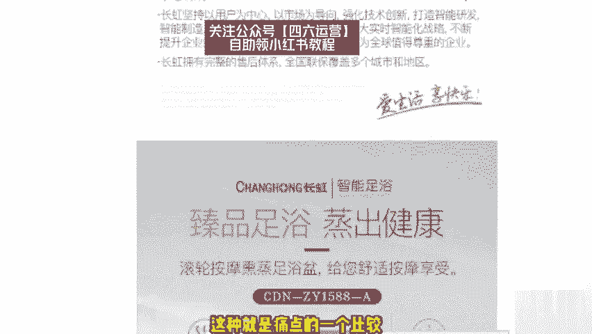
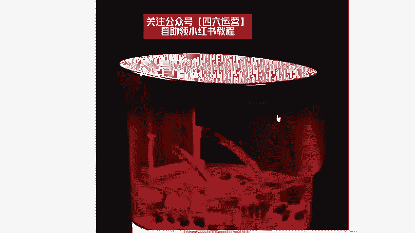
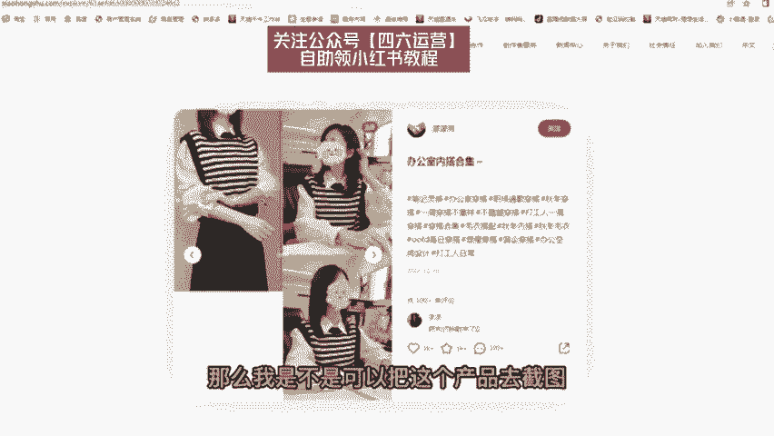

# 【150集精华教程】小红书运营新手起号 0-1新媒体运营必学课！不要荒废18-30岁，一切都还来得及 - P1 - 正经的艺术家 - BV1TEhnegENc

要说最近什么项目最火啊，那就必须要提到小红书电商。最近几个月呢，几乎整个互联网都在讨论小红书电商。我关注的几个商业博主啊，包括一些付费社群都在讨论他。我朋友圈月入5位数甚至6位数的比比皆是。

这个项目在年初的时候，我其实就有让团队跟进测试，我还在市面上买了一些课程学习，到现在单人单店一个月能做个一两万块吧。今天我就用一个视频详细的给大家拆解一下，就是小红书电商到底怎么玩。

我会把整个小红书电商的流程，包括一些注意点。比如怎么开店，怎么选品，怎么做流量，一次性给大家讲清楚。你甚至都不用再去看别的相关视频和培训啊，你就跟着我的视频去按住佐骥，就足够你在这个视情上开始盈利了。

视频的结尾呢，我还会给大家准备一份资料，里面有我找的课程啊，对你运营小红书电商呢会有很大的帮助。有需要呢直接去拿就可以了。言归正传啊，整个项目的逻辑啊，其实也非常简单，它就三件事儿，第一个呢开店。

第二个选品，第三个流量，我们一个一个来讲，先说开店。呃，开店其实没什么好说的。那，首先就是打开小红书，然后点击左上角的菜单图标，再选择创作中心，然后点击更多服务这个选项，选择店铺，点击立即入住就可以了。

你就按他官方要求的提交资料入住就行了。我居然看到有人把小红书开店包装成一个项目拿出来卖。居然还有不少人买，这也是很奇特。这里跟大家说一下，小红书店铺的两种形式，个人店和企业店，其中个人店有两种。

分别是个人店和个体工商户店，个人店只需要身份证加1000保证金就可以开通了。个体工商户呢还要多一个营业执照，企业店呢就多一点，企业店有三种呃，有包括那个普通的企业店，有专卖店和旗舰店。

企业店都需要营业执照，而且还要缴纳600个年费。我们刚开始运营小红书电商的时候，你直接选择个人店就可以了。我们实测下呀，企业店和个人店一样，平台并没有对企业店有什么流量倾斜。

唯一的区别是个人店你只能开一家，而一份营业执照，你可以开三个店，你一个店如果都没做好，你开再多的店都是没有用的。而且小红书电商，我觉得是。

适合店群形式去做的。这是因为小红书的流量机制，它的电商自然流占比非常低。那你铺再多的店再多的货有什么用呢？所以只要你看到有博主跟你讲什么小红书店群，我都觉得是在扯淡。小红书是要做矩阵的啊。

但不是店铺矩阵，而是账号矩阵。这个后面在流量获取那里，我会跟大家细说，开店的成本呢有这么几个。第一个就是1000块钱的保证金啊，不做了可以退。第二个呢是平台的扣点营业额的5%。第三个呢是支付渠道的费用。

大概呢每单是0。7，第四个就是自己的流动资金啊，一开始大家做呢可以有无货源的方式去做？对资金要求也不高。你刚开始呢准备个2000块3000块完全够了。呃，开完店以后呢，我们下一步就是选品。

我们应该在小红书上卖什么的？选品其实也简单在其他平台上的爆款大概率在小红书上也能报。目前小红书呢我是推荐三个渠道进行选品的。第一个是通过某东某宝上面找那种小红书平台调性的爆款产品。呃。

身边有做电商的朋友，他自己在某宝的店铺卖爆款，搬到小红书上。第一篇笔记就开。第二篇笔记单量就已经破百了。第二个呢是通过某音的那个精选联盟。你在某音的精选联盟排行榜，你可以看到现阶段哪些品卖的好。

只要符合小红书用户调性的产品，直接搬运测试就可以了。第三个就是某多多的这个销量排行榜选择适合小红书的类幕排行榜，从中选择相应的爆品搬运到小红书整个选品的逻辑，就是我们要利用市场来帮助我们选品。

而不是自己在那瞎想，我们要借助大卖家的选品能力来弥补自己选品上的不足。所以我们只要判到一个东西啊，就是这些排行榜上的爆品是否跟小红书的人群有匹配的可能。如果有我就搬过来测一下，对吧？

相当于是借助了别人的能力来帮我们自己选品，这样反而是最快，而且是最稳妥的选品方式，肯定比你瞎测成功率要高很多。然后等你这个产品上架以后呢，就到了最重要的环节了，我们应该如何获取流量。

小红书它是个种草平台。你店铺九成以上的流量啊，都是来自你发发的笔记。这就是为什么我之前说小红书不要铺店群，而要做账号矩阵，尽可能多的发笔记耗流量。它的通路就是。用户通过你的笔记啊后对你推的产品产生兴趣。

然后到达你的店铺完成购买，你堆一堆店铺，对吧？你铺一堆店铺一就还不如多发笔记，多发几篇笔记的这个效果好。所以怎么在小红书上发笔记，对吧？就是你小红书电商是否成功的关键。小红书这个平台，你直接发硬广。

我觉得效果非常差，对吧？本来小红书的这个用户群体认知就比较高。你直接发广告没有办法获得信任的啊，更不要提转化了，你发笔记的时候，一定要用一个素人的角度，你知道吧？就是用户的角度去切入。

站在用户的角度去做种草内容，而不是官方视角，这才是真正有效的。呃，这种种草笔记怎么做，其实也很简单，就是去各大平台的商品评论里找。比如某一某宝某东的商品买家秀找到好看的素材，你直接copy下来用嘛。

对吧？文案呢在买家评价上去做修改。这些买家的评价呢就是商品用户的使用体验，天然的适合用来做这个中考笔记，而且可以说是取之不尽了啊。然后呃当你单个账号的SOP跑通了是吧？我们就可以开始举阵引流了啊。

通过批量上小红书账号批量发布笔记。给我们的店铺来引流来放大。那基本上整个小红书的电商的运营啊，就是我上面分享的这些外面不管多少钱的培训啊，000块也好6000块、1万块也好，其实就是这些东西。

有些培训可能还没有讲的清楚啊。根据上面的几个点，我给大家准备了一份资料，里面包括了小红书账号的起号运营的方法，以及一份小红书电商的视频课程。你如果打算经营小红书电商，你也不用看别的东西。

就跟着这份资料做，足够你开始盈利了。有需要的啊，点赞加关注，在评论区回复红书电商，我分享给你。😊，🎼要有自信啊，肯你是最好的，知道吗？我们这节公开课呢给大家带来的是小红书这个APP相关的一些运营技巧。

还有一些引流的一些小技巧。那在这个第一下第一大节课里面呢，给大家讲的是一个小红书的基础知识相关的一些注意事项，包括小红书的一些最新规则。呃，熟悉我的人也应该知道了。我做一个项目之前。

或者说做一个平台之前呢，首先是要和大家讲清楚这个平台的一些规则的。我比较喜欢一句话，知己知彼，方能百战不殆。所以说我在每次讲到相关的这个项目的时候呢，都会和大家提前说到这个平台的相关规则和这个注意事项。

好的，那我们先来看一下第一小节课。首先呢我们来带带大家去认识一下这个小红书APP小红书APP到底是什么样子的？然后呢，它的这个流量板块呢到底是哪些地方啊，哪些地方呢？它的这个流量板块流量呢是比较多的。

这里面呢我用的是这个手机模拟器给大家看一下。啊，首先我们来看到的这个发现页，我们打开小红猪APP这个界面呢，它有一个发现页。这个发现页呢是主要的流量的一个来源，基本上呢是会做到一个特征匹配的。

就是说平台会根据你的相关的用户资料来给你去匹配一些这个相对应的一些栏目里面的一些这个。啊，笔记视频也好，可以看到这个上面呢是根据我的这个账号信息所匹配出匹配出来的一些这个视频。啊。

会根据我的这个用户的一个画像。因为我这个号呢是一个女号，然后在注册这个账号之前呢，选择了一些这个上面的一些，就比如说宠物啊、美食啊、vlog啊，我是选择这些标签，所以说它会根据这些标签。

根据这些算法呢来给跟我推荐一些其他的一些笔记。那第二个这个流量板块呢，就是我们的这个呃位置也。也就是说比如说我这个手机定位的是上海，那他给我推荐的呢是上海的一些这啊一些个这些小红书的一些笔记。

大家可以看一下，有这个景点啊。啊，那这里有景点景点、拍照地、餐厅、玩乐、逛街、周边游展馆，基本上是和这个当地的一个地点有相关的。啊，也有一些这个相关的一些笔记。第三个位置呢是我们的这个关注页。

也就是说我关注了一些谁，像我这个是新号的话，就是没有去关注别人。他这里面呢会和啊会根据我的一些算法呢去推荐一些这个关注。我们以后做号的时候呢，如果说我们这个账号做的还不错的话呢。

也会被系统推荐到这个关注页里面啊，关注页里面，通过信息流的这种方式呢展现在别人的这个账号面前。啊，说完了这三个流量比较大的这一块呢，那剩下来的剩下来的比较大的这一块呢，就其实这其实就是这个搜索框了。

这个搜索框呢通常呢有一些这个热门的一些搜索词啊，这里面有一些热门的搜索词。通过这些热门搜索词呢，我们也可以去蹭到这些一部分的流量，然后呢让更多的这个人呢去关注到我们的这个小红书的账号。

留呃这个搜索框的话呢，也是大家的一个必争之地。因为搜索而来的用户呢，它的质量往往是非常高的。整个小红书的话呢，流量的这个板块比较大的呢，也就是这四个板块啊，一个是关注发现，还有这个位置也。

包括这个搜索框都是比较大的。那我们这节课呢和大家聊一下这个小红书的相关检测的一个规则。关于这个小红书检测的规则呢，我从这以下四点来和大家详细的讲一下。第一点呢就是小红书。

它会检测我们的检测我们的这个个人资料、笔记内容、私信以及评论这几个地方在这几个地方呢，它就不得含有一些微信号码啊，微信号、微信二维码、代购啊、水印啊，包括这个推广淘宝店铺的一些营销词汇。呃。

但是小红书管的比较松一点的是什么地方呢？它官方啊个人资料官方是允许邮箱存在的，也可以呢用这个微博去替代这个谐音啊去进行引流。然后呢再用话术引导到我们的微信上面啊，当然了，这个课程的话呢。

是在后面会和大家详细的去说到。第二个检测的内容呢是小红书会检测我们的这个手机设备。最好呢同一同一台这个设备呢呃最多只能登录三个账号。这这边呢大家一定要注意一下。然后呢。关于笔记内容的话呢。

大家要注意的就是不得去诱导用户。比如说去关注领奖啊，点赞、抽奖啊，这些呢都是小红书明令禁止的。这个呢就是诱导用户的一个行为。那第四个呢就是内容的原创度，原创度、保护程度呢。

在小红书的这个平台上它是比较高的。在推广的时候呢，我们也不要说呃，你写了一篇文章，然后呢去多个账号在小红书上面去发布。这样子呢这样子的话呢是不可以的。一篇文章一个账号去发也就可以了，不要去多发。

还有一个关于这个小红书检测的一个规则呢，实际上是一个敏感词的一个检测啊，敏感词的一个检测就是我们在呃接下来也会大家会遇到的。关于敏感词关于敏感词的一个检测呢，这里面我给大家介绍了两个网啊两个网址。

两个网站。一般的话呢就比如说我们小红书上这个。违禁词是有哪些的呢？就比如说呃手机卡呀、金融啊。电子烟啊。啊，电子烟、代购、医疗用品等等。这些东西呢大家尽量不要去碰。那有的人可能会说了。

我在写这个小红书文章的时候，万一我不小心把这些词呢，还有一些没遇到的一些词呢给加进去了，那怎么办呢？对吧？那就会用到我们这个敏感词的一个检测的这么一个啊网站。这里面呢我来我来用电脑给大家演示一下。

我们首先打开这么一个第一个网站。就比如说我们现在写了一句话对吧？啊，写了一句话很长很长，但是呢里面有代购这个词，这里面呢我已经去我已经刚才。啊，我们现在刷新一下。我们把这篇文章假设去粘贴进去。

然后呢点击立即检测。它这个时候就会就会给你显示出来啊，代购这两个字是敏感词，大家可以看到了吗？是敏感词，是小红书相关的一个敏感词。所以说你这个时候就可以去看到了啊，包括我们用这个。

啊，这个是需要注册的。这个注册的话呢，大家到时候注册一下也就行了。然后我这边就不跟大家去演示了，它的使用这个规则也是一样的。然后呢，这里面会跳出来一个过滤的一个结果。实际上呢我们基本上用这个网站呢。

它去检测的话呢，也就基本上够用了。也就是说我们平时在写文章，有一些相关违禁词的时候呢，通过我们把这个文章。啊，发到这个网站里面去。让这个网站呢去检测。

它就会检测出来我们我们的这篇文章里面到底是有哪些这个违禁词的。啊，好了，关于更多的这个违定词呢，这里面呢我还正在给大家整理当中。呃，不过呢也很快在这节课录完之后呢，这些词就会整理出来。

我们这个小节课呢来和大家简单的讲一下小红书的推荐的一些机制和规则。其实小红书的推荐机制和规则呢和这个抖音，包括头条这些平台的逻辑都是差不多的。用户呢以及内容都会被打上相应的标签。

就比如说我们在发送这个笔记的时候呢，都会被系统打上这个标签。然后呢，每篇笔记都进都会进行机器审核啊，看一下这个检测出来的这个内容是否有违规。如果没有的话呢，就会进行一个大数据的一个算法匹配分发。

就像我上一节课和大家说到的检测的一些词汇，包括检测的一些词语，都是会在这个里面进行进行到一个呃一个作用。如果如果这时候系统检测到检测到你是有相关违规的话呢。

如果这个机器啊也就是这个程序这个算法它不能确定。它会进行相应的一个调整，就是说会把这个有疑问的东西过给这个人工去审核。如果人工再去审核的话呢，确定是没有问题的话啊，然后才是进才是能进行分发匹配的。

如果你的这篇文章啊，这篇笔记又被机器判定为这个违规。然后又被人工判定为违规的话，那基本上就会去被关到一个小黑屋里面啊，就会被限制账号发言啊等等这些这些操作。另外的话呢。我们这个在推荐的时候呢。

系统会提取这个笔记中相关的一些关键词、图片的标签啊、话题啊等等来分到对应的这些类目里面啊。其实大家在一开始注册这个小红书的时候，也就发也就会发现了呃小红书呢会要求每个用户去选择自己的这个地理位置。

包括喜欢的一些领域。他为什么要选择这些领域呢？也就是为了让大家去呃给自己的这个兴趣打上一个标签，然后呢，他就会根据这些兴趣，然后匹配我们相关的一些笔记，然后呢进行内容的一个分发。

下面呢最后呢要和大家说的呢是推荐后呢不代表用户就可以搜到这个笔记。因为这个笔记呢必须要被小红书去收录才可以。这里面呢给大家提一个醒啊，就是我现在在外面也也看到很多的这个一些机构啊。

或者说一些这个呃做项目的人啊，他会说百分百分百包这个小红书去收录。这里面大家一定要注意一下，就是目前来说的话。几乎是不可能有百分之百包收入的包这个小红书收入的。这里面大家一定要注意一下，如果说有的话呢。

那基本上95%吧，可能是骗子啊，这个大家一定要注意一下。如果对方说有包收录的方法的话，最好呢是去验证一下，而不要说直接就去给对方转账，或者说要对方帮忙去收录，最好是去验证一下。

如果对方确实有这个实力的话，再进行转账，再进行合作也不迟。因为根据我们现在这个操作小红书的这个难度来看的话呢，这一块去要小红书去收入的话，还是比较难的。啊。

然后呢我这里再给大家说一下这个小红书的一个推荐机制吧。很多人都会说这个小红书的推荐机制呃会很奇怪。它的一篇笔记呢。😊，呃，比如说20分钟之前看可能是1万个阅读，对吧？啊，可能是个是个这么一回数。然后呢。

过了一会儿又变多了，然后又过了半个小时呢，又变多了。那为什么会产生这样的一个情况呢？这里面呢也很简单，我给大家画了这么一个图。啊，我给大家画了这么一个图。用这个图呢来去理解的话。

就比较很容易比较去理解了。那我们最开始的时候发了一篇笔记呢。啊，发了一篇笔记呢。发了一篇笔记之后呢，系统会对应的分配到一个基础的一个流量池里面。基础的一个流量池里面。啊，这个基础的流量值呢可能不会太高。

然后呢，因为只是一个基础量，可能只有两三百或者说一两百的人去啊会被系统推荐到这个推荐到去看你的这个笔记。但是为什么会有更多的这个流量池呢？就是因为在你的这个笔记在被别人看的过程中呢。

如果说你的笔记被别人点赞。转发以及收藏，也就是我上面所写出来的参数啊，这个参数就是说点赞点赞转发收藏。呃，我们的笔记发给这个一些基础流量的时候呢，然后通过这个参数来判断出来。我这边画给大家画一下。啊。

当我们的笔记。当我们的笔记发到这个流量池里面之后呢啊如果这个流量池里面的这些用户他的反他的反馈都是比较好的话呢，他进行了一些转发、收收藏以及点赞以及点赞，对吧？那对应的这个参数呢就会产生一些变化。

产生变化。如果这个参参数产生变化之后呢，达到了一呃达到了往下一级推荐的这么一个机制之后呢，这个笔这篇笔记呢就会推荐到下一个流量值。那下一个流量值呢可能是1000起步，1000个人。

如果说这1000个人看了你的这个笔记之后呢，点赞、转发以及收收藏啊这些指数呢。依然是比较高，依然是达到了某一个阈值，对吧？那它就会推荐给下一个流量池，下一个流量值呢可能是5000。可能是5000。啊。

可能是5000。然后这5000个流量值之后呢，再根据这些这这些参数的这些占比，如果还是比较不错的那就可能推到15万或者是15000。啊，这个大家要注意一下。啊，这个后面呢我就不去画了。

然后呢它就是这么一个推荐机制。如果说你的这个笔记它的反响是比较好的话呢，它是逐步逐步去被炒热的。不是说不存在说你一个笔记发下去，立马就会有1万个人看到，或者说有5000个人看到这个是不可能的。

它都是逐步的去推荐的推荐的这个流量池呢是也是越来越大了，直到你不能满足于这个参数为止啊，直到你不能满足于这个参数的话，那就只只能是停止在这个参数前面的一个流量池里面。

所以说这个是相关小红书的一个推荐机制，希望大家了解一下。小红书的推荐机制呢，并不是说一蹴而就的，而是我这边这张图呢和大家讲的这么多。啊，它是一步一步一步一步去慢慢积累出来的。

好了，那关于小红书的这个推荐机制呢，就和大家说到这里了。我们来讲一下这个简单的小红书的小红书的一个搜索规则。我们想要写的这个笔记呢，它的内容分发啊，我们大家注意了。

笔记的这个内容分发和这个搜索呢是相互独立的。在小红书的这个平台上面被推荐的笔记呢也不一定是能被搜索到的。所以说它这它的这个平台的一个逻辑呢，跟我们平时所接触到的一些搜索引擎的逻辑，它是不一样的。

就比如说我们之前在做的那些百度的一些项目，对吧？这个词它一旦被百度去收录了之后呢，那一定是可以去搜索得到的。但是在小红书这个平台里面呢，它是啊它这2块呢是独立的。也就是说。在前面的一节课我和大家说到了。

对吧？你的你的笔记可能会推荐给一些人，但是这些人想反而看完了之后想去搜这些词的话，不一定是能搜得到你的笔记的啊，也就是这么一个原因。那换而言之的话，也就是说我们想要做下一步这个动作的话。

也就是说我们想操作这个小红书的一个搜索排名。那它的一个前提一定是笔记是被小红书平台去收录。这样子的话呢才能去我们进行下一步的一个操作。这也就是为什么上一节课我说到的，我说。呃，这个。

如果有的团队他说这个小红书的小红书的这个收入是百分之百的，那一定是有问题的。也就是出在这里，那影响这个搜索排名的因素主要是有哪些呢？一般的是有这个关键词，包括你的这个权重点赞以及收藏的这么一个行为。

包括其他的一个用户的一个正常行为。就比如说你是不是一个正常用户行为，对吧嗯。正常用户行为呢，就比如说我正常的会去看一下我第一节课讲的那些个东西啊，点一点他们看一看他们，对不对？那不正常的用户呢。

那可能是不会用到这些东西的。同时呢搜索排名的话也将会去延迟。如果你以上的这些这些条件呢都是啊有或多或少影响的话呢，或多或少的影响的话呢，同时呢这个排名搜索的这个排名呢也将会延迟。

就拿我们这个关键词来说吧，关键词呢是所有搜索引擎的一个核心啊，关键词呢可以分为呃三种类型的这个关键词。就像我说的。对吧核心关键词呃，这个相关关键词以及长尾关键词。

核心关键词呢就是我们的文章产品或者是网站主题里面一个最简单的一个词语。同时呢也是搜索量比较高的一个词语。相关关键词呢，它就是核心关键词的一个扩展。就比如说我写了一篇文章，对吧？我讲的可能是祛痘，对吧？

那你通过什么方法去祛痘呢？那就是呃比如说我是通过这个呃食疗的方法去祛痘，对吧？我吃了一些这个什么什么东西去达到祛痘的一个效果，对吧？这个就是核心关键词和相关关键词的一个区别。那什么是长尾关键词呢？

相对于这个相关关键词呢？又是进行了一个扩展，可以是两三个词语呃组成呢？也可以是一个短语短语短语呢去组成的？比如说有什么办法。啊，有什么办法可以快速祛痘？这样子呢它就是一个常胃关键词。

就是包含了之之前的一个相关关键词和核心关键词。这个大家呢要了解一下。呃，下面呢说到的这个关于权重的这一块呢，就是呃权重呢它是一个比较复杂的一个体系啊。就比如说包括我们发布账号的一个权重。

点赞、评论用户账号的一个权重。等等等等，这些呢都是比较重要的。总体来说的话呢，你的这些权重越高的话呢，那么你的笔记呢它的排名也是越高的。呃，那下面跟大家说一下的是这个点赞收藏的这个评论。呃。

这个因素呢是你的这个排名月靠前呢。肯定是因为你的点赞或者说评论，要么是呃收藏它的这个数量很多。就像我之前前一节课的那个推荐规则和大家说的一样，对吧？同时呢可以增加相关领域啊。

以及这这篇小红书笔记的一个权重。那最后一点呢就是这个用户行为，就是你的这个账号呢到底是不是一个正常用户的一个行为。这里面呢我就不写了。平时呢我们去就像模拟真人一样去活跃这个账号，对吧？

比如说你可以趁着你呃上下班在路上坐地铁坐公交，对吧？等车吃饭睡觉之前。对吧吃饭的之前对吧？这些时间包括休息的时间时不时的把小红书掏出来去活跃活跃，对吧？啊，这个就是我们正常的一个用户行为。

如果你的用户行为那是正常的话呢，那就是没有太多的一个影响。啊，比如说你很异常，什么叫异常的用户行为呢？就比如说你一天什么事候都被都不干，天天就在那给别人点赞，那是不是一个一个异常的行为，对吧？

它就是一个异常的行为。所以说呢这个呢大家也要注意一下，好了，本节课呢关于小红书的这个搜索规则呢，也就和大家说到这里了，这小节课呢和大家简单讲一下这个小红书文章，它不被收录的一个原因啊。

很多人发了小红书的相关的这个笔记，可能发了半天呢，平台不会去收录它，这里呢我给大家总结了大概是5点的原因啊，来和大家说一下，为什么它不会收录我们的笔记。首先第一点呢，我们要考虑一下。

是不是我们进行了一个违规的推广。呃，因为有的人在推广这个相关的一些笔记相关的一些商品的时候呢，就会有了一些这个相关的一些硬广。😊，就比如说包含呃包含了一些品牌的名字啊，这些大家要注意一下啊。

第二点呢就是我们一开始会给大家提到的就是一个敏感词的一个检测，对吧？你的笔记或者说你的账号有没有这个违规，有收入，就算是有收入的话呢，他也会去把你踢出来，就是说。他收录了之后。

发现你的文章里面有违规的这些词，他也会把你这个文啊，把你这个笔记呢给踢出来。有没有这些敏感词，这里要这里要注意一下，然后呢就是一个内容的违规，内容的违规呢就是包括图片和文字的这两部分的违规。呃。

可能是直接违规呢，是没有被收录，也有可能是收录了之后呢，被举报，然后呢去限流。这里面大家注意一下，其中呢是图片的话，我建议大家最好不要去带有其他平台的一个水印，包括其他平台的一个二维码。

因为这种办法的引流呢，已经不适合在小红书上面去进行操作了。包括这个文字的话呢，一定不要有这个违规词敏感词等等等等啊，包括有一些不文明的词汇啊，诱导啊等等。对了，这里跟大家顺便再提一下。

有的这个敏感词呢呃就包括有一些这个政治类的敏感词呃，包括我们很多平台都有的一些通用的一些规则。就比如说破坏民族团结啊。呃，谈论政治呀。呃，就是什么颠覆国家呀，颠覆国家政权呀等等。

就这种东西我们是原则上的东西，东西是千万不要有的啊，如果有的话呢，也尽量的不要在不要在这上面出现。因为大家我们都知道，对吧？我们做的是网络项目。我们只想通过网络项目，通过这种合法的手段。

合法的营销去赚取一个合理的一个收入啊，千万不要违背这个一些相关法律法规去谈论，不需要我们谈论的这些东西，包括一些这个明令禁止的一些词汇，对吧？包括一些谐音的一些词汇，大家对吧？千万不要碰这一块。然后呢。

还有一个原因呢，可能是我们发送文章的这个频率呢，有可能是过高，发送的频率过快。啊，然后这个也会导致我们账号的一个异常。导致账号异常的话呢，他就会认为我们是机器人在滥发布这个文章。

所以说也会导致一个不出入的这么一个情况。那最后一点呢，不收入的一个原因呢，就是很可能是我们这个设备已经被拉黑了。那有的人就奇惯了，这个小红书这些平台它是怎么知道我用的是这台手机的呢？

那我这台手机上面之前封过号，我又换了一个账号啊，它是它是怎么知道的呢？这里面呢就要和大家去说一下。因为我们每一台设备的，每一台手机设备的话，都是有一些硬件去组成的，就比如说我们的手机对吧？

它是有主板啊、电池啊，这个里面的一个硬盘啊。对吧有一个磁盘啊，包括有这个上网的这个基带啊、信号啊，基带信号、天线啊这些硬件去组成的。当我们接入到手机呢去接入了这个APP的时候呢。

它会它会读取我们手机上的这些硬件设备的一些这个参数，就比如说串号呀IMEI码，包括手机号呀等等，它都会记录下来。如果他发现你的这台设备呢啊产生了一个违规的行为，哪怕你去这个就是说把这个APP卸载了。

重新重重新再装之后呢，你登录的这个账号，它还是会发现你的这个手机设备呢是违规过的。所以说这就是我总结的5点原因啊，有一些不被收录的一些原因呢，大家以后有如果有这个笔记不被收录的话呢。

可以对照着这5点去看一下。我们这节课呢来讲解一下小红书系列的第二课笔记速成、小红书、种草笔记四大步骤啊，所有产品都适用的一个方法。在讲解在讲解本次这个本小节课之前呢，首先要和大家达成一个共识。

那就是很多人在做小红书这个平台的时候呢，绝大多数的用户还是喜欢在这个小红书的平台上面呢去发现和分享一些好物。所以所以说在呃我分析小红书这个平台这么长时间呢，我认为小红书的话是。

主要的一个主旋律呢是种草笔记啊，也也就是说呃大家不要去写一些无关的一些那种主题那种话题。而且呢小红书这个平台呢，它本身也是去推荐大家去写这种种草笔记的啊。

所以说我认为种草笔记的话是小红书的一个主一个主旋律。只要你去掌握小红书的种草笔记的玩法。那后面做的一些事情呢都是水到渠成的。比如说你去引流啊，比如说你去变现，比如说你去做推广等等，都是非常方便的。

为什么很多人说做到做到最后发现。啊，我我这个引流比较难，或者说我变现比较难。其实问题就是出现在了你笔记的一个。呃，一个风格上面，一个内容的一个方向的上面。啊，这里再跟大家达成一个共识。

就是说我们最好是在小红书上面写的笔记是种草类型的。好的，说到种草类型的话呢，那很多人就会理解很多人呢就通常写着写着就变成硬广了。因为我们之前在这个抖音上也发现。一些这个好物的推荐的视频。

大家可能会会发现啊这个文章或者这个视频做出来之后，就感觉非常像硬广。你说的每一句话都像是为在这个都像是在为这个商品去做。宣传去做推广，好像每一句话都离不开这个东西似的那我们该如何规避成这样的一个问题呢？

今天的这节课呢来呃来和大家。😊，主要的就是说一下这个问题，也就是我们如何规避到这个问题，把我们小红书写出来的这个笔记，尽量的不要像这个硬广一样。

这节课呢主要是分成四个小步骤来和大家去讲解这个种草笔记的一个。啊，一个一个书写。那么首先第一点呢，就是建议大家去做的一个步骤呢，就是去找到一个相关的一个素材。

我这边给大家分呃分门别类的四种类型的素材图片。这种素材图片呢我主要是分成一个产品图、效果图、细节图和使用图啊，产品图呢主要是一啊2到3张，效果图的话呢是1到2张，细节图的话呢是1到2张。

使用图的话呢是1到4张。通过这通过这些图片呃，从不同的角度去展示这个商品这个产品它的一些卖点。你就可以根据这些商品这些产品去把每一个卖点啊，每一个亲身的感受都可以去写出来。首先就是一个产品图，对吧？

这个东西长什么样子是吧？然后是效果图，这个东西用起来到底是什么样子。啊，细节图就是就是从各个各个角度，各个方位，各个不同的使用场景。我们来看一下这张图片的一个样子，对吧？那最后一张呢最后一种图片呃。

图片的这个素材图片的样式呢，我把它叫做使用啊使用图。就是说我们亲身亲身经历的过程中，在用这个。商品用这个产品的。同时的一些的这个照片。那为了给大家做一个详细的分类呢。

因为有的有的人有的大家可能做的是不同种类的一个行业。就比如说呃可能有的人是卖的口红啊，可能有的人卖的是这个衣服啊，他就像比如说这个卖的衣服的话，它就没有使用图，对吧？它就是一个产品图或者说一个效果图啊。

没有说使用这个这一点的，对吧？那所以说我下面给大家类了一张表格呢，就是有些如果说你是做的这个大类的类目的话呢，那里面的一些图片是可以不用到的。就比如说如果你做的是服装的话。

那细节图和使用图都可以不用去发，只要留着这个产品图和效果图也就可以了。那如果说你是做母婴的话呢，最好还是把这四种图片全部都带上。啊，如果你是做电器类的呢，还是的把这四类全部都带上。

但是如果是你是做食品或者是做美妆的话呢，那后面的两种两种图片就可以不用去带了，使用图和效果图啊，基本上可以就可以不用去带了。因为呃这个产品图和细节图都已经把后面这两个呢都包含进去了。

这个呢大家一定要注意一下，我在这里面已经标了这个横线的啊，这里面是不需要找这种找到这种图的。那么如何去找到对应的这种这些图片呢，其实也很简单。这里给大家推荐一个渠道，那就是我们的。那就是我们的这个淘宝。

啊，比如说我们现在想卖一款这个泡脚桶，对吧？打个比方，那我们就可以在这些天猫店或者是淘宝店里面去找到这些产品图啊，产品炉肯定都是有的对吧？那那些使用图和那个呃效果图到哪里去找呢？

都是有在这种呃好评里面啊，就是这个评价里面都有一些带图的，大家可以看一下，这些都是使用的图片。啊，实实际上就是一些买家秀了，对吧？大家可以整合一下，整合一下这些图片呢啊做一个分类。然后呢。

我们去写作的时候呢，就可以根据这些图片去写。啊，这里面都是有一些买家秀的。对吧这个是相当于就是细节图嘛，对吧？有一些追评的，大家可以看一下，有一些追平的，追评的话呢就是使用效果图了。好，第一步呢。

如何去找素材。那我们这个呢也就和大家说到这里了。下面和大家说的呢是如何去写这个文案。写文案的话呢也自然是包含了两部分。其中一部分呢是如何去正确的写这个标题。另外一部分呢是如何正确的写好我们的正文。啊。

里面的内内容到底是如何正确的去书写？呃，这里呢我给大家举了一个案例啊，我们首先来看一下如何正确的写标题，或者说标题应该怎么样去写的更好一些。左边这个部分呢是原来的一些标题。

右边这个部分呢是优化的一些标题，大家可以看一下，那原标题我给大家念一下，男朋友挑选的圣诞礼物，蒸汽足浴盆，对吧？那我们可以把这个标题优化成什么样子的呢？无需倒水的蒸汽足浴浴盆。男朋友挑选的对吧？啊。

包括这个护肤精油也是的，秒杀卡诗的护肤精油，对吧？原标迪士终于拥有了这个樱花粉蒸汽锅。那优化过了的标题呢，我们加上了这个词，终于拥有了这个少女心爆棚的樱花粉蒸汽锅。实际上大家应该可以发现。

我们加的这个红色的这个字呢，应该是这款商品的一个卖点的一个词，对吧？就比如说樱花粉的这个蒸汽锅，对吧？它大部分应该是一个是一个女孩子使用的一个商品，对吧？那我们可以加上少女心爆棚嘛，是吧？呃。

一般的我们来看的这个蒸汽足浴盆的话。比如说他现在突出的一些卖点，可能是先进的，不需要倒水，对吧？啊，或者说多少小时恒温打个比方，对吧？我们就可以把这个卖点突出在这个标题里面。啊。

这点呢大家一定要注意一下。😊，标题的话呢可以优化成这样的去写。啊，那下面我们再来和大家说一下这个里面的正文里面的内容到底是怎么样去写的？如果说文章的里面到处都是卖点的话。那看起来就非常像硬广了，对吧？

也不会也就不会得到小红书的推荐和收录。就像我们之前看到的这个标题一样，如果你的文章里面到处都是这个卖点的话呢，那可能对你的文章正文来说内容来说的话呢，就会出现不太好的一个事情。就是你写着写着就感觉啊。

你是你是硬是来推广这个商品的对吧？所以说那我们怎么样去啊怎么样去。来来写这个文章的一个步骤呢，我这里给大家画了一个图，大家可以看一下。这里呢就是我建议大家去按照这个步骤去写的。啊。

首先呢我们最好是要从自己的一个经历去切入，去切入来写这个东西。然后呢去找到这个商品的这个产品的一个缺一个痛点，自己的一个痛点，同类商品的一个缺点。再根据这些痛点和这些缺点。

我们来引入自己所推广的这个商品，对吧？然后呢，最后加上个人的一个感受。这样子的话呢。啊，通过这么这么几个步骤。通过这么几个步骤去写这篇文章的话呢，那文章的层次感也好啊，逻辑也好啊，都是非常不错的。

那对应的每这四个步骤，每一个步骤该如何去手写呢？这里面也和大家说一下。啊，也很简单，就比如说如何从自己的精历去切入来写这个文章的一个开头，对吧？啊，要写要写成。我建议大家呢要写成啊。

我这应该是我怎么样怎么样，对吧？不要把自己放在一个专家和一个商家的角度去写。对吧就比如说我们哦我们还是拿那个足浴盆来和大家举例吧。对吧。一般的人写这种文章应该啊会说什么很多女生。到了冬天，脚都非常的冷。

对吧？啊，其实最好的一个角度是什么呢？应该说应该以第一人的去写，或者说写一下自己自己的一个经历，对吧？比如说啊我是一个女生，我到了冬天，脚就非常的冷，从来没有暖和过，对吧？这样子的话呢。

它就有一种代入感，很亲切的很生动的一个代入感。如果你一开始就把自己的这个定位占成了一个专家，或者是占成了一个商家的话，那别人就觉得你这个是来推销的对吧？

没有站在一个第三第三方一个客观的角度去看待这个问题。好，那我们下面要讲的呢是痛点和缺点这方面。痛点和缺点这方面呢。写的越详细越具体越好，但是呢不需要去写多，不需要去很多。但是呢一定要是去描写清楚。

就比如说我们呃这还是拿这个泡脚桶来作为例子的话。比如说我们一般可以在这上面会发现。这个泡脚桶它啊它的一些这个。呃。对比你看到了吗？为什么去选我们？实际上就是这个是产品的一个对比嘛。啊。

本店的这个商品和别人家的这个商品。嗯，别人家的这个商品是。有安全隐患。残留尾货或者说是老款O型的熏针口，容易这个刮伤小腿，对吧？但是我们家的这个新款双门是为亚洲人的这个腿型设计的，伸缩伸缩自自如，对吧？

这种就是痛点的一个比较。还比如说我们来看一下这个足浴盆。

啊，一键启动就比如说别家的这个商品，别家的产品没有一键启动，还需要不停的调调调了很多按钮，对吧？我才能去用得上。

啊，水电分离，别家的没有水电分离，对吧？

还有这个呃循环式加温和固定式加温。那别人的别人的这个产品可能是一个固热固固固定式的一个加温，导致水温不均匀。但是我们家最新的这个产品是K式循环加温，水温均匀啊等等。这样子的话呢，我们按照这种啊。

我们按照这种痛点或者是缺点去写的话呢，尽量的把别人的这个描别人的这个缺点的，或者是痛点呢去描述清楚就可以了。好，然后有了这个痛点和缺点，也就是说有了这个有了需要改善的这些缺点之后呢。

我们就可以对入对应的去引入我们自己的一个产品。对吧我们自己的这个产品，那可以从哪些地方来写这个呃写这些点呢？那很简单我给大家列出了这个三点。第一点呢就是我们这个产品是怎么样解决这个痛点的？

第二点呢是对比同类的产品啊，我们又比别人多哪些优势，对吧？第三点呢，直接是给出一个决啊一个最佳的一个解决方案。大家再可以看一下，我们再找一个。😊，啊，再找一个对吧？比如说这种按摩啦、水电分离啦，对吧？

爆铺是冲龄啦。啊。啊，水很深，很节能，一键启动。记忆智能记忆。

防电磁干扰国家标准对吧？啊，这里面还有一些其他的一些这个呃这些理由啊，这些这个大家都可以去看一下。😊，好，针对于这些东西来说的话，我们就可以引入自己的产品。然后呢把自己产品的一些优点去写出来。

直接给出这种最佳的解决方案，对吧？好了，那这个呃正文的最后一步是写的什么呢？是写的一个个人感受。就是我们在最后补充性的来写一下这个产品的一些啊补充性的优点啊，包括使用的一些注意事项了。

就比如说你可以去问一下这些卖家啊，我们要卖这种商品的时候，那最后对吧？最后有一些什么样的这个注意事项啊，比如说怎么去保养它呀，对吧？啊，比如说我长时间不用该怎么办呀，对不对？等等这些小的注意事项呢。

你可以去稍微的去问一下那这样子的话呢，我们的一篇文章正文里面的这个文章架构呢，也就很完善了啊，从这个逻辑顺序去看的话呢，也是非常不错的。好了，这个就是正文的书写的一个流程。

那这个下面呢我再和大家去讲一下，我们去如何去找产品的一个核心卖点。包括呢如何去寻找一个。呃，一些痛点。如何发现其他商品的一些缺点。这里面呢，其实在刚才演示的时候呢，我就和大家说的比较详细了。

我们可以通过天猫店、淘宝店等等等等。这些店家，因为他们这些店家呃，是直接直接的去推这些商品的。所以说他们对于他们自己商品的一个呃一个就是自信的一个程度，或者说对于市场的一个考量，是比我们要成熟的多的。

我们直接可以参考他们的一些个这些个建议啊，大家可以多看啊多看一些，甚至说你可以去问一下这个淘宝的这个客服，对吧？你家的这个商品凭什么要比别人家的好，对不对？

那他这些客服呢都是很呃就是很容易告诉你的这些答案的。啊，包括一些这个呃一个这个这个商品，这个行业里面普遍存在的一个缺点。就比如说我们还是以这个泡脚桶为例，足浴足浴盆为例的话。

它比如说普遍之前存在的一个问题是什么，对吧？比如说没有。那个。刚才那个是怎么说来着啊，没有一个就是那个。叫什么不适合亚洲人的腿型，大家还记得吗？就经常容易刮伤，那这个是不是一个普遍性的一个问题，对吧？

啊，所以说我们就可以针对于这些缺点，这些痛点啊，包括我们自己商品的一个核心卖点去写这样的一些文章。好了，这个呢是关于写这个文案，就是文案标题和正文的一个内容。我们下面来看一下做图片的一个要求。啊。

其实做图片的话呢主要是分为两种图片啊。小红书里面的这个笔记呢主要是分为两种两种图片，一个是封面图片，还有一个呢是文章的一个配图。配图的话呢啊封面图的话呢，那就很简单了，对吧？是一张图片，一张图片的话呢。

这个里面呢最好是出现啊产品的一个图片，然后呢加上一些文字啊，加上一些特效啊等等等等。这里面我给大家推荐的呢是使用这个黄油相机或者是美图秀秀来处理这个我们的这个手图。

大家可以看一下美图秀秀可能大家都应该知道，但是黄油相机是什么，不知道。啊，黄油相机的话。黄油相机的话也是一个非常不错的一个相机啊，它的滤镜都很漂亮的，包括它这里面能给文字去加上一个正版的一些字体。

包括一些这个其他的一些呃模板啊等等。呃，反正呢是很现在很流行的一个照片的一个处理的一个软件。大家可以用这个用这个APP呢去去处理一些这个照片。虽然呢有些功能是付费的，但是基本上免费的这些功能呢。

足够我们去使用了啊，美图秀秀，那我们就更不用说了，对吧？啊，然后说到这个配图的话呢，就尽量是5到8张。嗯，5到8张的一个配图就可以了。好了，当我们这个配图做完了之后呢，最后一步呢其实就是检查工作了。

检查工作呢啊再和大家说一下，也就是检查一些这个文字的一些错别字啊，一些敏感词。我们在第一课也已经说的很详细了，对吧？啊，去检查这些东西。适当的去换行文字呢不要去太密集啊。

然后呢适当的话呢这个表情符号要多一些，这样子的话就显就显得我们的这个呃文字呢会更加生动一些。然后再检查一下我们的图片有没有去带一些水印和二维码。那这里面呢我就暂停一下，给大家看一篇这个示范性的一篇文章。

啊，这里呢给大家看一下我找到的一篇文章。也就是一篇这个笔记了，这个笔记呢写的还是还是非常不错的。首先呢它的图片大家可以看一下首图对吧？啊，加的这些标签啊，包括这个顺序啊，都是很不错的。后面的这个配图呢。

你看有详细的一些个介绍啊，有详细的一些介绍。关键的呢是我想借用它的这个文字的这个部分。第一呢是文字，对吧？适当的去换行。大家可以看一下，干性干性肌肤、油性肌肤、混合性肌肤，它这里面是有用的换行的。

不是那种眉毛连着胡子的那种感觉，对吧？啊？首先人家这样看起来不是很累，看起来很有条理，对不对？啊，第二个呢适当的可以去多用一些表情。比如说这个星星啊，打了勾呀，后面的这些表情符号，小猴子呀，对吧？啊。

这里面有个什么问号呀，对吧？这些都是非常不错的啊，非常不错的。这样的话呢可以显得这篇文章比较生动，对吧？啊，基本上按照这种要求写出来的这种笔记呢都是非常不错的。

所以说大家可以去看一下我找出来的这篇呃这个笔记的一个一个样子。好了，我们再和大家回顾一下。本节课呢也讲了这么长时间了。和大家讲的呢是笔记速成速成的一个一个写法，对吧？首先第一点呢。

我们最少要做一张这个封面首图和一张配图。首图呢需要加上一些文字，配图的话呢，可以加上文字或者是打上标签。这两张图的话呢，最好是包含产品图和效果图。如果有细节图和使用图的话，会使你的笔记加分。

也会增加你笔记的一个权重啊。第二点呢那就是标题的这个创作呢要写明产品的一个特点，或者是商品的一个卖点。这里面呢一定要去加进去。这样子的话就会凸显你商品的一个与众不同。

啊第三点呢也就是我们文章的一个正文部分。如果按照以下的这个格式来写的话呢啊也就是我之前投屏的这个。对吧从自己的经历，然后到自己的痛点啊，然后再引入这个产品，再写最后的个人感受。

按照这个步骤去写的话呢啊也是非常不错的。这样子这种格式来写的话呢啊它就是显得你的文章呢非常有了条理，非常有层次感，也非常有逻辑，对吧？一层一层意思下来了。好，然后做完这些东西之后呢。

最后呢去检查一下你的这个文啊这篇文章的一个敏感词，敏感图案或者是二维码。那我们这样子的话呢，经过四个步骤就可以去完美的写出一篇属于我们自己的这个小红书的笔记了。好了，那本节课呢也就和大家分享到这里。

今天呢这节课呢我们来讲一下小红书的笔记热词，如何去掌握关键词关键词的一个挖掘方法，抢占更多的小红书流量。好，那我们这节课呢主要是跟大跟大家讲的是找到这个更多关键词的一个方法。

首先我给大家推荐的一个方法呢，是很很接地气的一个方法，也是非常实用的一个方法啊，我们不需要借助一些其他的这个额外的一些工具啊，我们就可以完成这个关键词的一个挖掘。就比如说我们用这个。淘宝很简单的。

比如说我们以纸尿裤这个关键词为例啊，我们搜索这个纸纸尿裤之后就会发现呢它这里面会出现一些其他相关的一些这个关联的一些。关联那些关键词。啊，就比如说您是不是要找。因为和纸尿裤相近的这个词有拉拉裤、尿不湿。

对吧？帮宝适等等等等。这些词因为它这些词和这个和这个纸尿裤这个词比较相近。我刚才说了，对吧？所以说系统会给你推荐出其他的一些大类的一些词语。也就是说你如果说想做这个纸尿裤的话，那是不是也想做这个拉拉裤。

或者说想做这个尿不湿，对吧？好，通过这个方法，我们找到了这种类目的关键词之后呢，我们可以选择一些特定属性的一些产品属性的一些词。那什么是产品什么是一个产品属性的一个词呢？呃，这里面和大家讲简单的讲一下。

就比如说我们简单的啊通过这种人群啊、产地啊、功效啊、效果啊等等这些词，它就是一个产品属性的一个词。这里面呢我用这个手机投屏来和大家看一下。好，这个时候我打开的是这个小红书的APP的一个界面啊。

我们就拿这个眼罩，我们换一个词，就拿眼罩这个关键词来搜索。搜索搜索出来之后呢，我们发现这个小红书的搜索框里面呢出来这么多关于和眼罩相关的呃一些个这个常胃词，一些关键词。

我们来和大家说一下有哪些词呢是产品的一些属性词。就比如说眼罩蒸汽。啊，眼罩蒸气。睡眠。遮光对吧？这是它的功效，对吧？加热针对于学生用的对吧？啊，这种USB充电的可以用来缓解疲劳的啊。

可以用来充电的这些词我们可以看到呢，它就是一个产品的一个属性词啊，就是我刚才所所说到的，我们扩充这种产品的这种词之后呢，就可以针对这些词呢来去写上我们不同的不同的文章，不同的笔记。好，大家应该明白了吧。

主要的是我们呃通过第一个找到你所在所做的这种类目的一个大类，然后呢选择这个类目的一个属性词。然后呢，这个就是你所写文章的一个方向，对吧？你写这个笔记的一个方向。呃。

那我们除了用这个小红书的这个工具之外呢，我们还可以用什么工具呢？这里面呢我我给大家推荐的是一个是百度指数，还有一个呢是微信指数。我们首先来看一下这个百度指数。百度指数呢。

我们直接在百度里面百度这个百度指数之后呢，它这里面有一个官方。大家可能看不见，我截图给大家看一下。啊，这里面有个百度的一个官方，我们点进去之后呢就会。来到百度官方的一个页面。

我们在这上面最上面呢写上这个，比如说我们搜索这个纸尿裤，对吧？啊，搜索完这个纸尿裤之后呢，然后。它在这里面它在这个上面大家注意了，有一个需求图谱啊，有一个需求的图谱就是扩展关键词那些地方。

我们大家可以看一下，和这个和这个质量库比较关系比较近的一些词，或者说一些相似性相关性的一些词，大家都可以看得到，对吧？啊，搜索趋势是呈现上升还是下降的，都可以在这里面看得到。包括一个时间的一个节点。啊。

每个时间段它到底出现了一个。啊，它到底出现了一个什么样的一个排名的一个关系？包括这个下面包括这个下面大家可以看一下，有一些相关词的一个热度。All right。有一些这个相关词的热度。

包括有一些这个其他的一些相关词，那有的相关词呢都是比较精准的。有一些相关词呢就比较不太精准了。就比如说为什么你搜这个纸尿裤，他要和你推荐，他要给你推荐这个牛奶粉和羊奶粉啊，这个就比较好解释了嘛。

因为你搜纸尿裤的话，很可能家里面你有你家里面有小孩的对吧？那他可能就会给你推荐一些婴儿的周边用品，对吧？比如说小孩子可能啊有这种oppo oppo霜呀，对吧？宝宝用品呀，你看懂了吗？

他就是通过这样联想啊，去给你推荐的一些其他啊其他的这些一些关键词。呃，甚至呢我们可以通过这个微信指数，我们来看一下微信指数的一个使用方法。这边可大家讲解一下。我们打开这个微信的小程序，然后呢。

我们在这个里面就可以搜到微信指数这么一个小程序。我们点击进去之后呢，你就会发现啊这是一个搜索的框。比如比如说我刚才搜过了这个纸尿裤。对吧我在搜搜索这个这个词的时候呢。

就会出现这个词在微信上出现的一个指数的一个频率。比如说14号。呃，有这么多个数据。对吧。150万对不对？那它的一个趋势，它的一个变化的一个一个一个比较，对吧？大家都可以看得到一个简单的一个比较。

我们还可以通过这个里面的纸尿裤的这个搜一搜呢，去发掘一些其他的相关的一些关键词。这里面呢就不跟大家去演示了。所有的大家可以记住一下，所有热门的一些搜呃搜索引擎，包括是商业性质的这些APP呢。

它的搜索框呢，都是会给我们带来其他的一些类目词，包括一些这个商品的属性呢。这里面大家要注意一下。呃，关键词排名的一个那我们知道了这个关键词之后呢，就和我们我们就和大家来讲一下这个关键词的一个排名方法。

首先呢就是布局关键词。布局关键词的话呢，我建议大家写啊写文章的时候，我们来写这篇笔记的时候呢，还是建议大家去采用这个总分总的结这个结构呢来写我们的文章，然后呢去代入我们的关键词。

关键词布局的方法呢也比较简啊也比较简单，主要呢是分成三个大步骤。我这里呢和大家简单的去说一下。首先呢第一个大步骤呢就是说我们的题目里面一定要带有你所在行业所呃所想操作的这个类目的一个关键词。然后呢。

因为总分总的结构嘛，就是开头要带上一太带上一个这个关键词，对吧？中间分为几段，我们来阐述这个东西。最后呢我们收尾的时候呢，也要带上这个词。

也就是说这个词总共在一篇文章里面一个笔记里面出现的字数大约不要超过10字，7到10字左右呢，是比较理想的一个状态。我们围绕着这个主题呢去写的这个关键词呢，对吧？

就可以从这个开头啊中间啊结尾啊带上这个关键词，对不对？那第三个呢，我们图片图片中呢也可以加上这个关键词的一些标签啊，大家都知道在写小红书这个笔记的时候，可以加上相关的词的一个标签，对吧？

甚至我们结尾的时候呢，也可以加上一个和这个关键词相关的一个话题。这样子的话呢就是一个完整的一个总分种的一个结构，有点像那一个汉堡包的一个结构。啊，从上从上到下中间呢是夹着的对吧？这种结构呢是写文章。

它的收入的这个概率呢是比较高的。那我们操作这个呃小红书这个关键词关键词排名的时候呢，又会遇到又会遇到一些问题。这边呢我总结了大概三个问题，问的是比较多的，我来和大家分享一下。

也是也是我们这边比较常见的一个问题啊。首先第一个笔记排名上不去的话，那需要怎么样做一个优化。这边呢。如果大家发现自己的这个笔记呢做了很长时间，排名都上不去的话呢，也不要去啊花很多的时间去优化了。

我建议大家自己直接是重新选择这个关键词，然后呢重新对着这个关键词词去做一个笔记。有可能你选的这个词呢就比较热门。所以说你你对你来说竞争来说的话呢，那个压力就是比较大的啊。第二点呢，有很多人问对吧？

我的排名老是掉怎么办？啊，排名老师调呢，它实际上是证明了首先第一点，这个词呢有很多人跟你竞争。第二点呢，这个竞争大的这种子呢，那是确实也会给大家带来一定的收益一定的利益的。

所以说我们可以在这方面去花点力气，花点时间，对吧？我们去多投入一些精力或者时间来创作更加优质的一个笔记啊，把这个掉下去的这个名字呢，我们给补上，对吧？啊，然后还有人问人工排名比较靠谱啊，人工排名靠谱吗？

这如果听到外面有人说做这个人工排名到底应该做不做。这里面呢我呃跟大家说一下，因为我们之前遇到的团队呢，之前遇到的这个呃团队或者是一些个人，他们有做过这个人工排名，但是风险呢是比较高的。

也只是暂时的能给你排名去排上去。所以说他的排名风险还是比较高的。这里面呢大家可以根据啊你你们公司或者你们企业或者你个人，你团队的这个需求来进行排名。最好的一个方法是什么呢？就是说你先让他。

少少做一点去看一下。比如说先投1个500块钱，300块钱，我们去看一下这个效果啊。如果效果可以的话，那再投多一点。对吧然后多一点效果还可以的话，那再投多一点。

我只能说建议大家这样去操作这个小红书人工排名啊，其他的话呢倒是不建议大家去做。好了，那我们本节课呢关于这个掌握关键词挖掘的一个方法呢，这个小课呢就和大家分享啊分享到这里了。

我们这节课呢来和大家讲一下小红书的一个搜索。玩转小红书的搜索。四步带你去玩转相关小红书搜索的一个机制，去了解小红书搜索推荐的一些排名规则，更好的去提高我们笔记的一个展现质量。同时呢。

对应引流到比较优质的高质量的一个客户。那我们说到这个优化搜索的话呢，就不得不。就不得不。提到一个很关键的一个东西了，那就是一个关键词，对吧？首先呢关键词选择的话，在前面的课程里面。

我是和大家介绍过了什么是这个核心关键词，什么是相关关键词，什么是常委关键词。那这节这一节课呢，我们就不再去赘述了。啊，这里我给大家圈认一下，就是一个。呃，核心关键词核心关键词我就不写了啊。

这里面有一个相关关键词和一个常尾关键词，大家可以看一下。为什么我是不建议大家去做这个核心关键词呢？因为核心关键词的话呢呃就比如说。呃，面膜、祛斑、美白这样的很简单的这种核心关键词呢。

它的竞争竞争呢是比较大的。一般呢都是有一些比较大的公司，头部的公司呢去做。呃，我们如果去做的话呢，基本上预算也是不够的。就比如说别人可能做这个关键词。

它的预算呢可能就达到一年的费用呢就会达到100万或者说1000万之内。他是有这么多钱去做这种投放，或者说做这种啊关键词的竞争的。但是我们呢不可能说有这么多钱去做这个投放和竞争，那怎么办呢？

所以说我建议大家呢可以做一些这个相关关键词的一个呃相关关键词和这个常尾关键词。虽然呢做这两种词的流量是比较少的，但是呢它更容易去做，更容易去给我们带来这个流量，而且呢我们是玩的一个矩阵嘛。

不是说以多少的这个广告费，多少的这个投入来博取我们的这个流量的，我们是用矩阵的方式，就比如说我一个小红书号布局的是这个词。那我可以同时布局20个30个账号，对吧？可以布布局无数个这样的关键词。

那流量的话也是相对来说不会去不会很少的。另外下面我要说的呢，就是关键词不一定要全部连在一起才可以啊才叫一个关键词。比如说一个常尾关键词，对吧？那么分开的话呢，它其实也也是可以的。

同时呢可以用上一个垂直领域下的其他的这个相关关键词。大家这个这个如果不太理解的话呢，可以看一下前面的课程，或者后面的课程呢，我也会在具体的实操里面和大家说到。啊。

就比如说我们今天拿这个一个关键词来举例子吧，就比如说补水护肤品这个关键词，对吧？比如说补水护肤品这个关键词，我在写文章标题的时候可以怎么带上去呢？那我我起的我起的这个标题呢，就是皮肤干燥，想要补水。

有没有护肤品推荐，对吧？那这个补水和护肤品它没有它并没有连在一起。但是如果说。啊，但是如果说你去这样子。啊，你是这样子去把它联系在一起的话呢。

这个小红书的搜索引擎呢还是会认啊还是会认得到的这样的一个常尾词。它还是同样的去会去收录的。这里面呢我就用这个。这个关键词呢给大家搜索了看一下。就比如说我们现在是。啊，搜索的是补水面膜这个关键词，对吧？

我们看一下它排在前面的这些这些收入呢，就比如说。就比如说我们看到的这个第二个排名第二对吧？补水面膜，我现在搜的这个词是补水面膜，它的这个标题里面呢是出现了这个补水面膜的那是理应理应当出现在这里的对吧？

但是大家还可以看一下其他的这些文章呃，其他的这些笔记的标题看到了吗？啊，这个是补水面膜。啊，敷面膜看到了吗？相关的这些。相关的一些这个相关关键词呢，它也是可以做上去的。涂抹式面膜。啊。

因为涂抹式面膜它在文章里面应该是提到了补水的一个作用。所以说它标题里面加上这个词的话，小红书的搜索引擎呢也会是可以搜索到的。比如说我们再来看一下。啊，这里。大家可以看一下这个标题。

它这个标题呢就根本没有补水啊补水面膜、补水这两个字，对吧？那为什么他会。被收录进收录进去了，我们来看一下。这里给大家画一下。看到了吗？这里面补水。补水面膜。补水。啊，我有的地方可能是看漏到的漏掉的。

大家再我们再仔细看一下补水。补水。啊，超超超级补水。补水。大家如果从这个我画红色的这个圈圈，那就可以发现这篇小红书笔记的一个规律。虽然它的标题没有标明了一个补水面膜。

但是它的文章里面大量的去布局了这个相关的一个关键词。同样的话它是会被小红书的搜索引擎给抓取到了。所以说这这里呢大家一定要注意一下，这就是一个非常典型的一个例子。

当说到这个关键词的一个关键呃这个标题关键词的一个抓取之后呢，我们再和大家说一下正文内容里面的一个关键词分布。就像我刚才给大家看的这个文章，这篇文章我们再看一下，我们还可以找一下其他的一篇文章。

比如说我们找一下这篇文章。啊，他的这篇文章为什么会排在也是比较靠前的呢？我们来看一下它里面的这个一些。一些技巧大家可以看一下，它这里面呢有一个话题。补水面膜对吧？补水面膜。这里也有一个啊。

我们就慢慢的把这些这些词给找出来看一下。啊，大家可以看一下我圈出来的这篇文章里面呢，他提到的这个补水面膜的相关的一个关键词分布呢。实际上还是比较合理的。呃，等一会等一会儿我会和大家说一下。

这里面我给大家提的一个建议是什么呢？就是说我们最好在文章的开头的前30个字里面呢，去提到一下我们这篇呃这篇笔记的一个相关关键词。大家可以看到它的这个关键词分布呢还是比较均匀的对吧？

均匀的去分布在这篇文章里面，基本上呃，它的这篇文章呢基本上前面是提到了一些痛点，对吧？啊提到了一些痛点。会刺激皮肤啊，我换个颜色。会刺激皮肤。造成敏感，所以说顺势而为的的去推出了他所推荐的这款补水面膜。

对吧？大家还记得那个写小红书笔记的几个步骤吗？那这个人呢就是按照这种步骤去写的对吧？呃，我最近比较喜欢的，大家应该还记得吧。就是我们上一节课说到的那个写作的一个风格，最后呢是一个总结。啊。

最后是一个总结。所以说这篇这篇笔记呢，它是写的写的是相对来说比较成功的，也就不难呃也就不难看出它为什么能够排在这个关键关键词的去关键词的前面了。好了，这里呢就是我要和大家说的呢。

就是我们的这个开头呢和这个结尾呢最好是要有相关的相关的这个关键词。比如说我们说的是补水面膜这个词对吧？那开头呢呃最好是正文前面的这个30个字。

然后适当的话呢可以加一些别的关键词来为这个笔记带带一些别的流量，但并不是说关键词越多越好，就像我们刚才看到的这篇文章。啊，它主要这还是围绕着这个补水来说的，但是适当的去提到了一个精华液。

大家可以看到了吗？这里面适当的去提到了一些精华液的一个。呃，关键词有两个地方，一个是这，还有一个是这。啊，有三个地方对吧？它适当的提到了这个精华液。大家知道这个精华液也是用来补水的。

所以说这种这种呃其他类目的一个关键词呢，也就是我们这里提这里去提到的。可以用上一个垂直敏域下的其他的关键词。就比如说同样是补水用的对吧？那精华液同同样的也是可以用来补水的。

所以说它的文章里面呢就会去相应的去带一下这个东西。啊，最后呢就是我要说的这个图片的标签。图片的标签呢，你也可以去适当的去添加一些添加一些这个适当的图片标签。当然但是呢图片标签不要添加的很多与内容贴切。

那就比较好了。在正常的这个情况下呢，关键词。如何分布也是不要去刻意的追求，就基本上能够做到均匀分布就已经很不错了，就已经很不错了。大家可以参照我刚才给大家看的这篇文章，对吧？然后呢。

好的内容呢才是一个王道。因为毕竟呢好的内容才有人去啊很详细的把你这篇文章看完，然后有感而发去点赞、转发、收藏、评论等等，对吧？如果少了这些关键性的数据呢，对我们的这个小红书笔记的一个优化呢。

还是存在一些问题的。我们再看一下这个文章的一个标签。我看他我看这篇文章有没有去。用大标签。啊，大家可以可可以看到它的这个图片呢，就是没有几乎就没有用到什么标签，对吧？因为它写的已经很已经很详细了。

所有的这个介绍的都是很详细啊。如果这样子你介绍的非常详细的话，从每个点。都介绍了名字，介绍一个功效，长得什么样子，多少钱，多少片啊，补水效果，包括推荐度都有个这样的一个详细的一个介绍的话呢。

那基本上也就可以去不用加图片的这个标签了。这里大家也应该注意一下。下面我们来和大家说到的呢是这个选择话题的一个方法。在我们发完笔记发到最后的时候呢，通常是需要我们去选择话题的。这里给大家看一下。啊。

选择换行呢。是在这么一个界面，对吧？那所选的话题呢，我一般建议大家是什么呢？就是说赚的这个权重比较高。然后呢，一篇笔记的话只能添加一个话题。所以说我们小红书里面呢一篇笔记只能添加一个话题的话。

大家一定要去谨慎。对吧一定要去拿准你所添加的这个文章的这篇标题，这篇笔记的这个标题。啊，话题呢尽量是与内容去贴切一点，并且呢选择参与人数比较多的那个。这里面呢我给大家举个例子。

比如说我今天写了一篇这个很呃，为什么要选择这个穿搭这个词呢？因为这个穿搭这个词呢，它是非常典型的一个话题，一个例子，就比如说我今天写的是。啊，打个比方啊，我今天写的是。

如何让胖女孩去穿搭看起来比较瘦一点，对吧？大家记住啊，我的文章写的是如何让胖女孩穿搭衣服看起来比较瘦一点。那所以说我们如果去选选这篇文章的这个话题的话，那有有哪些话题是千万不能选的呢。

首先这个情侣穿搭是不能选的，因为他和我的他虽然他的这个参与人数是比较多的对吧？但是他不能够。

但是呢他不能够和我的文章内容起到一个相互呼应的一个作用，对吧？啊，就比如说萌娃的一个穿搭，那我写的是女生的一个穿搭，对吧？包括这个宝宝也也不能这样去学，对不对？那我可以去选什么呢？

显瘦这个是比较好的对吧？一共有我看一下，一共一共有一共有是5亿多的啊，5。5亿的一个参与参与的一个活跃度。啊，那就比如说包括这个古装啊或者男士啊，那它就非常不适合了，对吧？

所以说我们去选择这个相关话题的时候呢，大家一定要注意一下，去贴合我们这篇笔记所讲的一个东西。你要搞清楚你这篇笔记所讲的一个主题是什么。基本上我们啊大家还有还有一点要注意的是什么呢？

就是说基本上我们所写出来的这些笔记啊。呃，这篇笔记的这个话题在我们之前一定是有人去写到过的。就比如说我们看一下穿搭这个词，对吧？穿搭这个词大家可以看一下有。

啊，已经有这么多已经有这么多人，这么多个关键词，基本上能把我们所想想到的一些穿搭的一些这个这个关键词呢，基本上都是涵盖了进去的。所以说这个大家呢也不用去太太过于担心啊。

说我写的这个词可能没有没有多少人去选择，对吧？啊，这个是大家一定要注意的。

关于这个选转话题这方面。好，我们接着说这个第三个方法。第三个方法呢就是。啊，也很简单，就是提高我们账号的一个权重。账号的权重呢，就包括我们这个小红书账号的一个等级啊，货赞与收藏粉丝数量等等。

我们基本上可以看一下，就是对照我们前面看到的这些个。关键词底下，比如说我们还是以这个补水面膜这个词为为例子。我们来和大家看一下排在前面的这几个啊这几个博主我们来看一下。这几个达人对吧？那这个就不用看了。

这个魔法世家呢，它是一个。企业号。大家可以看一下，它呢是一个企业号，所以说它的这个。啊，企业账号他所以说它的这个权重呢就是比较高的。我们可以看一下别的这种普通的账号。比如说我们在这儿看一下这个人。

他的他的这份笔记呢。啊，是一篇这个视频的笔记。好，我们看一下这个这篇笔记吧，这篇笔记呢一共是816条评论。然后点赞呢看一下。啊，点赞这个是在我屏幕下面了，我来截图给大家看一下吧。他的点赞呢是。啊。

他的点赞呢是2万个赞，然后呢，被收藏了是有11。3万个，评论是816个。对吧我们看一下这个人的账号，他的这个。啊，他的账号呢，那你可以看一下他的账号权重就比较高了，对吧？有关注他主动关注59个。

这个就不用看了，他的粉丝就很多，对吧？那他的这个货赞与收藏呢也是非常多的。所以说他的这个账号权重整体来说的话是比较高的。你就比如比如说我们可以看到他发的这篇这种笔记呢，你看。啊，已经有好几千个了，对吧？

就比如说他他的这篇。他的这篇笔记呢？啊，被点赞了1001400，将近对吧？收藏是758，评论呢是145。所以说想要有一个比较好的一个。排名的话，首先你自身的这个账号呢，那权重是要比较高一些，对吧？

然后呢，它的相关数据啊，相关的这些货赞与收藏啊，包括粉丝数量啊都要比较高一些。这个是没有办法，就是一下子去达成这个目标的。因为因为每个人的账号他都是慢慢去积累的，这个也是没有办法的。啊。

所以说大家在平时去养号的时候，或者说去呃刚开始做你自己这个小红书账号的时候呢，可以去适当的写一些优质的这种笔记。然后呢，用其他的一些小号去啊点赞啊、评论、收藏，还有转发，对吧？那么我们再说下一下呃。

说下面一个就是关于刷数据这一块。呃，如有的人就可能会说了，对吧？我写了一篇笔记，那我什么都不太知道，我就是想去得到一个热门，就是想去靠前。那我去找人刷这个笔记的相关的数据行不行呢？

就比如说我去花钱去刷这个点赞，收藏与评论行不行呢？啊，这里面呢那有就有很多很多的这个几点呢要和大家说一下。第一点的话呢，就是呃如果你不会的话呢，一定要去找这个专业的团队去刷啊，去帮你刷这些数据。

如果说它不是专业的话呢，它刷出来的这这些数据本身就不太好。然后呢，最好是控制一下这个阅读啊，点赞、收藏评论之间的一个比例。这样子啊这样子为什么叫控制这个比例呢，就给大家看一下。比如说啊打个比方。

我现在写了一篇这个小红车的笔记也是写关于这个补水面膜的那我们可以看一下。补水面膜它前面的这几个前面的这几个它的这些点赞啊，收藏它的它的这个比例大概是多少？我们可以看一下。就比如说这篇笔记吧，对吧？

它的点赞是1万，收藏是啊收藏是9000多，也将近1万了，对吧？评论呢就比较少，有200多个。所以说我们刷的时候呢，就可以参照着多看多看几个多看几个这样的一个账号发布的这个。发布的这个自然的一个数据啊。

我们再看一下这个数据。我来多截几个给大家看一下。大家可以看一下，这是我找到的这三篇笔记，对吧？第一篇笔记。1万呃，9200多19200多，这是168000多600多，对吧？所以说我们如果去刷这种。

比如说我们是呃同样去写这个补水面膜，补水面膜相关的相关的这种笔迹的话，你如果想去刷的话呢，你就可以参照一下啊，大致的一个比例。你不可能说。呃，点赞有2万，但是收藏只有几百，那肯定不行了，对吧？

比如说点赞呢有3万，但是他的这个收藏呢只有8000，那这个也是不正常的。所以说他都会被这个小红书后台的这个检查的一些相关的一些算法呢会发现的。我们大家如果刷的时候呢，可以同比例放大或者缩小。

就比如说如果说我想刷1000个赞的话，那这边是不是同等要缩小10倍，对吧？呃，评论的话，那那只有几十个，对不对？那这样子的话是一个比较不错的一个比例呃，这里呢就是我我和大家说的。

要控制住这个阅读啊、点赞评论之间的一个比例。而且呢去刷的时候呢，这个账号的质量呢一定要是比较好的。就是说不能找那种刚注刚注册的那种号，或者说啊没有活跃过的，没有发过笔记的那种账号，对吧？

就是给你这个笔记去增加权重的这个账号，它本身也不能是很垃圾的账号，如果系统发现你这篇笔记里面有很多垃圾的账号，就俗称僵尸江生号江军粉，对吧？再给你做这样的一些数据。那本那数据做做的再再高。

也没有什么太大的意义啊。对。然后呢。下面这个就是我要刚我刚才说过的对吧？没有一个这这个这些点赞啊、评论啊，包括收藏这些数据呢没有一个绝对的啊没有一个绝对的。但是呢大家去刷之前一定要去参考一下。

如果说你确定要去刷这些数据的话呢，你可以去参考一下这些数据，同领域，对吧？同等类型，同等领域的里面的这些比例，靠前的这些比例，它到底是什么样的一个数据。

你可以按照这种同等的就是这些数据呢去增加或者缩小你的时间，对吧？啊，然后最后一点呢和大家说的就是我们账号的一个质量。呃，账号质量呢是和大家说过了，因为这里面啊已经重复了已经重复了。

最后一点和大家说的是什么呢？就是说我们去刷的这个速度啊，比如说你的目标是。1000个赞对吧？你不要一下子就刷到1000个赞，还记得我们第一节课和大家说的小红书的这个相关的推荐机制吗？

那个流量池大家还记得吗？就是一级流量池到二级流量池到三级流量池，它是慢慢慢慢去推荐的。我们同时去刷的时候呢，也不要刷的多快，因为不可能有一个账号一开始就会达到三级流量池的那么一个标准的。

它一定是从一级流量池过渡到二级，然后再过渡到三级。啊，然后再去4G，然后慢慢的往下，不可能你你说你一个笔记发出来5分钟，一下子就会获得1000个赞。那这样子的话呃，小红书的这个反作弊机制呢。

一下子就会发现你是呃有问题，有作弊的对吧？那所以说刷刷的这个速度呢，大家也要去掌握一下。最好的话呢就是一次性刷不要超过50。啊，不要超过50到70个，这样子呢去慢慢慢慢的去增加，它是比较好的。

同时呢配合小红书它官方的一个推荐机制。好了，那本节课呢就是和大家呃说的就是玩转小红书的这个搜索相关的一些啊一些步骤和一些玩法。这节课呢也就和大家说。今天这节课呢我们来和大家讲一下小红书的一个避坑指南。

一般大家在做小红书的时候呢，都会遇到的同样的8个坑。这8个科呢其实也是非常普遍的一个现象。就包括我们有的学员在做这个项目的时候呢，也会遇到同样类型的问题。今天的话呢就统一把所有的问题我们都整理一下。

然后和大家一个一个来看一下这些到底是啊哪些该注意的地方。首先第一个呢就是大多数人大多数人会遇到的一个问题，就是账号注册的一个问题。呃，有的人注册账号的话呢。

可能发了半年或者是好几个月的好几个月的那个小红书的笔记。但是这个笔记呢一直没有流量，一直没有排名，一直没有这个相关的一些数据。那遇到这种问题是怎么办呢？它其他的操作也都是也都是正常的。

那我这边建议的话呢，就是大家可以看一下你的这个账号的一个问题了，包括账号注册的一个问题啊，包括手机的这个问题。首先我们来说一下这个解决方法吧。那很长时间不用的这个小红书号呢，你如果超过3个月的号。

如果不用的话呢，那我建议你就不要去使用了，最好的话呢是自己重新注册一个。这样子的话呢是比较好的。然后呢。嗯，还有的这个人呢，就比如说我之前可能封过在这个手机上封过一个号，对吧？

那我又在这个手机上面去注册了这个小红书的账号，这样子的话呢也是不行的。因为小红书已经识别到了你的这个机器的一些参数。就像我之前和大家在那个。应该是第二节课书的吧。

对吧他会它会记录我们这个手机的各个硬件参数，主板号码呀、手机串码呀等等。它这些东西都会记住。那如何避免到这些问题呢？呃，大家可以在电脑上安装一个雷电模拟器，就跟我一样。

安装一个雷电模拟器或者是夜神模拟器。像我安装的就是这个夜神的模拟器。看过我公开课的这个朋友呢也应该知道这些模拟器到底是怎么去下载的。啊，就是你可以去在百度上下载一个。

比如说我这边今天讲课给大家用的这个是夜神的模拟器啊，在点击这个齿轮之后呢，点击这个齿轮之后呢，是设置。然后这里面有一个性能设置，对吧？你可以调一下它的性能，然后分辨率呢调成调成这个手机版的对吧？

然后我这边呢是调成一个分辨率是比较大的呃，然后呢。

在这个里面呢，手机型号啊，包括这个串码，它都是可以去随机生成的啊，包括这个号码都可以去随机创建的。大家都可以看一下。你把预设型号。对吧这里面有很多的手机型号，我们通过这种方法去注册这个一个型号的话呢。

是啊是比较好的。是注册这个小红书账号的话呢是比较好的。这样子的话呢就可以去避免掉我们手机设备不多的一个问题。你看它这边可以设计设置这个手机的型号RMEI这个呃，这个码，对吧？

然后手机号码包括网络定位啊等等，都是可以去调整的。啊，就比如说我们这个账号定位在上海，对吧？定位在上海。

大家可以看一下定位在上海，然后我的这个啊这个账号呢，它就是一直是在这个。啊，上海看到了吗？这个地方有个上海。啊，大家如果啊如果方便的话呢，可以用这个方法去注册一个新的账号。注册好了之后呢。

我们就可以把这个账号退出来啊。退出来之后呢，我们如果正常要使用这个账号的话，我建议大家的话呢还是要去使用EG一卡一号。最好有条件的话，当然是使用一G一卡一号了就是。一个一个手机只登录一个小红书账号。

上面这个手呃这个账号呢只连接这个手机流量啊，否则的话呢是大概率会被判定为营销号了。这些点呢大家都要去注意一下。呃，然后还有一点呢呃说到第二点，这个坑呢就是啊以前呢我们我们呢也遇到过。

就是最好大家不要去公布自己的账号去给别人。比如说你去加到了一些这个互粉互赞的一些QQ群啊，或者是微信群，或者说有一些发布这样需求的一些网站，一些贴吧里面，对吧？你去发布这样的信息。

这个其实呃有一点不太好是什么呢？就是说。你刚开始这个账号做做的不行的时候，那可能别人不会去掩馋你，或者说不别人不会去呃背地里给你去放冷枪，对吧？那当你这个账号慢慢做好的时候呢。

别人就会恶意的去给你刷这个数据。比如说我知道你的这个小红书账号了，就对吧？我就给你一篇笔记，我花个，比如说10块钱50块钱给你多刷一点这个。啊，点赞，但是呢收藏和那个评论什么都不刷，我就光给你刷刷点赞。

那这个时候呢我们的账号就会遇到一个问题，就会被限流嘛。官方官方就认为这个账号作弊了，对吧？但是官方但是你这个时候去申诉的话，跟官方说，你说这不是我刷的这是别人恶意去这个去刷的这个东西好像好像也说不清。

对吧？一次两次的还可以，但是如果时间多了的话呢，官方也是不太会承认这个东西的，所以说大家最好不要在一开始的时候呢，就把我们小红书的账号呢去给别人去看，对吧？因为这样子的话，会防止别人给你去刷这个数据。

恶意的去刷这个数据。时间长了的话呢，呃有些东西是说不清楚的。呃，第三点呢就是随意的去删改你的笔记。大家这边要记住啊，没有违规的，没有违规的这个前提下，就不要去删除你的笔记。

否则的话呢啊我们的这个笔记账号是会是会掉权重的。因为。因为这个系统就觉得很奇怪，对吧？你好不容易发篇发了一篇笔记，内容呢可能有一些偏差，或者可能有一些写的不太好。

但是好歹还是和这个领域和这个关键词有关系了，对吧？你不停的去删改它，那。呃，这个平台呢小红书平台就觉得你可能是个营销号，对吧？这个账号发完了这个领域又删掉了，又发另一个领域去了。

所以说啊它会导致你的这个笔记去限流。还有我建议大家不要去修改我们的笔记，为什么呢？因为你去修改你的笔记的话，你发现你这边笔记发下去的这个流量啊，包括各种参数不太理想。但是这个时候你去修改你的笔记的话呢。

😊，也有一个问题，难道你修改的就一定是对的吗？或者说你修改了这篇笔记之后，你就一定会比你第一次发的这个笔记效果好吗？我看都是不太见得的对吧？所以说大家在遇到这个笔记数据不太理想的时候呢。

不要去随意的去删改笔记啊，哪怕你觉得可能我现在发的笔记和我之前之前的这个笔记风格不太一样，或者说讲的内容都不太一样啊，这些也都没有关系，这些也都没有关系，总之呢不要去随意的去删改我们的笔记。呃。

第四点呢就是很多人也会去做的一个错误的一个事情啊，就是呃。就是频繁的去发这些重重草的这些笔记。我们可以看一下，一般的像这种比较好的这种小红书的账号呢，他们如果是真的是啊真的是这个营销号的话。

你反而做的有些事情就不能像营销号，对吧？你可以多分享一些这个心得呀，一些干货呀，就比如说使用各种化妆品的一个心得，一个内幕一种趋势，啊，包括你使用的一种干货。你你可能觉得这些素材去哪里找的？很多呀。

网上百度上或者说别的化妆品的那个别的化妆品的一些论坛，或者说贴吧都能找到相关的一些文章，或者说心得或者说干货，这里面都很多的对吧？啊，我们就可以去把这些东西呢去稍微修改一下，变成我们自己的。

而不要去老是发一些这个啊，老是发一些中草笔记。因为本身发这个中草笔记的话呢，就涉嫌有这种营销的这种行为，对吧？我们可以给大家看一下。啊，像像这个你可以发一些周边的。比如说比如说我定位在上海。

就可以发一些和上海上海这个地方有关系的一些东西，对吧？吃喝吃喝玩乐对吧？都可以。我们来看一下别人是怎别人是怎么发的。啊，很少，对吧？粉丝他的像这个人，他的他的这个小红书比例就。比较不错，对吧？

货赞与收藏达到了4。9万。但是我们可以看一下，它仅仅就发了4篇4个笔记，四个笔记的话啊这两篇都是比较高的。呃，一个是分享的什么壁纸。羽毛的壁纸没有任何的营销行为，就是分享一些心得和干货。大家可以看到。

对吧就是分享的这个壁纸。啊，然后。对吧他分享的你看这种照片，加上这种啊。滤镜的这种照片对吧？也是没有也是没有什么东西的。对不对？这个是种草的一个推荐，大家可以看一下，偶尔的去发一个种草的推荐。

而且写的是非常认真的。好，我这个软件有点卡。好，总之呢和大家看的那个刚才的那个账号，大家也应该知道了。就是我们在小红书上面去引流是可以的。但是呢不要去多发啊种草笔记，一定要去适当的去加一些这个啊。

你的心得，你的干货，对吧？基本上我觉得比较好的一个合适的一个比例呢是。是1比3。什么意思呢？就是说我们每发一篇这个种草笔记的话，大约你就要发三篇相关的心得呀或者干货啊，或者是生活类的这种文章。

这个大家一定要注意一下。那么第五点呢，是很多人会去盲目的去分发分发的这些内容。因为小红书的这个平台，大家有的人可能是第一次接触这个平台，但是我还要说的比较详细一点，就是小红书的平台呢。

绝大多数的这个用户呢是比较年轻的女性群体，他们大多数呢是集中在1二一二线城市。所以说呃有一些博眼球，或者说在别的平台上呃觉得很火的一些东西就不要往这个小红书上面去搬了。

小红书上面比较欢迎的内容大家也看到了，是心得干货，对吧？种草的分享等等。这种文章，包括同城的吃喝玩乐，这种文章是小红书是非常欢迎的。那比如说我们在搬运一些这个快手啊，或者说一些恶搞的这种这种元素。

这种文章，这种视频上去的话，小红书呢是。啊，小红书是不会不会很欢迎的，这这里面会导致我们账号异常的。所以说大家这边要注意一下，就是内容优先。我们的内容到底是贴合哪些东西的。

我们的内容主要是来讲一些种草、干货、心得，包括分享这种经验的，以这种内容为优先，不要去随便转载其他平台不相干的那种风格的那种文章。呃，说到第六点呢，就是不要去使随便使用别人的这个相关的一些素材。呃。

如果我们这个如果我们使用了这个素材里面呢。就像我之前和大家说的，可以去在这个淘宝或者天猫的买家秀里面找一些图片过来用，那个是没有什么关系的。但是呢不要去用一些有版权的一些素材。这里面大家一定要注意一下。

因为最近。最近各个方面对于这个版权呢抓的还是比较紧的。嗯，所以的话呢所以说的话呢。就包括一些呃品牌啊，他们请的这些模特啊啊，我们要用他们的这些照片的时候呢，也要注意一下。

如果大家想要用到这些模特或者是素材的这种照片，可以去哪里找呢？可以去找一些这个国外的一些人物，或者说去百度上搜一些无版权可商用的这种素材的网站也是很多的。这里面呢也就不和大家去演示了。

这里面啊关于这个版权的问题，大家注意一下。还有一个呢就是呃很多人不知道小红书里面的一些规则。其实规则的话在第一课我说的也是比较详细了。对吧哪些东西该发，哪些东西不该发。发的这个笔记里面呢。

很多人有的人就是比较想引流，引流的时候呢，引流的这个心情比较急切，对吧？想快速的去加人。当然我知道这种心情呢是可以理解的，但是我们啊必须要做好这个度的一个把控。就比如说我们素材里面呃我们的这个。

笔记里面不要去加上兼职抽奖这些啊这些关键词对吧？转发诱导。因为我说了，小红书是严禁诱导用户的。如果发现的话，那是呃处罚是很严重的，就会导致我们账号被封号，对吧？包括这个素材的呃，太暴露啊，对不对？呃。

特别是有的人卖一些这个女性的内衣，或者说做一些丰胸的产品。那这样的这个素材呢，就不要的不要去太暴露一些，一定要注意一下，还有呢就是。呃，诱导别人去给你这篇笔记去点赞啊，包括你叫别人剁手买买买啊。

连这个也是不允许的。大家要注意一下。因为你如果提到这个买买买的话，那就是涉及到涉嫌去诱导别人去购买这个东西也是不行的。所以说大家在这个写笔记的时候呢，一定要注意到这些东西呢是不可以去触碰的。

如果你对你的笔记里面的一些违规词，或者说一些营销词，不太确定的话呢，可以去看回头看一下。第一课。第一课里面我给到了那两个检测的网址也是非常重要的。

大家可以用那个检测网址呢去检测一下到底你的文章里面有没有相关的违规的一些词语。好，下面我们说的最后一点呢，就是大家注意的呢是重发笔记。有的人觉得我的这个笔记写的很好呃，不管是选题也好，关键词选取也好。

标题也好，正文也好，或者说关键词出现的这个频率也好，等等等等，我都做的非常到位了。但是发了之后还不是很火。那我是不是有这个必要去重发这个笔记呢？实际上实际上我在这边建议大家呢是啊最好不要去重发重发笔记。

因为你去重发笔记的话呢，会有一个问题啊，会被判定为去是会被判定为抄袭的。因为小红书它的它的这个逻辑很奇怪。如果你的这篇这篇笔记这个文章发出去了之后呢，它是有概率是被小红书收录的。这个大家也应该知道。

对吧？如果说你的文章被收录了之后呢，你再去重新去发，把这篇文章删掉了，然后再重新发的这又发了一遍这个文章，他就很可能判定你是抄袭的。之前你发的这个文章啊，所以说小红书这个逻辑呢还是很奇怪的。

跟其他的这个平台不太一样。所以说为了避免这样的事情发生的话呢。嗯，哪怕不火的话也不要着急。因为我们我说了，我们这个小红书的账号呢，它不可能说靠其中一批一篇笔记，或者说一两天的一个积累。

就能达到一个比较不错的一个呃这个货赞或者说收藏的一个效果。这些东西呢都是需要慢慢去积累的。不可能说我们单单靠几篇文章，或者说几天几天的时间就能达到那么样一个程度，对吧？呃，把这个小红书账号养成呢。

它是一个日积月累的一个一个过程。所以说大家在做这个小红书笔记的时候呢，也不要太去着急。好了，那本次的这个分享呢一共是啊一共是8个啊8个做小红书，做小红书这个账号，8个坑的。大也就和大家分享到这里。

这节课呢我们来和大家最后的讲解一下小红书的三种热门笔记的一个秘籍。然后呢通过这三种笔记的一个秘籍。我希望呢呃是彻里可以提高大家的一个转化率。因为我们在这里面的时候说的是非常详细的。

我建议大家呢在看这期视频的时候呢，最好可以做一下这个相关的笔记工作。因为不一定就是说我讲完了所有的东西，每个人都能记得比较清楚。嗯，好了，那我们开始讲一下。这三种笔记的一个秘籍吧。

也其实也就是三种笔记的类型。第一种笔记的类型呢是我我给大家推荐的就是我们去可以写一些这种教育类的笔记。就比如说教育类的笔记呢，适合的行业有哪些，我也给大也给大家列出来了，有美妆、瘦身、美食。

P图软件、美容、摄影等等这些行业呢。我们在可以写这个呃相关笔记的时候呢，可以把我们的产品去植入进去，对吧？这里面给大家看一下怎么去植入呢？就比如说。啊，就比如说我们的这个教育类笔记的。

它的首图有三种有三种构成部分。这里面呢我也给大家去列出来了。如果说我们要要做这种笔记的话呢，它的手图一般是有三种，第一种呢就是对对比图的这种对比图对比图的这种啊封面就是涂上去啊，比如说这种口红对吧？

涂上去是什么颜色，拿在手上什么颜色，色号分别是什么样子的，对吧？涂之前和涂了啊，涂了之后大概是一个什么样子，对吧？这是一个对比图。啊效果图呢就是呃其实很简单了，对吧？

比如说我们这个眼影涂上去这种颜色之后呢，它的这种效果是什么样子的。还有一种呢是步骤图，就比如说我们呃经常看到有人发的这个五步告别圆肩驼背，它到底是用了哪些方法辅助的。

可能可能有一些什么背背佳啊那种呃那种背带式的东西去出现，有可能这种产品是会主植入进去的。所以说就这种这种笔记的话呢，它还是比较容易去写的。我们从这些突破点去写它的话呢。也比较容易的上手。

正文这正文这块呢就教育类的笔记。这种正文里面呢该写什么样的一些东西呢？最好所包含的一些东西啊。因为你是去教育别人去教别人去用这个东西，对吧？我们就打个最简单的比方。

比如说呃我们去教这个别人去如何教这个女生去如何使用双眼皮贴，对吧？那基本上是可以按照这个模板去写一下这个相关的内容，有哪5步呢？我先给大家说一下，第一步呢是使用的这个工具或者是材料。

就比如说呃你用到的产品，对吧？你用到的辅助的一些工具，对吧？操作不骤，那我就不说了，具体是怎么样怎么样做的对吧？第三步注意事项是什么，就是在做这些东西的时候，注意事项是什么？第四步，顺带去安利一下。啊。

安利一下，就你觉得你觉得你在做这件事情的时候，对吧？你觉得你用的哪个产品？比较好。然后呢，这个时候可以稍微去带一下啊，但是这里面大家注意一下，如果你去带这个产品的内容的话呢，最好。

最好介绍这个产品的篇幅呢，字的篇幅呢不要超过整体文章的30%。如果你超过30%的这么一个篇幅的话呢，就会被别人认为你是专门写来写那个硬广告的。所以说大家在写文章的时候呢。

啊所有的这个篇幅呢不要超过30%。如果超过超过30%呢，就不太好。大家适当的去把这个文字呢，或者把这个度呢去控制一下。最后呢这个文章呢最后的一部分呢就可以写上这个常见的一些问题解答。

这个常见的问题解答呢，当然呃当然我这边建议大家去写什么样的这个常见问题解答呢？他不是说写这种成功的这种啊成功的这种问题，那应该是写一些失败的一些问题。比如说他为什么贴不上呀？他为什么贴不好呀等等等等啊。

针对于这些失败的问题去做一些解答。这样子的话呢，别人更加愿意去看。好了，那关于这个教育类笔记的正文内容呢，也就和大家说到这里了。我我们这边给大家推荐的第二种笔记类型呢是合集类的这种笔记类型。

说到合集类的这种笔记类型呢啊是我这边呢感觉是基本上是可能是几乎所有的行业。我这边也写了几乎所有的行业都是。都是适合采用。合集类的这种。啊，产品类型的笔记。什么意思呢？

就比如说我可以去针对你各种各样的一个场景，各种各样的一个条件去推荐推荐一堆东西。就比如说你旅游的时候是啊需要带什么东西，对吧？呃，比如说你夏天的时候该怎么样去穿搭，是不是。

比如说你去呃这个减肥的时候去健身的时候，该吃哪些的这种食品，是不是是不是它都是一个合集类的一些东西。所以说合集类的话呢，它基本上是针对所有行业都可以去写的。

就包括我底呃底下会给大家写呃写一些这个常见的一些场景啊，比如说。呃，我们可以去针对人群人群去写啊，当然在讲到这个其他的这个写作角度之前呢，合集类的这个笔记呢。

它最大的一个问题就是别人再去就是我们大家去写这样的文章的时候呢，最大的一个问题是写的非常多的是从一个单一的一个角度去写这样的一个东西。

很多人不知道从哪些角度切合切合出他所在行业去去写出去写出不同的这个呃不同角度的这种产品的这种笔记。所以说呢以下呢我给大家写了大概是有嗯七八种不同角度的，大家可以看一下，针对你所在的行业。

你找一下这种不从不同角度，我们来写合集类的这种笔记的分享啊，分享的这么一个写作方法。第一个呢就可以去针对人群去写作。就比如说。这这种标题对吧？学生党彩妆开开学彩妆攻略对不对？

上班族代步小电动车总有一款适合你。那我们这个啊那我们这两个标题所所选取的这个素材的范围，文章的素材范围呢，一个是针对于学生党，一个是针对于上上班族，对吧？可以针对人群去写。

第二个呢是可以针对相关的成本去写作。比如说。100元之内，平价的护肤品，敏感肌好用不踩雷，5块钱一个网红早餐包，营养又好吃，对吧？那这个是针对于一个成本来写的。因为我们大大概率的去写出这个成本的之后呢。

那很多人是会比较关心一个成本的。因为呃小红书我说的她的这个群体呢是女性，所以说很多人也是会考虑成本问题的。好，第三个呢就是针对于效果去协作啊，比如说让让男朋友呃合不拢嘴的夏季穿搭。gate对吧？

这个这种合集呢到底是夏天有哪些穿搭，哪些衣服，哪些衣服的和鞋子不同的穿搭，对不对？还有一种呢是减啊瘦身减脂必备的零食，再也不怕嘴嘴馋自制力差，是不是？针对于效果的，就是我们到底拥有了这些呃。

拥有了这些技能之后，会得到一个什么样的效果，是不是？啊，下面一种呢是针对于地区的去写作的一个方法。就比如说香港平价的美食推荐人均50吃到饱，这这是一个地区的对吧？还比如说南京本地网红店随手一拍。

美炸天到底是什么样的一个网红店？对吧我们可以针对于这种地区的这种啊风格去写这样的文章。第五种呢就是场景写作。场景写作呢也非常简单。我针对于看了你的笔，看了你的笔记到底要去干什么，对吧？

比如说呃我的这个旅游必备的一个清单，看这一篇就够了。比如说有的人想去呃打扫打扫这个家庭的一个卫生，对吧？居家清洁好物指南，轻松搞定300平米别墅房。对吧这样的一个标题的文章啊是非常吸引人的。啊。

第六种呢是什么呢？第六种呢是针对于这个产品的属性。就比如说。呃，微电流类美容仪的一个测评，或者说某某颜色的一个口红合集啊，这种分享对吧？还有一种呢是针对于本身品牌的一个写作。

就比如说体察内部员工隐藏菜单，或者说星巴克夏季新品哪一款更好吃。啊，等等。应该是七种，刚才我口误啊。应该是7种。针对于这种啊合集类的，我们再回头看一下合集类的笔记呢，大概是可以有这7种的不同的角度去写。

为了避免大家在写作的时候呢，可能角度比较单一。那所以说大家可以尝试着从不同的角度去写这样的一些文章。对吧但是往往有的时候呢，有的人写着写着就会就会遇到第二个问题。

就是说合集类的这种呃小红书的笔记呢就会遇到第二种问题，就是它的推广嫌疑是比较重的。推广嫌疑比较重的话呢，那别人就会自认自认为你的这个推广嫌疑比较重。那这个是到底如何去解决呢？也很简单。

我们只要去均匀的分布我们产品的一个篇幅。比如说我们去介绍呃。比如说我们去介绍这个旅游必备清单，对吧？你当然不可能是拿了一样的东西去去出门旅游的对吧？里面里面这一个这个旅行箱里面有很多东西。

那你呢就不能老是盯着一个产品去说，对吧？也要最好呢是什么呢？就是说你也要说一下这个产品的优点，也要说一下这个产品的缺点。这样子的话呢，才有有可能去便避免这个嫌疑，说你去推广，你去做硬广。

你可能是这个商家的人，啊，所以说这样子的话呢，嗯别人会更加的喜欢去看你的这个笔记。好，那说到这个合集类笔记呢，合集类笔记的这个首图呢也给大家啊也给大家讲了一下。合集类的这个笔记手图呢可以分为两种啊。

一种是一个产品的一个拼图。第二个呢是一个产品的一个摆图。这个这个拼图呢可能我是找错了。拼图的话呢就是呃也是用那个相关的美图秀秀，美图秀秀的软件，或者是黄油相机的那个软件去拼接这样的一些个所有的元素素材。

对吧？多产品的摆图，那就很简单了。把你比如说我们说有的这个是旅行行李箱的一个大公开行李箱到底是需要携带哪些东西，把它摆在这个地上。然后呢，按照一个方方阵去摆齐去摆齐它。然后呢。

这就是一个多产品的一个摆图。呃，我们再回头来和大家总结一下啊总结一下合计类的这个。啊，这个笔记到底是应该怎么写？其实标题呢就应该从展现的这个角展现的这个角度呢去切去切入它。

正文的话呢一般是有包含的这个是推荐理由，包括呢这个产品的一些特点说明。这些我们都要去说到，这样子的话呢才有才有助于说你去有一个避免推广的嫌疑。这上面我也和大家说过了。呃，说明的话呢。

如果配图都已经是文字说明了。那么正文的话呢，就可以稍微的去提一下这个产品的名称。这样子的话呢，有利于我们小红书的这个官方的搜索记录呢，有利于他去抓取我们的这个笔记里面的一些关键词，一些标签。

这个大家在细节这方面做好就行了。最后一种这个笔记类型呢，那就是第三种了。也就是最近呢各个平台都非常火的一个视频类笔记。视频类笔记呢呃是我最推荐大家去做的。如果说你有这个条件的话。

还是要去拍一些相关的视频类的这种笔记。因为视频类的笔记的话，现在得到平台的扶持，它是比较大的。得到了这个流量分发呢也是非常多的。那和大家大家简单的说一下这个视频类的笔记到底该怎么去拍。

到底是需要哪些东西。啊，这里面我就简单的列列举了一下，比如说我们需要有一些的这个拍摄工具啊，你的手机专业的相机对吧？三脚架补光灯这些东西呢在淘宝上买一下的话也不会很贵的。

包括一呃如果你可以是个手头宽裕的话呢，可以买一个简易的摄影棚啊，也不会超过2300块钱嘛，这种东西。然后拍摄好了，有了拍摄的工具呢，我们就要有相应的这个剪辑的工具。剪辑的工具呢。啊，也就分为两种。

一种呢是手机APP比如说抖音。啊，抖音旗下的这个剪映都是比较好用的对吧？电脑上比较专业的这个软件呢，那就是PR。啊，这个是剪辑工具。视频的时长呢，这里和大家说一下小红书的普遍的视频时长呢是1分钟。

如果你想拍更长的这个时呃时长的这个视频的话呢，需要给官方去达到啊达到一定的标准去申请，达到了一定一定标准的这个笔记之后呢，官方会自动给你去呃变成这个5分钟的。所以说我们刚开始最开始要发的时候呢。

一定要去多发。如果你确定的是想做视频类笔记这个方向的话呢，刚开始一定要去多发这个视频。然后达到5分钟之后呢。给这个官方发邮件，就可以申请时间超过时长啊，时长超过10分钟的这么一个笔记视频了。呃。

最后我们来说一下这个视频的一个尺寸啊，视频的尺寸呢呃最好呢是这个3比4或者4比33比4或者4比3，也就是16比9或者9比9比16。是现在我们手机大部分手机屏幕的一个尺寸比例。

大部分尺屏幕手机屏幕的一个尺寸比例。因为我们做出来的话是给手机用户看的嘛呃所以说。如果你做的视频是宽和高比是3比4的话呢，这样子这种大尺寸的这个这种视频呢看起来会比较震撼一点。

但是如果你反过来是宽高比是4比3的话呢，这样子呢是比较适合于做精致类的一些产品的那种账号。就比如说化妆品啊，比如说这个女生的这种美白用品啊，它是比较适合于用这个尺寸去拍出来拍相关的这个视频呢。好了。

关于这个。视频类笔记的那个内容方面呢。呃，结合大家的这个行业。当然了，这个大家所在的这个行业呢，大家可以去看一下。你比如说在抖音啊或者是快手啊。

或者说小红书上面去看一下你所在行业的里面有没有一些人拍这个视频类笔记比较成功的，你可以多总结一下他们的经验，他们的时长，他们的构图，他们的选品啊，他们的这个包括这个呃视频脚本的一个安排。

比如说一分钟的视频，那前前多少秒讲的是一个什么东西，中间多少秒讲的是一个什么东西，最后他们是怎么收尾的，这样去模仿别人模仿成功的这种经验是非常有帮助的。呃，同样呢就是结合大家所在的这个行业呢。

我们可以做一些这个教程教程啊、测评啊、私人分享、生活vlog这样的一些视频的分享。呃，这个呢我刚才也说了，结合大家所在行业的成功的视频的那种达人的那种经验，那种博主的那种经验，大家去多多举多比较。

多总结他们成功的更新，成功的经验啊，一定是会能总结出一些。通用的一些整共的方法的。这个大家注意一下。嗯，大家好，这节课给大家讲解小红书站内是怎么选品的。那么小红书站内选品的第一部分给大家讲。

就是如何在小红书的商家管理后台有一个笔记灵感这样一个数据，通过他去选品。那么为什么要通过他去选品比较好呢？因为它是实时更新的啊，带大家去看一下。那么具体这个笔记灵感怎么去找呀？

咱们打开咱们小红书的商家管理后台啊，点击笔记，那么有个笔记管理笔记榜单，笔记灵感，点击笔记灵感啊，那么这个笔记灵感你看有个每周热点。那说明这个每周热点什么意思？就最近一周比较热门的话题，小红猪话题。

那么这个话题是热门的。那么这个话题背后的呃背后的笔记是不是也是比较好的，比较容易爆的。那么这个笔记容易爆。那么咱们根据这个笔记对应的产品去选品这个产品是不是也是好的，对不对？啊。

那么接下来带大家去实操一下啊啊，首先咱们去根据自己类目，如果你类目是女装的话，以女装为例，咱们选一个服装搭配，潮流也可以啊，咱们选服装搭配。服装搭配的话选第五个吧，选个内搭啊，因为现在不是春天嘛。

秋冬秋季的产品其实就是春装的啊，那么秋冬内搭咱们点击话题详情。那么这面你看很多春装是吧？咱们主要选春装，春装啊，因为现在是春季。

我么春装的话，哎，我觉得这个还不错啊，5000多个点赞啊，这个还不错，嗯，还挺好的啊，挺好的。

还可以啊。嗯，那比如说是第一个，我觉得第一个挺不错的这个产品。那么我是不是可以把这个产品？

去截图在多多里面搜同款，是不是可以找到这样一个商品，对不对？啊这我这是第一种啊，我再看有没有其他的。

啊，你看这个也可以啊，你看这个啊，就这个长袖的一个长裙啊，这个长裙也可以。你看这个长裙很简单的，100多个点赞了。然后这评论有有十几个了也也不错。你看这个长裙全是图片拼接出来的，挺好的啊嗯。嗯。

再看这个这个74个点赞啊，也还可以啊，都是图片拼接的啊。这个615的这个相对来说好一点啊，也是图片拼接的。像这种款子大家都可以去跟一下啊。呃，那么带大家演示一下，比如说这样一张图片。

咱们拿拿出来咱们的手机，然后打开拼多多，然后去扫码。啊，扫这个图片啊，咱们去扫这个图片，啊，扫完图片之后，然后出现很多这样一个同款。大家看一下啊，咱们找咱们要找那个源头的一个商上家啊。

那咱们肯定要找一个销量比较高的。你看这个一拼5万，咱们点开去看一看啊，19。8块价格也挺低的。嗯，像这个款的话，咱们看一下嗯。评价107个，那么这个评价107个，那这个评价是没办法。

100多个相对来说他相对来说比较真实了，他不是那种恶道贩子啊，恶道贩子。那么这个款就可以用了，而且价格挺便宜的，11。8块啊，不对啊，这真正的这个款式卖21啊，也不贵。那么咱们可以翻倍可以去卖啊。嗯。

那么咱们选择这个这个点赞434个颜可以，它也是一个春装啊，咱们点击看一下。啊，然后用那个多多去扫码。啊，扫码是这样一个，我看第一个第一个销量挺高的啊，27块钱也不贵，然后是评价152个啊。

那么这个评价是100多个也是真实的。像这个素材也挺多的。它有一个主图，对不对？像主图的话，咱们完全可以去扒下来，然后是传到咱们的小红书店铺里面啊，啊，传到咱们小红书这个笔记里面。

主图这个视频可以直接当成一个视笔记视频去发。那么它的买家秀，买家秀一些比较好的，咱们也可以保存下来，保存下来，咱们取那个当成一个图文的笔记去发都是可以的啊。嗯，但是那个服装类的。

我建议大家如果是图片类型的话，也建议把图片转换成视频这样转化率会更高一些啊。啊，大家好，这节课给大家讲如何在小红书站内选品的第个部分。上节讲了如何在小红书商家后台通过笔记灵感去选品。

那么这次教大家怎么样在小红书的一个笔记的页面去选笔记，然后通过笔记去选品。那么呃为什么要这样做呀？因为。

因为小红书的笔记如果报了的情况下，就流量比较大，那么笔记对应的产品它大概率也会爆，因为爆款都有相通性嘛，所以笔记报了，笔记对应的产品肯定也会报啊。

那么笔记咱们首先要在小红书站里选一些爆款的笔记。那么什么样叫爆款的笔记。第一个呃这个爆款笔记尽量是最近爆的，就7天内报的，一周内报的都可以啊。呃，然后是呃尽量选一些图文的笔记，为什么要选图文的笔记。

因为图文，咱们可以转换成视频，但你选视频的情况下，你转视频都不好转了。那么第三个就是没有挂链接的，没有挂链接的，就它没有带货，那么咱们去带，对吧？他没有带货，咱们就带，那么咱们是不是竞争力也比较大了。

对吧？根据这三个原则，咱们去带大家实操一下啊。好，嗯，大家看一下啊，咱们打开咱们小红书，然后在小红书，比如说咱们现在要要做连衣裙，要找一下连衣裙的爆款。咱们搜索连衣裙啊，搜索完之后这样一个界面。

咱们要点击筛选这地方左上右上角有一个筛选，咱们选择图文。写择同文之后，咱们要选7天内报的笔记啊，怎么选？咱们点开看一下，你看这个是1月28号，这个时间太久了啊，这报的太久了，2月4号也太久了。啊。

你看这个是1月11、2月15也太久，尽量选7天或者7天左右都可以。你看12月27号，哎，这个可以啊，刚刚报而且报了2万的点赞啊，这个已经停爆了啊。啊，那看这样一个裙子哎，挺好啊，挺好啊，这样一个合集啊。

嗯。嗯，选完之后大家看一下啊，就是尽量选一周左右的这种半个月之内的，然后一个点赞量高的。你看这个都不错啊，微胖女生这个吊带连衣裙啊，而且也是春季的也比较应季，而且它是图文的，它也没有挂链接。

你看左下角是没有链接的，你像它点赞量这么高啊，你看有这么多点赞量，但是没挂链接啊。那么咱们把这个产品这个笔记。啊，对应的产品找到咱们再发一套笔记上挂链接，是不是咱们的竞争力就比它大了，对不对？

那么带大家去实操一下啊啊，他这个虽然后面也挂了这样一个一个一个地方，但是顾客不能直接去拍，这个就很尴尬了啊。呃，那么咱们还是先截图用拼多多啊，截图用拼多多去搜到，去扫这个款。

呃，那么完了之后，咱们找拼多多的源头商家看第一个啊，第一个评价太少，不选。第二个看可以评价。评价也有点少，嗯，这个可能是新款啊，刚刚开始卖的一个春装，大家都卖的不多，这个有点多啊，评价也还多一点。嗯。

嗯，啊，但是这两个都没有货，他是卖的里面的一个内搭开衫白色。呃，所以说呃里面的一个外搭啊，外搭只卖外搭，所以这个也不选，咱们要的是一个套装啊，那咱们还是选第二个吧，你看这个都可以啊。这都可以。

那么咱们就把这个链接去发送到保存到咱们电脑端，到时候上传到上传产品啊。呃，那么笔记素材怎么找，再教大家去找笔记素材。你像这个笔记怎么完全就可以去抄过来，抄过来把这个图片12344张图感觉不错。

咱们去保存下来，对不对？

呃，但是啊你会发现我保存了之后，右下角会有小红书这个水印啊，所以说咱们要用去水云工具，把水云去了之后啊，咱们再使用这样一个图片。啊，那么这咱们要用到什么工具，用到那个青斗青抖，咱们首先打开咱们的微信啊。

啊，咱们在微信端取搜轻度两个字，有一个去水印，去水印，用青抖点开啊，点开之后咱们有一个去水印啊，去水印，咱们把小红书里面这个链接粘贴到咱们这个工具里面啊。嗯，粘调到工具里面。啊。

然后是右上角有一个分享分享，咱们选择复制链接啊，然后到去水印里边，咱们去粘贴链接，然后一键去水印。啊，这个时候会有一个广告，广告咱们去点掉就行了。怎么看啊，去完之后这个图片是不是全部有了。

而且这个图片大家看一下啊，这图片也是没有水印的。咱们把这三张图把它保存了，这个有点少，一般会比较多一些，这个稍微有点少。嗯。嗯，咱们保存纸相册啊啊需要看一个广告啊，广告看一下就可以了。嗯，完了之后。

咱们这个图片都保存下来，保存下来之后，咱们点击咱们的小红书。呃，发布发布这三个三张图片啊，尽量多一点啊啊三张图片其实其实上一步啊大家看上一步其实就有一个智能成片啊，其实小红书的功能也挺完善的。

有个智能成片，咱们直接点击智能成片。

嗯，呃，结束之后就这样一个效果，其实看起来还可以。如果图片多了之后，这个视频的品质感还是挺高的，咱们就可以直接这是。啊，这个BGM大家都可以去选一下啊，看哪个比较适合都可以。然后点击下一步。

这个时候咱们就可以直接发布笔记了，对吧？啊，还是很还是挺简单的啊。呃，还有一种情况，如果你看刚才这种情况，小红书的呃图片太少了，只有三个图片。那么其实多多里面你看它主图有10张图片。

其实咱们可以把多多的10张图片的主图也保存下来，然后用这10张图片去在小红书里面或者剪剪影里面去一键成篇。啊，去做成小红书笔记就可以了。那包括小红书的呃，咱们在提咱们在提取它图片的同时。

咱们还可以问还可以提取那个文案，对不对？你看这个小红书里面有个文案的一个提取啊，一个文案提取，咱们也可以粘贴链接啊。可以直接一键提取文案都可以的啊。嗯，大家好。

这节课给大家讲就是小红书如何找到同行的对标账号啊，那么咱们为什么要找同行的对标账号？有一句话怎么说呀？同行是最好的老师。呃，特别是互联网这个时代，你能把同行模仿过来，你基本上都成功至少一倍了，至少一半。

知道吧？所以同行很重要的，因为同行有有现成的结果，咱们可以去参考，咱们可以去呃模仿啊，这都是比较好的。呃，那么呃分两部分啊？第一部分是小红书对标账号，对标账号怎么样去做。

怎么样去找为什么要做小红书对标账号呀？因为呃只有呃现成已经做的好的账号，咱们去模仿，这样咱们才坑的概率才是比较低的。那么咱们首先咱们刚才已经养养完号，上节课已经讲了，咱们养完号了，养完号。

咱们现在要正儿八经的去开始发笔记了。你是不是要把你的小红书账号的封面标题呃，还有一个介绍这些东西全部把它设置好，这样才是一个呃一个真正的就是正儿八经的，我要做的一个成。的一个账号的一个前提，对不对？呃。

还有一个你呃你根据你找到小红书的一个对标账号，然后确定这个同行。那么同行大概是一个什么样的运营方向。那么他们大概是发了什么样的笔记，咱们心里面就有有一个底，对不对？

然后接下来咱们做的时候都知道知道哎怎们要往哪个方向去做，然后发什么样的笔记，然后找什么样的素材。那么这里面给大家去演示一下啊，怎么样去找小红书的一个对标账号。呃，你比如说咱们做的是童装，对吧？

咱们搜一个童装。嗯，童装比如说你做的是一个女童，其实男童女童不分的啊，男童女童不分的，你就做一个童装的一个穿搭类的一个账号，不是童鞋童装。那么你就你就看一下啊，大概年龄啊，那个大概一个风格啊。

你就觉得这个这个账号看怎么样，童谣。啊，童瑶的，你看这个账号。啊，找找这样一个账号，大家要有一个点啊。第一个他的粉丝量还可以，不是特别大，也不是特别少，粉丝量可以是咱们可以去借鉴模仿的一个对象。

就是咱们能够得着的。第一个就看他的一个点赞啊，可他点赞。你看你看这个这个账号，其实点赞。嗯，整体上比较平均整体上比较平均，但是没有大爆的，大爆的很少。你看大爆的很少，我拉拉很久才有啊。

那这个账号其实一般般啊，咱们看一下这个账号嗯。就咱们找又找一个原则啊，就他们。这个账号嗯时不时的。有。Ball。呃，有报站的。的笔记出来，嗯。

你不要我我拉了老半天就没有一个特别爆的或者过百的这样一个点赞。那么这个账号就是它的成功几率有点小，那么成它成功几率小，怎么模仿他是不是没有意义啊，对不对？你看这个账号看怎么样啊。嗯。

哎你看哎时不时的来个59是吧，59点赞，其实对于童装这个类目还可以啊。啊嗯啊这个账号做的时间不不长啊。就是延不长的，你是不是来个20多，你看刚才那个是都是都是个位数，你看是不是来来个20多。啊。

我觉他发的也没多少笔记已经2000多了，这个账号也可以去保存一下，咱们可以点关注，对吧？其实其实上节课教大家去养号的时候，同时你就把这个你刚好把把这个也做了，知道吧？

把这个找对标同行这个这个动作刚好也做了，咱们看这个账号啊，27，哎，你看这个也可以啊，是不是报1个636，对不对？嗯，然后再拉。

看，是不是又爆了1个143，爆咱率挺大的。哎，又1个563哎，其实这个挺好，这个挺好。哎，你看又1个450，那这个账号肯定是可以去非常非常可以去模仿的啊。你粉丝是22万啊。啊。

这个可以模仿模仿它成熟的一种模式啊。你包括他为什么它时不时的就爆这么高啊，那可能你看嗯标题非常醒目，就是它封面加了标题，这个标题又非常醒目，对不对嗯？呃，而且这个模特而且这个模特非常有标识性啊嗯。

还有一个你看它标题特别的标题特别统一，为什么？因为这个标题特别吸引人，富养女最美穿搭来了。富养富养女，你看前面都是一个富养女三个字，说明这个富养女特别能提高咱们那个笔记的一个点击率。

所以说为什么要找同行档号。因为同行是最好的一个学习对象。那比如说你找了找了这样一个同行，那么它它的一些好好的一些操作，咱们能学过来啊，比如说它的一个封面，它的一个标题，或者它的一个衣服的风格。

你看你看这个店铺衣服的风格，是一种潮款，而且是一种是那个套装为主的一个潮款。那是不是咱们往这个方向去找素材去找品，是不是可能也也呃也更容易爆，然后做成这种账号，对不对？呃，那么第一步。

咱们要在抖音上也找一个对标账号。哎，为什么要在抖音上也找一个对标账号？它刚才跟小红书有什么区别？小红书的对标账号决定你的账号的方式和方向，对不对？包括你的标你的起的名称呀，那个这头像啊。

这些东西你都可以去学啊啊，是决定了你的方向的问题。那么抖音是我方向定好之后，我怎么样去找这类素材，因为到目前整个互联网，嗯。呃，整个那个网网络上嗯。能每天产生素材。每天产生。大量的短视频啊视频。

包括图文形式的，大量产生素材的。嗯，最好的。就是抖音嗯因为抖音就是一个内容平台嘛啊他有每天有那么多人拍视频发到抖音上，那么抖音的素材是源源不断的，所以咱们应该去抖音去找。

那么在抖音上找对标的账号的目的是找素材。那么咱们是呃咱们那个先根据上一步对标好的一个定位。咱们找小红书的一个定位。咱们找来源的一个呃素材账号啊，咱们多找几个带大家去实操一下啊。呃。

比如说还是以桶装为例吧，咱们点击那个呃打开咱们抖音首页，然后搜一个童装啊。呃，搜童装之后，咱们点击咱们的视频，点击视频啊，咱们因为咱们要找童装的这一类嘛。嗯，那那点击这样的视频之后。

咱们肯定要找一些点赞量，相对来是比较高的，而且是最近那个刚刚开始出的一周之内啊，像这类吧，咱们去看一看啊，这个第一个咱们看一看。那么同理咱们是不是也要找也要找到这种优秀的这种抖音的一个账号，对不对？啊。

晶晶童装看嗯，看时不时的有没有有没有大爆的。你看每一个点赞其实都挺多的，有没有大爆的。嗯。咱们不要看他可能每个账号权重不一样。你看这个账号159万，那他说明他很多他权重非常高。

那么他很多视频其实点赞上都不差的，咱们不要看这个，咱们要看。呃，它普遍是两三百，有没有突然之间远远超过两三百的视频在，而且时不时都出来。你看这个哎两三00200啪来个1700，哎，这个是两三00啪。

来个1400，两三0两三00啪来个4000，对不对？那说明这个账号的出爆款的素材的能力是非常强的那这个账号咱们就可以关注关注一下。关注有什么好处啊？就是咱们可以盯着他啊。

因为他出爆款素材的那个频率比较高，咱们盯着他他他最近上什么新款，发布什么新的视频，哎，咱们就可以去抄一下，直接把它搬过来或者混剪一下，这就是非常非常好好的一个技巧啊。但是这个这个账号不建议大家去去抄。

为什么呢？因为他露脸了，他露脸了，而且是一个大号，159万，咱们尽量不要用这种网红的，就是店主自己呃嗯就就是自己拍的这种啊，自己拍的这种容易被投诉啊，而且是一个大号，100多万了，是一个大号啊。

咱们再换一个。嗯，嗯，但是童装的童装的不是所有的，就是很多露脸都可以用啊。在但是刚那个账号就有点多，你看这个13。7万这个账号我看一下啊，你还来个1万的啊，我刷一下。1万的。啊，一个77千的，哎。

这个账号也可以。啊，也不是很大啊也不是很大，在13。7万。那这个账号咱们就可以去当一个素材的来源，的们关注，看平时有没有什么上新，有上新之后，他哪个账号，哪个素材普遍有一些上升趋势。

咱们都可以去把它把它扒下来啊，是那个发布在们在咱们的小红书账号里面。呃，那么这样一个操作，我建议大家去拿一个单独的抖音号来做。呃，什么叫单独抖音号？比如说你自己用的抖音号，可能平时刷。

比如说你不喜欢刷童装，你平时刷的是女装啊，因为你对童装没有需求。那么平时抖音也是一样的，你刷什么东西，他平时就给你推荐什么东西，你你刷的吃的都普遍是吃的比较多，你刷着刷的童装，普遍的童装的比较多啊。

所以这个时候就是你很容易刷乱掉，他不知道你不知道给你推荐什么东西，所以我建议拿出来一个单独的抖音号去刷你做一个童装店，你就刷一个童装的一个标签，你做一个女装店就刷一个女装的一个标签。

每一个不同的人群对应一个抖音的对标账号，那个对标账号，你可以为什么这样做？因为比如说你刷童装的，你随便就刷一下，推荐他一直给你推荐童装的比较多。这个时候就咱们都比较省力，对不对。

咱们不用去天去搜，它自动推荐就给咱们推荐一些优秀的一些视频，咱们可以去抄一下。啊，这个抖音的对标账号怎么去做，而且是为什么要这样做？呃，那么想我们的一个学员，我们那个学员他就是做的一个视频。

你看那个昨天已经破了4000了。那么他当初的当初的话也是按照咱们的一个方式去选好对标，后面很轻松，因为后后面的话就是我对标选好了之后，呃，我店铺也店铺也起来了也报了。那么后面大家只只需要维护就行了。

就盯着呃，你选好的对标的一些抖音账号呃，假如说你盯了有5到10个，这5到10个，每天去看一看，刷一刷，看他什么样，他每天发什么样的视频。因为同行抖音，他们是他们是专业做的。

他们就时不时的会发一些新的素材，新的视频出来。你看哪个视频刚刚出来，刚刚发出来没多久就点赞了很高。那这种视频都赶紧搬过来啊。后面就是就没事盯着他就行了，不需要大家去到处全网的去到处找素材啊，到处去测。

后面都很轻松了啊。

