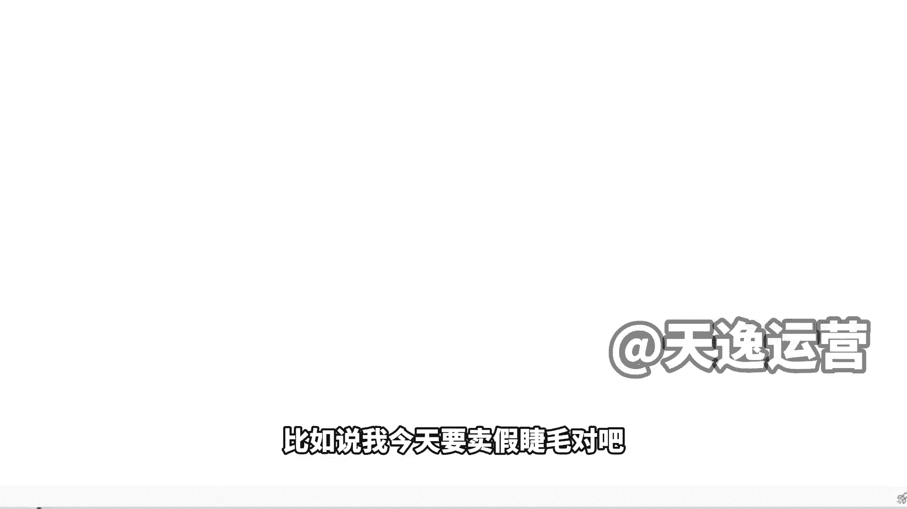
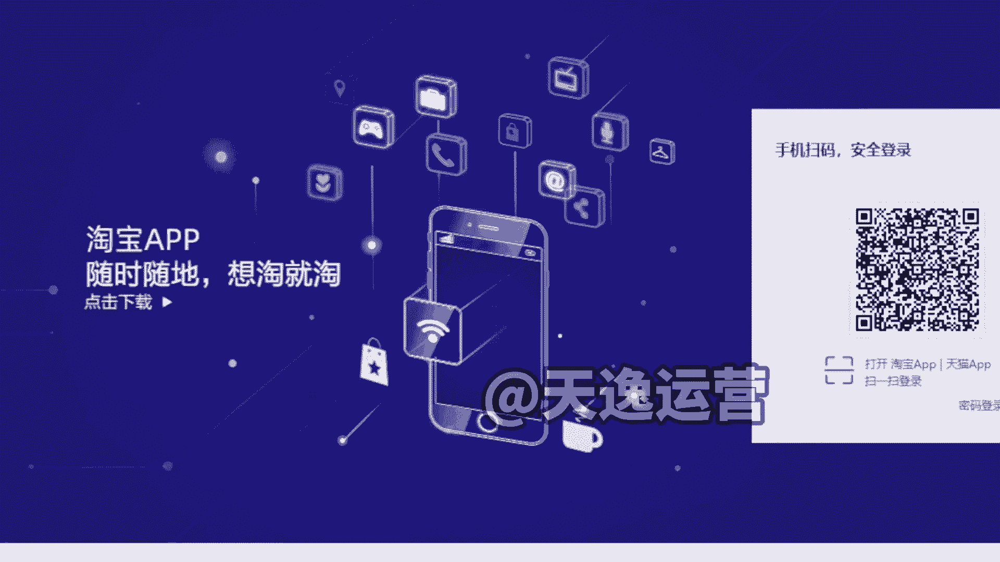
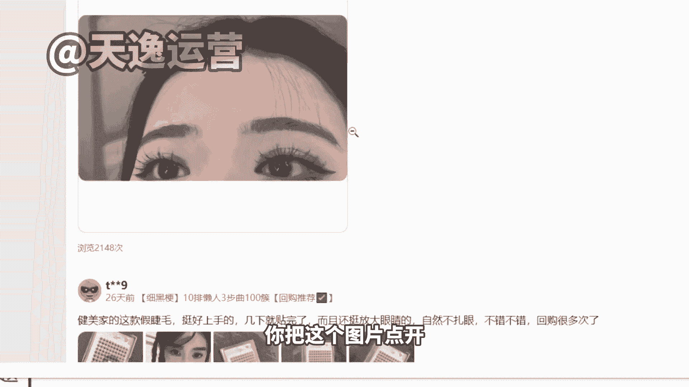
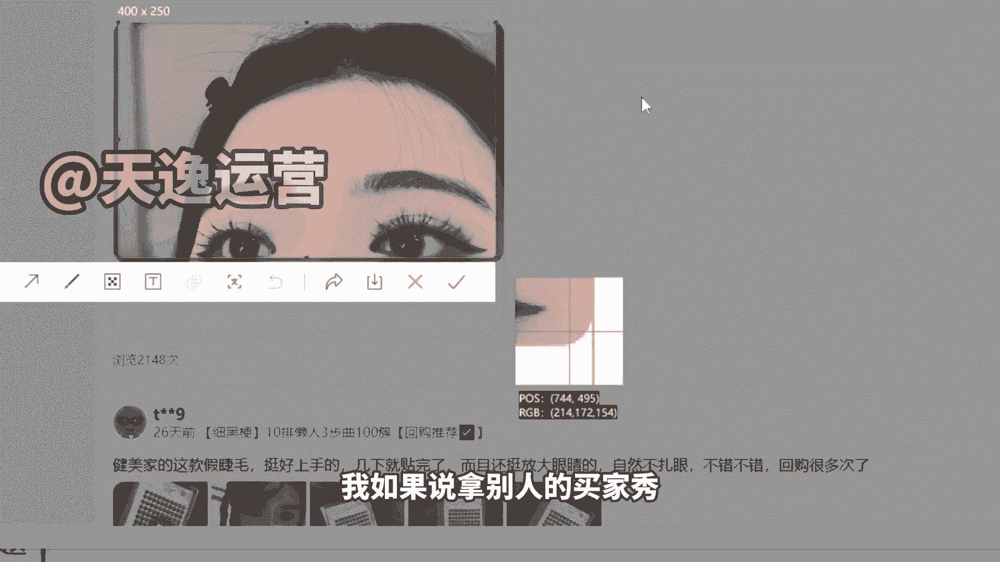
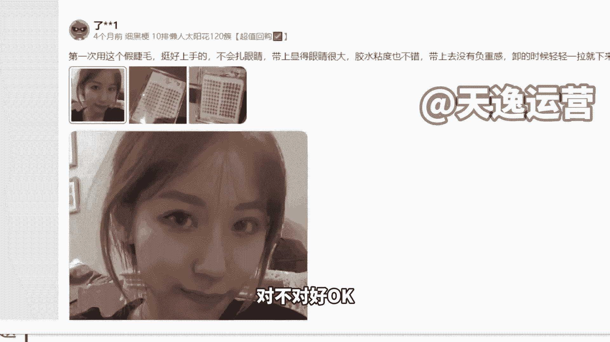
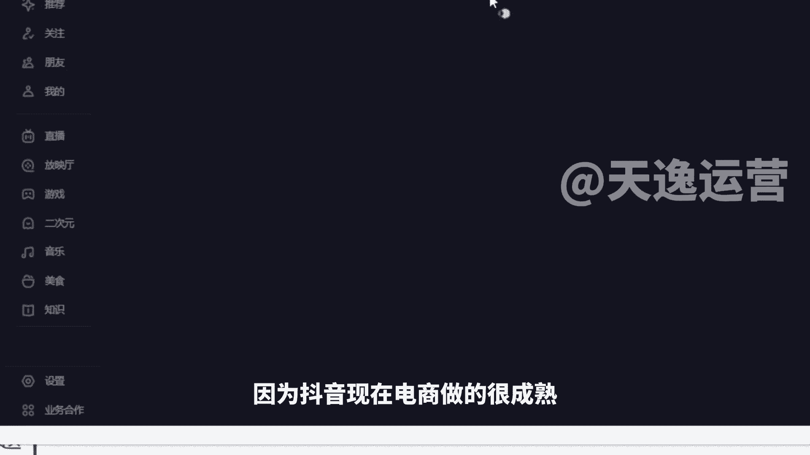
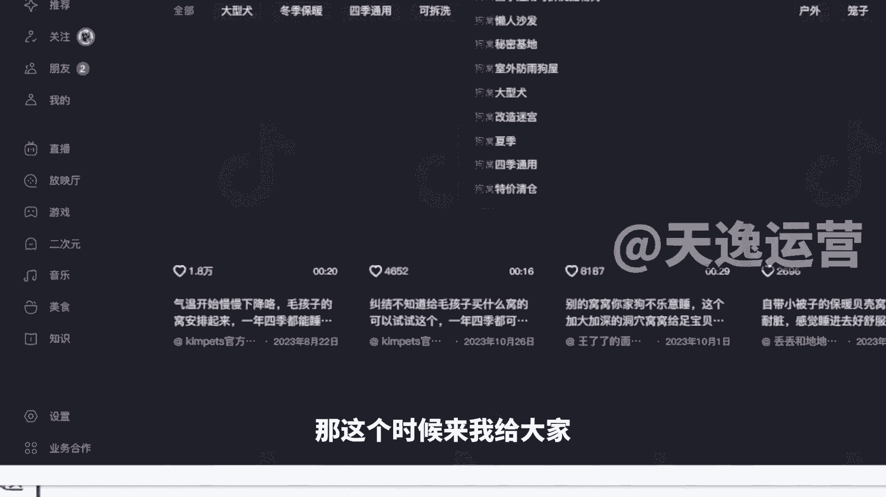
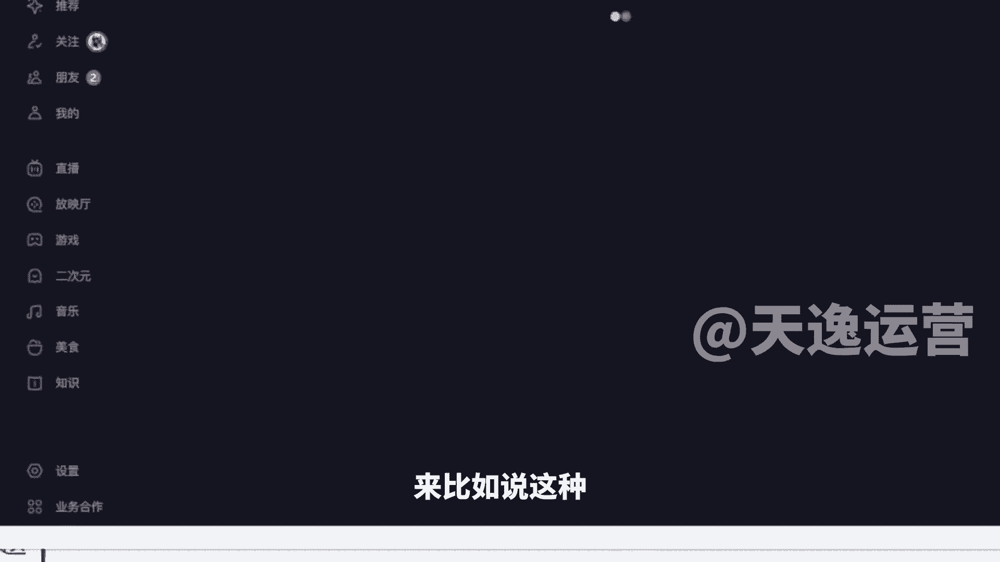
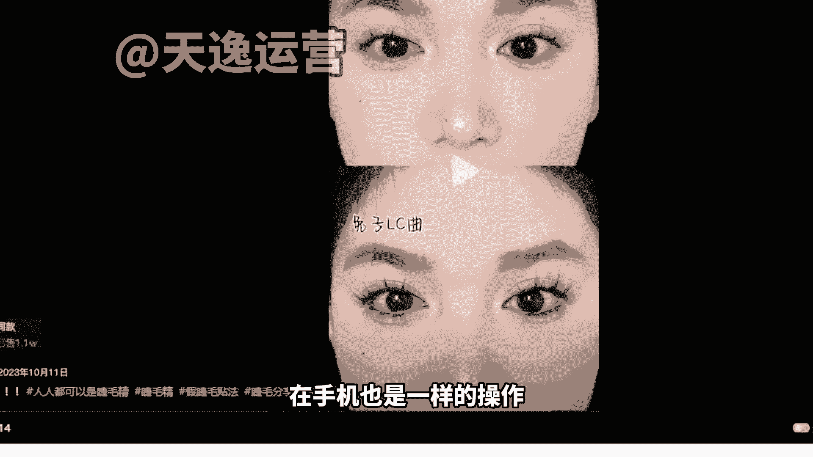
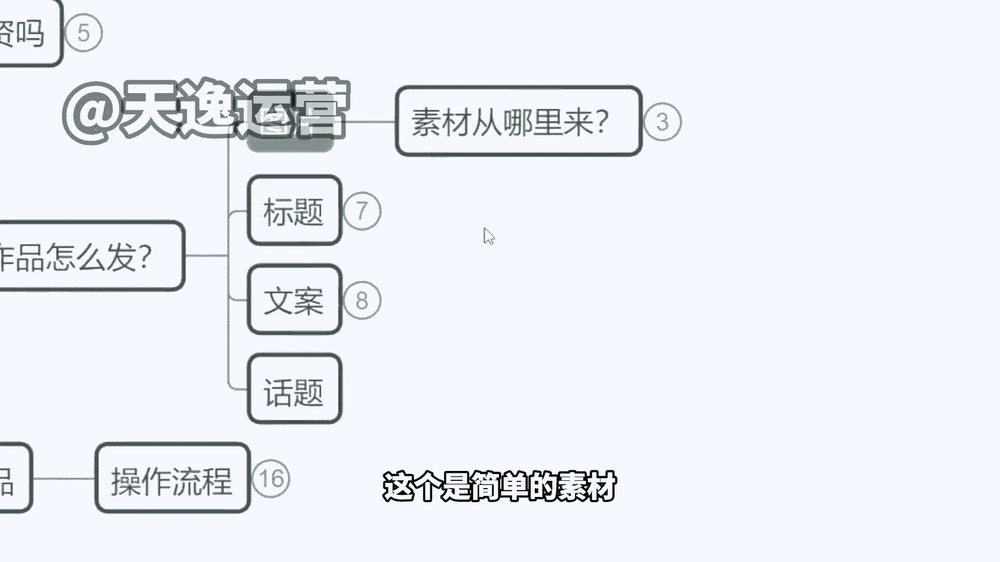

# 【150集精华教程】小红书运营新手起号 0-1新媒体运营必学课！不要荒废18-30岁，一切都还来得及 - P12：3.带货小红书怎么发，图片素材哪里来 - 索尼娅图 - BV1ND42137bn

啊来我们OK我们再来看第三个啊，就是那如果说我们确实是去开这个店铺的话，我们的作品怎么去发，是不是内容我怎么来去处理啊，来首先我们在小红书去发一个作品的话呢，他无非是这么几个组成部分，来我们看一下。

给大家找一个啊，就这种你看我们随机点开一个这个嗯，这个内容你看他就是这些图片啊，图片啊加上一个标题对吧，加一个标题，加上一大段文字啊，加上对这个产品的介绍好，OK这就是这样的一个这个作品的一个组成。

不需要去剪视频，不需要去做那个很长的那个作品啊，好那这些图片怎么来，咱们自己拍还是怎么回事啊，这个文章又怎么去写这么长，我都不了解这些什么美容仪物怎么来写，来，现在我来告诉大家我们具体一个操作方式。

第一个图片问题其实更多的啊，我们如果说去卖货的话，你的图片组成一个是产品的实拍图，产品实拍，就真实的拍摄的手拿的也好，那个产品放在一张床上，一个好的背景拍一张也好，产品实拍图。

然后再一个真人的体验图对吧，比如说我是一个卖化妆品的，上脸的效果，我卖假睫毛的，贴上之后的效果对吧，然后我卖等等这个其他产品在使用过程的效果，卖个沐浴露，你得去拍那个手上有泡泡的啊。

好来这个是真人体验图，加起来的话呢，最起码有个四张左右的图片是最好的啊，四张左右图片，如果我们追求这个产品的，追求这个作品的一个效果来，最好呢是有对比图，有对比图是最好的。

就是我使用产品前使用产品后的这个效果，那是不是需要我们自己拍呢，不用首先产品实拍图从哪里来啊，你找商家，因为像我们有的时候卖的一些货啊，他没有品牌，他也没有任何知名度呃。

甚至说我在淘宝我都找不到这款货啊，那你就要联系商家，因为他们有自己的美工，你让他们的商家给你提供实拍图，你说我让别人没发过的，或者说您这边能不能安排美国，现场给我拍一下啊，因为我这边是呃要做这个账号。

我是做自媒体的，帮您宣传你的产品，他一定会给你啊，这是第一种方式，那如果这个产品刚好它是其他平台也有在卖的，那就更好了，有现成的素材我们可以拿去用啊，好这个是一个那真人体验图从哪里来。

既然我们讲小红书是一个升级版的，高端的买家秀平台，那图片我们不妨就从淘宝买家秀来，对不对，来给大家看一下啊，我们直接在手机也好，在电脑也好，你到淘宝的这个界面去，我们直接去搜这个。

比如说我今天要卖假睫毛，对啊。

我直接去搜假睫毛来，我登录一下我账号啊，稍等一下给大家来看一下。

好登录上去之后啊，到时候我们直接在小额来稍等啊，这个还要再加载一下，好，就这样的，比如说我们搜了假睫毛以后，然后你们尽可能去看那个销量高的，看销量的那个排行榜，我们去找销量高的那个产品啊，比如说这样。

你看我选这个销量对吧，第一个的这个6万多人收货的这个九块九的啊，我不管这个产品跟我卖的款式是不一样的啊，像这种假睫毛啊，沐浴露啊，香水啊那些啊，然后包括啊像什么粉底液呀，对不对。

然后包括像什么身体乳啊啊，就这些东西用在身上是看不见牌子的啊，你找其他品牌的都是可以放心用的，你找其他品牌买家秀都可以用，我卖的这个牌子蓝天牌身体乳，但是我用的买家秀是这个多芬的身体乳的。

买家秀都没有关系啊，来那么我们直接进入到他这里面，有个宝贝评价是吧，有个宝贝评价，这里面有很多人是上传了自己的买家秀的，那我们就去里面找一找，有没有稍微高质量一点的这个图片啊。

比如说这个你看一下这个好不好看，能不能作为我们的这个买家秀来用啊，我们要注意点啊，就如果说这个美女有点美的太过头了，就是一看就是像个网红，像个大明星似的那种，太美的，咱们也不要啊，不真实。

稍微有种邻家女孩的感觉，像是我们身边真实存在的那种颜值啊，这种图我们可以拿来用，对不对，我们可以拿来用，包括底下再看一下，像这里是不是这些啊，再往下你看这个还有对比图的那更好了。

是不是还有对比图的那更好了，我们都可以拿来使用，但是为了避免啊，因为我跟大家说一下，为了避免重复，比如说你去买这个产品，你用了这个买家秀，别人也用的是跟你同样的一个图片，就很尴尬了是吧。

我们最好是往底下多翻一翻啊，往底下多翻一翻，找一越往后啊，用的人越少的，那我们可以拿来使用，是不是，然后像这样的图，我们是不是就可以直接直接拿来发了，对不对，但是我跟大家讲一点啊。

因为这种图片如果你直接去点击下载，那么它的一个图片代码是淘宝的代码，是不可以直接发的啊，因为这个代码的问题，会导致我们的作品是违规的，那么怎么办，手机截图会不会，手机截图会吧，你把这个图片点开。

不要直接保存，我们用截图的方式把这个图截下来，然后再用，然后再用，那么这个时候大家会面临一个问题，我如果说拿别人的买家秀。

别人上传图片去发作品，我不会造成违规的现象吗，是不是我不会侵犯他人那个肖像权吗，我跟大家讲，小红书本身我们走的就是一个买家秀的路线，那么我们在发布了这个作品之后，你不能讲这是你本人。

你要在我们的文字当中去描述，比如说图给图几是世代效果，你讲清楚这是产品的世代效果，你不用说这不是我啊，你就说这是产品试戴效果，明白了吗啊，我们这样去讲就可以了，我们这样去说就可以了。

如果遇到本尊要求你下架，那咱们就下架换张图片就可以了，这个是可以去操作的啊，这个是可以操作的，我们目前在小红书看到很多这种真人露脸的，都并不是这个账号本人啊，并不是这个博主本人好，这是第一个方式。

在淘宝买家秀直接去获取这个图片，是不是真的很方便对吧，这里面还有好多啊，你看每一个是吧，人家为了好评返现啊，给他回一个这个图片，那这个咱咱们是可以拿来使用的啊，这个还有清纯的啊，对不对好。

OK那除了这个以外呢，还有一个方式在抖音啊，因为抖音现在电商做的很成熟。

在抖音里面带货，答案是很多的，那这个时候来我给大家。

来比如说这种啊。

像在抖音平台里面也有这些带货的一些作品，那么但是呢我们要注意一点，如果你用的是抖音，已经签约公司的达人的素材啊，就好比说这个博主他是签了公司有NN的，对不对，那么你是不能只用。

直接使用人家的全脸的素材的，比如说你看他在他在卖的这一款假睫毛啊，他是有一个什么，它是有一个试戴过程的诶那这种素材就很好，因为你看他有这样的一个对比，是不是普通睫毛啊，然后戴上这个款式之后啊，对不对。

有这样的一个效果，那么我们在使用他的素材的时候，一样使用截图的一个方式，但是你不能够把它的整个脸部的所有五官，都截下来，你只能去截部分，比如说我截他单只眼睛光是这样一张图，其实也很好看了，对不对。

普通睫毛是这个效果，带上我们的产品之后是另一个效果，这个使用前使用后的对比图，它是不是也有了，对不对，是不是也有了，像这种视频里面去截图，使用的素材重复率反而还会低一点，就是没有人跟你撞款。

没有人跟你撞行啊，发出去之后效果可能会更好，这个是我要教大家的几个，这个方式啊，然后当然呢我们会遇到一个问题，因为我是电脑打开，你看这个点赞啥的，在边上不会遮挡，对不对，你们正常在抖音里面呢。

这边有个头像，有个点赞，有个评论什么的，把这个视频遮挡掉了，那如果你直接下载呢，它又会带一个这个抖音的logo在上面就很尴尬，如果之后我们想要使用这样的一些素材的话啊，到时候呢我去给到大家一个工具。

来给你们看一下，咱们不要去点下载视频啊，我们一定要去复制这些视频的链接，在手机也是一样的操作。

然后呢我会给大家去送一个工具，这个工具是可以免费去水印的，在咱在咱们的这个微信小程序里可以直接用啊，点击粘贴链接好就好了，直接人家的整个视频给人家copy下来了啊，水印什么的完全没用。

我们再到这个原视频里面去做截图就可以了，来这个大家听懂记住了，没有听懂，来咱们扣个一啊，记住了，明白了，公屏扣一，嗯好OK这素材问题啊，呃当有同学说老师，那我能不能去找人拍呢，当然可以。

我为什么不建议大家前期做原创，因为你的试错成本很高，我们并不能确保说我请的这个模特，给我拍的视频就一定能火，那每条视频都是一个成本，在这个时候你前期投入资金过高的情况下，你很难获利。

但如果说我们前期以这种搬运的方式来进行，对不对，那么效果会更快一点，会更显著一点，等你的收入上，你说像我们现在有同学能做10万店铺的，你到达人家那个水平，你再花钱找模特做原创。

因为你之后那个账号想长久引流嘛对吧，我想长期做，我想做得更大一点，你再去什么找模特去拍呀，拍这个照片什么的，拍这个图也就100块钱一张，请模特拍就100块一张，但是现在没有必要去投这个钱，说实话啊。

来OK这个是简单的素材。

