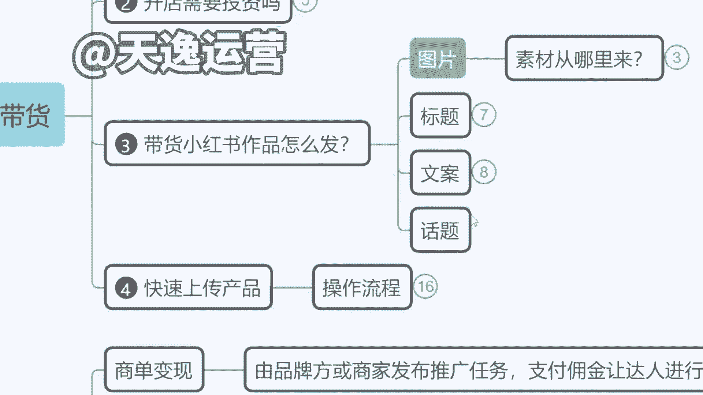
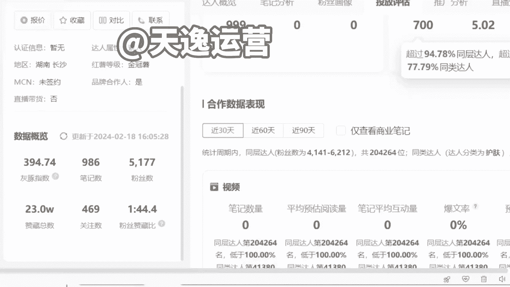
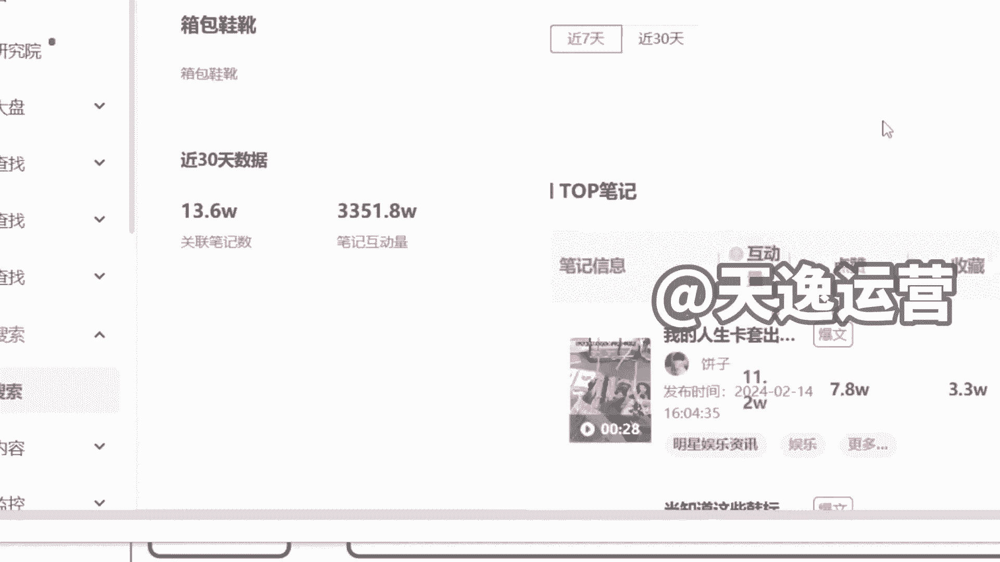
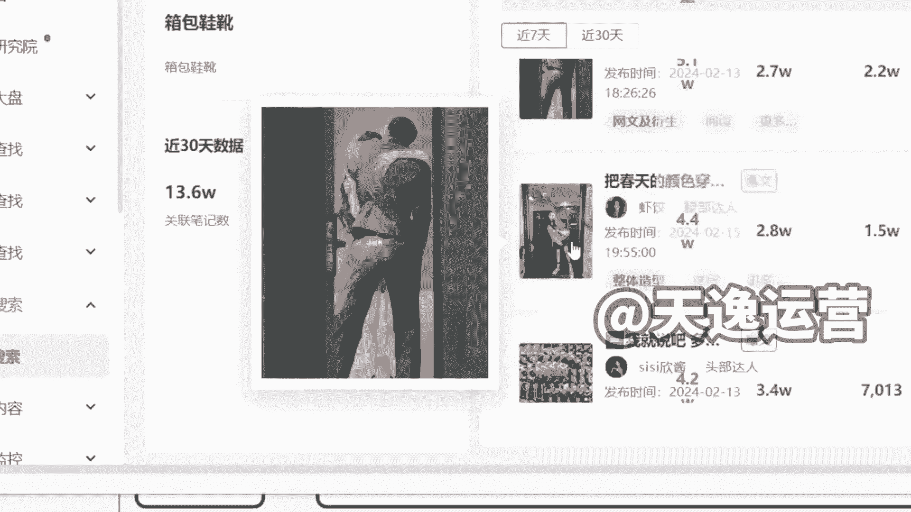
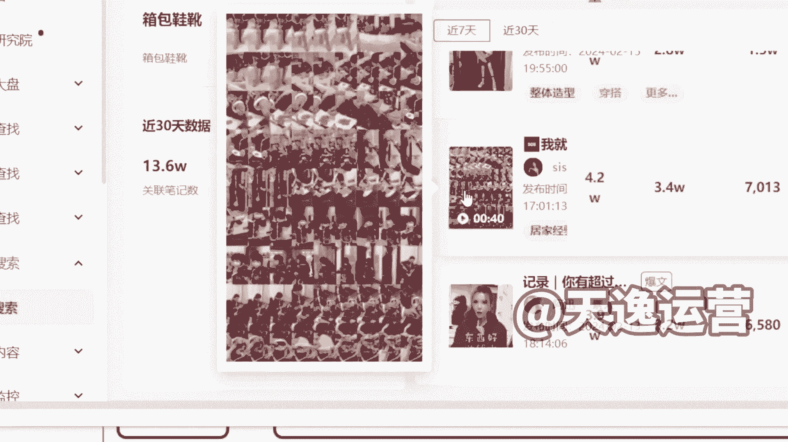
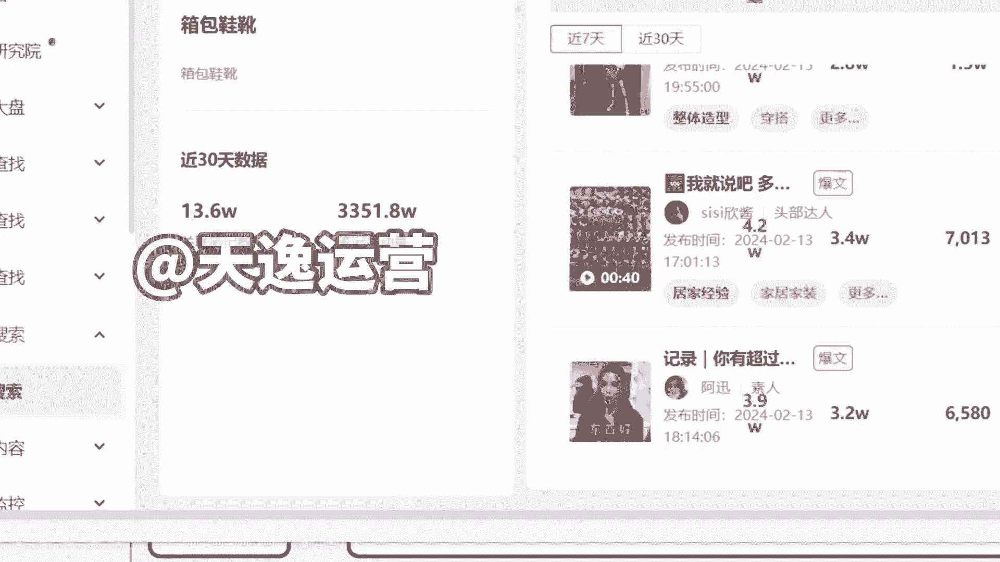

# 【150集精华教程】小红书运营新手起号 0-1新媒体运营必学课！不要荒废18-30岁，一切都还来得及 - P15：6.小红书的话题怎么找 - 索尼娅图 - BV1ND42137bn

另外就是话题的话，到时候我们会有包括我给大家讲啊。

你们到时候如果说在文章里面，不知道带什么话题对吧，有更大的一个热度，然后包括你不知道要卖什么产品的。

我们现在是直接拿到了小红书后台的，所有的统计权限，我给你们看一下，我们是有这种，比如说呃品类的一个品类搜索给大家看啊，就是我们有比如说我要做箱包鞋靴，对不对，我要做这个箱包鞋靴，女鞋男鞋等等都OK。

那么我们在后台是可以直接看到，比如说这个笔记有多少篇，一共有多少篇，然后呢这些所有的笔记里面，爆款当中用的关键词最多的是什么，达人分析品牌，分析它的关键词，分析，高频的评论词我们都有。

就是我们可以直接看到整个平台。

包括他每天新的作品发的这些内容是什么。

然后包括他是怎么样去做的引流，就是我们这边可以直接看到后台，所有达人发的作品。

然后到时候如果说你们需要说老师，我不知道我应该怎么去发这个内容对吧，我不知道我当下卖哪个款式，比如说同样是之前啊卖一个这个长筒靴，我是卖这个V型的，还是圆形的这个血统的，然后包括我卖棕色还是黑色的。

这个其实都有讲究的，然后到时候我如果你们需要的话，我们直接导出数据给你们，就是我们会导出后台数据，告诉你哪个款式是当下适合去卖的，然后你卖就可以了，有这个专业数据来做扶持的话，比你去测评不断试错。

效率要高很多啊，然后这个的话我们到时会给大家去操作啊。

