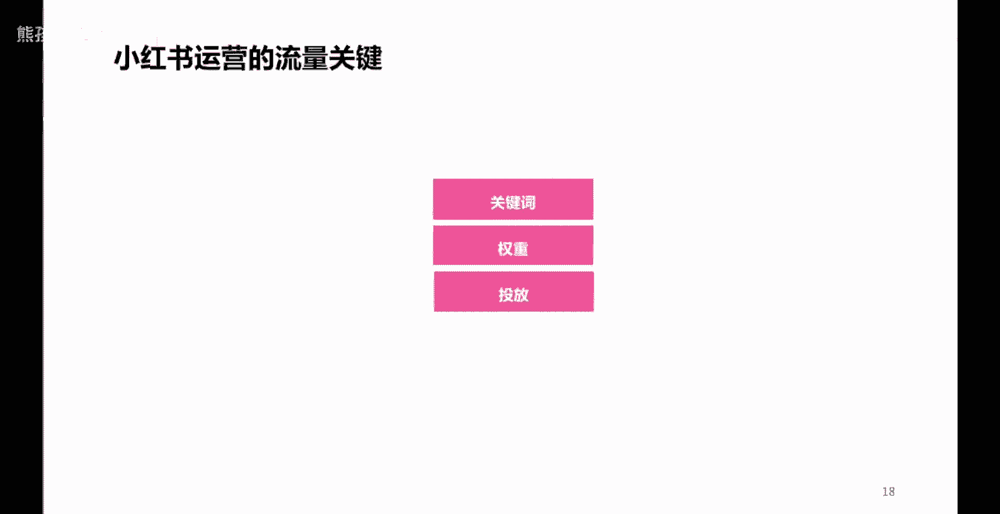

# 【150集精华教程】小红书运营新手起号 0-1新媒体运营必学课！不要荒废18-30岁，一切都还来得及 - P16：P14影响小红书流量的三大关键因素 - 熊孩子在b站 - BV1hw4m1X7aw

往下看，那么说到底影响小红书笔记内容的一个流量，关键点在哪儿呢，啊或者说提升流量还有什么样的一些技巧呢，啊就是这三个点，第一个关键词，我们在写小红书内容笔记标题的时候，或者是笔记内容的时候。

或者是做图片，做视频的时候，是否清晰清晰，匹配的体现了我们账号的垂直定位，清晰地体现了相关的一些关键词，这个非常重要，第二个是权重，虽然呢有些人说这些账号不存在权重这一说，但是呢我告诉大家。

权重指的是什么呢，指的是你账号的一个活动，你要记住，我刚才说的一句话，任何一个平台都喜欢活跃用户，所以你经常活跃啊，有规律的去进行内容的更新发布，一定程度上是有利于你这个效果的一个什么呢。

提升的第三个点是投放啊，大家都知道小红书呢，笔记呢有一个投放的一个渠道呢叫做薯条，它呢是可以通过付费啊，通过付费，一定程度上呢可以提高你一个笔记的效果对吧，这个功能叫薯条，大家呢打开小红书啊，笔记啊。

在笔记浏览那个界面右上角有三个点，点开之后呢就可以看到啊，下面底部有一个薯条功能，他呢是可以付费来进行，把笔记流量或者是点赞评论这些啊，做到一个更好的一个提升的啊，那么这三个点呢。

也可以为我们小红书的笔记内容带来一个比较，唉来说比较是更好的一个效果啊，获得更好的一些流量，更多的一些流量啊。

