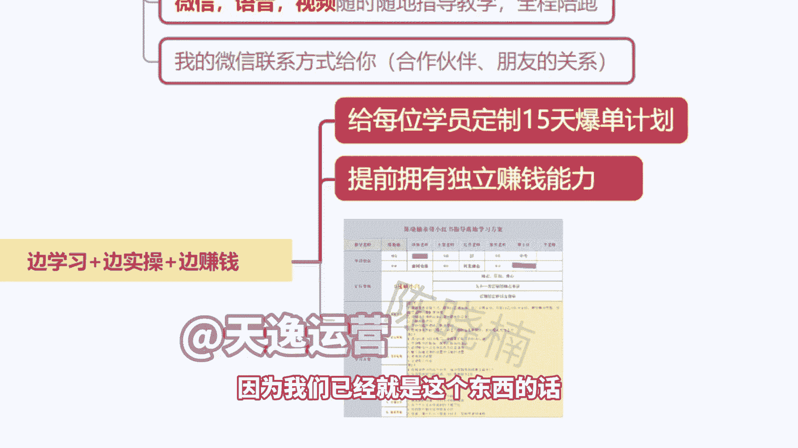
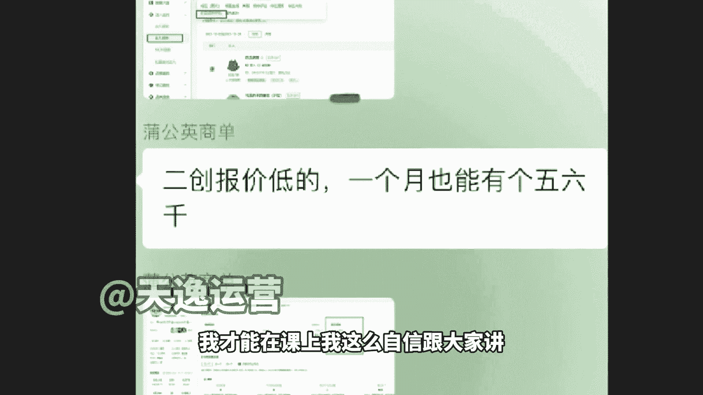
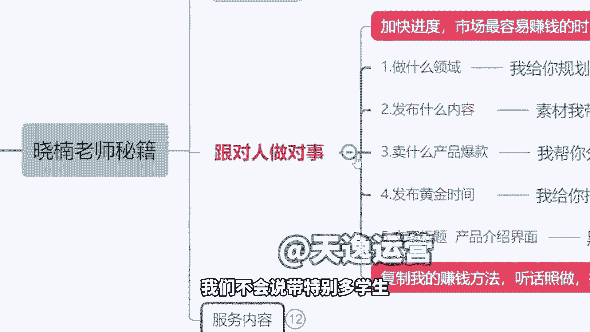
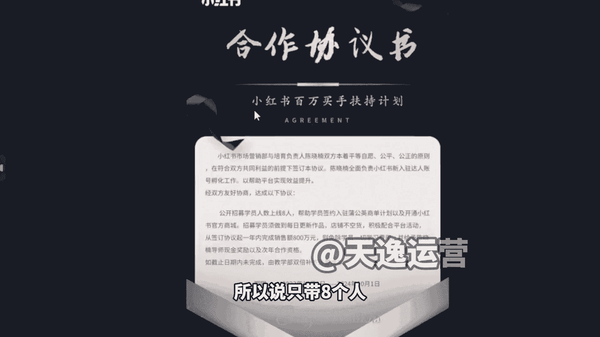
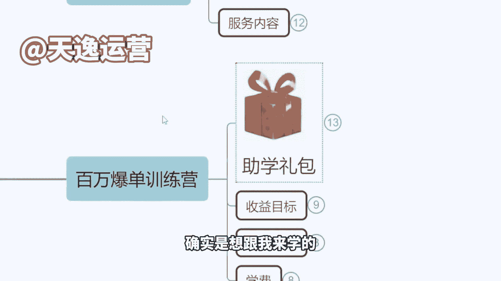

# 【150集精华教程】小红书运营新手起号 0-1新媒体运营必学课！不要荒废18-30岁，一切都还来得及 - P20：晓楠老师秘籍 - 索尼娅图 - BV1ND42137bn

来跟大家做的一个这个分享，因为是这样的，其实我我讲句实在的，时间不就是成本嘛，对不对，现在小红书上这个上春晚还不够明显吗，这是流量的一个大爆发时期啊，就是如果说你们是自己去摸索的话。

你简直是等这个平台爆发期过了，OK我会了，我明白了，我懂了，市场跟你也没关系了啊，对不对，所以说我们如果不会方法的话，第一个效率很低，第二没有工具的话呢，你也不可能说做出这么好的作品，也不可能去赚到钱。

包括没有资源店铺，你开不下来，没有流量推送，然后包括你想去接那个商单，你连平台的那个审核都过不了，就是都没有人去帮你交资料啊，你连这个门槛入门的这个门你都不知道在哪走，别说敲门了。

你连这个门在哪咱们都不知道，对不对，所以说相当于说我是带大家上高速，因为我的想法是这样的啊，我知道我听过一些同行的课，就他们有人讲完之后，这个老师确实挺厉害，有这个两把刷子啊，但是他后面跟你卖课。

他说啊，你来买我的这个课，我一套课1万块钱，2万块钱，你来买，然后跟着我来学，跟着我来听课，就这个东西，我们之前也考虑做这个事情，我这个我们这个叫我们跟我说过这个事情，我说我不要开课，我说我不去。

我不想去讲课，我为什么不直接把这个计划给你规划好，因为是这样的，你跟着我来学这个东西，咱们是来学挣钱的啊，不是说我来学语文数学的，所以说我的计划是这样的，你钱就未来从今天从明天起啊。

你未来的一到两个月时间，我不希望你有太多自己的想法，就是如果没有货的情况下，你没有产品的情况下，我让你卖啥，你就卖啥，可以接受吗，我让你做什么类目就做什么类目，因为我们是自己测评，测了之后确实可以卖。

我才让你去做这个东西，如果说你再测一个新的频，时间太长了啊，我可能等不了，所以说做什么领域，我到时候挑大概4~5个，我给你选哦，我肯定会尊重你的想法，我说这四个当中，你觉得哪个你更喜欢更感兴趣。

我们就做其中的，或者说你说这四个我都做对吧，我做好几个号可以啊，然后发什么内容素材带你去找，包括你到时候所有的作品，文案标题图片找完之后，你必须先发到我微信，我先看了没有问题，我说可以允许你发。

你才可以发，不要贸然发布，包括你在接商单的时候，如果说啊你把这个文章发给商家，那个商家说不行，这个不通过，你直接不要说自己在那乱改，你把你的文章发过来，你告诉我商家给你的反馈是什么，我教你怎么改。

改到可以通过审核了，OK再去做，因为你能够接到这个单，你能拿到这300块，假设是300，那我有50啊，你能拿500，我们大概有80左右，我也想挣这个钱呐，啊所以说我帮你改，我教你怎么去改。

直到可以通过为止啊，然后另外呢我们的这个发布的黄金时间，对不对，我给你定啊，还有产品标题等等，黑科技直接去搞，就是我们直接来，相当于说我在上面写标准答案，你在下面抄就行了，我们在前期先把这个账号做起来。

不然如果说第一个月，第二个月全在那学，光是学东西，人是有惰性的啊，现在这个社会很现实的，你一个月不挣钱，你第二个月坚持得了，不可能你天天上班那么累，下了班在那听课啊，我觉得这个是没有意义的啊。

所以说我到时候是这样，我们是以主要的辅导为主，就是我们的孵化为主，我带你去运营这个账号为主，那么我是你的指导老师，我全程我本人来带啊，不会说今天老师你我很喜欢，你报名发现不是你带是吧。

偷梁换柱这个不存在啊，然后另外我们还会有专门的解答，老师到时候我直接拉个小群，我在里面简单老师在里面，你在里面随时发信息，两个老师第一时间给你回复啊，好那么同时呢，我们到时候也会有一些课作为辅佐。

因为有的内容没有必要说一个一个同学去通知，我们就会派一个老师专门去讲一下平台规则，那这种这种课的话，一个礼拜就三节课左右，不会耽误，不会耽误你太多时间，一节课半个小时的样子，如果你晚上八点没空看。

你就在下午的时候吃饭的时候对吧，边吃饭边打开那个看一下，我们会把重点给大家列清楚，然后另外呢你会加我的私人微信，后期每天你要保证拿两个小时的时间，空余时间出来，我不需要你固定多久多久，就大概两个小时。

因为我会要求你今天得发作品啊，啊要求你去看同行对吧，得去看同类型的作品，然后包括呢我们要去挑产品，什么颜色啊，款式啊，功能啊，这些你都要去了解的，因为我们作为新手来讲，你要知道的东西太多了。

我们最起码两个小时时间是要花出来，你中午一小时，晚上一小时或者晚上两小时都可以，你告诉我你几点有空，然后我是下午一点到晚上的11点我都在线，你们随时来找我就行，上晚班都没关系啊，上午有这个问题的话。

你给我留言，我看到就回你好不好，然后另外我跟大家说一下，就是我们之后也会给大家去制定好，这个包单计划啊，我算是很好说话的老师啊，我跟你们讲，真的是这样的，我不是说我自己做出点成绩，我在那高高在上午。

你说你问个问题，我懒得理你，我不不会是这样的人，因为首先我自己是普通家庭出来的啊，我不是富二代，我爸当兵当了十几年，我妈以前也是在工厂里面上班的，我是14年的时候，我大学不是学的电商专业。

我大学学的什么，我大学学的是市场营销，然后我当时在14年一毕业的时候，我就在水利局上班啊，我一直考事业编进去的，然后我跟你们讲，我说个题外话啊，就是我觉得我也想找到志同道合的人，跟我的想法是一样的。

就你有这个动力的，我当时遇到了一个什么事情，我以前觉得其实我一个月拿3000多工资挺好的，我够花真的够花，我就骑个电动车，我又不用说加油什么的啊，之前没有什么高消费，直到有一天啊，呃跟我同样的一个岗位。

在我隔壁办公室的一个女生啊，跟我一样的年龄进到进到我们单位之后，人家是靠开奥迪A6上班的，给我的感觉是什么，不是说虚荣攀比什么的啊，我真的是想了一个问题，我在想我如果要挣到他这辆车，我要多少年。

我算了一下，我觉得有点绝望啊，我就真的是有很绝望的感觉啊，就真的很绝望的感觉，所以我就跟我家里人讲，我说我手里有点存款，你6000块钱也不多啊，当时我说我想去出去创业试一下，我说我去出去干一年。

实在不挣钱，然后我再回来再考，因为我当时觉得我还能考上啊，我就这么跟佳颖讲的，我就毅然决然出去做了，那确实做了半年时间，当时做淘宝挣到钱了啊，所以说我觉得其实很多时候，我们不是说缺那个赚钱的认知。

或者怎么样给自己一个机会吧，有好的风口赶紧去试一下，对不对，趁现在还有机会，因为我们没有说到什么很差，我欠了几10万100万，我无法翻身的这样的一个干这样的一个境界，也不是说让你去投资做生意有风险。

我们做小红书本身，它就是一个零投零投资的一个事情，对不对，我们正常你达到1000粉丝了，你接商单就是有回报，因为我们已经就是这个东西的话。

给大家看一下，甚至让商贷经理自己给我发的信息啊，所以说我把他这个备注改了，你们看一下他怎么讲的，二创报价低的一个月也能有五六千块钱，这是他跟我讲的，我才能在课上我这么自信跟大家讲。

我说你们街上单最起码一个一不留情，因为人家给了我这么多资源，只要你有时间，这个单我拿给你接，你完成了就是有这个钱的啊，那另外呢我们就会直接给大家定位好，就是每天你一个计划啊，每天一个计划，新手进来。

最最这个担心的不就是说跟无头苍一样吗，你说老师我想问问题，我都不知道问啥对不对，所以说我们直接定好第一天你要干嘛，第二天要干嘛对吧，注册小数账号，设置好账号相关信息，学会打标签，学会文案设置。

话题设置等等，就每一步我们给大家规划好了，你照做就可以了啊，就是这样的，然后另外呢，因为这一回我们不会说带特别多学生啊。

我自己本人来带的话，我也考虑到一个效率问题，所以说只带八个人跟大家先说一下。

到时候你们看有多少同学是想跟着我来做，我们到时候直接报名就可以啊，我带八个同学，那么这八个人呢蒲公英商单给你们开通，然后呢小红书官方商城给大家开通，但是你们必须做到一点，就这个必须要承诺的啊。

必须每日更新作品不能断更，因为如果说超过三天断更，我是要罚钱的，另外呢店铺不能空货，必须上架20件产品以上的这个货，而且呢不能说放虚假库存，比如说没有货了，你填了有货对吧，结果人家下单你发不了货。

这个也是要罚款罚不的，不是你是我啊，另外呢呃我们之后给大家的一个规划，就是我们在半年之内，必须要做到10万销售额店铺，如果你觉得OK这个目标我还挺满意的对吧，想跟着我来做啊。

