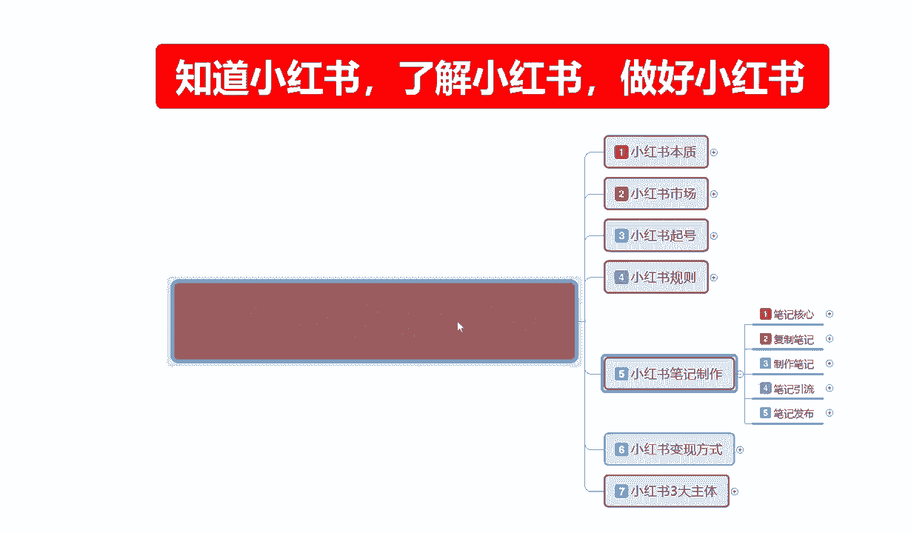
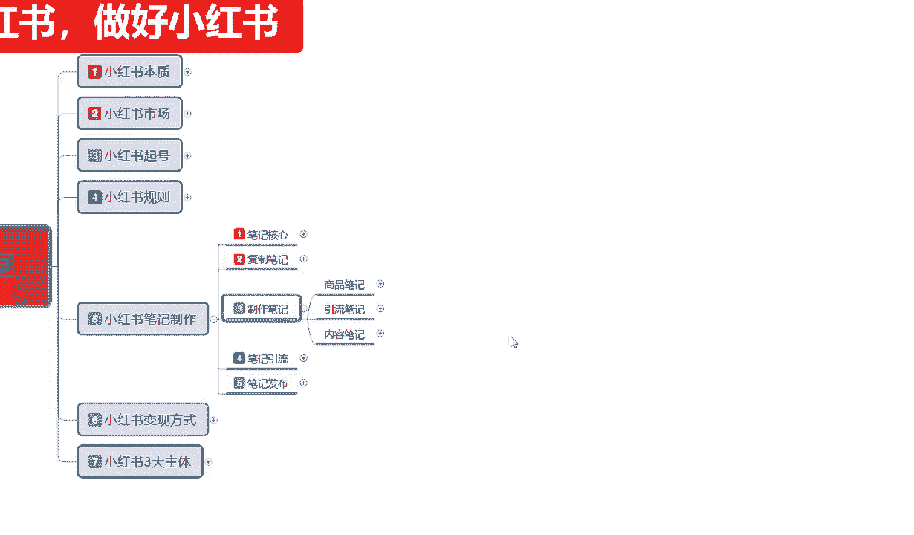
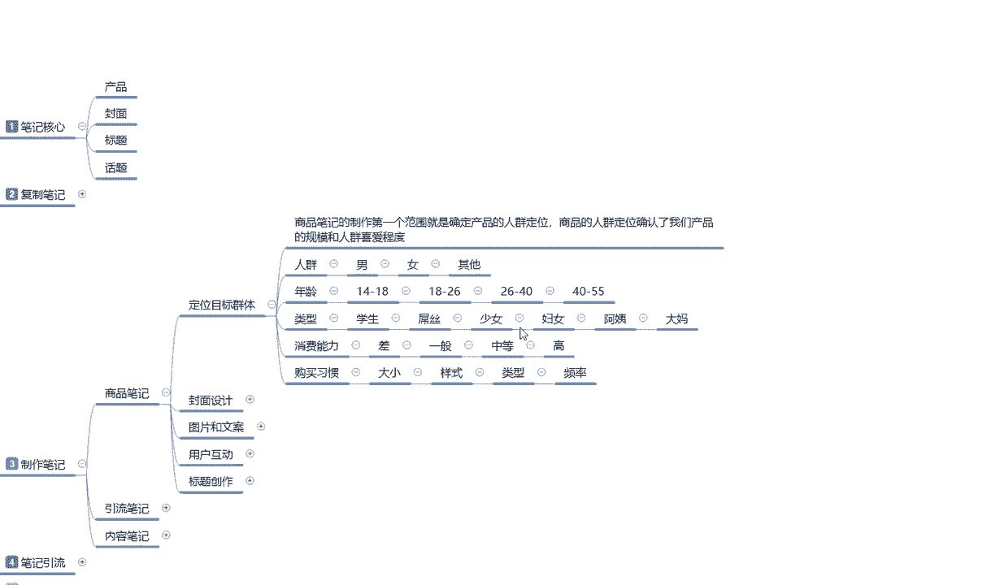

# 【150集精华教程】小红书运营新手起号 0-1新媒体运营必学课！不要荒废18-30岁，一切都还来得及 - P21：19、小红书【商品笔记】制作：定位目标群体 - 剪_映教程7 - BV1Px2JYDEu9

大家好，今天给大家分享的是小红书全集系列，的第五大课时。

小红书笔记制作，第三点内容。

制作笔记，小红书制作笔记啊，这个的话和之前给大家讲的那个父子笔记，他是不一样的，复制笔记的话只是说我们在前期嗯，对小红书不理解，不了解和对自己不信任的一个自我感官上面啊，进行了一个优化，制作笔记的话。

它适用于的话，就说我们小红书前面店铺，前期的一些基础已经全部做完以后，我们开始需要推广自己的一个产品，推广自己的产品也好，或者说是你从别的地方拿的产品过来也好，觉得这个产品能卖，就说我已经给自己去定位。

全部找准了以后啊，我要开始卖我的商品也好，我要做我的引流也好，我要做我的内容也好，我不管我们大家是真的在小红书上面去，卖产品也好啊，卖内容也好，卖情怀也好，不管你是做什么，你要有一个主体。

那么所有的主体都是围绕这个笔记来制作的，也就是小红书最重要的一点，笔记制作，他和复制才的笔记的一个区别在什么地方呢，复制笔记你是把别人的东西拿过来，放在自己的一个账号上面进行推广宣传，然后进行销售。

制作笔记不一样，它是根据我们自己自身的一个产品啊，我们去做他的一个商品笔记也好，引流笔记也好，内容笔记也好，第三个点，围绕我们单独的一个商品，进行的一个推广和宣传，目的性明确啊，实用性效果好。

同时呢容易爆款，它整体来说的话比父子笔记要好报的多，为什么父子笔记里的爆款，就可能不到五1‰，但是我们自己制作的笔记，你可以打到，1%到2%的一个概率，就是你的账号整体起来以后，内容发的好，笔记做好了。

很容易就把访客，还有我们的一个粉丝数量，包括你引流的数量，就是很容易去吸引一对这个商品也好，对我们个人也好，对我所发的内容感兴趣的人群也好啊，很容易吸引到，但是它有一定的制作难度啊。

那这节课呢给大家主要就是讲解一下，我们制作笔记里面的一个商品笔记怎么去操作，整体的制作笔记里面我还是给大家分了三个点，第一个就是商品笔记，第二个是引流笔记，第三个是内容笔记啊。

还是和之前一样，我们先看商品笔记，商品笔记啊，我们在制作商品营笔记之前，我们要先确定五个点，第一个定位目标的一个群体，第二个封面的一个设计怎么去创作，第三个是图片和文案。

最后呢是用户我们和用户之间的一个互相沟通，因为笔记里面的话，他就和抖音类似的啊，别人给你评论留言，你怎么去给别人用户互动，最后一个就是标题的一个创作，为什么把标题放到最后啊。

虽然说我之前在给大家讲笔记核心的时候，也给大家说过啊，笔记核心的这几个点，我不知道大家忘了没有，封面是第一要义，标题是第二要义对吧，产品和话题就是我们中间的一个互动环节，是补充物，是粘合剂啊。

增强用户对我们的一个信任，包括一个喜爱程度，那首先我们来了解一下啊，商品笔记的一个定位，目标群体，它是怎么个定位，商品笔记里面啊，定位目标群体，就是我的产品已经选好了，或者说我要宣传的内容也选好了啊。

我要推广的一个方式我也选好了，那首先第一个点我们要选择定定位目标人群，这个定位目标人群，第一个在这里我给大家重复一点啊，小红书平台上面我们一共要定三个点，第一个用户的人群，第二个商品的人群。

第三个是我们自身店铺的人群，那制作笔记它对应的是什么呢，对应的是用户人群，就是笔记制作出来以后，它是由我们通过这个呃所定位的人群，通过我们账号的一个调节去选择用户，我们这些产品。

我发的所有笔记对面向的用户是什么样的人群，在这个里面商品笔记的一个人群的话，是确定我们的一个产品，也是确定用户的一个人群，这两个要两相结合，相互匹配啊，才能达到精准人群，精准人群结束以后的话。

我们的店铺会定型达到第三阶段啊，店铺人群定位，只有通过这三个阶段的一个人群定位，我们才能把自己这个整个小红书的账号，权重给提升起来，首先我们来了解一下啊，山本比商品笔记制作，第一个范围。

就是说确定我们产品的一个人群定位，商品的人群定位确认，那我们产品的规模和人群的一个喜爱程度，就是我们把产品选择明确了以后，其实我们就已经把我们的市场选择好了，那我们在市场里面的话。

其实这里面还有人群的年龄啊，人群的性别，年龄类型，消费能力和购买习惯这五大点，这五大点分别是什么呢，人群，男性女性其他小孩小孩老人啊，或者说是呃男性之间给朋友互相购买东西。

女性之间给朋友朋友互相购买东西，一个人群选择范围非常重要，小红书是以女性为主，但是女性给男性买东西的概率也有啊，虽然说没那么大，那么我们在选择产品的时候，有些朋友的话，他可能喜欢做冷门产品。

因为冷冷门产品的市场虽然小小，但是它的转化率包括他的利润是非常可观的啊，这就靠我们自己，大家怎么说呢，商品选择的怎么样啊，在这里我就不过多重复，所以说我在这里的话就是说把人群的一个范围，是把它单独划划。

划分开了，男女和其他三个选择类型，男性的我们只做就只做男性，女性就只做男性，女性，如果说男性和女性满不满足不了，因为我在这个地方给大家划分的这个男女的话，他是有年龄限的，18~35只做这个范围之内。

低于18，高于35，都是其他类的一个性别范围，因为他们的话我们要去呃大范围少网，为什么他们的整体用户对比，男性和女性用户的话少很多，18~35，小胡是3亿，用户里面可能占2。5亿。

剩下5000万可能的话就在其他范围以内，所以说其他的话要全抓，你再从其他里面去挑，挑年龄，挑些类型，挑消费能力，挑购买习惯，那你说实话你的店铺做的太精准了啊，意思就是说你起步很难，后续发展更难。

因为你整体就没什么人来观看你的产品，那你能卖得出多少呢对吧，所以说我们在选的时候，三个里面只选其一啊，要不做男性产品，要不做女性产品，要不做其他产品，产品定位选择好以后选年龄，年龄的话。

在这个里面有十八十四到18，18~26，26~40，40~55，我只是给大家划分了大概的四个范围，这四个范围就是我们所选择的一个年龄，因为14~18的话，他们属于小孩子，小孩子的一个消费能力。

平均的话他普遍不会太高，18~26有一定的消费能力，但是比较理性，什么叫理性化，不是太舍得花钱花钱，他的目的性很强，要达到什么目的才可以，24到二二十六，26~40比较随意。

为什么有一定的经济基础实力啊，比较在乎实用性的一个产品，40~55，那就是捡便宜了啊，或者对自己觉得有用的东西，什么自编啊啊保养啊，年轻呀，美化啊等等这些啊，显得有气质啊之类的。

就是说我们在选择完性别以后的话，选年龄只能做这一个范围之段之内的啊，你超过这个范围段之内以后的话，你比方说我选个女性，18~26，我去做26~40的一个产品，那个笔记去做推广，笔记的格式。

形式的话都是按照26~40岁啊，进行的一个笔笔记发布的一个文案去操作，不一样，为什么说我们制作笔记的时候，一定要先选选择这些东西啊，每个年龄阶段他所喜爱的内容不一样，喜爱的风格不一样，喜爱的画风不一样。

虽然说他都有包含性，但是我们要找准确性的啊，所以说我们要先了解这些东西，第三个就是类型，选完人群，选年龄年龄，选完选以后选类型类型是什么，学生屌丝少女妇女阿姨大妈，这个里面的话，其实在年龄阶段里面。

他有不同的一个基础，你比方说学生14~18基本上全是学生啊，你现在的话你不像以前现在初中毕业的很少，基本上都是高中以后，再正常一点，熟悉一点的话，就是我如果说选14~18这个范围的话，基本上都是初中生。

他没有高中生以上，他玩小红书的这个范围的年龄，14岁以后到18岁以后的话，去做小玩小红书的基本上都是小女孩，男性基本上为零，从18岁以后才会有慢慢的有男性用户进来啊。

这个大家一定要把这个小红书的一个特点，给大家弄清楚啊，小红书的特点的话，我相信大家对小红书进行一定的了解的话，也是比较熟悉的啊，所以说在这里呢不过多的一个讲解啊，学生也好，屌丝也好，少女也好。

妇女也好啊，他们在小红书里面的目的是非常明确的，所以说我们在选择人群年龄类型以后的话，选择的消费能力什么意思呢，你选择了前面三个以后，你还要观察他的消费能力，能不能购买起我的产品，你做产品也好。

你做内容也好，你做其他的一些宣传也好，那么我们选的话消费能力差的，我们不考虑，一般的，说实话你要是卖大众类的一个产品啊，产品不贵，就是底价低于20块钱以下，或者低于50块钱以下都可以去做。

但是如果说你的产品单价又高啊，人群选择年龄的话，你就只能往这个方面去靠的话，我建议大家不要在这这个地方去卖这个东西啊，你得再想想其他办法去买，而且这个要根据产品的一个特定去选，如果说我们盲目的选择的话。

说实话你这个产品卖不出去啊，对于一般的消费能力来说的话，他对这个产品的选择可有可无的，那你说实话这个产品真不好做，然后是中等和高，正常来算的话，小红书里面的女性的用消费能力。

基本上都是在中等和偏高的这个范围之内，这两个选项又是不一样的，高等的一个选项，你的产品必须要做的精致精美，有自己的特点，有自己的历史等等啊，就必须要自己的产品，你要对他非常了解，而且适用的一个范围。

适用的一个场合，也就是说我们在做这个年龄，选择特殊内容笔记啊，这一部分的消费高的这一部分，他主要最在意的就是内容笔记，通过内容笔记引流到引流笔记，再到商品笔记这个方式。

但是中等的话就可以直接从引流笔记开始，直接到商品，因为他的选择性是很多的，最后一个就是购买习惯，大小样式类型和频率，这个的话说实话啊，这个是判断用户的一个能力的，就看我们用户他喜欢的一个啧。

简单的说就是投其所，你卖产品的话，你店铺里面的产品可能达到6~10件，十十五件左右，但是我们正常卖的话是买一件，那么你在这个里面选择的时候，一定要对应啊，先选前面四个，最后对应大小样式类型。

频率大小是什么呢，产品的大小样式，什么产品的样式类型啊，实用性经济型啊，实惠型，这个根据我们产品的一个商品折扣价格的格式，打边的最后一个是频率频率是什么，小红书网购频率。

他一个月在小红书上面购买多少件产品啊，是靠这些东西来定位的，好吧，这个呢就是整体商品笔记的一个定位目标群体，我们只有了解了用户的一个需求以后，我们才能根据我们的产品选择用户，选择完用户以后。

选择他们的年龄，选完他们的年龄以后，选完他们的一个类型类型，选完以后查看消费能力，然后根据这一些综合数据，就能确定我们对应的一个消费人群是什么样，消费人群，对应了以后的话。

就先根据年龄选择设计的封面形式，封面的形式和标题的一个展示，最后选内容，这几个方面相结合就是一个好的笔记，当然了，这些听着很复杂，其实做起来的话，我们把目标一个个定下来以后，其实非常简单啊。

就看我们自己大家有没有这一个理解能力，来跟着一起操作好吧，那么因为时间的原因，这节课呢就到这里。

