# 【150集精华教程】小红书运营新手起号 0-1新媒体运营必学课！不要荒废18-30岁，一切都还来得及 - P2：小红书1个半小时直播教程 - Quinn幸 - BV1TVeqebEq8

就是大家是19年用小红书还是二零，还是2122，还是23年才用小红书，还是没用，小红书可以告诉我一下，然后我针对大家的情况来决定，说我的内容的一个速度啊，现在是08：16分啊，我们预计一个小时可以讲完。

然后剩下的时间啊，我们进行一些简单的答疑，OK好有19年有二有22202223年的啊，OK好50%的人啊，应该是用来小红书有一段时间的啊，好也我刚开始用的啊，好的我大概大概清楚了一个情况。

那我简单的做个自我介绍吧，呃我的我用的网名啊，叫福克斯装修笔记，是某top1电商平台的一个认证讲师，那我应该我相信大家应该也猜得到啊，top1是哪个电商平台啊，因为我们自己出去讲课的话。

正常来说是要报备的，然后这一次呢，我们去组织咱们的这一个小红书的一个淘金，互助计划呢，也是属于一个临时起意，就觉得说市面上有很多那种割韭菜的是吧，卖个9991299啊，包括一个欠的GDP啊。

卖个2000多，我们觉得反正这不是我们的风格吧，然后这一次组织啊，我们是相当于说是无组织无预谋的，就是大家觉得说可以去给大家做一点事情，因为不管是我也好，还是戴老师也好，还是大一老师也好。

我们其实三个人都是在不同的城市，而且有自己不同的公司，而且是纯实战派的呃，我上一次分享是什么时候呢，是上一次我去带这种带队去做这种新平台研究，是20年的时候做视频号，那个时候有一个学员叫小七。

他后来成为了视频号，保险行业的一个扛把子，也是非常不错的，那我跟大家分享一下，就是在我上一次带对20年带队的，这个过程中呃，我最后的一个感受啊，就是往往能够出结果的人，是他提前就有自己的变现方式。

或者说商品的人，因为他自己有变现的产品，他对自己的产品足够了解，他对这些东西呢，就有更强的一个欲望和目标去做，但是呢针对咱们啊有一些小白的这个同学是吧，可能之前没有在电商上去卖过东西。

或者说没有在自媒体去做个账号，没有赚过钱，那么对于你们而言，我说真心的啊，我觉得就是说可以降低一下咱们的一个目标，因为我们看到的就是说现在以我为例啊，我可以用20几篇笔记做出1万粉丝的账号。

这是基于我10年来的一个内容积累，就是我可以很快的去了解到一个平台，他要什么，我可以很快的去判断这个类目能不能做，要怎么做，谁做的方式离钱更近，这都是需要基本功的，所以说接下来呢那我就不浪费时间了啊。

马上进入正题啊，感觉大家进来的差不多了，那么我们今天讲的主题是，小红书运营的一个底层逻辑，我们怎么样从0~1来做出1万粉的账号，那么先是我们来看一下啊，今天讲四个大块，第一个是了解小红书的一个平台。

第二个是小红书平台的一个底层逻辑，第三个是小红书用户的一个使用逻辑，以及我是怎么样从零起号月破百万的啊，我是大概是平均去年应该是做了将近1000万的，一个线下的成交额，那今天我会弱化这块部分。

会主要跟你们讲账号和平台怎么去做，然后整个的这个内容绝对是纯一线的实战干货，我敢说，这个东西你们在外面应该是很难很难听到的，因为大部分就是说公司比较大的话，这个老板他不会是自己一线的操盘手。

他操盘有别人，而我的账号是我自己选题到内容到全流程，是我一个人独立完成的，虽然公司有人，但是我做小红书是属于2019年，是属于先行研究，所以我是没有用用任何公司资源做出来的。

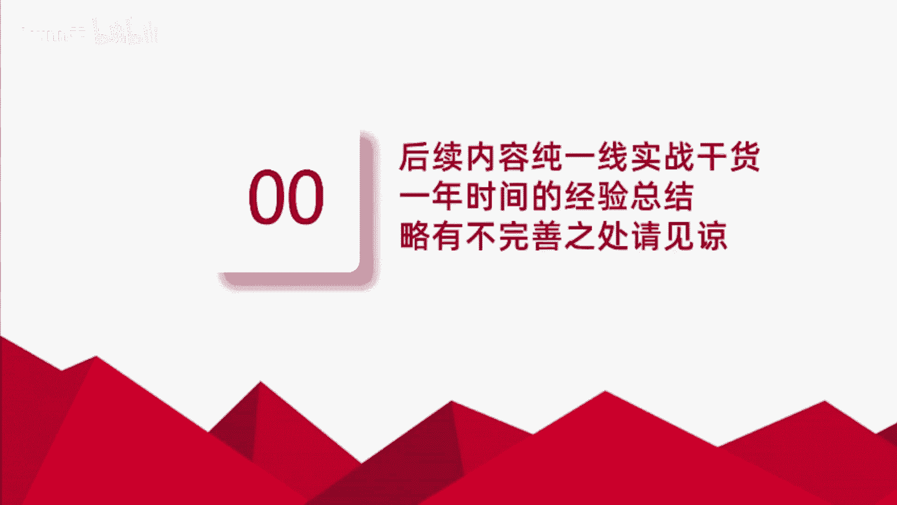

那我们先了解一下小红书的一个平台啊，就是说先看一下小红书平台的一个官方定位啊，这这张图是小红书官方的图片，他的描述是什么，是生活方式平台和消费决策的入口，凭借真实向上，多元的社区氛围。

小红书已成为年轻人不可替代的啊入口，所以小红书给自己打的标签真实是排第一的。

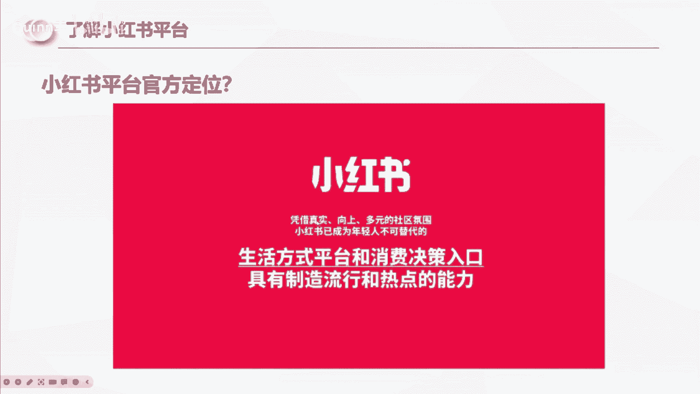

向上啊，社区以及消费者绝对入口，那这个第二个呢它是讲到了高净值值啊，高净值人群超1亿的月活用户，70%的一线和这些一些东西啊，但这些数据是中间的。

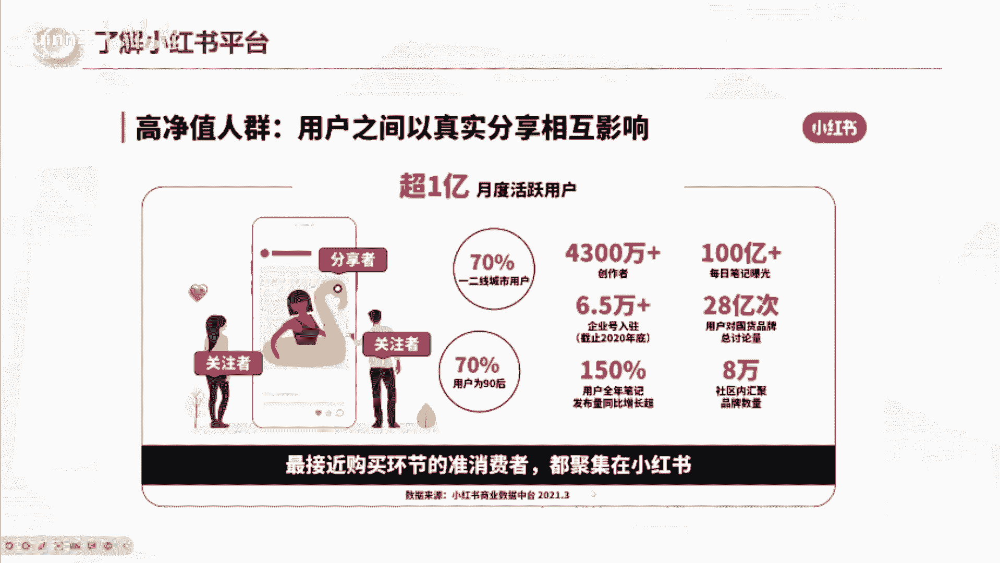

我们把官方的这个资料说成人话是什么意思呢，就是在目前现阶段的这个网络平台当中啊，我们可能会刷抖音，可能会刷快手或者B站，知乎啊，甚至微博，那我们会在这些平台上去接触很多很多的信息。

那我们小红书和他们之间是发生什么关联的呢，就是因为他们从这些平台上啊，从这些平台上收获到信息之后，他们再穿梭到小红书来进行一个研究，通过小红书进行浏览啊，然后进行一个影响决策。

要么他们会在小红书进行拔草，因为小红书他自己有官方商城啊，要么他们会直接在其他的平台进行一个购买，这是小红书的一个决策时刻。

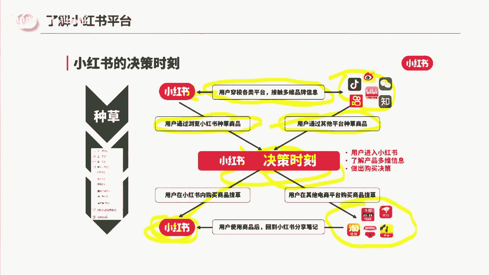

好那我就跟大家用说人话讲啊，就是小红书这个平台它到底是怎么火起来的呢，其实他是经历了抖音的一个四近，将近4年的一个增长，因为抖音在他这个4年的一个野蛮生长时期，它的变现方式其实是经历过N种样式的迭代。

我不知道你们有没有人刷到过啊，最开始的抖音快手变现，他们是主播，只要有粉丝，你在直播间，你开直播就有几千几万人在线，这个时候就已经开始有商家，比如说比如说啊，比如说你们是主播。

你们的直播间有几千人上万人，而我是一个卖面膜的商家啊，我就会告诉大家，我非常非常的喜欢你，很喜欢看你的内容，我的这个面膜在天猫旗舰店卖199啊，在京东卖199，但是针对你直播间的粉丝。

我拿出几百单来做福利，只要多少钱，只要39块九，那个时候是抖音最开始的一个变现模式，就是商家直接打板，打板之后直接卖货，然后主播给这个商家挂人，我想问一下大家有经历过这个时刻的人吗，有经历过的。

打个有好吗，有经历过这种卖货的吗，叫打连麦卖货，那再往后走，抖音开始推出了一个小黄车，就可以进进行一个通过小黄车去购物，那这个时候他是什么玩法呢，他们就有很多的人啊，跑到这种源头的水果产地啊。

大爷大妈啊下跪说，求求大家了，我的苹果滞销啦，橘子滞销了呀，就用感情牌啊，用视频去吸引大家去下单啊，但是这些东西现在是不被允许了啊，那么再往后走，像一些美妆的，他们又研究出一个什么样的一个玩法呢。

就是一次性投放上百个达人账号，比如说啊我老婆她买的那个酒酿面膜，我记得买过酒酿面膜，买个那个薏米茶，买过那个号称是协和的，美白美白的那个小瓶瓶的，后面都上新闻了啊，协和说根本他们就没出过这个产品。

那么这个操盘的打法就是，可能你通过一个博主对吧，你说这个美白能这个东西能美白，可能你不信，那OK我买通100个博主，甚至几百个博主，我让你九点钟刷视频，A说它有用，B也说它有用，C也有用，刷的越多之后。

就造成一个从众心理去进行一个收割，而这一系列下来啊，就有不少人收到货之后，他就会发现什么，就会发现自己踩坑了，然后也就开始变得谨慎，那怎么样防止大家上当呢，所以这个时候其实小红书的价值就开始体现了。

因为小红书它的定位是种草的一个分享社区，而且它的算法对普通人很友好，有大量心地善良的人在里面分享，包括面膜的使用感受啊，防晒霜的一个真实效果对比图啊等有效信息，所以小红书就相当于它为大众提供了一个产品。

好坏的一个体验的一个分享平台，你们如果片面点的去理解，也可以理解为它是一个避坑平台，但是然后又，由于前期有很多的海外购物经验分享，小红书它的前身是做海外购物分享的，积累了一批高素质高学历。

高消费能力的用户，高素质高学历，就决定了他们的语言表达会更加的客观，他们拍照的能力和展示的能力都更强，所以他们给用户的感觉会比商业的博主，要更加的真诚啊，可信度更高。

也就慢慢积累下一批女性用户为主的用户，那么抖音和小红书，如果说在我的视角里，我们去做一个对比，就是抖音现在是专业的玩家居多，里面呢鱼龙混杂啊，有正有正向的啊，也有玩套路的，而套玩套路的是层出不穷。

而小红书呢它更倾向于普通人真诚分享的平台，里面，信息的密度是比较大的，你可以筛选出有用的避坑指南，生活方式，所以其实就让我想到啊，就像我们以前用淘宝是吧，最开始我们在淘宝上买衣服啊。

可能只需要有衣服在上面挂着，就会有人去买，那再往后诶，商家觉得说好像好评这个东西，对消费者决策起到关键作用，那可能他们就会在好评上面啊，比如说我搞100个买家秀，自己弄100个账户去说这个衣服有多好看。

穿上去效果有多好，但是消费者他也不傻呀，他发现说哎，我买回来的衣服和好评里面的衣服不一样啊，怎么办啊，消费者就开始不看好评，我们开始看差评啊，那有的商家又变聪明了，你看差评是吧。

那我就在差评里面去做文章，通过差评去让你认可我的产品品质，比如说啊比如说一个一个一件卖一件衣服是吧，他可能说给的是一个差评，但他说虽然衣服质量还可以，价格也合适，但是配送太慢了，这个差评我给定了啊。

像这种的语句，看似它是一个差评，实际上它还是向你传递了用户的真相认可，所以商家和消费者他一直在博弈，而大部分人我们在抖音，如果说去买到了这种不好的商品，你去曝光它，其实拿到的流量是很有限的。

而小红书这个平台不一样啊，如果说你在上面买了什么不好的产品，不好的体验，第一素人的流量权重和大大的博主，可以说几乎没有太大的区别，第二小红书它有搜索流量，因为我们是基于什么。

基于我们在某些短视频平台刷到了这个产品，比如我刷到一个是吧，这个又刷到一个什么面膜啊，号称能够美白，那这个时候因为我之前上过当了，所以我这一次我就希望说我在小红书平台，再去搜一下。

而这个时候当他搜这个面膜的时候，可能他就进来一个测评的帖子，那测评的帖子可能就告诉他，这个面膜不如另外一个面膜啊，然后这个消费者的心智就被影响了，所以小红书，他基本上就是给我觉得片面的理解啊。

就是避坑平台，它的内容就类似于说豆瓣的电影评分啊，以及大众点评的一个美食评分一样，那虽然到今天为止啊，平台里也会有很多的素人分享，但是同时也掺杂了很多的这个商家啊冒充信息，但是这个平台整体来讲。

还是非常有这个使用价值的，那小红书平台的一个底层逻辑啊，就是我在做小红书平台的时候的底层逻辑，首先我们去做一个东西，一定要了解一个平台，他要什么平台要的东西，你给他。

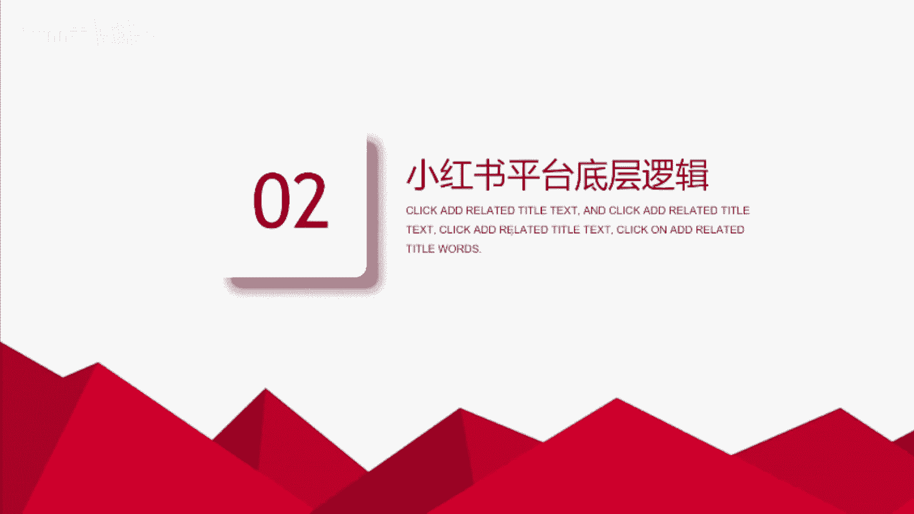

他自然就给你流量，那么我想问大家一个问题啊，假设现在你们啊是一个开淘宝，开天猫旗舰店的，现在你手下有五个，有五个客服来回复这个客户的咨询，你店里有2000，现在每天有2000个咨询啊，你会怎么去分配。

是平均分配2000个除以五个人，每个人平均分配400个，还是怎么分配，还是说不平均分配，你们可以告诉我吗，你们思考一个问题啊，现在你们的身份是天猫旗舰店的一个老板，你有五个客服啊。

然后有2000个客户咨询你们怎么分配是吧，这同学很配合啊，说的是平均分配这个其他的啊，其他的朋友啊也可以啊，继续去多互动，因为我知道你们的水平，就决定了我后面讲的一个东西的重点和速度啊。

有人说不理能下单的不会多问啊，这个兄弟你在跟我开玩笑，你一个开天猫旗舰店的，你说2000多个客户咨询，你有五个客服，你跟他跟我都不理啊，有人说按需求比例，有人说按能力分配，有人说平均分配好的。

那如果说这五个是新人的话，那基本上来说的话，第一轮肯定是先平均分配，但是你们往后走，你们会发现一个结果，就是每个人的能力是不一样的，那我们可以看到那通过一个星期的数据下来，那我们现在发现了张三。

他的成交是4000块钱，李四是3000块钱，王五是8500块钱，赵六是6500，孙七是1000，我想问一下你们，接下来你们准备拼怎么分配呢，我相信啊，假设你们是一个老板的话。

你们是不是会希望王五能够拿到更多的客户，因为晚五的销售额是8500元，他是张三对吧，和李四的double，所以这就是我们啊，假设我们开店的一个商业逻辑，那到了小红书平台，你们就去思考小红书平台。

其实对于小红书而言，我们他手上拿到的东西是什么，他手上拿到的是访客对吧，我们打开手机变成访客了，然后呢他手上会有多少呢，会有新增笔记，那你觉得他分配笔记怎么分配呢，他就像我们去开店铺一样。

他前期比如说我们现在同一时刻，这一分钟有500篇笔记，新的诞生了，他一定是给这500篇笔记啊，一个平均的一个初始流量值，然后通过初始流量值的一个数据表现，再次再去决定二次分配和三次分配。

所以那我就想问一下大家，第二个啊，问题就是小红书平台他最想要的东西是什么，你们有想过吗，是用户停留还是新增还是成交额，你们可以在评论区啊，可以在评论区告诉我，你们觉得小红书平台最希望要的是什么。

我来看一下啊，这道题，这道题挺有技术难度的，所有打停留的啊，停留的是正确答案，停留的是正确答案，因为我现在用的词是什么，是最希望要的是什么，为什么我告诉你用户停留是最关键的啊，因为不管是小红书也好。

抖音也好，快手也好，微信也好，他们都在干一件事情，就是要争取用户的时间，为什么，因为你后面所有的成交额，你的这个电商的变现，广告的变现都是要基于用户在使用你这个软件。

包括你们所说的用户新增新增看上去很重要，但是你要明白，当我们愿意用一个app，愿意一，新增只是早和晚的问题，如果一个app你一天只用2分钟，或者说你一个星期你都不想打开一次，你觉得这样的新增有意义吗。

所以我们就想到以前是吧，我们以前看电视的时候还记得吧，以前电视台的核心关键数据是要啥，是要收视率，对不对，收视率电视台有了收视率，他就可以去插播广告植入对吧，可以接一些大品牌的一个广告。

所以对于这种平台也好，其实不管小红书抖音，微信淘宝，他们都是希望有用户停留，有用户停留才有一切可能，那么这里又有一个问题，就是我们希望用户停留，那就需要有好的内容让用户去停留下来。

但是小红书的平台它是一个机器，如何让机器去判断内容的好坏呢，啊我们都说内容为完，你们有想过没有，如何让机器去判断这个笔记的好坏呢，如何让机器去判断笔记的好坏，机器一篇笔记灌输下去，其实它是没有办法啊。

算法，机器是没有办法完全去识别出内容的好坏的，它只能通过一些数据，所以我们能够看到的，点赞收藏评论转发这四个东西，其实就是一个用户的反馈，对于机器而言，系统推荐两篇笔记啊，A笔记和B笔记各500个报关。

A笔记获得了100个点赞，B笔记获得了十个点赞，那机器就有理由判断A笔记更受用户欢迎，能理解吧，我相信你们都能理解的好，所以说整个来讲小红书平台，它其实就是基于用户停留的需求啊，用户时长的需求。

通过机器去判断你的内容是否是用户喜欢的，能够让用户留下来的，因为我们自己是不会在我们不喜欢的内容，去浪费时间的，所以那整个来讲的话大的方向啊，我跟大家分享一下，就是小红书平台现在有哪些红利呢。

第一个是流量红利，因为小红书目前的月活应该是两个亿左右啊，我估的，然后23年刚刚上线了网页版，这个流量红利就意味着说，如果小红书未来的月活能够在接下来23年，24年达到5亿的话，它有两倍的流量Buff。

就是你做相同的事情，它是有两倍的流量Buff，如果小红书能够到7。5到八页的用户，用户就有三倍的Buff，是你做相同的事情，这也是为什么我会去在119年去做抖音，我们做一一抖音是19年6月份。

我做小红书是21年10月份，我永远因为作为一个老互联网人，我永远是要抢平台的前瞻视角，前这个流量加成的，所以说抖音我我们现在有在做，我们还会接下来还会去做，但是现在的抖音的流量已经见顶了。

所以我们其实早做和晚做同样的一个项目，差距不大了，没有流量红利了，那第二个点我们讲的是素人红利，就是小红书平台对于素人笔记的，其实是很友好的，而且最近小红书平台。

他把这个广告的门槛从1万粉下调到1000粉，也可以开通，这是你能感受到，他不是去捧这种大博主的一个心态，第三个叫搜索红利，就是笔记在小红书的笔记，它可以获得长期且持续的搜索访问量。

3000小眼睛的笔记拿到100万小眼镜，这是我实际的我的后台数据，这个等下你们后面呃可以给大家看一下啊，第四个就是电商红利，小红书今年对于电商有很多的动作，类似于早期的小红书的推出，包括最新拿到的信息。

小红书的这个本地团购也在内测了，就是你通过笔记可以直接上架，本地的一些优质商家，所以我觉得就是说对于一些小白而言啊，你这一次可以把你的目标定到，你知道怎么样去做内容，做有效的内容，然后电商这个东西。

你可以就是说你不要把自己的要求拉太高啊，在这一次因为后面还有本地团购等着你，这个你们可以看一下，我有一个习惯，就是我会统计我每一篇笔记，每一天的一个最后的一个数据，这一篇的话是截取的一个曲线。

它是从这应该是几百的播放到了几万的多播放，而且这张图是我应该是去年截的，现在应该还是继续往上走的，这个我没有去拿数据最好的图片，所以说小红书最牛逼的地方是什么，就是它的长尾流量是我见过最牛逼的。

长尾流量是我见过最牛逼的没有之一，包括你们可以看到右边啊，他的搜索我的笔记，我的搜索量是77，所以都是搜索进来的，搜索流量就越的精准，那么总总结一下就是小红书平台快手，他们的差异在哪里呢，快手抖音啊。

我觉得他可能更倾向于之前的优酷，土豆是用户一个欣赏观看视频的一个工具，而小红书呢，它有点类似于百度加知乎的一个结合体，我们在百度可以查到怎么去，一些比较啊更深入的东西，比如说IPHONE怎么去拆机。

而小红书它有百度加知乎的一个，这种调性的一个感觉，我们接着往后走啊。

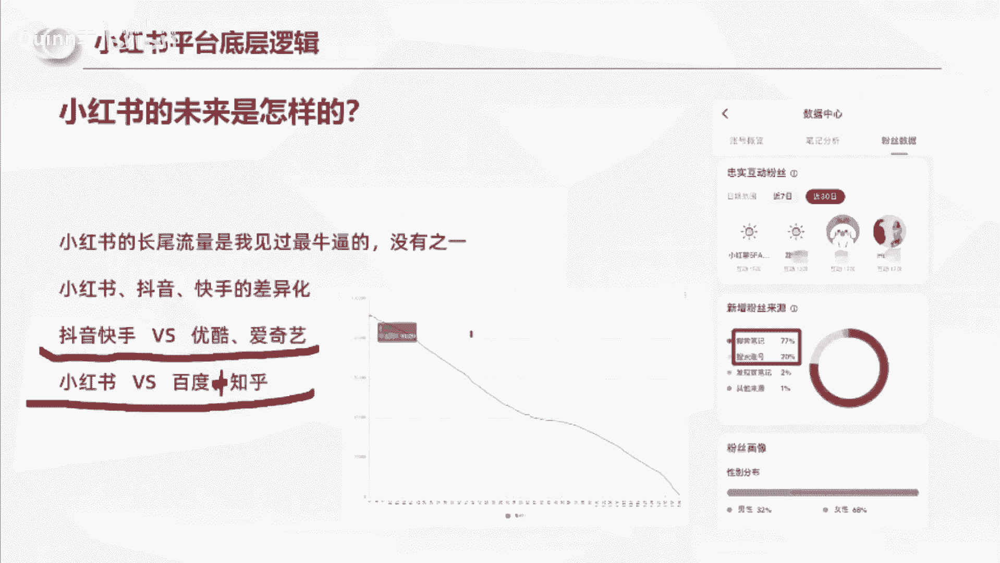

那么小红书我们要去做的话，我们了解了平台之后，我们要还要了解用户的一个使用逻辑。

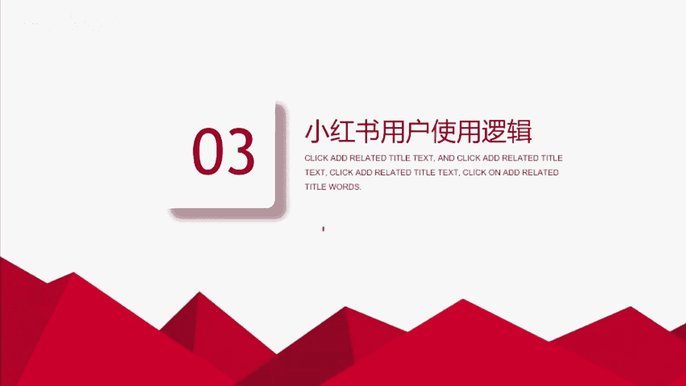

可以看一下这张图啊，这张图是我去研究用户的一个一个流程图，我们可以发现说小红书平台你打开之后对吧，他给你推荐的是四篇笔，四篇笔记啊，四个封面，对不对，四个封面，那么我们的行为轨迹是不是要么你就有有兴趣。

你就点进去，要么你没有兴趣就下滑了，而点进去的里面要么就是看完所有内容啊，要么你就是看完离开了，是不是，那还有第三个什么，思考一下思考一下，动一下你们的大脑，我们打开小红书啊。

我们小红书给我们推送了四篇，四张封面，我们要么点进去看完，要么我们看完离开了，还有一个选项是什么，有没有人能够想得到啊，今天的内容你们能够动起你们的脑子，我相信会让你们，可能是今年收获最大的一个小时。

看一半啊。

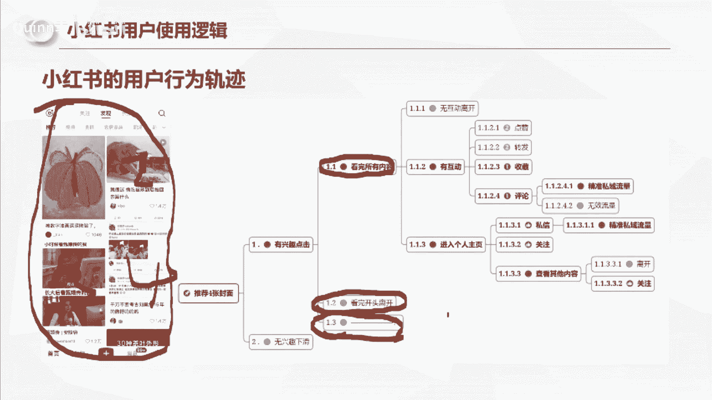

这个这个朋友没有名字，但是我觉得回答的很漂亮，就是还有一个选项就是没有看完，离开了，没有看完离开了，没有看完你开了啊，所以说看完所有内容之后的路径，他又选择没有互动离开以及有互动离开。

以及进入个人主页啊，以及接下来的路径，所以这是我去研究用户，其实我就是研究我们自己，那你们有没有这样的一个思维是吧，我们再往后走，那么小红书平台做账号和抖音，它到底有什么不同呢。

第一个就我们刚刚所说到的啊，它的其实是属于信息的推荐方式就已经不同了，因为抖音打开软件，它是直接推送一条内容并自动播放的，你们不感兴趣，你们就会去刷到第二条，而小红书打开软件，它是推荐四条内容。

它没有自动播放的，你们不感兴趣的就直接下一条了，所以就意味着说什么，说明抖音的开头很重要，因为抖音是自动播放，而小红书的封面标题非常重要，如果你的封面标题不行，对不起我，我一一个我都不会点进去看。

我直接下面四个了，所以说小红书的标面标题封面非常重要，大家现在应该能这个解，这个拆解，你们应该能意识到封面标题的非常重要性啊，那么你们去思考一下，或者说啊你们有女朋友的，有男朋友的对吧，或者你们的同事。

你们去研究一下你们的同事，他在刷小红书的时候，给他四篇笔记，他是怎么样去阅读的一个顺序，他是从一看到二，看到三，看到四，还是他打开手机扫一眼啊，直接划了，还是说打开一眼扫一眼直接点了，就我个人而言。

这四篇笔记我是不会按顺序1234去看的，我是扫一眼的，扫一眼也就意味着说一秒钟的时间，四篇笔记，其实每一篇笔记连半秒都不到，所以说这个封面标题非常之重要，那么小红书平台啊，做和抖音还有一个什么区别。

其实他们的账号的运营方法也是不一样的，抖音平台你们去运营一个IP，其实主要还是要去博这个系统的一个，推荐流量啊，用想办法去破圈，而小红书它是因为社群属性和搜索流量大，它还可以通过账户笔记为形象展示。

去他人评论区吸引目标用户啊，像右边这个案例啊，是我前几天刷到的，就是这个人在这篇笔记啊，这篇笔记讲的是啥呢，这篇笔记讲的是就是没有听妈妈的话，拿着家里的钱去开店，就压力很大啊，他就在评论区说。

我也是对家里报喜不报忧，开奶茶店最多负债500万，不敢跟家里说，每次问只能说还行，因为奶茶店太卷，最后去做压，结果没想到一年把负债还清，还把生意发展到全国，就意味着他这个其实传递了一个什么信息。

一年他是负债500万，一年还清就意味着说什么，说他一年赚了500万，然后下面还有一条评论，不过你们家味道确实不错，就是价格高，不知道是不是一样对吧，还有一个用户好评，看到没有，所以如果说我想问一下大家。

如果是你们看到了这一个人，你们会不会点他的头像，会打会好吗，不会打不会，如果这篇笔记是你们刷到了，你们会不会点他的头像去看一下，因为他负债500万啊，一年还清会对不对，那我想问一下你，你们点了他的头像。

进了他的主页，和他发一篇笔记，你们看完了进他的主页，是不是达成了同样的一个目标，就是把你吸引到了他们的主页里面去，是不是，所以这就是小红书的一个魅力，它可以通过评论区去吸引用户。

不是只能够通过内容去吸引用户，啊那那也就意味着说对不对，比如说是不是就我以服装举例啊，我们用服装举例，我们换位思考一下，假设这篇笔记他讲的不是开店亏钱的事啊，啊或者说我还是开店开店亏钱啊。

就是呃找爸妈借了10万块钱啊，开开童装店啊，开不下去了，会不会小红书会不会有这样的笔记，肯定会有，就是那些开童装店开不下去的，那么是不是可以在评论区去说，现在实体店的东西卖那么贵，怎么可能开得下去。

我在我在朋友群里买的一件小朋友的T恤，才六块九毛钱，而且跟实体店29块九的质量差不多啊，谁还愿意去实体店买东西，我想问一下大家，这一句评论区有没有杀伤力，是不是你们就可以理解啊。

同样的小红书他现在还干了一个什么事情，今年啊我发现他把群聊的一个这个好友数，就是一个人可以进群的上限，已经我现在已经建到15个群了，之前我只能建五个群，现在能建15个群，那也就意味着说。

它的这个玩法会更加的多样化了，包括它还可以，他还他还有一个官方页面招募群友，你建群之后，他还他还给你提醒你，你可以发布笔记招募群友，所以这个玩法就有很多种方式了，好那我们就问。

那么接下来我们的问题就来了，那我们的笔记封面如何脱颖而出呢，已经知道每次打开推荐四篇笔记，我们怎么样把封面做到超越他人呢，尽可能高的拿到点击呢，啊这里我插一个问题啊，我插一个问题，就是平台能够给你们的。

给普通人的唯一的一个数据，你们知道是啥吗，就假设啊我们200个人全部发笔记，他能够唯一给的东西是啥，你们知道吗，它能够唯一给的东西叫这个，叫报关，啥意思啊，就是把我们的笔记推送到别人的手机上面。

这个动作让你的手机看到这四篇笔记，这个动作叫报关，就是平台，唯一能做的，就是让你们的笔记出现在别人的手机屏幕上面，他只能做到这一步，他没有办法让看到你这个笔记的人点进去，他也没有办法让他点赞。

所以很多时候你们的小眼睛是由什么决定的，是由你们的点击率决定的，假设平台给这四篇笔记都给1000的报关，都给1000的报关，假设这篇笔记1000的报关里有200个人看。

就会显示你们的左下角就会显示小眼睛，其实这个叫小眼睛，它是属于阅读数，但是平台给你的不止200，他可他可能给了你1000，明白吗，明白吗，同样的这只猫，它可能也给了1000个报关。

但是因为这个猫比较吸引人，所以他有300个小眼睛，那就是30%的点击率，所以你的眼睛只有200，你的眼睛别人有300，不是说平台给了他300，给了你200，而是你的点击率会影响，好啊。

那我告诉大家我是怎么样去提升我的封面呢，接下来的这个方法，如果大家看了有用，就在评论区回复有用好不好，我的选择是啊，这是我的一个封面，我的选择是我做出了我的封面之后，我把很多个封面放到一起。

我把我的翻上去，看我是不是最能跳出来的那一个，我把我的封面放在这个手机的示意图上，看下能不能跳出来，我把我的封面放在这四个里面，能不能跳出来，有用打有用好吗，有用打有用，因为我跟大家说了。

我们这一次的三位老师全是实战派老师，我不会去跟你们说什么啊，标题的三个方法啊，这个吸引人的三个方法，我讲的就是我在用且确实有用的东西，接下来还有更多的干货啊，咱们继续啊，大家也可以在群继续啊。

咱们继续好，那么问题来了啊，就是笔记封面我们如何脱颖而出呢，啊这是我今天从网页版上啊，截图的十几个，那么划重点来了，就是在之前啊，在在今今年啊网页版推出来之前，我们要思考的是啥。

我们要思考的是四篇笔记啊，我们要思考的是四篇笔记，我们怎么脱颖而出，但是网页版出来之后，网页版的推送是是多少，是是这样推送的，是我是黄红框里面的一个推送啊，我是把两个拼到一起了，那就意味着说。

每如果说你要考虑到小红书后面的流量，他如果是手机端进入，你是四进一，它如果是网页版刷的话，你是15进一，是不是对你的封面要求更高了，那么这一张图我为什么截给大家看啊，我想跟大家讲一个点，讲一个点。

就是以网页版的一个阅读质感，我把这个同样啊这种在备忘录打字啊，这种算很简单的一个展现形式，这篇笔记算一号笔记，这一篇算2号笔记，这一篇算3号笔记，这一篇算4号笔记，你们认为1234里面哪一个是。

如果你们选择这种表现形式，会会认可的方式，1234你们更认可哪一种方式，二对不对，为什么，因为二不仅他的标题更加的显眼，他还画了一个红圈做视觉引导，而一是吧一的字，三的字啊都是属于字都有点看不清了。

四还好一点，再晚网页版的视角里，四的字还是比较清晰的，而二的标题更加的清晰，而且他还用了这个用了这个红色，对不对，这就是我们把就是东西好坏是怎么来的，我告诉你们封面好与坏，标题好与坏，就像什么。

就像我们给我们的对象拍照一样，你拍一张照片可能就只能拍出50分，那我们怎么样保证自己的对象，能够选出好看的照片，是不是咱上来先给他干个100张，是不是你在100张里面选，你总能选出好看的吗。

所以我们去做小红书做封面，我们两种方法，一种是我们去看100个封面，找出我们觉得好的去学习，还是我们做100个去选一个呢，肯定是看嘛，对不对，然后讲到这个服装啊，我今天还去找了一下服装的例子。

就是我们如何去研究账号啊，我们要去向有结果的人的学习，因为我已经告诉大家，标题和封面非常的重要，那什么叫有结果的人呢，我觉得第一个你要看他的数据是否稳定啊，像这个账号，他前前面的数据还是比较稳的啊。

点赞都在100以上，可能最近的流量不行，但是他能够连续几篇拿到100点赞的这种账号，他其实一定是对平台有内容理解的，如果一个人对平台的内容不理解，他的数据就会变成什么，可能突然他有一条100点赞。

1000点赞的，但是再往后他无法连续，他无法连续，就是优秀的人，他的下限是更低的，就是我们没有人能够说，我一定能写出1万点赞的笔记，但是优秀的人他的下限可能就是100，但是如果说你对平台没有那么了解。

那你的笔记完全就是开概率，那这个账号它的特点在哪，因为你们要讲要可能有人会选择做服装，那我给你们简单讲一下，就是第一它的定位，他是专门研究篮球传达细分是吧，第二个他是小众篮球穿搭。

第二个为什么我说这个账号有用，是因为我们通过他的评论区，你去看是会有人找他要链接的啊，求第一套裤子的链接，他不是简单的说我给你点个赞，我点个收藏，我走了，你会在评论区看到有人要要是什么。

是代表购买欲是不是好，那我还找了几篇其他的这个衣服去看啊，像这个账号也是比较有特点的，这个账号他的一个拍摄角度是非常固定的，而且他的数据也很稳定，这个3号数据也很稳定啊，然后这个账号人家更直接了。

蹲价格侠，价格侠什么意思呢，就是谁谁去了店铺，翻到了件衣服的价格，告诉我这个直接就是考虑到价格层面了，能考虑到价格层面说明什么，说明这件衣服他已经心动了，那么我们再往后看第三个啊，这个账号他叫野生塔塔。

这个账号他也是很固定的一个商品，对不对，我们讲的账号定位清晰，他的账号定位是什么，账号定位就是这种他这个叫什么叫JK是吧，学生日常的这种风格，然后他的目标客户也很清晰是吧，就这种感觉很相似啊。

它的效果有没有有人家会问他裙子哪家的啊，他说海胆举例子好，那接下来问题来了，其实这三个账号它的变现方式是不一样的，是不一样的，你们来看一下啊，这个人家是告他是告诉别人，我的裙子在这一家店铺买的。

这一个也是告诉别人我在哪里买的这个衣服，而这一个呢这一个是发链接谁，我先问一下大家啊，就是篮球啊和这个黑衣服和这个水手服，你们觉得这三个哪个更赚钱，或者说哪个的运营水平更高，你们有这种感感觉吗。

就运营水平来讲啊，是打篮球的高还是黑衣服的高，还是水手服的高，有人说篮球啊，有人说第二个，有人说第三个，啊你们觉得篮球是吧，其实我我我讲我的个人观点啊，我讲我的个人观点。

可能我会觉得黑衣服的高一些就就变现手法啊，就变现手法，这个篮球他是卖衣服嘛是吧，他可能是没有上限的，但是就这个账号定位而言，就账号定位而言，我觉得黑衣服的呃段位高一点。

因为第一个他的这个数据更加的稳定是吧，篮球它是稳定稳定100加，那也意味着黑衣服一篇是他的十篇，第二个黑衣服的这个质感更高级，单价应该也会更高一些，这是我我的个人观点啊，我的个人观点啊。

就是黑衣服的整个调性，他就不是简单的说我要卖衣服这一件事情，本身他是我在卖衣服的这个事情里面，我去选择更高客单，更高预算更有钱的这个客户群体，而且我告诉你们，这三个账号里面有两个账号其实是有模板的。

这个水手服他就是在走，就是在出快出门的这个位置拍这个黑衣服，它就是在这个位置拍，而这个篮球它是户外，户内，包括这个停车场都拍，所以从这个拍摄的一个这个角度，和拍摄一个成本啊。

我们可能拍一条这个成本是差不多的，但是你做篮球的这个账号，他是一直在想，我今天在哪拍，明天在哪拍，而这两个剩下的黑衣服和水手服，它是有模板的，但是我只要有新衣服，我就知道在哪拍了。

而且他的这个模板是持续有数据的，这也是为什么我说黑衣服的，它这个运营水平更高，它的拍摄模板更加的明确，不用每天去抠脑袋，我明天怎么拍，它的数据更加的稳定，它的质感更加的高，至于他变现手法是挂店铺也好。

还是挂链接也好，其实他有了这个运营能力，只是他自己喜，只是看他自己想怎么玩而已，他想轻松一点，他就挂店铺啊，他想复杂一点，他觉得赚钱多是卖衣服，他其实完全可以挂链接的，他的运营能力是最高的。

那么最后啊第三个板块来讲讲，我是怎么样去起号，去月报百万的啊，这个其实是讲的是怎么样去做成交，那可能针对大家来讲，我我因为我是擅长去往思域导的。

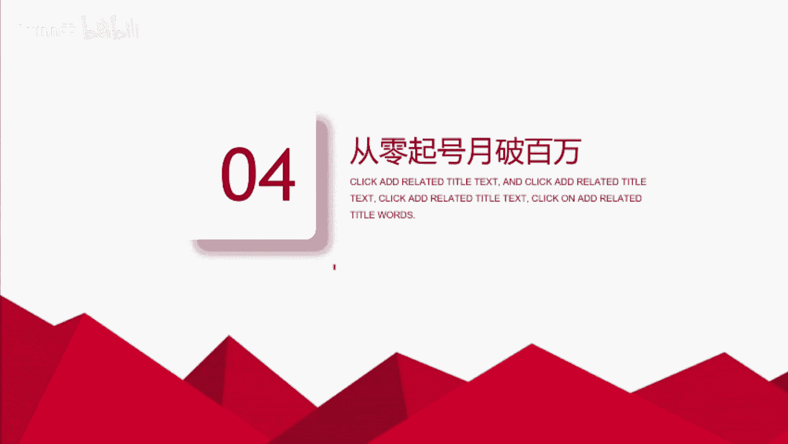

我成交会讲少一点，我会讲这个账号的运营思路，然后啊总共总共我分了四个步骤，第一个步骤就是我要掌握平台的规则，我第一步一定是了解平台，第二步是什么，是获取种子，客户植入钩子哈。

让人把别人从这个网络上调到思域里来，因为我是擅长思域啊，第三个呢是做成交，那第四个是什么，是做复购，分到四步很明确的，那么我要做这四步的时候，那我要研究我自己了，我作为一个用户。

我用小红书app的原因是什么呢，那我前面跟大家讲了，是避坑啊，是查资料，比如说小红书已经牛逼到什么程度，我告诉你，如果你是一个女生啊，她可以牛逼到你到长长沙来游玩，你去哪几个打卡点，他都给你标出来。

他不是哪几个景点，他去拿几个打卡点，拍什么样的机位的照片好看，他都能给你标出来，所以小红书它是有价值的，有干货的，有攻略的啊，这是第一个，第二个，当你看到笔记的时候，你点进去是为什么啊，这些问题比较多。

我不一一展开，但是是我去做的时候会想的问题，那么第三个就是当你看完笔记后，你点赞收藏评论的原因是什么，我会经常问自己的，比如说我一个我比如说我给这个笔记点了个赞，那我想想为什么我要给点个赞，我点个收藏。

我想为什么要收藏，那么再看一下数据层面啊，其实最开始的数据我是跟大家啊，我是跟大家没啥区别的，可能一开始就十个赞，20个赞，这很容易，对不对，30个赞，然后我通过我刚刚给你们看的啊。

我对封面的一个优化方法之后，我马上把数据拉到了上百的点赞收藏，上百的点赞收藏，而且是稳定的，对不对，这个158，这个191，这个176，这也是也是几个月前截的图啊，现在的这些数据肯定更高了。

但是你们发现没有，我又从100多优化到了上千点赞啊，后面我就开始上千点赞了，收藏加点赞肯定是过千的啊，这个图都是半年前的了吧，应该至少是我做了什么，你们知道吗，我告诉大家，我就做了两个字一件事。

这个叫做迭代，就是我没有认为自己找到了100多，200多点赞的一个方法，我就觉得我很了不起，我再想办法去做的更多，所以我选择了这个方法，其实我就已经有效了，但是我又尝试了这种方法，我没有要封面。

我换了一个样式，那这个样式数据起来之后，我就持继续用了数据更好的样式，那我问下大家，你们有没有想过，为什么后面的这个会比前面会数据更高呢，你们能不能想得明白，假设你们是一个观众啊。

你现在你们现在不要当自己是一个运营，你现在就当你是个观众，为什么，你们为什么后面的这个数据会比前面的会更高，告诉大家啊，我后面我去复盘，我去分析的是后面的，比前面的这种内容含量会更高。

就是戴老师前几天说的一句话叫一图胜千言，这个封面的信息量比这个封面的信息量要大，信息量来讲的话，这个是小，这个是中，这些的信息量是大，这是密密麻麻的一个表格，所以这个信息量是最大的。

同样的还有一个问题是什么，是因为它的信息量非常之大，所以他不点进去，根本看不清，能理解吗，它可以看到标题，标题，它可以看得清净水方案，净水器啊，浴霸，但是他看不清型号，我看不清型号。

我又想知道这个东西的结果，我怎么办，我是不是要点进去，能理解吧，能理解吧，因为看不清，所以他要点进去，这是我后面复盘的，所以点赞提升的秘籍啊，我跟你说，绝对绝对只有八个字，就是真诚分享友好互动。

你们自己去看小红书的这个这个官方啊，他们有很多账号就跟你讲八个字，真诚友好分享互动啊，真诚分享友好互动，但是啊从流程上来讲，我们可以猜四个动作，分别是点赞收藏转发评论，那我想问一下大家啊。

你们知道点赞撬动点赞的秘诀是什么吗，你们知道撬动收藏的秘诀是什么吗，你们知道撬动转发的秘诀是什么，你们知道评论的秘诀是什么吗，我来告诉大家两个好不好，我跟你们说两个，你们自己带着两个回去思考。

撬动收藏的秘诀是什么。

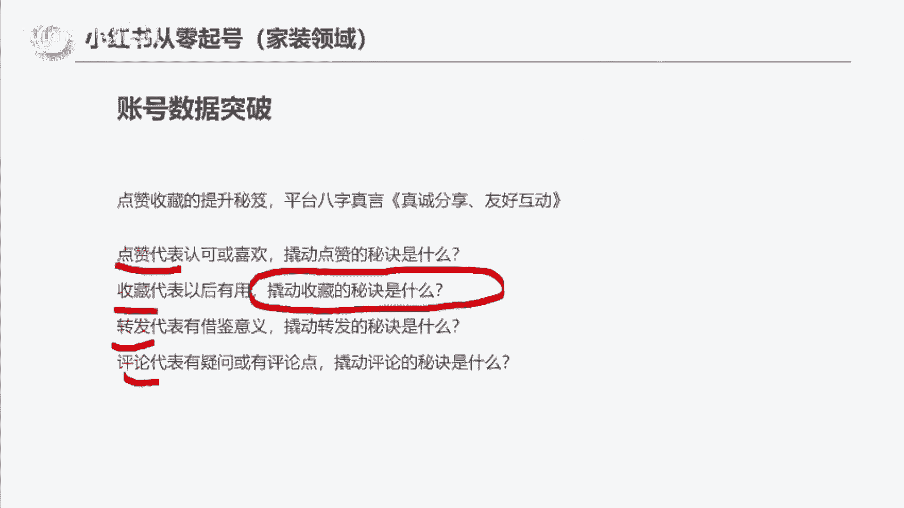

你们看一下我的这个账号啊，看一下我的账号，其实有一个特征是收藏比点赞高的，你看这篇笔记啊，6800的点收藏，6300的这个点赞，包括像这篇啊1300的收藏，六六百六的点赞。

基本上你们随便看1900的点赞，3100的收藏，你看到今天啊我的数据优化结果是什么样的。

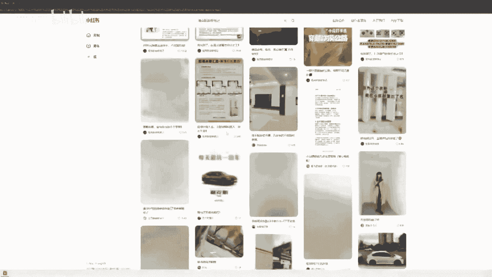

是，我的数据结果是这样子的，就是你可以看到我快速的从上百个点赞收藏。

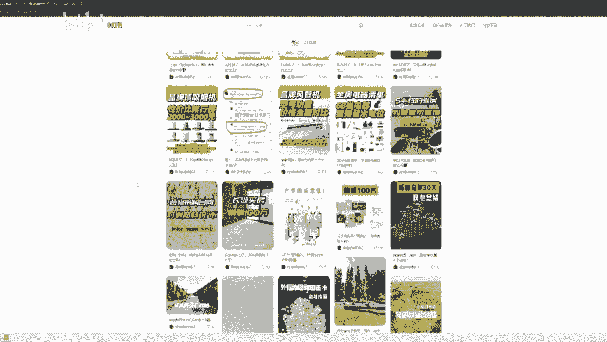

优化到大几百，直到全部啊，接近很多都是上千的数据，像这一篇啊，4400的点赞，9500的收藏，你们知道收藏的秘诀是什么吗，我告诉大家收藏的秘诀是我想问大家一个问题，两个选项A啊。

A拍一个视频是他做饭的一个过程，比如说他做了一道长沙的特色菜啊，茶色的特色菜是啥呢，这个茶茶有茶色菜，我一下子没想明白啊，我想一下啊，比如说剁椒鱼头吧，香菜啊，他A做拍了一个剁椒鱼头的制作过程。

给你们B拍了一个剁椒鱼头的制作过程，加菜谱，你们觉得这两个是过程的，收那个点收藏的人多，好我告诉大家一定是过程加菜谱的人多，为啥因为制作过程我看一遍，我记住了，所以这个视频跟我以后没有关系啦。

但是这个菜谱它可能有多少克啊，他有更精确的一个东西，所以说我们会有一部分人他去收藏这个菜谱，能理解吧，所以就是说你的信息量是他当时那一条视频，无法消化完的，所以他就要收藏，如果说这个东西他当时消耗完了。

对不起，他就没有收藏的必要了，听懂掌声好不好，听懂打个掌声好不好，再讲一遍啊，你的内容如果是他看完他就知道的，比如说啊，我今天告诉你怎么在支付宝上领五块钱红包，他看完他就知道的，他不会再给你收藏了。

他跟你说拜拜了，你的内容是啥，你是支付宝一个月有五次领取红包的机会，这种东西人家就收藏了，为啥因为他一天他记不住啊，所以他就他觉得收藏，所以收藏最后是干嘛，最后是吃灰的，但是你们就要把握收藏是怎么来的。

是他单条视频他觉得有用，他又记不住，消化不掉，所以他要放到收藏夹里去。

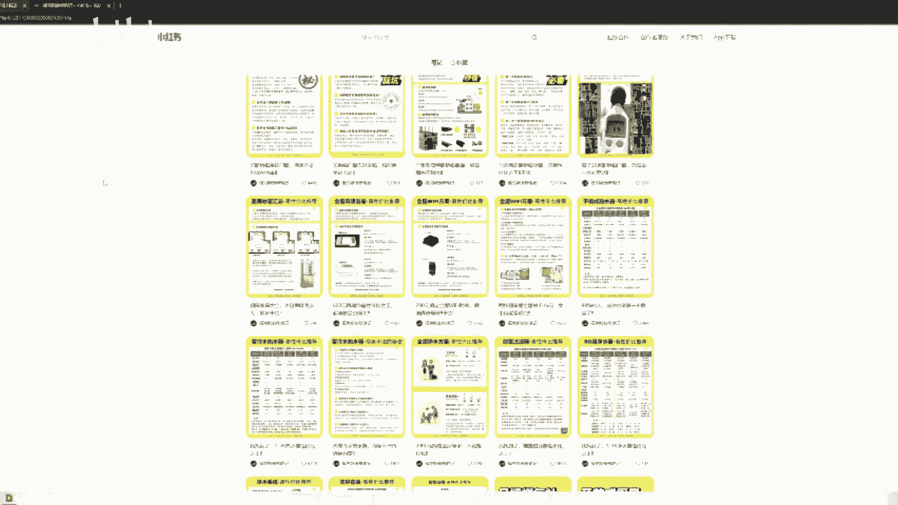

收藏的秘密，讲完了我再给你们讲评论的事啊，我们刚才讲了撬动评论，我给你看一个我做的一个案例啊，这篇笔记。

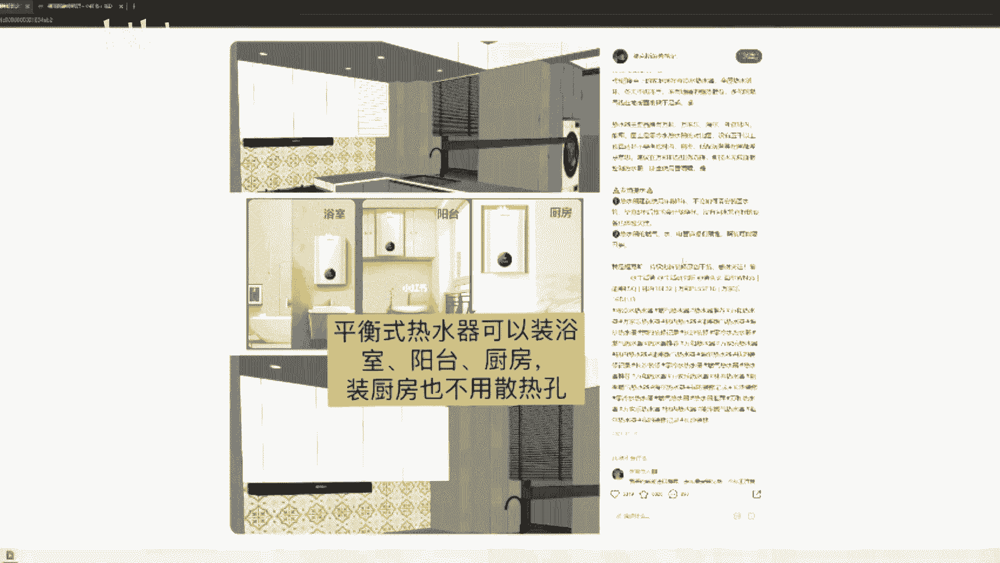

我置顶了一条评论啊，我这篇笔记什么时候发的，是2021年11月份发的，2021年11月份发的，那么在2022年3月，我置顶了一条评论，是有一个观众他看了我的笔记，然后他在说我买的这个锅炉啊出现了问题。

商家不负责任，品牌不负责任啊，那你看我的回复是什么，我的回复是我帮你置顶，希望后面的姐妹能帮忙顶一下，争取厂家早日帮忙处理，所以你们可以看到这一篇笔记，他的这一条的点赞有300多，剩下的只有30多。

我想问一下大家，数据是不是就拉动了，那我是不是也是在真诚的帮助别人，因为我这篇笔记每天有三四千的访问量，因为我会统计数据，所以我在真诚的帮助他，那么其他的人看到了也愿意帮助他，所以他们给他评论点赞。

这是不是拉动了数据来，我们再来看一条，再来看一条啊，像这一篇4800的点赞，7900的收藏，这一篇有多少评论呢，有1200条评论是啥呢，是这一条是这一条评论，我在22年7月份的时候，我21年发的比较。

我在22年7月份的时候，我发了一条，就是说我家装修延期了，我家装修延期了，然后如果大家希望知道后面哪一台洗烘套装，性价比高的话，你们可以留言，我收到再回复，为什么我会这么去说这一句话。

是因为我发现我发了这一条之后，有很多人在下面评论说蹲洗衣机，蹲洗衣机，所以我把那条评论置顶了，所以如果你们可以看到它，有大量的人在下面就评论一个字，就是蹲，因为我跟他们说什么。

我说你们想知道我最后买了什么，你们就在在我评论区回复一个蹲对吧，你们评论了我就我就告诉你，所以我后面啊也是做到了，是不是他们问我，我就告诉他们了，那我问一下大家，如果我不去把评论区。

我不去做这个动作是吧，我啥也不说话，他们会在评论区去打蹲吗，我这一条笔记1200个评论蹲应该有三四百。

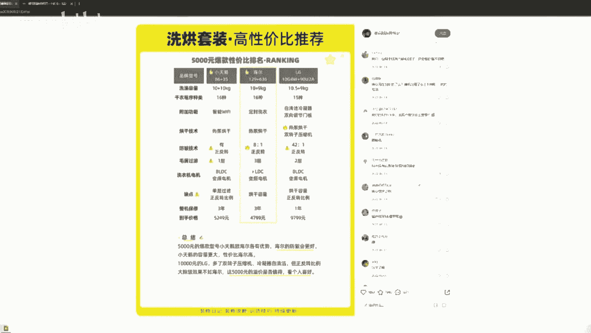

这是不是拉动评论区的数据，能理解吧，还有其他的啊，还有其他的一些细节，我就不一一展开举例了，我们继续去讲。

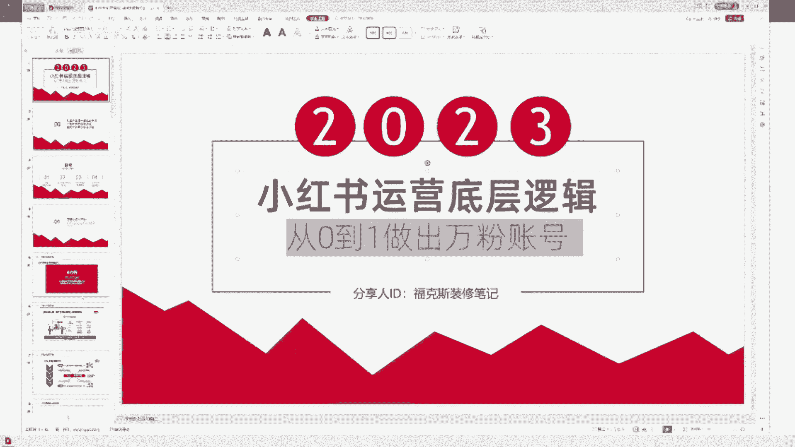

所以到第二步啊，就是第二步是啥了，就是我们通过我们的内容是不是获得了报关，我们怎么样去获取这个客户啊，第一步是获得笔记和获取报关，第二步是获取我们的目标用户，去添加我们的微信啊，因为我是思域玩法。

我下面讲的是思域玩法，但是同样的原理是一样的，比如说我做私域的玩法，我思考的就是当被一篇笔记，被人家被吸引了之后啊，他什么情况会进入主页查更多，然后什么样的内容跟账号，人家会认为不可信，不靠谱啊。

什么样的情况你会希望和作者取得联系啊，这些问题都是在我做的过程中，我就会反推的，我会我会自己代入，就比如说我看了十篇笔记，有谁是我想关注的，有谁是，我一看这个账号，我就觉得这个人靠谱可信。

有谁的账号是我一看，我就觉得这个人有可能是个骗子，不能信，像刚刚那个我问一下大家啊，你们觉得刚刚那个卖鸭脖的还记得吧，前面那个搞加加盟的，在别人评论区说，自己从负债500万到赚了500万的。

你们觉得那个人是好人还是马扁，告诉我好不好，前面那个卖鸭脖的，你们觉得他是好人还是马扁，他说他自己负债500万，一年赚回来，他是好人还是马鞭，啊你们说他是马扁是吧，为啥呢，因为。

因为第一这个数据太浮夸了，第二它的主页内容就是搞加盟的，加盟这个东西麻贬的概率很大，是不是，所以你们就会感觉说你是会想看，但是他这种东西吧，其实对对一些有过认知的人，或者说清楚加盟套路的人。

是会让他觉得不可靠的好，那我们再往后思考，就是什么样的情况让你加微信，你也不会加，以及私信加微信领取资料和主页，网盘置顶饭资料，你们会如何取舍，哎其实这个其实这个问题啊。

和这个和这个和这个戴老师他的操作是一样的，如果你们当时你们有没有想过啊，如果当时你们通过他的抖音账号，进了他的粉丝群，他说你们要加个人微信才能发资料，你们一定是有一些人不会去加他的，那戴老师是怎么做的。

他是你们进群，他把链接二维码对吧，发到群里面了，然后只相当于直接把资料给你们了，所以有的时候你会发现说强制别人加微信，再给资料和你只要进去我就给你，我没有说我要强制链接。

你的意思是不是后者更加让人家能够看到真诚，是不是，同样的，你们又可以带着这个思维往后面去思考，什么样的情况，你去看小红书笔记的时候，你看着看着你会打开淘宝店，去搜索店铺或者关键词，是不是是吧。

那有人有有人说他说真不想加人，是不是，所以就是我们要思考的轨迹是什么，我们要思考的轨迹是人心，要思考的轨迹是人心，而不是套路，因为戴老师是真心对你们的，他压根就没想加你们。

他就是觉得说我知道小红书怎么做的，我想分享他分享了，哎我有一些资料我可以整理给你们，我给你们了对吧，我想去带一群人去尝试做小红书这个事情，那么谁愿意来谁就来，所以他是真心的，所以我们今天会相遇，在这里。

所以那到我这后面你到做私域的话，你还会遇到什么问题，就是那你加了人之后，你怎么做好友管理，对不对，你要不要建群，群里面的人谁是值得帮助的，每个人的想法都是不一样的，就即便是咱们的100多个人群，对不对。

你会发现啊，有人有不同的价值观的同样的一个群，它的利和弊是什么啊，微信群邀请好友拒绝还是通过这些，就是我在做这件事，做这个事情的过程中会经常思考的问题，我之所以能思考出答案，能做出答案。

是因为我先把这些逻辑想明白，想明白之后再决定我要怎么去做，然后我再问大家一个问题啊，这三个问题会跟大家相关，精准的用户推给商家没有成交，是谁的问题，是用户的问题还是商家的问题，还是博主的问题。

博主把精准的用户推给商家，没有成交，是谁的问题，你们能弄明白吗，没错啊，是商家的问题，这里我给大家分享一个事情，就是我在最开始去做这个模跑模型的时候啊，就是首先啊我这个装修的过程中，我所添加的粉丝。

我是真诚的对他们的，所以我在做的事情是帮他们出，找到好的产品去压了价格，去给他们做成交，并且我跟他们讲的很明确，我自己的成交价你不要问我，我肯定比你低，但是我做到一点，我不赚你们的钱。

就是比如说这个市场这个事情，这个东西人家商家正价卖1万啊，我可以帮你们谈到九千五九千，但是你不要问我是多少钱买的，因为我也不想骗你，所以我对他们也是真心的，那这个地方我想跟大家分享一个什么事。

就是说精准的用户给到商家没有成交，是商家的问题啊，这个大家答案都是对的，那我也不太去展开，所以如果说你们在小红书拿到了精准的流量，你挂了产品没有成交，那就一定是产品的问题，明白吧啊以及我还会去思考。

那装修时我们喜欢的东西跟我们想花钱买，买的东西有什么区别，这句话翻译一下是啥，翻译一下，就是比如说我们现在去逛商场，去买衣服，买鞋子，我们最后买回来的是我们最喜欢的那一件吗。

嗯同学们很多时候不是因为我们最喜欢的衣服，可能你一摸一看吊牌1500，一双鞋子，你一看1200，但是我们其实是带着预算去买东西的，可能我最喜欢的是1200，但是我看了有一双鞋只要六七百，他在我的预算内。

所以我会选择买预算范围内的，是不是，所以我会深刻地去研究说我搞装修的过程中，我到底看中了什么，我买了什么，为什么，那为什么我要去思考，因为我要做的是用户成交，不是所有看上的就一定会买。

而我要研究的是成交了什么东西，为什么会成交，而那些容易被别人看上的喜欢的，而又成交率很低的，那对我而言就不是好的产品，那还有一个问题啊，就是装修用户想花钱买产品，那为什么要在我推荐的商户这里买呢。

这是不是跟你们的问题有点像，小红书的用户在小红书刷笔记，不是只有你们在挂车，为什么要在你们的笔记下面买呢，这个逻辑你们是要想明白的，所以我想的很明白，我告诉我粉丝群的人，我帮你们找的是好产品。

而且我把找产品的这个过程我有告诉他们，比如说我星期一到哪里看到什么东西，我发给他发到群里，星期二我看了什么发到群里，星期三我发了什么发到群里，然后我告诉大家我选哪一个，以及我能拿到的价格是多少。

所以我不是说因为装修啊，跟你们卖的这些东西都不一样，它是一个非常高客单，而且非常复杂的东西，所以我会把整个的这个选品的过程，去分享给他们，然后会明确的告诉他们，这个东西A比B比C的东西，它好在哪。

差在哪，然后再去告诉大家，我为什么买A然后价格是多少，所以在这个过程中啊，像成交的突破，其实对我来说就已经很简单了啊，像这一个粉丝的话，他基本上他家里，这个这个这个这个啊这里应该是五六个东西。

跟着我一起买了四个东西，在我看来他是很赚的，因为他没有花任何的时间，我跑游都不知道跑了多少箱油，而且还没赚钱，他还买的比市场价低，而且这个事情我能做成，其实我还是完成了小红书的这个调性，就是真诚分享。

我是真诚的在做事情，我没有说我是因为谁给的佣金高，所以我去帮谁卖，我一定是找到好的东西，然后去告诉他们啊，这个包括这个成交也是一样的啊，这里啊跟大家讲一个细节，就是当我在21年10月份启动账号的时候。

到22年4月份啊，我整个这个这张图，这个PPT是去年4月份那个年年审过的，下个月哦，哦5月18号要去杭州，是第3年了，那个讲师的认证，我在2月份的时候成交了20万，我在3月份的时候成交了170万。

4月份成交118万，这个数据我觉得不重要，重要的我觉得是这个玩意，这个玩意为什么我要在4月份的时候去开，我前面的成交证明，你们能想到吗，就是当我有了成交之后，我为什么要在4月份的时候去开成交证明。

你们能明白能理解吗，大家思考一下，为什么我会在4月份的时候去开一个成交证明，因为我要借力打力，这个其实跟你们做小红书也好，跟你们以后做任何东西都是有关联的，什么意思，其实真正的商战不是说你拿很多的钱。

你拿很好的资源去跟别人去拼，真正的商战是什么，我们作为小白起家的，我们作为小白起家的人，包括你们，你们要在这个互联网上去赚到钱，你们往往是是以小博大，你们是田忌赛马，要在局部劣势中去战。

去产生战争的一个赢家，讲人话就是你要在你没有就商家是什么，他可能是你1万单，我给你多少价，你5000单我给你多少价对吧，比如说我们去辛巴买榴莲是吧，你能拿100吨，我给你多少钱一斤。

比如说给你二十五一斤，你只有一一千单，那我给你28，你只有100单，我给你31斤，是不是这样的，那真正的三战，你们要掌握到我如何只有100单的情况下，我要争取到他给我1万单的价格，为什么要这样子。

因为你只有把价格压低了，你有利润空间了，像你们做电商，你有利润空间了，你人做钱，人做事的动力是跟你赚多少钱有关系的，你你一个月下来，你上班赚3000，你做小红书赚1000，你第二位也没动力了。

你一个月赚3000，你做小红书一个月赚5000，你这个月嗷嗷的，所以说真正的三战是你在用小资源的情况下，去撬动商家的好政策，所以说我去开这个证明，是要给后面的商家看的，我已经做到这个成绩。

你的这个东西我预估我能做几百万，你干不干，所以说我这个门窗的价格是怎么谈的，我上来我就跟他说，我1000个平方，你能做什么价，我说我家有几套别墅，1000个平方，你给我什么价好，他就给我一个价格。

我说我告诉你，我没有两套别墅，我只有30个平方，但是我有一个小红书账号，你相信我按这个价格给我，我给你再找啊，970个品牌，然后给他做到了，所以这其实是跟大家穿插了一个。

真正的你在落地过程中的一个商业经验，那你们去做这个小红书是不是一样的，是不是可以拿到自己的一个基础的成交，再去网上去做，那包括思域的复购怎么去做，是不是怎么去做复利增程，我去看工地对吧。

两款瓷砖一和二就是大家会在一和二之间抉择，你可以理解为两个口红的颜色，我会去拍两个照片去分享给别人，所以人家会把我的内容分享给他妈妈看啊，把他的同事啊分享分享给，包括我看的东西。

我都会做很多的东西去分享给他们，就是真诚分享，友好互动，那么最后总结一下啊，就是我觉得作为电商商家，一个小红书的一个破冰流程呢，你们要明确内容是有区别的，有的内容是吸引眼球的，有的内容是调动思维的。

有的内容是有下单欲望的，这是三种不同的内容。

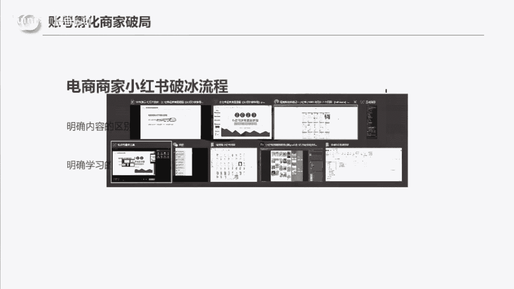

我们到网页上看一下，好吧。

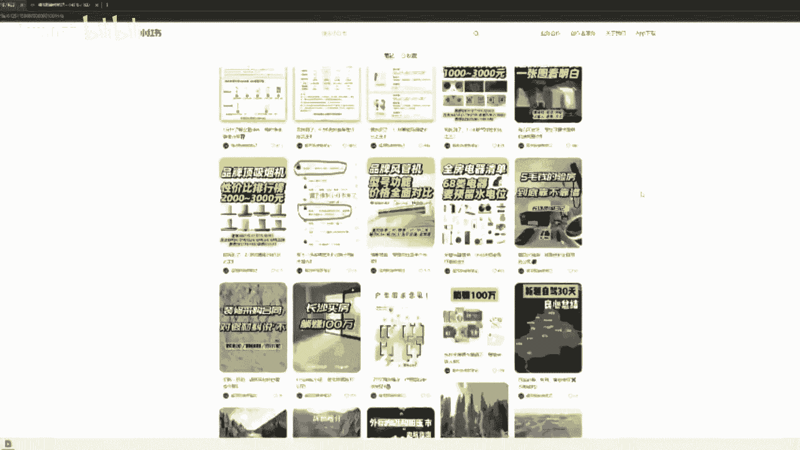

给大家看一下啊，客户怎么来的，给大家展开一下好吧，这篇笔记这篇笔记就加了200号人，来给你们看一下怎么带你们看一下。

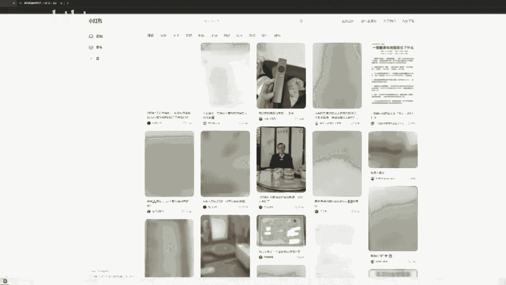

记得啊，内容的三种形式，内容是有吸引眼球的，调动思维的和有下单欲的。

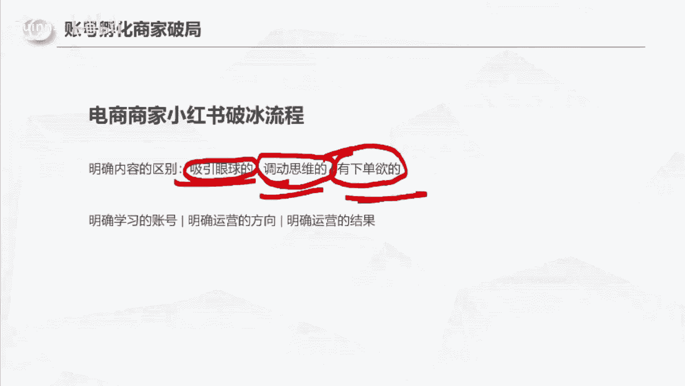

如果说你的目标是去卖货，那你就要做有下单欲的内容，来我们看一下啊，来问你们吧，像这种是吸引眼球，这个茅台是吸引眼球的，还是调动思维的，还是下单欲的，这个茅台他就两瓶茅台是吧，啥也没写，然后有互互动。

有数据，这种所谓吸引眼球下单欲还是调动思维啊，眼球是吧，眼球思维下单，这个吸引眼球的好，这个呢2。4万拿下20件家具。

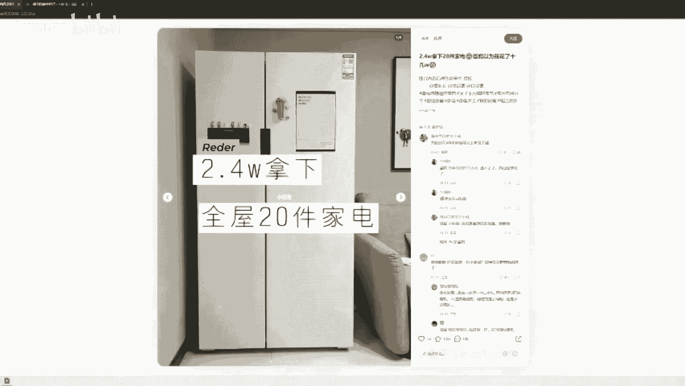

这个是眼球思维还是下蛋欲，下单吗，我想问一下大家，这个地方哪里有下单，哪里有下单，你假设你是一个读者，你从他的评论区看，哪有别人想找他下单的这个欲望，没有的，有思维，就是人家会去看它里面的东西，有字啊。

比如说618双11的一个购买时间，但是没有找他下单的，是不是他的评论区，你们可以看嘛，没有没有人找他买，这个是思维，这个是没有下单的，就是用户对于这个作者来说是没有下单的。

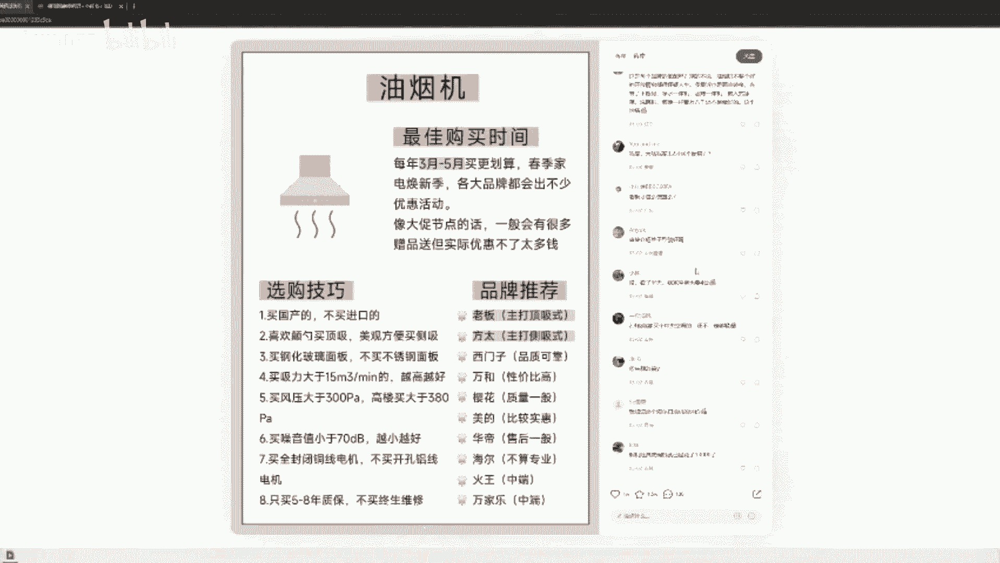

这个啥眼球思维下单欲。

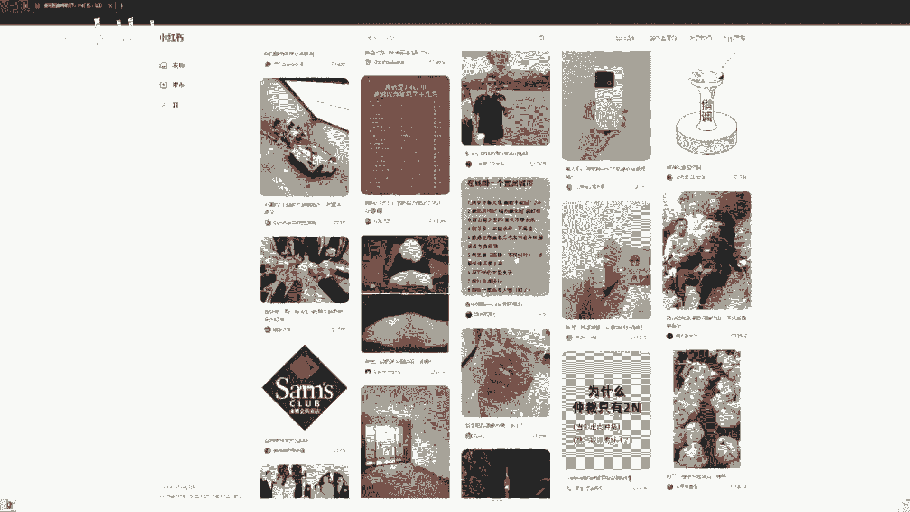

给他找一个，找一个这个有下单欲的，啊啊这种这种这个这个是啥眼球思维下单预，这个啊第一次退茶位费成功结算，这个是眼球思维，下单月，这个是思维啊，思维就是如果你们看了这篇笔记之后。

你们会去思考他的这个东西做法对不对，然后这个做法你有没有必要学，你学了有没有用，这个是思维，来我们要找到有下单欲的东西，因为你们要卖东西，你们要知道什么叫下单预，如果这个东西都没没有下单预。

你做了之后他没有成交，那太太正常了，看我吧，告诉你们什么叫下单欲，随便看，眼球思维下单月能看见这个小字吗，我只想知道结论，长沙买哪家，我只想知道哪里可以安装，同长沙，求推荐，求推荐，求推荐。

求推荐求推荐，已关注，求推荐，求推荐，求推荐，求分享，求推荐，求推荐，求推荐，再看这一篇，我只想知道结论，长沙买哪家啊，这是同一篇，看这一篇好吧，我主同长沙，麻烦拉我进群，你你选好了吗，选哪一家。

我看吐了，拿不定主意，从长沙想进群求笔记，再给你们看一下啊。

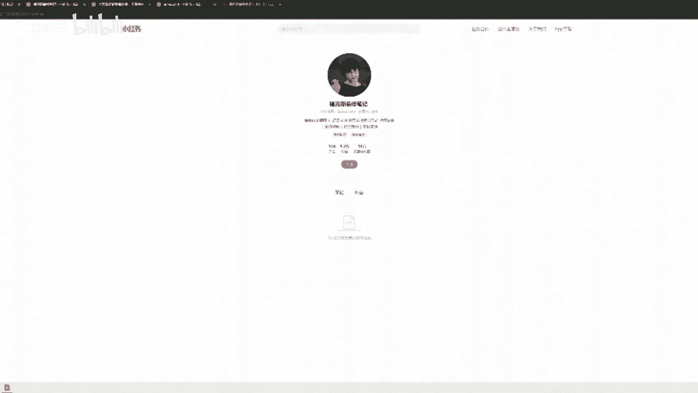

这一篇求推荐求推荐求推荐啊。

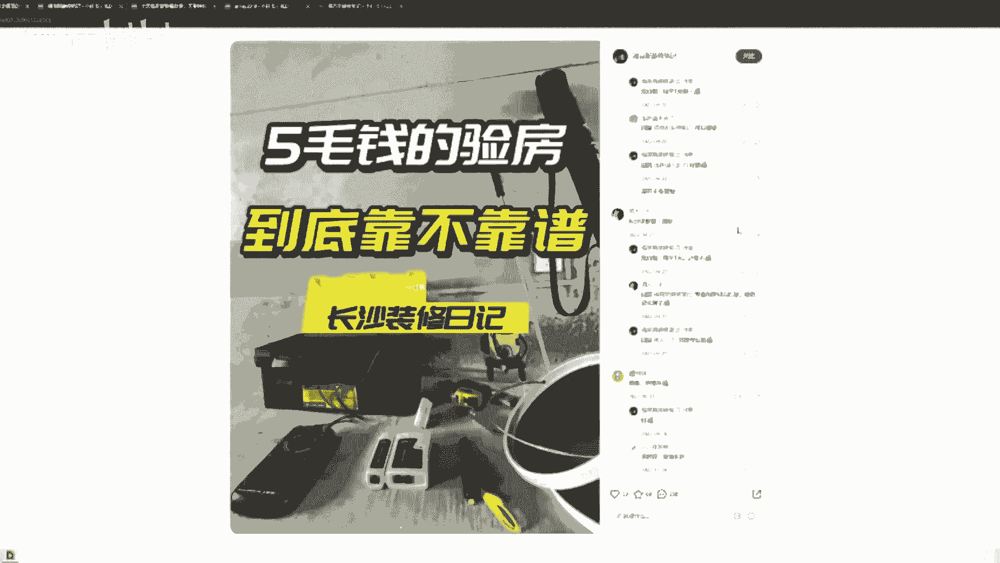

所以你们要有意识的去区分吸引眼球。

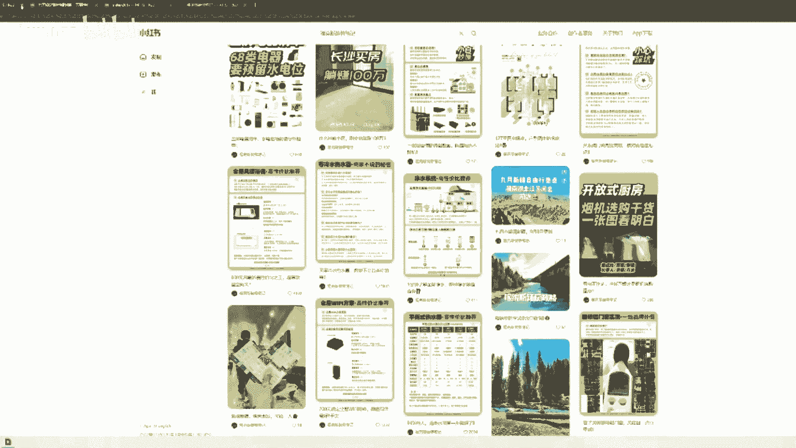

调动思维和下单欲，如果说你们赚的钱，你们是要赚陌生人的钱，那你们就是下单欲，如果说你们想赚粉丝的钱，那么你们需要有调动思维能力和有下单欲，然后接下来你们还要干嘛，你们还要明确学习的账号。

明确运营的方向和明确运营的结果，还记得我给你们看的三个卖衣服的吧，如果不管你们自己要做什么，其实就是四句话，找对标，拆爆款，多尝试，要坚持这12句话，我做任何一个平台，其实就是靠这12个字。

先找对标装修就研究装修水果，研究水果，衣服，研究衣服饰品，研究饰品，拆爆款，你要去去猜到别人的这个东西为什么会爆啊，这个东西，反正后面还会有老师去分享具体的东西，但是你知道就这四个是，第三个是多尝试。

第四个是要坚持，然后我想问一下，大家告诉我你们这一次的目标是什么好吗，做出一篇100点赞的笔记，是你们这次的目标，你是小白，你就评论100点赞，如果是1000点赞就评论1000点赞啊，你们的目标就是。

只要做出一篇这样数据的笔记就行了，如果你们的目标是做出100粉丝的账号，就打100粉丝，1000粉丝就打1000粉丝，做100成交就打100成交，1000成交就做一，1000成交。

100利润就打100利润，1000利润就打1000利润，大家定一下自己的目标好吧，看一下大家的目标啊，大家都给自己定一下目标，我看一下你们的目标，然后也给后面的这个分享啊，来确定大家的一个，按下嗯。

好的好的，你们打着啊，因为我到时候会去把这个数据啊，我会去分析一下，这个尽量啊去帮助大家达到自己的一个目标，好吧好吧，然后希望大家知道龟兔赛跑赢的不是兔子，是龟，有的人他很聪明。

但是他可能觉得说这个事情对他来讲太简单了，他不愿意去做，反而真正出结果的人是坚持不断迭代，往后走的人好，接下来问答环节，大家有问题就提问啊，我讲了75分钟，稍微差了点时，大家有问题都会提问啊，有人问啊。

怎么让人关注涨粉啊，这个问题就是说，当你的内容是对别人有价值的时候，其实这么理解吧，这么理解我这个问题，我这么回答你啊，你的问题是怎么让人关注涨粉，你打开你的小红书，打开你的小红书，打开你的关注列表。

你扪心自问，你问你自己，你为什么要关注他，再看第二个人，你为什么要关注他，再看第三个人，你为什么要关注他，你把列表分析完，分析你自己，你心里会有答案，第二个是一天几篇笔记发布，这个看你自己。

看你自己就是内容的发布数量啊，我觉得这个没有固定的一个要求的，你像我如果去写这种原创内容，我基本上我真的三四篇，三四天我才能干一篇出来，这个自己把控就好了，啊有人说做了一个多月，出了三单全退了。

又暂停了，这就是我后面说的嘛，要尝试，其实很多时候你能够出三单，其实就已经代表说你对产品，对内容是比不撤单的人要强的，这个时候那你要去找这个问题在哪，出三单，退三单是什么原因造成的。

就我你可以看到我做这个事情全流程的过程中，我问了自己很多的问题，每个问题我心里都有答案，啊黑梦问怎么让人产生互动性，互动性，我刚刚你你如果后面来的，你看一下回放吧，我大概在五六十分钟的时候。

我拿我的账号说了，怎么样去调动收藏，调动评论，互动是什么，互动就是点赞收藏评论转发收藏和评论，我都已经给你们看了，实际我是怎么做的，啊有人说我开店一周，现在每天还有十几20个的赞，浏览量也是有个几百个。

但是一直不出单，不知道该不该换品，这个你就是你要去看具体的东西啊，你这个我没有看到具体的笔记，具体的商品我没办法判断，你也要去查你的这个类目，你不出单，究竟是你的价格比别人卖的都高。

还是说就是说你先确定你的产品有没有问题，如果你看了小红书，同样的产品，你觉得你的质量比他好，或者说相同质量你的价格比它就是合适一点，或者说价格也差不多，你觉得你的产品没问题的情况下。

那你再把你的这个报关和笔记内容放大一点，啊有人问做人设带的产品必须是一个行业吗，我这么回答你这个问题，对于这个东西啊，我这么回答，你看你这个人的销售能力有多强，销售的最高境界是别人相信他这个人。

不管他卖什么产品都会去买，你就想一个道理啦，不管是罗永浩也好，还是董宇辉也好，没有说他只能卖一种产品的，销售的最高境界是卖人，卖产品是前期，啊有人说我们卖水果怎么有那么多内容找对标，你在小红书。

你去搜产品也好，搜水果也好，收这个方式也好，其实你们去他是有无限种方法的，包括助理今天在群里面买了，你卖水果，你只能去发水果吗，可不可以，假设我是一个开水果店的，我可不可以发我的就是说创业日记啊。

我开了一个店啊，今天卖了多少单，明天卖了多少单，可不可以发创业日记，我可不可以用另外一种形式，一种心态啊，就是不要把思维局限在啊，我是卖香蕉的，我就天天拍香蕉，天天卖香蕉，你去小红书搜一下香蕉。

你看下什么样的东西有下单欲，只要是有下单欲的内容，都是你可以研究的内容，刚开始小眼睛数多少是正常的，个人理解啊，个人理解小眼睛，我觉得你新发一篇内容，200左右的小眼睛是正常的。

如果说你的东西你一发只有100个小眼睛，然后你接着发几篇都只有100个甚至40个，50个，我的经验啊，是这个账号的权重是比普通账号要低的，我会建议你直接注销，重新注册，因为我曾经有一个后面有一个账号。

就是这样的，搞了搞了两次，就是一发就是100个，50个，60个，我注销重发，注销重发，我第三次我发一篇，就在就拍了个窗户，200个小眼睛之后，我再发同样的内容，那篇笔记点赞加收藏就过百了。

好有人说怎样找到适合自己的对标账号，我觉得你们去思考对标账号啊，第一个是要思考几个问题，第一个是这个账号它是否能够达到你的目标，你的目标，如果我就是100个点赞或者说100个粉丝。

那只要他能够内容能够吸粉，能够有人互动，那就已经是属于你能够借鉴的对标账号了，如果你的内容是希望卖掉东西的，那你就一定要找有下单欲的账号，下单预可以从评论区可以看出来，有下单预的账号里找到之后。

比如说你找一十个20个里面，再从这一二十个账号里面找它的内容，你也能够创作出来的，然后第三个是这个内容它可以持续更新的，再然后你不是说那再，然后你可以持续去找你这个赛道的东西。

你可以去继续去迭代你的内容，它不是说你一定是固定的一个东西，怎样才能输出更高质量的内容和优化，我觉得啊你能够输出更高质量的内容和优化，一定是你对用户要看什么更加更加理解，又或者说嗯你可以去看。

比如说你要去讲一个知识点吧，嗯举个例子啊，family这个单词FAMILY，那我们同样是英语老师，同样是英语老师，我们去讲单词FAFAMILY，那我不管别的老师怎么讲，我会告诉你怎么去记住这个单词。

FEBLING是家庭的意思，F代表father，爸爸and mother妈妈，I love you，所以爸爸妈妈我爱你，就是family家庭，那么我用这样的一种方式去讲解family这个单词。

是不是一下就比那种纯讲单词的高级多了，那这种内容就会比纯简单词要好，那我会我是怎么来的呢，是因为我看到了这一条，我当时就觉得这个老师真牛逼，我记得很清楚，我相信我今天告诉你们。

family等于father and mother，I love you，你们这一辈子都会记住，所以好的内容就是多刷多看，多借鉴，更高质量的内容啊，如果你没有原创高质量内容的能力，你就多看看了。

你就有灵感，好有人说小红书开店红利能有多久，嗯其实红利这个词呢它是一个大盘数据，真正你能够赚到钱的人，其实红利一直存在，因为消费需求是没有改变的，因为人永远有需求，那平台红利的话。

我觉得就是到他这个日活月活见顶的时候，我自己啊个人判断，我估摸着小红书这个app，我爸妈还是不会去用的，他们虽然会用抖音，会用微信还是不会去用的，所以13亿人减去老老一辈的。

我估计到67亿的这个用户没问题，还有两倍的增长，没啥问题吧，两到三倍，有人说权重是经验吗，还能在哪里看到，而账号权重是这样的，不用过于神话，我简单跟你们说一下账号权重什么逻辑啊，就是。

我们大家去发内容都是正常权重，但是如果说我的粉丝，我的账号有1万粉丝，也只意味着说，我的起始报关比你们多给一点而已，但后面大家还是公平的，但是如果说你的账号数据异常，比如说人家发的都有两三百个小奖金。

你一发就只有100个几十个，这个就属于账号异常，就这三种情况，一种是大账号有一点点基础的加成，第二个是正常账号，大家其实都没啥区别，第三个就是异常账号，没有其他的更多的悬念了。

啊有人说听完我的接下来怎么做，接下来大一老师还会再去给你们讲，详细的定位的内容啊，我们今天讲的主题是，小红书平台运营的底层逻辑，和我是怎么样从0~1把账号做到1万粉丝的。

啊有人说小眼睛正常200浏览情况下，是发布笔记后24小时吗，对就你发完一天有个200眼镜，你这个账号就是正常的，然后有人说需要养号吗，养号这个东西呢严格意义上来讲是个伪命题，但是你可以养一养。

养号的作用在什么啊，在告诉平台，你要看什么和不看什么，就是比如说我们你像我我做装修，那我就会去看一些装修相关的东西，比如说设计师，比如说设计方案，而不是去看那个这个小姐姐是吧，你越看的越多。

小姐姐她越给你推，小姐姐，就是还是要让自己在使用这个平台的过程中，自己做的这个类目，还是要占据25%到30的阅读量吧，我觉得其他的你想看什么，还是可以照照常看的，好吧，那我看大家没有什么太多的问题了。

那今天的分享就到这里，感谢大家啊，接下来还会有大一老师去给大家分享账号定位，以及更多的实战干货，这一次所有的三位老师全是实战派。

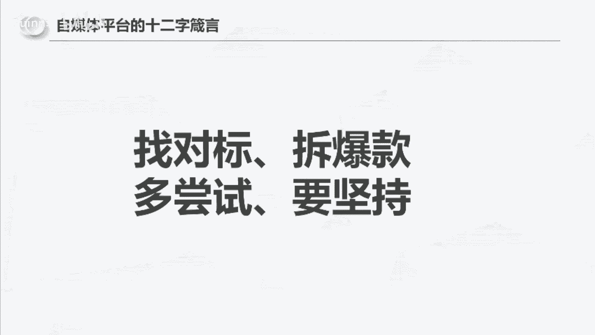

没有一个理论派，好吧。