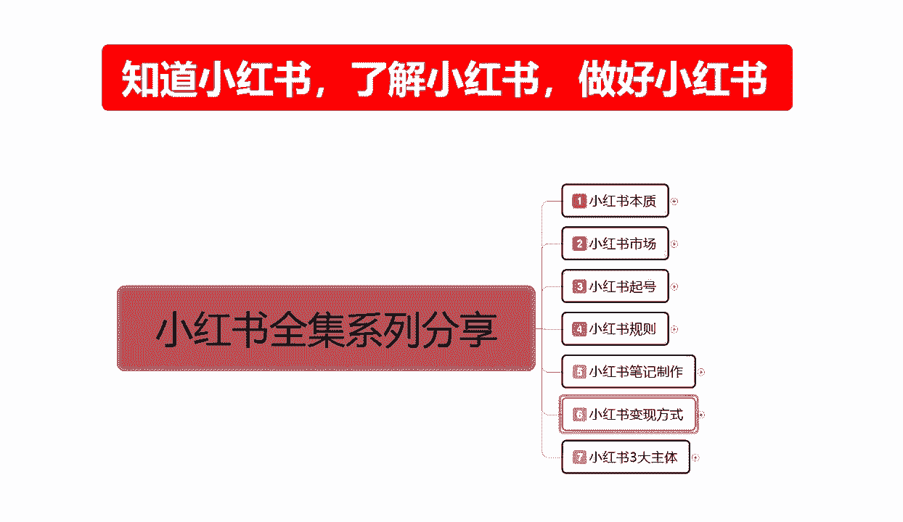
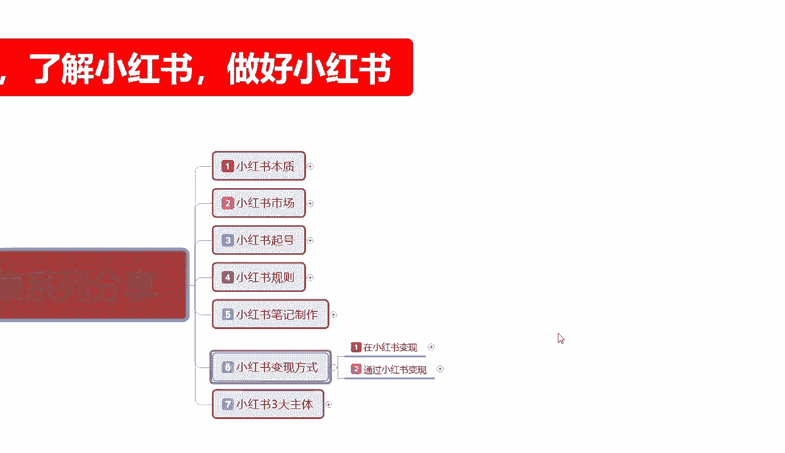
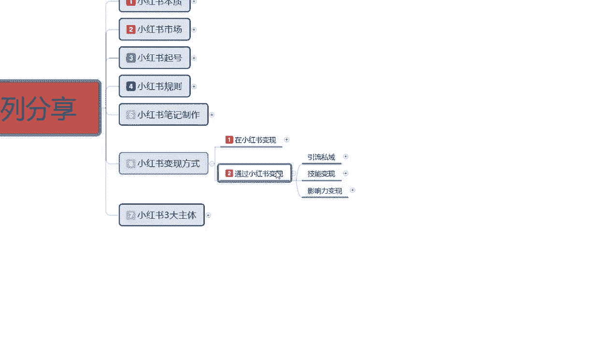
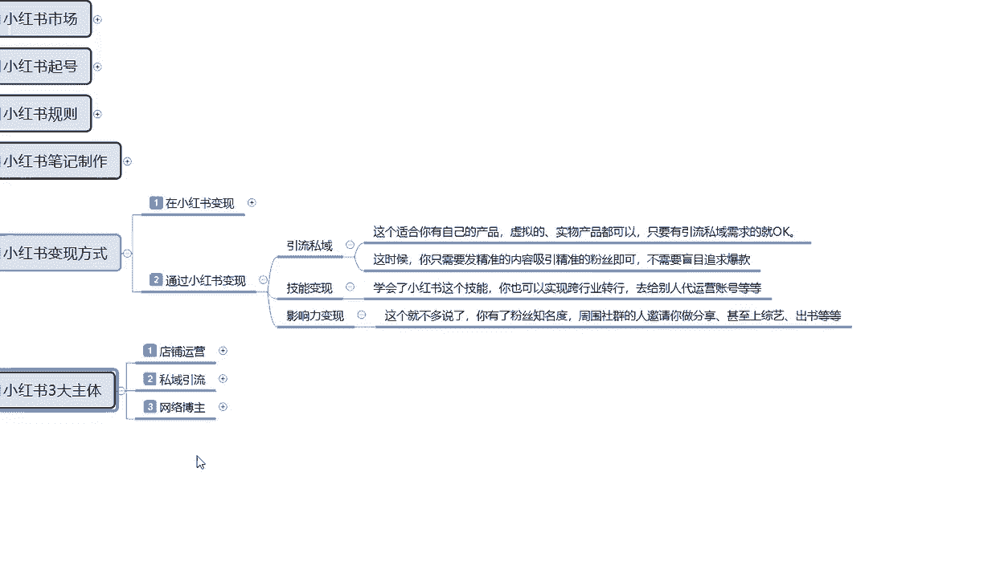
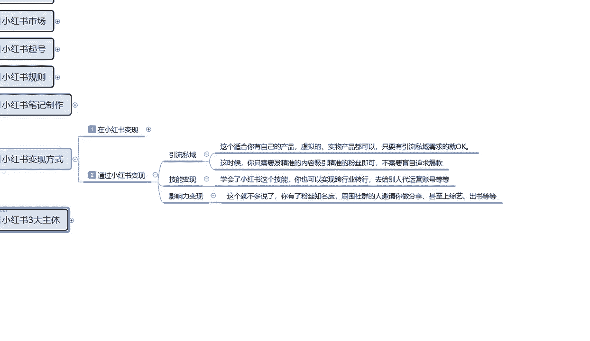
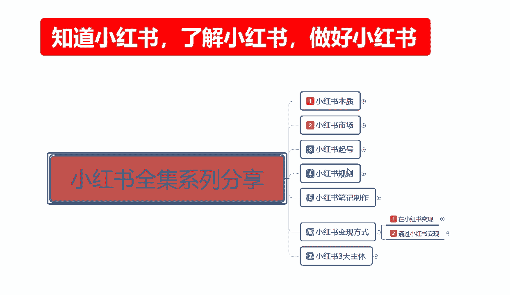
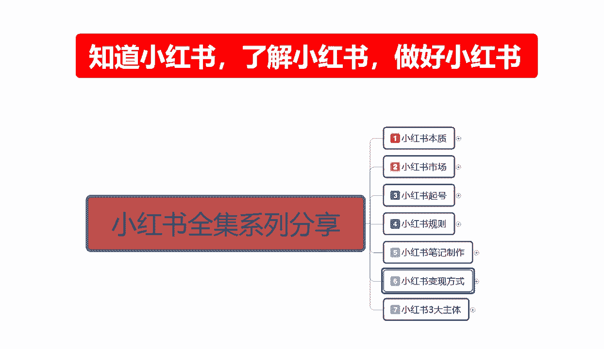

# 【150集精华教程】小红书运营新手起号 0-1新媒体运营必学课！不要荒废18-30岁，一切都还来得及 - P35：33、新手小红书运营-小红书变现方式（2） - 剪_映教程7 - BV1Px2JYDEu9

大家好，这一节给大家分享的是，小红书全集系列的第六大课时。

小红书变现的方式，第二节，因为这个整体内容的话不是太多啊，这一节的话主要是给大家讲解一下，通过小红书变现，我们有那几个方式。

上一节给大家讲的是在小红书，我们用自身的资源也好，账号的资源也好，进行的一个变现方式，这一节的话是通过小红书我们怎么去变现，说实话通过小红书和在小红书变现的话，他其实本质差别是不大的。

都是要通过小红书平台进行一个切换，只是切换的一个方式，是切换在平台内部转进行转换，还是切换在平台外部进行转换，这一节呢就给大家讲解一下，在外部是怎么转换的啊，通过小红书变现的话，在这个地方的话是有三点。

第一个是引流私域，第二个是技能变现，第三个是影响力变现，影响力变现和技能变现的话，说实话我们很难做到啊，我们来了解一下思域变现。

什么叫私域变现，这个的话就是说适合我们，你有自己的产品啊，虚拟的产品也好，实物产品都可以啊，只要有引流到私域需求的话就OK了，你在小红书上面，无非就是我想把这帮用户集中起来。

然后的话通过通过小红书扩展我的整个平台，我把思我自己本来有私欲对吧，但是我的用户数量不多，我想去小红书上面做引流，这个引流私域就是这么来的，小红书三大主体是哪三大主体啊。

就是这这个里面包含了一个店铺运营，一个主体私域运营流，一个主体网红博主，一个运营主体，上面的小红书变现里面的话，基本上都是属于网络博主，这个变现里面的话基本上都是属于私域引流啊。

他只是说两个变形模式不同，其实还有第三个变现模式是店铺运营，但是店铺运营的话是在小红书，本体体制内的一个变现，他和我们给大家分享的话，其实也可以分享，只是说他的内容的话，比较适合在小红书里面去做。

而且你了解过的基本上都好摸，就是店铺运营，我们把店铺整体这个啊，数据量做起来以后就可以了。

在私域引流方面的话，其实怎么说呢，这个时候的话，我我们的话就只需要发精准的一个内容，去吸引精准的粉丝即可，不需要盲目的追求爆款，就是我在小红书上面，我这个账号创好以后的话，我其他的不需要了啊。

我在有个账号，有个店铺，店铺里面挂不挂产品，那就另说对吧，挂肯定是要挂一两件产品的，这个产品的话，你可以把它改成课程，改成其他的一些东西都可以啊，随便挂个一两个，他增加我们账号的一个整体权重。

做私域引流，无非就是说把我知道的所有行业内幕做出来，做好，以后通过我的一个方式，你比方说我做视频，我需要一个宝妈群，然后我在小红书上面所发的内容是包含什么呢，就是食品类的一个呃。

你比方说做儿童的儿童保健的啊，养生养胃的啊，周一到周日吃什么的，这种的话你做一个循环模式，你在上面去做，别人就会问你这个今天做什么，明天今天做什么菜，不要对儿童有益，明天做什么菜，不要对儿童有益。

这个菜怎么做，用什么方法，用什么食材啊，温度加多少等等，你通过这种方式去进行分享对吧，分享以后，别人觉得你这个博主还不错，那么他就会关注你的一个账号，那剩下的就靠你自己怎么去引流到微信群，引号啊。

QQ群也好，引流到其他的一个交流平台也好，你就靠自己了，你引导过去以后，你然后的话通过教他们这些方式对吧，我这边有卖食材的，我这边有卖成品的对吧，你自己不会弄的，我可以教你怎么弄，你自己再去收费。

这个就叫私域引流，也是小红书通过外部变现最主要的一个方式，后续的话一个技能变现和一个影响变现的话，其实类似也是一样，只是有产品和没有产品的一个区别，技能变现学会小红书。

这个技能的话你也可以实行跨行业的一个转行，去给别人代运营账号等等，这个的话就是叫技能变现，什么意思呢，我教会你们了对吧，但是你自己觉得自己不好做，而且自己没有什么实战经验，那么你可以去应聘应聘什么呢。

一个月拿几千块钱工资，然后通过这种方式的话，去别人那边学，拿他的产品做自己的一个经验师，总结自己经验，总结总结好了以后，再自己再去开店，自己再去找产品也行对吧，你要是觉得我这个工资拿的还可以。

老板还给我提成对吧啊，卖多少，我从里面提多少，对不对，我整个小朋友运运营我已经做的不错了，那你可以跟老板分点也是一种方式，然后是影响力变现，这个那就不多说了，说实话你有粉丝，有知名度的话。

作为社区社群的人机器，你做分享甚至上综艺，出书等等都是有可能的，只是说你的影响力大和小的关系对吧，你在本区域有个2万5万10万粉丝的话，你在本区域已经很牛逼了，对不对，你有10万以上的话。

别人还会增加机，自己会再主动联系，你都不去，都不需要你去联系别人，对不对，比方说你做小红书的一些思路啊，做小红书的一些方法都可以继续进行分享，那么你还有出场费，对不对，门票费等等都有可能只是说这种的话。

你的影响力变现他的一个持续时间要非常长，最少也是半年到一年以上，你才能把自己的人设地位定位内容展示给用户，别人才能喜欢你，他的一个时间跨度比较长，但是整体收益是非常高的，只是说一般人做不了啊。

你要有颜值啊，嘿要有综合素质能力，要有那个不社恐啊，最重要的是不社恐，你要什么都能说，什么都能想，什么都能干，这个呢就是通过小红书给自己创造一个，发展的平台去进行变现的，什么意思呢，就是说嗯内在美啊。

提升自己本体本身的一个综合素质，宣传的是自己，而不是宣传的商品，也不是宣传的引流，就是宣传自己，新时代的网红就是这么产生的，好吧。

这个呢就是通过小红书整体变现的一个方式，我这里呢没有给大家过多的一个讲解，是为什么，因为小红书变现方式的话，其实就这么几个点，反复来反复去的话，你们只要把握核心了以后的话，把自己做好了，怎么变现都好。

你把自己做不好，你怎么都不好变现。

那这节呢分享呢就给到大家讲到这，下一节呢给大家讲解一下小红书三大主题啊，也是我们本期小红书全集系列分享的，最后一个大内容，这个内容的话是非常庞大的，大家如果说呃对这这里面的感内容感兴趣的话。

接着往下面听，听完以后你就知道小红书怎么去操作，也就有了自己的一个定位目标。

