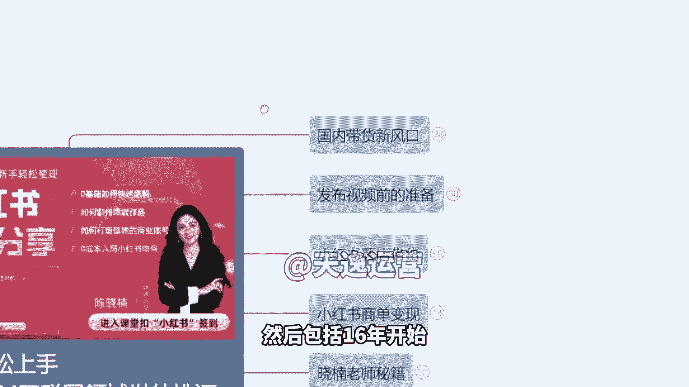
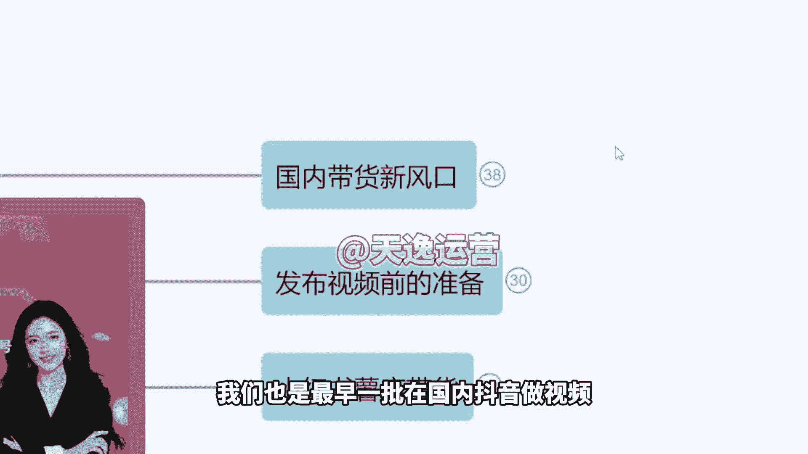
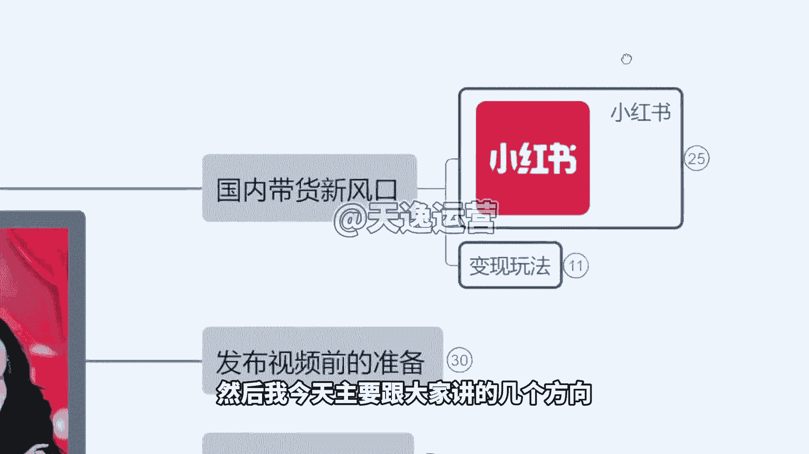
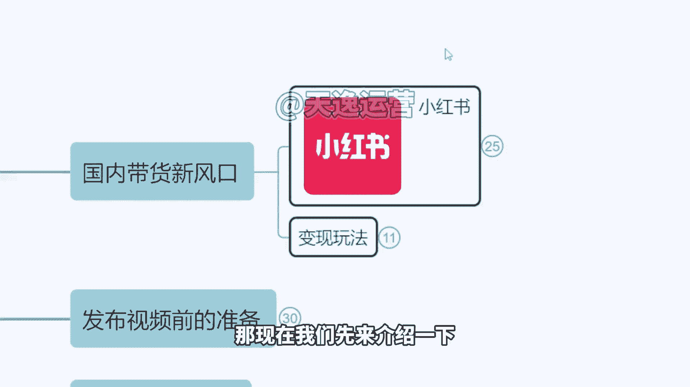
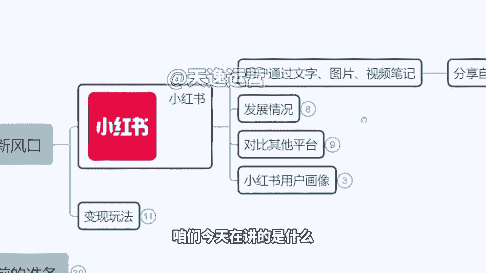
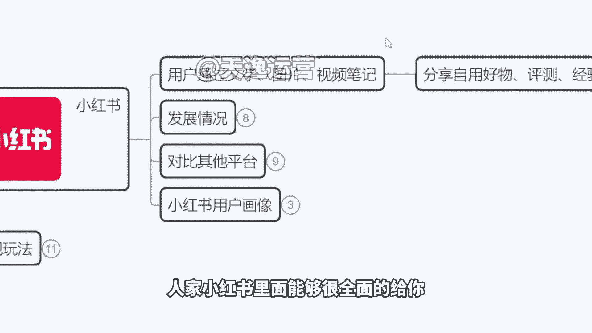
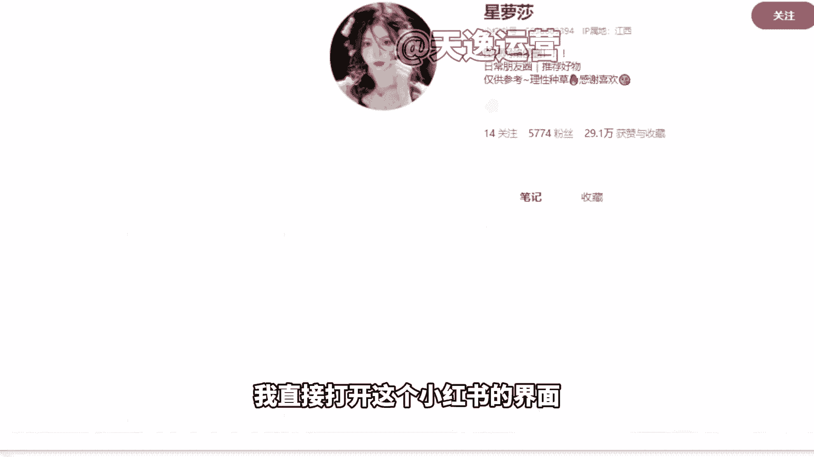
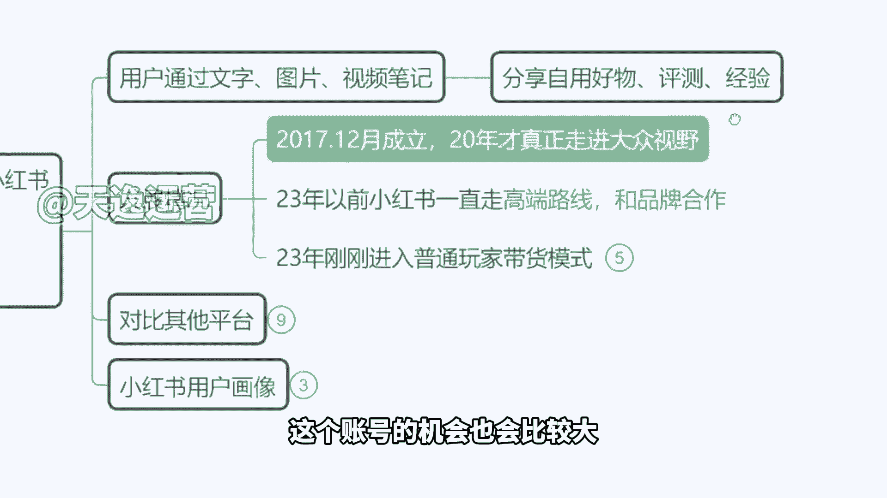

# 【150集精华教程】小红书运营新手起号 0-1新媒体运营必学课！不要荒废18-30岁，一切都还来得及 - P3：1、小红书的前景，国内带货新风口 - 索尼娅图 - BV1ND42137bn

大家进入课堂啊，然后我们现在开始的话就进行，我们今天这个课程，欢迎大家嗯，然后据我了解啊，我们今天课堂有来自于不同这个平台的，这个同学，然后有了解小红书，有不了解的，是不是啊，有在这个什么B站啊。

抖音啊，啊知道听说小红书现在有这个挣钱的项目，但是可能具体怎么来操作不是很清楚啊，大家现在有没有这个小红书的账号，或者说你们平时会不会用小红书会用吗，自己平时有没有用啊，有会使用，对不对啊。

我先跟大家讲一点啊，因为如果说我们现在要去选择一个互联网的，这个行业去变现，大部分人会想诶，好像这个抖音比较挣钱，对不对哈，好有用啊，但不知道怎么挣钱哈，没关系啊。

很多人下意识会想说是这个抖音的这个平台啊，那事实上啊，抖音它现在已经处在一个饱和期了啊，就是因为做的人太多了啊，在这个平台去变现，然后想要在这个平台赚钱的人有点太多了，市场是已经溢出来了啊。

那么所以说小红书它其实也看，看中了这个抖音这样的一个变现模式是吧，以前抖音哪有这个什么带货，哪有什么直播都没有啊，以前我们看更多看到是美女在那pk呀，在那跳舞啊，啊是这这些内容。

然后包括刷视频看到也是娱乐等等啊，但是自从抖音开了这个直播带货之后，开了这个橱窗带货以后啊，它相当于说把我们中国传统电商的呃，这个市场已经做到了一个瓜分，就比如说呢之前我们习惯性在淘宝买东西啊。

在什么京东买东西，现在更多我们会下意识觉得好像抖音上更便宜，对不对，好，那么呃小红书，它的一个模式其实跟抖音有点类似，它也是一个社交平台，也是一个分享作品的平台，但是小红书的区别在于。

它不是说那种大批量的视频，而是小红书更多是以图文的这个方式来进行，但是你想啊作为一个社交平台来讲，就作为小红书来讲，他如果说一直走这个图文的方式，他不挣钱对吧，平台不赚钱呃所以说他开始呢想要去借鉴啊。

这个抖音的一个带货博士，也想做出一个社交的带货平台，社交电商平台，那么所以说今天咱们才有这节课啊，因为小红书给大家提供了一个这个创业的机会，我不知道大家有没有关注到，这个在春节联欢晚会的时候啊。

有第一个小品，当时上场的第一个小品，在那里面出现了一个小红书的logo啊，我们以前看这个春晚基本上没什么广告吧，对不对，今年啊小红书直接把广告打到哪里去了，打到春晚去了啊，直接一个抱枕。

最显眼的红色的抱枕在这里，所以说他下血本了啊，那么我跟大家讲这个意味着什么啊，我们今天为什么会有这么一节课，因为小红书即将迎来它的流量爆发期，第一小红书自己花钱花巨资啊，再给自己的平台打广告。

在疯狂的引流，那么同时如果说未来我们在小红书的平台，去开店铺也好啊，还是说我们去做一个商业账号去打广告也好，那么我们会直接获得平台给予，我们的免费流量啊，就是你不用说像做抖音一样，我还要投抖加对吧。

我还得花钱在小红书我们去做账号的话，现在我们是可以完全封闭，不掏获得流量去争取收益的，然后今天我会详细跟大家讲几个玩法啊，来给大家看一下，一个的是我们怎么样来快速的去涨粉。

因为目前我们是处在一个零粉丝的一个状态，对不对，来这是第一个啊，第二个呢怎么样去制作这个爆款的作品，因为既然我们想要在小红书平台去赚钱，首先你的作品得有人看，我得有粉丝是吧，有人能看到我的作品。

那么才能达到引流的一个效果啊，那么第三个如何打造值钱的这个商业账号，就说我的这个号如果说有粉丝了，有播放量了，我怎么把这些粉丝去变现变成钱啊，让他们来买我的产品，或者说呢我通过接广告，我来挣钱啊。

那以及呢我们今天也会讲到一个很重要的，我在不掏钱的情况下对吧，不花钱啊，然后呢并且呢我没有产品哦，我没有货源，在这种情况下，我们怎么样在不投资的这个情况下，我们去获得回报啊。

这是小红书这个平台目前能够做到的，那今天这节课的话呢，就是由我啊全程来跟大家讲一下，我们整个平台它的一个玩法啊，那么我叫小南，我做互联网的这个时间算比较长啊，15年开始做过淘宝，然后包括16年开始呢。

我们又接触了很多跨境项目，像什么虾皮呀，呃LAZ达啊，酷胖啊，速卖通啊，然后包括呢像亚马逊啊等等啊，18年我们也是最早一批在国内抖音。

做视频带货的商家，然后我今天主要跟大家讲的几个方向。

也是我们不用去直播啊，就是你自己自己不用真人出镜，然后另外呢我们不用说去呃拍摄自己的生活呀，然后不用说自己原创去做这个视素材，一样可以挣钱的一些玩法啊，那现在我们先来介绍一下。

这个小书平台到底是什么啊，啊来我们有很多同学可能一进来云里雾里的，咱们今天在讲的是什么呢。

啊讲的是这个小红书平台的变现玩法，也许这个平台有点冷门，有同学可能进来之后，连这个平台是什么都没听过啊，但没关系，我们先了解一下啊，小说现在他其实是一个集合了所有的年轻人的，这样的一个平台啊。

就我们现在已经有一个根深蒂固的感受，就是我如果说想买个什么东西，我会下意识打开小红书先搜一下，比如说我现在要买口红对吧，我不知道我这个白皮适合什么，黄皮适合什么小红书搜索一下啊，我要出去旅游。

我也不是问下当地人说哪里好玩，什么东西好吃啊啊我这小说搜的吧，武汉啊，这个哪个地方景点，江汉路怎么怎么样啊对吧，什么东西好吃啊，然后去搜在小红书能直接给你答案，包括我今天我想买一个什么筋膜枪啊。

我想买个按摩仪，人家小红书里面能够很全面的给你。

把所有的这个品牌的介绍都给你写清楚，来我们看一下啊，我直接打开这个小红猪的界面，来我们搜索一下这种。

你看一下对吧，我直接搜索一个什么美容仪，它的内容做的是很精细的啊，来咱们可以看一下啊，在这里面的话，他有很多这种专业的产品的分析来看到没有，对不对，就这种啊很多个产品给你罗列在一块，然后给你做分析。

非常专业，那所以说这个平台做的一个流量背书，做的很好啊，它里面针对性的客群是有很多的，就是想要购物的客户他是居多的，那所以说我们之后去做这个账号的。

