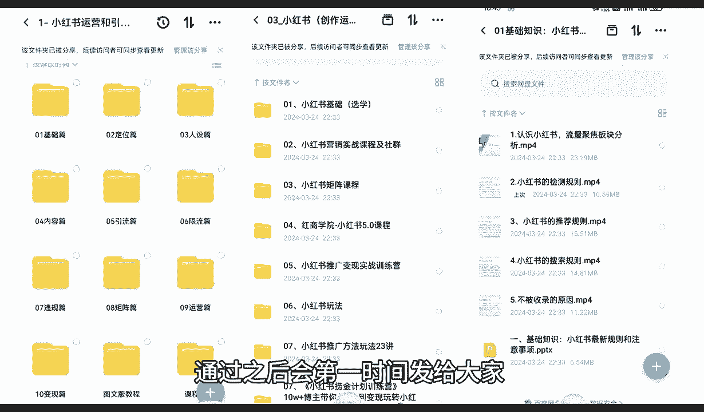
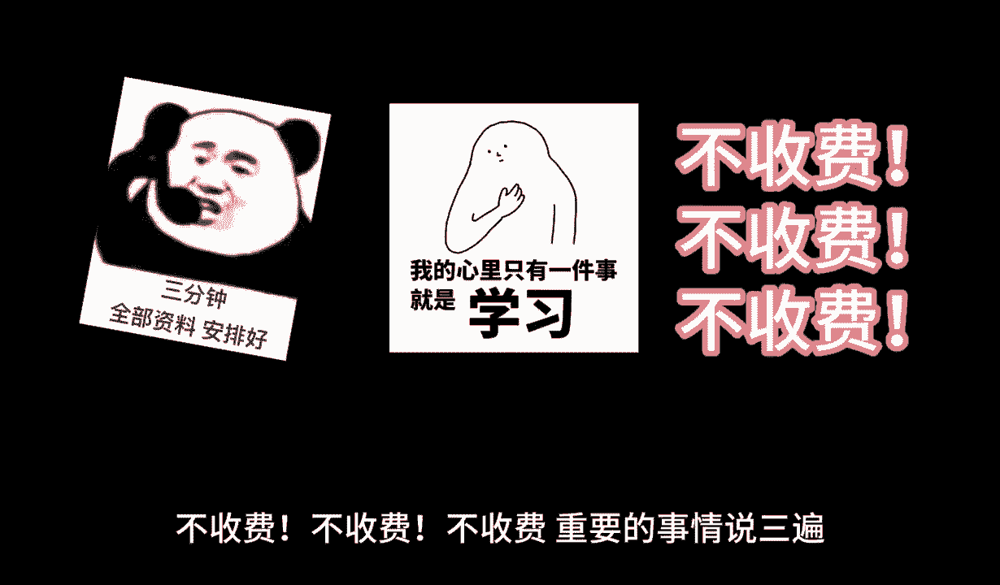

# 【150集精华教程】小红书运营新手起号 0-1新媒体运营必学课！不要荒废18-30岁，一切都还来得及 - P4：02、新手小红书运营-小红书本质（1） - 剪_映教程7 - BV1Px2JYDEu9

大家好，今天给大家分享的是小红书全系列啊，的一个分享课，呃，之前呢是给大家建了一个讲了一个课程介绍，这节课呢我们开始从小红书的一个本字开始啊，什么是小红书的本字啊，小红书本字呢。

其实说就是说我们需要了解，我们做小红书这个平台啊，他整个平台它一个运行模式，包括他主营的一个项目是什么样的啊，我们只有了解小红书的一个本子以后，我们才能通过分析它的本质啊。

才能了解小红书它给予了我们怎么样一个市场，好了废话不多说，直接呢开始进入我们的一个正题，嗯小红书的本质啊，其实在这个点的话，我们其实把它分为六个导向啊，六步就可以了，为什么说是六个的导向六步呢。

我们在这里啊，我们首先来了解一下什么，什么是小红书的一个本子啊，第一个是小红书，他对于各大平台的一个区分，先给大家讲区分，然后呢给大家讲一下，小红书它到底是怎么运营的，首先他小红书对于各大平台的区分。

是什么样的平台呢，就结合我们现在啊网络实际运营效果来说的话，小红书它和其他的一些平台不一样，它不是一个纯卖货的平台啊，它是结合了抖音，还有淘宝拼多多等这些平台的一个综合体。

这样来额外做出来的一个网络交流平台，为什么说是综合体呢，因为它上面有你，比方说我们拿抖音做比方啊，抖音的话，说实话，它无非就是一个小视频制作和少量的文案制作，他95%以上基本上都是小视频制作。

它通过视频的内容宣传啊，我们不管是娱乐效果也好，是生活知识也好，各种常识也好，他都是通过视频啊进行一个讲解，但是小红书它是一个图片文案模式，进行一个讲解，那它和淘宝和拼多多的区别是什么呢。

淘宝它是商品卖货，拼多多是商家卖货啊，但是小红书是结合了这三个主流的一，个营业方式，然后单独区分出来的一个呃模式，为什么啊，因为小红书它上面有卖货的内容，也有我们图文的一个内容，也有我们视频的一个内容。

但是你光说抖音的话，抖音它是有有店啊，有抖音小店，但是抖音小店的话，整体他不是说卖货，他是带货啊，带货和卖货可不一样啊，带货的话是说我没有产品，我是一个网红啊，你把你的产品放到我这，我帮你做宣传。

通过这种方式来达到网红主播的一个盈利，或者说是你这边有广告需要，我帮你宣传你的产品啊，或者说你有一个游戏需要我帮你宣传一下等等，通过这些方式来方式来盈利，淘宝和拼多多是什么呢，他们是纯卖产品的一个地方。

就是说你需要买衣服啊，去淘宝，你需要买食品，买零食，买便宜的一些小件，你去拼多多啊，他是通过这种方式，他们有一个主体的，一个就是各大平台他都有自己的一个主体啊，当你的主体和你对应的一个本质不相同的话。

那么你在你去操作，你比方说你本来是做直播的对吧，你去你想去开个小店，你然后在淘宝上卖，淘宝也有直播啊，你去淘宝上面直播，那你觉得你的一个播放量，它和抖音呢差别有多大呢，对不对。

他就是一个纯卖货的一个平台，他不是说让你去做直播的，你要去做，真要去做直播，那么你就只能去选择抖音，它是类似于这种，但是小红书小红书啊，他和他们的一个本质区别呢，就说他是三个平台的一个综合体。

在这里面我们去做小红书，你去商品卖货也可以，我自己做文案，把文案做美了以后，我自己去卖货也可以，我做网红店也可以，我做美食博主也可以，我做书类博主也可以，我做游戏宣传博主也可以，这是博主，然后是引流。

为什么叫引流呢，你我们在了解一部分的内容的时候，小红书它其实是三大主体，一个引流，他应该呢是网最后面一节课给大家讲的啊，这里呢先给大家介做一个大概的一个介绍，小红书三大主体就是说一个店铺运营。

一个私域引流和一个网络博主，网络博主其实正常来算的话，他是抖音的一个网络博主，但是抖音网络博主的话，他的竞争压力太大了啊，小红书也有这方面的一个需求，所以说它是一个全新的市场啊，适合我们新人。

或者说我们对网络不了解，我们把小红书的网络博主我们做好了，我们同样可以在抖音上面去扩展，一样的道理啊，私域引流，就是说把小红书的流量，引流到我们自己宣传的一个嗯，怎么说呢，就是你宣传到其他的一些交流群。

就是我们自己创造的交流群，给自己打造一个包装，打造一个整合体，或者说是打造一个分享专区啊，这叫私域引流，然后打造成功以后，再通过你我们自己的一个宣传，把库克把这帮人留住。

然后他们都是因为有一个共同的目的，你比方说宝妈群对吧，宣传孩子一岁到两岁，两岁到五岁，五岁到十岁，这孩子需要什么穿什么用什么啊，什么样的营养品好，那我们就可以在这个里面去卖产品。

所以说小红书的三大主体就是店铺运营，直接硬卖产品，第二个就是私域引流，第三个就是网络博主，那我们了解小红书的本质，这个区分以后的话，我们就会和抖音也好，淘宝也好，拼多多也好，我们去和他们抢流量。

这是小红书抢流量啊，这就是小红书它整个平台一个运行系统，它因为一个新的模式发展出来以后，他需要有新的一个接触方式，所以说就创造出了小红书，那小红书在这三个基础点，就是已经有三位前辈了啊。

他在这基础点上面进行了一个整体的综合啊，创造出了小红书，那小红书的主营方式是什么呢，第一个是生活方式的一个分享社区，就是说小红书的话，它是以一个用户生成内容为核心的生活方式，分享平台。

因为他和抖音不一样，抖音的话你想把自己做红做火啊，你每天我们正常普通人去拍抖音视频，拍这个拍那个你了不起，有1000的粉丝已经很厉害了啊，正常的话也就30~50个，为什么正常普通人。

你每天拍的自己的一些形形色色的东西，因为竞争力太大了，你拍上去以后的话，你的第一我们没有专业的美工，第二我们没有专业的摄影，第三我们有专业的设备，第四我们没有专业的知识，在抖音上面去抢占我们的流量。

那我们来去操作的话，我们就需要去了解啊，有没有其他的，可以来对我们进行一个全方位的升级了解，所以说小红书现在的话，现阶段它是非常适合我们新手来去操作的，这里呢整个小红书的本质的话它是分为六个点。

那我们从这六个点里面的话，对应的筛选，看有没有我们自己适合去操作的一些内容，第一个是生活分享啊，生活方式的一个分享社区，这个分享社区里面的话，它包括了一个产品评价啊，旅游的就说旅游我去什么地方旅游啊。

我在这个地方旅游，有没有什么好好吃的，好喝的，好玩的啊，也是一个进行分享，然后是一个美食体验，也就相当于类似美食博主之类的，或者说我自己做的美食产品啊，我自己做的泡菜啊，做的饭啊，用什么调料。

先用什么后用什么都可以，而且他和抖音不一样，它的整体平台系统的话，他的一个推流是非常均衡的，他不会额外的突突出，去对你进行流量的一个推广啊，你比方说我在抖音上面，我发同样一篇美食文章上去。

我在小红书上面的话，可能会有3000~5000个浏览，但是你在抖音上面你最多有200啊，因为抖音上面他已经成熟了，你要再想去做这类似的一个事情的话，你需要去花钱让抖音主动进行推流，但是我们正常来做的话。

是不会去那么去做的啊，所以说小红书是给了我们一个很好的一个，本质的推推广渠道啊，然后是时尚穿搭等内容，形成了一个围绕生活方式的一个兴趣社交网络，就说我们正常的话，你如果说想做网络博主。

就可以往这个方面去靠啊，通过分享我自身的一个美食的一个经验，旅游的一个经验，产品的一个评价，时尚穿搭等等等一些方式啊，形成了一个庞大的生活圈，这个呢就是小红书本质的一个区别啊，包括后面五条内容。

因为时间的原因呢，我会在下一分解里面给大家进行讲解啊，我这个分享内容的话，因为我这边的一些技术原因，或者说我们这边的一些内容原因，我如果说把视频做的太长的话，嗯导致后续的话我们上传会会很缓慢。

所以说我一节课的话，我大概的话是控制在十到15分钟左右啊，希望大家理解一下，下一节分享呢我就给大家讲解一下小红书本字，下面五个整体的一个内容啊，让我们去了解一下，我结合我们个人自身啊，怎么通过小红书啊。

了解他的本子以后，知道我自己要去做什么啊，方便我们后续的一些小红书了解啊，做店也好，做网红也好啊，做引流也好，我们把这些基础的知识了解透了以后，少走弯路好吧，那么这节课呢就到这里。

最后呢会给大家一个小福利，整理了小红书运营实操资料，可以评论区私信的方式领取，通过之后会第一时间发给大家。

注意领取资料，不收费不收费不收费。

