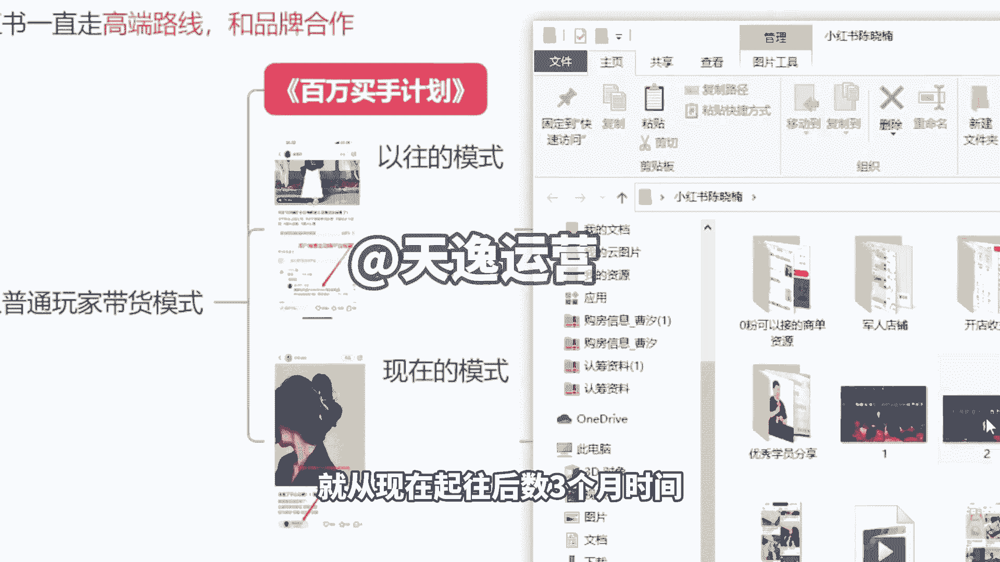
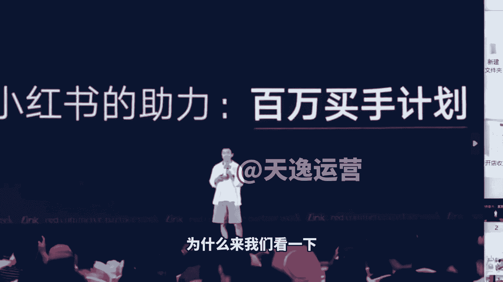
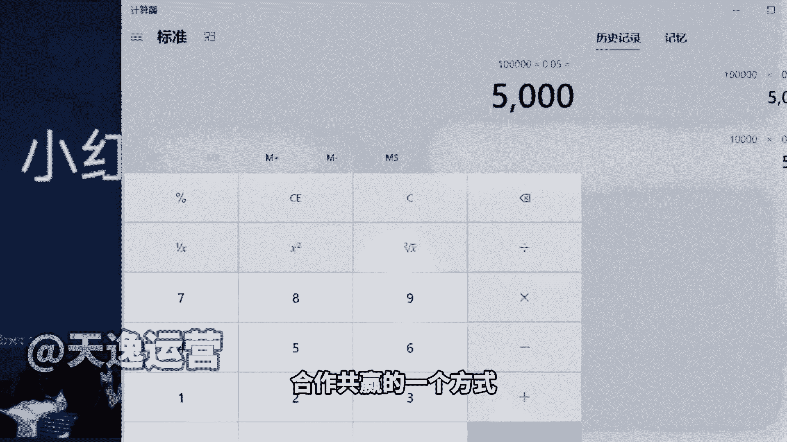
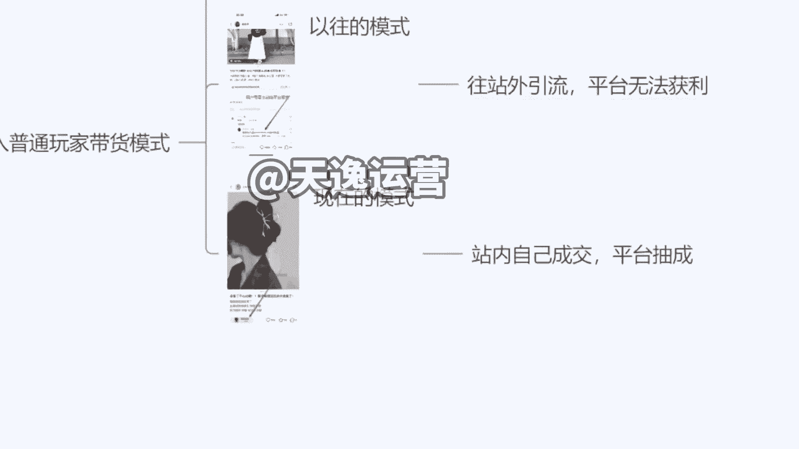
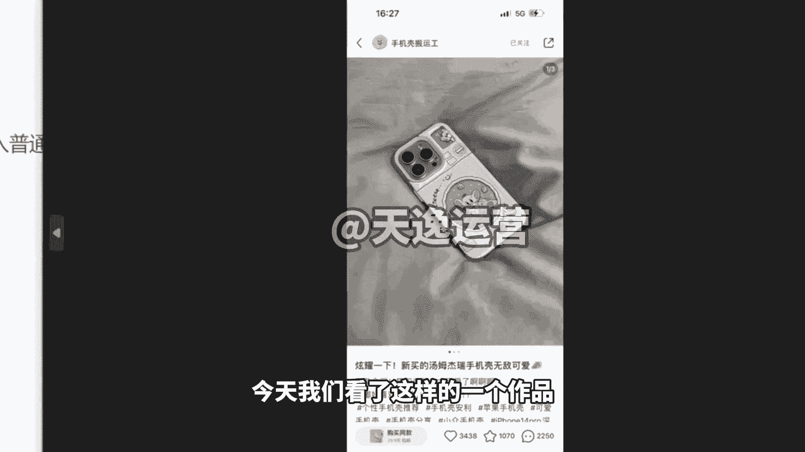
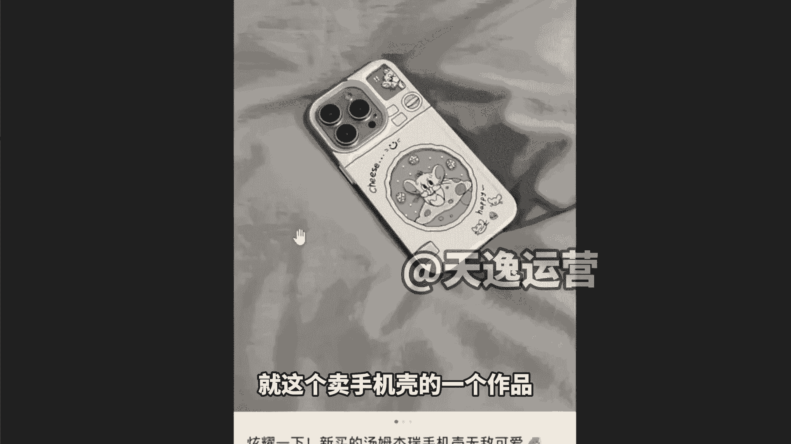
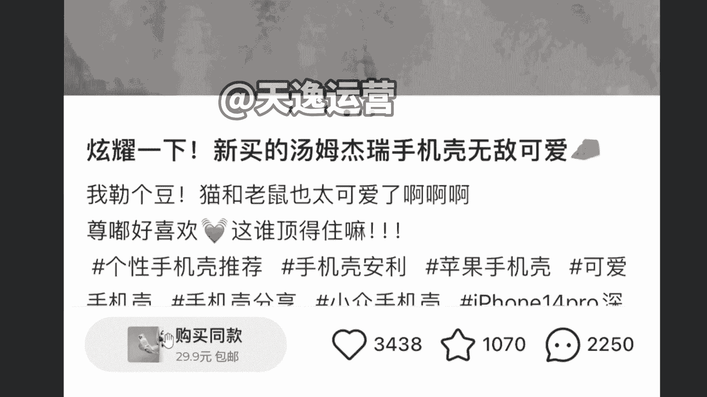
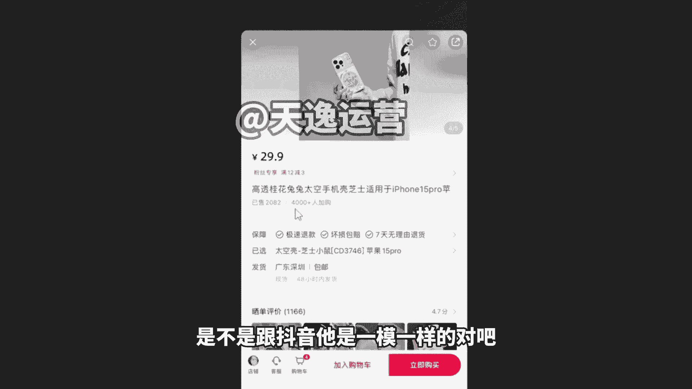
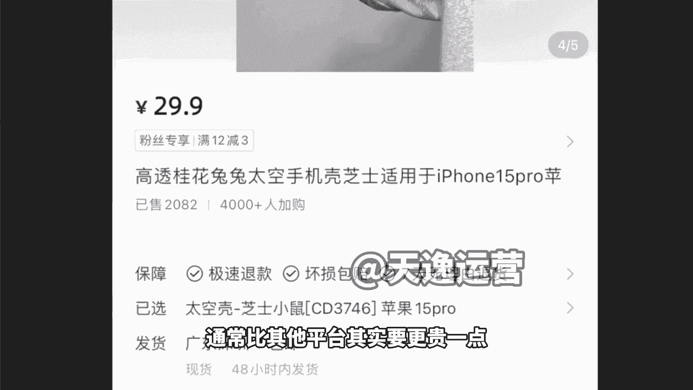
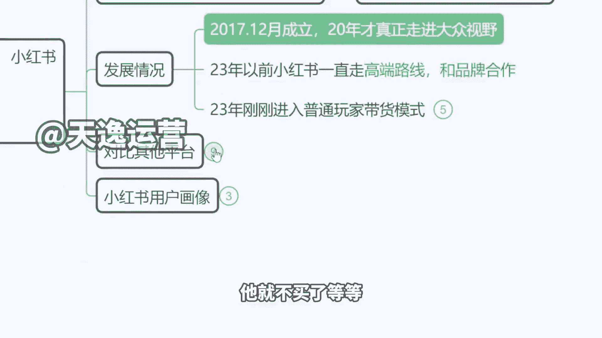

# 【150集精华教程】小红书运营新手起号 0-1新媒体运营必学课！不要荒废18-30岁，一切都还来得及 - P4：2、小红书的发展情况 - 索尼娅图 - BV1ND42137bn

那再一个跟大家讲一下小红书，它的一个发展历程啊，就在最早之前，小红书其实他是一个没有变现能力的平台，就是我们以前刷小红书发现里面可多炫富的了，有没有什么香奈儿的包啊，怎么去买啊，哪个款式当下的爆款。

什么情人节限定是吧，然后包括呢买这个爱马仕的铂金包，你需要配货10万还是20个W啊，以前讲的是这些东西，名媛的下午茶啊，这个星空顶的豪车对吧，以前是刷的是这个东西啊，但是这个大牌是不可能说在小红书。

去开旗舰店的啊，所以说慢慢转型到后来呢，这个卖点什么化妆品啊，啊卖点这个护肤品啊，啊然后再到呢后来跟各种服装品牌去合作啊，再到现在什么花西纸啊，完美花西子啊，完美日记啊。

这个几十块钱的产品也开始出现在这个平台，所以说现在小红书它其实主打的一个方向啊，就是去做带货，那么所以说今天我们也会来教一下大家，我们怎么样来做这个模式啊，我跟大家简单先说一下。

这个百万买手计划是什么意思，为什么我前面在开课的时候，我就跟大家强调，我说现在是做小红书的黄金时间，对不对，黄金三个月啊，就从现在起，往后数三个月时间。

现在是平台直接给咱们免费上游的一个时候，为什么来我们看一下啊。

他们这个CEO发布了这个新闻，发布会，讲到了这么一个玩法，叫百万买手计划，就是他们现在在大力的招募有创业能力的人，有开电能力的人啊，有电商经验的人，来到小红书去开店去卖产品，不管我们的货有没有品牌。

无所谓啊，就是能够开店，能够去成交，那么就可以，为什么来现在小红书要靠这一个玩法去翻身，我举个很简单的例子啊，如果未来我们的店铺成交金额达到1万块钱，对不对，我卖了1万的货。

那么平台能不能从我们手里抽成呢，可以他会获得5%的手续费服务费啊，相当于说你需要交钱给他是多少钱呢，500块直接从你手里扣走啊，不会问你同不同意，看到没有，那如果说我们成交的是10万元，对不对。

他直接能够从咱们手里啊获得5000元的分成来，同学们这个钱是不是挺多的是吧，这就是小红书啊，他未来走的一个方向，你开店卖货卖的越多，你给平台创造的价值越多，那么他从你身上捞到油水越多。

他给你的支持就越多啊，这就是小红书，现在跟我们所有的达人合作共赢的一个方式。

那么今天我们就算是个小白，我啥都不懂，只要你把这个店开起来，我们把产品上上去，把作品发起来啊，赚钱是很容易的，基本上7~15天左右是没有问题的啊，这个是一个百万买手计划，你看之前我们在小说。

你要买个东西很麻烦的对吧，我还得去搜啊，说这个你好链接有没有求个链接，这个裙子很漂亮啊，你还得到淘宝上去下单，是不是，那作为商家来讲，作为卖家来讲很亏的呃，作为作为小红书来讲很亏的。

明明是我自己平台引流的，我花钱来的，买来流量啊，结果跑到淘宝去买东西，钱被淘宝挣走了，对不对，那现在不一样啊，现在的一个玩法什么样的，来我放这个大图给大家看一下啊。

很方便，他的模式跟抖音几乎没有区别，就好比说今天我们看了这样的一个作品。

一个卖手机壳的，但是小红书算很委婉啊，我们可以看一下，就这个卖手机壳的一个作品。

他怎么写的，他不会告诉你像抖音一样，我告诉你今天我这个产品九块九包邮，买一个再送一个啊，赶紧进入直播间抢购，没有这种，它是什么啊，来你看炫耀一下新买的汤姆杰瑞手机壳对吧，呃是不是他真的是他买的。

不是我们通常会被这个标题引进来的吧，好像哦你真的在给我推荐一个好用的一个东西，实际上人家自己就是老板啊，他写文案把你先圈进来，这个小套路对吧，然后在左下角告诉你啊，购买同款，直接点这个通道可以进入。

他就跟抖音的小黄车是一样的道理啊。

然后进入到这个界面以，后，来你们自己看这个界面，熟不熟悉，小红书的购买通道，是不是跟抖音它是一模一样的对吧。

没有任何区别，一模一样的啊，来这里已售出产品价格等等对吧，下面加入购物车，立即购买都是一样的，那么用户呢就可以直接下单，直接购买了，那么但是啊，小红书的产品，通常比其他平台其实要更贵一点啊。

但是用户并不会有这个想法，并不会因为价格高诶。

