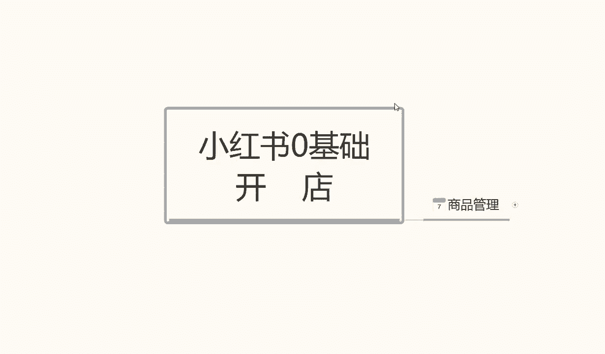

# 【150集精华教程】小红书运营新手起号 0-1新媒体运营必学课！不要荒废18-30岁，一切都还来得及 - P52：6.小红书店铺商品上架 - 剪_映教程7 - BV1Px2JYDEu9

大家好，今天给大家分享一个小红书，零基础开店的第七课时商品观点呃，结合我们上节课的内容的话，这节课给大家讲解的一个商品管理呢，我们可以把它分为两个部分。

第一个呢是单店的一个商品管理，第二个呢是店群的一个商品管理啊，这里呢给大家列的两个点是让大家好区分，我们自己后面怎么选啊，到底是做什么模式啊，单电模式怎么操作，电池模式怎么操作那个商品规划。

现在呢我给大家呃，先讲解一下单定模式的一个商品规划啊，单店模式的一个商品规划的话，比店群模式的一个商品规划稍微复杂一点呃，电池模式的话可能会相对来说非常简单一点啊，首先我们了解一下单电模式。

单店模式的一个产品规划啊，我们首先了解一下店铺产品的一个。

基础数量的一个需求，他是对于我们整个小红书店铺的话，一个整体基础数量的一个需求量啊，放在这个地方，首先我们了解一下啊，整体店铺，就说整个小红书整体店铺的一个商品数量的话。

我们最好呢是把它保持在7~15之间啊，不要多也不要太少啊，7~15个之间嗯，这为什么说是产品数量保证7~15个之间呢，因为所有的网络运营啊，不管是某多某宝也好，或者是小红书也好，或者说是京东也好等等。

这些平台，对所有的一个数据它都基本上都是差不多的，整个店铺的话，你单店模式本来就是精细化的一个产品，整个店铺里面的商品数量的话，它只不过是存在一个组一个组产品，几个副推款。

然后其他的一些就是不量的一个产品，实际上为了让我们店铺显得不那么孤单，主产品显得不那么孤单，同时呢提升我们店铺的整个的一个属性权重，什么叫属性权重呢，就是我们这个产品里面的话，它有一个动效率啊。

有一个营销率，有一个成交金额，他在整个数据里面的话，它所包含的数据是非常多的，那我们操作的时候，整体店铺的数据的话，首先要保证下来才有我们单品的一个权重啊，不是说先有单品权重，才有店铺权重的。

是先有店铺权重，才有单品权重，你店铺都没有权重，你单品有权重，你也上不去对吧，所以说我们要先把整体的规划先做好，也就是整个店铺的整体商品数量的话，要保持在7~15之间，这就看我们自己怎么去操作。

怎么去规划了，但是最低数量不能低于七，最大数量不能大于15啊，当然我们做到后期的话，单品店铺你可能报一个款包，两个款包，三个款，你的款式报多了以后的话，产品数量可以上去。

但是整体的数量的话不要超过15啊，你只能说是把这整个店这几个店铺，第一款报完了，上第二款副产品，把它做成主产品，第二款报完了再做第三个副产副产品就可以，但是补量的产品数量的话是不能增加的。

保持在5~15个，5~10个之间就可以了，副产品的话两到四件，你整个主产品的话一件合起来就是15件产品，那么也就是说我们有一件产主产品，你后面还有四个副产品，随时等着可以上做第二个爆款，第三个，第四个。

第五个爆款，当你做第五个爆款的时候，你后面的产品的话，你其实报不报都无所谓了，因为这五个产品你已经赚的够多了，我们再去做去开分店，去看第二个点，第三个点再按照这种方式去操作都可以。

但是你不能说是拿这一个点，整个电机想把它做成最大的，这不可能啊，因为他的所有的系统分流的话，基本上不可能把所有数据给你一个点，你做第二个点，第三个点的话可能效果会比这个更好，只是说我们做单电模式的时候。

第一个是熟悉，第二个是了解我们整个小红书的一个过程啊，也是对我们自己的熟悉的一个过程，我当我们知道技巧以后的话，我们再去重复操作的话，第一个投入小，第二个收入高，所以说大家一定要了解好啊。

也就是整个整个店铺的商品数量都最多的时候，也就15件商品啊，一定要保持在这个范围之内，下面呢是给大家讲解一下，我们商品发布的一个技巧啊，单品单店模式里面，它商品的发布它是有技巧的，他不是说我们拿着产品。

哎，我想这个产品组推那个产品组推，他不是这样的。

他是有技巧的啊，所以说我们在这里给大家讲解一下，商品发布他的技巧点在什么地方。

首先呢了解一下先上一到两件的副产品啊，每天产品上架不超过三件偏上，一到两件的一个副产品，然后店铺正常运行一天以后，我们再上主产品，为什么这一天的时间的话，是让小红书整个系统录入我们的产品以后。

给我们产品瞬间排名，也就是我们小红书的一个后台，它的一个整体运营后台系统，把我们的店铺录入产品，录入给我们一个基础排名以后，我们再上主产品，用这个主产品操作数据以后，提升我们整体的一个排名。

副产品不行的，副产品前期不要任何操作，就是我们第一天的话，只需要把一到两件，或者附带一件不亮的一个产品放上去就可以了，其他什么都不用管，也不用操作什么，放上去，让它自己运行就行，然后过一段时间。

我们再去操作这个店铺的一个主产品啊，第二天第三天，第四天都可以，当我们想操作主产品，就是把主产品上传上去，然后重新更新资料，再去做他的一个数据，我们店铺整体数据才能上来。

第一天如果说我们直接把产主产品放上去，我们去操作的话，是没有任何作用的啊，因为第一个小红书系统录入录入以后的话，它有一个时间等待，等待时间的产品排名重新需要时间更新的。

我们先把店铺的一个排名做上去了以后，再去操作数据，你的排名下次更新你才会有排名提升，才会获得更多的一个访客和曝光啊，大家一定要这个点，第二个点呢就是上架时间啊，副产品避开避开高峰期。

所有的产品在上架的时候，它都是有高峰期和低峰阶段的，你比方说凌晨两点到五点这种低峰阶段，他不可能有人去逛小红书啊，或者说逛小红书店铺啊等等之类的，那么任何产品它都有一个高峰时间段啊，比方说家具也好。

服装也好，食品也好，玩具也好，首饰也好，那我们就要去分析整个店铺的一个人群，之前我也给大家讲过啊，数你不管是做什么小红书里面，他也是有店铺人群，他也是有分类管理的，因为整个系统它基本上都透明化了，以后。

所有的东西他都是可以模仿仿照的，只是看他的系统完不完善，有没有漏洞，让我们钻，所以在大家在上架产品时间的时候，一定要注意了，副产品避开避开高峰期，是为什么，第一个副产品的话，它本来就竞争力不大。

我们用副产品去跟别人的主产品抢流量，在高峰期抢流量是抢不到的，所以说我他还不如避开高峰期，用冷门时间去抢额外的一个流量，但是你不能去抢那种真的是凌晨两点到五点啊，你比方说我们随便拿一件。

嗯拿个什么产品呢，拿个女装吧，女装来说的话，它整体的一个高峰期在什么时间呢，早上十点以后到中午一点以前，它有一个高峰期，但这个高峰期的人流量的话不是特别大啊，但是也不小，第二个高峰期是在什么时候呢。

下午五点到06：30或者七点钟左右的时候，这是一个高峰期，然后是晚上八点到11点，这是一个高峰期，它分为三个高峰期的一个时间节点，当然了，你们我们如果说想要正确的去判断，其他的产品的一个高峰期。

你们其实嗯可以参考一下别的一些数据啊，可以去搜索一下，基本上都能搜到的，啊就可以看一下自己行业的高峰期，那我我们上架副产品的一个高峰期的话，避开凌晨两点到五点这个时间段，千万不要去上传产品。

因为一点流量都没有，没必要啊，我们可以把其他的一个副产品时间，避开这三个高峰期，在其他任何时间段进行投放都可以啊，主产品下面呢来给大家讲解一下主产品，主产品的话要在高峰期前30分钟上架。

为什么说是在高峰期前3分钟30分钟上架呢，第一个避开和同行内部产品的一个，正常的一个交锋，第二个给我们系统一个反应时间，30分钟的话足够系统一个反应时间，他每天的一个成交金额，你每成交一次。

你的成交的一个数据，在第二天以后的话，他会更新你的一个排名，你的排名就会越靠前，我们在前期操作的时候，当然你的店有一定的实际数据以后，在后期的话我们可以去抢高峰期，但在前期的话尽量不要去抢啊。

也就是第一件主产品不能抢高峰期，在高峰期前30分钟可以第二件组产品啊，也就是我们店铺做起来以后，第二件组织产品可以去抢，高峰期，在高峰期正红的时候去上传产品，就可以，第一件产品不行啊。

第一件第一定要隔30分钟，这30分钟就是给系统一个反应时间，给我们自己一个反应时间，去捡别人高峰期剩下的流量啊，来充实我们的店铺，当我们把数据做起来以后，再去跟别人竞争，就可以懂我意思吧。

就说我们在主产品，在高峰期前30分钟上架就可以了，这是它是一个小目技巧啊，高峰期有两三个，就是我刚刚给大家例简单的拿女装做了个例子，就说三个高峰期我们选一个就可以了，然后这一个高峰期的一个时间段。

看我们自己怎么去安排三个时间段都可以啊，前提前半个小时我们把产品发上去，把数据更新一下就可以了。

好吧，这个呢就是我们单店模式，整个店铺的一个才能提取基础数量和销需求。

同时呢也教大家了，一个商品发布的一个小技巧啊，大家把这几个点记下来就可以了，下面我讲解一下电驱模式啊，电驱模式对于单电模式来说的话，它会简单的多了啊，但是它操作比起来比较重复啊。

需要大家有很强的一个耐心去操作，电池模式相对于单店来说的话，他的一个差别就在于什么地方呢，店群模式只需要不停的发布产品就可以了，每天店铺上架50个左右的一个产品就可以了，其他的不需要任何操作了。

当然你店铺破零的话，你自己还是需要去操作一下的，因为你店铺不破零啊，小红书他不会给我们流量的，一个流量都没有啊，所以说产品一定要破零以后，再去每天上架50个产品，当然了，不是这50个产品都要破裂啊。

找个两三个产品啊，把个数据破零就可以了，其他的正常的发布，他小红书还会正常的给我们流量的就可以了，然后这十个店铺同样的一个操作，这个操作的话，他小红书里面的话，它后台系统里面有那个嗯一件代发啊。

一键上传资料啊，操作还是比较简单的，只是十个店铺操作起来，你可能需要一段时间啊，这个呢就是电池模式和单电模式的一个区别啊，也是我们商品管理课程的一个简单的区分，大家了解一下这些内容以后的话。

我们再去做小红书店铺的一个产品，商家的话就会非常容易好吧，那么这节课的内容呢就讲解到这里，下节课呢给大家讲解一下我们单品小红书啊。

