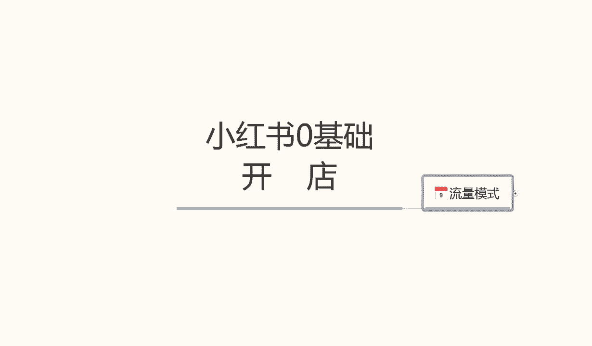
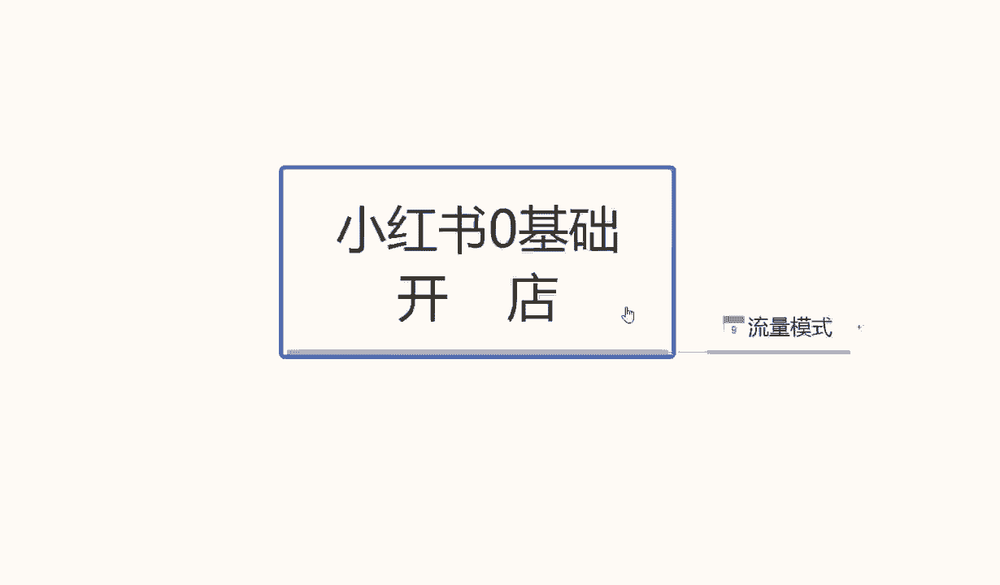
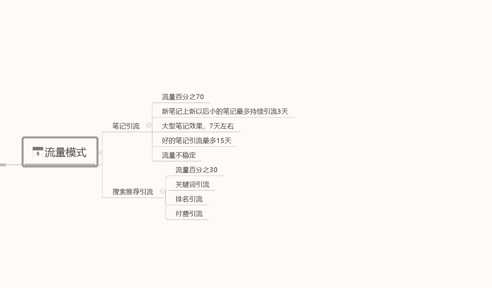
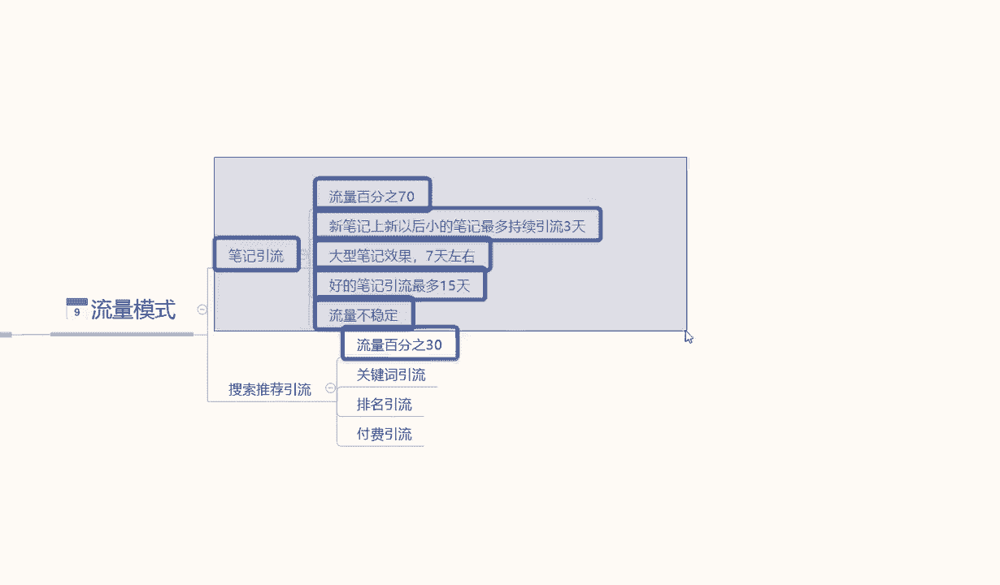
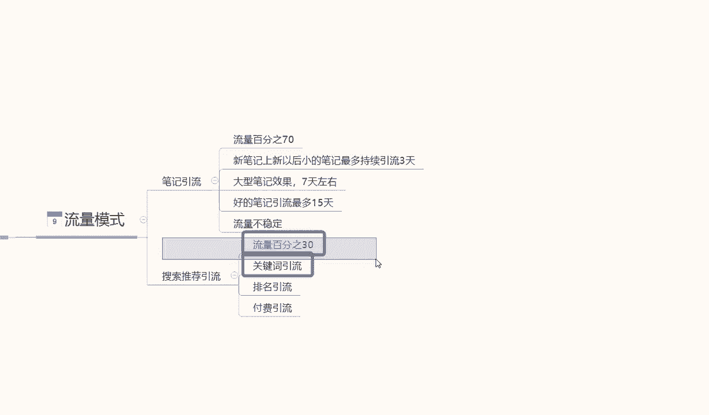
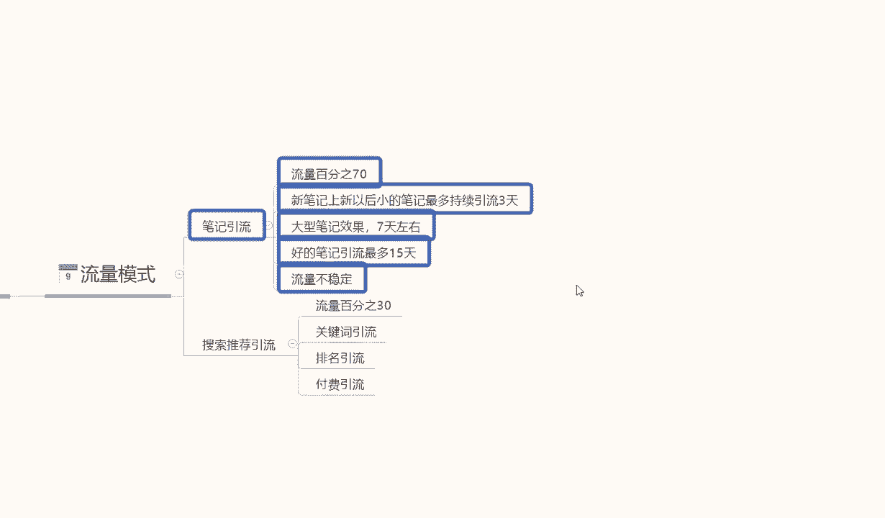
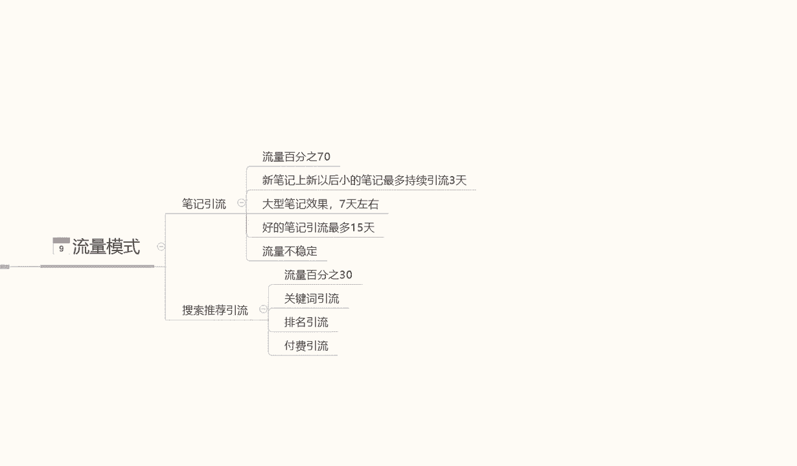

# 【150集精华教程】小红书运营新手起号 0-1新媒体运营必学课！不要荒废18-30岁，一切都还来得及 - P54：8.小红书店铺流量打造 - 剪_映教程7 - BV1Px2JYDEu9

大家好，今天给大家分享一个小红书零基础开店，第九课时啊，流量模式，这节课主要内容呢是给大家讲解一下，我们整个小红书运营体系里面，它的一个流量模式啊，是通过什么方式，来给我们店铺带来访客和收益的。

首先让我们了解一下浏览模式。

它分为两组啊，第一个是笔记引流，第二个是搜索推荐引流，这点的话我虽然说我每节课里面打的内容不多，但是我讲的内容的话，大家仔细听的话，其实还是个有很多内容在里面，需要我们大家自己去仔细思考的啊。

今天这节课的话，给大家讲解的是笔记引流和叔叔的引流推荐，首先我们了解一下啊，小红书的一个笔记，引用整个小红书系统，它的一个流量模式的话，它是我们流量按百分比来计算的啊，就是100%，那比一流的话。

他的整个流量占比是达到了70%，而搜索引流推荐的一个流量的话，只有30%，它是整个商品系统的一个管理流量啊，那这里呢大家一定要注意了啊，这70%的占比和30%的占比，大家不要觉得啊，我操作店铺的话。

我去做了70%就可以了，30%无所谓。

其实是错误的啊，不要看这个笔记引流占70%。

搜索引流只占30%，但是我们如果说能把真的把控到，30%的流量。

其实比这70%的流量效果更好，因为比基引流70%的流量的话，它的转化率没有那么高，它的整体转化率的话可能没有搜索引流，转化率的可能会要低到三倍左右，比基引流的一个转化率的话，他的访客量是大。

但是他转化率低，搜索引流的话，它的一个流量比低，但是它的一个转化率非常高，因为他的目标是明确的，我们笔记引流，它只说是给我们店铺增加了一个人气权重，店铺今天进了多少访客啊，啊对吧。

有多少人能看到我家产品感觉不错啊，偶尔有那么一两单成交，但是搜索引流的话，他可能进来100个访客里面，可能就会成交7~8单，如果说我们的商品好的话，可能成交的单数会更多，所以大家不要不要小瞧搜索引流。

他只有30%的一个流量啊，上面只是说让我，我们用户更好的了解我们的商品啊，我们自己进行了一个推荐，下面的话是商用户主动搜索，我们产品获得的一个30%的流量，这个就是两种流量，笔记引流和搜索推荐引流。

它的一个关键之处啊，一个是主动搜索，一个是被动搜索，所以说两个流量都很重要，第一个比一率流量，它的流动性，人口非常大，用户多，但是搜索引流的话，排名如果说坐上去了，整体店铺数据做上去了以后。

搜索引流的一个转化率是非常高的啊，就看我们自己选择一个侧重点，前期先做哪个啊，后续再去优化另外一个，这两个都是必须要做的啊，缺一不可啊，少一个我们店铺的一个数据都不好做，所以大家一定要注意这个点。

那首先讲解一下这个笔记引流，70%的一个流量啊，新笔记刷新，我们就是说产品发布，笔记基本上都是一天发两个或者一天发一个，或者是三天发一个，看我们自己的时间规划，做单店的话，其实说实话一天发两个流量左右。

也就是一天发两个比一左右，对我们前期店铺的一个引流的话会好一点，中后期的话一天发一个，或者是两天到三天发一个都可以，但是这个时间段的话，前期不用固定，后期是一定要固定的，也就是说你我们最少更新的话。

一天一更是最好的，或者是如果说我们时间不充裕啊，三天一更或者两天一更没有找到新的搜索，但是这个模式的话一定要固定下来啊，后中后期一定要稳定下来，前期的话没有那么太重要，一天发两个都可以啊。

但是每天小红书单品笔记，整个店铺单品笔记只能发两个，再多整体权重下降啊，笔这是笔记引流里面最最重要的一点，大家一定要注意了，每天单品笔记每天最多发两个单品啊，其他副产品其实是不用发的。

就是主产品每天发两个左右就够了，再多的话没用，大概持续个十天到15天左右，基本上效果就出来了啊，然后这里面的话笔记内容它也是有区分的，这点话给大家大概讲解一下啊，我们笔记上新以后，小的笔记。

也就是说我们这个这个笔记如果说没有爆，最多持续引流三天，三天以后的话，他不会给我们店铺带来几，基本上每天有带来一到两个，但是三天以前的话，每天给我们带来流量，访客的话就是这个呃小红书里面上面的小眼睛。

别人看我们的产品大概是在50左右，就看我们这个笔记啊，不是看产品啊，看产品的又是另外一个分组了啊，那是不一样的，看我们这个单品的一个小笔记的话，每天大概在50个往上走，持续三天，这是小型笔记。

大型笔记效果好的话，效果会持续七天左右，引流的话大概会在200到300，效果不错的话，就是每天引流大概在200到300，最好的一个引流数据就是我们这个小红书，如果说我把这个数据发上去。

这个小红书笔记爆了，他的引流持续时间也只有15天嗯，就是这个一个单独的笔记在小红书上面，它最多给我们15天的一个推荐流量，15天以后的话，就是基本上自然搜搜索刷的话是刷不出来了，以后啊。

你基本上就刷不出来了，这是最好的内容，小红书笔记非常棒的，上万上上万的那种一个访客量，它最多效果也就持续四五天，中型的话大概在3000~5000左右的话，他也就持续七天左右啊，小型笔记就三天。

就是这个笔记效果不怎么样，发出去他持续效果就三天，也就是我们这70%的流量，根据我们笔记效果不同的话，它分为三天，七天，15天，就是我们笔记做的再好，他最多给我们引流15天，15天以后的话。

你如果说没有第二款，第三款，第四款持续的一个笔记更新啊，来更新我们更多的流量化，那么我们的数据它也不好做，所以大家一定要注意这个点啊，任何小红书里面的笔记引流，我们不管做的再好。

他最多给我们流量的话是15天，这里面它有一个特别不稳定的因素，它流量不稳定，因为我无法判断我们小红书发出去的这个笔记，到底给我可以给我们引流多少啊，进入我们店铺的访客又有多少啊，观看的人数是多。

但是进入店铺的访客的人数的话，他就不会那么多了，所以说他流量不稳定，大家一定要注意了啊，流量如果说波动太大的话，不能持续进行效果，对我们店铺前面前面来说的话，嗯就说给我们店铺的访客。

但是没有太大的一个成效，转化的话，我们这个笔记效果他也不会持续进行推广的，正常来说的话，大型笔记的一个效果的话，它就是七天左右，怎能把B级做到15天，引流的这种产品很少很少，不是没有啊，很少。

所以大家一定要注意了啊，整个体系的笔记引流，他最多保证15天，也就是一个好的笔记，最多保证15天的一个引流数据，但是它的流量占比70%，流量是流量性是非常大的啊。

这个就是比基引流，下面呢给大家讲解一下搜索引流，搜索引流的话，它这个里面涉及到的内容，就比笔记引流多得多了，因为大家，但是大家不要看这30%的流量啊，这30%的流量可能比70%，比基引流的流量。

进入的店铺的访客还要多得多啊，上面只是流量大，但是下面是转化高，而且数据稳定，他对比比基引流的话，它的流量是稳定的，而且效果的话也比比引流要好，只是说他没有那么多用户去搜索而已，好吧就看我们怎么操作。

这个推荐的一个就是搜索推荐的一个引流，就是通过关键词搜索产品推荐的这个引流，他这个里面的话主要是一个关键词引流，一个排名引流，一个付费引流，关键词引流就是我们店铺之前啊，上节课给大家讲解的时候。

他那个产品详情里面的一个主观主题啊，就是产品的一个主标题，通过那60个字符搜索产品，如果说搜出来以后，我们这个产品字符里面每一个字，他都是有个排名的啊，两个字一组合，三个字，四个字，五个字。

它是一个长尾景，长尾词又是一个组合，他每个组合词他都会有一个额外的单独排名，这个就是关键词引流的一个排名，然后是付费引流，付费引流的话，这里啊我在这里提醒大家，付费引流。

我们新店前期千万不要去做付费引流，它可以给我们引流引来很多的流量，而且这个付费引流的话，它的一个收费系统，对比其他平台来说的话不会高出太多，但是它的效果不好，除非我们把这个店做到中期。

中后期以后店铺做起来了，每天大概也能成交个几十单，上百单，碰到瓶颈了，没办法增加了，再去做这个付费引流效果会很好，但是我们前期的话去做这个付费引流可以做，但是你要有店铺基础，没有店铺基础的话。

尽量不要去做，因为把付费引流一停，你的整个店铺的话，数据会陡然间下降，你再去想把店铺做起来，然后再去做付费引流的话，难度会提升很多啊，不是不让大家做，只是说尽量不要去做，就说我们资金再充裕的话。

我们其实可以选择其他的方式去投入，但是付费引流的话，建议前期的新店小店不要去做啊，就说一步步子跨太大了以后，你收不回来，卡上刀卡卡着了是吧，会很难受的，这个就是推搜索推荐引流，而这节课呢就到这里呃。

今天呢主要说是给大家讲解一下，我们整个的一个小红书流量模式，它的一个运营方式啊，和我们需要注重的一个重点，往哪个方面去投入精力好吧，那么下一节课给大家讲解一下，我们小红书数据分析啊，数据分析的话。

这里面我就不讲比基引流的一个数据分析了，因为比基引流数据分析的话，这个是看我们笔记的一个效果的啊，下节课主要给大家讲解一下。

