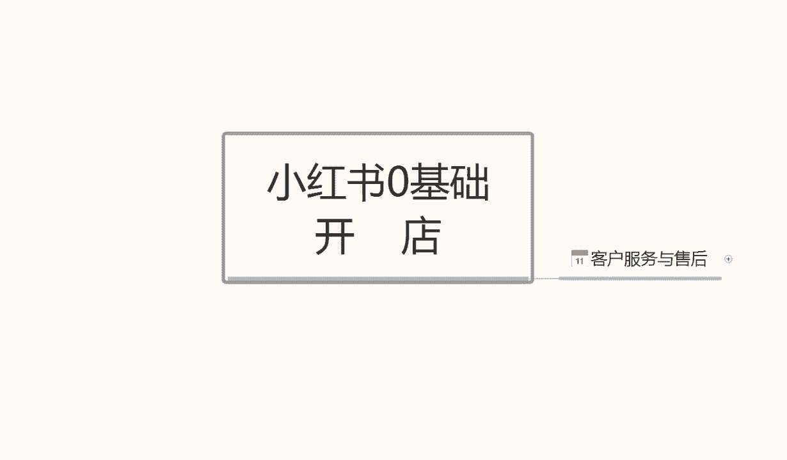
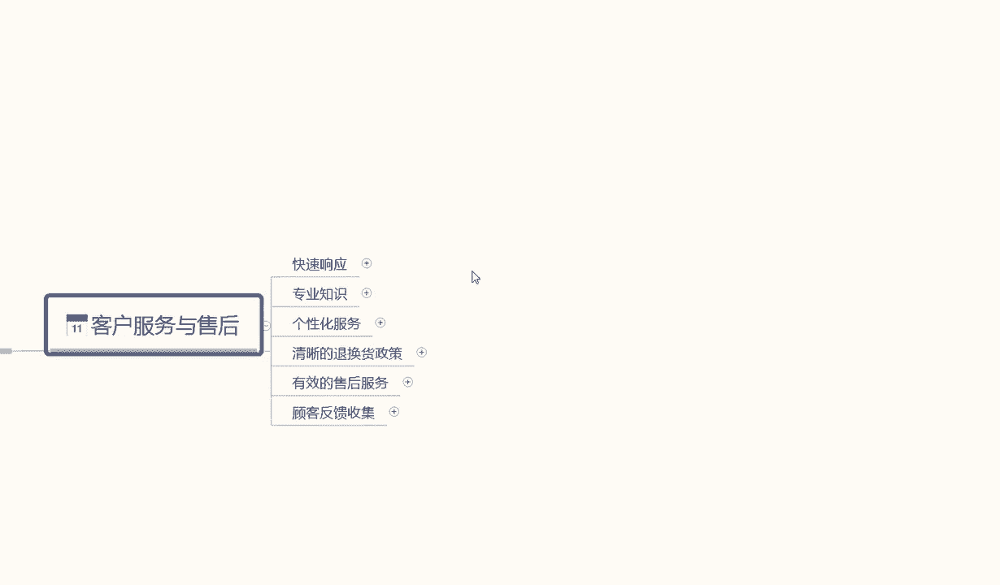
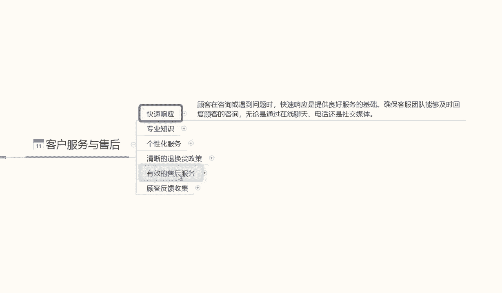
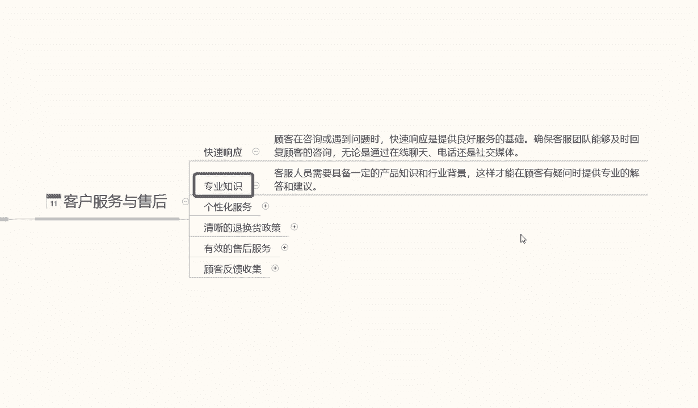
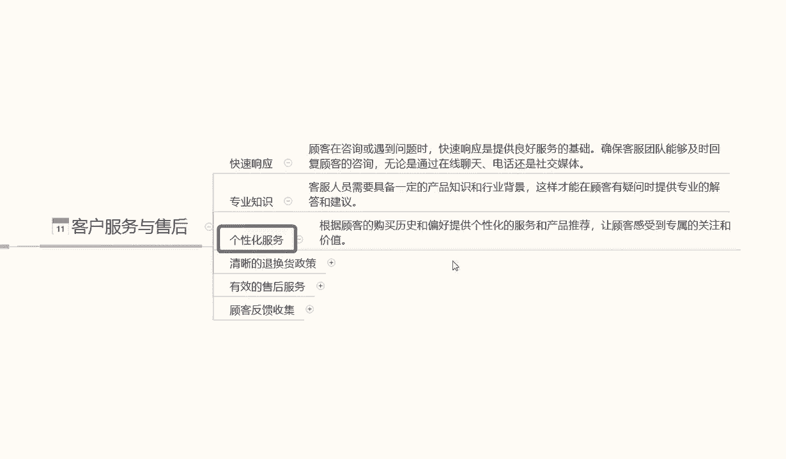
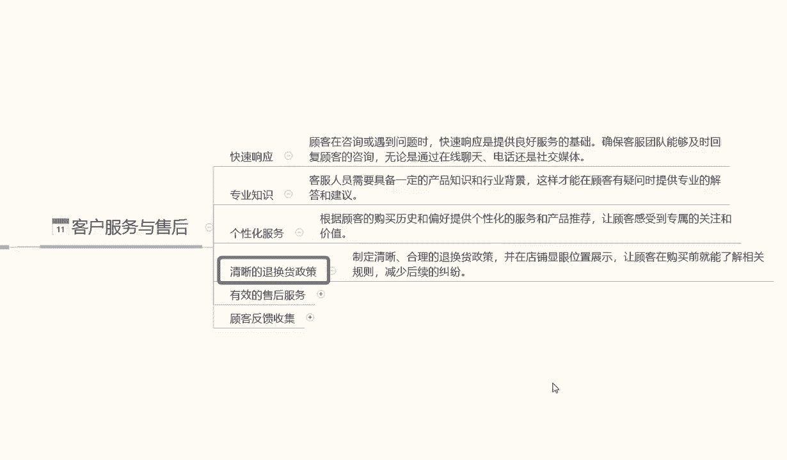
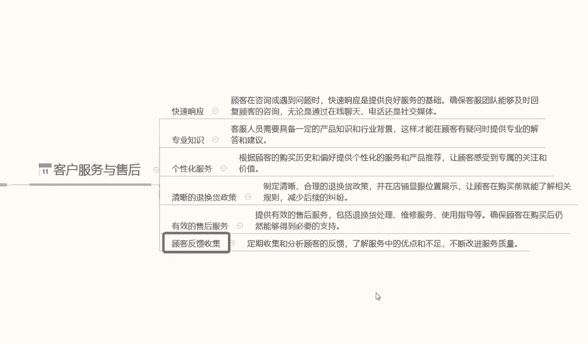
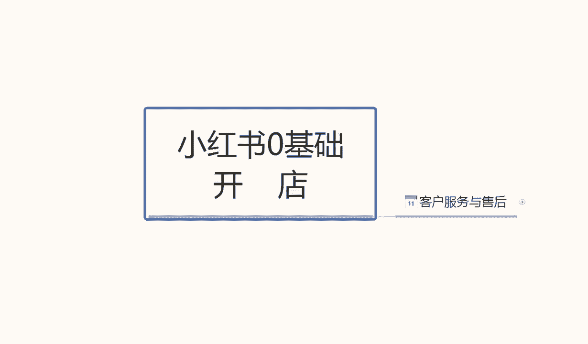

# 【150集精华教程】小红书运营新手起号 0-1新媒体运营必学课！不要荒废18-30岁，一切都还来得及 - P56：10.小红书客服和售后 - 剪_映教程7 - BV1Px2JYDEu9

大家好，今天给大家分享一个小红书，零基础开店的最后一节课啊，也是第11节课，客户的客户的一个服务啊，与售后，比如我们怎么去针对我们的一个售后，做一个修改和调整啊，我们小红书整个系统里面。

我们的这个售后客服啊，到底应该怎么去操作。

就是小红书的售后和客服的话，他对于其他的一个平台做对比的话，其实都是差不多啊，我们这个小红书客服的话，他这个里面的话主要是也是它的一个整体啊，小红书客服可能比其他平台还要严。

因为他本来这个小红书里面的人群，是比较刁钻的啊，而且是90%的女性，她整体的一个人群是比较刁钻的，所以说我们在做小红书的客服，服务与售后的时候，大家一定要注意啦啊，尽量是女性做售后。

而且打字的语气要温柔一点，不能挥霍，就是火气很大，我们去做这种的话，说实话，男性的一个沟通方式，和女性的沟通方式是不一样的，男性的沟通方式的话会比较简洁，你愿意买，需要什么，我给你讲解解决。

但是女性不一样，她会问很多东西啊，女性购买产品，她很少有那种直接购买的，她会用这个卡，比方说拿口红来说，是款式，口红色号，还有什么价格好不好用，能保持多久，嗯出去以后掉不掉色儿等等一些问题他都会啧。

唉在这个小红书里面他都会问的，问的一清二楚，你包括买衣服也是大小合不合适，我多少斤穿多少等等都是一样的啊，所以说是小红书里面的售后，客服还是比较难做的啊，它整体的一个嗯怎么说呢。

就说整体的一个素质在这个地方，不是说小红书里面的人员素质不好，他只是说人员购买货物，货物的一个购买行为习惯啊，但一定要注意这一点啊，那小红书售后的话，我们到底要注意什么呢，第一个呢响应速度，响应速度啊。

顾客在咨询或遇到问题时快速响应，提供良好的服务基础啊，确保团队，就是说确保我们的客服能够快速回复啊，无论是通过在线聊天也好，或者通过其他聊天也好，但是这个里面有一个点，我要给大家告诉大家啊。

小红出快速响应速度是3分钟以内，但是小红书你只要超过五秒钟不乐不回复，这边的客户，他基本上就不见了啊，就五秒钟一个反应时间，所以说我们设置小红书售后的里面，它有一个自动匹配。

就是自动搜索词的一个关键机器人，大家一定要有，这是第一个点，而且第二个点我们回复的话，就是说机器人反馈的话，可能给可以给我们节约20秒钟，到30秒钟的一个时间，但是30秒钟以后的话。

你的机器人的一个反馈回回馈问题的话，可能会就会比较慢啊，还是要人工客服去恢复的，所以说如果说订单多了以后的话，你的客服可能会忙不过来，那需要你们自己再去想办法再去解决了啊，前期的话不会出现这种问题啊。

前期的话只是说你无，但是前期你的一个机器人回复速度，没设置好的话，还是你人工客服去回复的话，一定要注意节奏，五秒钟以内必须回复别人，不然的话店里面的客户，你前面几个问题没回复好。

五秒钟以后他就消失不见了，你找都找不回来的啊，大家一定要注意了，快速响应系统是给了我们3分钟，但是我们最好在五秒钟以内就解决。

第二个是专业知识，像我刚刚刚给大家做的一个啊解释啊，你拿口红单单独的一个色号，颜色分类等等这些东西的话，你一定要了解你对你的产品不了解的话，你就说就去做这个东西的话，你自己不熟悉的东西。

你没办法跟他们解释，知道吧，当然了，你前面解释不通的话，后面慢慢熟悉了以后也可以，但是那个时候的话你的店铺就不好做了，你数据已经掉下去了，所以你要先你一定要先自己了解这产品，或者说你自己招的客服。

一定要先了解你的产品，然后去做推广啊，一定要把专业知识给做起来，因为小红书他这个里面的一些小饰品也好，小口红也好，小车内装饰也好啊，包括服装等等东西，你的专专业知识不多的，不不够的话。

你没办法啊去沟通，然后个性化服务啊，个性化化服务的话，这个是属于售后里面的，售后里面的个个性化服务，也就是一个包装，产品包装啊，产品包装的话，说实话这个里面嗯你包装好看一点。

那么你的客服客户反馈的一些信息，就说他给你的商品评价也好，包括你的那个售后服务态度也好啊，都会很高，但是如果说我们产品是小件，包装精美一点的那种的话，你们可以把它装在成本价里面去啊。

就是价格稍微拉高一点，把包装做好一点，对你也是一个不错的，如果说你就是那种服务众多包装的话，那你的个性化服务的话，你去想办法把他引流到其他地方吧，啊我只能这么说，看你们自己怎么去操作了好吧。

因为有些东西的话也不能说的，自己不是不能告诉大家啊，只是说不能说的太清晰好吧。

然后第四个点呢就是一个清晰的退换货策略啊，就是我之前给大家上课的时候，我也给就是说之前给大家做分享的时候，我也给大家说过啊，我们一定要有清晰的退换货政策，退换货政策这个东西的话，你不需要告诉客户啊。

你的退换货政策，是已经放在我们的详情里面了的，这个退换货政策是跟你自己自己说的啊，跟你自己客服说的啊，合理的退换货随便他退，千万不要给我们来差评，一个差评顶你20个好评，拉都拉不回来的那种哈。

所以说一定要清楚你的退换货的一个政策，他不喜欢就给他退了，很多人喜欢贪小便宜，你就给他退了，无所谓的啊，不要影影影响整体的一个销售情况，嗯他这种人毕竟是少数，但是你碰到了也恶心啊。

就说让让顾客在你这购买产品啊，了解相关的一个规定，能正常退就退，不能正常退，他有什么问题的，你就先反投诉他一波去啊，小红书对这个方面的话抓的还是比较严的，你反投诉他，把他的账号封掉就可以了啊。

所以说一定要有清晰的退换货政策，包括我之前给大家说的那个嗯，怎么说呢，就是说我们在神仙里面，最后做的那个退换或声明啊，也是有一定一定的效果作用的，你在和你的客户在跟别人聊的时候。

如果说对产品不喜欢也重复一下啊，下回他过来找事情的时候，你就拿着这个证据去找管理啊，投诉他就行好吧。

然后呢是有效的售后服务啊，其实就是我刚刚跟大家说的这个，看你怎么去沟通吧啊提供的有效，就是我刚跟大家说的，提供有效的售后服务，里面包括退货维修使用值等等啊，就是说你把产品商品的所有的利啊币啊。

都跟他说了以后，如果说他不喜欢他人要找你麻烦，但是你的商品又没问题，他买了以后又用过一段时间，已错过退货时间以后，你投诉他封他号啊，他给你的差评系统会自动给你算下下算出啊。

就是靠我们自己有效的一个售后服务去维护的，如果说你连这点技巧都没有的话，那你的店铺差评一多就不是很好做了，知道吧，一个差评要靠20个好评去维护，你想一下这个的概率比例有多大。

100个里面有五个差评能忍受，100个里面有七个差评，十个差评你就别人就忍受不了了，觉得你这东西不是什么好东西，我不买了就直接走了，所以大家一定要注意这一点啊，然后呢是最后一点啊，顾客的一个反馈收集。

反馈收集的话，说实话嗯，顾客反馈收集的话是对我们产品不满意，或者对我们这个整个产品的一个嗯优点和缺点，不足进行改进，这种人的话代表他对我们的产品还算是可以的，对比其他产品以后的话。

大家对我们的产品还是比较理解的，你就可以哎跟他们交流别的东西了，这些交流别的东西的话，我在这不明说，你们清楚的话，应该都是清楚的啊，怎么去交流，怎么去改进我们的产品，然后做二次服务，三次服四次服务。

他就相当于是你的粉丝了，就看你们自己怎么去搜集啊，怎么去做材料了好吧，这个呢就是客服与售后的一个操作技巧啊，和我们去个人需要注意的一些事项好吧。

那这一节课呢也就到这里，我们本期的一个课程小红书零基础开店的啊。

也就给大家基本上讲解完了，当大家了解这整个的一个课程内容以后的话，小红书我们前面基础做垫基础去操作，整个店铺的话就非常清晰明确啊，知道我们该怎么做，怎么操作啊，做什么样的产品，或者说是我有什么样的资源。

我怎么去做了啊，了解这些东西的话，我们再去搜所做小红书店铺的话。

