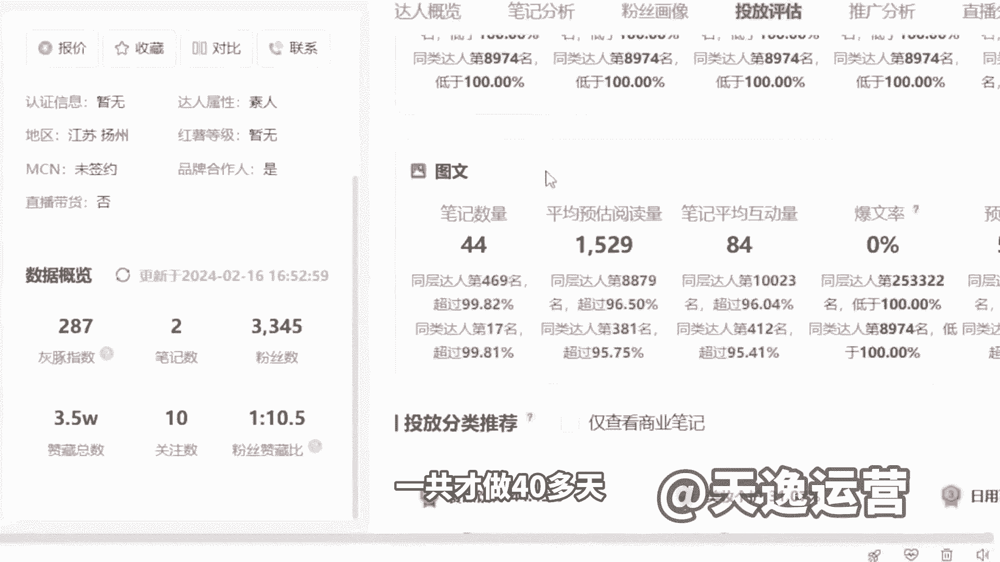
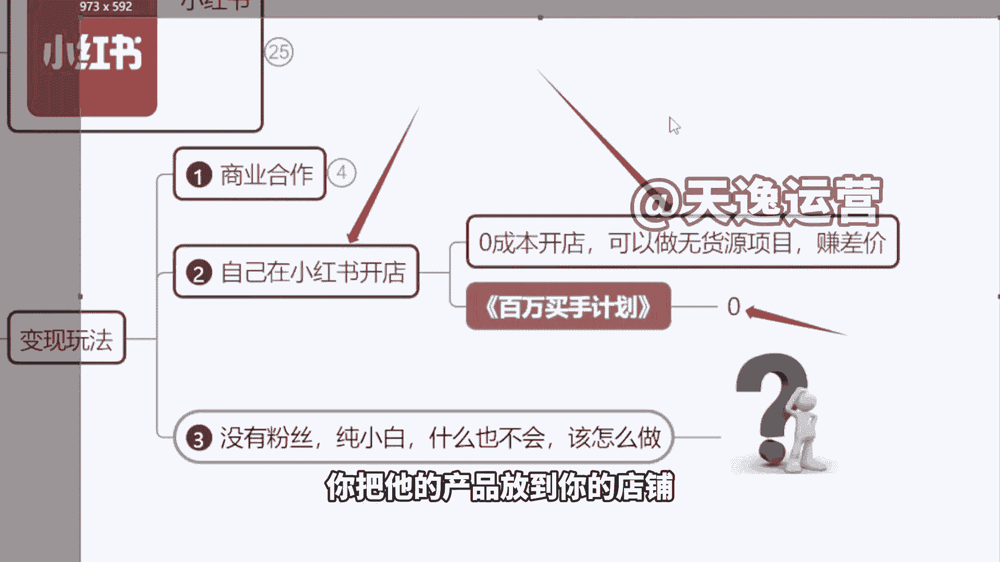
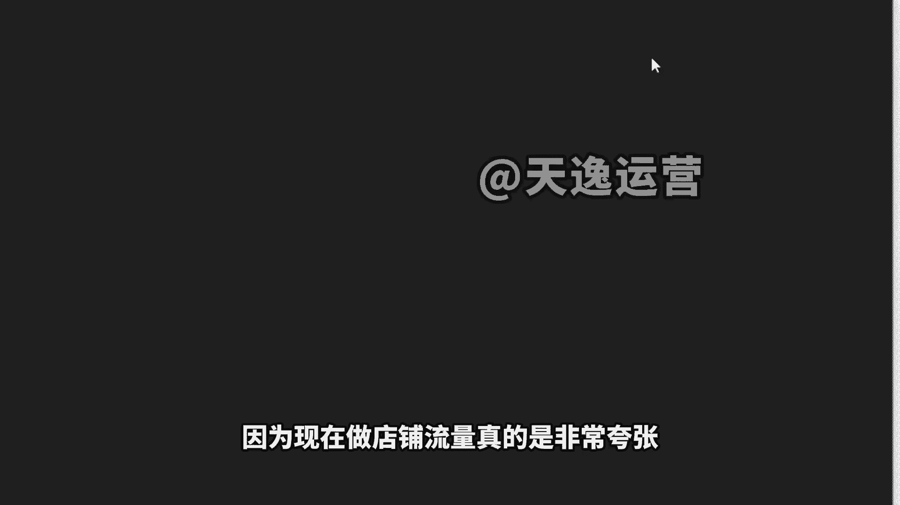
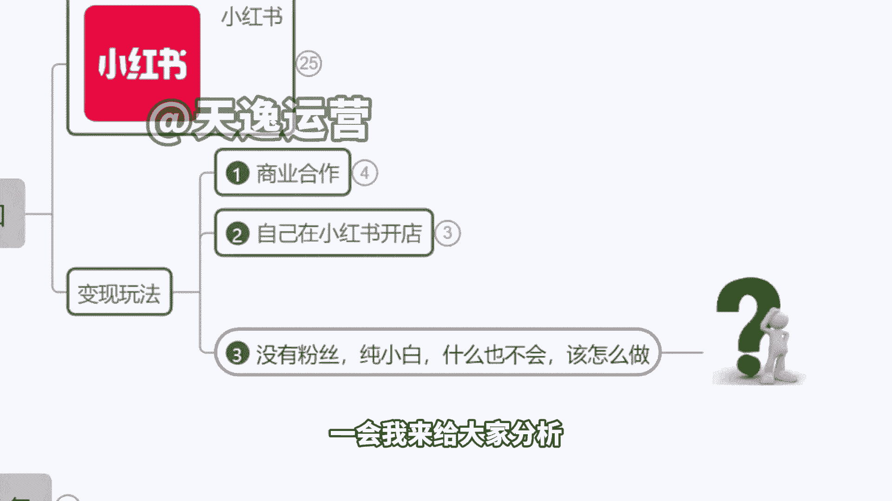

# 【150集精华教程】小红书运营新手起号 0-1新媒体运营必学课！不要荒废18-30岁，一切都还来得及 - P6：4、小红书的变现玩法 - 索尼娅图 - BV1ND42137bn

当然在这里也给大家解释一下，什么叫做接广告挣钱呢，对吧，我又不是网红，又不是明星老师，你跟我讲这个接广告它现实吗，来我们看这里啊，今天我们主要会讲的两个玩法，一个叫做商业合作。

一个叫做我们的这个开店带货，那么第一个商业合作啥意思呢，我不需要你有10万20万啊，我不需要你有什么知名度，你只需要有1000个粉丝好，来大家说我现在零粉丝，我没粉丝啊，待会上课，我教大家怎么去涨粉啊。

怎教你们怎么涨到1000粉来，当我们达到1000粉丝的时候，我们也能接广告，但是咱们接的广告不是10万20万的，我举个很简单的例子啊，你今天不是接什么海蓝之谜，sk two香奈儿的广告啊。

好比说有一个牙膏的品牌叫蓝天牌牙膏，我从来没听过不知名的品牌小品牌对吧，那现在他想要打开自己的知名度，想让更多人认识到自己的品品牌，他是花20万找一个网红给他做宣传，还是说我这样。

我就我就找那些1000来个粉丝的博主，我每个人给你300块钱，我能找100个人给我发，每人我就给你300块啊，因为反正你粉丝不多对吧，我就给你300，你也愿意发，然后呢你去帮我宣传一下我的牙膏一人。

我给三百一百个人去发，那这个时候用户每天登录到小红书，一打开蓝天牌牙膏，一打开蓝天牌牙膏哪个更划算，同学们哪个更划算，但我觉得300是很低很低单价的一个价格啊，随着我们粉丝的增长，2000粉3000粉。

4000粉，不同的粉丝阶段价格是不一样的，三百五百七百一千递增的啊，跟我们的粉丝数量是有关系的，那这个就是我们可以去接的广告，有好几个品牌是这么起来的，像那个呃分来这个来芬那个吹风机啊，现在抖音上很火。

也是这么推起来的，还有呢这个像那个叫什么w i is的面膜对吧，这些东西都是这么推来的啊，它实际上本身没有多少市场份额，都是靠推广的人越多，把这个知名度打起来了，来。

这个就是我们今天可以去做的一个方向啊，我给你们看一下啊，就这个东西，我们实实在在拿这个后台给大家去瞧一下啊，你看一下，像这个，我看这个账号3000多粉丝来支持我们一个哦，我看一下这个同学什么情况啊。

嗯在物流公司上班的个同学，他是做了40多天的一个账号，在小红书现在涨粉很快啊，然后你们看一下3000多的一个粉丝，对不对，3345个粉丝数啊，素人是不是没有签约任何公司未签约啊。

然后他的报价就是他接一条广告，二百四二百四啊，然后因为他的这里面的这个作品的话，他是这么想的，本身我跟他讲报价，你报三三百是完全可以的，他说想打价格战，他就想自己报的便宜点啊，这个商家呢优先找他。

所以说你看啊人家是一共接了就两个月以来，因为他没做多久，一共才做40多天。

两个月以来接了44条，44×240块钱的话。

大概是什么样的一个收益，今天我讲的这个玩法是真正落地，就是你们也能做的是二百四一条对吧，这个价格啊1万块钱左右，两个月以来啊，如果说是之前做，不会说挣钱那么快啊，但是因为现在是流量风口，平台的单子多。

然后平台的广告多，所以说机会多，然后这个是一个包括像这个，你看1500多粉丝的啊，这个同学是才做一个多月时间，辽宁沈阳素人，你看也是现在黄金时期做号对吧，未签约任何公司都是普通人。

直接咱们这可以看得到的啊，报价是300，这个比较实在，想多挣一点的对吧，借了29条来，29×300，29×300多少钱啊，差不多在8000块钱左右，是不是，那这个钱大家想不想挣这个钱，想不想挣。

对这个对这个项目感不感兴趣，感兴趣的话，一会我们在下面讲啊，我们在下个环节就来教大家怎么去做这个商单，我们去讲这个玩法，这是一个啊，然后这是我们今天会讲的，第一个他是有门槛，必须1000粉丝啊。

然后怎么去涨粉，一会说第二个玩法的话是我们去开店，刚才我们有个同学叫彩华，好像啊，他说呃老师我没有货怎么办，我们今天要教大家这个玩法，第一个你说我没有粉丝啊，没关系啊，开店是不需要粉丝的。

开店是不需要粉丝，零粉丝就可以啊，零粉丝就行，然后另外呢，因为现在平台它是有个百万的一个，买手扶持计划，只要我们开了店铺，平台自己会主动给咱们推流量，那么你先开店，然后再去发作品。

你的作品直接流量会比不开店的账号，流量要更大，完全不用担心播放量的问题啊，这是第一个，那么零粉丝我们就可以开店了，对不对，另外啊我没有钱去拿货，没有钱进货怎么办，不需要啊，我们可以做代发。

可以做无货源项目，就是我们去合作找产品，找到商家之后，由商家直接帮我们发货，你只需要把他的产品挂在你的店铺就行了，找人发货啊，你把他的产品放到你的店铺，相当于说代发的形式。

这个我们在后面也具体来讲啊，因为现在做店铺流量真的是非常夸张。

给大家看一下，这个是我们之前呃在这个中信银行做销售经理，就是推销信用卡的，然后他当时在做的时候，其实不算是最好的时机啊，因为这个是年前开始做的一个账号，他当时扶持不算多。

他是在这几个月开始这个店铺才慢慢起来的啊，然后你们可以看一下，他那个时候的一个单日支付金额，4554元，就是一天的，这个不是一个月啊，这是一天，然后呢昨日全天8000多的一个成交金额。

我们算他50%利润来讲，最起码是2000块钱左右的利润，对不对啊，所以大家做三个月的话呢，现在店铺单月的一个销售销售额是10万左右了，额达到10万级别的一个店铺了啊，你们到时候如果说去开店铺的话。

因为有这个百万买手计划，达到10万销售额，平台直接给你发现金奖励，达到20万，30万，50万一样的平台直接现金奖励给大家啊，那我们如果说对这些感兴趣的话，具体怎么来操作，我们现在来讲啊。

好我们有赵怡慧同学说我发布的很少，点击率，几乎没人，一会我来给大家分析啊。

我们现在作为没有粉丝纯小白。