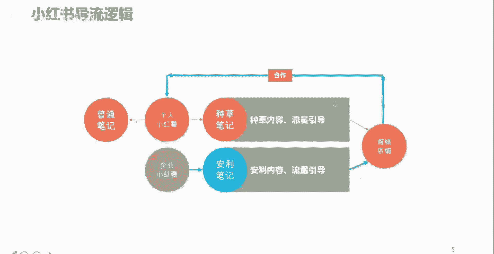
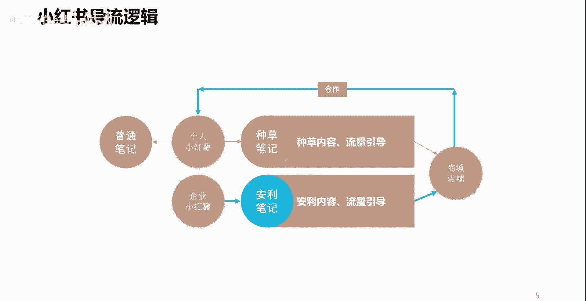
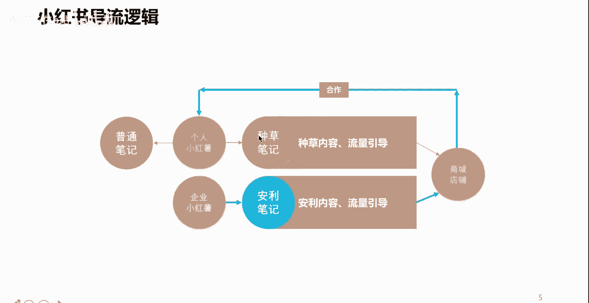
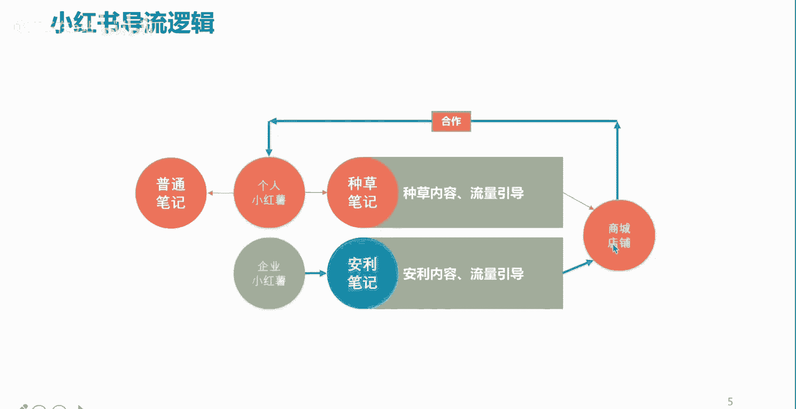
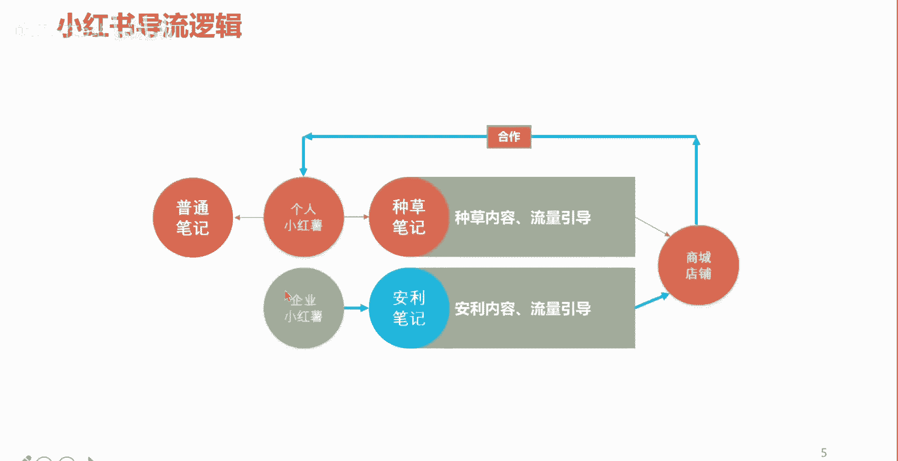
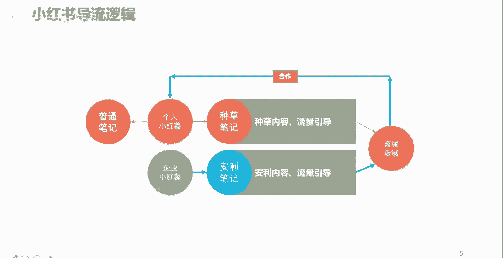
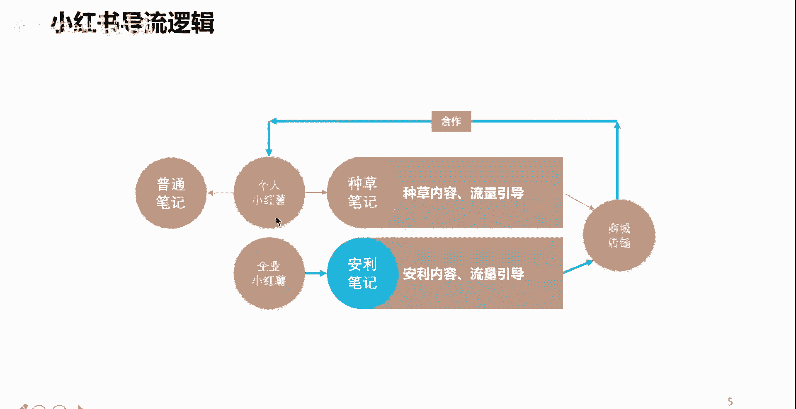
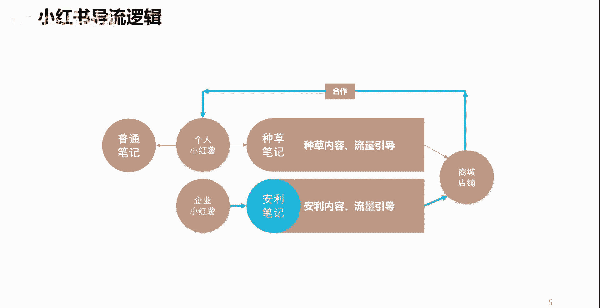

# 【150集精华教程】小红书运营新手起号 0-1新媒体运营必学课！不要荒废18-30岁，一切都还来得及 - P6：P4小红书的导流营销逻辑 - 熊孩子在b站 - BV1hw4m1X7aw

好，那么我们先简单的了解一下，小红书的一个什么呢。

导流的一个逻辑，我们看一下我们在小红书上面呢。

把一个个人呢我们把它叫做小红书是吧。

当然了，企业也可以叫小红书啊，我们做一个个人的一个小红书用户。

我们可以去分享一些内容，那么在小红书上面呢这个内容呢它叫做笔记啊。

叫做笔记。

为什么叫笔记呢，你想想第一个小红书呢。

希望自己的这样一些用户呢，能够持续性的啊去创作一些什么呢。

商品或者是一些购物的一些体验。

一些分享，所以呢你每一次购买一些东西，或者看到一些好物啊，或者是体验到了一些好的商品，你是不是要记录啊。

是不是要分享呀，所以呢这个呢他就把这个教程了一个笔记。

那么个人小红薯啊，个人小红薯呢它可以做。

比如说我可以针对于某一个商家的产品。

针对于某一个单品，或者是针对于某一系列的产品商品。

我可以去进行一个什么呢分享啊。

比如说我买了一件上衣，这件上衣穿上去之后呢。

哎显白显瘦，材质也好，面料也舒服，款式呢颜色百搭对吧。

那么像这种衣服买回来之后呢。

我觉得挺不错的，诶我就可以通过小红书去进行一个分享啊。

让更多的人看到这个笔记之后呢，可以呢去关注我买的这个商品。

诶这个商品真不错哈，哎在哪买的呢。

我也去看一下是吧，哎就可以起到这样一个作用。

那么这样的流量就很容易来了对吧，他通过这个笔记呢相当于就是在辐射哎。

对这方面感兴趣的一个人。

然后呢去到什么呢，看到商家的这样一个商品。

甚至说什么呢，去到商家的这个店铺或者商场里头，然后呢进而产生销售，同样如果是一个个人小红薯做这种内容。

做的非常的优秀啊，做得很好啊。

也会被一些商家的主动性的关注到啊，进而去做一些合作啊。

比如说我是一个做美妆的一个小红薯。

我做的内容呢被一些商家呢看到了，这些商家呢还认为我的小红书这个美妆的笔记。

内容呢写的还算是有质量。

再加上呢这些商家呢。

它本身呢它也是做这种什么呢美妆个护类的，所以呢他可能就会跟我进行一个合作类的沟通。

那么这样呢也会产生一种什么呢。

个人创作的一种变现。

当然了，在小红书上面呢还有另外一种身份，另外一种性质的一个账号啊。

这也是常见的第二种。

第一种是个人，第二种就是企业类的小红薯啊，企业类。

那么企业另类呢，一般情况下呢是针对于自己的一些商品呢。

可以去进行一些推荐介绍啊，或者是我们用个网络词啊。

就是安利给你啊。

那么这样一些内容呢就是什么呢，企业呢可以通过这样一个平台呢。

像我们的用户啊，向企业的目标消费者去进行一个商品的一些。

什么呢利好或者是什么呢。

一些优点价值点的一些释放，从而让自己的目标用户哎。

目标消费者呢哎能够看到这个内容。

看到这个内容之后呢，会对自己的产品呢产生一定的什么呢。

兴趣或者欲望，从而呢我们能够把这些目标用户。

目标消费者呢导流到企业自己的店铺。

或者是商城当中，就让人产生销售啊。

当然我这呢还写了一种有的个人小红书呢。

他做这个内容，他不为带货。

也不指望着什么合作，可能他就是纯粹的把小红薯呢啊。

把把小红书呢当成了一个什么呢，当成了一个自己记录或者是分享的一个平台啊。

每次去写一些普通的一些笔记啊。

去写一写，分享一下，或者说有的人呢，把小红书当成一个自媒体在做啊。

这种情况呢也是有的。

我们也是经常能看到，但是从专业的角度呢，我们应该发挥小红书本质的一个最根本的价值。

就是通过不管是个人还是企业的账号。

去通过内容创造流量。

将流量进行一个什么呢合理的转化啊。

也就是不管是个人还是企业，通过这个平台呢可以实现变现营收。

那么这个呢就是小红书最根本的一个。

导流的一个逻辑啊，好那么讲到现在呢。

其实呢整体上呢先给大家讲一下，小红书啊是一个什么样的一个情况。

是一个什么样的一个平台，希望很多人呢要正视这个平台啊。

也是一个非常不错的一个平台啊。

