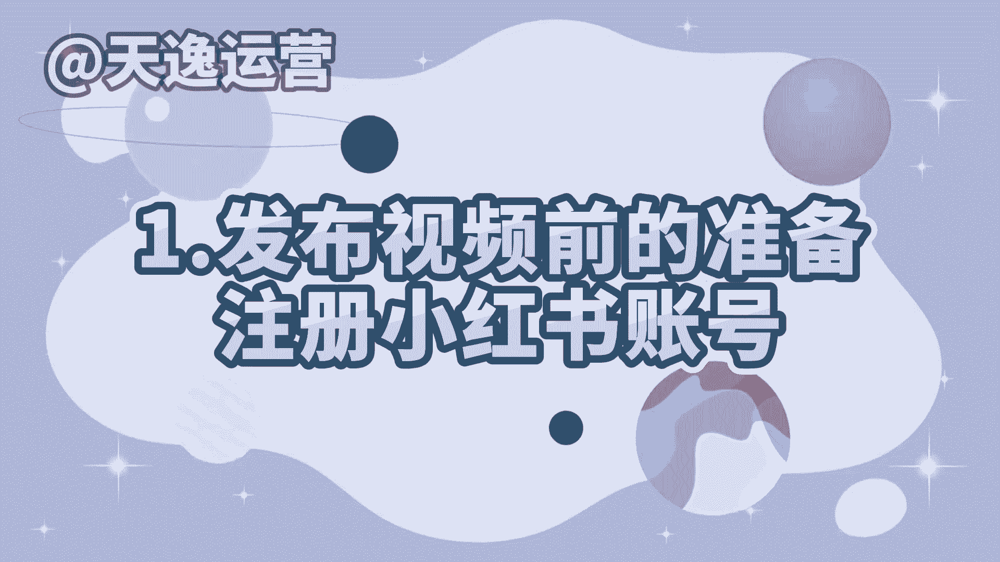
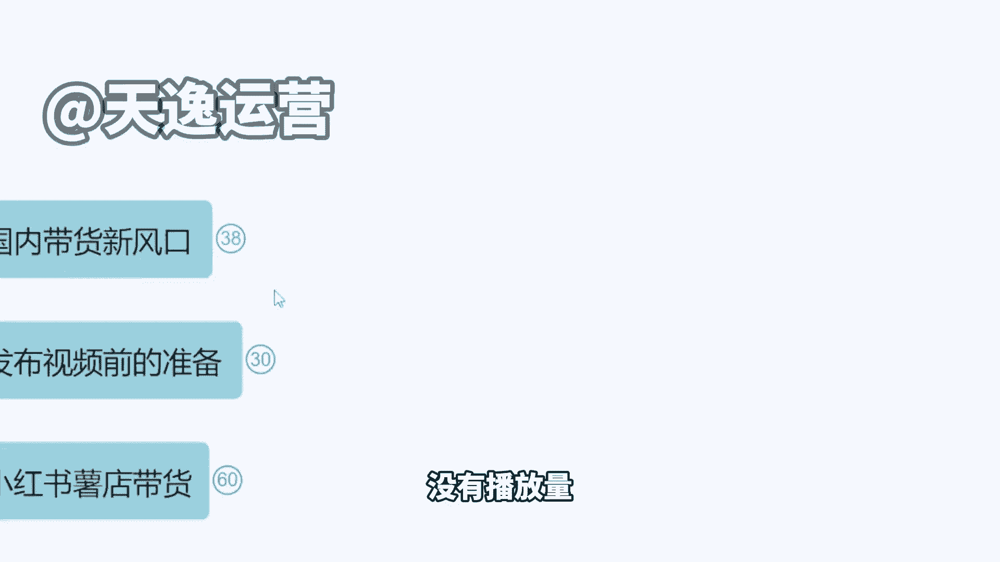
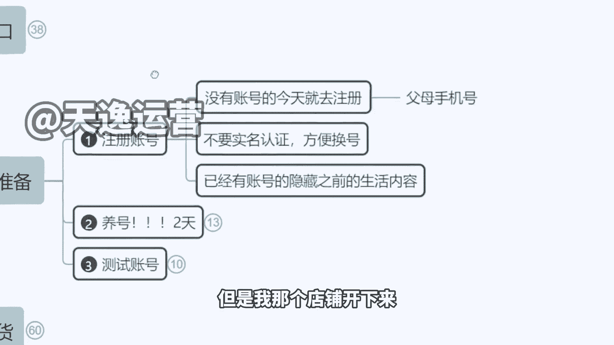
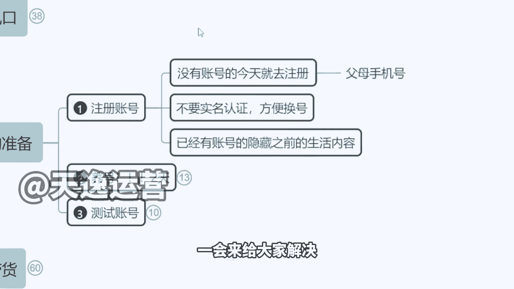
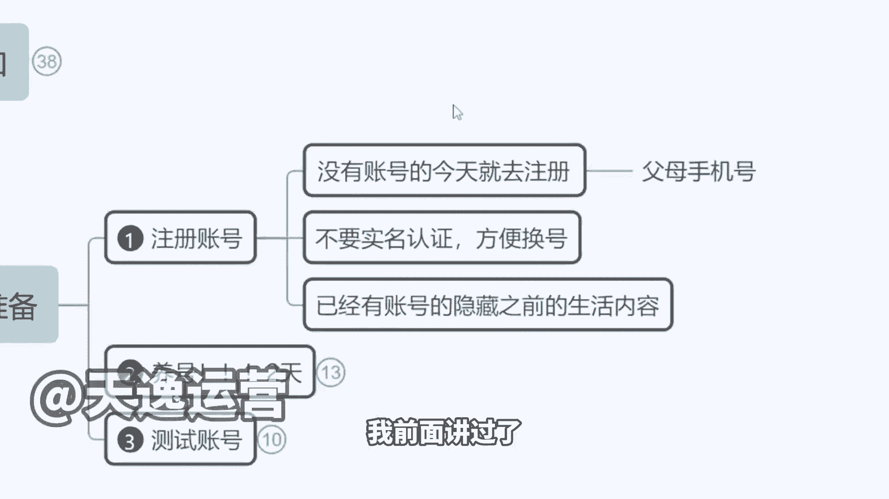
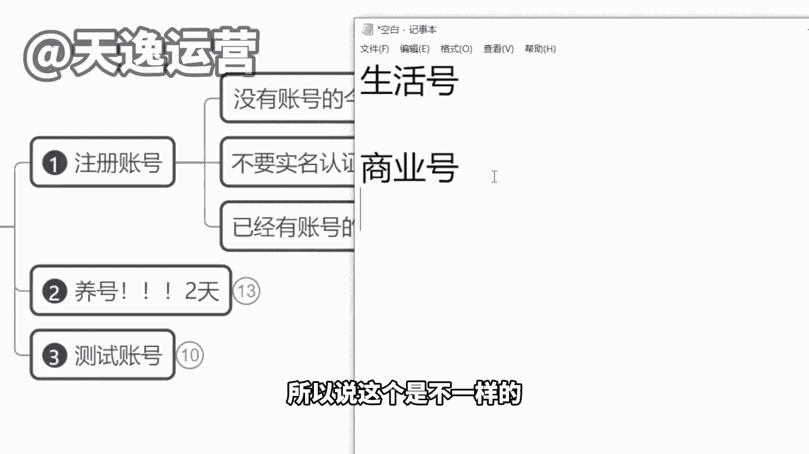

# 【150集精华教程】小红书运营新手起号 0-1新媒体运营必学课！不要荒废18-30岁，一切都还来得及 - P7：1.发布视频前的准备，注册小红书账号 - 索尼娅图 - BV1ND42137bn

我接下来把没有流量，没有播放量。

包括像甚至有同学说，老师我自己也去申请店铺了，但是我那个店铺开下来。

我店铺连人都不进啊，一天几十个流量的，特别可怕的啊，不知道该怎么办了对吧，我一会给你们来分析啊，一会来给大家解决。

我们先讲第一个发布视频前的准备啊，我们先把这个注册账号的问题说了，我前面讲过了。

小红书上春晚了，他现在已经是让全国的人民在下载小红书，去使用小红书在打这个广告了，那么我跟大家讲，不仅是你们啊，现在绝对有很多公司，很多电商公司都瞄准了小红书这个风口了，想要去批量注册账号了。

那么所以说我建议大家，如果你想在这个平台多挣钱啊，你可以去联系你的父母，把父母的账号都拿来一起用，有亲戚的拿过来一起用，你不要说我只做一个号，做一个号收入有限啊，你多做号收入是叠加的。

所以说趁这个黄金时间赶紧把账号做起来，就跟抖音当时一样啊，做得早的呃是吧，草根都挣钱了，做的晚的你再厉害，没有办法，竞争太大了，蛋糕就那么多啊，不管你是男性还是女性，都是OK的啊，来那么我建议大家。

我们如果说还没有注册账号的，先暂时不要实名，为什么我跟大家说一下，有一点你们必须要接受，就是我们在做小红书的时候，他的起号是有概率的，比如说你注册了五个账号，对不对啊，我就我就不算他五个账号。

比如说我第一个账号啊，我就一个账号，然后你这个账号是不是百分百能挣钱，不不一定，你这个作品也许发的很好，很优质，但就是没有流量，那怎么办，这个号可以不要了，如果我们等了两天三天，播放量没有起色。

直接注销啊，拿你这个手机号，隔天再注册一个新的账号，你也许你不断的注销再注册，不断注销再注册，差不多最多啊就五个左右，你肯定是能测出一个有流量的一个账号的，明白吧，因为这个东西是有概率问题的。

现在注册小数人太多了，平台的审核很严格，然后他是随机去推流量的，他不可能说每一个这个发作品人，我都给你推送啊，所以说他会有概率啊，那么为什么我建议大家五个账号一起做，这也是概率问题啊。

五个账号里面最起码起来两个三个，对不对，好，剩下时间我再去测新号，就是这样的啊，所以说呢最好不要实名啊，因为你实名的话，要隔天才能注册新号，但不实名呢，你当天注销，当天又能注册新的账号。

直到我们测出一个有流量的账号为止啊，然后呃，包括像我们之前有很多同学是已经发过作品的，有没有发过作品的啊，你不管是这个变现作品还是什么其他的，自己的自拍啊，旅游啊，自己的小孩啊，通通隐藏掉啊。

我跟大家讲，你的账号千万不要删除任何一个作品，不要删任何一个作品，因为删了之后你的账号健康会受到影响，那么我们账号它其实分为两个属性，一个叫生活号，一个叫做商业号啊，今天我在课题图里面我也写了。

我们要做商业号，有价商业价值的删过怎么办，先发几个作品，到时候测下流量，如果流量不行，我们就注销啊，来跟大家讲一下生活号什么意思，就是你平时发的这个生活的内容比较多，那平台会直接认为你是一个用户。

就是你是一个客户，你是用户的这个角度，那么你的作品发出去，你发的再好，他只是给你推身边的人，或者说同城的人很难往外推啊，你的播放量是受限的，那么商业号不一样，商业号的推送是整个平台普遍去推。

直接推荐页里面去推。

