# 【150集精华教程】小红书运营新手起号 0-1新媒体运营必学课！不要荒废18-30岁，一切都还来得及 - P9：3.测试小红书账号 - 索尼娅图 - BV1ND42137bn

有些人想说，老师我这个没有作品都有粉丝，那属于平台，有的时候估计别人刷粉啊，他那个错乱东西关注到你那里去了，这个很正常嗯，我们很多这个新号刚注册完，隔天啊，这个连浏览作品都没浏览。

直接上来十几个粉丝都有这种情况啊，但这个粉丝是没有用的，就是我们的粉丝平台，在后台识别你的粉丝的时候，他只会识别通过你作品关注你的粉丝，其他都是不作数的，就比如说你2000个粉丝。

有效粉丝可能只有1700，是这样的啊，好那么我们怎么去测试这个账号，来给大家看一下啊，我们之后在养号完毕之后对吧，然后完了以后啊，然后我们先发一篇作品，这个作品的话呢文字编辑好啊，认真去写。

然后图片呢我们真正准备好，然后去发呃，不过在这里呢我要强调一点，不管我们之后做什么账号啊，你上来的前两个作品，你不能直接表明自己是个卖家的身份，就像刚才我们看到那个卖手机壳的作品一样。

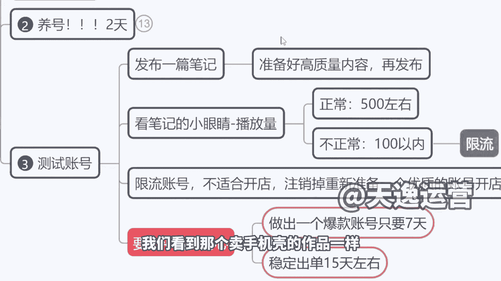

你要写的文案是这个东西是你买的啊。

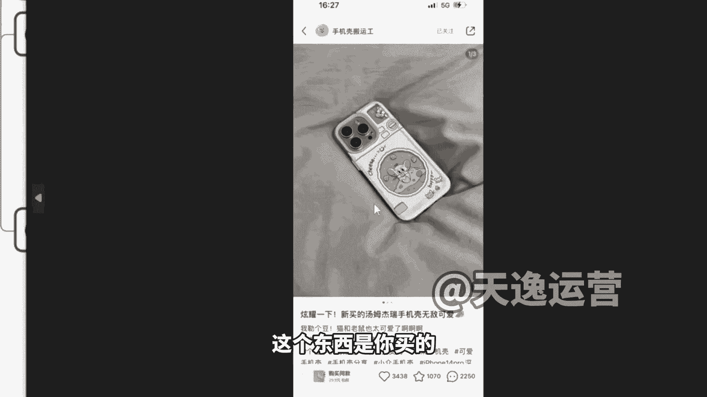

我买来的产品跟大家分享，我用的好用的东西，我来跟大家分享啊，你不能直接去发说啊，今天给大家分享一个手机壳啊，这个是我自己在卖的什么九块九，这个不能去这样做啊，前两个作品不要挂小黄车。

前两个作品只从分享者的角度去分享东西，不挂车，然后测完流量之后，流量没问题。

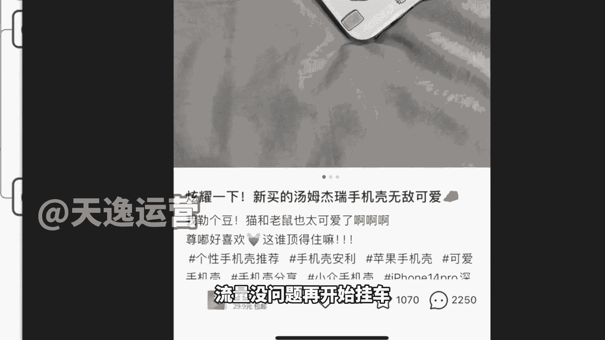

再开始挂车啊，来那么在这里给大家看一下啊，就是当我们在发了这个测试的作品之后，你等两个小时时间，两个小时过去了，如果说你的播放量在500左右，或者说更高一千两千，那很好，这个播放量算很正常。

说明你的账号是正常有推流的，但如果说两个小时过去了，我们的小眼睛啊，100来个，70个，80个呃，一一百七一百八都属于限流状态，都属于平台没有给你推流啊，因为我们看到的这个100来个流量。

他不是说真的有那么多人看了你的作品啊，很多时候是安慰性的一个数字，就是平台为了告诉你说啊，你这个作品是有人看的，安慰性给你镶了几个数字，不是真的有那么多人看，所以说这个时候。

我们的号都是属于限流的一个状态，就像我刚刚讲的号又不要钱，注销了，再重新注册就可以了啊，这个东西因为小红书去测号的话，抖音的话可能你还得测两三个月呢啊，但是小红书的话呢，它是属于说做一个爆款账号。

需要七天左右时间啊，稳定出单的话，最起码15天左右的时间，15天左右的时间啊，来，那么同时呢我们在测了这个账号以后啊，我们发现你发的两个三个作品的播放量，都比较稳定的情况下，那你可以尝试去开店。

但是如果说我们发的两个三个作品，都是在100来个播放量啊，那这个时候我们就可以直接注销，然后再去注册新的这个账号了啊，然后呃因为是这样的，我们今天是两个直播间开课啊，所以说公屏评论区可能问题会有点多。

我不能说一一去回答，但是我拿个别也跟大家做个讲解，呃，像刚才有同学讲到，说老师我有的是100多播放量，有的是一两千，这是什么情况呢，呃包括像有同学讲说，老师我的播放量全部都在100多。

但是我还在坚持发啊，呃这种情况的话来这样啊，同学们如果说对自己的账号不是很确定的，我们可以下了课，把你的账号主页以截图的方式，然后发给你推课堂链接的那个助理老师，我们的老师都很专业。

下了课给大家逐个去分析一下好不好，看看你们的这个账号到底适不适合做，要不要注销，还是说可以继续做啊，你们可以下了课给助理老师发一下啊，但如果说你的播放量高，发的是生活类内容，就比如说是你自己的自拍。

是你出去吃了一个好的餐厅，那个播放量再高都不行啊，再高都不行，因为那是属于生活流量，我们要的是商业流量好，OK这个我们就过掉了啊，然后我给大家看一个，我们之前一个学生做的一个号吧，跟大家讲一下啊。

为什么人人家的号能起得来，包括他之前为啥没流量啊，跟你们分析一下呃，我这个学生叫李继平，然后他是属于40多岁一个年纪没有做过抖音，没有做过小红书，就任何短视频平台没有接触过的啊。

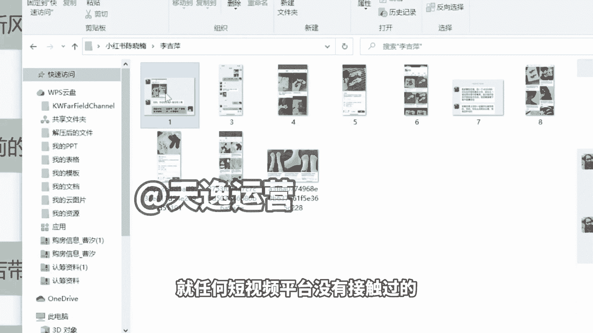

但是他的这个号现在能稳定就一个月变现，最起码在1万以上啊，给你们讲一下他的这个情况，他之前的这个作品，如果说有同学，你现在发作品没有流量，你也可以考虑一下，就是跟你的发的内容其实也会有关系，他是什么。

他内容实在是不好啊，因为这个审美是有问题的，当时我跟他有讲过，我说小红书的用户，其实更多是这种对生活品质有要求的啊。

审美有一定要求的用户，所以说如果他去卖这个发卡是可以的，但是他去卖这种图案的发卡就不是很合适啊，就是不怎么好看，另外他找的这个素材拍得很随意是吧，没有什么呃稍微好看点的这个配色呀，地上就是地板。

你要知道啊，我跟大家说一点啊。

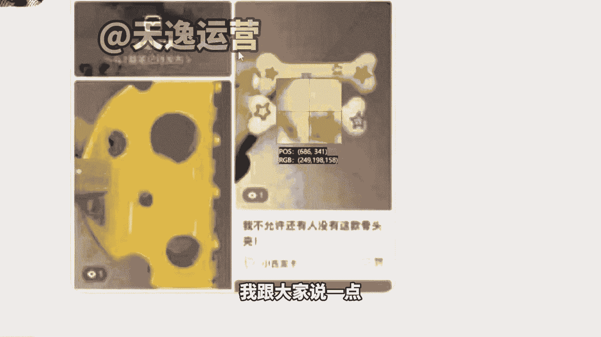

就他这个图，他这个视频当时发的，你看一个播放量是不是非常非常少，地上很脏啊，地上还有那种掉的头发，没有拖地那种脏的。

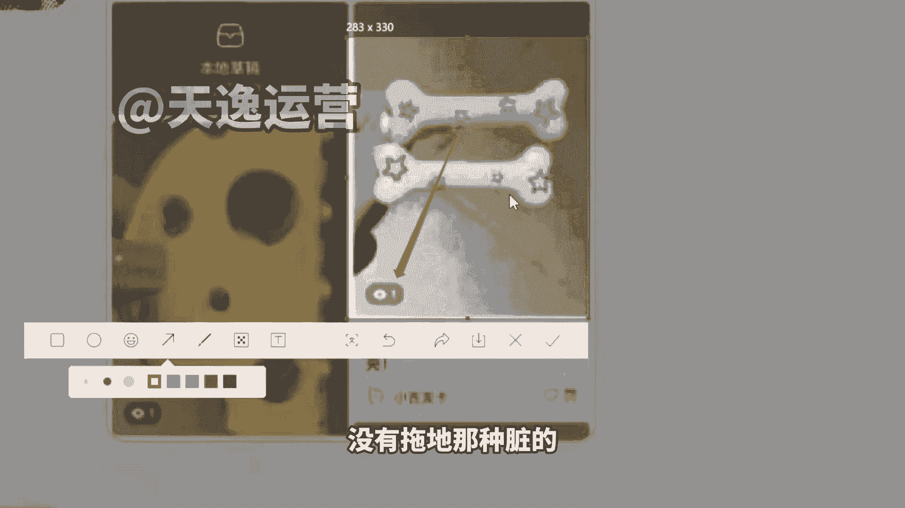

你说这种作品发出去之后能有人看吗，没有我就跟他讲了，我说啊，但是我安慰我，没有直说委婉一点啊，我说先养号吧啊先养号，到时候再发，换一个号再发这个作品，因为这个作品实在是限流，连人家连十几20几都没有。

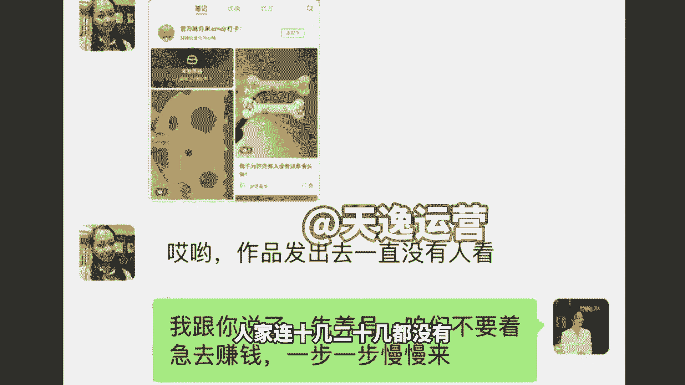

他就是一的播放量，然后后来让他换了以后，我跟他选了什么，我让他，我说你去做那种y two k的风格。

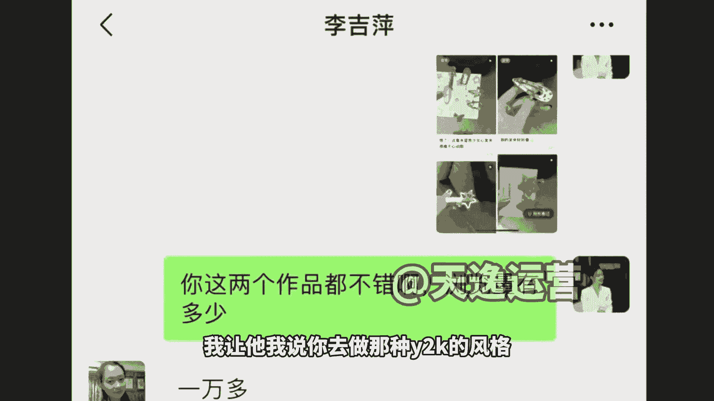

就比如说这种很精致的发型，来看一下这种风格是吧，银色的布灵，布灵的带带点小钻的这种发卡好，这些精致女孩她更喜欢，而且当时流行的一个元素叫y two k的一个风格，我说你换这些产品好，效果立马不一样。

是不是同样是手拿这个产品，然后但是呢因为这个产品的颜值更高，它的效果就更好啊，当然这个素材也不是他自己拍的啊，都是找这个品牌方去拿的来，你看一下当时他13天时间换了产品之后。

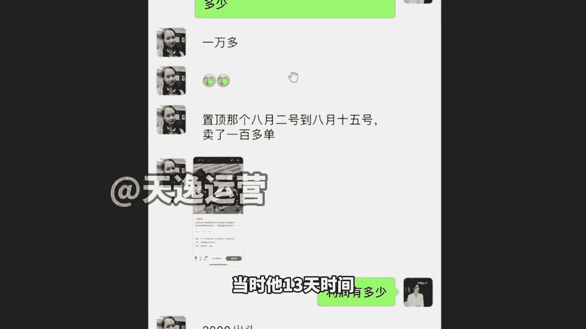

13天时间立马100多单啊，100多单那个订单这个脸啊。

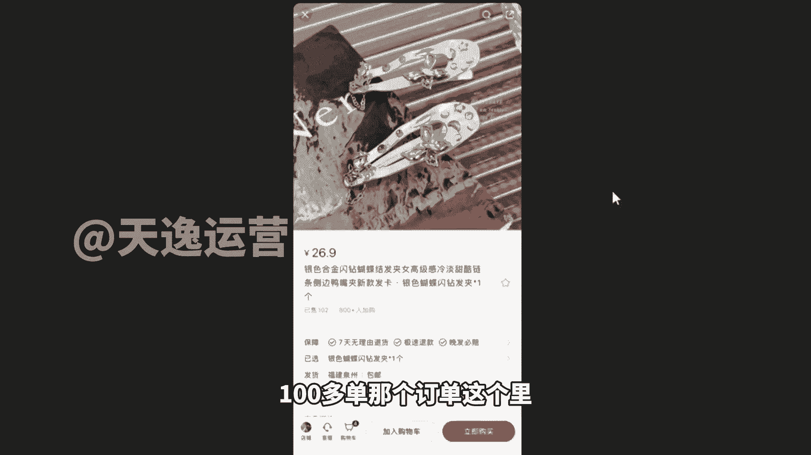

给大家看一下26块九的一个价格是吧，卖了102单十几天的一个时间啊，那这个产品是怎么来的，然后包括这个产品拿货价多少钱，我也给你们看一下啊。

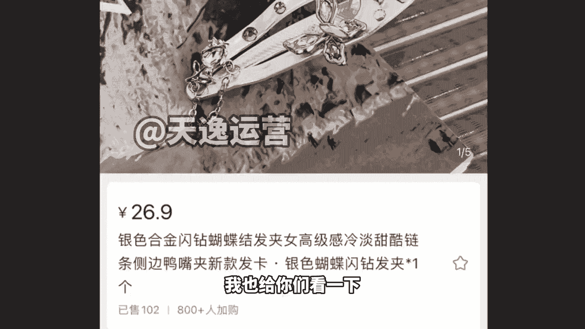

像我们刚刚有同学说到说啊，老师这个货啊，怎么办啊等等的，我这里呢先简单给大家说一下，然后在后面我们讲带货的环节，我再详细说流程啊，首先第一个我们的货源问题，我推荐大家两个平台，一个是1688。

一个是拼多多，但是呢我更建议后者，就是我更建议大家未来去找拼多多去合作，因为1688，现在他的所有的产品呢是有点过时的，就他已经不更新了，拼多多里面本身是一个打价格战的平台，所以说它很多那个产品。

已经接近这个拿货价格了啊，所以说到时候我们可以在拼多多干嘛，去找工厂店，找工厂店，然后并不是说要你们在拼多多里面下单啊，我下单一个，然后联系那个小红书发货，不是，而是你找到工厂店之后去加那个商家的微信。

然后跟商家去说啊，说我这个呃想跟您合作，我想做代发，然后我想卖你这边的货，可不可以，一定是可以的啊，工厂店本身他们就是做代发的，然后给大家看一下啊，就是我们之后先确定好自己要做的一个类型。

后面我详细说啊，现在我不讲不讲那么细。

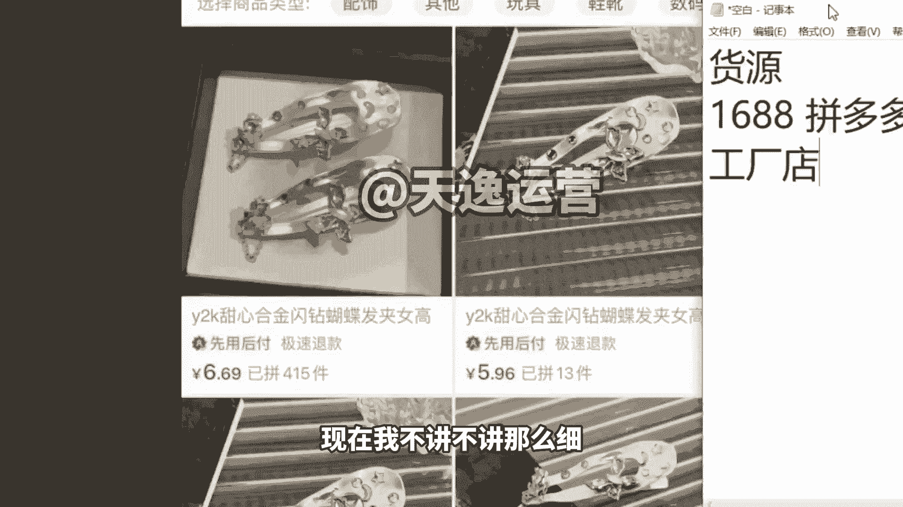

我先把大概的给你们先讲一下，让大家心里有数，然后那么我没有钱拿货怎么办，对不对，你不要去跟商家说啊，你说啊老板我没钱拿货，怎么怎么地，你不能这么抢，人家一听都不敢把货拿给你，你怎么说。

你说因为我这边开店开的比较多啊，我是做矩阵的，我是做批量的，所以说我们现金流啊没有那么多，先跟您签个协议吧啊签个什么协议，先财后富的协议，这个拼多多里面他都支持这个方式啊，这个叫先用后付。

但是咱们签协议呢叫先踩后富，啥意思，就是我跟你签订好多长时间来结款，比如说15天或20天对吧，那么我先把你的产品挂到我店里上去卖，我卖了一单，你这边给我发货，让你们的财务记好我的成本是多少钱。

等15天到了20天，时间一到，我就把钱打给你，那这个时候你的客户也确认收货，你也收到钱了，你就不会存在说我没钱去付货款的问题了，这个大家能不能听懂，这个都直接是在线上签电子合同。

直接电子协议有法律保障的啊，谁都逃不掉的，那这样的话我们前期就不需要去投资钱啊，这个对于新手来讲就比较友好了，对不对啊，然后像我们当时这个同学的话，他就找到左边那个商家，这里面卖的是六块六毛九。

但他合作价格啊，私下沟通的价格是五块九包邮啊，这个是包邮的啊。

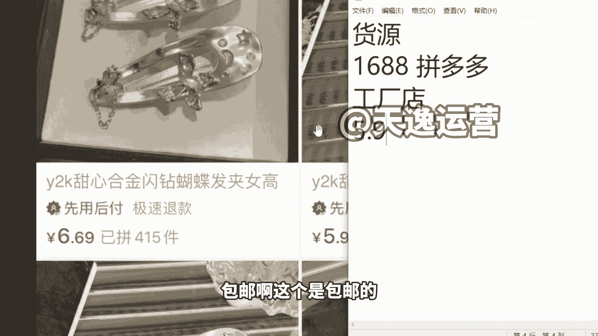

因为本身这个工厂价格很便宜，那你看它一个的价格是多少钱，一个的利润多少钱，21块钱的利润啊，然后再乘以多少钱，再乘以这个呃，102个订单，相当于说他这个是2000以上的一个收益，对不对。

2000以上的收益啊。

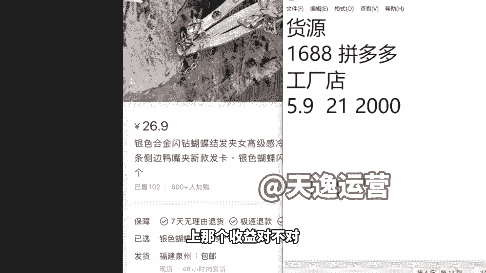

就光这一个产品的收益就还不错了，然后他当时第一个月的时候就挣了8000多块钱。

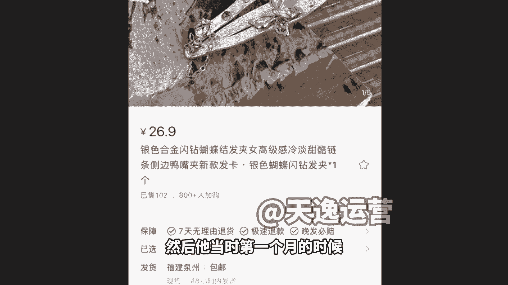

就是做带货啊，他后面他因为他不止做这做这一个项目啊，之前也跟我讲，你看他以前是在图书馆里面做管理员，后来因为他帮呃帮着他女儿带孙女啊，然后呢他孙女经常生病，然后他老请假就被辞退了。

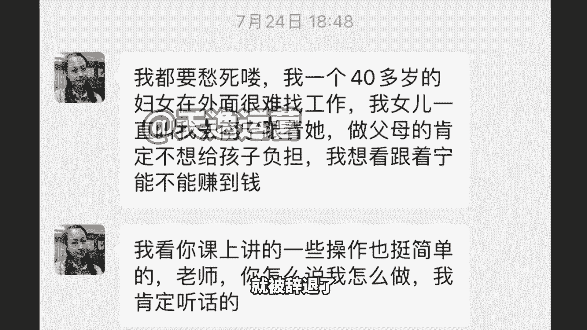

本身收入其实也不高，就2000多块钱一个月，还想着说干脆在家找点事情做啊，然后你看现在人家卖的啊。

这不是现在啊，也之前的，你看这个发卡不同款式都在卖嘛，对不对，19块九八十九单啊，28块八，135单，24块五是吧，25单就这种几十单，几十单，其实它的一个利润加在一块也不低了。

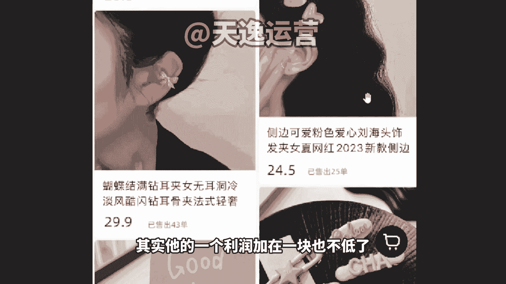

然后他在第二个月的时候就已经上了1万4的，一个收入啊，现在还租了一套在卖袜子的啊。

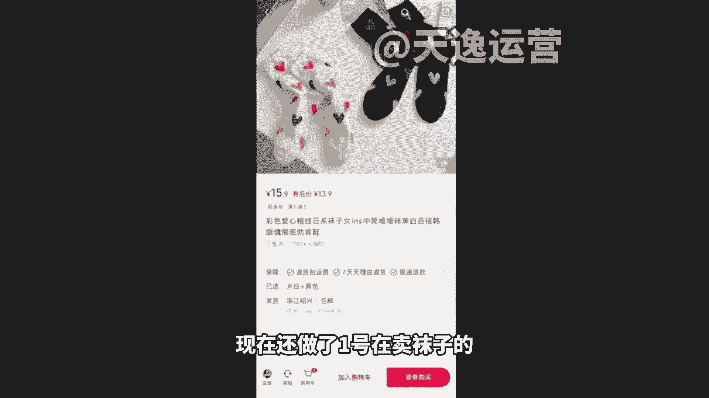

就这种，然后你们之后都是可以去走这个方向，因为开店铺我说实话他是最挣钱的。

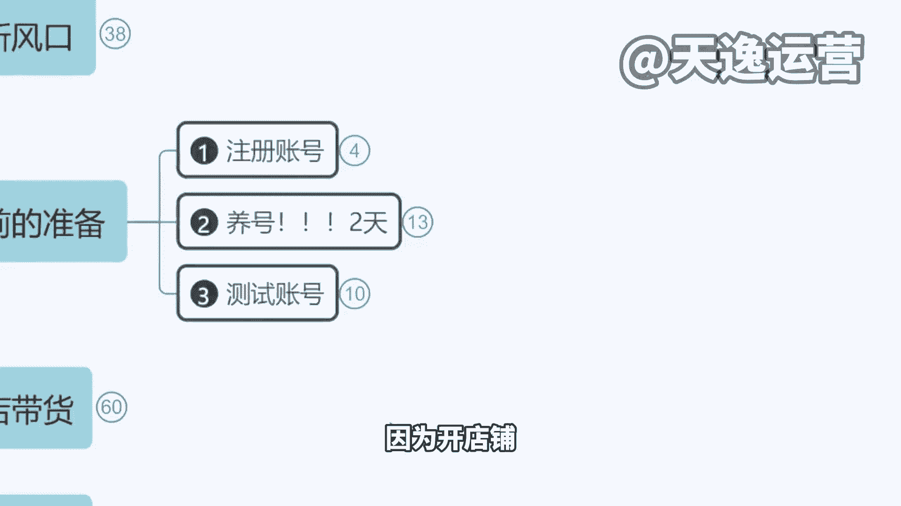