# 【150集精华教程】小红书运营新手起号 0-1新媒体运营必学课！不要荒废18-30岁，一切都还来得及！ - P23：20、小红书【商品笔记】制作：封面设计及注意事项 - Yooup剪辑映 - BV1q1421C78E

大家好，今天给大家分享的是小红书全集系列，第五大课时的第三小节课时里面的第二条内容，封面的一个设计啊，结合我们上节课给大家进行了一个，用我们目标群体的一个整体讲解。

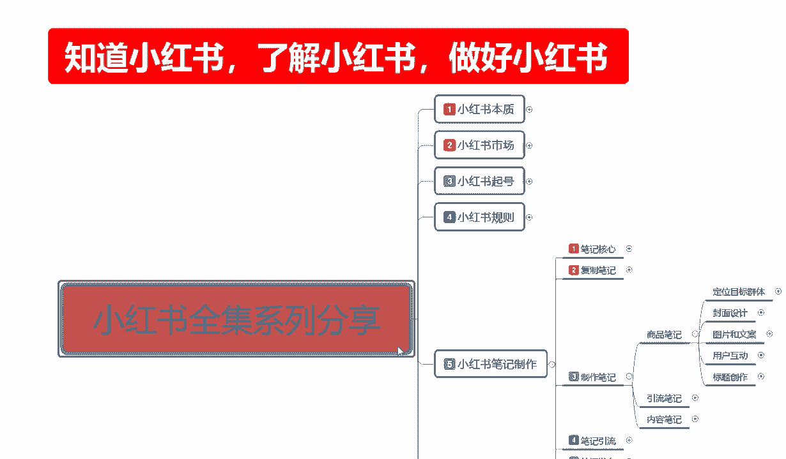

这节课呢啊进入到我们小红书笔记。

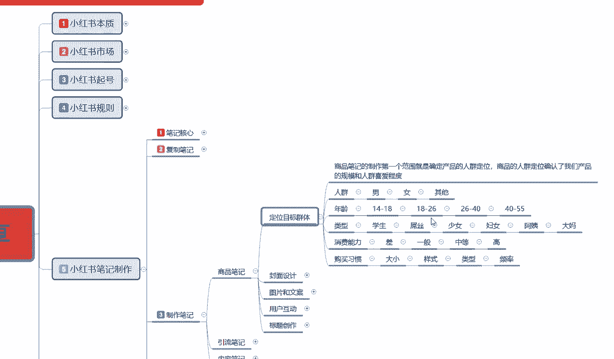

最关键的一点封面的一个整体设计，封面设计啊，其实在这个里面的话，我在这里呢封面因为它是根据我们产品也好，根据我们所宣传的内容也好，他进行了一个设置嗯，整体来说的话，就是说针对我们所设计的商品人群。

确定我们产品封面的一个风格啊，封面的话它是我们笔记的第一要素，如果封面做不好，后续笔记基本上报不起来的啊，所以我们在制作封面的时候，一定要按照我们需求的内容进行操作，需求内容是什么呢，第一个封面的尺寸。

第二个封面设计原则，第三个是封面的类型，第四个是封面视频的一个封面，第五个是注意事项啊，这里面的话为什么说是有一个视频封面，视频封面说实话它比图面，纯文字的一个图片封面的话，做商品要好一点。

如果说你做引流的话，那个怎么说呢，做内容分享的，或者说是做引流分享的，用图片文字的比较好，做商品的话，尽量的话还是用那个视频封面比较好一点，这是区别，首先了解一下封面的一个尺寸啊。

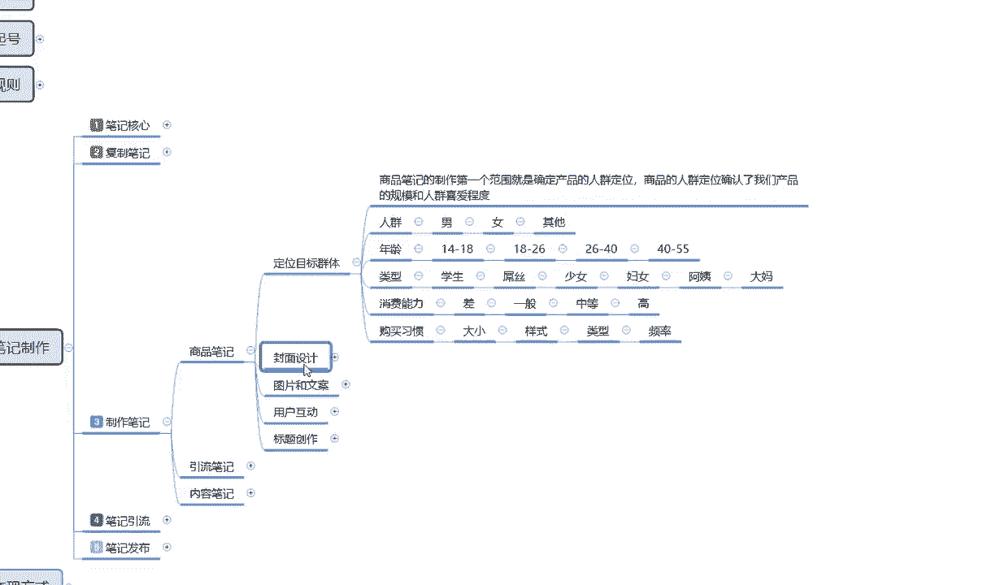

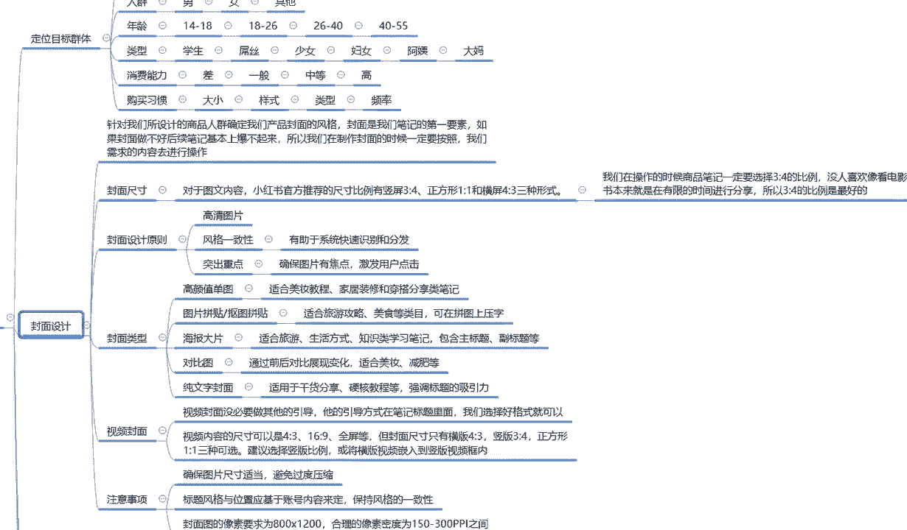

封面尺寸对于图文类的一个内容，小红书官方推荐的一个尺寸比例有嗯，竖屏三比四。

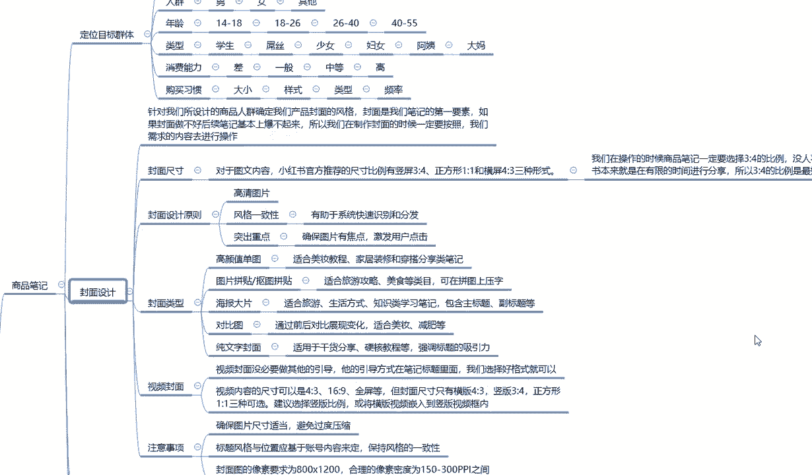

正方形，一比一和横屏四比三三种形式啊，说实话我们在操作小红书的时候。

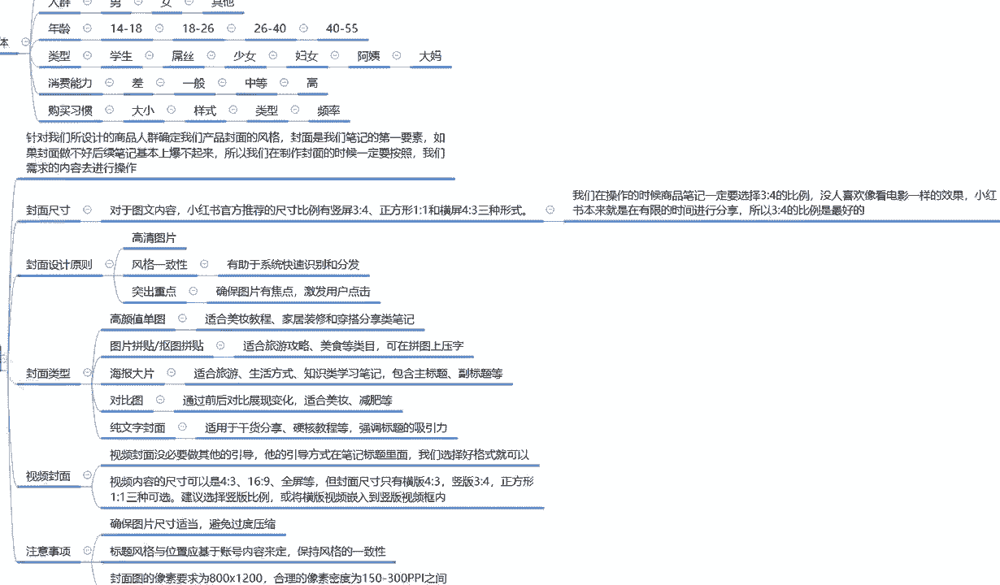

商品比例一定要选择三比四，包括我其他的所有的啊，尽量不要用一比一，或者说是四比三速拼的一种方式，小红书本来就是放松心情的一个娱乐平台啊，他只是上面有我们所需要了解的一些东西，用户才会去观看。

如果你说放横屏，用户点进去以后的话，发现横屏倒过来以后，他观看信息就下去就阴险，兴趣就已经减少了50%，就像你看抖音，你就你们以前的话看抖音，刷抖音或者是了解抖音的时候，他还偶尔还会出现一些横屏。

但是评论区里面说的都是什么呢，大胆啊，这么多年了，还没人敢让我把手机横着放，都是类似这样的话，所以说横屏的话给人的一个印象不好，我们又是图文的一个形式，所以说我们做小红书所有的数据比例啊。

图片比例都是三比四，其他比例不考虑也不选择啊。

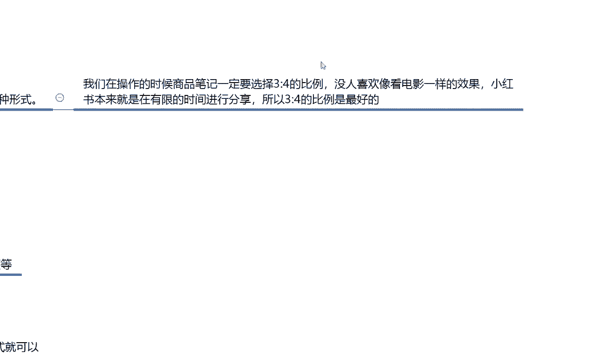

这个是图片的一个比例，第二个封面设计原则，封面设计原则是什么呢，第一个我们在做图片文案和文字文案的时候，图片清晰度一定要高，什么叫清晰度一定要高呢，就说我们照片拍下来以后截图也好。

或者说是你原创的图片也好，你必须得拿高清的一个手机或者相机去拍，你想办法都得去弄一个，因为如果说你的第一张图片清晰度不够，很模糊的，你类似于别人拍摄以后发给你的截图，或者说原文案原文档不是第一手文。

原文件的话，他的那个图片清晰度是有点模糊的，模糊模糊的产品看上去的话，它的效果和高清图片就和我们看电视时一样啊，你电视里面有好几个选项对吧，标清高清超清对吧，这几个类似的一个形影像。

你看的话只是说越高清的图片，流量也越多大而已，但是在小红书里面的话，他不会在乎这一点，所以说越高清的图片，对我们的效果也就是越好的，第二个就是风格一致，什么叫风格一致呢，我们所发的所有笔记啊。

大家记住了，是所有笔记，你发笔记不可能今天发了以后就都不发了，不可能的，基本上一天发一到两天，或者三天发一到两天，你有一个时间性的阶段的，那风格一致呢，就是我们所发的笔记文案模板要用一样的图片。

只是你们的内容不同，风格一致，它可以有助于系统快速识别和分发，就是我们所发的笔记内容类似的呃，笔记效果发上去以后，系统会反应很快，同时给我们匹配精准的人群，前提是你店铺人群做好了啊。

他才会给你匹配精准人群，你店铺人群没做好的话，他匹配不到的，它有助于系统快速的一个识别和分发，就是没有延迟，我们正常做的话，到时候后面还会给大家讲解一下，那个笔记发放的一个时间，笔记发放时间的话。

说实话你的笔记自作做完成以后，你发放上去以后的话，它系统是有反应时间的，你如果说不是统一的风格和统一的一个标识，在里面的话，系统反应会很慢，你本来是提前多长时间发的，结果两个小时以后系统才给你识别出来。

那个时候就已经辞了啊，第三个点封面原则，突出重点是什么，确保的是图片与焦点激发用户的点击率，这个怎么，这个的话其实就是看我们图片的一个效果，然后看我们拍摄效果以后，结合文案对他进行了一个描述。

看我们到不到位，为什么这么说，图片其实拍出来的效果都是差不多的，但是他图片的一个聚焦，是否有重点，你在重点上面有没有做详细的一个讲解，他能不能激发用户的一个点击，就是你看小红书的时候。

你看我们我们正常刷小红书，你看着哎这女装不错，哎这妹子不错啊，对不对，这个小女生长得真乖，或者说是我们看新闻框感告快报纸的时候，特意宣传夸大那种都行，就看我们自己怎么去用啊，能不能激发用户的一个点击率。

这个就是重点要突出，包括，封面设计原图啊，你把封面设计不好，后续都是白扯的好吧，下面一个是封面的类型，为什么封面还要分类型呢，封面类型是分为什么高颜值单图啊，图片拼接拼图。

抠图的一个图片拼接拼接以后把它组合到一起，然后海报大片对比图，纯文字封面，这些他都是有特点的，它对应的人群是不一样的，这里呢我也是给大家列出来了，首先是高颜值单图，高颜值单图是什么意思呢。

就是嗯美女路径或者不路径，或者说是我们把这个图片放的非常清楚，非常清晰，这叫高颜值单图，就是你有模特和没模特都可以做这个图片，他比较适合的就是嗯美妆的一个教程，家居装修穿搭分类。

产品介绍等等这一类的笔记，他去做这个是非常好的图片拼贴啊，抠图拼贴它比较适合的话就是旅游攻略，美食等类目，可以在拼图上面压字，就是我把图片全部抠出来以后，比方说这个是旅游景点对吧，这种的话。

他是做那个网络博主比较适用的一种方式，我把图片拼贴下来以后，某某某某就几年啊，相当于做个宣传，好吃不好吃，很难吃，住着舒服不舒服等等，有一个详细的解释，类似于这一种的图片拼贴。

他比较适合的话就是旅游攻略，美食这种，然后是海报大片，它比较适合的是旅游生活方式，知知识类学习的一个笔记，包含主题副标题，什么意思呢，宣传就是笔记，它的类型是很多的，你的图片封面的类型，我们要把它选好。

你到底是宣传嗯，食品也好，旅游攻略也好，生活方式也好，穿搭也好，它都是有一种宣传方式，知道吧，他所宣传的方式的话，就说对应人群的一个选项啊，他只是更加细分了而已，我们把它划分出来。

结合我这么长时间的一个经验啊，给大家做了一个对比，然后是对比图，对比图的话，说实话它比较适合的就是实用性的一个产品，口红指甲油，假指甲，睫毛小饰品，耳环项链首饰都可以试用，它通过前后对比的一个展示。

比方说传统戒指啊，网红戒指，传统鞋，网红鞋，传统衣服，网红衣服等等，他都适合它，比较适合去宣传商品的一个对价，对最后一个就是纯文字，纯文字的一个封面啊，说实话纯文字的封面的话就比较适合我这样啊。

那我给大家进行的分享，基本上都是纯文字封面，我很少给大家去，基本上没有啊，给大家做过什么演示啊，示范那种存托时间的一种解说和讲解，因为我觉得我不屑于去那么做，能听懂我课的基本上都能听懂，听不懂的。

那就是真的听不懂，所以说我给大家分享的，基本上都是纯的一个干货啊，硬核的一个教程，所以说我给大家分享的基本上都是强调啊，标题等等之类的，他就比较适合我这种啊，给大家做分享的一个是吧，多的就不说了。

大家理解就行好吧，封面的一个类型，看我们大家自己根据自己所选择的类目，产品去进行选择，效果都是不一样的啊，大家不要小小看我整理的这些资料。

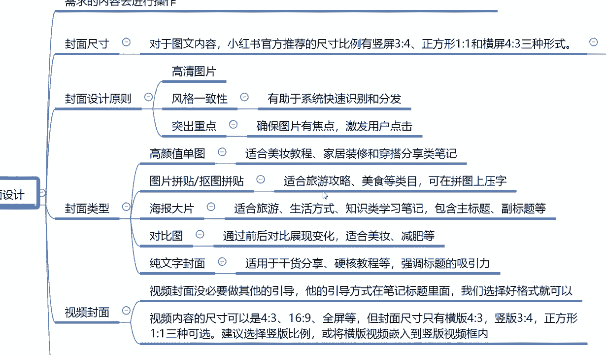

它的效果是真的都是不一样的，往后面呢就是视频封面啊，视频封面我之前给大家说过了啊，视频封面的话，就是说没有必要做其他的一个引导，整个视频的话，你从头到尾把他一遍拍下来就行了，照片什么文字啊。

图案之类的都不要有，但是第一印象亮度一定要够，视频拍摄下来整体的结果效效果要好，你不行，多拍几遍，选个最好的都可以，但是你不能说是我觉得拍他好麻烦，那你还不如不拍。

你还不如直接去做那个文字文案的一个封面啊，视频封面的话，它比较适用于那个产品的一个介绍，和我们那个穿搭之类的，比较适合这个去操作，就是说视频拍下来以后的话，你把它格式改正确就行了，其他的都不用改啊。

是什么样的视频，就是什么样的视频，要保证它的一个实际效果，本来我们就是原创视频，制作笔记里面本来就是原创视频，没必要去改啊，视频内容尺寸呢还是那会跟大家说的啊，四比三，不应该说是三比四哈，不要搞错了。

是三比四，不是四比三啊，他只是说给我们提供了一个四比三，16比九全屏，但封面尺寸的话只有横版和竖版，我们一般都是选竖版三比四的啊，其他的都不考虑，最后一个呢就是注意事项，第一个确保图片的尺寸适当啊。

避免过于压缩压缩的一个瓷片，你猜小红书笔记里面内容太大以后的话，它有一个延迟的，但是小红书整体的话，因为它的数据量还没有达到那么大的一个规模，它的后台系统还能承受，就是说我们看小红书的时候。

他的反应速度还是很快的，偶尔你的手机网络速度不卡，有可能卡个零点几秒，0。5秒到一秒钟左右，那都是正常显示，其实也还好，然后就是标题的风格与位置的话，基于账号内容来定的，保持一致的风格就行。

就是我们把标题你在图片上面加文案也好，在文字上面加文案也好，你把标题放在旁边，竖着也行，横着也行，但是你后续的所有笔记都要按照这个方式去做，保持它整体之间的一个风格，就是你不要前面五个笔记本来标题。

在上面像横幅一样拉着一长条，后面那个后面的一笔记，你就把它做成竖条了，那样不行的，别人看不懂的好吧，所以说一定要保持风格的一致，然后封面图的像素要求的话是800×1200。

和你的摄像素密度为150~300，PPTT之间啊，这个就是整个封面设计，我们所需要了解和注意的一个思想，同时呢给大家提供了一部分的选项内容啊，让大家知道什么类型的一个封面图，什么类型的一个封面图片效果。

它所适用的一个人群范围，让大家进行了一部分的了解。

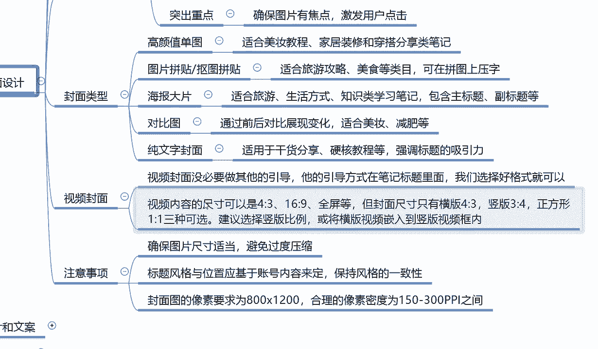

好吧，那么这节课呢就给大家讲解到这，下节课的话给大家讲解一下图片和文案。

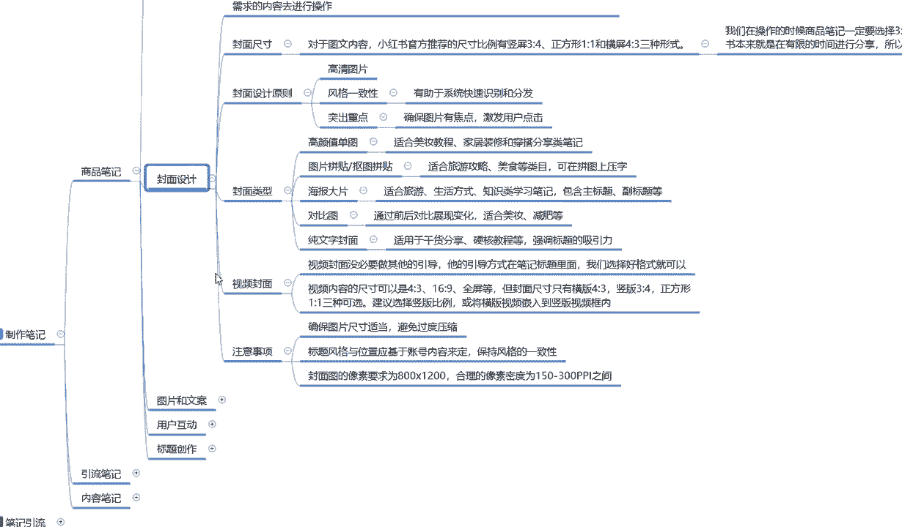

图片和文案要到达选择人群的时候了，我之前给大家说过啊，商品笔记里面定位目标群体的一个人群范围，年龄性格，消费能力是选用户了对吧，我们是后面还要靠我们图片文案去选好吧。

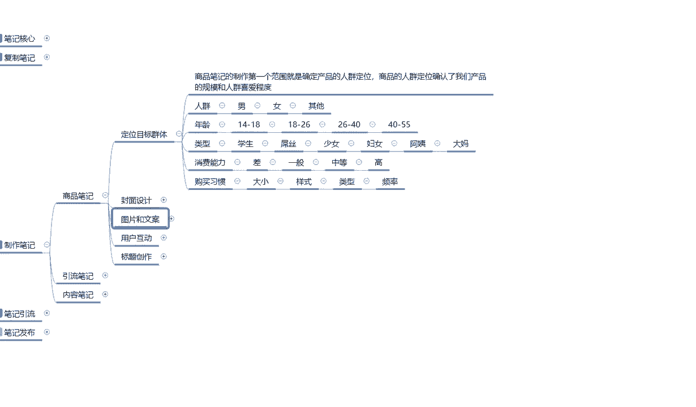