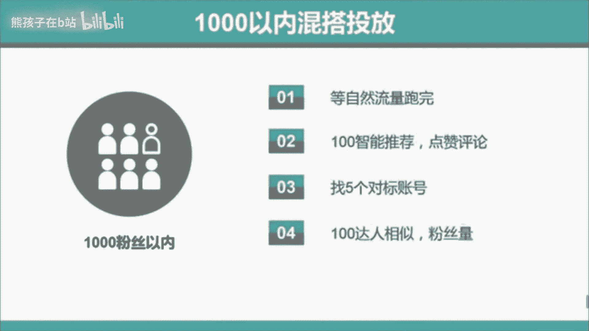
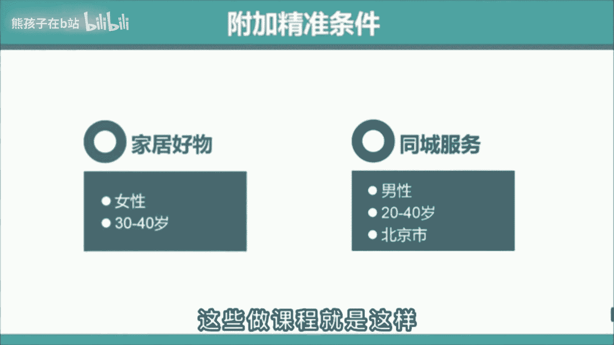
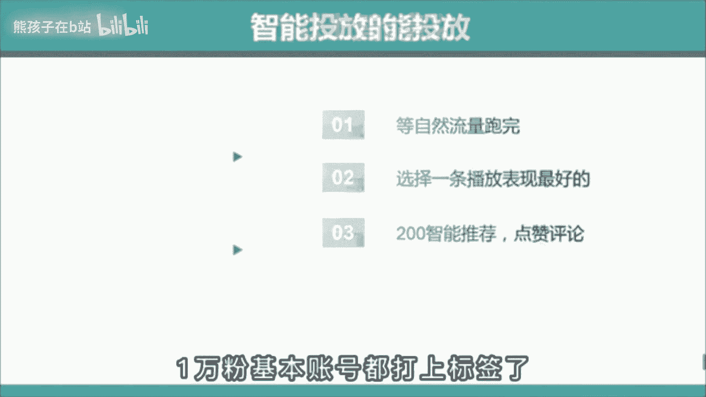

# 【150集精华教程】抖音运营新手起号 0-1新媒体运营必学课！不要荒废18-30岁，一切都还来得及 - P12：Dou+技巧投放全攻略 - 熊孩子在b站 - BV1Gm42177WV

专业玩家是怎么偷偷家的，很多老师呀只告诉了你80%的东西，而剩下的20%包装成付费课才会告诉你，这就导致你投完会自我怀疑，明明都按照他教的操作，怎么就没效果呢，这个就是行业的内幕了。

但是今天我会把这个秘密作为新春礼物。

全部分享给你，那正确的做法是什么呢，首先分三个阶段，第一个1000粉丝以内混搭头发，在自然流跑完后，先选择100智能推荐，选择点赞评论，考完之后再选择五个对标账号，投100达人相似。

那这里啊选择对标账号的标准。

就是最好是选短期内刚1万粉丝的这种。

因为这种粉丝粘性不强，而且不在乎你是不是大号，所以呢对新号就很友好，而第一步先投100，智能推荐的原因是让系统给你美化一下数据，点赞评论多一些，大家更愿意多看两眼。

这就是利用了心理上的从众心理，第二个3000粉丝以内定向投放在视频自然流，跑完后，直接选择投200个大人相似，同样选择短期内刚有1万多粉丝的这种，但到这里还没结束，你要根据自己的账号受众选择年龄，性别。

地域等附加条件，比如呢你是家居好物，你就肯定要选女性，30~40岁左右，你要是同城号的话，再加个地狱，这样呢能让你吸引的粉丝更精准，加速打上标签，冲击1万粉丝，很多人都不告诉你这个秘密。

这些做课程的就是这样。

那今天呢我都告诉你了，第三个1万粉丝以上智能投放，在视频自然流跑完后，选择一条播放表现最好的，投200的点赞评论，那这俩不投达人相似的原因是。

