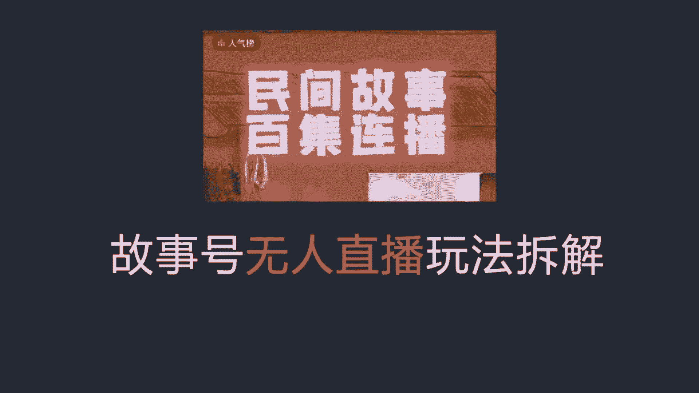
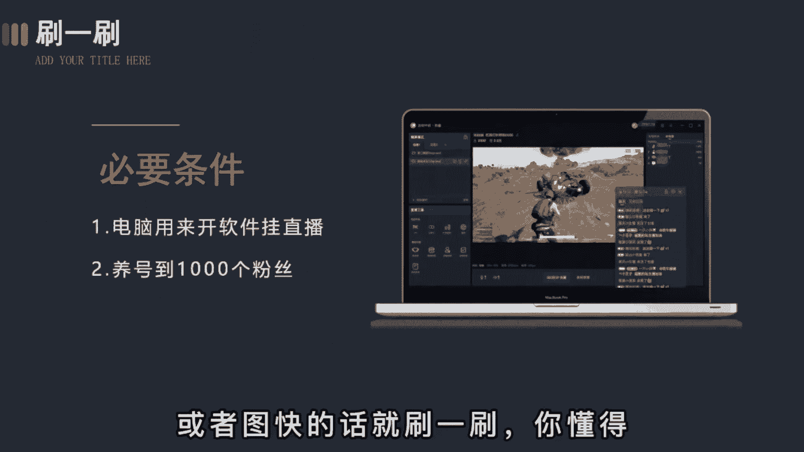
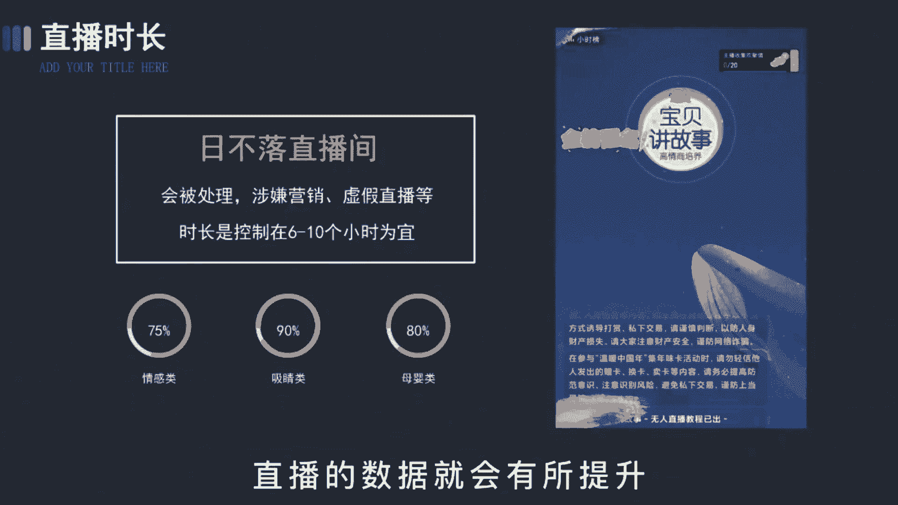
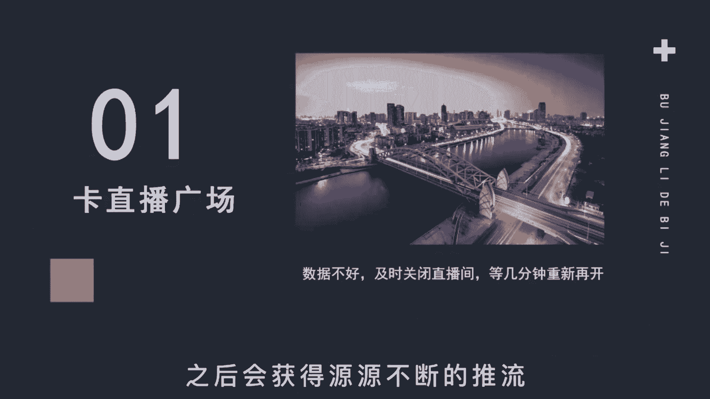
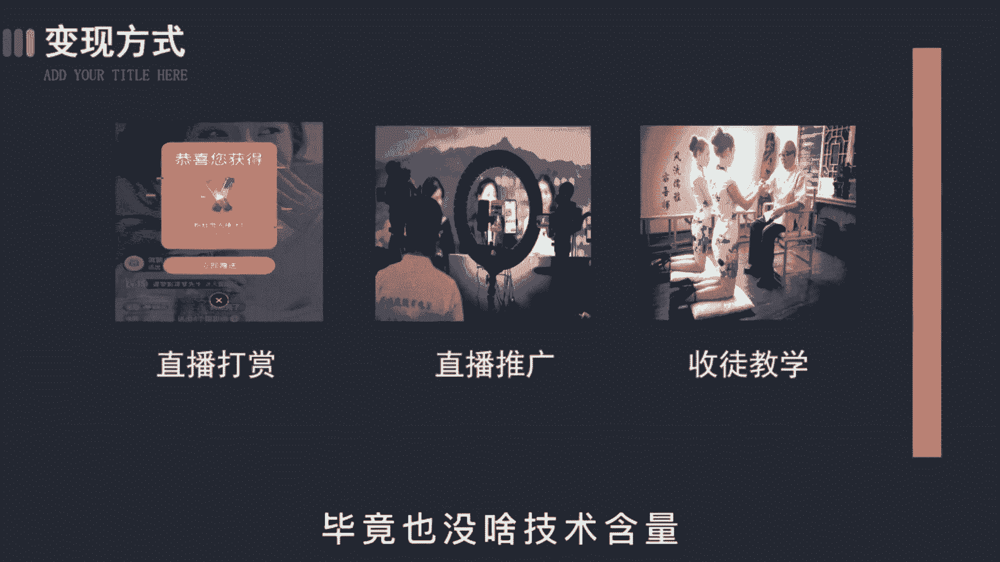
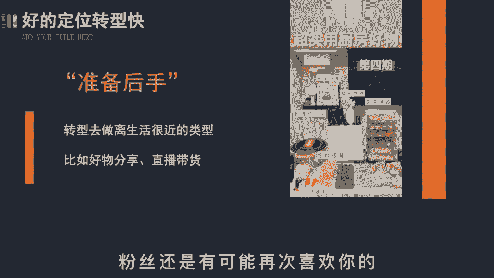

# 【150集精华教程】抖音运营新手起号 0-1新媒体运营必学课！不要荒废18-30岁，一切都还来得及 - P12：变现篇丨抖音故事号直播玩法 - 好久不见鸭一 - BV15J4m1w7rz

故事号无人直播怎么搞，这大概是最详细的拆解了，故事号的直播和短视频的制作是不太一样的，单靠手机啊没办法完成，所以呢你必须要准备一台电脑，电脑呢是用来开软件挂直播的，第二个呢是氧泡。

这个养号呀和别人说的可不一样，没有那么多的骚操作，不会让你立马破播放或者吸粉什么的，主要呀是为了养粉丝，因为开直播的条件是要有1000个粉丝才行，所以啊这段时间你需要不断的发视频，吸粉或者图快的话。

你刷一刷，哎你懂得，然后呢是直播时长，有的朋友啊觉得肯定是越长越好，搞什么日不落直播间，一波波24小时，这是大错特错的，你要这么操作，不出几天就会封号处理，涉嫌营销虚假直播什么的。

所以啊最好的时长是控制在6~10个小时为宜，不要太长，也不要太短，就跟上班一样，这样平台就会认为你是一个正常人，不给你正常的评分，一般来说呀，连续播一周后，你的直播数据呢就会有所提升。

这里要注意的是，当你发现数据停滞不前，比如说观众不涨反跌，你就得及时的关闭直播间，等几分钟重新再开卡下，直播广场增加你的曝光度，这就好比啊你的作品上了热门之后，会有更多的播放量一样。

我这边实测的数据是能保证开播30分钟，场关总数可以达到1300~1600左右，那一旦开播呢，左上角就一直不断的惊人，每两秒钟就会进来一个人，这时呢就算是卡上直播广场了之后啊，会获得源源不断的推流。

那昨天呢讲了视频的变现手段，今天啊再说下直播的主要呢三个方面，第一个是直播打赏，当你能做到直播间每天能有几百上千人在线时，收益是很不错的，我身边呢有个小伙伴就是场均都不到千人，但每天光打赏就有一两百。

这还不算视频端那边的收益，然后再过段时间呢把账号权重再养一养，搞个三五百是没问题的，第二个是直播推广，当你的粉丝达到了一定的量级，就可以接一些推广业务，不了解的呢，你就去点一下别人直播间的小风车。

哎你就知道了，广告推广啊，结算方式有CPA，按效果付费，有CPM，按展示付费的，第三个是收图，做影视号也好，同城号也好，各行各业都会有收徒的现象，这很正常，没啥可说的，你会发现啊，很多粉丝较多的账号。

都会在名字后面加收徒二字，收费啊，在几百左右，高了呢也没人愿意学，毕竟也没啥技术含量。

不过呢这个在中期是变现的大头故事哈，虽然涨粉迅速，但这种玩法呀不见得长久，所以为了保险起见，我也给大家准备了后手，当你发现账号被警告，或者呢同行开始弃更的时候，你可以转型去做好物推荐，去搞视频带货。

这些品类啊，离生活很近，也是长辈比较关注的食品类型，改个名字重新做号，不会让大家觉得很突兀。

