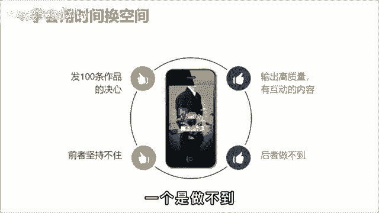

# 【150集精华教程】抖音运营新手起号 0-1新媒体运营必学课！不要荒废18-30岁，一切都还来得及 - P13：8抖音起号的正确方式 - 炫点麦当当薯条 - BV1Li421C7Jw

🎼有个同学问我，为啥自己的视频就无法播放，怎么努力都不行。而看别人做呢却那么简单，大大小小的培训博主关注了不少，运营知识也没少点赞收藏，怎么号就是起不来。😡。

🎼难道是他们说了假话，干货都在付费课程里？😊，🎼我和他说，其实呀他们交的也没错，只是你没有搞清楚哪个阶段该做什么样的事情。第一个阶段，搜集信息，把你要做的这个赛道前10名的账号都找出来。

作品按照时间排序，只看最近3个月，每个账号挑5个，把爆款的选题文案都抄限，用你的角度分析，他为什么会合，培养网感。😊。

🎼第二步，像素级模仿，把这50个当中最符合你账号定位和用户画像的作品进行像素级的翻拍。文案不会写，没关系，你会抄就行。鲁迅曾说过，会模仿绝不是劣点，会模仿又加以创造，那不是更好吗？由此可见。

林家大师啊也都是先引模仿在加以创新的。🎼之后呢才会有自己的风格。🎼第三步，发布投放，精心准备10条作品，每天啊发两条，5天发完，每天投200斗家，选择点赞评论。🎼这么做的意义呢是为了养树据。

因为没有点赞的作品，很少啊有人愿意看完，然后呢把其中文博率最高的互动数据最好的进行单独投放。🎼每条投500选择粉丝量，一口气干到5000粉丝。🎼这样呢之后就靠自然流量，你也会有几千到几万的功。

🎼破播放的流程就这三点，你需要做的就是转变思维，学会用时间换空间。🎼要么像我一样，抱着发100条作品的决心，干废3个号，要么说出高质量有话题的内容，吸引粉丝。🎼但很明显，对小白来说，一个是坚持不住。

一个是做不到。

