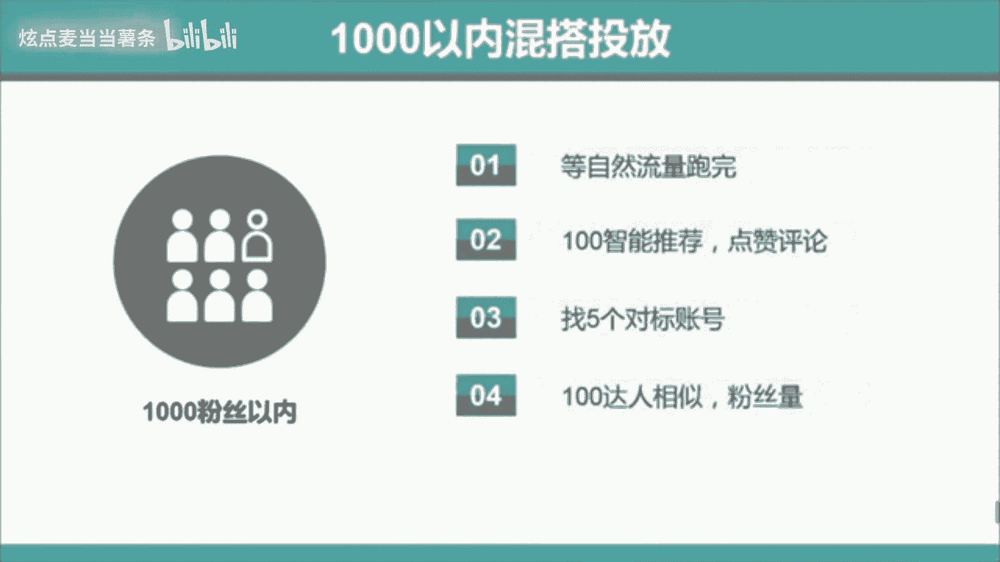
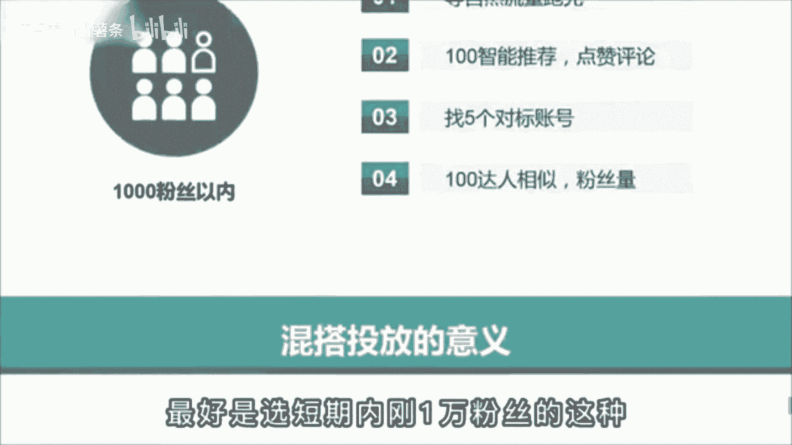
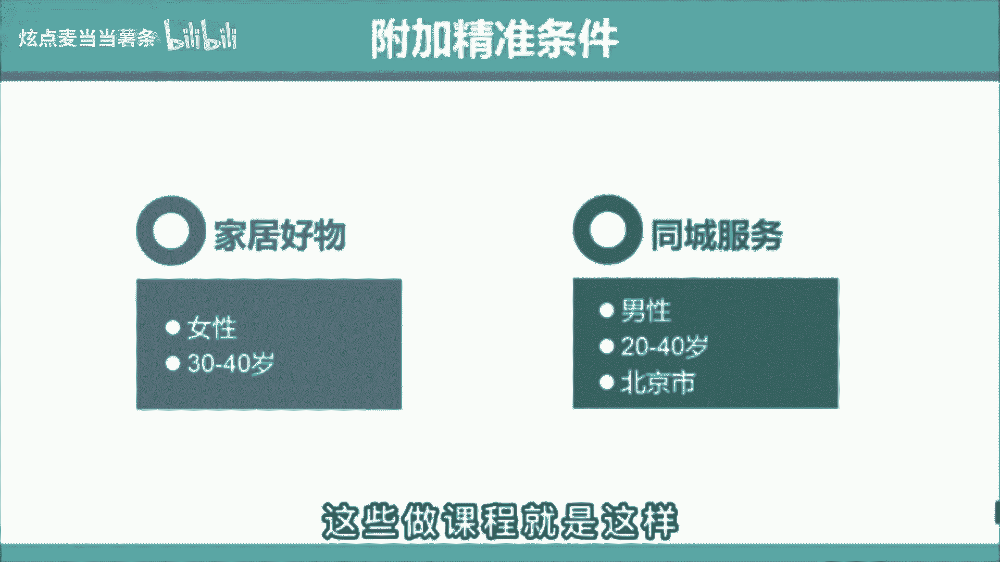
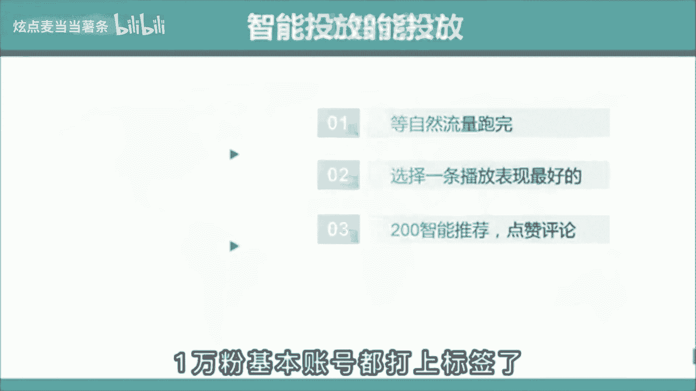

# 【150集精华教程】抖音运营新手起号 0-1新媒体运营必学课！不要荒废18-30岁，一切都还来得及 - P14：Dou+技巧投放全攻略 - 炫点麦当当薯条 - BV1Li421C7Jw

🎼专业玩家是怎么偷豆家的？🎼很多老师啊只告诉了你80%的东西，而剩下的20%包装成付费课才会告诉你。🎼这就导致啊你头完会自我怀疑。😡，🎼明明都按照他教的操作，怎么就没效果呢？😡。

🎼这个呀就是行业的内幕了。🎼但是今天我会把这个秘密作为新春礼物全部分享给你。

🎼那正确的头法是什么呢？首先分三个阶段。😊，🎼第1个，1000粉丝以内混搭投放，在自然流跑完后先选择一00智能推荐，选择点赞评论。🎼考完之后再选择5个对标账号，投100达人相似。

🎼那这里啊选择对标账号的标准，就是最好是选短期内刚1万粉丝的这种。

🎼因为这种粉丝啊粘性不强，而且不在乎你是不是大号，所以呢对新号就很友好。而第一步先投100智能推荐的原因是让系统啊给你美花一下数据，点赞评论多一些，大家才更愿意多看两眼。😊。

🎼这就是利用了心理上的从重心理。🎼第二个，3000粉丝以内定向投放。🎼在视频自然流跑完后啊，直接选择投200个大人相似，同样选择短期内刚有1万多粉丝的这种。🎼但到这里啊还没结束，你要根据自己的账号受众。

选择年龄、性别、地域等附加条件。🎼比如呢你是家居好物，你就肯定啊要选女性30到40岁左右。

🎼你要是同城号的话，再加个地狱。🎼这样呢能让你吸的粉丝更精准，加速打上标签，冲击1万粉丝。🎼很多人啊都不告诉你这个秘密。🎼这些做课程的就是这样。

🎼那今天呢我都告诉你了。🎼第3个，1万粉丝以上智能投放。🎼在视频自然流跑完后啊，选择一条播放表现最好的投200的点赞评论。🎼那这俩不投达人相似的原因是1万份基本啊账号都打。

