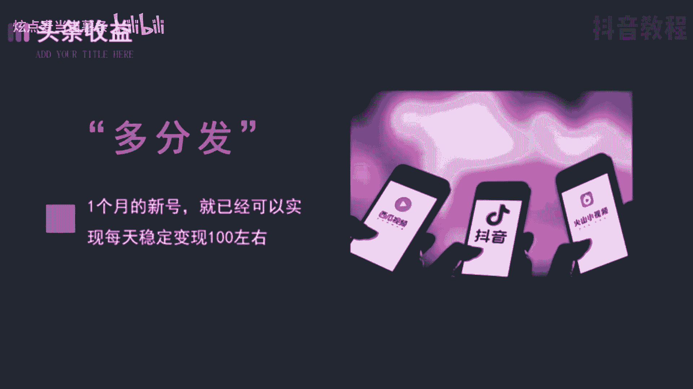
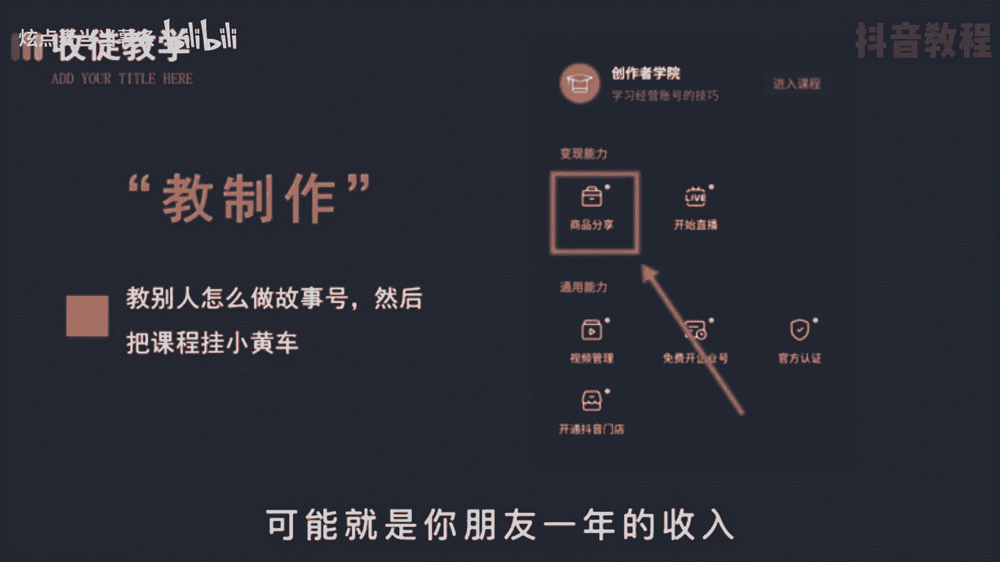
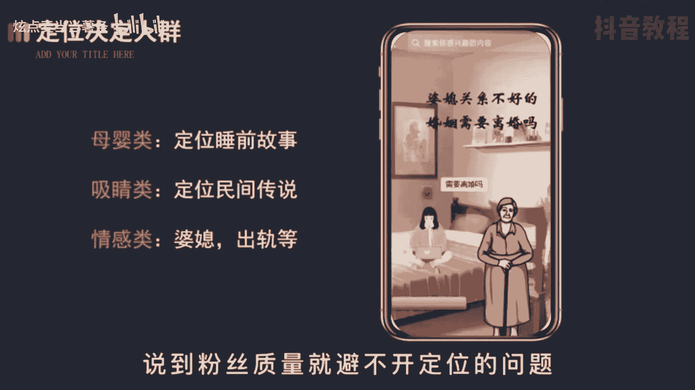
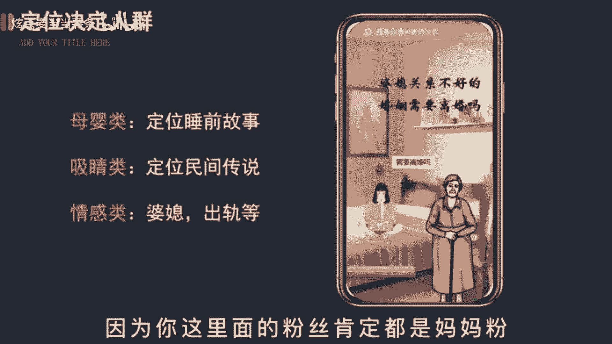
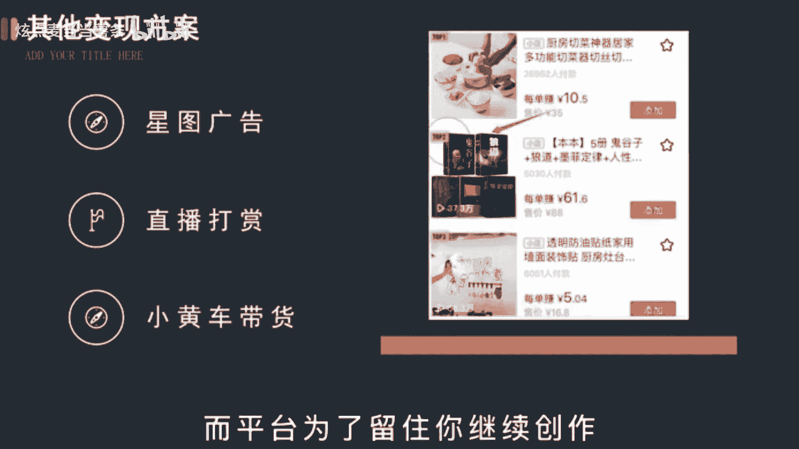

# 【150集精华教程】抖音运营新手起号 0-1新媒体运营必学课！不要荒废18-30岁，一切都还来得及 - P19：变现篇丨故事号要怎么变现 - 炫点麦当当薯条 - BV1Li421C7Jw

🎼故事号的收益是远超影视号的，这可不是我胡吹啊，有图有真相，而且呢涨粉率也特别高，一般在0。6左右。也就是说，视频有1000个点赞就会涨600个粉丝。😡，🎼在上个视频呢讲了如何制作。

这期啊再说一下涨粉后该怎么变现。

🎼故事号主要的变现方式呢有三种。第一个头条收益，就我观察到的一个刚做了一个月的新号，就已经啊可以每天稳定变现100多了。但一个月呢就3000多块，赶上三四线城市的基本工资了。而大号呢往少了说。

稳定个七八百还是可以做到。🎼这点还只是在一个平台的收益。如果再分发到其他的视频平台翻个3倍，是不成问题。

🎼然后呢，还有两个变现方式，我们统称为后端变现，一个是培训，是以实代号。培训呢就是搜图教你怎么做故事好，然后通过视频课在小黄车或者私域平台引导粉丝随随转化。🎼你不要觉得说做一个视频课程很难啊。

其实很简单。比如呢在我这个课件的基础上，再加上你的具体实操步骤就可以了。单人呢61位，10个人呢就是6000，100个人就是6万，可能啊是你朋友一年的收入，你就说心动不心动吧。😊。

🎼另一个呢卖号就比较简单了，一般工作室都是批量起号的，如果你时间充裕，也可以做好操作，毕竟啊制作简单，然后呢通过平台或者号贩直接出售。🎼目前呢是5到8分一个粉丝10万粉的话就是5到8000。

甚至上万也有可能。🎼而账号的价值则取决于格色斯质。🎼不过呢就算是七八千，也是一个不错的收益。

🎼说到粉丝质量就避不开定位的问题。

🎼如果你是定位宝宝睡前故事，那就找一些儿童读物来做。悬疑类呢就找恐怖故事。民间传说情感类就找婆媳、出轨妈宝，这种有共鸣和爽点的题材。🎼以后转型带货啊就会方便一点，卖号的价格也会更高。记住啊。

只有账号垂直内容优质，才是做账号的底层逻辑，也是买家乐意出高价的原。🎼他们会拿你的儿童故事账号去带获女性产品。🎼因为呀你这里面的粉丝肯定都是妈妈粉。

🎼那关于主流的变现呢，就是以上三种，但不代表只有这些。🎼比如呢开通星图及广告、直播打赏、小黄车卖图书都是可以。🎼只要有流量有粉丝，无论到哪个平台，他们都是欢迎你，而平台变在留住你继续创作。

变现呢也就变成了顺理成章的事儿。

🎼另外啊再教给你们一个持续获得流量的小技巧。🎼就是呢晚上开直播讲故事。🎼在你睡觉的时候，把故事音频打开，就会有大量的夜猫子进入直播间去听你的故事中。一旦他们养成习惯，就是你的忠实粉丝。😡。

🎼账号的权重呢就会上去，能推荐看到的人自然就更多，收益呢也就水涨船高了。🎼那关于直播的玩法呢，我会在明天的视频里讲。

