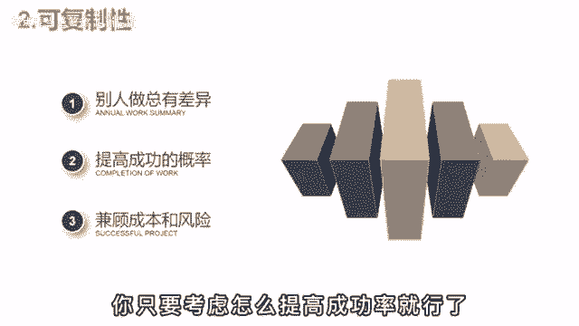

# 【150集精华教程】抖音运营新手起号 0-1新媒体运营必学课！不要荒废18-30岁，一切都还来得及 - P20：变现篇丨影视解说如何快速起号？ - 炫点麦当当薯条 - BV1Li421C7Jw

🎼之前啊有个朋友做影示好，干了俩月发了50多套作品，就是没啥起色，每天焦虑的睡不着，死活都想不明白这到底是哪出了问题。为啥辛辛苦苦做了这么久，就一点回报没有。后来呢跟我通了个电话，聊完后啊。

说自己是彻底沦过的，原来玩自媒体是这么回事，之前啊被那帮博主给忽悠了。什么三天不播放，轻松100万流量都是鬼话，想做好自媒体真正的核心逻辑。😡。

🎼就两点。🎼一概率。🎼大多数人都被欲望通昏了头脑，梦想着一口吃成胖子实现财富自由。😡，🎼但无论你是做短视频，做电商开饭店，本质啊都是做生意，都是通过自己的服务产品来盈利。

你做影视解说可以啊给大家提供娱乐价值，提供投资。但就算你有货就要，你不见得有人愿意看，这样就和做生意是一样的，影响客源的因素有很多，不可能百分百出过。那话虽这么说，但抖音啊作为时代的风口。

多少还是有区别于传统生意的优势。首先呢低成本，拍抖音是真的没什么成本。别人出境一部手机一个麦就够了。你要玩中视频计划，好无带货什么，连手机都用不上，有一台电脑再加上一点时间就足够。而你如果要开店。

租房装修雇员工进货，这些啊都是必不可少，少了一年也得几十个打折，这就全脱离波人。😊。

🎼第二点，可复制性。假设你这个店啊经营的还不错，这时呢有想开个连锁，一个店的收入1003个店，不就是300万吗？😡，🎼在现实生，培养一个靠谱的店长太难了，手把手的脚眼不大夫之，总有差异地。😡。

🎼而做抖音呢就没有这个烦恼，反正都是你做的。你只要考虑怎么提高成功的概率就可以。

🎼办法呢就有一个就是批量几号。🎼一个号就算20%的概率，你做5个就能无限的接近于百分之百，总能跑出来一个。😡，🎼哎，这就体现出了可复制性的优势。🎼当一个号做起来后，你完全可以仿着那个爆款的脚本。

用其他的号再来一遍。🎼自己抄自己总不会出问题的。😡，🎼之后呢，你就有了5个成熟的账号，然后啊雇一些人帮你打理。比如这两个大学生帮你斜高、剪辑，有解放，可以去钻研其他新项目的机会。😊。

🎼这就进入到了一个健康良性的运营状态。🎼那做影视号怎么批上几号扩大概率呢？剪辑啊倒不费事，可惜解说稿就要累死了，要怎么一个人做5号呢？这个当然是有技巧方法，你平时应该刷到过那些一剪梅吧。

就是只剪辑最精彩的部分，主页呢是没有全集的，但粉丝和播放还挺多。😊，🎼要像这种号呀，就能提升效率。一个号就算平均收益2005个就是1000，这还不算爆款的流量，是不是美滋滋？😊。

