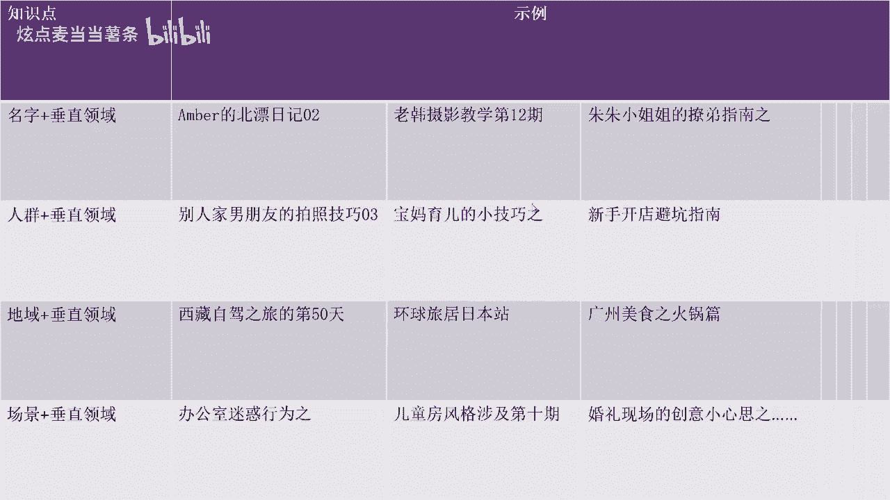
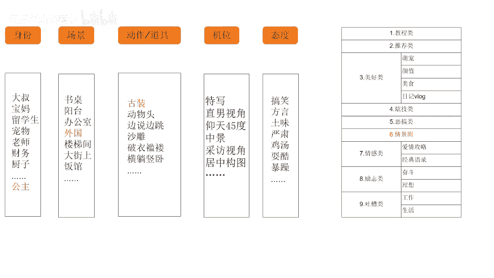

# 【150集精华教程】抖音运营新手起号 0-1新媒体运营必学课！不要荒废18-30岁，一切都还来得及 - P22：策划内容定位 - 炫点麦当当薯条 - BV1Li421C7Jw

能不能懂宝贝们啊，那么其实我们在想到这种主题IP之后呢，懂是吧？而，有同学说了，老师，你这个东西吧，好像好多人都这么做的，什么老韩摄影教学，我还看见小韩摄影教学了呢。😡，那你有什么猪猪小姐姐。

我还有什么猪猪小弟弟呢，是不是？那你这个广州美食之火锅片，人家老发什么重庆美食之火锅片的。😡，啊，这么多，那现在是不是重复内容特别多呀？😡，是不是那我在做这个主题还能火吗？那我看老韩摄影教学。

最开始他很火，但是往后面再拉好多做摄影教学，他火不起来呀。😊。

是不是啊这个这个时候问题就来了，但是我们选择这个主题IP它还能活起来吗？可能我们第一想的是去模仿别人啊，什么活我就也做个什么主题呗啊，对不对？这个是人之常情，但是他还能不能活起来。😡，还能不能火起来？

😊，哎，能不能火起来，再看我们接下来的什么呀，我们的核心内容啊，大家想等我想好一个主题IP之后，我里面的核心内容还没有想的更细致啊。比如说我选择了这个老韩摄影教学了，但是里面我到底教什么。

我到底拍拍人还是拍景？😡，啊，我用手机教还是用相机教，这些我都没确定啊。那这个时候我们说除了主题IP之外，更具体的呢？就是我们是什么样的？哎，我们要在什么场景里用什么道具和动作啊去啊表达什么样的态度。

用什么样的机位。我们的视频结构，我们的内容是什么样的，这些都是我们需要接下来定的。😡，大家能懂不？哎，所以说其实一个内容定位没有那么简单，是不是它是一环套一环一环套一环的。好吧啊，那么我举个例子。😊。

うんうん。我举个例子啊。然，刚才我们想到啊，除了说主题IP之后，我们还要想什么呀？什么我们的身份，我们的场景，我们整个动作，我们的道具，我们的机位，甚至是我们的态度啊，这个是我们都要想到的一些啊。

尽可能多的去给它扩充，对不对？那越丰富越具体。那么我们整个的定位越明确。我们接下来去产述内容的时候，越容易。😊，能懂吧？啊，那大家其实可以看一下，之前有一个账号叫做暴躁的小风。

那他其实就是啊在在态度中选取了这个暴躁啊，其实他现在已经有很多粉丝了，很多粉丝了。😊，那它的一个脚本模模式呢，跟我们接下来要讲的一些内容上的脚本模式其实都是一样的啊，这个之后我们讲到你们就清楚了。好吧。

😊，你看在这里啊，我们选择了主题IP之后，那其实身份场景、动作机位太多，我们都得选择一下，都得选择一下啊。那么在这里呢就是呃给你们看一个案例吧，给你们看一个案例叫做。😊。

仙女酵母她的一个案例，所以我唉我的包呢肯定带到他啡馆来做。🎼你好，请问有看到我的包吗？

🎼你好，是这个吗？啊，谢谢。😊，🎼唉，不好意思，我好像电话也忘拿了。😊，🎼帮你收起来了啊，谢谢，太感谢了。😊，不好意思，稍等一下，一会儿我闺蜜应该也会发现她们把我也忘在这儿了。

好了，同学们，那我们来想一下这个视频。😡，啊，这个视频。他这个段子好不好啊，这个段子好不好？😊，单纯讲这个段子内容的话啊，他的这个视频的段子内容非常的呃，就是怎么说呢？有点无聊。

并不是说很新颖的那种段子，对不对？😊，但是这个视频它大概有几百万的点赞吧。那这是为什么呢？嗯，同学们想一下，这是为什么？😡，这为啥？😊，想一下。就他的策划非常的好。他策划非常的好，大家返回来再看一下。

😊，那仙女酵母呢，他现在有1000啊525万粉丝。那其实你会去看他的段子的时候啊，有的时候这些段子都很简单，没有什么技术含量。基本上在网上就是你抄我的，我抄你的互相抄。那么他获胜的点在哪里？

在于他对于身份场景以及他的道具一个打造。😡，大家可以看一下啊，她的身份是一个什么公主。那么它的场景呢选择了外国。啊，外国的古装啊可能偏向于古欧洲那种吧，偏向于古欧洲那种。能懂不啊。

像这种比较独特的一个策划呢。😡，导致了即使说他的段子没什么新颖啊，没什么新颖的，他也能够突出重围。😡，大家能懂这个意思吗？其实这一部分呢，咱们属于人物IP的一个打造人物IP的一个打造啊。

那么除了这个例子之外呢，再给大家举一个例子。😊。

