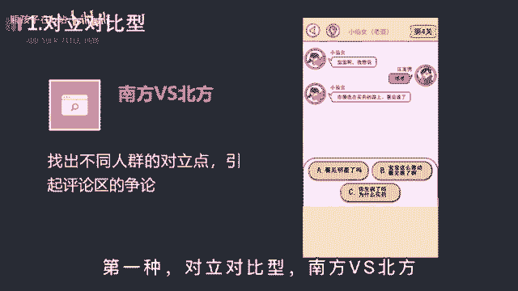
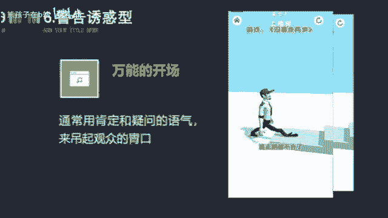

# 【150集精华教程】抖音运营新手起号 0-1新媒体运营必学课！不要荒废18-30岁，一切都还来得及 - P27：抖音游戏号怎么提高播放量 - 熊孩子在b站 - BV1Gm42177WV

你以为录个屏就能玩好游戏，发行人计划没收益，那是你不会编故事，大家游戏画面都一样，但你不会编故事，就是发的再多也是徒劳，不同的游戏使用不同的文案，才会让流量收益最大化。

为此我花费了三天看了200多条游戏视频，总结出了这套游戏文案的写法，学会后你就能轻松抓住用户的注意，达成五秒完播，让你的作品获得更多的推荐，第一种对立对比性。

南方vs北方，男生对女生，白羊座对狮子座，找出不同人群的对立点，引起评论区的争论，你在模棱两可的站个队，进一步提高作品的互动数据，比如这样女生的送命题，没有男生能回答上来，宝宝嗯，在哪。

你猜我去买药的路上看见谁了，第二种请求帮助性，假装你是个菜鸟，请求大神玩家帮你通关，让观众产生想要试一试的冲动，进而呢点击游戏试玩，达成我们的目的，比如这样哼，你们骗人，红色加黄色加白色。

根本就调不出皮肤的颜色，快看我按照你们的方法，调出来的颜色根本就不对，第三种蹭热点性，用热门动漫或游戏主播开场吸引，扩大用户的范围，突破小学生的圈子，像一条小团团，张大仙这种人尽皆知，你完全可以拿来用。

比如这样号称one piece开放兑换码，回顾始末，5月11日凌晨，大量热血航线的玩家，一则消息刷屏，张大仙的粉丝在这游戏里有特殊福利，第四种玩法解说型装备介绍，人物介绍，技能介绍，关卡介绍。

反正就是围绕着游戏的玩法去解说，最好能通过你的解说，让大家发现游戏有趣的一面，比如这样，兄弟们，兄弟们，咱们第三个hr也是终于出了呀，这一次抽到的是工程师，艾玛，单从技能不难看出，这是个强力辅助。

第五种老色批评，利用游戏演上的cosplay去吸引眼球，毕竟漂亮的小姐姐人人都爱，这可是流量密码，发作品的时候，记得艾特我一下，比如这样，第六种警告诱惑起，通常用肯定和疑问的语气。

搭配上游戏最有看点或者可玩性最强的那一关，来调取观众的胃口，是一种万能的开场方式，比如这样，你千万不要玩这个，没事走两步，否则你很容易连走路都不会了。

第七种真人出镜性，在游戏原剧情的基础上进行二次创作，把自己带入到游戏角色中，引导观众点击试玩，这个呢是最推荐的方式，能有效地打出差异化，避免画面的重合，比如这样，忍者的力量都是一步步修炼来的。

你我没玩过，忍者必须死三分，你也玩过，那当然啦，不做原创玩法，点燃战斗狂潮，那以上呢就是小游戏制作的一个文案总结，相信你掌握后，能帮助你更快速的获得视频推荐好了，今天的内容就到这里结束了。

