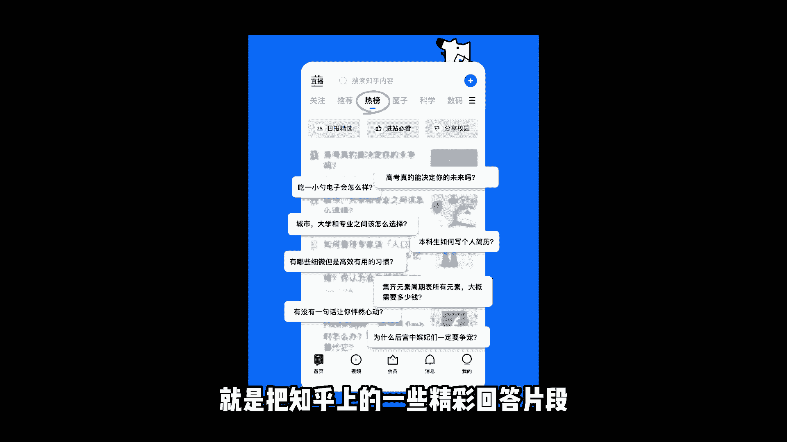
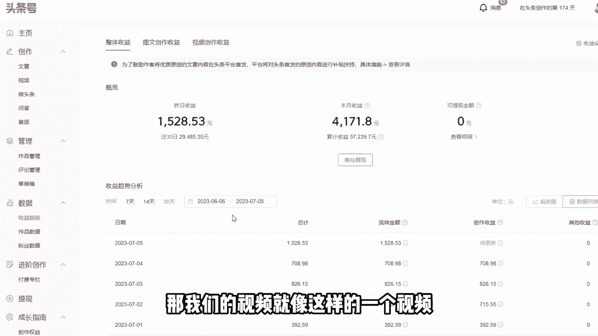
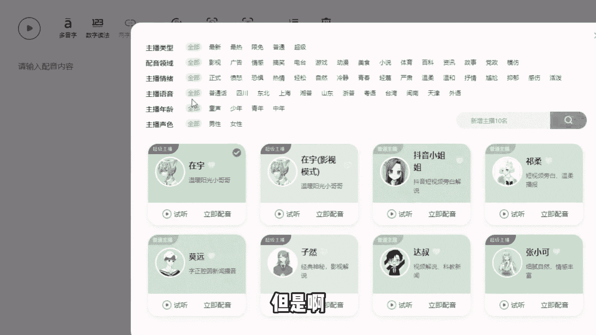

# 【150集精华教程】抖音运营新手起号 0-1新媒体运营必学课！不要荒废18-30岁，一切都还来得及 - P2：知乎问题做视频 - 好久不见鸭一 - BV15J4m1w7rz

最近呢在做一个冷门的项目，就是把知乎上的一些精彩回答片段录制下来。

发布到自媒体平台上来获取平台创作者的收益。

这个是可以长久操作的项目啊，如果说你吃得了苦。

也熬得了夜，那你可以跟我一起来做复制粘贴，这两年啊，我是一共坚持了有18个月，总共呢是拿到了有100多万的一个收益，昨天呢就给我带来了这么多收益，那我们的视频就像这样的一个视频。

今日话题，不小心跟男闺蜜睡了怎么办。

一位网友是这样回答的，哪有什么不小心，其实都是内心里早已经期待发生的事情，只是借助酒精这个噱头付诸于行动罢了。

这些视频都是自带热度的，问题的标题看起来就很想让人点击进去。

内容更是惊险刺激刺激，那这个视频给我带来了20多万的播放量，有播放，那样就能产生收益，我每1万次的播放量的收益，大概是20块钱左右，这个视频的就是400多的一个收益。

而且这种账号完全可以批量的多平台去铺，那这样的素材呢可以说是取之不尽，用之不竭的，完全不愁没饭吃，这里面的配音也很好搞定，我是使用的配音神器，但是啊这里也是有一个细节需要注意的。

比如说怎么去起号，怎么剪辑这样的视频，如果你感兴趣的话，可以评论六，我整理了一套自媒体的直播实操。

那这个操作的方法还真的不难，难的是需要我们有一颗坚持下去的心，这个收益啊可以说是非常稳定的，大家如果有时间的话，可以多做一些，多传一些视频就可以了，那本期视频的话就讲到这里了，我们下期视频再见。

