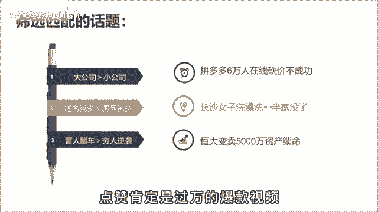

# 【150集精华教程】抖音运营新手起号 0-1新媒体运营必学课！不要荒废18-30岁，一切都还来得及 - P34：如何做出爆款选题 - 熊孩子在b站 - BV1Gm42177WV

6万人拼多多砍价不成功，在近代给李云龙6万大军，别说平安县城，就是太原也给你打下来了，全网都在等他的一个回应，那我为什么要提这个事儿呢，似乎跟我的账号定位不太匹配，因为今天我要分享的是。

如何找到一个必火的话题，一个好的选题就是内容再差，也会有一定的流量，而如果你的干货都在中间，而别人开头就划走了。

也没有意义，很多人都发出选题啊，不知道选择什么方向，但找选题这个事，其实呢，我们可以通过已经火过的内容来找到规律，比如说大蓝啊，你把他10万点赞的视频标题都扒下来。

就会直观的发现他的选题呢无外乎就这三点，大众话题，反制内容与你有关啊，比如说七句话把房价的问题彻底说明白，房价问题呢永远是自带流量的，那属于啊刚才说的大众话题，而我要跟你彻底说明白啊。

这就是与你有关的翻篇，这个选题呢同时踩中了两个要点，那它必然是一个优秀的选题，那最终数据呢点赞22万，评论1万，而反智内容呢则是指颠覆了大多数人的认知啊，比如为什么外国富豪喜欢捐光所有财富。

正常老百姓会想有那么多财富，不得非集有体挥霍起来啊，为什么要捐了呢，这个呢就是吸引大家想要看下去的诱因，而最终数据是157万，点赞6。2万的评论，那道理是明白了，怎么筛选匹配的话题呢。

啊比如说你是做口播知识类账号的，今天呢同时有三个热点，拼多多6万人在线砍价不成功啊，长沙女子洗澡洗半价买了第三个，恒大变卖了5000万资产续命，你会选择哪个选题来做呢，答案是都可以。

你今天去说拼多多有多恶心。

