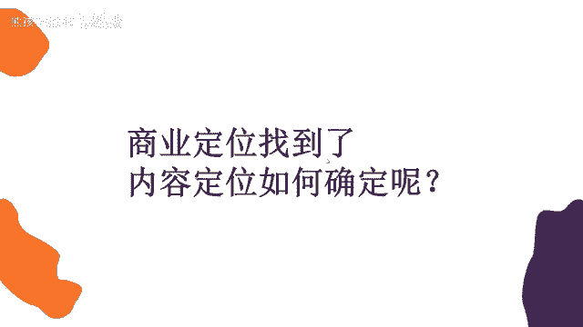
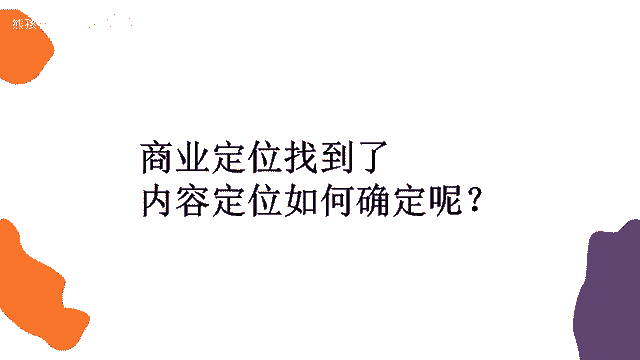

# 【150集精华教程】抖音运营新手起号 0-1新媒体运营必学课！不要荒废18-30岁，一切都还来得及 - P40：用户思维 - 熊孩子在b站 - BV1Gm42177WV

怎么才能够达到这种引流的效果，诶销售的效果。

那我们可能以销售的思维我们去做的话，你会怎么做，比销售的思维去想。

取决于客户的需求是吧，哎没错哈。

我马上就要讲到了，那取决于客户的需求，那我们怎么才能想到客户的需求呢，其实大家想一下，我们以销售的思维去做，没想到大家喜欢啥用啥，那我们这些技巧，我们这些话术呢，你想单纯用销售的思维去想的话。

我们可能会说我是医美，我能让你变美，你来到我的机构之后，我让你变成有一个蜕变，我们这里的就是这个医生特别的专业，特别的权威，那或者说我这本书特别好，只需要59块钱，今天是七夕节，我还降了十块钱，你买吧。

特别优惠诶，但是这样的内容他在淘宝上是可以的，我们说在抖音上是不可以的，为啥呀。

为啥呀，大家喜欢啥用啥。

市场调研没错，市场调研也是能够帮助我们去完成商业定位的。

那么商业定位完了之后，我们就要再深入的去想了，我们要做内容对吧。

应该先是自己拥有资源，然后想客户的需求。

最后想怎么用自身的需求啊没错，所以我们第一步才是做的商业定位，对不对，首先按我们自己拥有的一个资源。

要么就是你自己有产品，要么就是你自己有电，要么就是你的标签里面有你特别擅长的领域。

特别特殊的领域，对不对，然后我们现在在想了。

我们怎么才能抓住用户的心，让他买你的东西，让他能够引流到你的线下来。

亮点不够哈，因为淘宝和抖音它有一个实质性的区别，我们说淘宝是电商平台，而抖音是一个娱乐平台，是不是，但凡你打开淘宝，就是因为你有什么需求啊，购物的需求，或者是你做好了花钱的准备对吧。

所以在这个时候他怎么给你销营销啊。

他他告诉你59块钱，现在七夕节还降十块，还打五折，你一看便宜啊，你就买了，对不对，但是抖音它是一个娱乐软件，你本来是去抖音找乐子的，是不是诶，老娘图开心的。

这个时候有人给你推销了，你是不是还挺烦的，就稍微有点烦是吧。

你即使再便宜，关我什么事，我来是为了要干嘛的，我是为了娱乐的嗯，你老是跟我说，这个打折那个打折我不想要，对不对，所以我们要站在用户的角度上哦，刚才我也讲了，互联网思维有九大思维。

我们先不管其他的八个思维是什么，而且现在市面上啊，总是会流传出各种各样可能12大思维啊，各种这思维，那思维就是很多概念派的东西出现了，但是我们可以不用管其他的啊，我们永远记住，第一个是用户思维。

永远都要向用户。

他喜欢什么嗯，我给大家举个例子好吧，就比如说我们肯定学习了拍摄剪辑。

对不对，你们也学习了这种灯光打光的知识了吧。

你们学了没有啊，我假设你们学了，比如说你们学会了之后啊。

学的特别好了，我想要把这个知识呢分享到抖音上。

目的呢哦就是为了我要教别人这个知识，让别人也付费也付费买我的知识好吧。

那么我假设这个可能视频中。

可能你有五个知识点，这五个知识点呢就是讲什么啊。

小雪老师讲的是吧啊，那我不知道你们学了什么灯光啊，我我也并没有像老师那么专业。

我随便讲几个，而测光怎么打，打了有什么效果。

底光怎么打，打了有什么效果，蝴蝶光怎么打，打了有什么效果，还有轮廓光怎么打。

打了有什么效果啊，是不是我们可能一个视频里有这四五个知识点。

那么如果是你们把这个知识分享到抖音上。

你们会怎么讲，或者说你们会按照什么顺序讲。

是不是随便想到哪个讲哪个，按测光我们怎么打，它可以让视频更清晰。

那底光我们这样打，它可以让这个画面更恐怖，那蝴蝶光这么打。

可以让我们整个人更美丽，我们是不是按照随机的顺序。

就把这几种光的知识给讲完了。

你可以想一下，你们是不是会这样讲。

然后啊你可能这样讲完之后发出去。

我要起个标题吗，那你的标题会怎么讲，我说卷心菜今天教你三种打光方式啊。

非常有用，赶紧收藏，你会这样起标题吗。

大家可以就是真的去思考一下。

是不是真的思考一下，我们总说啊。

不会是吧，那你们会怎么样怎么样去完成这个视频呢。

怎么样取这个标题呢，不是这个东西都是需要思考的。

我们真的在说用户他到底想看什么，用户它到底需要什么。

那你就要具体到你的视频，即使你的视频只有七秒钟，只有八秒钟，你也要考虑到每一秒钟。

你的用户看完之后有什么样的反应。

是不是，那比如说刚才我讲到测光底光蝴蝶光。

对不对，大家可以想一下，测光人人必会的三个打光神器啊。

好我一会再讲这个标题的事啊，大家可以想一下，比如说测光，我打我可能让视频更清晰。

底光我打我能够更害怕诶，其实我看了之后。

我觉得哦好像是这个样子哦，还有点用啊，还行吧。

然后最后我讲的蝴蝶光怎么打啊，可以让女生更漂亮，对不对。

更漂亮这个东西呢是利益，而底光打更恐怖。

只是一个效果，大家能懂吧，所以你在展示给用户的时候啊。

你要想一下怎么样才能吸引到他们。

比如说这几种打光方式，我可能会把蝴蝶光怎么打，有什么效果放在第一个。

我们女生更漂亮，可以把她的轮廓给打出来，对不对，因为我第第一第一个就是前面几秒的时候。

我好像给别人获得利益的感觉了。

对那么其他的几个你可能只是单纯的教他哦，这个工具是这么用的。

用了之后能有这种效果，对吧。

所以说我们可能把更吸引人的，或者说能让别人有这种利益获得感的放在前面。

是不是，然后再讲到标题这个事情，标题这个事情是什么啊。

就是人人必会的三个打光神迹，有同学说了。

对不对，那或者说啊教你三种打光方式，但是其实啊这种打光神器打光方式。

那那别人会想看吗，哎你打光关我啥事。

对不对，关我啥事就让我没有利益获得感。

那你可以说什么啊，卷心菜教你能把姑娘变漂亮的打光方式。

那这样的话啊，这个就是有一种利益获得感的标题。

那当然我只是举了一个简单的例子好吧，当然具体每个光啊到底打出来有什么效果啊。

是不是光要叠加着使用啊，我也不太清楚，这个你们肯定是更了解的。

对不对，所以说每一秒都要考虑用户。

