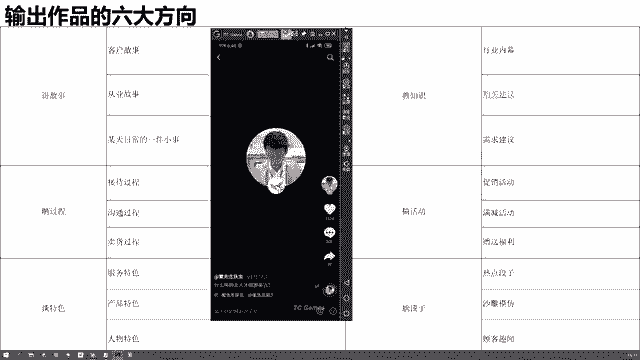
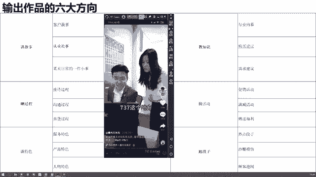
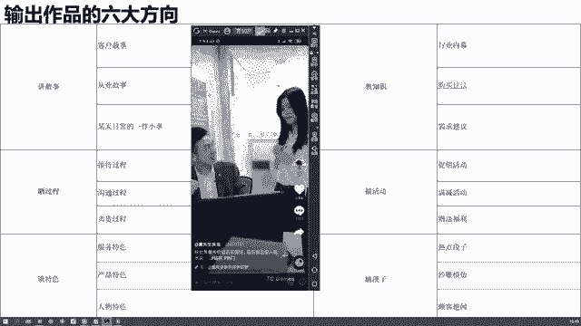

# 【150集精华教程】抖音运营新手起号 0-1新媒体运营必学课！不要荒废18-30岁，一切都还来得及 - P42：输出作品的六大方向 - 好久不见鸭一 - BV15J4m1w7rz

所以说在这里呢啊，这节课后面部分再给大家讲一讲，我们输出作品的一个六个方向，六个方向啊，我们说讲故事，筛过程，谈特色，教知识，搞活动，尬段子，这个呢基本上是所有行业都通用的，输出作品的六大方向。

那其实可以给大家先看几个案例啊，然后再针对不同行业，我们再讲几个不同的选题。

还是打开我的手机，3月份我就开灯了，嗯我们去搜索一下，搜一个做珠宝的，董先生。

好我们去搜索一下啊。

一个做珠宝的人，那么他在他的这个账号里面啊。

他是如何产出内容的，哎我们可以看几个他的视频，然后去总结一下啊。

来首先呢我给你们讲一下。

哎首先我看我给你们挑一个什么啊。

我们找我们找一个教知识的内容，我们看看啊，董先生的这个作品里面。

他有没有教知识。

来像这个钻石定制为什么会这么便宜。

其实对钻石有了解过的朋友就会知道，钻石是不分品牌和产地的。

定制的钻戒，因为没有品牌溢价的部分，所以比商场里的钻石至少要优惠40%。

一点也不夸张，定制的优势在于，每一个钻石都有专业的珠宝鉴定师进行挑选。

那么挑选出来的钻石，吴立芳湖南无哈，甚至于钻石的瑕疵位置都会仔细的挑选，因为钻石的造假成本太高，而且很容易就会被识别出来，所以现在市场上的假货寸步难行，最后我想说的是，定制与专柜各有各的好处。

无论从任何渠道购买认准证书和cc。

杜绝此品，钻石剑刺为你好，那么这个视频我们看完了，其实他这个视频其实就是在交知识，他在说哎为什么定钻石定制这么便宜啊，就越来越多的人悄悄选择了工厂定制，它里面说到了一些啊各种钻石的知识，对不对。

那这个知识不重要哈，但是它的内容方向比较重要，教知识，那可能揭露了一些行业内幕，对不对啊，那是第一个，那么我们再看看他其他的作品都是什么类型的。

来再看这个男生，女生都应该知道的七夕礼物含义，千万别送错了啊，好这个我们的呃作品就不看完了，我们只看他的标题就知道了，那他这个作品呢是告诉大家，七夕礼物的一个含义，你别送错了，我告诉你七夕应该买什么。

对不对啊，他这里会给到一个什么购买建议，对不对，一个需求建议好，这些呢全部都属于交织式这个大的内容领域。

对不对，那么我们再接着往下看。

来我们再接着往下看。

这是一颗8克拉的水滴形粉钻。

周边镶嵌的都是顶级的白钻，那么这一颗粉钻价值大概在四五百万左右。

980感觉让你老公给你买着，把大哥拉走。

好喜欢吗，赶紧让你老公给你买一个啊，她其实呢也稍微有一点尬段子，这个稍微有点尬段子啊，另外呢他通过展示这个8克拉的粉钻，他在干嘛呀，他在谈他的产品特色，对不对啊，它有一点相结合了段子的这个痕迹呢。

不是特别的重啊，但是通过对于这个啊粉钻的一个拍摄，对于粉钻的一个介绍，对不对，他在谈谈他自己的一个产品，直接去展示产品好。

那么我们再接着来看他的作品，还有什么。

好其实这个也属于教知识了，也属于教知识了，你会发现他的作品展现形式多种多样。

我可以拍我自己，是不是我也可以呢，用这种图片的形式。

来再往下看，来看这个，大家知道钻戒是怎么做出来的吗。

今天带大家去我们的工厂去看一下走，嘿嘿嘿。

这台机器呢就是3D打印机，那我们设计了这个图纸。

经过这个3D打印机将这个模型就可以打出来。

清洗完之后呢，我们再进行最后一步就是电镀，电镀完之后，这个介质就不容易被氧化掉了，那么整个介质过程就是这样子，学会了吧，好了你注意看他最后一句话了吗，整个戒指的制作过程就是这个样子了，对不对。

那么他这个视频内容在干嘛呀，他是不是在晒过程呀，他在晒他的什么呀，产品的制作过程，对不对，哎那我们刚才说了，他的内容里面晒晒了过程，谈了特色，教了知识，稍微尬了一点段子对不对。

那他还有别的吗，我们再来看看。

来我们再来看看还有没有别的。

来我们再往下找一找啊，再找一找。

看其实你就是可以找到一个比较好的。

这样的一个视频，然后呢你自己可以去翻一翻。

可以去翻一翻。

好还有什么呢。

哦随便再点开一个，Hello，大家好，昨天晚上我们拍的所有的机宝都要带人报，有什么做律师给你做检测东西，给大家做一个检测，才能给大家发货，大家跟我去看一下检测有没，这边呢就是我们的一个珠宝检测产品。

我们买到的每一件珠宝产品，都要经过都是认识的工作人员，进行了严格的检测，仪器呢都是国内最先进的仪器，这次大家认真看红外光明记者来检测，这边是大家一定要主动一切的检测，我检测完之后呢。

大家可以收到这样一个证书，但这个证书呢是可以在网上查询得到的，大家可以放心在家等收购HELO，大家诶，那么大家觉得他这样的一个视频内容，我们看了那么多，他这个视频的内容是在干嘛呀，是在干嘛呀。

其实也是在谈特色，对不对，刚才我们讲了，他在谈谈它的产品特色，现在他在谈它的什么呀，啊服务有特色，对不对，他有这个证书，然后我们的机器都是特别好的，对不对啊，我们是透明化的，我们给大家看的。

这其实也是在谈特色，来我们再看啊。

啊其实他之前有谈过一个。

有做过一个产品的故事。

给大家找一下啊。

钻石定制为什么这么便宜，稍等一下。

给大家找一个讲故事的植物，今天有一位重量级的粉丝带来一颗大货走，我们一起去看一下。

这个只有10克拉吧，我们镜头拉近一点。

看一下我的天哪，估一下价格200万有吗。

不止哦，2万不止，哇哇哇塞。

真的好大，有点偏微黄，像一个钻石，没错吧。

那你能看得出来他是真的还是假的吗，真假不好说。

我们去那边看看吧，去大车上去看，在家人的这个上面显示了一个415。

吸收封。

就代表你这个暂时是没有问题的，如果说你这个737，这个地方有一个洗手包。

那帮卖完了有钻石也是合成，多少钱买。

300万啊，多花了至少100万。

没事，咱们不差钱，不差钱不差钱不差钱嗯。

好了，是不是它里面还有什么内容啊，啊就是我们说的晒过程啊，谈特色教知识，他还会讲一些客户的故事，对不对，还会有一些粉丝的故事啊，包括可能说什么呀啊顾客的趣闻等等等等，这些内容都是有的对吧。

钻石定制，今天有一位重量来。

我们可以看一下啊，啊它里面的作品真的很多，然后类型的也是比较多的啊。

如果说你想要去了解的话呢，你可以多去看一看他的这个呃账号好吧。

那我们就先看到这，我们先不看了，那它其中我没有找到那个作品。

其中有一个作品呢是给一个粉丝去定制的，这么一个戒指，然后在里面还讲了他的一个客户故事，就是讲他们俩是怎么从这个啊比较贫穷的时候，然后拼搏到比较有钱的日子，然后受了多少苦啊，依然恩爱如初。

像这种客户故事还是比较常见的，好了，那我给他缩小最小化啊。

我们先不看了，那我们从这一个账号里，我们看到了几个内容方向，大体去梳理一下啊，也就是这六个方向出不去这六个方向，所以说呢这是我们给大家总结整理的，如果说当你产出内容没有方向的时候，我们先给你六个大方向。

你去讲故事，你去教知识，你去晒过程，去搞活动，你去谈特色或者是去尬段子，那么每一个大方向下面呢又有几个不同的细分，对不对，那这个表格大家大家如果想了解的话，可以先截一个图。

