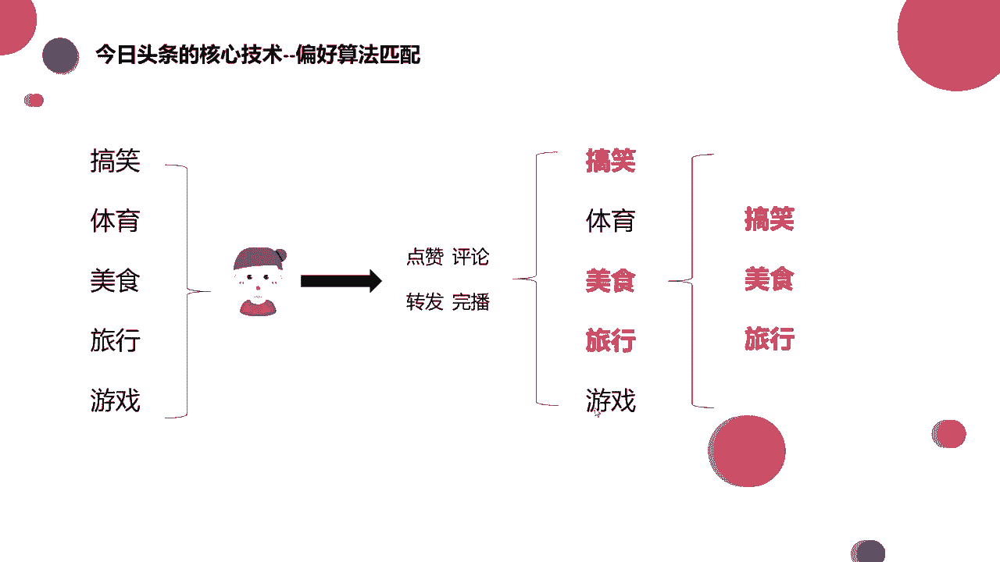
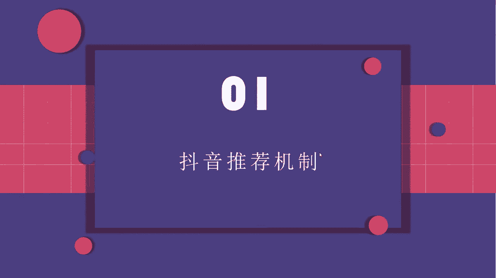
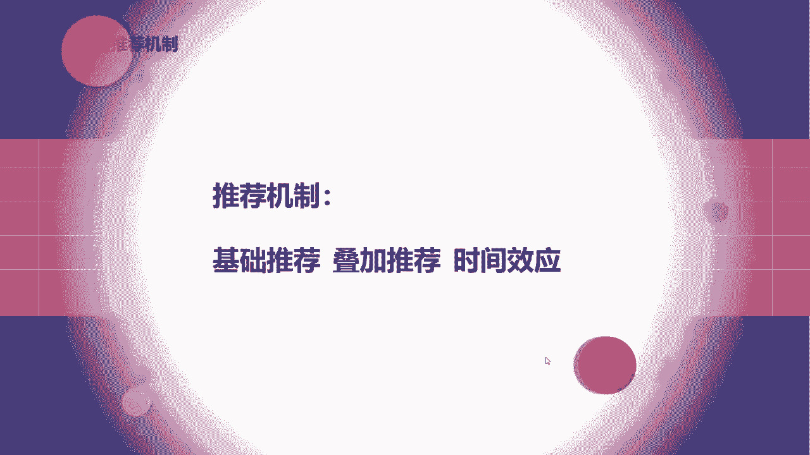
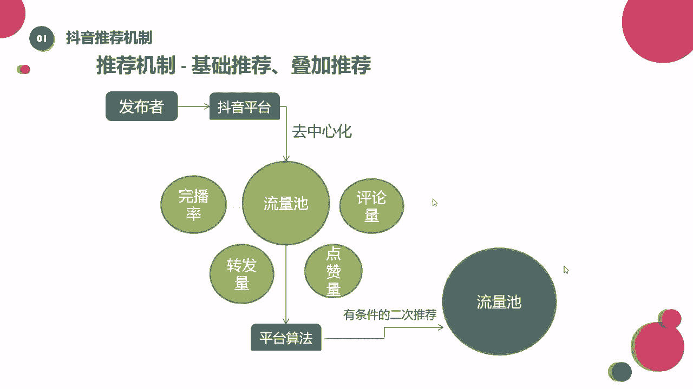

# 【150集精华教程】抖音运营新手起号 0-1新媒体运营必学课！不要荒废18-30岁，一切都还来得及 - P43：推荐机制—基础推荐、叠加推荐 - 好久不见鸭一 - BV15J4m1w7rz

那么啊接下来我们来看看一个作品，在抖音上是如何进行分发的。

这也就涉及到这个抖音的推荐机制了，我们可以看一下抖音的推荐机制呢。

一般我给它分为三个，一个是基础推荐，一个是叠加推荐，一个呢是时间效应，我们一点儿一点儿来看看，来首先我们看到一个作品啊，他在这个抖音上发出去之后，它是通过一个去中心化的机制，来到第一个流量池。

那么这个去中心化的机制是什么意思，就是刚才我说的它是没有任何流量控制的，它的平台是不会给流量倾斜的啊，我们这个叫做去中心化啊，大家简单理解就好啊，所以说只要你的作品还可以，他审核通过了。

你的作品还算比较优质，没有什么大的硬伤，没有违规，那你发出去之后呢，基本上就会来到这个基础流量池，当这个基础流量池里面呢，会有200~500的一个播放量，画一下啊。

基础流量池里就是有200~500的一个量，在这个流量区间内哈，用户会不会对我们的内容产生兴趣，如果说有兴趣的话呢，他就会点赞评论，转发收藏啊等等，对不对，等这些数据达到一个比较不错的水平之后。

那么我们可能有机会进入到下一个流量池，那这个流量池可能啊有500~1000的一个流量，来画一下，500~1000，好这些数据都不是固定的啊，只是举一个例子来给大家讲，那到了这个流量池之后呢。

他会再重复上面的这个步骤，就一个流量池，一个流量池的往前走，那这个呢我们就叫做基础推荐，还有叠加推荐，大家应该能懂吧，其实也是比较简单的，那么决定是否被推荐进流量池的，这个主要的数据啊，就是这四个。

来给大家框一下，像点赞评论转发这个我们就不说了啊，其中有一个呢叫做完播率，大家能看到吧，那么这个完播率是什么意思呢，就是完全播放率，这个数据呢我们在抖音的后台是看不到的，它是不提供的。

给大家简单的举个例子，去理解一下这个数据好吧，那么这个完播率呢，啊就是啊假设你去看这个视频，这个视频呢有50秒，50秒钟，那如果你只看了十秒，你就划过去了，那这个视频相当于你没有播放它，你只看了1/5。

对不对，但如果这个视频它是50秒，你50秒全都看过了，那相当于你的完全播放率就是百分之百，大家能懂吧，能懂吧，一个是25%的完播率，一个是百分之百的播放率，那哪个更好呢，肯定是百分之百的完播率更好。

对不对，所以我们经常给到咱们同学的建议是哈，如果你是刚开始做做这个抖音号，你是新号的话，最好刚开始发的这个视频的时长不要特别长，可能啊七秒钟往上十几秒钟，20几秒钟就OK了，为什么。

因为这样可以提高完播率嘛，如果你一下发60秒的时候，你的质量不是特别好，你还没有做到特别顺手的时候，那别人可能就不会把你这个视频看完，你就会影响到这些数据，影响完数据之后呢，你就进不了下一个流量池。

对不对，那这个大家都是能够理解的，那么这些量啊我们把它加在一起统称为互动率，因为转发啊，点赞啊，评论啊啊或者收藏啊，这些呢都是用户跟我们作品的一个互动，对不对，我们把它统称为叫做互动率。

那么这个概率达到多少，才会进行一个流量池的再次推荐呢，啊其实不同领域的互动率呢它是不一样的，我们可以来看一下，我们简单地把领域分为，分为热门领域和冷门领域，也就是小众领域，其实我们可以看一下哈。

像热门领域啊，热门领域有啥有美食，美妆服装，像搞笑啊，旅行种草这些，他对于这个年龄，还有对于职业，对于地域的要求都不是很高，因为吃的东西人人都吃衣服，每个人都穿搞笑的，谁都爱看，对不对。

那像这种呢它就是一个热门领域，也就是一个什么呀啊比较热门的类型，像这种领域呢啊，他的一个互动率达到8%到10%，就是比较好的一个互动率了啊，大家知道互动率怎么算吗，啊比如说我算那个点赞。

点赞量除以播放量，他得到的是一个点赞率，这就是我们的互动率或者评论量啊，除以我们的播放量，得到的也是一个评论率，大家能懂吧，啊小学数学哈啊非常简单，那这个是热门领域，那小众领域也就是冷门的领域哈。

它对于这个地域或者是男性女性啊，包括说这个年龄职业的要求就比较高了啊，呀或者是推送给一些有需求的人，比如说像搞笑的，他没有需求，他也可以看，对不对啊，但是你说像婚纱摄影，家具装修的。

他可能有兴趣了才会去关注到这里是吧，那像小众领域给大家列举到的有三农健身，新媒体营销，像婚纱摄影，家具装修等等，还有很多哈，还有很多，那这个小众领域的互动率呢，大概达到3%到5%，也就差不多了。

大家知道，所以这个数据呢它不是具体的，没有具体要根据你做的这个垂直领域去判断啊，当然垂直领域也分为几级哈，一会给大家再看一下，好吧，这就是我们说的啊，基数推荐，还有一个叠加推荐啊，再来看一下这个图。

