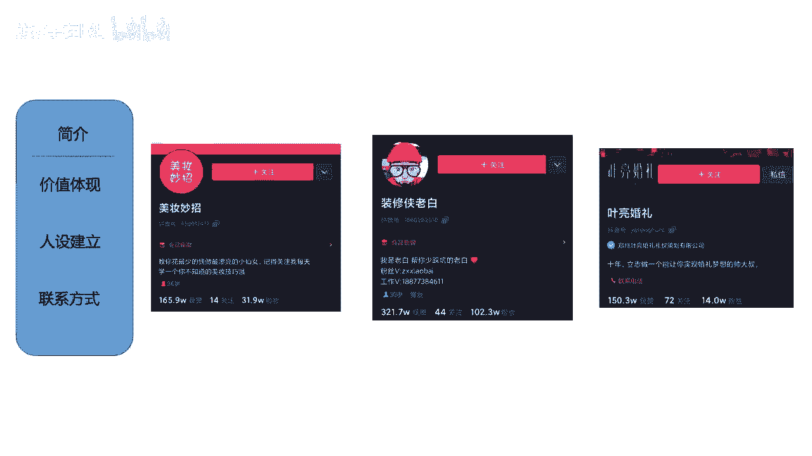
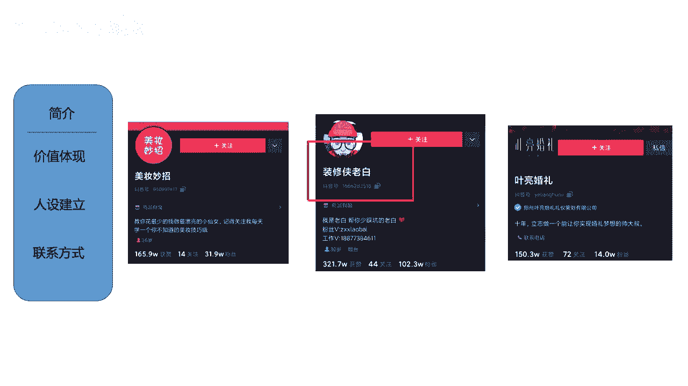
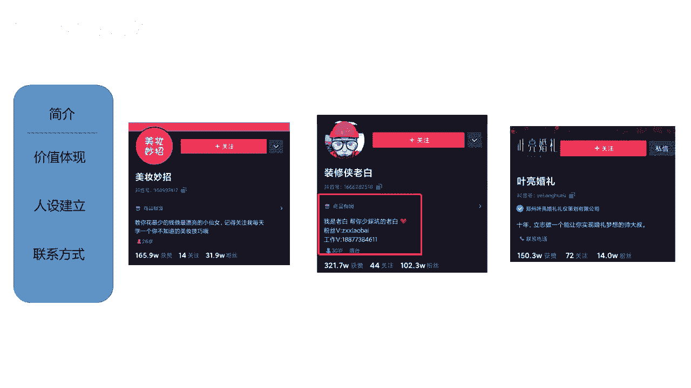
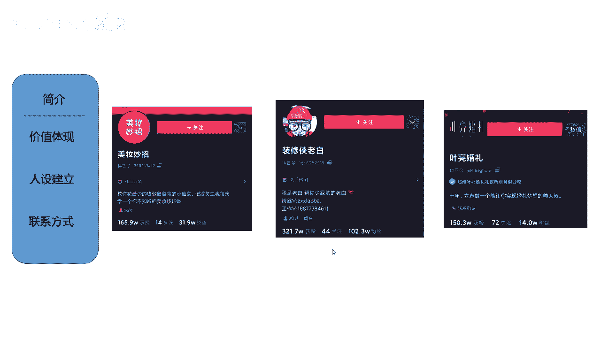
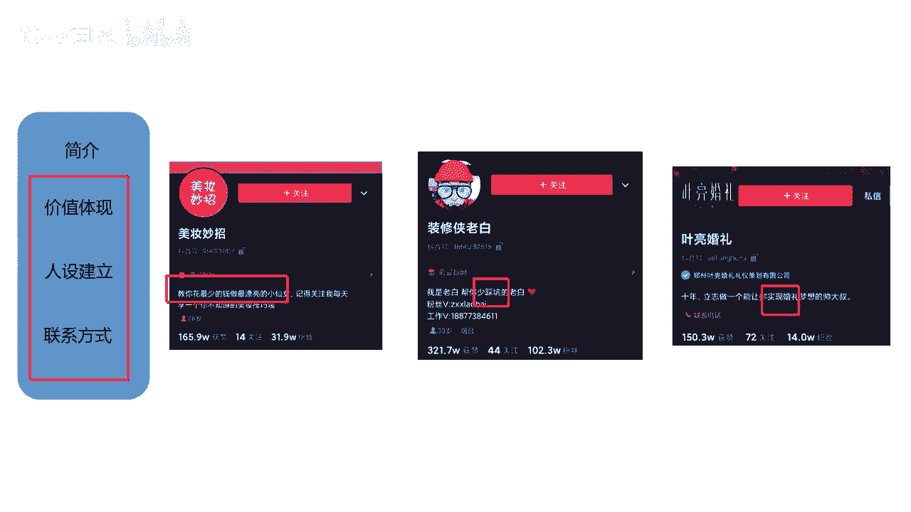
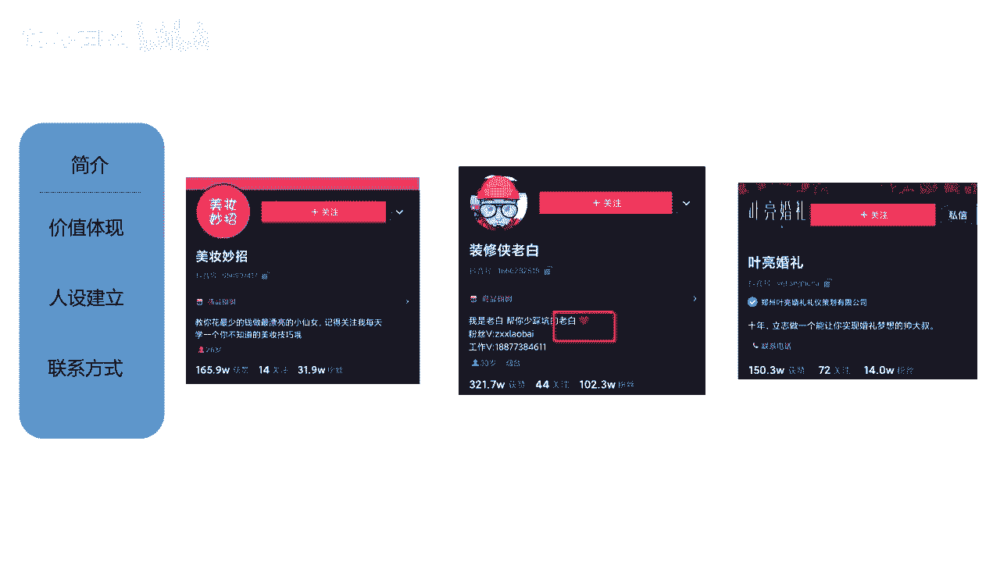
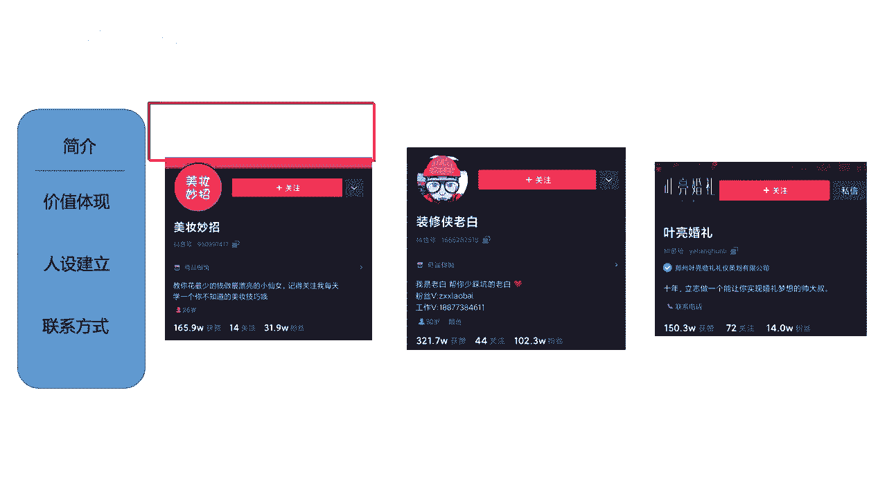
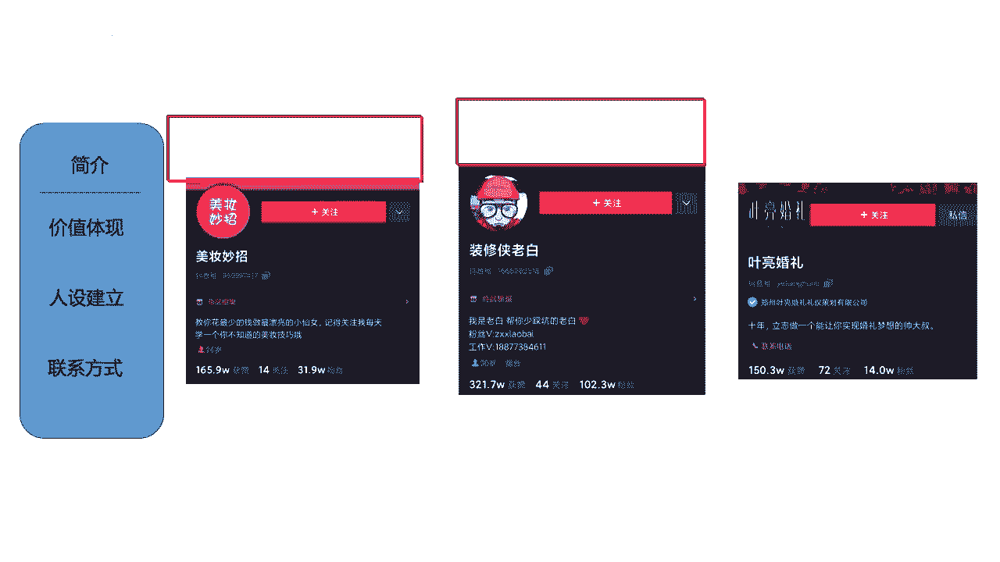

# 【150集精华教程】抖音运营新手起号 0-1新媒体运营必学课！不要荒废18-30岁，一切都还来得及 - P48：账户简介 - 熊孩子在b站 - BV1Gm42177WV

我再来讲简介，那么简介应该怎么去做啊，大家注意简介呢就是把昵称去做一个细分啊。

大家就是直接粗暴告诉别人，你是干嘛的啊，是是是这个样子，但是在里面也要注意几个小细节啊，稍后我把这个总结的知识点呢给大家看好吧，来哈，然后我们讲这个简介简介，把昵称做细分了啊，比如说我们来看一个啊。

像这个装修老白，装修侠老白，它里面我们看到昵称里面它带有装修。

然后他带有人设，老白对不对，那么他在他的这个简介里面。

也一定会涉及到的关键词，就是老白。

对不对，涉及到的是什么装修，对不对，其实就是把它细分出来，然后再做一个补充，我是老白，帮你在这个装修路上少踩坑的老白，对不对，或者我是老白，在这个装修行业摸爬滚打了10年的老白。

要有这样的一个行业对，这是我们要体现价值，然后把我们的人设讲出来。

那么其次呢，其次就是我们要怎么样留联系方式了啊。

留联系方式，那么这个地方呢我要给大家讲一下啊，留联系方式，当我们是1万粉丝以下的时候，1万粉丝以下的时候，最好不要写联系方式。

你看他这里留的是联系方式啊，最好是1万粉丝以下不要写，而且在私信里面也要少说微信两个字，因为昨天给大家讲过哈，我们不是有那个引流咨询这个事情吗，那么引流咨询的话呢，我们一定会涉及到你加我微信吧。

你加我QQ号吧，啊你来到我的线下吧，对不对，一定会涉及到这个事情哦，当他给你私信的时候，你有可能就是你加我的微信号，什么什么什么，那么之前我们有的账号啊，就是因为这样直接去做引流，然后就被评级了。

就是账号就废掉了，大家知道吧，啊那个时候经常就在私信里跟别人说，你加我的微信号，然后导致整个微信就被整个我们的抖音号，就被评级了，如果说你要引流的话，你最好是在私信里就说你就加我的号就行，不要提微信。

也不要提QQ，就加我的号对吧，这个应该不会有人听不懂吧，那就基本上他们都知道了，我要去加你的微信了啊，这个一定要记住啊，这个一定要记住，这个是很重要的一点，还有就是呃1万粉丝以下。

不要去先更改我们的这个啊，简介里面的联系方式，不要去添加好吧。

那这个要注意，然后我再给大家总结一下简介。

我们要三个点，第一是价值的体现啊。

就是我要教你变小仙女，我要让你少踩坑，我要实现你的婚礼梦想。

这是我的价值，第二就是人设要有老白，是不是还有一个什么呀。

帅大叔人设要有，其次就是联系方式留下嗯。

这是我们的简介需要注意的几个点好吧，那么其实头像啊简介啊，包括我们的昵称啊，还是比较简单的，那么接下来我们再讲一讲头图这个事情，那么头图大家知道吧啊。

就是在昵称上方的一个图片，在这个位置啊，基本上大家都采用这种引导关注的头图。

在这个位置我给截掉了啊。

在这个位置的图呢叫做头图，我们先来看一下头图的尺寸。

好吧好了，我在这里非常不要脸的，把我自己的照片放在这里了，来我们可以看一下，那么头图的尺寸，它要求上传的尺寸是一个，1125×633的像素，这个是他要求的上传的头图尺寸，但是实际上你传上去之后。

你会发现它会遮挡住一些边边角角的位置，所以我们说核心尺寸，或者说能让用户看清楚的尺寸是，900×400像素，大家知道吧，那这个尺寸大家要注意一下，虽然说我上传的是125×633。

但是可能用户看到的只有900×400，那在这里其实大家可以注意看一下，我给到大家的这张图片啊，你看本身的话，125633，它是一个满屏的，看起来还不错，唉但是当我用900~400这样一节的时候。

我发现我上面的眼睛看不到了，对不对，我上面的脖子也看不到了，就会出现这样的一个问题，所以说大家在做头图的时候呢，也要注意这样的一个尺寸问题，好吧好了啊，那大家这个尺寸可以记一下，可以记一下。

然后呢我们来接着看一看啊。