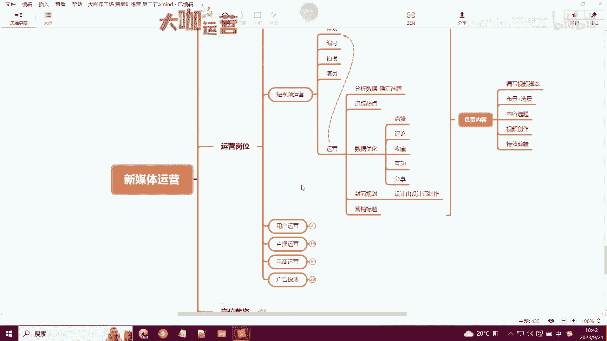
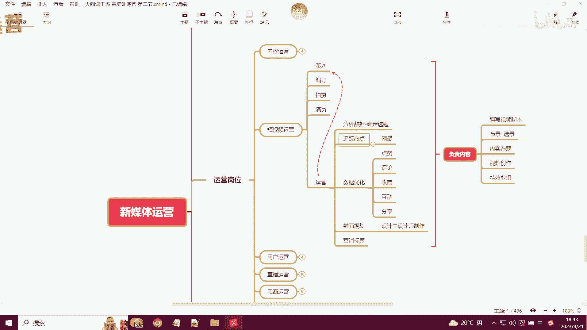
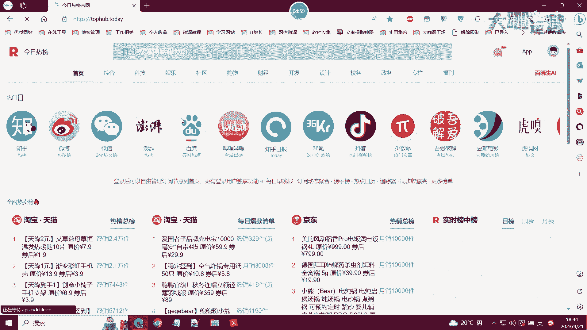
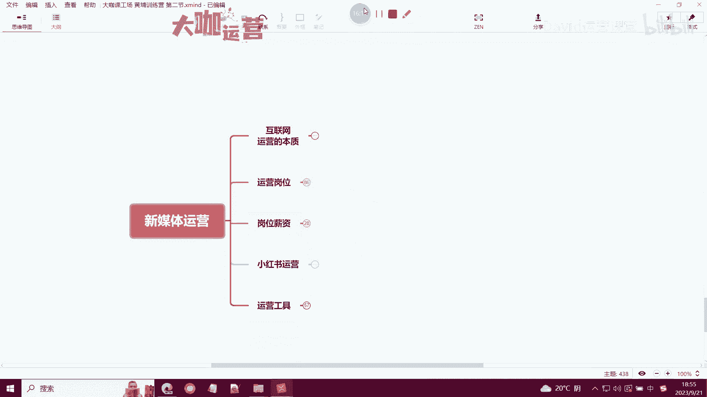

# 【200集精华教程】新媒体运营新手起号从0到1必学课！7天搞定小红书运营技巧／短视频剪辑／Ai文案撰写／抖音运营零基础入门课程。 - P36：18：新媒体运营-新媒体运营行业各个岗位的超全面解析 - 方老师运营课堂 - BV14y411e7XC

OK好欢迎大家来到我们本堂课，那么这一堂课呢我将通过这么一节课的时间，让大家清晰的了解到，现在做新媒体运营的他的一个所有的岗位划分，以及岗位的具体职责，OK首先第一个是关于内容运营。

那么内容运营这一块呢，属于就是我们新媒体运营这块，最基本的一个岗位了，他主要是做一些内容策划呀，内容编辑，还有内容发布这一块的内容，就说简单点就是写文章啊，然后呢去剪辑视频等等等等。

把这些东西弄好了之后呢，然后发布到平台，这些内容呢可能不一定是你自己创作的，也可能是我们去找地方，其他地方copy的，然后修改的等等，反正就是一个比较基础的工作啊，所谓的就是一个内容运营。

那么我们以前呢可能就是说还有一个名称，叫什么叫新媒体运营的一个专员，对吧啊，这个这个岗位其实你一去搜的话，你就可能可能知道啊，这个岗位的薪资呢不会太高啊，不会太高，一般的做新媒体专员。

主要的工作内容就是这三个啊，比较简单，也没有特别复杂的逻辑，你只要懂一点基础的运营运营的这种思路啊，关键词啊，布局啊，然后这些东西基本上就可以做了啊，可以做了，甚至说啊哪怕你不会对吧。

你进去之后有人带你，可能说你学个那么个把礼拜，你就知道这个内容运营这一块到底怎么去做，OK那么这个时候呢，其实运营这块内容运营这一块，我们呃有时候可能自己涉及到的东西不多。

像运营的平台这些我们也不需要自己去了解，因为小白嘛对吧，这个地方可以完全称之为小白，就有时候像应届生啊，大家刚毕业的时候，可能出去做运营的时候，你刚接触的就是这个岗位，那么第二个是短视频运营。

短视频运营就会呃比较复杂，也比较有深度啊，也是我们比较核心的一个岗位，短视频的话，首先它的一个整体的一个岗位构造啊，也是由这么几个岗位来构成的，首先第一个是策划对吧，然后呢策划呢其实也可以。

有时候是由运营这个岗位这个人来担任的，相当于是短视频的运营的一个总负责人，那么还有编导拍摄，还有演员这些啊，都有特定的角色啊，都有特定的角色，相当于是一个短视频运营的一个部门。

是由这些人啊这些岗位来组成的，那么编导就不用说了，编导就相当于是呃，我们的策划给了你一个主题啊，然后你编导需要围绕着这个主题去设计，我们的一个拍摄脚本，视频的一个拍摄脚本在哪里拍，选景等等。

这些是由拍摄啊，我们的编导啊，选景是由拍摄来制作的啊，然后编导就相当于是策划我们这一场呃，就是短视频的一个内容，然后呢拍摄就相当于是一个具体的拍摄负责人，然后需要我们刚才说的选景对吧。

然后我们需要去呃设计镜头啊，这个在什么什么什么样，什么样的一个形式下去拍，然后还有一些设备呀啊调试啊等等，这些是由拍摄人员来负责的，那么像演员就不用讲了，演员的话可能很多呃，我们去公司上班的演员。

基本上都是公司里边内部人啊，内部人很少有说专门去请请这个啊演员啊，这个代价呢比较高，而且呢产出内容呢也没有办法去持续啊，所以说啊演员这个岗位呢，可能很多时候他比较少啊，比较少。

那么运营就是我刚才说的这个策划对吧，其实有些呃，公司的这个策划就是由运营来担任的，那么运营他要做的事情就比较多了，只要涉及到运营，他的事情就会比较复杂，比较高级比较高端啊。

首先第一个我们要分析数据来确定选题。

也就是说运营的工作，我们今天要拍什么，我们后面要拍什么，我们这个月要拍什么，都是由运营来做确定的，运营来告诉你，你今天这个阶段你要给我产出哪些视频，这些视频可能会成为热点。

或者说可能是我们的用户他们喜欢的内容，那么你就照着这个内容来给我啊，你编导就照着这个内容来给我策划主题，然后呃去拍，最终给我想要的视频对吧，这是确定选题，然后是一个追踪热点，追踪热点呢呃其实怎么理解呢。

就是我们平时大家所谈到的一，个叫网感的一个东西，大家应该听过啊，所谓的网感就是我们要去关注互联网，关注市场，整个我们这个行业的市场，关注整个互联网的一个大势趋势是趋势，或者说有哪些新出来的这些东西啊。

热点事件或者说公众人物这种啊，知名的事件跟我们的产品能够挂上钩的，那么这个时候我们就要要求要求我们的策划，根据这个要求我们的编导啊，根据我们提供的这个热点来创作一个视频内容，好吧。

这就是呃运营平常要做的，比如说我们每天上班了之后哦，打开一个啊热点的一个追踪网站啊，比如说我这里给大家提供一个啊。

啊比如说这个热点网站，我们有时候上班了之后呢，会在这个地方呢去观察一下。

今天啊有哪些热点出来了，然后像知乎，知乎上面有什么样的热点，然后B站上面现在又有什么样的一个视频，视频成为热点，然后抖音小红书等等等等，那么根据这样一个热点上面去发现，我们可以创作能够跟热点挂钩的内容。

OK那么这就是追踪热点的一个工作，然后数据优化就不用讲了，我们运营是是需要对最终的一个内容的效果，去负责的，哪些效果对吧，我们的点赞评论啊，关注互动分享等等，这些数据都是我们运营最终要去达成的。

比如说我策划了这一个账号，那么我需要这一个月涨1000粉或者涨1万粉，那么我前期我要优化的这些数据，就是我的一个方向对吧，我今天的数据有什么样的一个提升，然后我最终是否能达成我的一个目标。

我的这个呃岗位啊，我的一个绩效是否能完成对吧，这就是我们的一个数据优化，那么封面规划，封面规划的话，其实现在很多还是由运营来做的啊，运营来做的，但是一些大公司呢可能是怎么说呢，可能是由设计师去制作。

但是封面的一个规划是由我们运营去提出的啊，也就是说我们平常能看到的那些小红书，上面看到还不错的这种封面，它是有一定的这个运营思路包含在里边的，你的封面我们之前跟大家讲过，小红书的运营重点，封面是第一点。

封面是第一点，记住了啊，封面是第一点，对于大部分用户来讲，绝大部分用户来讲，封面就是第一点，第二点是标题对吧，这两点是引起你这篇笔记的一个点击率的，核心两点因素，那么封面的设计一定是至关重要的。

我们很多人他设计的封面真的是一塌糊涂，或者说这个封面就是没有设计，只是单纯的去截一张图，他也不知道封面上放什么内容比较合适，那么这个时候我们就需要有一定的运营思维，来了解封面怎么样去设计。

才能引起别人的一个观看的兴趣，好吧，然后的话像营销标题这个，我们之前的课程其实已经给大家讲过了，我们讲的那些呃标题的几个写法，以及标题的这个模板都已经分享给大家了，写标题一样啊。

是我们强调的一个重动作里重要的一个点啊，然后那个负责内容这一块呢，就是我们总结的关于短视频运营这一块啊，其实这一块的整个呃他的一个涉及到内容对吧，短视频的呃就是他的一个拍摄啊，以及短视频的制作里边。

像视频脚本对吧，布景选景嗯，啊不仅选景内容选题，视频创作，还有特效剪辑等等，那么这一块呢就是我们整个短视频运营里边，在制作这一块包含的一个核心内容，OK那不是短视频运营，还有用户运营，什么是用户运营啊。

也就是我们现在玩的比较高端的一种，就是用户从平台通过你的内容，到了你的私域之后，你怎么去维系你的用户，怎么去把你的用户做的活跃起来，那像社群运营，私域运营，这些都是经常要用的对吧。

比如说社群运营做哪些工作，就是我们把用户引过来之后啊，他到了我们的这个呃圈子里边了，我们怎么样去让这个群里边的这些用户，让他们保持活跃对吧，我们需要去维护粉丝群，然后我们的业务群去保持用户。

他们有一个活跃度，那么用户活跃代表着什么，代表着我们给他发广告的时候，他能看得到，OK那么这就是社群运营的一个关键目的，那么像这个呃现在抖音啊，还有小红书啊，以及这些很多新媒体平台。

其实他们都有自己内部的一个用户的，一个这个呃就是自己的一个社群运营，像这个抖音，其实抖音在这个抖音平台上面，它也也有自己的一个官方的这样的一个呃，直播教学的这样的一个直播间对吧。

这么你们你们应该也刷到过，还有抖音的这个粉丝群，小红书的粉丝群等等，这里边都涉及到社群运营，这需要我们这样一个呃岗位来负责，然后私域运营就很就很重要了啊，这个这个点是非常非常重要的。

私域运营就涉及到了用户的一个成交体系，就很多时候，这个所谓的私域是由我们运营以及公司的这个，销售人员协同处理的，就是说我们运营人员把这个用户引流到了，我们的私域之后，比如说我们的微信。

那么销售来对这些用户进行一个私域的这个呃，用户的活动的一个分发，来跟他们去聊天，去刺激他们的一个消费等等等等，这就是私域运营的一个版块，它的核心关键点就第一个私域引流啊，私域引流。

第二个就是活动的一个分发，也就是说我们销售的一个对接，这是关于用户运营，那么直播运营啊，第四个直播运营，直播运营，首先这个运营呢这个岗位他是有很多很多啊，就这个这个部门啊，其实可以称之为部门了。

直播这一块，它这个部门是由很多个岗位来构成的，首先一个直播的总导演，总导演的话，可以理解为是直播流程的一个总负责人，然后主播就不多说了啊，主播这一块有两个，一个是主播，再加上一个副播。

那么复播可能是在主播有这个急事的时候，来顶替的一个岗位啊，或者说平时配合主播来做直播的一个助手，那么这个真正的这还这个这个主播助手呢，会单独有一个啊，有些做的比较好的直播间。

会单独有一个直播助主播的一个助手，那么这个助手是做什么的呢，就是说呃像我们平常主播有一些什么需求需要，就是没办法在直播间直接讲出来的时候，就需要打一些手势啊，或者是一些其他的方法。

去让我们助手来协来协同去操作啊，去操作，那么这个助手呢，其实就相当于是全程为主播服务的啊，全程为主播服务的，然后投手呢投手也就我们之前跟大家讲过啊，投手其实也可以称为一个叫什么SM的，一个负责人。

也相当于是他是一个广告，竞价信息流的一个投放专研，这个岗位也非常重要，他负责了我们整个公司所有的广告开支啊，它涉及到了我们这个广告能不能啊，推送给我们精准的用户，以及我们投放的广告。

最终能不能形成一个ROI正比啊，RI正比，比如说我们投入的这个1万块钱，我们最终啊我能不能回到2万3万，是这样的啊，这就是我们的一个ROI啊，也就是说我们投手这个岗位需要去负责，这个岗位非常重要啊。

就是很多在这个呃需要去靠这个投投流啊，就做广告的这种直播间里边，它的作用非常大的，每一场直播都需要进行进行，经常精心的一个策划，还有一些做这个企业产品的，像做信息流啊，还有一些其他的产品。

那这个岗位呢可能是还会稍微轻松一点，就是你把这个广告后台搭建好了之后，你把这个人群锁定了，那么后面你计划也搭建好了，你就照着这个计划去跑，那么你的后台基本上不会出现太大的问题。

然后呢有些地方啊这个直播的话，可能还会有一个专门的负责一个上架专员对吧，产品的一个上架专员，他主要负责上架我们的新的库存啊，上架产品啊，修改我们的库存，然后修改我们的这个产品的一个卖点。

然后在我们上架不同的产品的时候，在直播间里边，显示我们这个产品的一个对应的卖点，OK这是一个产品的上架专员，还有直播场控啊对吧，还有剪辑对吧，剪辑的话就相当于是后期的处理对吧，就时时盯着我们的直播间。

你像小杨哥他们的直播间，基本上每一场播完之后呢，我们还能通过各种各样的一个产品，品牌方他们的一个广告对吧，这个广告呢可能就是截取的，你直播间里边的一个精彩片段，可能有搞笑的呀，可能有什么样的。

但是核心主题肯定就是你这一场直播里边的，精彩的东，精彩的内容，那么这个东西呢，就需要我们特定的一个剪辑人员去监控啊，以及去剪辑产出，也就是说我直播完了之后，你必须得要把这些内容够。

内容里边特别精彩的地方，你给我提取出来，然后把这些内容发出去啊，吸引用户，OK这直播运营，然后电商运营的话呢，可能还是相对来讲还比较复杂的一个东西啊，电商运营呢其实在我们传统的一个电商平台。

像淘宝拼夕夕啊，这个京东啊等等这种电商平台上面，是担任着一个非常重要的角色，他其实可以理解为整个店铺的一个总控负责人，像我们店铺销售的一个运营啊，还有店铺的一个评分，控制店铺风险。

店铺的节假日的一个活动策划，以及店铺的广告投放对吧，还有我们的发货物流管控等等，这些内容，基本上很多都是由电商运营负责人来负责的，那么这一块呢，你要学习和掌握的内容其实还是挺多的啊。

一般人如果说你没有个几年的经验，你可能这一块做不好，你进去的时候，只能简简单单做一下广告的投放啊对吧，节假日的活动策划，可能你也做不好，像这个评分评分的话，这个里边有一些特定的操作方法。

是不是这就是我们讲的一个电商运营啊，然后呢最后就是一个广告投放，其实我刚才有讲过啊，就是没有分那么细，没有分那么细，广告投放单独拉出来聊一聊，就是呃我们在这里称作为一个广告优化师，SEM投手啊。

反正他有很多称呼啊，像抖音的话对吧，抖音的话，我们现在有信息流飞的小小店随心推对吧，还有这个训练千川抖加等等，这些投放的一些方法，你作为一个投手，你必须得了解是怎么玩的，他的后台是怎么操作的对吧。

信息流这一块，包括CPCCPMCPAOCPA这些东西，到底他们都是什么意思对吧，你得要了解，你得要知道，那么这个就是我们关于投手抖音这一块，抖音现在呢可能他玩的比较花对吧，他这个投放的方式有很多。

但是所有的投放的最终的结果都万变不离其宗，OK这是抖音，还有B站的话，B站的话可能有它的一个站内的一个信息流，还有一些起飞的推广，那如果你是做科技类产品的这种up主对吧。

或者你们公司运营的一个这样的账号，需要你去做投放的时候，你就得知道B站的信息流是怎么投的，怎么合作的，有甚至有哪些要求，然后呢起飞推广里边到底是怎么玩的，它的最终的结果的展现形式是什么样的。

OK这是B站啊，小红书的话就一种嘛，小红书信息流，那么小红书以前的信息流可能还分的比较细，像有落地页啊等等，那么现在没有落地页了，基本上都是站内完成一个沟通啊，他的信息流就是这么简单。

OK那么这是我们本节课要跟大家科普的运营，新媒体运营当中的几个非常重要的一个岗位，那么如果你日后你从事这个岗位的时候，你就得知道这个岗位他负责的是什么内容，你要做这个岗位，你得学会哪些东西。

你才能完全操盘对吧，你操盘后你学会了这些东西的操盘之后，就代表着你可以去跟老板谈更高的薪资对吧，你可以去带人，那如果说诶你现在去做的是这个什么来着，如果说你去做的是一个内容运营，那就不要谈了好吧。

先把自己的工作稳住，能够把自己给自己积累一些，这个运营方面的经验，因为一般你能去做运营，内容运营的时候，你的公司里面是肯定有一个，能够带着你们去做运营的这个负责人的，那么你跟着他也能学到不少东西，Ok。

