# 【2024B站全套系新媒体运营教程】小红书运营／短视频投流技巧／起号涨粉／爆款视频打造技巧 转行新媒体全平台运营教学！ - P11：10、新媒体运营第五课：流量分发机制-审核机制mp4 - 大咖私域运营 - BV1vMeFeTE95

大家好，欢迎大家来到我们这一堂课，我是方宇老师，那么这一节课呢，我们来聊一聊现在新媒体运营这一块。

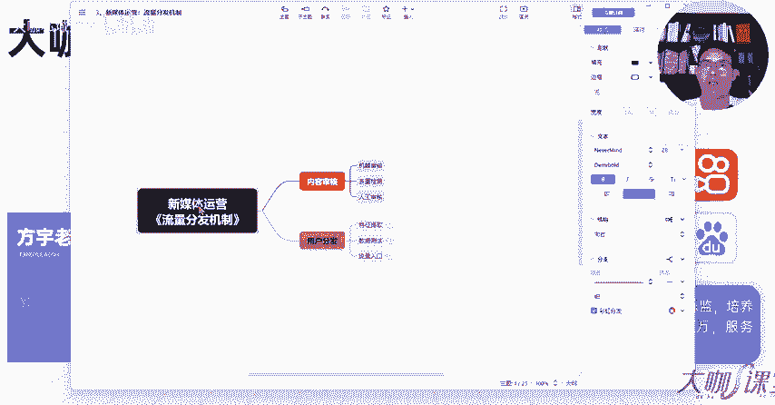

关于内容的一个流量分发机制，也就是说从我们的视频也好，我们的笔记也好，发布出去之后，它的一个进入到审核，进入到最终的一个流量分发和流量提升，这中间到底经过了哪些这样的一个，后台的一些处理好吧。

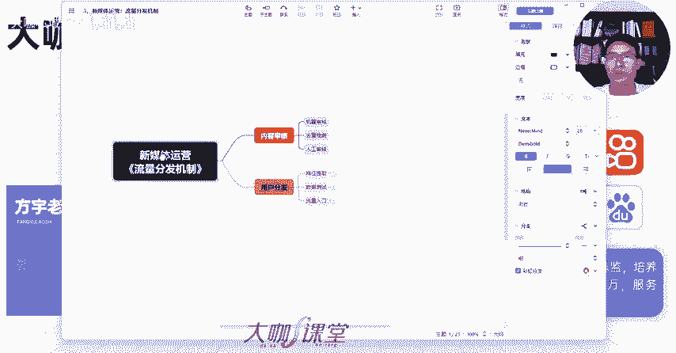

那么首先第一个呢我们先来看内容审核，我们现在所有的平台内容的一个审核啊，主要分为两大块，一块呢就是机器审核，然后呢一块是人工审核呃，但是绝大部分这个内容的一个前期的审核，都是由机器审核来的。

那么为什么说人工审核也是一大板块呢。

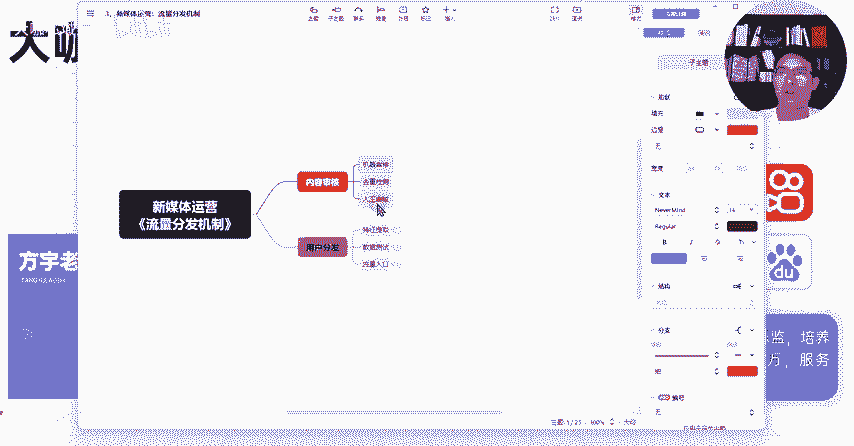

这个我们待会来讲，那么首先我们的笔记发布出去之后。

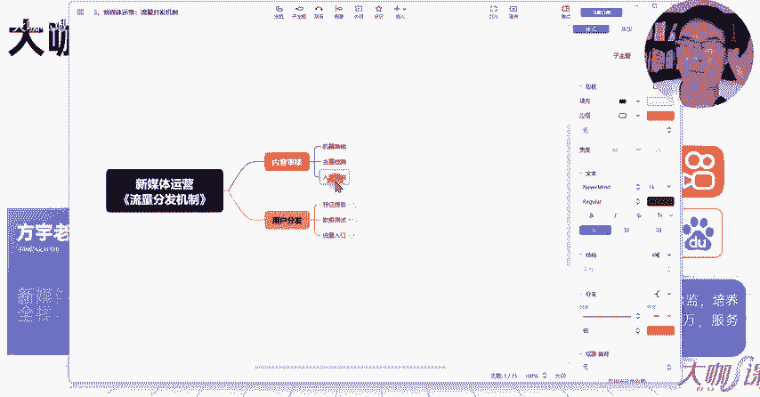

或者说我们的视频发布出去之后，由机器来审核你的内容是否合规对吧。

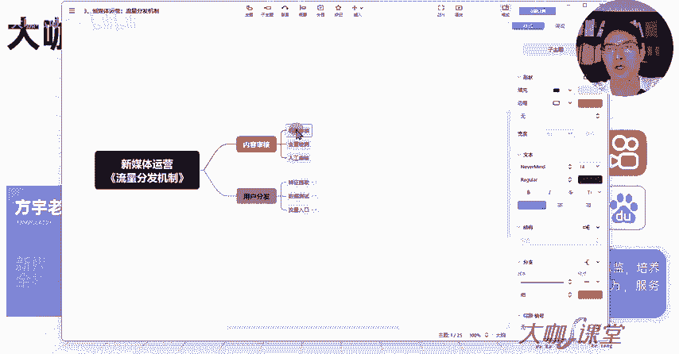

这个合规包含什么呢，第一个首先是敏感词对吧。

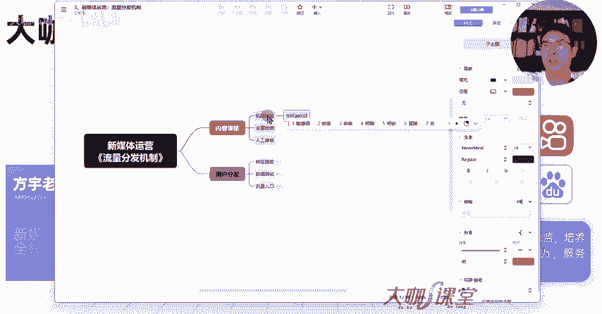

你的内容不管是图文也好，你的口播文案也好，你的这个整个内容的页面也好，你是否包含有一些平台禁止的这种敏感词，这个是第一步对吧，如果有敏感词，那可能就直接限流，你这篇笔记呢基本上没有什么样的一个流量。

那么也有可能是你这篇笔记呢直接审核不通过，直接被打回，也有可能一个是敏感词，还有一个是什么呢，还有一个就是营销广告。

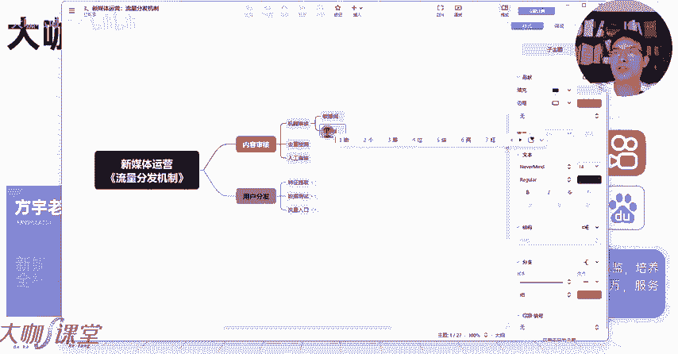

营销广告啊，敏感词，那么敏感词这一块呢，呃我们刚才也讲到它覆盖的范围也比较广啊，敏感词的话呢可能像这个呃简单一点的，像广告法里边的词对吧，广告法里的词违反广告法的词，然后呢还有一些呃法律禁止的词对吧。

这种你们应该能够理解你的是关于什么呃，一些法律不允许的内容，什么政治啊，或者一些其他的呃，我们规定的平台上面不允许有的内容，或者比如说有一些平台不允允许赛道的，不允许的这种赛道不允许你去做的。

上面有黑五类的等等，这些这个是在机器审核第一步，他会给你直接打回的啊，它它会从你的所有的敏感词当中来判断啊，然后呢营销广告这个就很很好理解了，我们很多呃，这也是我们很多同学。

做这个新媒体会遇到的一个问题，我们上来呢做新媒体这个账号，大家肯定都是抱着一定的目的来做的，你这个账号呢不管是后期变现也好，还是说我们去推广我们企业的产品，或者说服务也好。

有很多人上来就直接在笔记里边去讲，我们做什么产品的，我们提供什么服务的，我们有什么什么样的一个价格啊，优势啊等等啊，这部分就会直接被判定为影响广告，那你像现在短视频平台对吧，非投流的这种内容呢。

它是基于什么，基于兴趣分发，基于用户的一个娱乐性的内容分发，然后呢我们的图文笔记平台它是基于什么，它是基于种草分享对吧，平台比较鼓励这一类类型的内容，因为这类内容符合它的调性，那么你上来就做营销广告。

可想而知，你这一部分的流量你不投留，你在没有认证蓝V的情况下，你这样的笔记，前期对你的账号的一个损害是非常大的，所以我们一直跟大家讲，你做图文笔记，你上来先做分享，你先不要直接去做广告。

这个是由平台的一个调性决定的，没有哪个平台喜欢用户上来就给你发广告内容，对吧，这个一定要记得，营销广告其实最主要的审核两点。

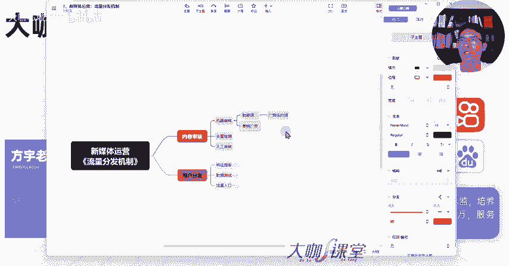

就是这点两点过了之后呢，就基本上就是我们的一个驱虫检测。

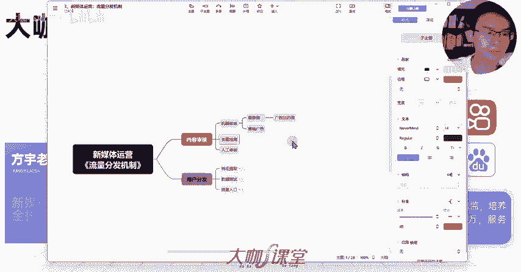

驱虫检测是什么呢，就是每一个平台它会有自己的一个数据内容库，对吧，它的所有的内容在审核通过了之后，这些数据呢是存储在平台的这个数据库，也就是它的服务器的数据库里边，他们的你的内容发布出去后之后。

平台呢会根据你的内容去提取一些特征，然后呢，把这个特征拿来跟数据库里边的，历史内容做对比，那么一旦发现有高度重合的啊，这个重合的部分肯定会有，但是一旦发现有高度重合，甚至说完整重合的。

那么这种呢就可以判定为什么呀，判定为抄袭，那么抄袭的话呢，这个时候呢呃要么两种结果。

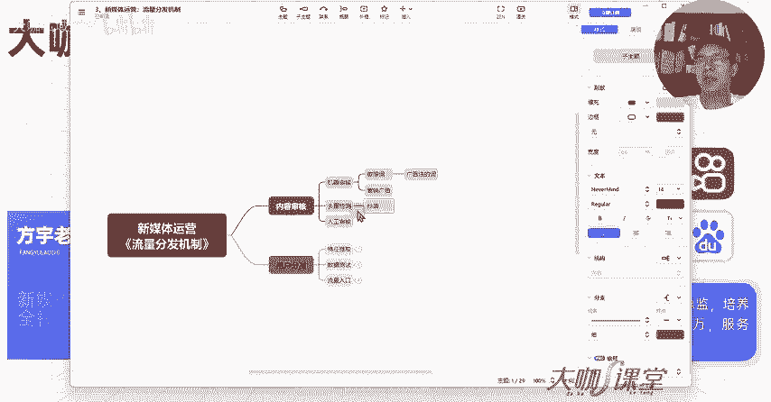

要么就是打回对吧，要么就是打回，要么就是直接限流，现在目前大部分的一个情况会，如果说你是抄袭的话，那么限流的情况会比较严重，这个我们大家可以自行去测试一下，你发跟别人一模一样的内容。

那么你大概率的一个情况下，你这篇笔记可能会被限流，那么这个就是驱虫检测，所以说我们一般做笔记，包括我们上一节跟大家讲，关于内容定位这一块，我们可以去组合其他人，提供内容里边的优秀的价值点。

到我们的内容当中，但是我们一定要去做什么呀，做调整，做优化，你不能完全一模一样的，用别人是怎么去写的，你可以用你自己的一句话来表述出来，这个是完全没有问题的，包括你如果说自己写不出来怎么办。

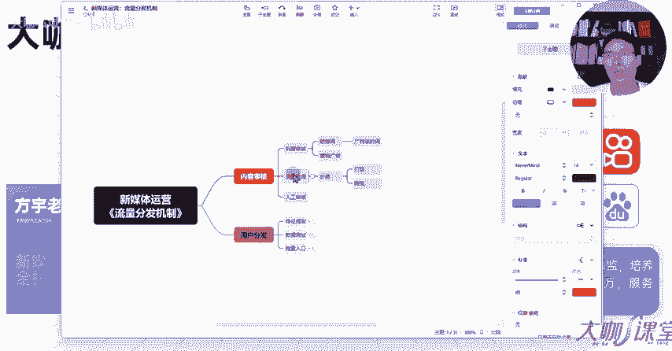

你可以用AI来去进行一个调整优化啊。

但是AI呢你也要会用，OK嗯这是我们所有笔记现在发布出去的时候。

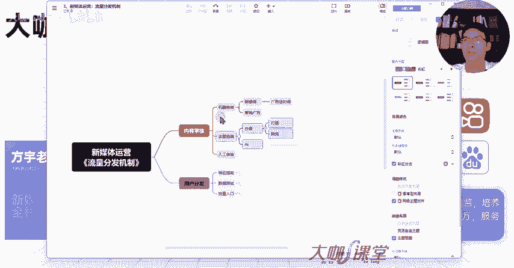

我们的内容发布出去的时候的，初步的一个内容审核的这么一个机机制。

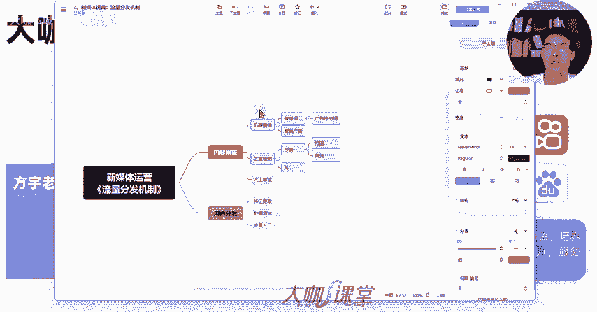

但是呢为什么会有人工人工审核呢，这个人工审核呢。

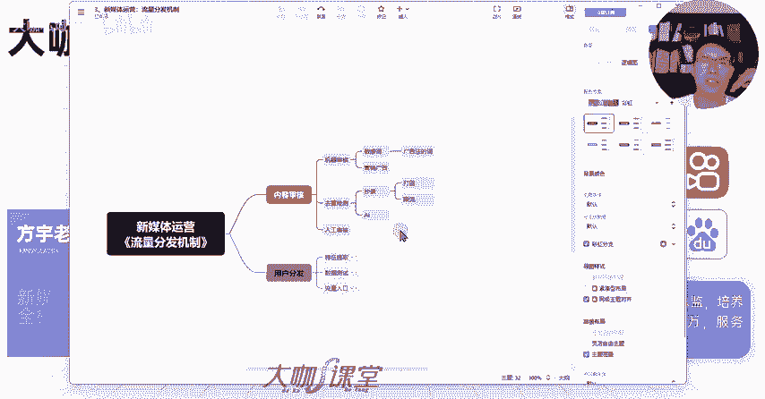

大部分是在什么样的一个情况下介入两种，第一种呢就是我们的机器审核当中，他会发现你的笔记里边有这种敏感词，或者有这种比较严重的，或者有一定违规的可能性的内容，他会暂时给你拉长这个审核时长。

那么在这个审核时长里边呢，会把这个内容丢给人工审核去查看，也就是说我先给你把这篇笔记截留下来，然后呢，由人工来判断你这篇笔记到底是否属于什么，是否属于限流，是否属于违规的这种情况。

那一旦说呃确定了你有这个违规的情况呢，那这个时候呢你的笔记的流量可能就会比较差，那么这个我也跟你们讲一个点，你的笔记一旦在机器审核这一关没有过，丢到了人工审核那一端呢，那么绝大部分情况下是过不了的。

呃这个呢人工审核你们也可以理解一下，所谓的人工审核，它是没有一个很精准的，在人工这边去判断的一个标准，你像机器审核，它可以根据系统设定的这种关键词，系统设置的这个敏感词库。

它来判断你这个笔记是否也有问题，但是人工呢他去查看你的笔记的时候，他分析是依靠什么，是依靠经验，是依靠他自身的判断，那么你第一关都过不了，那么后一关你就不要想了，OK这是第一重人工审核，第二重人工审核。

就是我们每个平台在日常会有内容的一个筛选，和排查的这么一个过程，我们可以理解为，第一个就是打回的的笔记被人工审核。

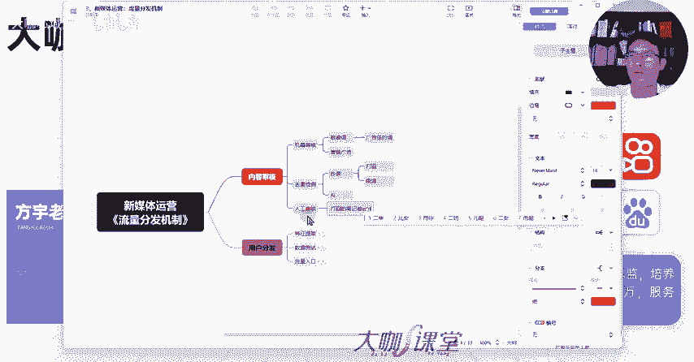

然后第二个呢就是人工排查，这个人工排查呢，就是我们有时候发布的笔记内容啊，或者说我们发布的视频内容，你会发现有一个问题诶，我前段时间这个笔记还发不出去，还好好的，然后呢，结果过段时间这个笔记就被打回了。

然后呢说我违规了，我到底哪违规了，或者说我之前都好好的，为什么之前没有查出来，现在出了问题，是别人举报的呢还是什么呢，两种可能性都有，第一种呢是别人举报，第二种呢就是人工在排查站内内容的时候呢。

发现了你的笔记，他真的他看到了你的笔记，结果发现你有问题，那么就会就会给你打回，每一个平台都会有这样的一个筛查机制，你像这个短视频平台，它会有直播间的整个筛查，还有内容的一个筛查。

然后呢你像我们B站也会有大量的审核人员，再去审核，每天用户删上传的这种大量的视频内容，到底是否合规，那像图文笔记平台也是一样，他们会有大量的人工审核，去每天在站内去浏览各种各样的内容。

去看各种各样的账号，你的内容到底是否合规，你的内容上面是否有一些这个擦边行为，这个就是人工排查的一个过程，所以说如果你的账号到后期，你发现有笔记诶，前面做的还挺好，后面呢被违规了啊，然后被那个呃打回了。

或者说被提示违规，那这种情况下，你要么就是真的没有问题，你要么就是申诉，要么呢你就是认栽，然后这篇笔记呢该删除删除，该隐藏隐藏，只要不是说特别大的问题好吧，那么这个呢其实我也跟大家说一个点。

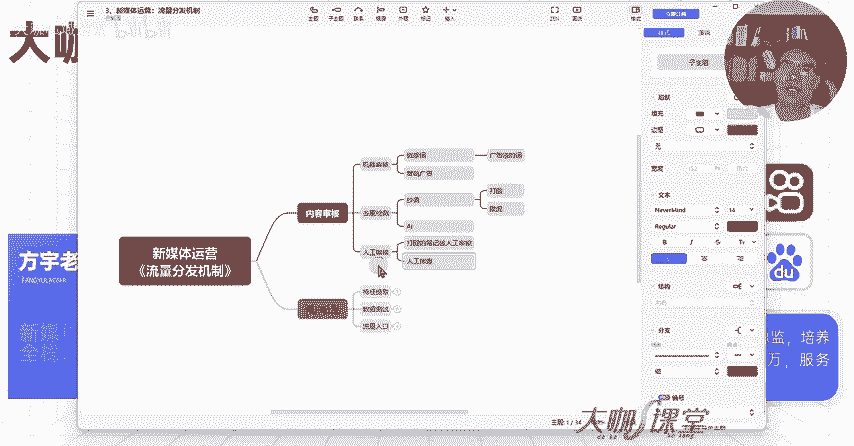

为什么会有人工审核这么一个情况存在哈，我来给你讲一下任何平台它的一个规则。

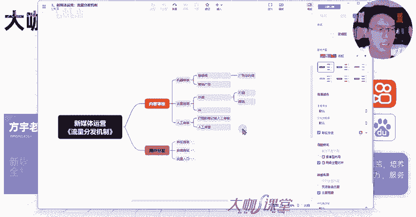

它系统的一个审核规则和内容的排查规则，它都是有漏洞的，都是有漏洞的，规则是有，但是这个规则没有说绝对完美的，你包括网易对吧，网易的直播之前被打击过，为什么，因为它有一些不合规的内容，这些内容为什么存在。

一个是因为审核问题，然后一个呢可能是因为某些这个一些默许行为，但是呢你像我们现在的这个平台，很多平台它虽然有很多规则，但是为什么说有一些平台禁止的内容，还是有人在做，这个一个是钻了系统的一个漏洞。

它有一些我们系统不允许的东西，它其实可以用另外一种方法，用另外一种能够绕过机器审核的这种方法。

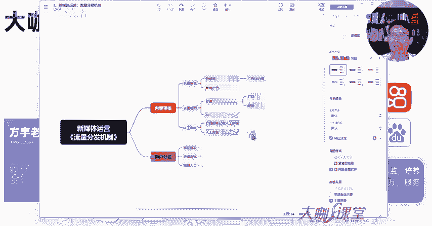

能够把这个内容做上去，但这个内容呢，它可能就涉及到后期的这个人工筛查。

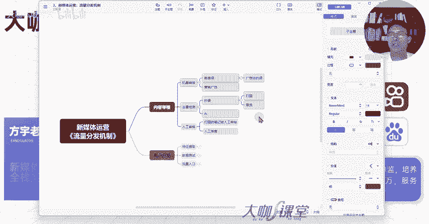

或者是用户举报这一块呃，就比较容易出问题的这种。

但是呢只要说这个规则现在不是百分百完美，那么有一些内容呢是有一定的几率可以去做的，好吧，这个就是在规则下面，我们可以去我们做运营可以去发现的一些点，OK这个是关于内容审核这一块新闻。

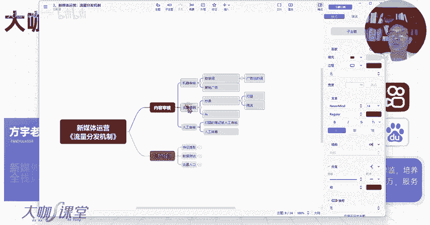

相信大家应该能够了解好吧，然后呢就是我们的内容审核通过了之后，下一步是什么，下一步就涉及到内容的一个，在用户端口的一个分发了。

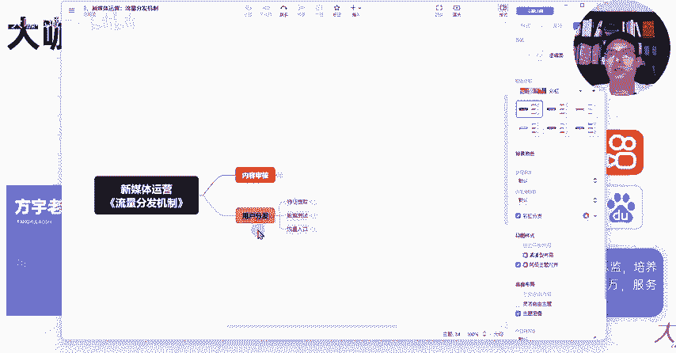

怎么来分发，然后这些内容分发给谁，就是由这么几个步骤来的。

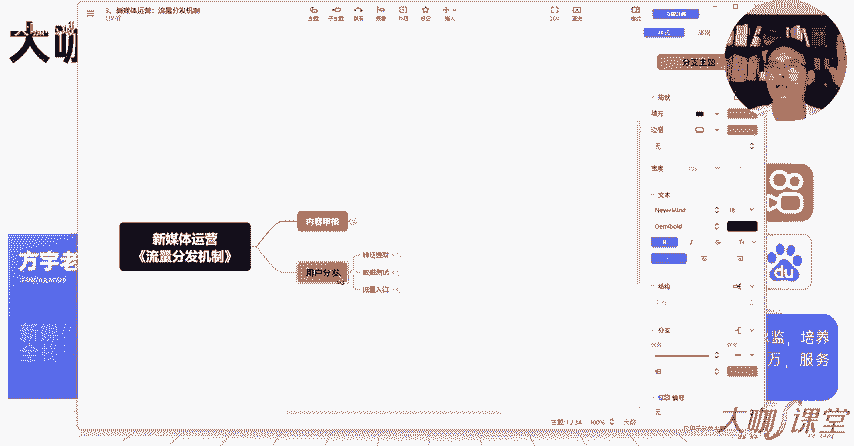

第一步呢就是要提取特征，就是你的笔记里边有哪些特征，你的笔记到底可以分发给哪些人群去做测试，这个时候就涉及到你的笔记的一个内容分析了。

他会对你的笔记内容做一个什么呀，做一个初步的分类。

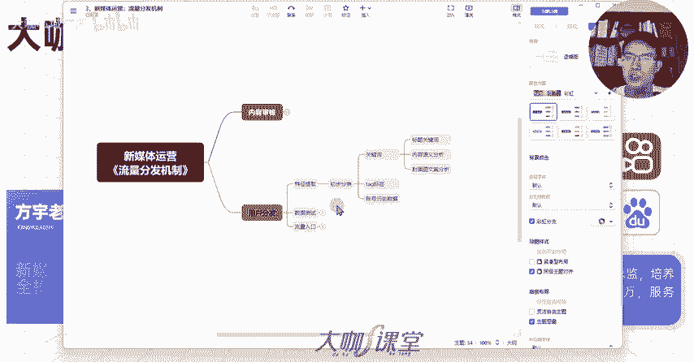

这个分类通过什么来判定一个就是关键词，关键词是什么呢，关键词就是你的笔记里边讲的是什么，它的一个主体，你比如说我们写的一篇笔记，里边有很多文案内容对吧，那么这个文案内容呢里边儿可以通过什么呀。

可以通过语义分析，可以通过一些中文分词法的一个分析，来确定你这篇笔记到底它的核心主题是什么，这所以说这个地方呢呃关于关键词的分析呢，在我们这块也是有一定的操作空间的，它可以通过你的标题。

通过你内容的语义，以及通过你的这个画面里边出现的这个呃，语音识别，或者说你的这个呃呃就是字幕，还有说你的封面图上面的一个文案，你内容图上面的文案，这些都是可以提取出来的，然后呢系统对它进行一个分析。

来发现你这篇笔记大致是讲什么的，这个呢这个是一个点，然后呢还有一个就是你的tag标签，tag标签呢，也就是我们去做的这个话题关联了对吧，我们现在所有人去发笔记，或者说我们发视频，你像我们B站的视频。

我们去发布的时候，是不是底下有一些这个话题的关联对吧，还有一些这个标签，这些标签呢是我们可以去手动选择的，然后呢我们大部分情况下，我们发的视频内容是不会说，选一些跟自己特别不相关的这种内容，对不对。

我们会担心我们选择的标签呢，跟我们的内容差距过大，会影响我们后续的分发，所以说这个情况这个时候我们选择的tag标签呢，对系统来讲它有一定的参考意义，但是你不一定说你真的能够跟这个系统。

它就能够凭借你的tag标签，或者说你写的这个标签，来判定你的内容是属于什么的，它只会提供一个什么叫做参考价值，他只会去做参考，来给系统作为一个初步的这个衡量，这个地方的一个分类的一个定位呀。

可以来讲是他是他的这个呃怎么说呢，我们可以给他来来一个打分。

就是说在通过tag标签，还有关键词这些行为分析出来的，只能说什么呀，不管是你的标题关键词，还是你的文案关键词，或者你插个标签系统得出来的这些词儿。

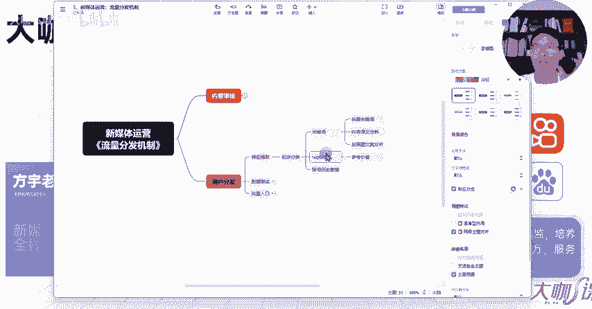

哪怕都是指向关于护肤的一个流程，和护肤的步骤，但是他都这个打分，他都可能只能给你一个0。1的分数，完整的分数可能是十分，或者说20分，多少分，100分等等，都有可能，但这个时候呢系统判断的这个初步分类。

它的这个呃呃，就是定义为你这个内容的一个分类的情况下，它的分数是不高的，分数是不高的，如果说分数高的话，你的内容真的做的很好，那你想一想你是不是你的笔记发布出去以后，给你100个200个流量。

是不是所有的人都是对护肤浏览步骤，护肤步骤，护肤流程这个特别感兴趣的用户呢，这个是不可能的好吧，然后呢，第三个就是关于跟这个我们账号的历史数据，相关，历史数据是什么意思呢，我们起一个账号之后。

我们发的一篇笔记账号呢，凭系统它也会来分析一下，你这个账号，历史发布的是关于什么样的一个数据，比如说我们前两天发的笔记笔记呢，我们发的发的是关于护肤这一块的，然后每一篇笔记分发出去的这个流量当中呢。

都有十几个，或者说有几个这么一个，对护肤特别感兴趣的人群，给我们的内容点赞了，那么系统这个时候他可能判定你新发的笔记，也有可能是跟你历史的笔记有一定的相关性，然后再结合tag标签和你的关键词的提取。

诶它这个地方又能给你加个0。1分，然后呢你在初步分类这一块，可能说你得到的这个什么呀，你得到的这个比重会相对高一些，所以说在这个地方为什么我们一直跟大家讲，我们一定要去做账号的垂直。

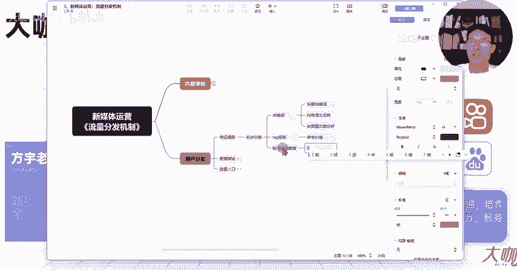

你的垂直账号垂直，就会影响你后期流量分发之后的一个。

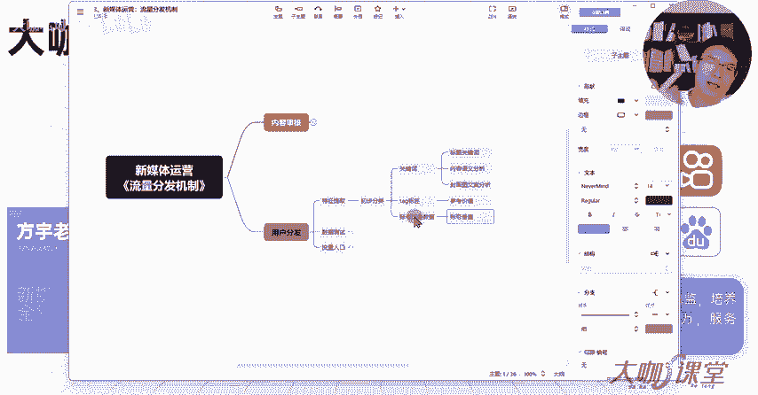

用户行为的一个反馈，好吧，这个就是我们第一个特征提取。

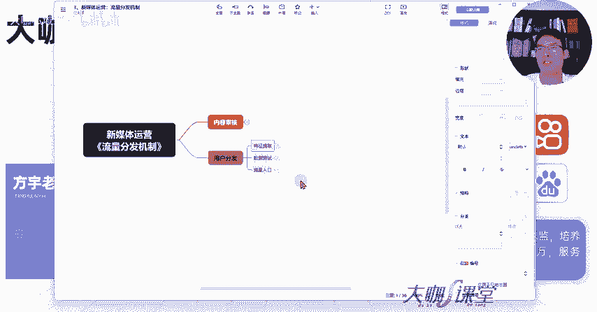

然后提取我们笔记的特征了之后，给我们做了一个初步分类，下一步做什么。

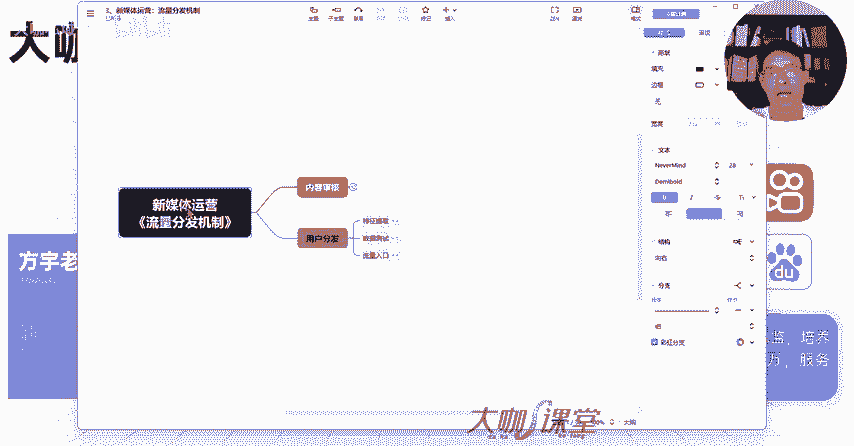

下一步就要系统就要开始，对我们的内容做数据的一个测试了，数据的测试，就是他会把这个笔记的内容分发给一部分，一部分的用户，然后这部分用户呢，通过这部分用户的一个行为反馈，来判断你的笔记内容到底属于什么。

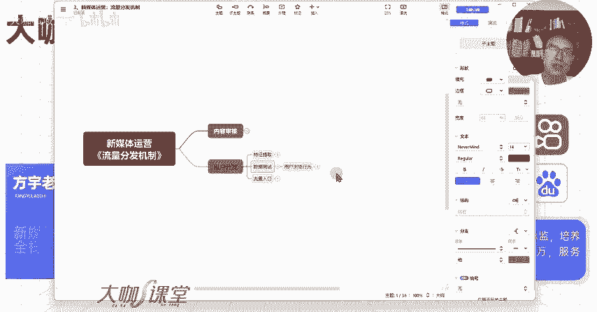

然后并且你的笔记的内容的一个价值怎么样啊，也就是说你内容是否优质。

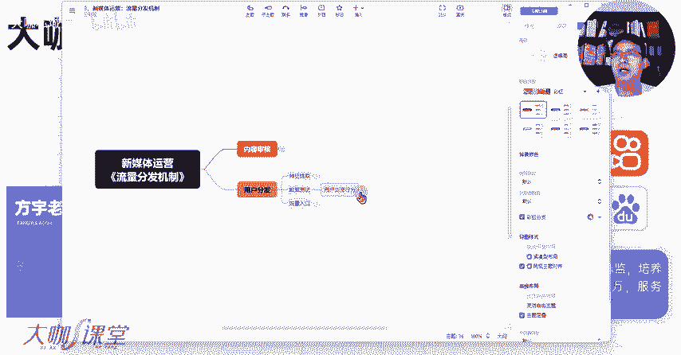

通过哪些点来判断呢，用户的浏览浏览行为主要有这么几点。

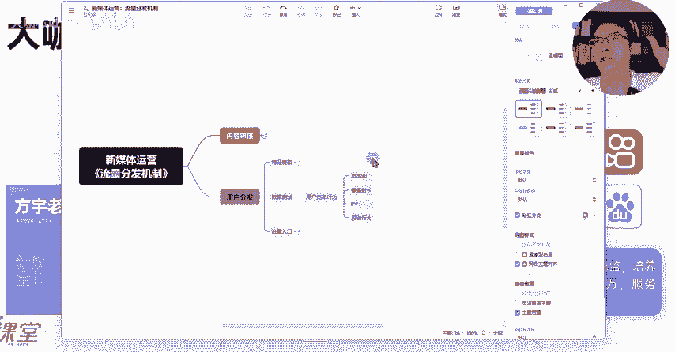

第一个就是点击率啧，这个点击率就是你的笔记平台呢，他会给你一定的曝光对吧，曝光，比如说你像我们某图文笔记平台，它的曝光和小眼睛是不一样的，曝光你看不到，但是呢它一定会给你一定的曝光。

比如说你的笔记前期给你1000个曝光，然后这1000个曝光，最终有200个用户点击了你的笔记，那么这200这个用户所点击的行为，就会形成你的一个小眼睛，所以说点击率就是什么呢。

它就是你的曝光和你的一个实际的一个点击的，之间的一个比率好吧，也就是说1000个用户当中，到底有多少用户点击了你的笔记，比如说我们真的某些笔记做得特别好对吧。

分发出去了100个1000个这样的一个用户曝光，然后呢结果呢你能获得500个点击，那么你想一下，在这种情况下，有50%的点击和你有200个点击，20%的点击，哪个笔记的一个内容会更加的优质呢对吧。

这个显而易见，OK这个是点击率，然后第二个就是我们一直老生常谈的停留时长，这个停留时长呢在短视频平台上面，它叫一个平均播放时长，然后我们B站也有这个体系，也就是说呃，呃多少用户看了你的视频有多长时间。

然后呢还有一个就是你的你像图文笔记平台，它就叫做用户的一个呃平均观看时长啊，平均浏览时长，这个。

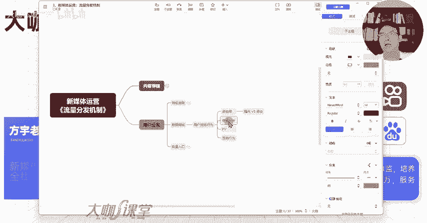

这这个在我们的图文笔记平台上是表现出来，就是用户我们前面也跟大家讲过，用户在你的笔记里边到底停留了多长时间，他翻了多少页面，然后呢他是否看过评论，然后他划了几个几屏，然后点开了哪些位置。

比如说你下面有评论，评论下面有展开，然后呢有更多的这些他是否有去过，有过这些点击行为，然后你的这个呃图片它是否有截图，然后呢图片的你的笔记它是否有分享，这些呢都可以形成一个停留时长的一个反馈，好吧。

然后呢PVPV是什么意思呢。

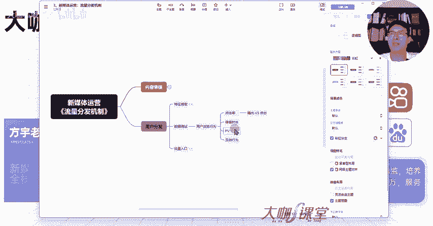

PV我们叫它叫做内容浏览深度，啊也可以理解为叫做页面，我们以前做网站的话叫做内容浏览深度，现在呢我们可以叫它呃。

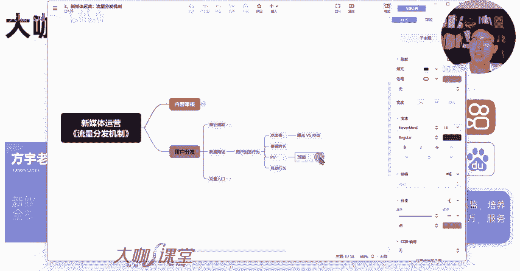

用户浏览页面好吧，这个我们可以用这样的这样的一个方式来讲。

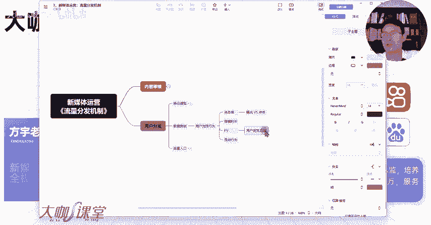

浏览页面是什么意思呢，比如说用户，现在他从首页的推荐的笔记里边看到了你，然后呢他点击了进去，点击进去了之后，它有一定的浏览，然后呢他又点击了你的头像，点击你的头像进入到你的账号的主页之后。

他看到你的简介，然后呢他也在你的主页里边找到了其他的笔记。

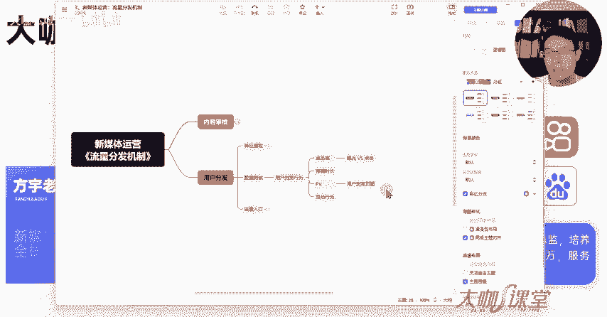

他也点击进去了，那么这里边有几个页面，可能有两个三个页面，这个叫做用户浏览页面数量，用户浏览的页面数量越多，它浏览的笔记越多，它在你这个账号体系下面停留的时间越长，它能够给你的整个账号提供的这个数据。

增益也就会越高，这个大家应该能够理解，这个叫做PV数，然后呢互动行为就好就好理解了，我们正常的现在新媒体平台的互动行为有哪些。

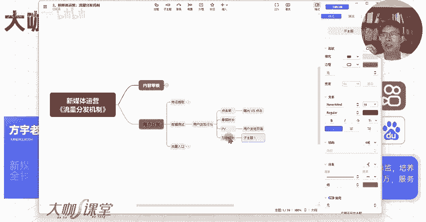

比如说点赞对吧，你像我们B站还有这个什么投币，还有收藏，以及我们的。

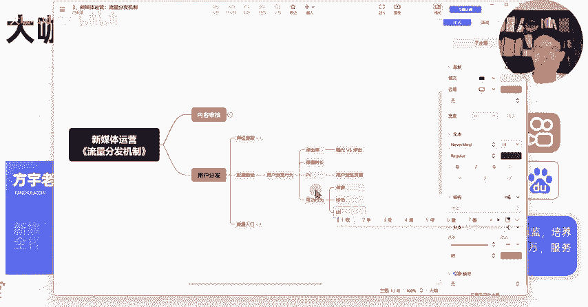

收藏啊。

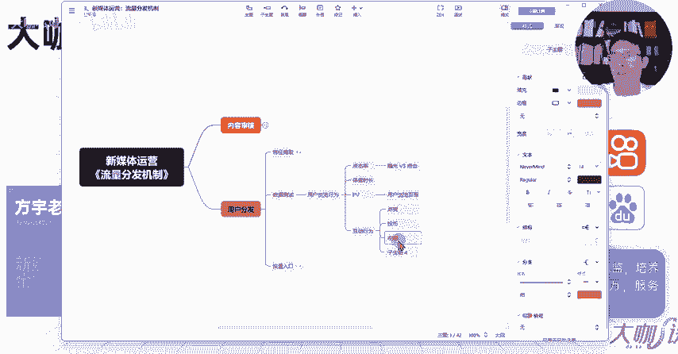

还有我们的这个啊评论分享行为。

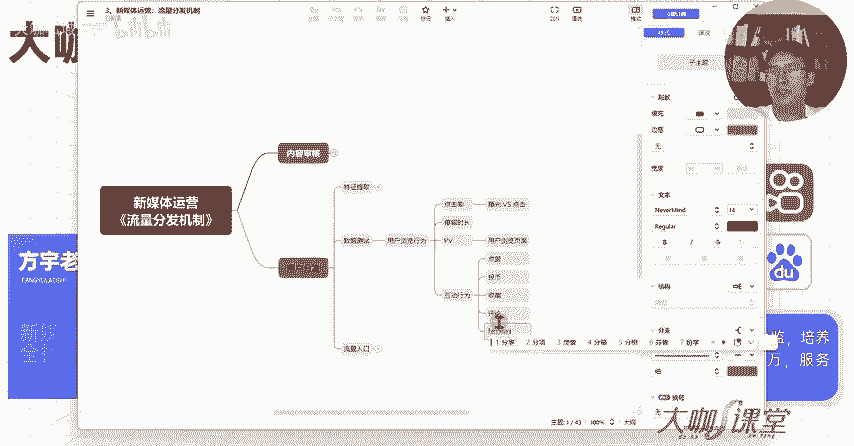

还有我们的关注行为，这个后期我会重点跟大家讲一下，这些这些数据的一个比值，那么所有的这些行为，你不是说用户做了所有的做。

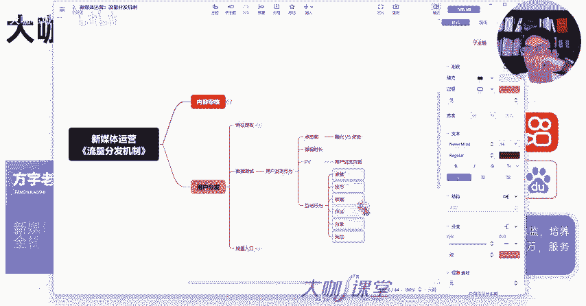

把这几个，比如说我们这里有六个，不是说用户做的这六个行为，才算是对你的笔记加分。

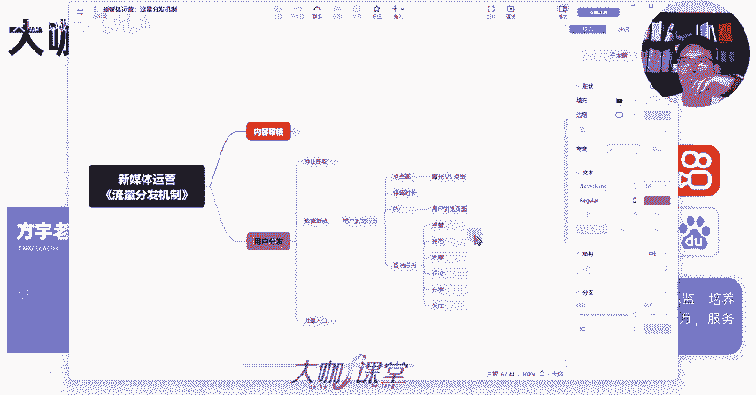

他能做其中的那么几个，那么对你的这个视频都是一定的争议，好吧都是一定的争议。

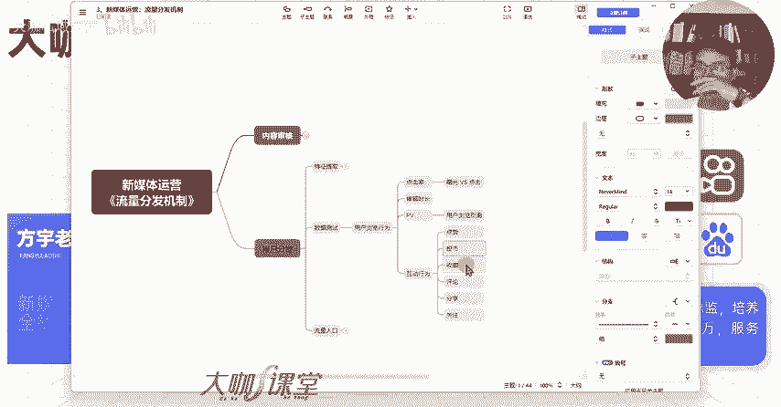

我们更多的笔记，我们很多同学做的这个笔记啊，是这里边的任何一个数据都没有的。

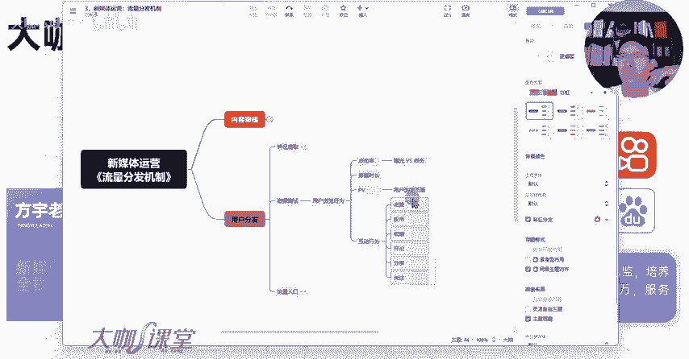

那么这种情况下，你想一想你的笔记上面是哪里出了问题呢。

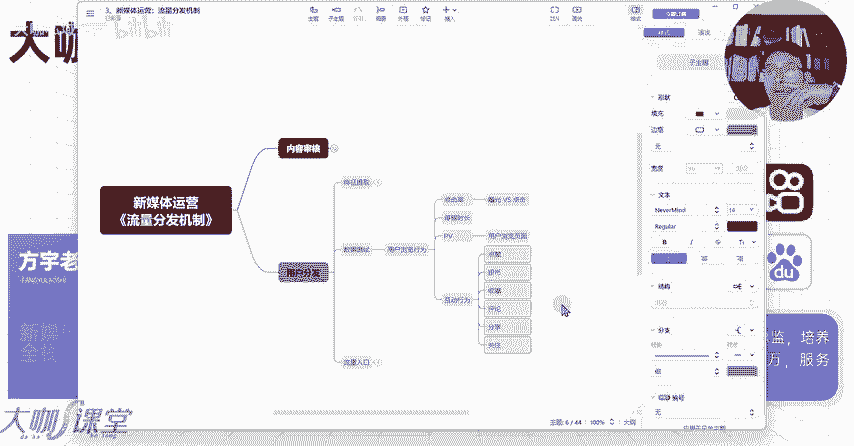

K这一波就是一个数据测试的阶段，它能够通过这些方面，这四个层面用户的一个行为反馈。

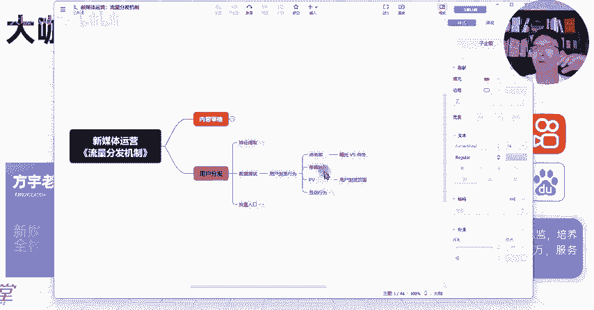

来分析你的笔记到底它的内容优质与否。

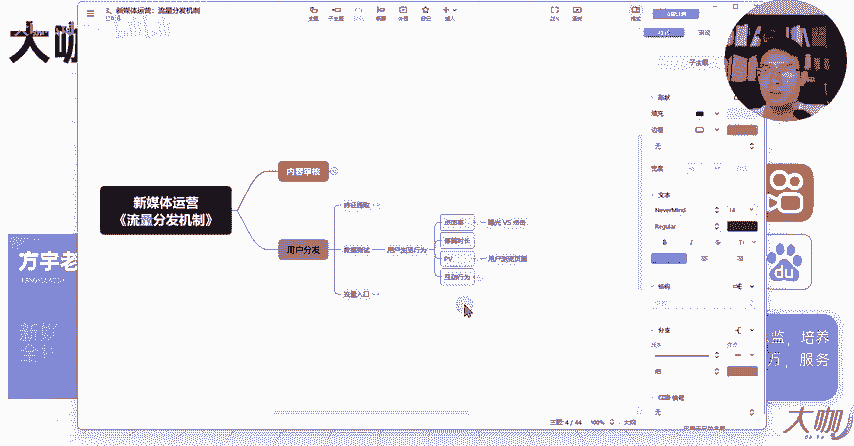

所以说你们想一下你们的一个整个呃。

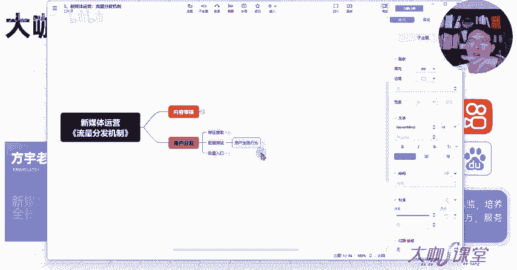

新媒体运营的一个步骤，或者说你们内容制造的一个过程，在前期你是否考虑到了后期这些数据方面。

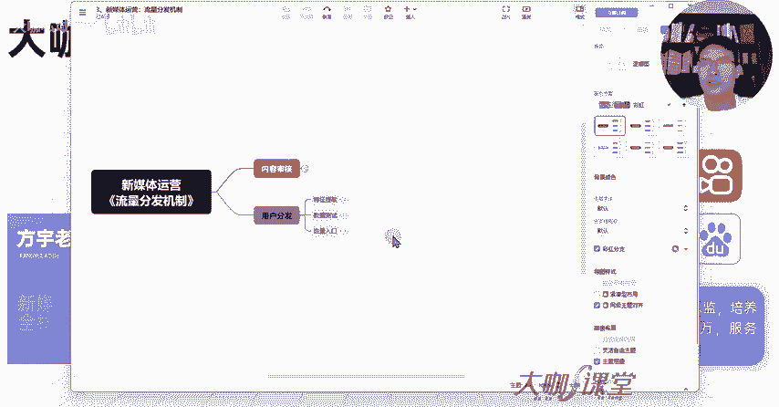

你是否能够让用户给你提供一些点击行为呢，我们从哪些优化的点去入手呢，OK那么呢再来讲一下关于某图文笔记的平台。

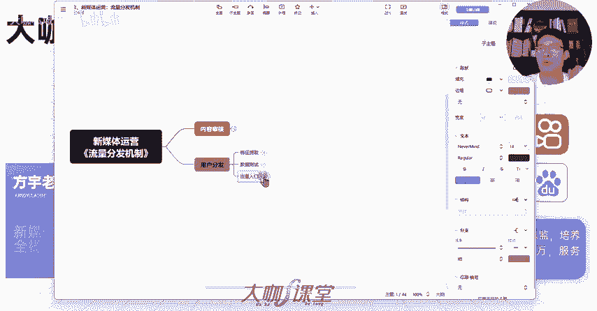

的一个流量入口了，主要的流量入口呢其实就这么几个，第一个呢就是发现页，也可以说这就是我们的主页了，我们任何一个平台呢，不像我们这个呃我们的B站和某图文笔记平台，它都有自己的一个首页对吧。

B站呢进去之后呢，它会有很多的这个内容，都集集中在你进入的第一个页面当中，然后只要你不去点击分类，OK然后呢你像这个图文笔记平台呢，它就是一个发现页。

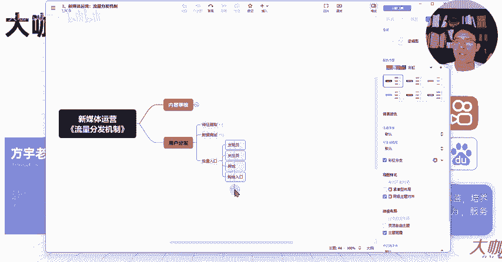

发现页当中呢会有很多的这个所有的笔记呢，呃各种各样的笔记展现在你面前，那我们前期讲这个平台去分析用户需求的时候，这个我们应该能记得，平台呢，它会根据用户标签来为决定为他推送哪些内容，但是呢他不会说。

你的这个标签里边也只有这么几个标签，我只给你推送这几个类型的内容，这是不会的，它会根据呃当前站内的一些比较不错的内容，他会都会推到你的面前，然后看你对这些内容的一个反应，你到底对哪些内容感兴趣。

然后呢逐步的来动态化调整用户的一个标签，的一个属性和层级，OK这个是发现页，那么第二个就是关注页，关注页这里边呢是我们关注的这些博主，或者说关注的达人，这个里边呢它的一个内容需求是非常强的。

比如说某一个人他关注了很多博主，那么我不想去刷系统给我提供的这些内容，我就想去关注，也看我关注的历史的这些博主，给我提供了哪些内容，有没有新的内容出现，那么他这个目的性是非常强的。

你像发去浏览这个发现页对吧，发现页可能用户是基于兴趣，他打开了这个平台。

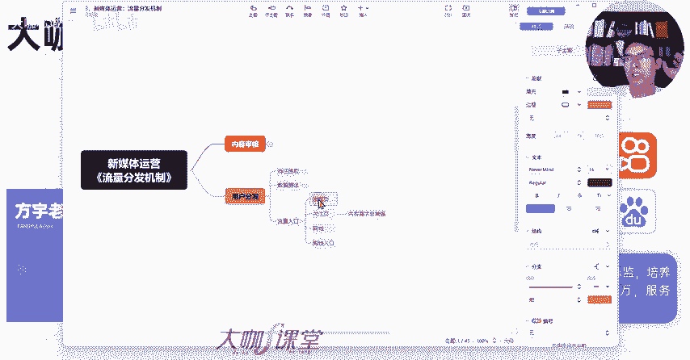

想看一下这个平台有什么好玩的，有什么好看的，那么在这个同时呢，发现自己喜欢的这种笔记。

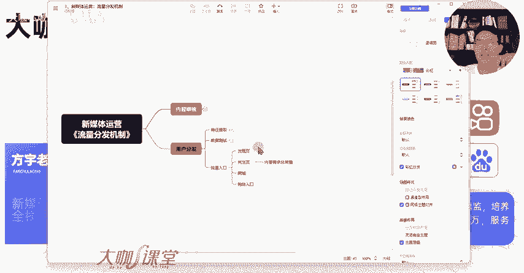

那么关注页他一定是去想去看，我历史看过的那些内容是否有更新，是否有新的这个内容出现，OK那么大部分的用户呢还是集中在这个发现页，然后同城同城这一块的流量呢，其实它在发现页这一块也会有出现。

但是如果说用户他去点击了同城，他想去浏览同城的内容，那么这一块他的一个目的，目目标需求也是非常强烈的，什么样的一个用户，你在什么样的一个情况下，你会去点击同城呢，你想去看同城的内容呢。

呃比如说刷直播的对吧，比如说找好吃的，比如说找附近的住宿的，好玩的，这种情况下大家会去同城里边去找，如果说你不去同城里边去找，你去搜索的时候呢，你就会发现你搜索的东西呢，跟你的同城的内容跟你很多。

比如说你去搜附近有什么好吃的呀，嗯好吃的推荐的，你不加附近哈，你在这个发现页里边搜索框，你去搜索呃，好吃的推荐，那么这里边会有很多来自全国各地的对吧，那么如果说你基于同城这种情况下你去搜索。

那么你的用户的他的一个搜索需求，他就会非常明确对吧，那么这个时候用户他到底是想吃还是想玩，还是想住等等等等，这些就是用户的一个明确的需求，包括购物入口也是一样，那么购物入口呢这个地方呃。

大家是有明确的一个购物需求的，那么这个地方就是做什么呢，做电商为主的，OK那么这是我们关于整个平台。

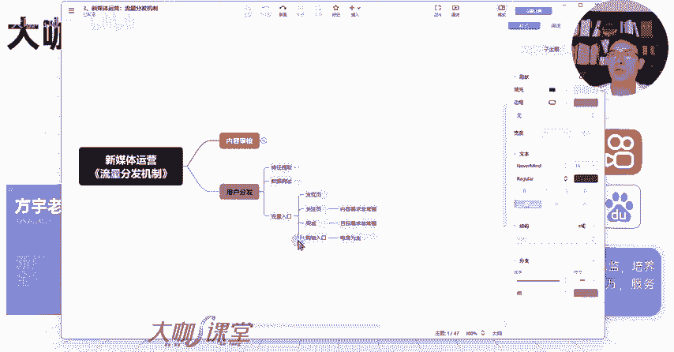

它的一个流量机制，也就是说我们的笔记，我们的内容从发布出去之后，一直到我们最后能够产生什么呀，能够产生流量的，这么整个它背后的一个运作的流程好吧，那么这节课呢就先跟大家讲到这里。

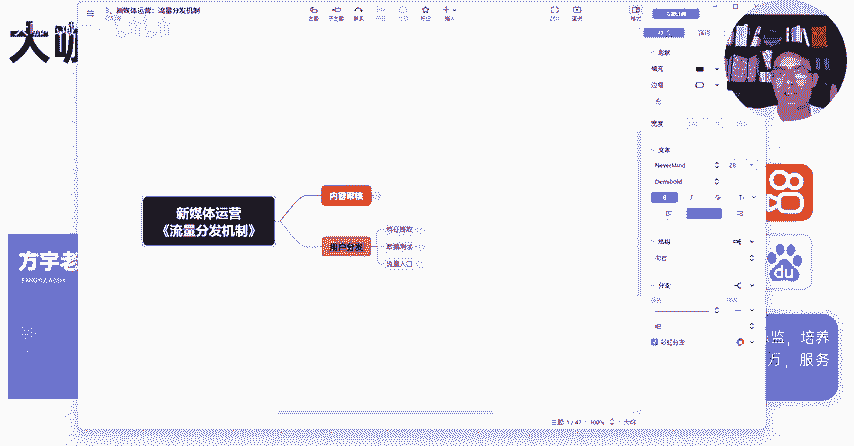