# 【2024B站全套系新媒体运营教程】小红书运营／短视频投流技巧／起号涨粉／爆款视频打造技巧 转行新媒体全平台运营教学！ - P2：1、新媒体运营第一课：标签 下的流量分发算法 - 大咖私域运营 - BV1vMeFeTE95

Hello，大家好，我是方宇老师，欢迎大家来到我们这一堂课，那么这一堂课呢，我们先要跟大家聊一下，一个我们做新媒体运营必须要了解的第一堂课。

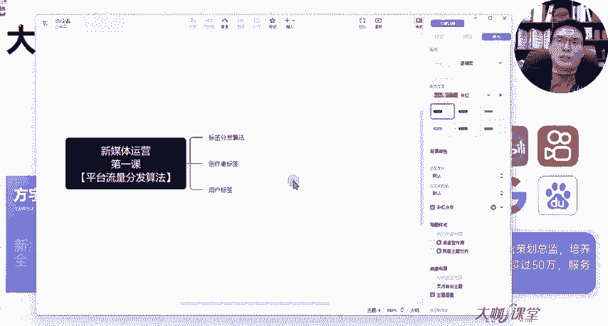

也就是关于平台的一个流量分发算法，什么是流量分发算法呢，就是我们不管做短视频也好，还是做图文笔记也好，我们发布出去的内容，也就是说你刚注册这个号，或者说你这个账号有挺久了，你发布出去的作品。

它是有这个播放量和这个小眼睛的，那么这一部分的播放量和小眼睛，每一个数字背后它到底代表了什么，以及我们从一开始的三五百的这样一个播放，一直增长到我们后期1000，两千五千或者1万甚至几万。

以及它能够成为大爆款的这样的一个前提，这也就是我们整个流量的一个构成，和流量的来源，那么这里呢我们首先要了解一个概念。

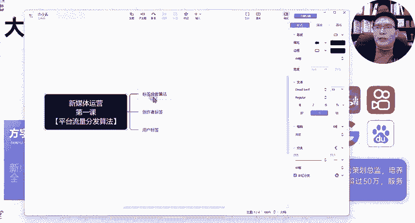

就是叫做创作者标签和用户标签，那么我们先来了解一下什么叫做创作者标签。

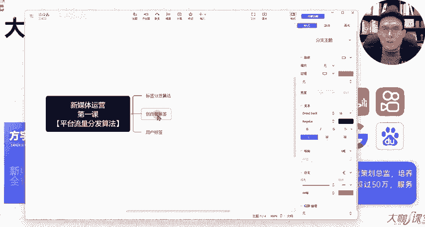

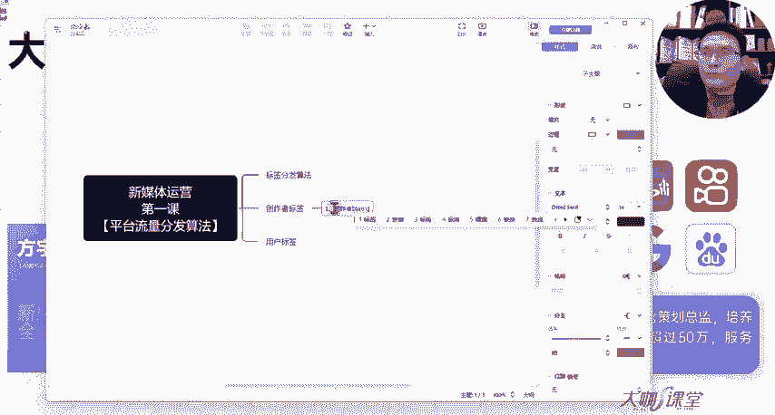

创作者标签是什么呢，这是我们的账号，刚才我们讲了。

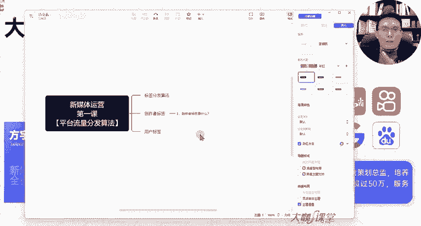

我们发布第一个内容之后，我们的这个平台，它会把我们现在的这个账号啊识别成一个身份，叫做什么呢，就是创作者啊，创作者你发布内容之后。

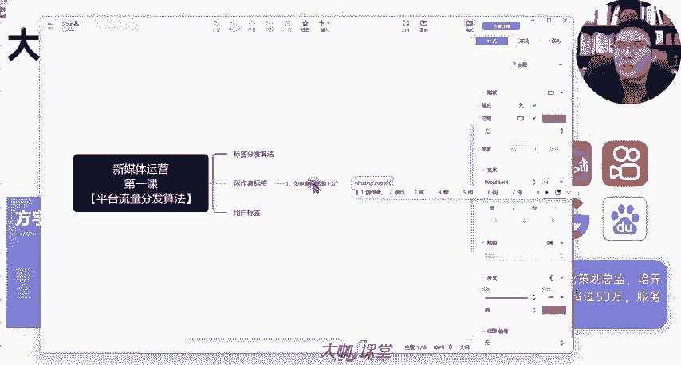

你的账号呢，平台就会认为你是已经成为了一个创作者，但是这个时候就会有一个问题，什么问题呢，你虽然发布了内容，但是你的这个内容啊，平台并不知道你的内容是讲什么的，我们可能想着我们有时候发内容呢。

我们的标题，我们的这个口播文案，或者说我们的笔记内容，以及我们的这个tag标签，我们的这个首图封面，我们是不是都是讲了我们是做什么的对吧，比如说我们是做一个女性女装穿搭的，这么一个视频，或者说笔记。

我们在这些地方都会去凸显我们的标题，关键词，这些地方都会凸显，那么平台为什么我写了这些东西。

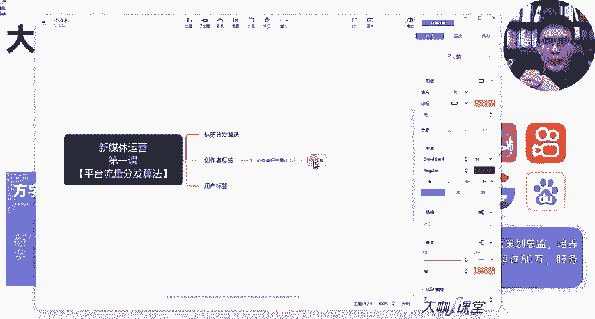

它还会识别不了呢，就是因为现在我们所有的平台，包括这个短视频或者图文笔记平台，我们的这个内容的一个判断的一个机制，都是通过什么呀，都是通过机器审核的，并没有说你发布的内容。

他们会有后台人工去看你这篇内容是讲什么的，然后再去给你做分发，现在的新媒体平台都是有非常完善的，这个分发的流量，分发的一个机制，以及内容判断的一个机制，包括你的内容是否合规，你的内容是讲什么的。

这个都是能通过平台的一个算法，它的一个非常强大的，一个大数据分析的这么一个系统来判断的，这也是我们这一堂课要教给大家，非常核心的一个概念啊，也就是说我们刚开始成为创作者的时候。

你的内容你是没有一个精准的标签的，那么没有精准的标签，那么这个时候你的播放量又是怎么来的呢，包括你的小眼睛，它又是怎么来的呢。

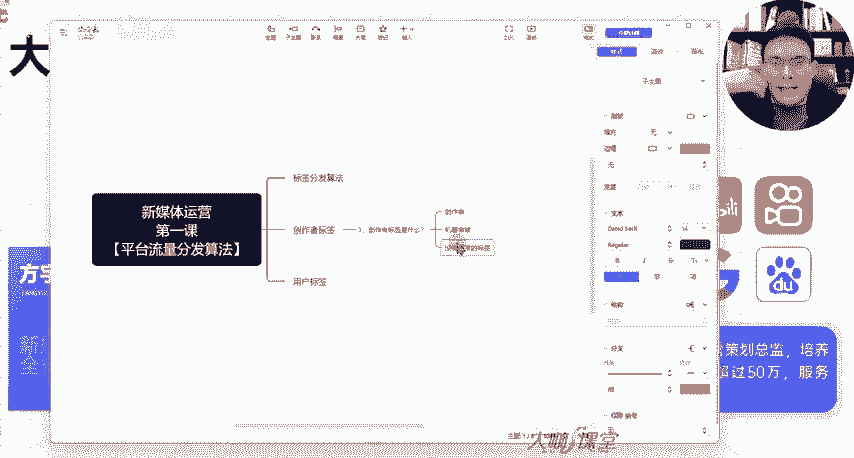

我们可以理解为这个时候你发布的内容，你的播放量以及小眼睛他们都是什么呀，都是泛流量。

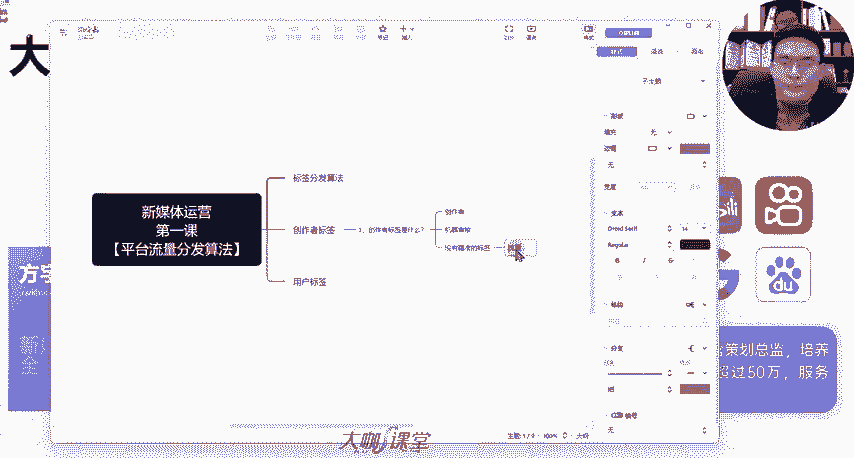

什么是泛流量，泛流量就是说你这些内容，现在分发的这些用户都是不精准的，你是做穿搭相关的女性，穿搭相关的，她可能把你的这部分内容分发给了，那些四五十岁的这种啊，中年大叔或者老大爷，或者说这种十五六岁。

十七八岁的这种小孩，甚至说这种40多岁，50岁的这种呃，中年男性，也就是说你的这部分流量啊，他是不精准的，因为平台的系统，现在没有办法去判断你的内容是讲什么的，他不会通过你的标题。

你的tag文案以及你的封面，来判断它会通过什么呀。

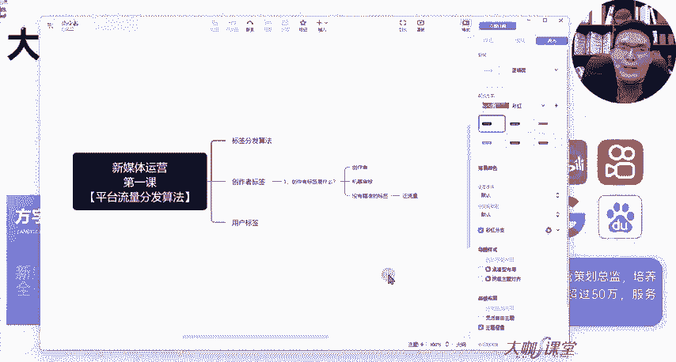

通过分发的人群，通过分发人群来判断你的内容是什么的，那么这个时候我们就要有一个东西，就是平台呢，它会给我们所有的创作者去打上一个标签。

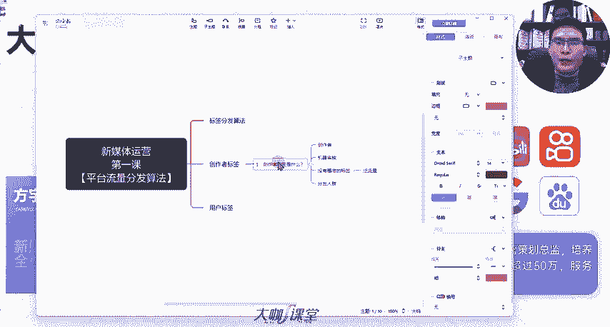

这个标签是关于什么内容的，你这个创作者是做什么，做什么赛道的，你是产出什么内容的，那么这个东西就叫做创作者标签，我们呢前期的账号分发流量上不去，以及我们的流量来了，并且没有给我们的内容提供这些互动数据。

都是基于什么，都是因为我们的创作者标签不精准好，那我们来看一下创作者标签的作用很简单，创作者标签的作用就是系统用于判断你的内容。

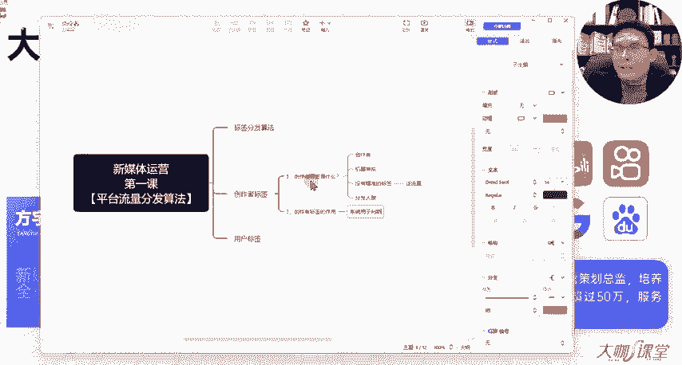

是关于什么的，那么这个标签的一个判断。

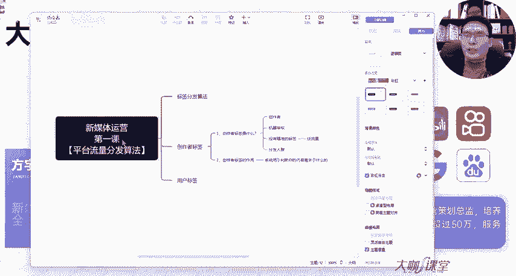

它能直接影响的结果，它就决定了结，决定了你的内容最终分发给哪些人群。

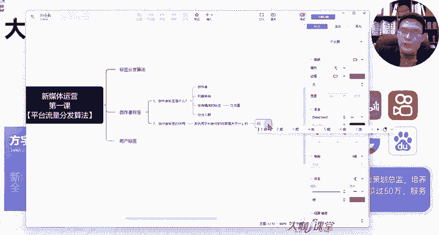

他会通过给你的账号打上了标签，比如说我的某个博主，我我现在的一个账号，我长期去创作关于这个女装穿搭的内容，在系统成功识别了我的内容之后，他就会在后期把我的内容，不会推荐给所谓的泛流量。

他会推荐给很多对我们女装穿搭特别感兴趣，或者说她曾经浏览过，有一定停留时长的这一部分人群，那么在这种精准的推荐下。

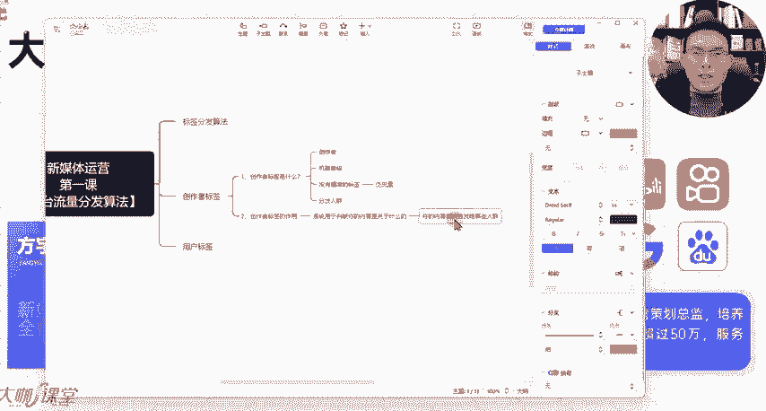

会得到一个什么结果呢，如果说分发精准的情况下，嗯你的流量数据会越来越高。

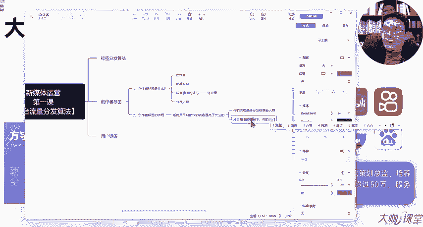

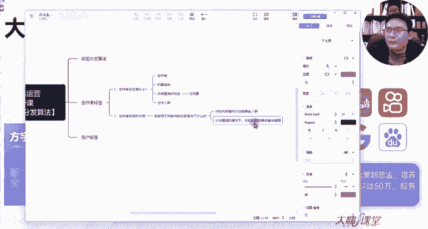

会越来越高，如果说分发不精准的情况下，你的流量数据就会越来越差。

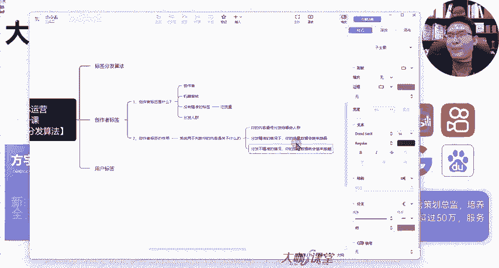

就会越来越差，这个很很好理解你的视频分发的人群，他对你的内容感兴趣，会有一个什么样的结果，它会在你的内容里边会有一定的停留，那么当然这个是在我们内容创作，比较优质的前提之下。

它会在你的内容上面有一定的停留，停留了之后呢，对你的这个内容，你制作的这个内容的质量比较高，那么这部分人群里边特别感兴趣的，还会给你提供一些数据支撑，什么数据支撑，比如说点赞，收藏或者说评论等等行为。

这个是一点对吧，那么如果说分发人群错误的情况下，会得到一个什么结果呢，就是我们前期讲的泛流量的这种情况下，所有的用户它浏览你的内容呢，它的跳出率是特别高的，什么是跳出率，就比如说一个用户。

他在浏览短视频的时候，他滑到的你的内容，他可能瞬间判断出这个内容他不感兴趣，他就直接划走了啊，直接划走了，那么这个时候算不算一个播放量，在短视频平台上面，它算一个播放量。

但这个播放量提供的数据会特别差啊，它的停留时长可能说一秒都不到对吧啊，可能说呃还有呃哪怕说两三秒，这种，对我们这个视频的一个数据增益，都不是很大对吧，都不是很大，那么这部分数据一旦多了之后。

平台就会可能判断你这个创作者，他提供的内容很差，那么我可能限制你的一个流量分发，在没有确定你这个账号是做什么内容之前，我限制你这个流让分发，这是什么呢，就是我们通常提到的一个限流。

也就是我们很多人去做账号，你做了短视频之后，你会发现后面你的流量持续起不来，或者说你的流量反而越来越差，最近最最明显的是什么呢，比如说我们有些同学，他们去做这个营销性的内容，我们企业拿去做这个短视频。

你的短视频上来，大家就想着我要通过这个短视频去告诉别人，我是做什么产品的啊，如果说我不讲我的这个产品呢，可能这些用户呢他就不知道我做什么，甚至他不联系我，但是这一点呢就是一个非常错误的一个举措。

你在前期你的这个内容，不通过一些其他的方法来吸引用户停留呃，你的在这些不精准的浏览的前提下，所有的用户呢他快速的划走了之后，他就会对你的这个视频形成一个，负面的一个影响，你这样的视频发的多了。

你发个十条50条，在这些所有的视频表现数据都比较差的情况下，你的这个这个账号他后期的流量呢是持续，它是起不来的，那么你的账号可能运营到最后就废了，好吧，这个就是我们关于讲的创作者标签。

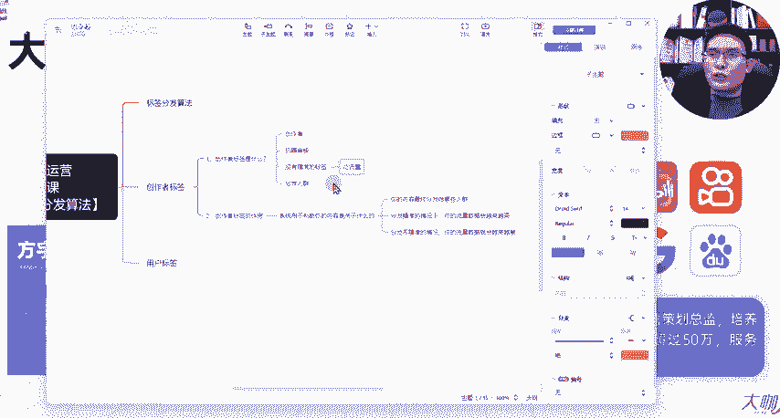

它的作用啊，那么第三点我们要来了解一下，关于我们关于我们账号的第一波，第一波流量的第一波流量这个东西呢，我们知道账号初始刚开始是没有标签的啊，是没有准确，是没有准确标签的，那么这个阶段我们刚才讲了。

他会分发这个泛流量，泛流量有哪些特性，泛流量有哪些特性，我们刚才讲的，首先第一个性别不精准。

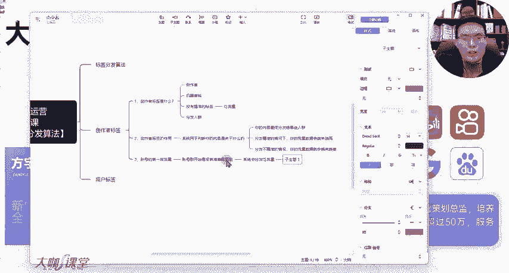

然后可能说年龄不精准。

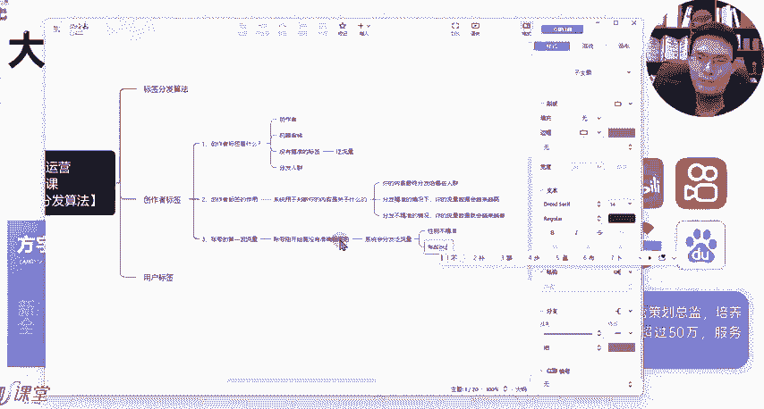

还有什么，还有我们的兴趣爱好，兴趣爱好不精准，那么这种情况下，我们做垂直赛道内的内容，我们得到的前期这些不精准的流量，就代表了它表现出了我们账号的一个数据呢。

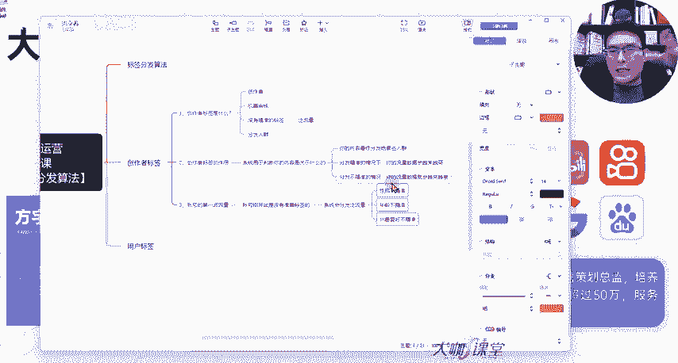

在后台所能看到的，我们的完播以及跳出这些数据都很不可观，那么如果说在这种情况下，我们来推，我们来想一下，我们来设想一下年龄不精准。

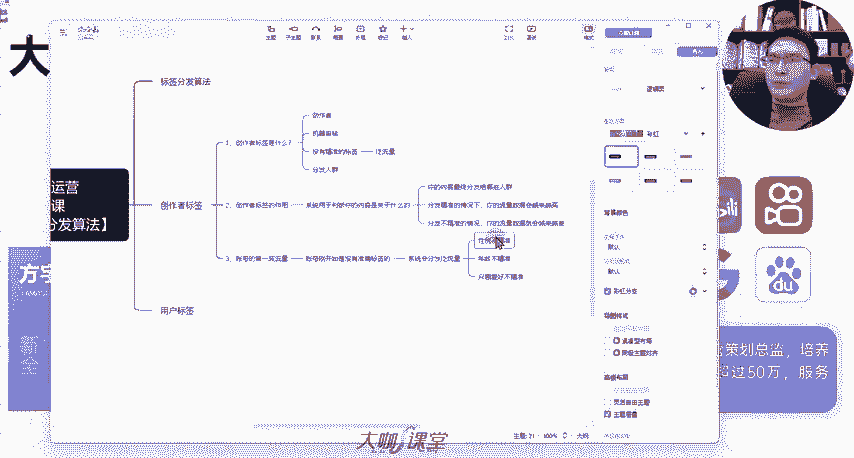

性别不精准以及兴趣爱好不精准，那么这种情况下，还有没有什么办法能够，让我们前期把流量拉起来，有啊有我们做什么样的一个内容呢，就是娱乐性的内容，我们做泛流量这部分人群喜欢的内容。

什么叫做泛流量人群喜欢的内容，比如说我们做搞笑的段子对吧，或者说我们去讲一些新闻热点类的事情，以及说我们去做一些呃吃瓜呀，猎奇类的内容，你们想一想，这部分的内容是不是能够涵盖绝大部分的人群。

我们假设说有1万个流量对吧，那么这1万个流量当中，我们做这个穿搭赛道的，可能当中对这个穿搭内容比较感兴趣的，只有那么十个用户对吧，十个用户这个是毫不夸张的，那么这十个用户你能否抓住他们。

对你的这个视频流量提供高的数据，用于系统来判断你的内容比较优质呢，是没有办法的，十个流量的这个基数太少了，而且这是一个很现实的情况，但是如果我们做搞笑这个段子一类的，或者说我们做新闻热点类型的内容。

这一类的内容，关注它的用户群体，可能1万个流量当中有8000甚至9000都有可能，这个取决于你的内容创作成什么样。

对不对，这就是我们前期很多人去做这个账号啊，你们去做一些这个综艺视频的剪辑。

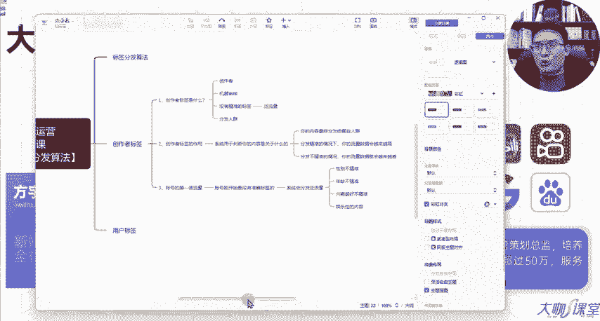

做一些这个啊娱乐的明星的这些八卦呀。

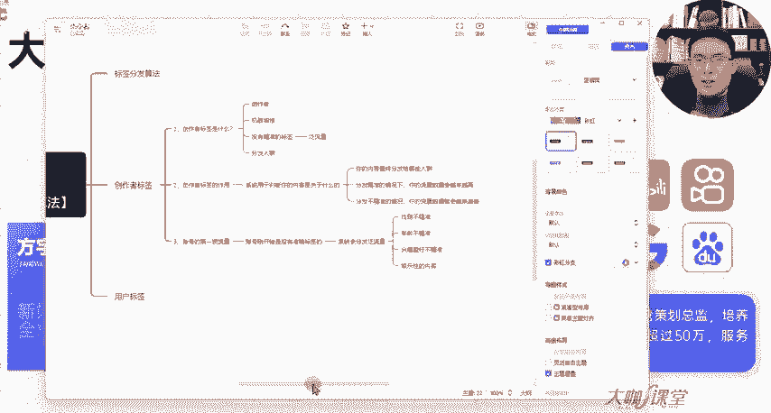

段子啊，为什么这一部分的内容它的流量会好一些呢，就是因为这一类的内容，它的标签是契合大部分人群关于短视频，他刷短视频的他一个具体的需求，很多人刷短视频是为了什么，就是为了娱乐，对不对，他就是为了娱乐。

就是想打发时间，所以说你做这部分的内容，它就更容易起，但是这部分内容你要想一下，它是否是你当下想做的一个赛道，是不是，然后呢这部分的内容后期的一个变现，以及账号的一个发展，以及涨粉的这样一个过程。

对不对，这些是我们要考虑的问题，娱乐性的内容，比如说搞笑段子，然后的话新闻热点以及吃瓜猎奇一类的。

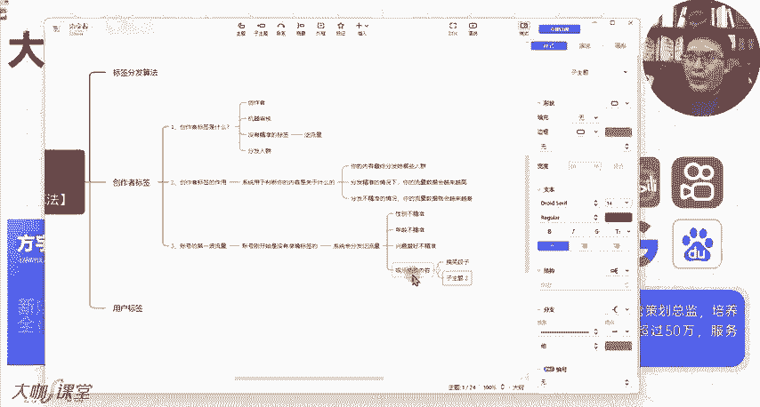

那么这一类的内容呢，它就比较好奇，这个是我们讲的关于系统分发泛流量的一个。

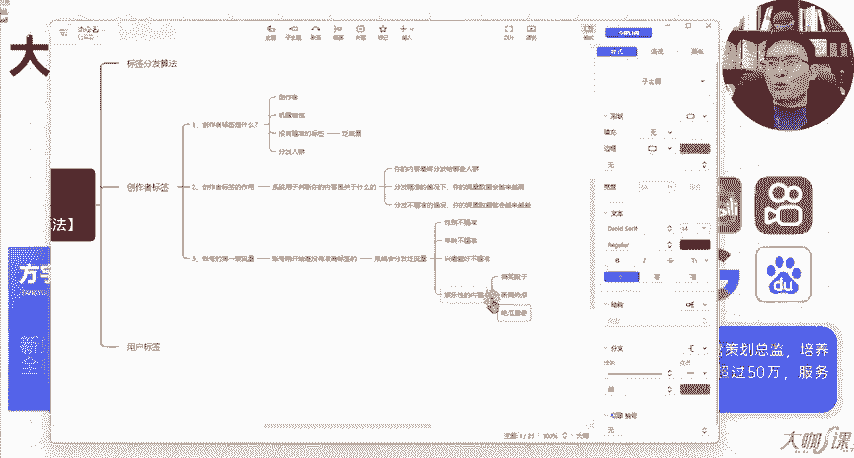

他的一个举措，那么剩下的还有什么，这个阶段账号没有标签的时候，我们的流量其实还有一个什么意义，平台还能拿来做什么，其实就是对我们的内容，对内容进行一个测试啊。

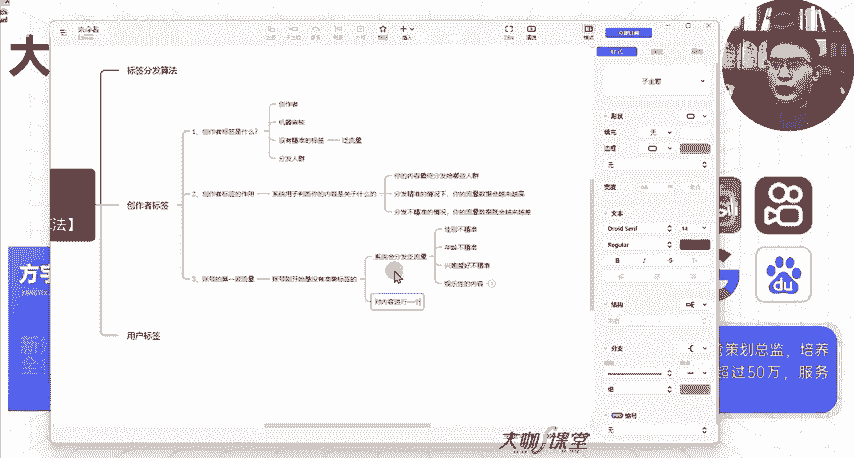

对内容进行一个测试，测试什么呢，测试我们的内容是关于什么的，待会呢我们用一个非常经典的一个数据，我们来告诉大家，我们来演示一下这个平台。

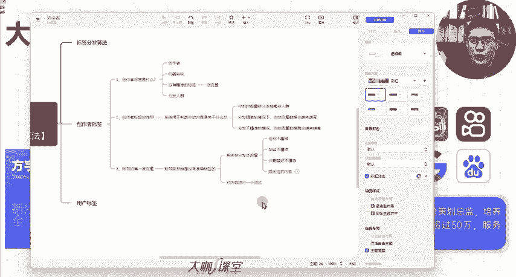

来判断我们内容到底是关于什么的。

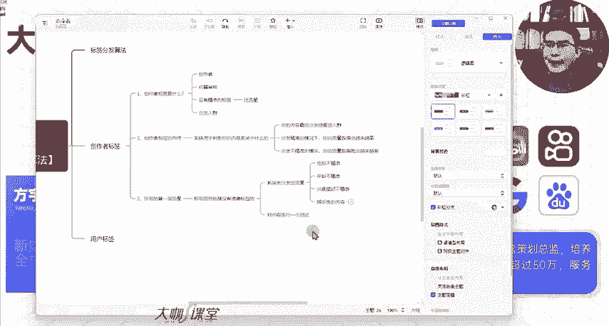