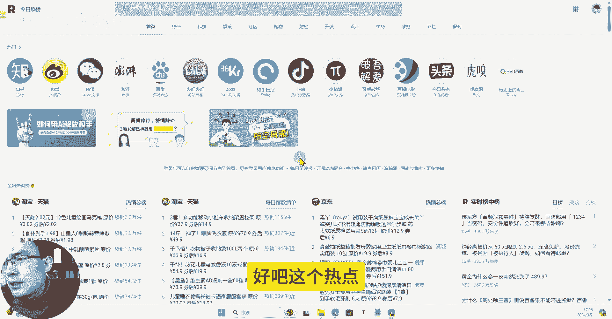
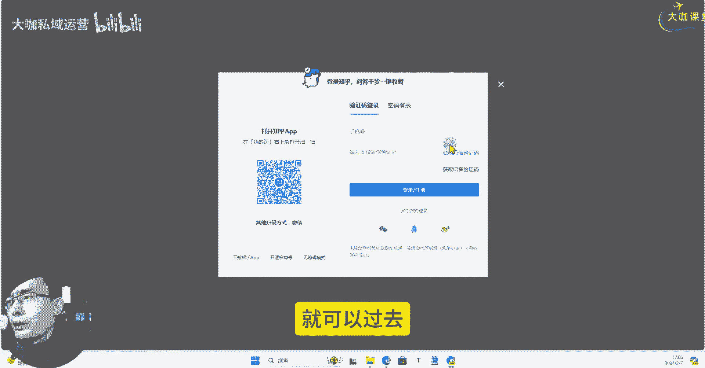
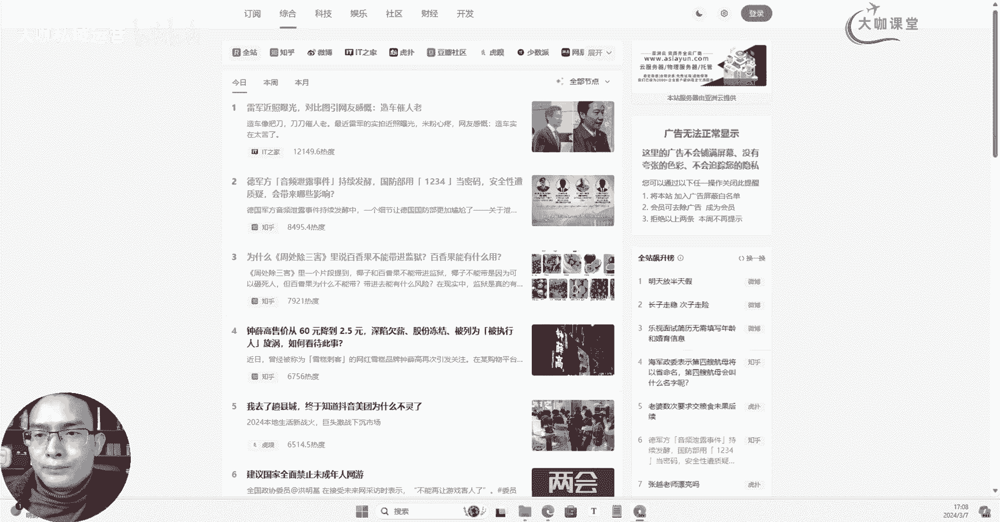

# 【2024B站全新新媒体运营教程】整整200集 新媒体运营全平台学习 小红书起号运营／抖音直播带货／短视频剪辑拍摄 零基础自学天花板！ - P20：02.5：工具篇-运营必备 3个经典的热榜聚合网分享 - 大咖私域运营 - BV1os421g7JG

哈喽大家好，那么这节课呢我给大家分享三个，我们目前我自己用的比较多的这个热点，发现的这样的一个工具，那么热点这个东西我相信大家也知道，我或者说听过我们课程的也了解，做新媒体呢。

现在你如果想把流量呈阶梯式的往上增长，你的内容呢能突破一定的数量层级，那么蹭热点这个东西呢是必不可少的，那我们有时候比如说自己做账号，或者说我们在运营就业的过程中，你们在这个岗位当中。

要想把这个热点给他抓好，可能我们大部分普通人啊，就是去抖音上刷一刷，看看今天有什么热点视频，或者是呢我们去网页上浏览一下，这个百度的热点这个信息，但其实除了这些渠道之外。

我们还有很多可以去自己主动发现和抓取，热点的这样的一个平台，那么呢首先呢我们看一下第一个分享的工具，就是我们的今日热榜，那么这个呢上面呢分享的这个热榜信息呢，比较齐全。

像呃排的前面这个电商相关的天猫京东啊，这些呢还有这个平台的一个，综合的实时的榜中榜啊，也就是说当下的热门话题，然后呢像微博知乎啊，这个百度啊，然后某企鹅，我们的这些其他的科技范儿的内容呢。

这块都收录的有，而且呢我们登录之后呢，可以自己去调整你的这个热点的一个顺序，像B站这块我们能去啊，不同平台的啊，它的热点呢方向呢有一定的区别，并不是说所有的内容都是全网热点，这个大家要了解一下。

比如说哔哩哔哩，它上面的热点呢，就跟我们很多其他平台的这个热点就不一样，它是平台上面的内容热点，而抖音呢这种属于现在全民啊，全民都有的一个东西，那么它上面的热点呢可能更大众化，更普及性一些。

然后小红书上面呢可能是一些小红书上面社交，这个他的一个社群里边，一些独特的内容的一些热点，这个也是一样，不同平台有不同平台的一个热点，我们呃要去做一下区分好吧，这个热点呃像这个这个平台上面呢。

它有的热点呢我们需要去知道内容的，直接点击啊，就可以过去。

比如说如果说你是做黄金的对吧，你是做黄金这一类账号的，你可以看一下黄金接下来的它的一个信息哎，去看一下别人的一个点评，看能不能写出一个你自己的一个，还比较不错的文案，把这个算是热点的东西给它挂上去。

那么你的流量就不会特别差，这个呢是知乎，还有微博，还有抖音啊，我们自己去找热点，然后再把这些热点呢做成我们自己的内容，这是一个方法和技巧，然后呢这个平台呢也是一样啊，也是一个热榜的一个网站。

他的呢有知乎啊，百度头条微博，然后呢这些都有呃，我一般呢可能看一下，在这个上面浏览一下这个极客啊，极客上面看一下这个呃，当天有哪些发生了哪些事情啊什么的，看有没有这个我可以去蹭的内容，或者热点方向啊。

你们自己做账号运营的时候，这也是这个呢这个工具上面分享的也还比较全，我们可以在里边呢找差异化，看有哪些东西是不一样，有些是别的平台没有抓取到的，这个平台有的对吧，然后呢还有这三个工具也是一样。

是一个热榜，这些呢是我会经常综合下来分析，这三个平台哪一些比较好用啊。

我们啊比如说嗯我们啊雷军啊，这个近照曝光反馈。

说这个什么呢比较沧桑对吧，然后呢，还有一些其他的这个，我们这两天比较火的地方的一些事情啊，然后或者说我们其他的这些热点新闻呐，拿这些内容呢，如果说你善于去发现，那么有很多东西是可以跟我们运营。

我们做的品类去相挂钩的对吧，能挂上钩的，能蹭上热点，能带来话题的，他就有流量，对不对，当然呢我们蹭热点，我鼓励大家，就是我们一定要往机及往正面的方向去做好吧，我们要遵循我们的一个呃。

运营的一些内容的基本要求啊，把这一块呢东西把它把控好好吧，这是我们跟大家分享的这三个工具啊，工具的地址呢还是一样，分享在我们的这个评论区，置顶评论，和我们视频下方的简介信息里边都有啊，需要这三个工具的。

