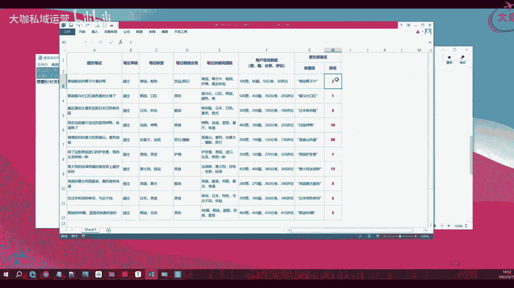
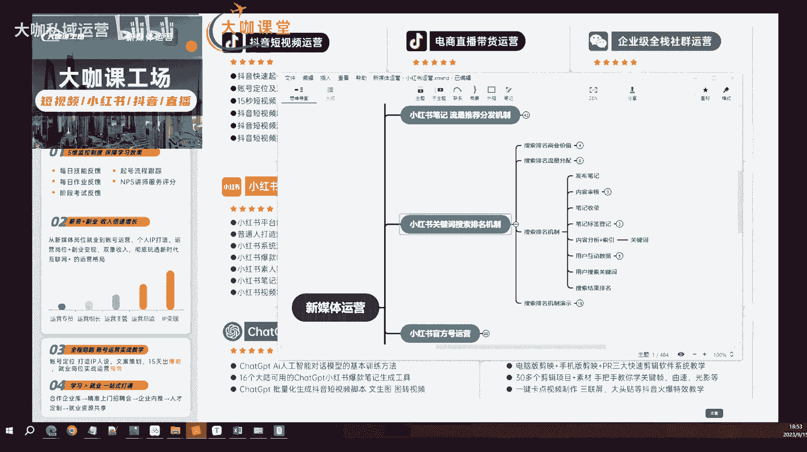

# 【2024B站全新新媒体运营教程】整整200集 新媒体运营全平台学习 小红书起号运营／抖音直播带货／短视频剪辑拍摄 零基础自学天花板！ - P31：13：新媒体运营-小红书关键词搜索排名的机制-2 - 大咖私域运营 - BV1os421g7JG

OK那么我们现在来讲第三点，也就是我们需要去了解的小红书，他的一个我们的笔记写完之后，通过审核之后，他到底是怎么进入小红书这样的一个，搜索引擎的，这样的一个索引库里边，然后我们的排名。

然后我们的关键词标签，到底这个分类的流程是什么样的，我们需要去了解一下，那么这个过程当中很多同学就可能疑惑诶，我的笔记发布了，为什么就一直不被收录，那这个过程我们就带大家一起来走一步好吧。

我们就模拟小红书，他的这个搜索排名的这个机制，我们来走一步看看这个东西到底是怎么玩的，那么首先第一步啊，第一步肯定是我们先产出一个笔记，对不对，我们用户先，我们用户先呃，写笔记啊，发布的嗯，发布笔记。

那么这个笔记的话呢，呃我们发完这是我们的第一步操作啊，第一步操作，这个时候还没有涉及到平台呢，那么接下来就是我们的第二步对吧，我们平台需要对我们的这个什么呀，需要对我们的内容进行审核啊。

需要对我们进行内容进行审核，审核的阶段，我们前面讲的就是机器审核对吧，然后驱虫检测人工审核这么几个阶段，一般在机器审核上面没有问题的话，那么你的账号权重还可以的情况下，就会进入正常的一个分发啊。

分发也就是我们数据展现的一个阶段，那么那个时候呢我们讲的是数据展现，还没有涉及到搜索排名，那么我们这一期重点讲的就是一个搜索排名了，好吧，OK那么内容审核过了，你的这个账号权重也没有太大的问题。

账号也没有违规，OK那么这个时候我告诉你，你的笔记就会被收录啊，这个就是笔记收录，那么我们的笔记收入一定是有几个前提的好吧，笔记收入一定是有个前提的，系统呢在审核阶段。

它其实就会对你的这个我再强调一下啊，再强调一下审核阶段他审核的是你的笔记，什么鬼，OK系统在审核阶段，它会审核你的笔记质量，OK笔记质量，然后笔记有没，键盘不是特别好用啊，然后是你的笔记有没有违规。

OK笔记有没有违规，然后呢还有还分析你的什么，他还要分析你的账号权重好吧，我这里呢就叫它权重啊，我这里叫它权重，那么这几个选项当中呢，它会把你的这个就是把你的这个笔记的一个，基础的分值给它打出来。

首先笔记质量，你的图片高不高清，你的文案里边儿是否是独一啊，专一做这一块啊，这个关键词的内容内容里边是否足够，是否足够垂直，对不对，然后有没有给用户提供相对价值。

但是这个价值呢这个东西呢就很虚无缥缈的啊，我们讲究的质量，我们现在能够去观测到的笔记质量就是第一个，你的内容是否通畅，然后你的里面是否有广告，广告词对吧，你里边带没带广告。

那么当然现在我们笔记去发一些外服的广告，是需要去报备的啊，是需要去报备的，那么这个时候如果说你带的广告很大，可能会被限流啊，我们讲究一下啊，所讲究的基本上就是这些内容啊，基本上就是这种笔记质量呢。

我们前面也给大家讲过，这就是我们审核的第一步，那么第二步呢就是你笔记有没有违规啊，里边的像我们刚才提到的广告词，然后一些像什么什么呃，额法律不允许的东西，对不对，然后这就是我们需要去考虑的账号。

笔记质量这一块，然后账号权重也是我前面反复跟大家提的，账号的权重，就是系统来分析你这个账号，在当前我准备给你分配的这个领域，也就是说我通过你笔记的这个所有的语义分析，词义分析或者说分词法等等得出来的。

哎你这个笔记是关于穿搭的，但是我这个时候就要看你这个账号，你这个账号是不是穿搭领域的一个专家，如果是的，OK那么你这个笔记的质量，我可以判定这三项都没有问题，那么它就是一个非常高质量的一个笔记。

那这个时候，你的笔记就被进入到了一个收录的环节啊，就进入到了一个收录环节，收录的环节是什么意思呢，就是小红书的系统，它把你的笔记进入到了他的一个索引库里边，的前置准备步骤啊，那么待会我们再继续走。

走完之后这个流程你大概就能明白了，OK那么收入啊，笔记收录完了之后是干什么呢，就是对你的一个内容进行一个标签化啊，内容与标签化，说白了就是给你的内容打标签啊，给你的笔记，笔记的标签登记。

那么笔记的标签登记的意思就是呃，我已经分析完了你这个笔记，那么接下来我需要给你这个笔记，提前打上各种各样的标签，比如你这个笔记是关于啊关于穿搭对吧，嗯关于穿搭，而且呢关于穿搭之外呢。

你这个笔记还有关于这个什么T恤啊啊，然后呃牛仔裤啊等等等等这样的一些标签，那么这就是呃呃我给你也就是系统，他给你这样的一个笔记打上的标签，那么这些标签打完之后啊，就代表着你这个笔记。

后续就有可能在这些搜索的类型当中去做展现，当然具体的展现的结果需要看你的笔记，进入牛仔裤这个分类后，你到底能排到什么样的排名啊，系统就给你什么样的一个流量和推荐，OK这是我们讲的一个内容的一个标签。

然后呢接下来就是内容的一个分析了，Ok，内容分析加索引吧，嗯这一步其实就是一就是一个完整的步骤，什么意思呢，就是系统它读取到了你的笔记之后，他需要了解你这篇笔记提供了哪些内容啊，提供了什么样的内容。

比如说你是提供穿搭类的秋季穿搭啊，这个上衣啊，短裤或者说一些秋季的这种啊，高级的穿搭感对吧，它需要分析你这个内容分析了之后呢，它会提取什么呢，它会提取一个东西，也就是关键词啊。

也就关键词他分析了你的语义之后，提取你的一些关键词之后，那么后面就需要把你这个笔记，分配到不同的关键词的这个池子当中啊，这个池子当中呢它是有一个罗列的顺序表的啊，这个时候就可以基本上断定初级啊。

给你分配了一个初级的这样的一个排名池子啊，排名池子，那么这个时候后续用户在搜索的时候，如果说没有太大的问题，那么这个索引的这个地方，基本上就决定了你的笔记在这个池子里边的，一个排名的结果了。

OK那么剩下的呢还有一个东西啊，这个时候不一定啊，不一定你进入了这个索引的池子里边，有一个基础的排名分值，那么剩下的就是系统还要通过一个东西，就是我们前面讲到的，你的笔记通过了审核之后。

是不是系统要给你分发呀，对不对，那么分发之后涉及到一个东西就是数据啊，用户互动数据，用户互动数据就是我们前面讲的点赞啊，点赞啊，浏览时长，点击率，收藏评论等等等等，那么这些用户互动的数据。

都会从侧面对你这个笔记在索引库当中，固定的这个排名产生一定的影响啊，产生一定的影响，比如说你这个笔记啊正常呃，呃根据系统给你打的原有的分值，进入这个索引库之后，他可能给你排在第十位。

但是呢诶你的笔记在这个系统给你推荐了之后，诶发现很多用户都非常喜欢你的数据呃，给他推荐到的这个喜欢穿搭一类的人群里边，他的这个点击率非常高，十个人里边有八个人都会点啊，点完了之后呢，浏览时长都还不错啊。

也有这么五六个人啊，接近六七成的这样的一个人给你点赞收藏，甚至参与评论，OK那这个笔记确实质量还非常高啊，点击率非常高，那么这个时候你在索引库当中的排名，它就会默默的分值提升，它也会上升啊，也会上升。

这就是在用户这一块的一个处理，也就是说系统它会根据用户的一些数据，来提升你的一个排名，或者说改动你的一个排名，那么接下来啊接下来的步骤是什么，接下来就是用户搜索关键词，用户搜索关键词的时候啊。

在用户搜索完回车的那一瞬间啊，这个时候呢小红书的系统，它的索引也就是说它的关键词，它的这个呃索引库里边呢，就会把这个原先定好的这些数据展现出来啊，展现出来，按照按照既定的这种顺序排名展现给用户啊。

展现给用户，这个时候呢，就是得到了我们最终的一个什么东西啊，这是我们的搜索结果排名啊，搜索结果排名，这就是我们一个小红书，也不光小红书啊，甚至说很多其他搜索平台。

他们的一个通用的这样一个搜索的机制和流程，以及步骤，那么当然啊每一个步骤里边呢，它可能涉及到的这个算法呀，因素啊都特别特别多啊，分值啊，每一项所占的这个分值比重也不一样，但是我们做运营，做小红书的运营。

我们讲求的就是要把每一点给它做到极致啊，每一个可能影响我们排名分值，笔记推荐分值的这些因素，我们都给它做到极致啊，做到我们能做到这个最好，那么你最终的结果，你最终得到的这样的一个效果肯定不会差好。

OK肯定不会差好，那么这是我们讲到的一个搜索排名的机制，那么接下来啊可能有些人还不太懂，那么接下来我就带大家完整来了解一下，就是我们以一个具体的案例啊，我们以一个具体的案例来聊一下。

就是这个小红书他的这个呃搜索排名啊，也就我们的笔记生成之后，展现给用户的这样一个完整流程，OK完整流程嗯，OK比如说啊我这里准备了一个简单的案例啊，准备了一个简单的案例，假设我们现在啊写了一篇笔记对吧。

这个笔记呢就是在泰国旅游，OK在泰国旅游，然后呢我们在这里呢发现了一个哎笔记的，就是发现一个非常好喝的本地椰子汁品牌，哎真的是旅行中的小惊喜，然后这个时候我们需要针对这个关键词，泰国椰子汁啊，尽情索引。

那么系统这个时候他抓取到这个笔记的时候，他会怎么做呢，我们来完整演示一下，OK出bug了呀，嗯OK就这样呃，小红书，搜索排名机制，搜索排名机制演示，Ok，好那么首先啊我们按照这个步骤来。

首先肯定是用户发布了一篇对吧，发布了一篇关于泰国，椰子汁的笔记，OK这是第一步，第二步就是这个笔记要干嘛啊，笔记要进行审核，对不对，这个时候呢我们假设哎笔记通过系统审核，然后是第三步，第三步是什么。

第三步就是我们的一个啊笔记标签，对不对，啊第三步是我们的笔记参与收入啊，其实这个过程其实在通过审核了之后，他就已经执行了好，那么第四步就是给我们的笔记，给笔记打标签，什么标签呢。

这个标签可能是呃我们这个这个内容对吧，我们这个内容讲的是泰国旅游，发现了一个非常好喝的本地椰子汁的一个品牌，那么这个时候系统可能给我们的笔记，打上哪些标签啊，我们看一下啊，嗯椰子汁啊肯定是毋庸置疑的。

然后呢旅游对不对，里边有旅游这个词是不是，然后呢呃椰子汁品牌算不算对吧，椰子汁品牌啊，然后呢还有这个泰国啊，泰国也算，Ok，然后旅游，旅游里边可能还有旅行这样的一个关键词，那么这个时候呢。

这就是系统给我们的这个笔记啊，他打的这些标签，Ok，那么下下面一步，就是需要对我们的笔记做一个什么呀，做一个分类的啊，也就是说，这个时候我们系统要让笔记进入一个什么池子，他不可能说这个椰子汁的笔记。

把它分入到这个什么穿搭的池子里面，对不对，这个时候呢就要给我们的笔记，给笔记做分类啊，做领域分类，那么这个这就是关于椰子汁，OK可能还涉及到一些其他的，那么这些标签啊。

标签不代表它都能进入对应标签的一个分类，我们一定要知道给笔记做分类的时候，是根据这个笔记的内容，里边出现的关键词的频率啊，这个内容的主题来做的分类，不可能说你这个里边只出现了一个呃，这个什么什么什么呃。

椰子汁的，你像我们现在这个里边有旅游对吧旅行，然后你可能你不可能说因为里边出现了旅游，那么系统就把这个笔记划划，归到旅游和旅行里边，它可能同时划分到椰子汁啊，也可能同时划分到泰国里边啊。

我这是举个例子啊，我这举个例子给他做分类啊，一篇笔记它不会是一个特定的分类，但是这个分类是一定是有依据的，OK一定有依据的，那么这是关于给笔记做分类，那么剩下的就是要干什么。

剩下的就是要从笔记当中提取关键词，给笔记提取关键词，这个关键词啊，比如泰国啊，椰子汁，本地品牌啊，泰国品牌，泰国椰子汁品牌对吧等等等等啊，然后还有一些比如说呃好喝的椰子汁，Ok。

那么这就是系统能够从这个笔记当中，提取到的一些关键词，这些关键词就涉及到什么，就涉及到后期我们这个笔记，在哪些这个关键词的搜索下面，可以参与的这个结果，OK这参与的结果，那么剩下的关键词有了。

那么剩下的就是干嘛，剩下的就是第七步，进入系统分类索引库，OK系统分类索引库，那这个时候呢就相当于是给你在对应的关键词，下面给了你一些排名，那么这些排名呢它不是一成不动的。

这些排名是根据你小红书平台给你的，这个什么呀，给你的这个笔记推送之后，用户的互动数据来改变你的这个笔记，在关键词，在索引库里边，每一个分类，关键词分类下面的一个排名，OK那么这一点希望大家能够理解啊。

希望大家能够理解，进入到了呃这个索引库不代表结束了，后期还有我们这个比较重要的，也就是啊用户的一个互动数据啊，用户的互动数据，如果说在没有大的改动的情况下，你的分值确定了的情况下，后面呢就是用户搜索了。

就按照特定的啊这个搜索的排名啊，索引库当中的排名展示给用户，这就是我们根据这样的一个案例给大家演示的，小红书，他的关于搜索展现的这么一个完整的流程啊，完整的流程，那么如果你还是不懂。

我这里也准备了一些数据啊，我们通过这些数据来再看一下呃，小红书首先第一步对吧，做这个表格啊，首先第一步啊是笔记出来，像泰国的椰子汁啊，韩国的爱马仕口红颜色啊，那么这是笔记的标题啊。

内容呢就不在这里展示了，那么这是标题，然后剩下第二步，笔记通过审核，第三步给笔记打标签，诶，这个笔记里边有泰国诶，有购物，还有椰子汁，对不对，然后这个笔记的领域是什么啊，它是关于椰子汁的。

然后呢他还涉及到去了泰国嘛，还涉及到了旅行，对不对，可能划分到这个领域，爱马仕啊，他可能就是美妆对吧，然后日本白色帆布鞋是什么呀，它是服饰啊，也有可能也把它规划到旅行里边啊，日本白色帆布鞋。

OK这个不好意思，他不是旅行啊，不是说去日本买了一个白色帆布鞋，而是看到了一款日本的白色帆布鞋，那么这个就是笔记标签，就是关于日本，关于时尚啊，然后呢后面呢就根据我们的这个笔记的标题，内容。

文案以及我们图片里面出现的关键词，来给这个笔记打一定的关键词，这个关键词可能就后边搜索的时候，就要参与排名了，那么剩下的就是什么呀，就是用户的互动数据，能够对我们这个笔记产生的关键词排名。

下面的一些影响啊，影响完了之后呢，最后就是我们这个笔记在索引库当中，最终的一个搜索结果了，比如说啊泰国购买的这个椰子汁真好喝啊，他在这个泰国椰子汁下面的排名也是第二名，OK爱马仕口红。

那么这个笔记在下面呢，索引库当中的排名是第一名，那么用户在搜索爱马仕口红的时候，那么出来的第一名的笔记，OK那么系统就会把这个展示在第一位给用户，这就是我们关于小红书。

他这样一个平台的一个搜索引擎的完整的机制。

那么当然我们这一节课啊，事实上大家啊不是说真的是给大家看一下，小红书这个搜索排名机制有多牛啊，我们是希望通过这样一个底层的一个搜索机制，来告诉大家，我们在做运营的时候。

你考虑的东西不光是啊我把笔记做好了啊，发上去就等着等着等着系统去啊，给我们分配流量就完了，我们一定要知道，就是笔记从我们产出审核，一直到笔记最后的推荐分发，展现搜索排名等等等等。

这当中是涉及到很多很多背后的一些数据的啊，我们运营的话呢，就是我前面跟大家讲的，我们运营笔记，运营小红书，就是要把小红书上面可以做的，每一个细节给它做到完美，那么这些数据上面我们能做的好的时候。

我们的笔记的排名的流量就可以有很大的提升，包括后面的一个推荐分发，那么小红书的搜索排名啊，和他这个他的这个内容分发其实是相辅相成的，两块流量它不冲突，但是他们都有相互的一个提升的作用啊。

相互的提升的作用，那如果说屏幕前的你在做小红书的时候，你发现哎，我的小红书始终突破不了这个流量的坎啊，他就是没办法收录啊，他就是这个笔记呃，流量很少，曝光也很少，我账号发布的这些比例都不行。

甚至说阅读量只有几个搜索也搜索不到，那么这个时候你就要去看一下，你在这些环节当中哪些地方出了问题啊，哪些出了问题，那么我们就相对应的去做优化，OK那么这是我们本节课跟大家讲的，关于小红书。

