# 【2024B站全网最强最良心新媒体运营教程】2024最干货的小红书运营起号高阶教程，比付费还强十倍的自学款课程 涨粉／就业 直播运营从入门到实战全干货！月入3万 - P5：02.哪些账号适合开通小红书店铺 - 炫点麦当当薯条 - BV1cy411q7H3

今天来跟大家讲一讲，我们哪些账号适合我们开通我们小红书的店铺，我们会从三个方面来跟大家来讲一讲，我们这堂课首先会跟大家讲讲，不管说你人是在国内的还是在国外的，我们都是有办法来开通我们小红书店铺的。

或者说很多人想了解，目前我的账号是一个新号哦，我们是呃或者是一个老号，我们到底我们的账号是否去，可以去开通小红书店铺的对吧，或者说呃目前我想了解一下，我的账号到底是否被限流的等等这些问题。

我今天课程里面都会跟大家讲的很详细。

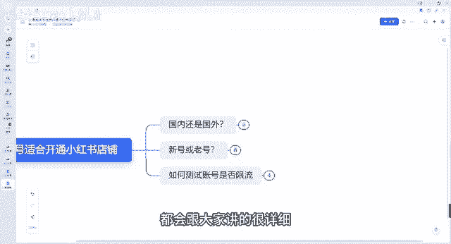

首先呃不管说你是人在国内还是人在国外的。

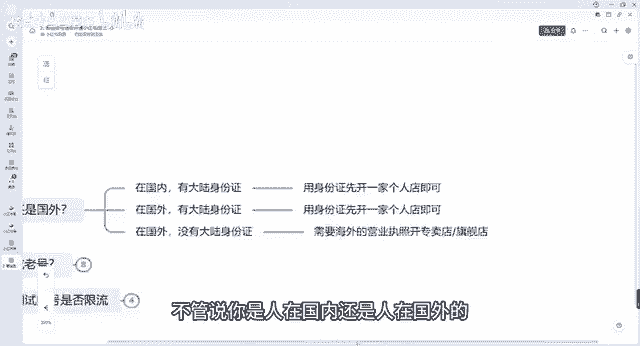

其实都是可以去开通小红书店铺的，第一种情况，你如果人在国内，在我们中国大陆内对吧，有我们大陆的身份证的对吧，那我们直接可以去用身份证，开通一家个人店铺就可以了，小红书店铺跟其他平台的一些店铺。

开通店铺条件还是不一样的，它整体来说还是比较宽泛的，呃因为你像其他店铺的话，整个条件还需要你有营业执照，而小红书开通我们个人店的话，并不需要你去有营业执照，开一个个人店就可以了，有一个身份证就可以了。

第二个你如果说是在国外的对吧，但是你也有大陆身份证，那没问题啊，我们也是可以用身份证开一家我们个人店好吧，呃就是你首先第一个条件，你如果说不管人在国内还是在国外，你有身份证，你就可以开通了，第二个呃。

你如果说人在国外，但是你也没有大陆的身份证对吧，没有大陆身份证，那怎么办呢，我们就需要有一个海外的营业执照开通，可以开通一个专卖店和一个旗舰店，我们也有学员，他是人在国外的，但他有自己的货源。

他们自己有外国的一些货源，那他想营销到中国来怎么办呢，那就需要有海外的营业执照，就可以开通店铺，就可以呃营销到国内了好吧，但是它只能开通专卖店跟旗舰店好吧。

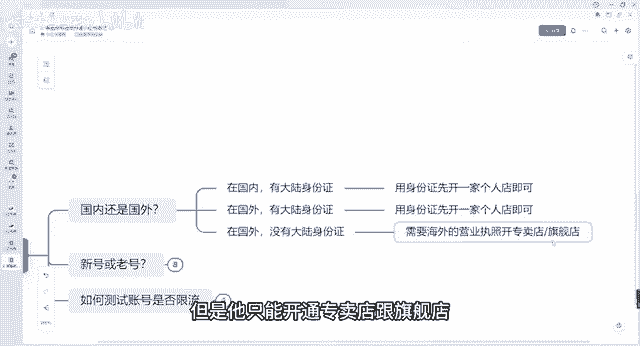

呃这个是一个条件，我们不管人在国内还是在国外都可以开店。

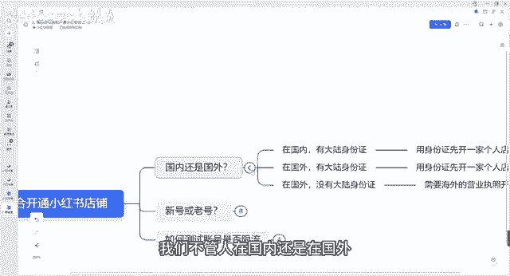

第二个就是我们考虑到我们新号还是老号，我们如何去开店的问题。

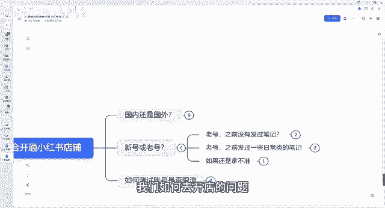

不管说你是新号还是老号，其实我们都是可以去，如果说条件允许的话，都是可以去开店的，好吧，呃都是可以去发布作品的老号，首先我们分为你之前有没有发过笔记，如果说你之前没有发过笔记。

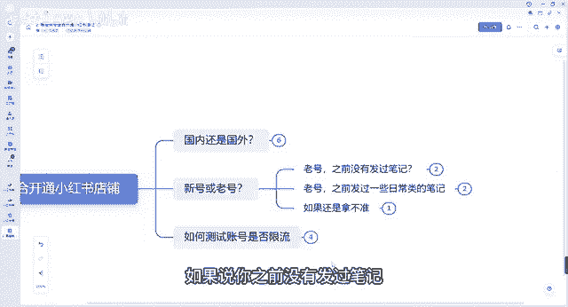

那没有问题啊，第一种条件，如果说你没有发过笔记之后，这个号之之前是我自己，我自己在用的，我经常天天在游对吧，天天在刷一些我自己喜欢的内容对吧，而且这个喜欢内容，可能跟我自己接下来想做的内幕是有点区别的。

所以我们最好是要换一个专门的新号，专门的新号，因为可能这个标签就不精准了，跟我们未来想打进这个人群的标签，肯定是有点冲突的，有点冲突的，因为我们自己用的账号嘛，标签啊，什么都呃都都有了。

后续来说不太好养号的好吧，第二个呢，如果说你之前对吧，只是注册过，但是没怎么用的，这种情况呢可以用这种账号，我们因为这种后续是比较好养号的。

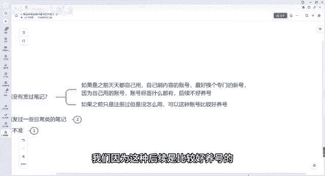

比较可以自己自己使用的，如果说你之前发过一些日常内停的笔记。

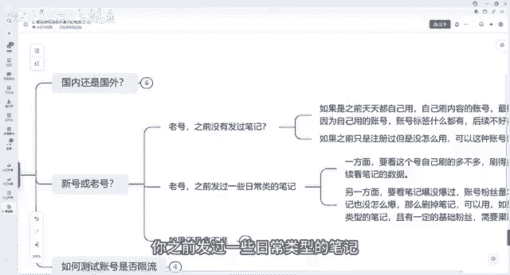

一方面要看这个号自己刷的多不多，如果说你这个号刷的比较多，那我们就需要及时给他换掉对吧，因为你刷的多了，你这个发货笔记了，你经常标签，我还是那句话，你标签乱了，标签乱了话，你想后期再养改过来。

那难度还是比你重新再培养一个号的，难度要大的，如果说哎自己刷的不多，而且发的笔记啊，整体流量也不是很好的情况下，那因为他没有打上足够的标签嘛，那我们就可以自继续使用，另一方面呢要看笔记报没报粉丝。

账号的整体的粉丝数量是怎么样的，如果涨的不多，刷的不多，笔记也没怎么报过，那我们可以删掉笔记，因为我刚刚讲到了对吧，你整体的流量不是很多，因为你没有打上足够的标签，那我们就可以用，如果说你刷的不多。

之前发了其他类型的笔记，且有了一定的粉丝基础，我打上人群标签了，人家都都都能刷到我的账号了。

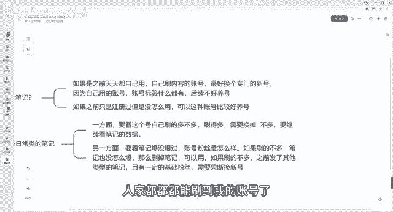

那我们就需要果断果断的换掉新号，要不然你这个老号后续如果说标签很乱的话，你再想把这个标签给他改正的话，难度肯定是比你培养一个新号难度要大很多的，而且我们接下来也会跟大家讲一讲。

我们新号如何去养号的问题啊。

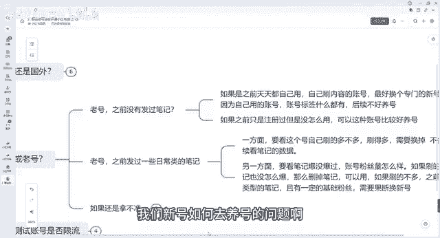

好吧呃，这是第一第一个老号的问题，如果说新号的话，其实我们自己如果说我们没有这些问题，我们自己做一个新号也是没问题的，我们会对吧，那如果说你还是拿不准，我们自己到底是否用自己老号。

那我建议大家直接就换新号，找自己的家人帮忙注册一个信号就可以了啊，找自己的家人，一定要是比较熟的家人，因为这个的话后续还得考虑到一个银行卡，人家打的成交额，打到银行卡里面的问题，好吧。

这是第一个新号老号的问题啊。

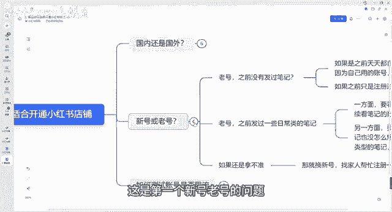

第三个我会跟大家讲一讲，如何去测试账号的是否被限流，而正常情况下。

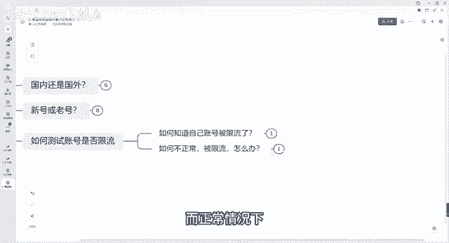

我们账号如果说没有出现大量违规的情况下，正常情况下是不会有太多限流的，大家不用太过于担心好吧，如何知道自己的账号被限流呢。

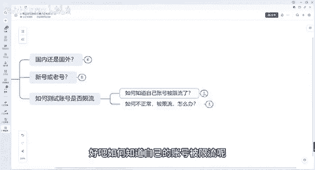

我们可以通过这个方法测试账号的限流方法，我们可以发布一个日常分享的一个笔记，发布什么都行对吧，正常一点的笔记，日常的分分享的生活就可以了，看24小时内的流量情况，如果24小时后流量能达到50左右的对吧。

那么正常流量是正常的，账号流量是正常的，如果说连50都没有，可能只有一个两个这种额流量的，那说明你一个账号可能会处在违规阶段的好吧。

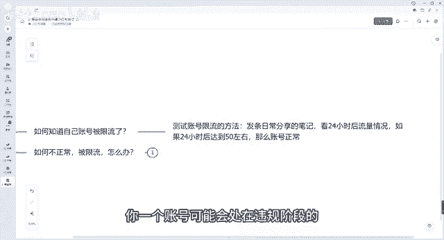

如果说不正常被限流了，那我们怎么办好吧，上面之前可能有违规的。

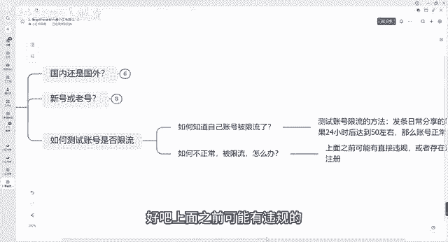

或者存在潜在违规的，我刚刚讲到流量很低的，我们建议注销掉该账号，重新注册就可以了啊，重新注册完之后，这一位是一个型号。

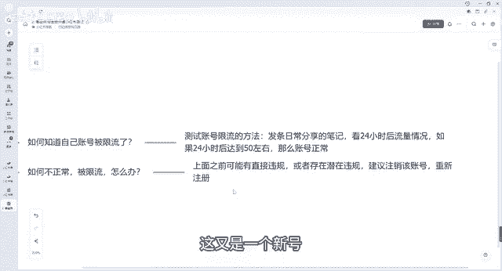

我们在做继续培养就可以了，好吧呃这个就是大家呃跟大家讲一讲。

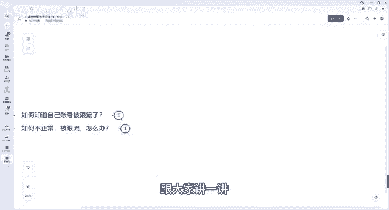

我们如果说我们怎么去选择账号，以及我们如何去测试账号的流量的。

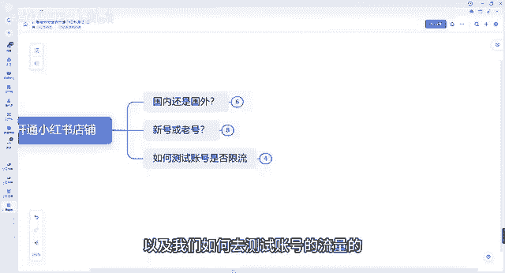

大家不用去担心对吧，我们开一个新号，开一个老号的问题，我建议大家呢，除非说你之前的账号做的很好啦，或者要不然。

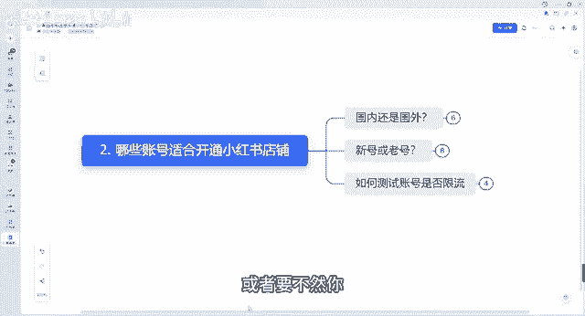

你我建议大家还是去可以注册一个新号，重新养号好吧。

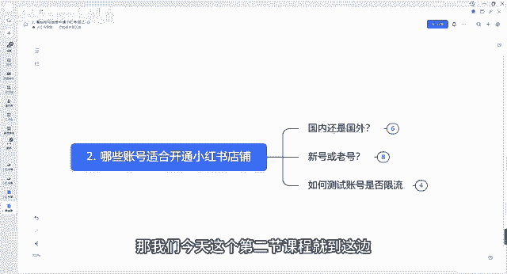