# 【2024B站完整版新媒体运营教程】99%的人没看过的全平台新媒体运营教程 小红书运营起号／抖音拍摄剪辑／短视频文案编辑 最适合新手7天就业课程！ - P32：14：新媒体运营-用户标签与创作者标签的完整诠释 - 大咖私域运营 - BV1uw4m1v7hF

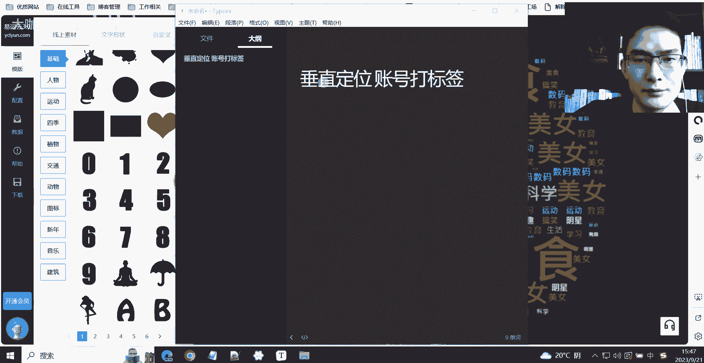

OK好欢迎大家来到我们这一堂课，那么呢我们这一堂课的主讲的一个主要内容，是跟大家讲清楚，关于垂直定位，以及账号打标签这一块的一个知识点。

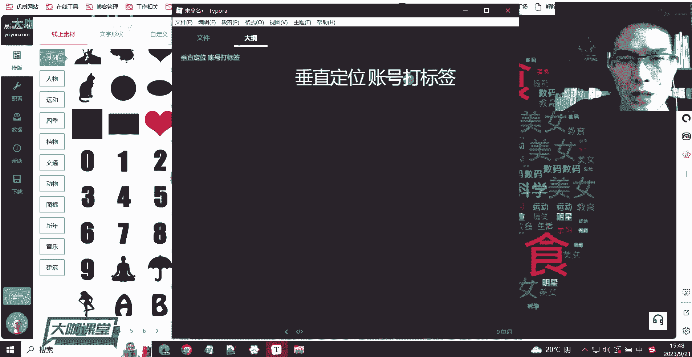

那么我们其实在之前的内容中也给大家讲过，或者说你们自己也或多或少的听过，但是很多人讲，现在你在做新媒体。

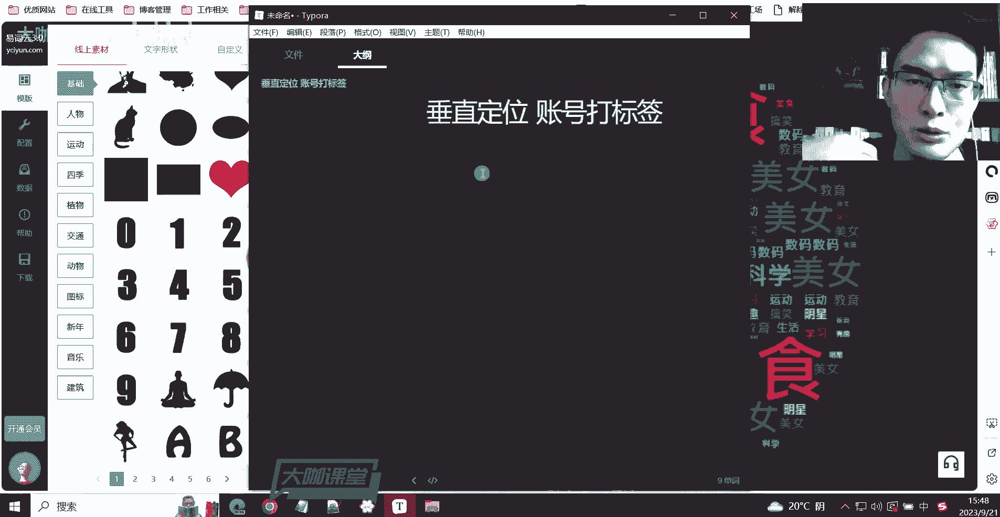

抖音小红书也好，或者其他的平台也好，以主打的就是一个什么呢，就是垂直啊，也就是我们要做定向的领域，但是很多人就是没办法理解啊，比如说抖音有打标签这么一回事，对不对，他们很多人觉得啊。

第一件事呢我做这个账号能不能成功。

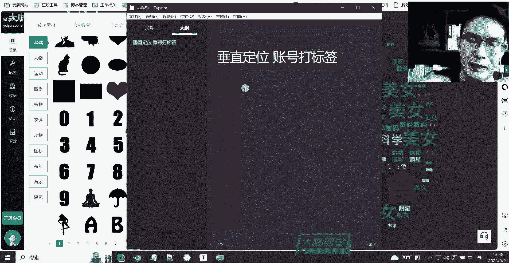

第一件事就是我这个账号能不能打上标签对吧，但是打标签这个东西它到底是什么，我们怎么来理解标签这样的一个概念，很多人在这一块就有这样一个误区，确实很多人他啊作为小白。

也没有接触过过多的这种新媒体运营的经验，确实不太理解，那么我们这一节课的一个主要内容，就是，帮助大家用更好的一种方式来理解平台的标签，以及我们最垂直定位它的一个根本的意义好吧。

那么首先啊我们来看一下这里。

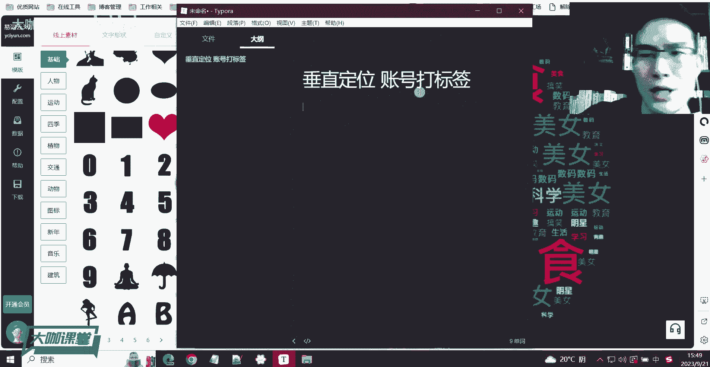

我有一个图好吧，我们看一下这个图啊，呃那么我这里呢是预先配置了一个数据，配置了一些数据，那么我们可以通过这样的一个数据，我们来模拟抖音，或者说其他现在新媒体平台，他们的一个后台标签。

也就是给用户打标签这么一个过程，首先我们来看一下啊，假如假设我现在是一个用户对吧，那么我在这个抖音上面，我平常会刷一些诶母婴美食，美女科学教育等等，我会发到这些类这些类型的内容。

但是呢我在这些内容当中呢，我又对母音特别感兴趣，那么这个感兴趣是怎么来的哈，我就跟大家讲一下啊，首先我们这讲的第一个点就是我们以什么啊，我们以用户标签来跟大家讲啊。

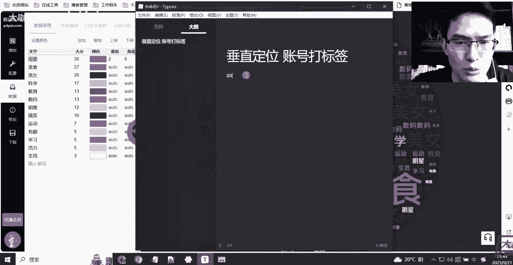

我们来我们以用户标签的形式来跟大家讲，你在这个呃就是说在平台上面，平台是会给他的每一个用户做详细的，这个标签啊，就是给每个用户，他的每一个行为打上详细的标签。

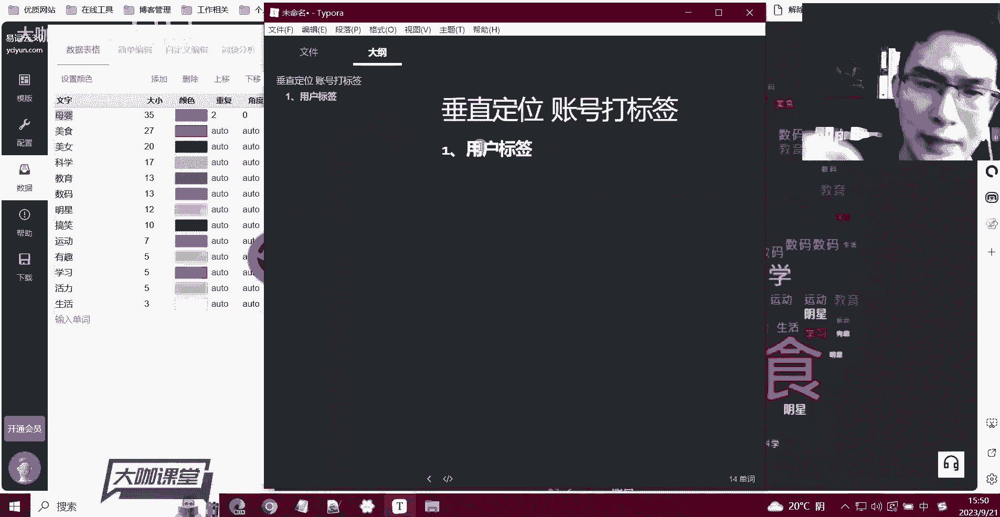

是我们刚才所所所说的这里的这些点，这些点呢就是平台去推四推荐啊，就是说平台去呃，就是监测我们用户所喜欢的一些内容。

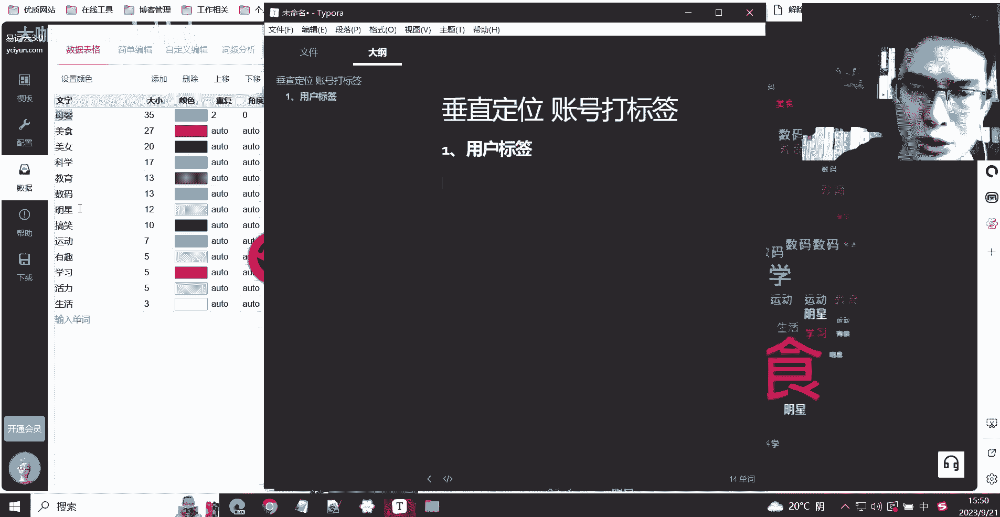

那么这个用户标签它是怎么打出来的，比如说呃我在某音上面我刷到了母婴的视频，然后我刷到了呃这个美食类的视频，美女类的视频，这些视频他们以一个P。

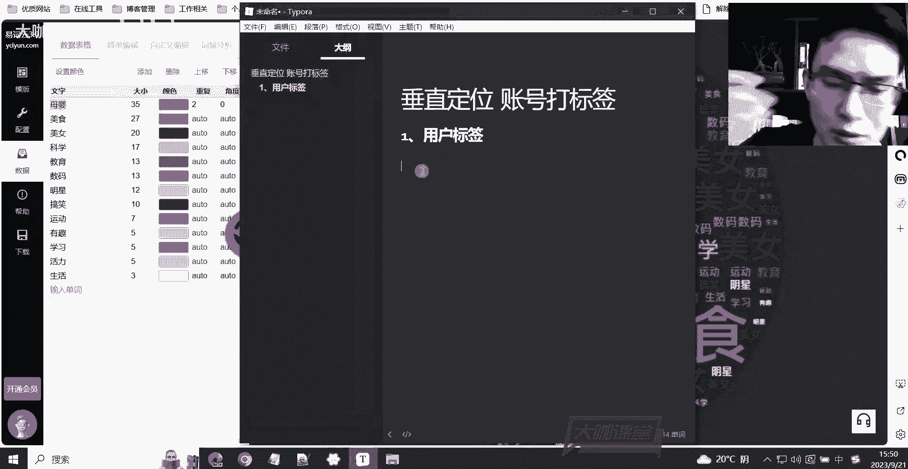

这是一个比较均衡的比例吧，比如说五比五比五啊，也就是说三个啊，我我我每一个领域的内容平台，给我推送的每一个列，每一个内容都是五条对吧，每15条美女五条，然后科技五条。

在这当中美食类的五条我全部都点击进去了，然后呢美女类的我只点了两个，然后科技类的我只点了一个好，那么在这个时候呢，平台就会发现它会给你一个基础的数据值。

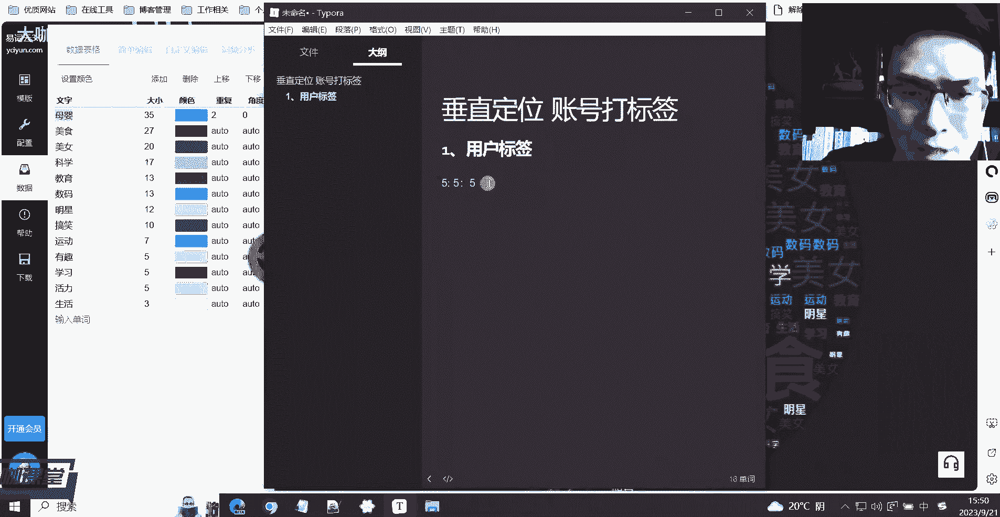

也就是你的美食，你在美食这一块所占据的一个比例诶，五给你打个分，然后美女类的视频两分。

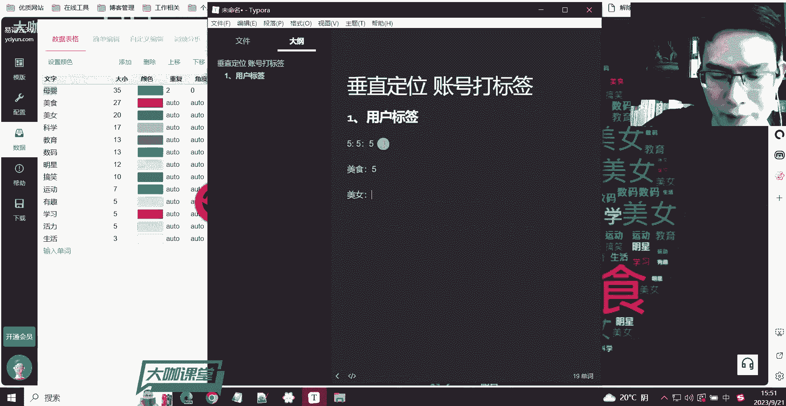

然后科技类的视频诶一分，那么这个时候平台是不是就发现这个用户，他对美食类的内容非常非常的关注对吧，那我为了留住这个用户，在我的平台上，我就得想办法多给他推荐美食类的内容。

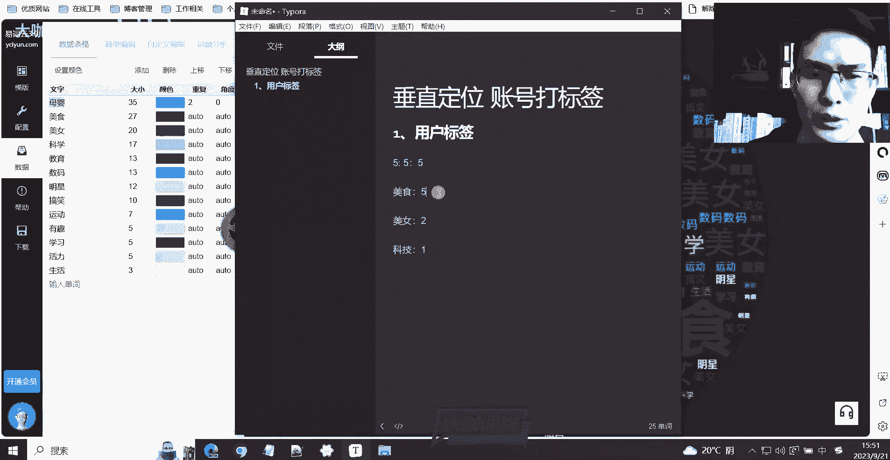

诶，像什么深夜半夜啊，给你推送一些这个吃播啊，类似这样的一些视频对吧，那这个用户呢他就会在这个视频上，平台上，在我的平台上停留的更久，停留的更久之后，他就我就有办法去给他推送一些直播间，带货商品。

它就能在我的平台上产生消费，那么这就是最终用户的一个价值的产出，那假如说对吧，我现在啊给他推送了一个母婴的视频，哎母婴的视频我给他，我也给他推送了五个，那这个时候平台发现母婴类的内容诶，他的点击率是零。

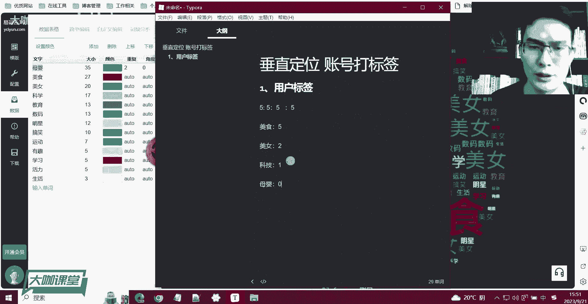

也就是推送了五个视频，他一个都没有点击，这个时候我们也可以判断这个用户，他不喜欢母婴类的内容，这个时候他就会减少给他，或者说直接不给他推送相应的内容，那么前段时间抖音就是很火的一个话题啊。

就是有一对夫妻他们吵架对吧，然后呃男的也发了抖音，然后女的也发了抖音，最后呢他们看了一下，就是两个人的账号，底下男的这方面呢，很多评论的都是以男方这个呃，就是为为核心为中心去参与评论的。

然后女方那边呢又以很多女性为主题，站在女方的角度上来评评论，参与评论，就是这个东西呢产生了一个信息隔离啊，就产生了一个信息隔离平台呢，他把这一块是抖音这块玩的特别溜啊，玩的特别也特别精细化。

所以说用户标签，我们所理解的用户标签就是这么来的，那么这个时候我跟你讲的这个点，基本上屏幕的屏幕前的各位啊。

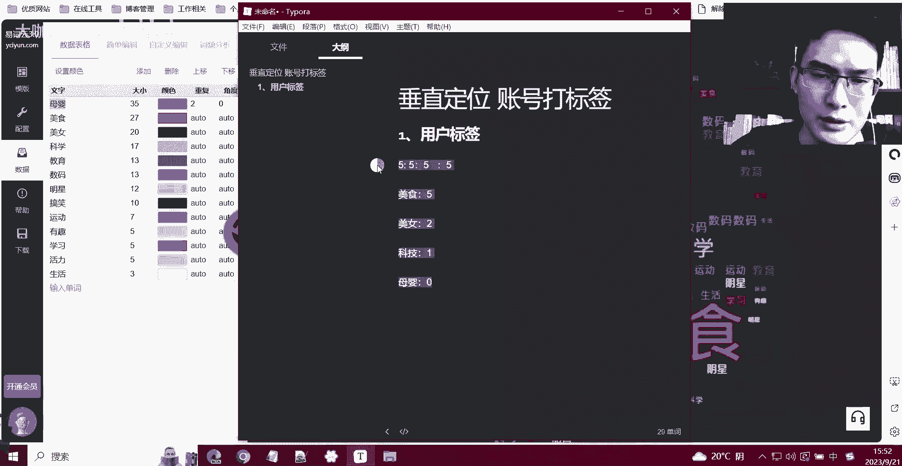

你们就应该能够理解用户标签它是怎么，它是怎么产生的，那么我这个图这个云图啊，词云图其实你就可以理解为是一个正常用户，在抖音后台他给你的一个数据画像啊，就是我的这个我发现我分析的这个用户。

他在我这里边喜欢哪些内容，每个内容它所占的比例数值又是什么样的，OK那么这是我们给大家讲的啊，跟大家讲的关于用户标签，那么用户标签在这块。

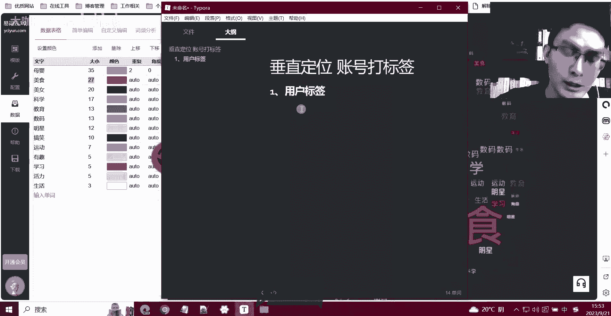

其实我们刚才聊到的一个什么呀，点击率对吧，也就是用户点击的一些视频的一个概率，然后呢还有一个什么呀，还有停留时长，也就是说我们日常讲的一个叫什么呀，呃在抖音上讲的，我们这叫完播率，对不对。

也就是说这个用户他看完了这个视频。

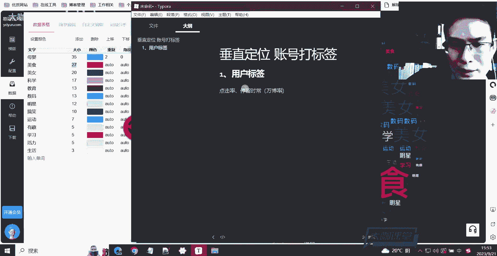

然后他看了他点进来这个视频他看了多久，是不是，这就是我们所讲的完播率，然后还有一个是什么，还有一个就是用户的互动行为，对不对，总共就这三点对吧，互动行为包括什么，包括关注点赞收藏啊，然后还有他的评论。

其实呢这三点啊，这三点呢是这三点数据每一个都不一样的啊。

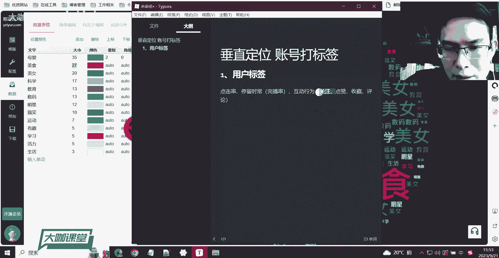

关注我是可以，我是需要把他单独拉过来的，单独拉出来的，这个关注呢跟我们正常的这种呃，这几个用户互动的一个行为。

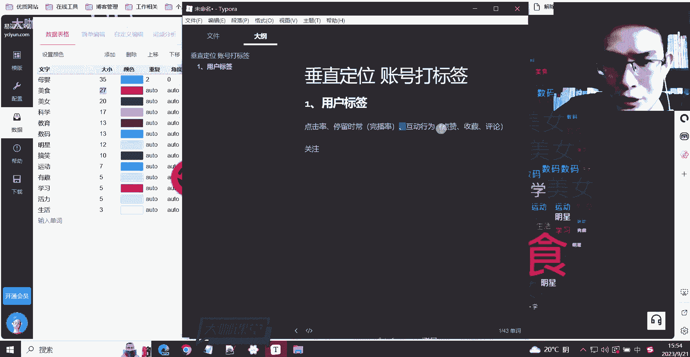

数据是有一些有一定区别的啊，它们之间的数据是有一定区别的，这个我在后面会去跟大家讲啊，会去跟大家讲，啊先给我们的课件改下格式。

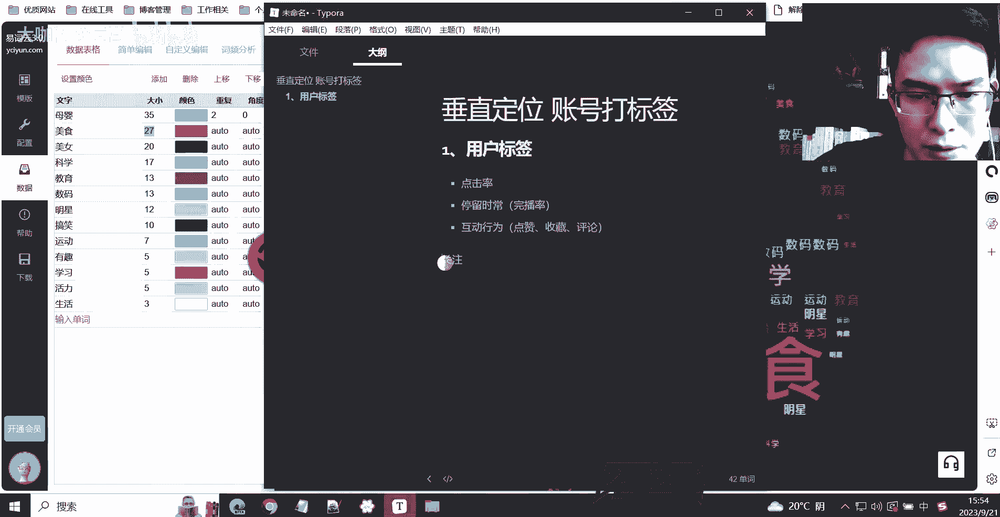

OK那么这是我们上面聊到的，也就是关于用户标签这一块，那么如果是我们作为创作者来讲啊，我们创我们作为创作者来讲，最关心的就是一个创作者的标签啊，创作者的标签，那么我们我们知道啊，用户也就是说平台。

他去判断你的这个账号是做什么的，是做什么内容的，我们觉得是用什么东西，什么方式来商量的，是比如说我发了很多视频啊。

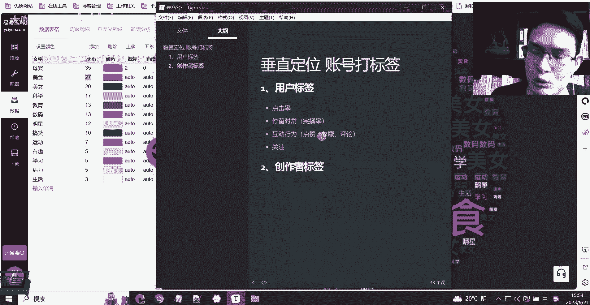

这个视频呢有母婴里边的，比如说给宝宝做辅食的。

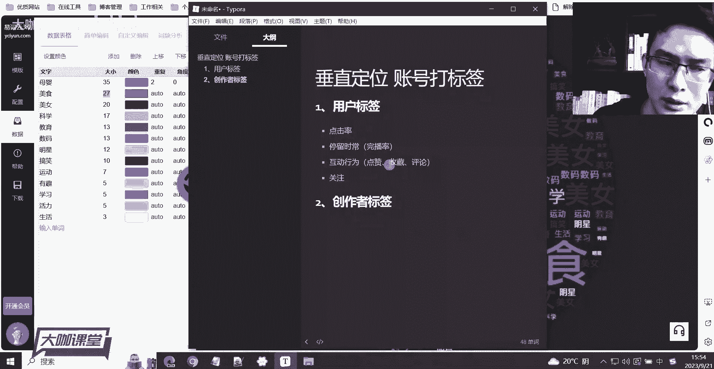

然后呢我带娃的日常分享，然后我跟娃之间的一些互动等等等等。

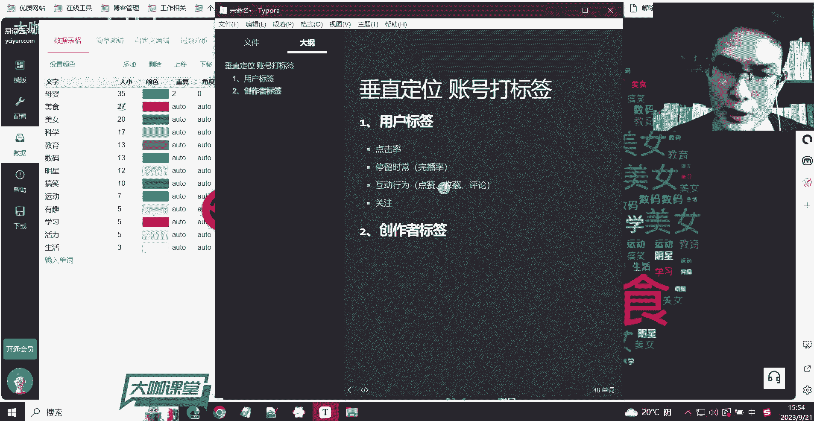

那这些题材是不是就可以被抖音，平台就是认定我就是一个母婴类的博主啊。

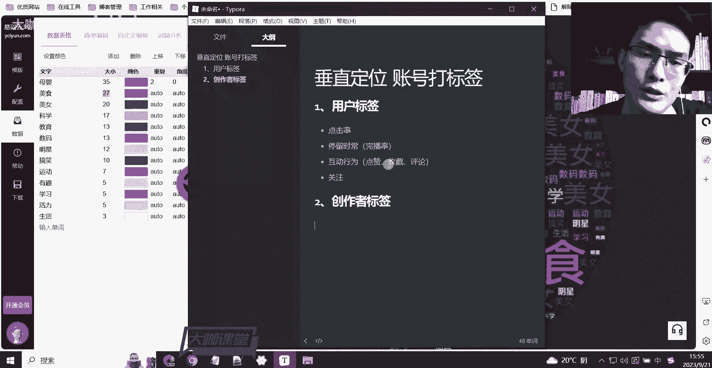

母婴类博主其实不是啊，呃我们正常的理解就是我们发相应的视频平台，就可以理解，但其实平台理解我们视频它是通过什么呀。

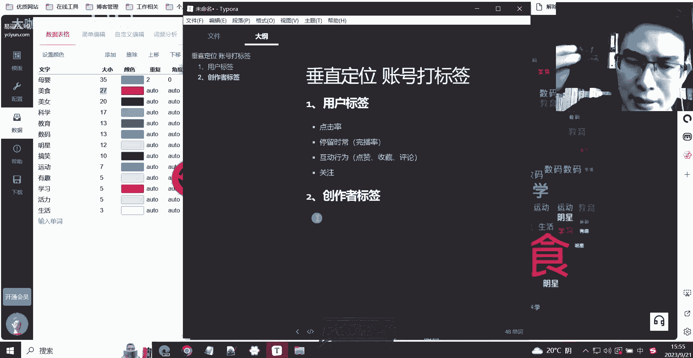

它一样是通过标签啊，通过标签这个标签怎么来。

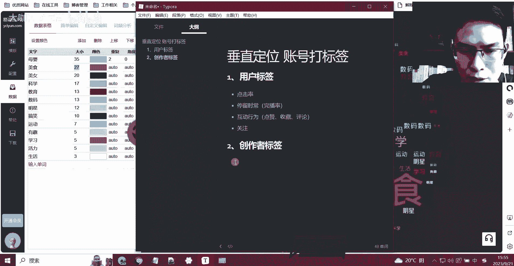

也就是我们所讲的账号标签啊，也就是我们所讲的账号标签。

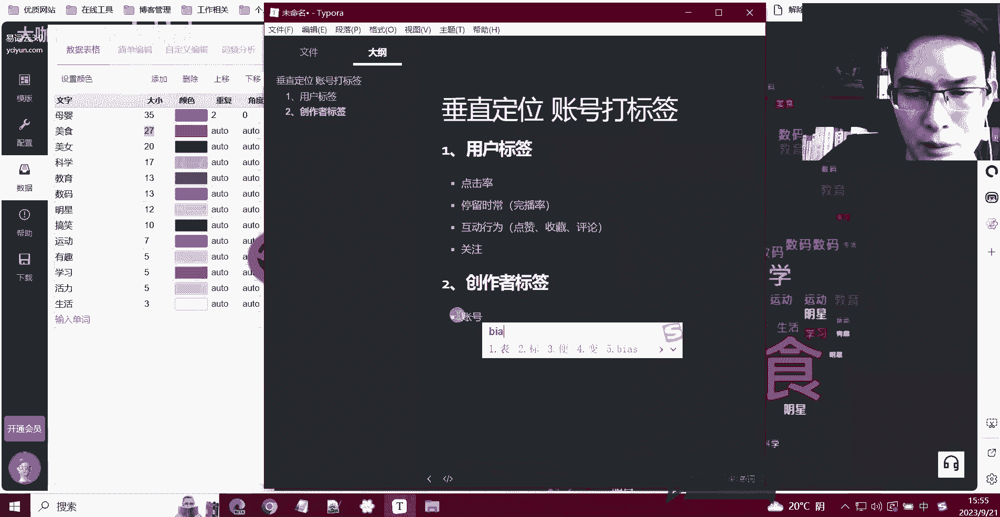

这个标签怎么打，就是像我们这里，我们作为一个创作者，也就是我们之前跟大家强调，你一定要在这个领域培植的一个核心目的对吧，核心的目的首先做母婴，假如说我们是做一个母婴的博主。

这个时候我们的内容既做了母婴啊。

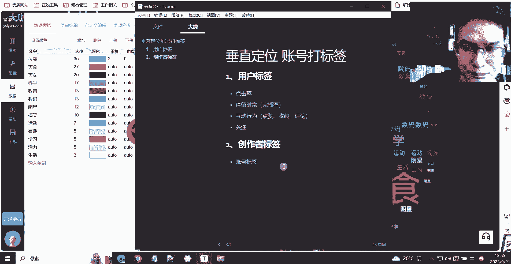

我举个例子，你既做了母婴，你还做了女装，然后你还发一些日常生活类的这种打卡视频，对吧啊日常生活打卡视频。

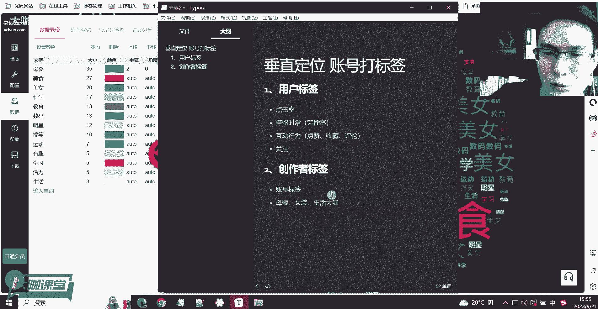

然后另外有一个博主，这个博主呢，他发的所有的内容都是母音相关的对吧，都是母婴相关的，那这个时候就有一个问题啊，我们来探讨一下，你发了女装，你这个账号发了女装之后。

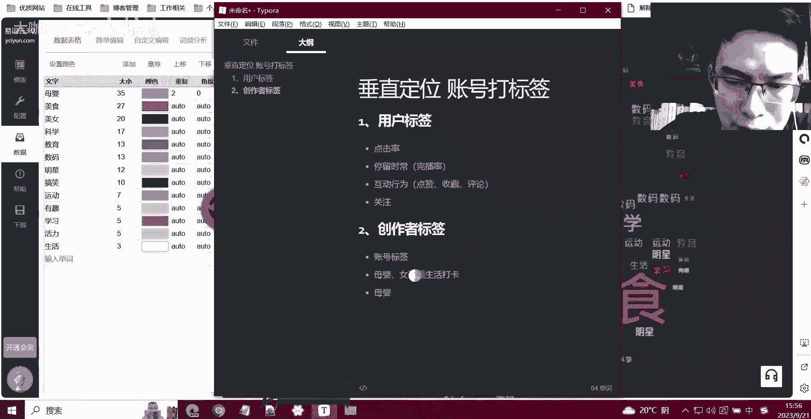

平台，比如说你发女装平台，会把你的视频推送给喜欢女装的这一类人群，但是同时他也会把你这个女装的视频，推送给一批母婴用户啊，推送一给一批母婴用户，因为什么呀，因为你之前你的账号确实发过一些母婴的视频。

然后这些母婴的视频相对来讲，停留的这个时间啊，娱乐时长以及互动等等还算可以吧，可能给你的数据流量值不多，比如说给你个几百的浏览量，但是确实里边有人参与互动啊，有人停留的这个完播率也还可以。

这是一个整体的数据，但是你这个时候啊，你发了一个女装的视频啊，然后他会推送给什么呢，他会主要推送给母婴类的人群，也就是你之前根据你视频之前的一个行为，数据来做判断，但是他同时呢也会去匹配部分女装的用户。

那这个时候就成就出现一个数据，上面的一个拉扯，就是母婴用户发现你发的这个女装类的视频，他根本就不啊不carry啊，他不关心他不喜欢刷到了。

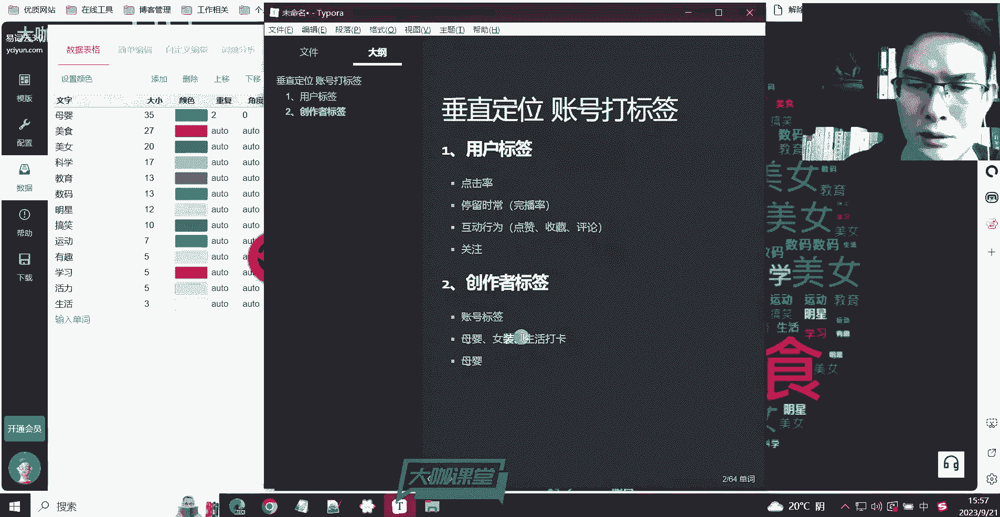

也就是说之前对你这些视频还挺挺感兴趣的，这一类啊，挺感兴趣的这一类母婴群体，他现在突然对你这个账号发的视频不感兴趣，他直接划走了，也没有任何点赞行为，OK那么平台认为你发的这个视频不行。

哪怕说你这样的一个比例啊。

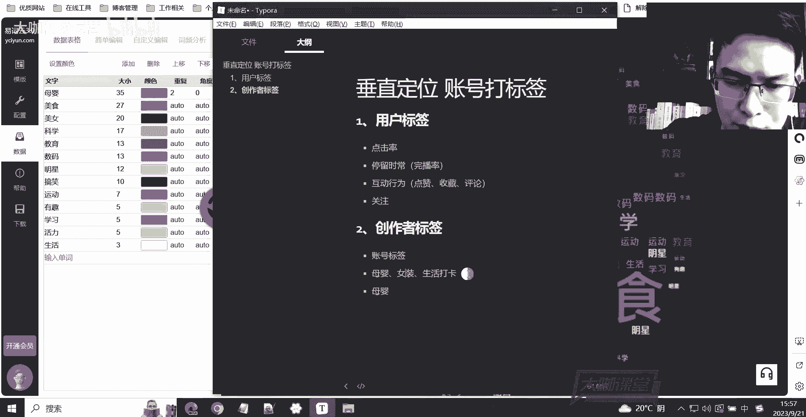

比如说我们我们下面打个比例，母婴的人群占到四啊，然后女装的人群占到一对吧，那这个时候有这么四成的人群，他觉得你的视频不行，那边只有一成的人觉得你的视频可以，那平台自然而然他会认为你创作这个内容不佳。

这也就呃我们以此类推，如果让你去创作更多其他类型的内容，那这个时候平台，它自然它就会通过你这个数据表现，认为你这个账号确实做的很差劲。

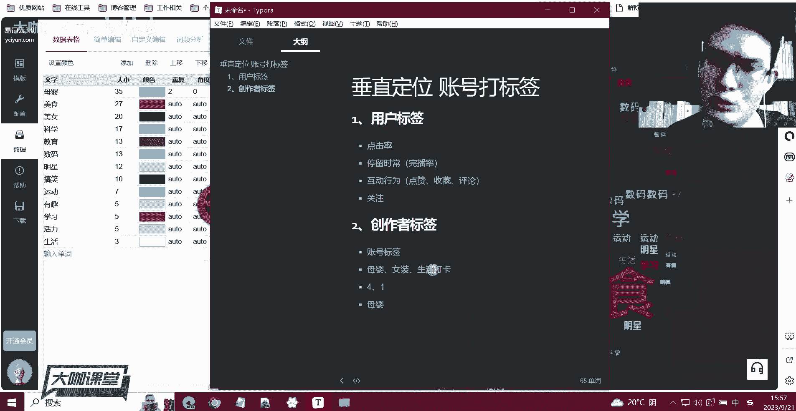

那这也是我们之前跟大家一直强调，你做这个垂直以及你去定领域的一个关键点。

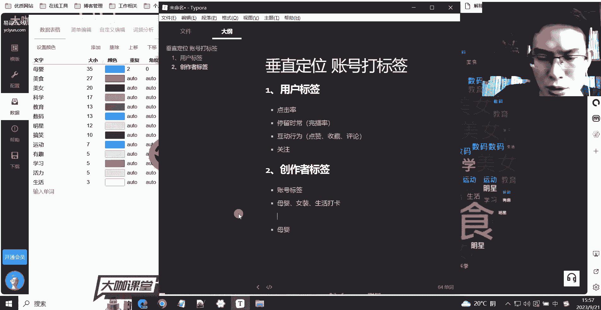

因为平台的人群确实太大了，真的你像抖音他的一个8亿的用户对吧，8亿的活跃，抖音要想留住这些用户，他靠的是什么呀，他吃这碗饭的一个最终的能力，就是根据兴趣标签来做推送啊。

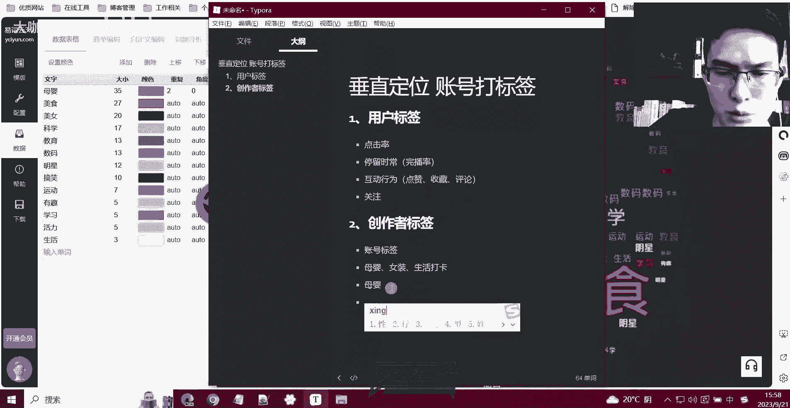

就是根据兴趣标签做推送。

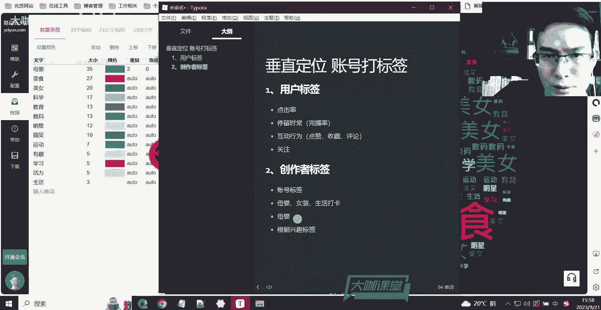

这是他的一个吃饭的一个本领，也就是说他务必要把用户感兴趣的东西啊，我我一定要做到多样化的内容，但是每一样的内容我要确保做这一个内容的，他是这个行业的专家，对不对，那比如说你的账号里面发了某音。

你也发了女装，还发了生活打卡类的视频，那平台会认为诶你这个人花样比较多，但是呢你可能会的比较多，但是你就是没有一个专精的样，那我怎么能确保你的视频就是很精致呢，啊抖音。

它是没有办法去读取你视频里边的完整内容，它去分析你的视频好与不好，是否给你推荐流量，是根据流量值层级来做推荐和分发的好吧。

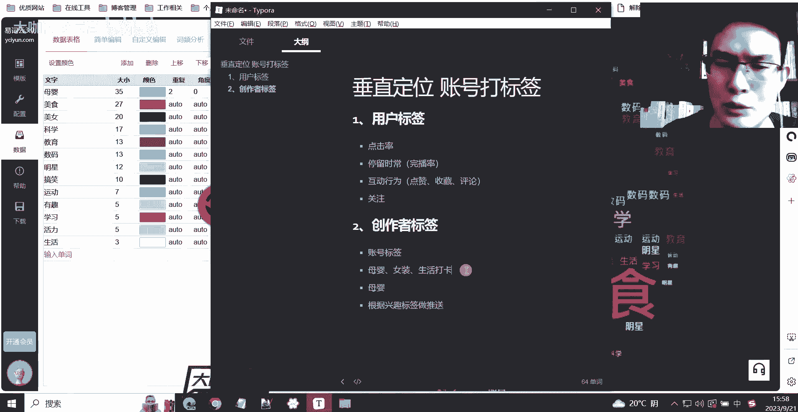

那这个时候你就一定要理解，你要在这个地方把你表现成一个什么呀，你把自己包装成一个母婴的专家啊。

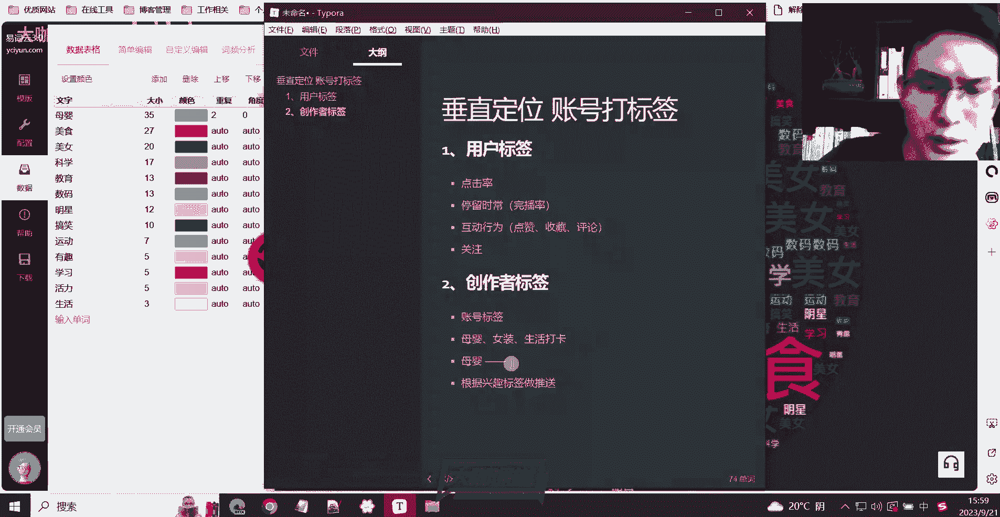

母婴领域的专家，母婴领域的专家，这是一个点，这是关于推送的一个点，然后就是刚才我有一个点就是关注，我没有去讲，对不对，也就是用户的行为这块，为什么我要把关注单独拉出来列一个点，他因为关注这个东西呢。

它不能算作是一个互动行为啊，关注是什么呀。

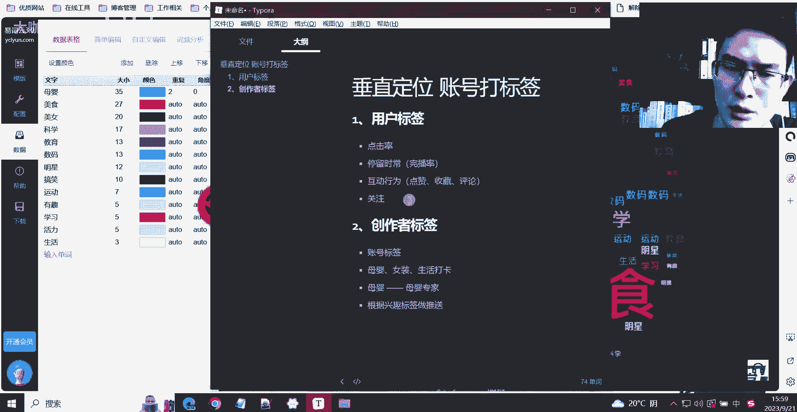

关注是因为这个账号啊，它有一定的价值，比如说我们日常看一些这个呃呃电影分析啊，电影解说啊，或者是一些这个娱乐明星的这种账号啊，对不对，他一定是这个账号有一定价值给我，然后我才愿意去关注他的。

我期待他后期创作更好的视频，或者说我看了他当下的视频，我还觉得没有过瘾，我希望关注他，我持续看更多的内容，后面我想起来了，我再回来关注，这个就是一个价值的问题，为什么关注你，因为你有价值，对不对。

你作为一个母婴领域的专家，你可以给我提供很多母婴方面的内容参考啊。

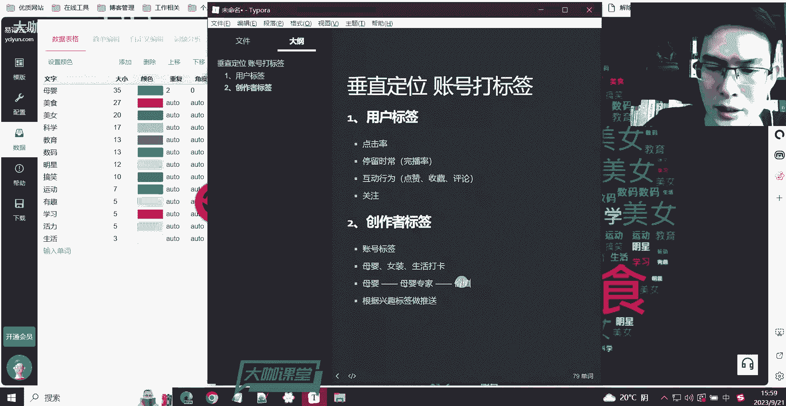

还有一些很多比较不错的好货，对不对，那这才是我关于关关注你的一个点，那如果说你在定位垂直这块，你做的十分杂乱，那我关注你的时候，我只关注你的部分内容，是不是啊，但是你这部分内容我又没有办法去确定。

你这个账号后期到底是更新的母婴还是女装，还是你就发一些自己的自拍，我并不carry这些啊，这个时候就他关注你的价值点就没有。

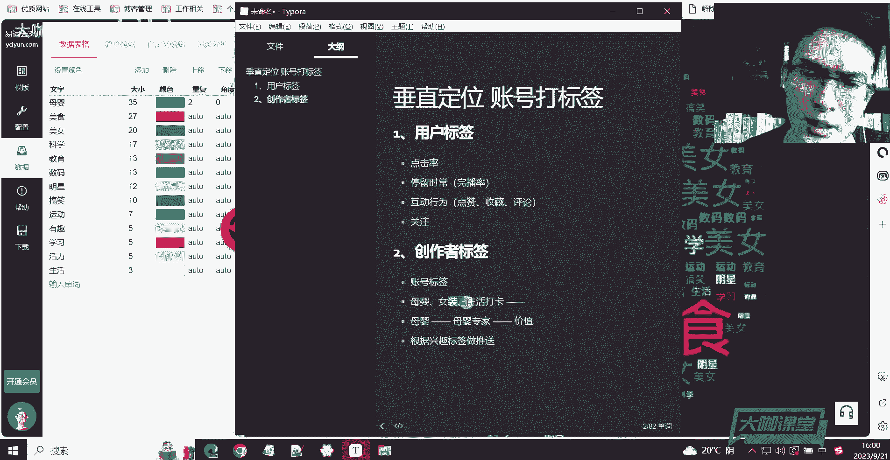

能不能理解啊，能不能理解，就是大家一定要明白标签，平台打标签它分为两个，一个是普通用户的标签，一个是我们作为创作者的标签，我们一定要保证自己的标签只有一个啊，从始至终只有一个，我们只做这一块的内容好吧。

然后呢下一节我们就跟大家讲，在我们去做标签的时候。

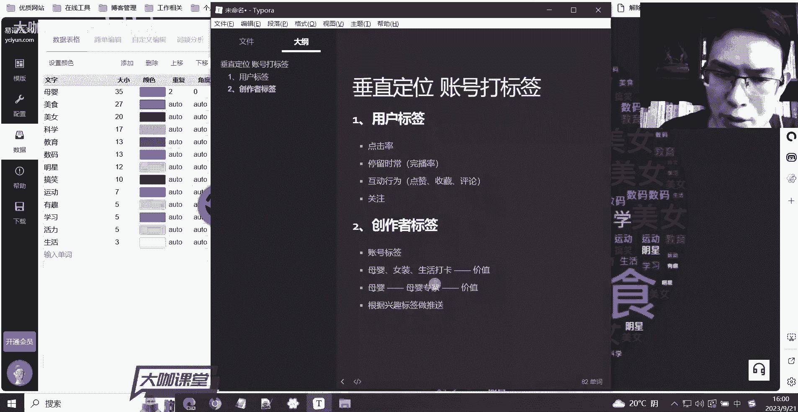

我们作为创作者领域的时候，怎么样才能让系统精准的识别，我们就是这个领域的专家啊，我们的关键词，我们的标题，我们的内容文案这一块，我们到底怎么去策划，才能让我一个新号，能够短短时间内成为在抖音后台里边。

我是这一块一个专家这么一个身份和一个标识，OK那么这是我们这节课讲的一个重点，那如果说大家关于定位账号打标签这块，还有其他的不了解的，也可以随时在评论区艾特老师好吧。

或者说把你们的疑惑或呃疑惑的点或者疑问，私信评论的形式发给我们。

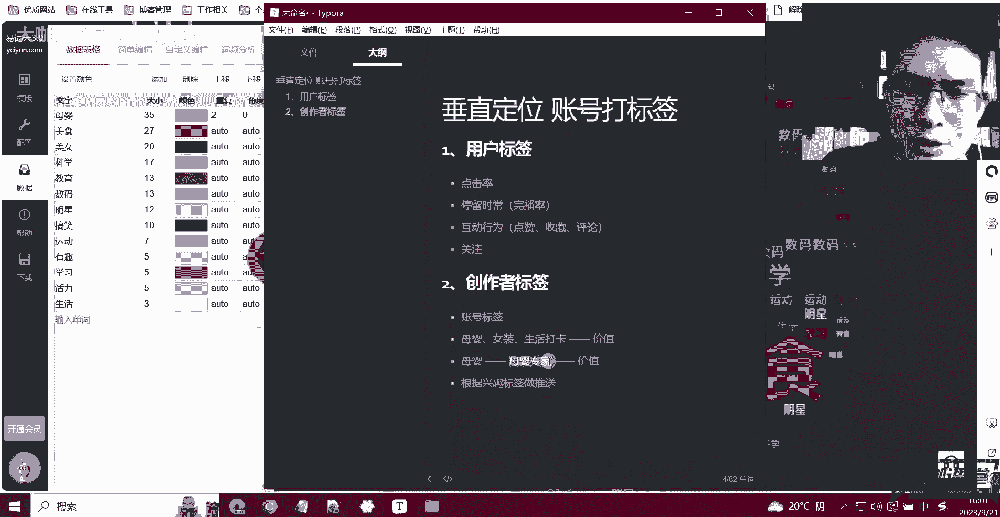