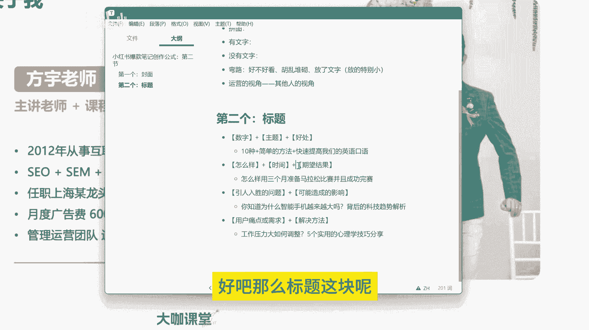
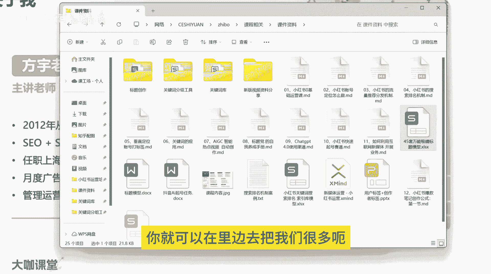
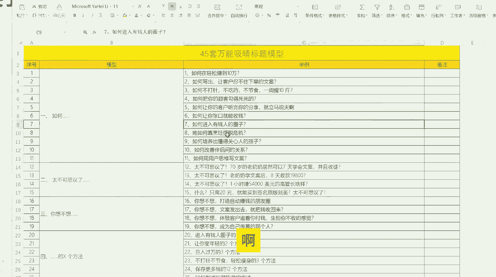
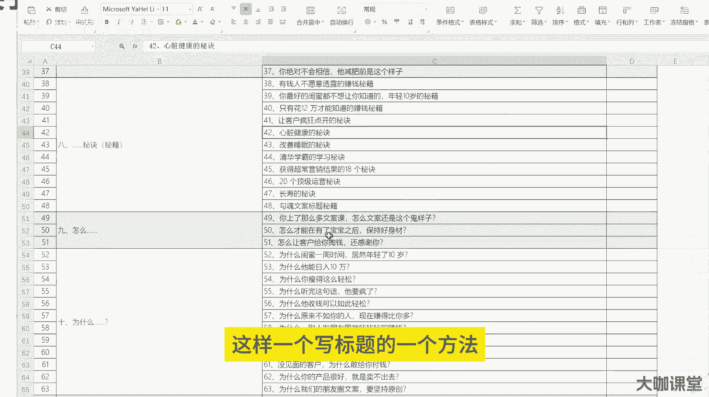
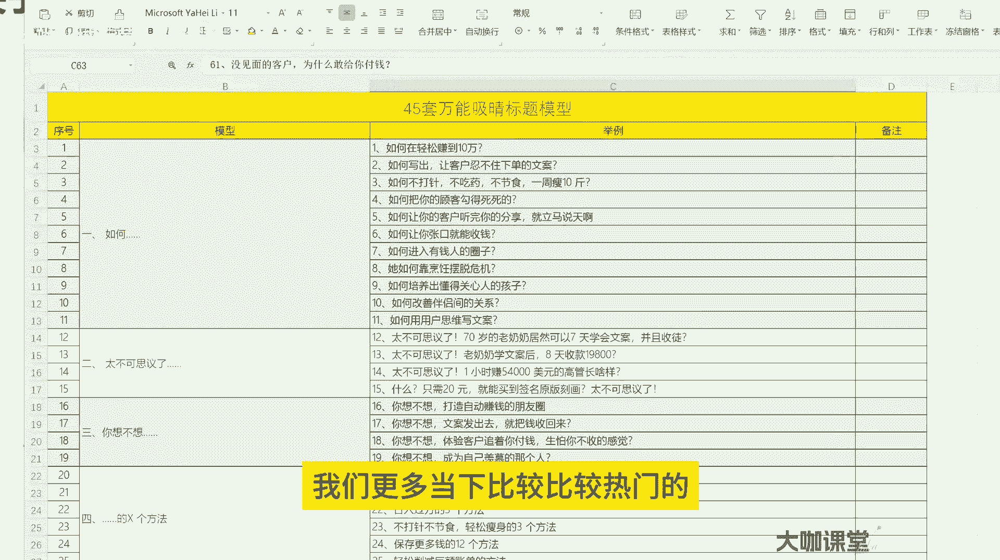
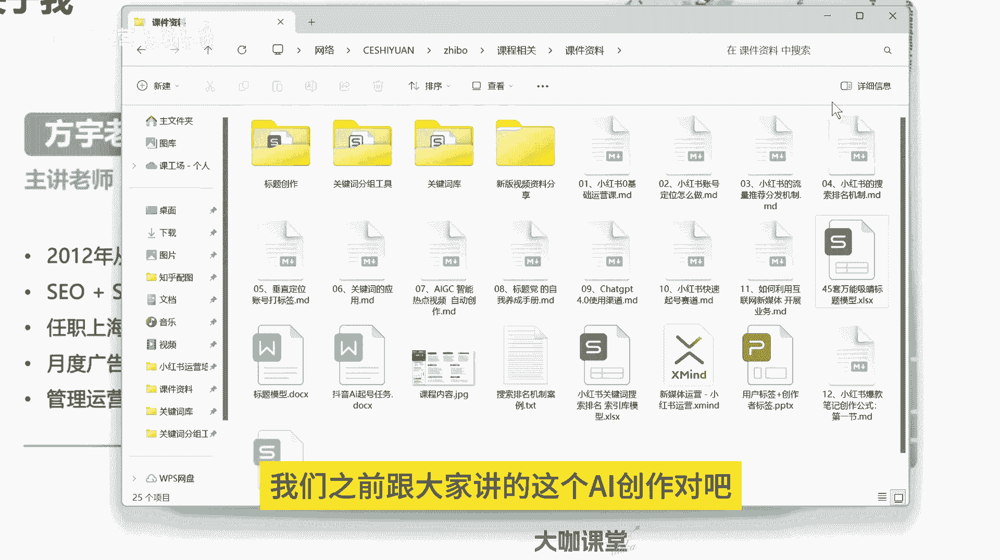
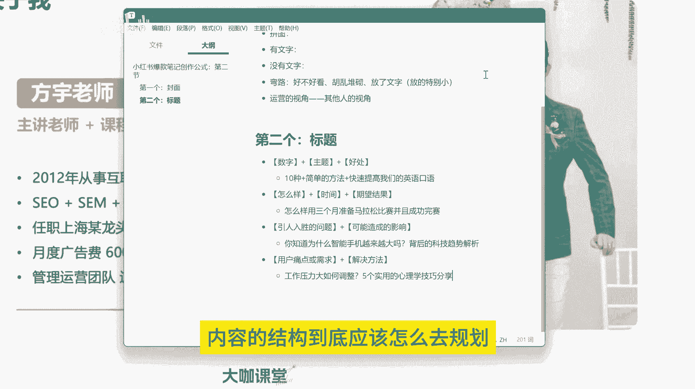

# 【2024B站新媒体运营教学天花板】全平台顶级教学 小红书运营／抖音直播带货／短视频拍摄剪辑／流量玩法／涨粉变现 全输出 无废话！ - P23：21、图文笔记：爆款笔记创作公式：第三节 - 大咖私域运营 - BV11LYMerEtz

哈喽大家好，那么我们这一节课呢就跟大家讲一下，标题这一块啊，非常非常的重要，那么呃呃我们一直都说，从我们运营的角度来讲啊，如果说你不做标题党，那么你就不是一个好运营，我们所有人呢取标题对吧。

我们标题吸引用户，吸引用户的一个，对你内容产生的一个产生兴趣的，这样的一个点击行为都是从什么呀，从标题这一块去引起的对吧，一个好的标题，能让用户对你的这个内容产生点击，然后呢你再把内容做好。

用户才能对你的笔记形成一个互动的行为，点赞收藏停留时间，以及进入你主页的这样的一个页面的数量对吧，这些都是我们要去经营的第二个步骤，也就是我们的标题，那么标题呢有很多的创作方法。

其实呢呃我们很多人在写标题的时候，他可能会疑惑，到底这个标题该怎么写啊，我们有没有什么样的方法，那么这里呢我就给大家分享几个，我们能够去套用的这样的一个公式，OK首先第一个就是我们用的比较多的啊。

就是数字加上我们的一个产品，或者说加上我们要跟这个用户讲的，一个核心的一个点啊，就是我们的主题，然后呢再加上一个什么，再加上呃，用户，就是我们这个内容提供给用户的一个好处啊，我们来看一下啊。

额就是额数字对吧，然后呢加上我们的一个，加上我们的一个主题，再加上就是好处，OK可以这样理解，那么怎么怎么去怎么去怎么去讲这个东西呢，就比如说啊十种啊，十种简单的方法快速提高我们的英语口语。

十种简单的方法快速提高我们的口语，英语口语，OK我们来看一下啊，十种简单的方法快速提高我们的英语口语啊，这是这个结构，我们来拆分一下啊，首先数字十啊，十种啊，这个是我们的数字，配合我们来拆解一下。

然后呢加我们的主题就是简单的方法，提高我们的啊，简单的方法啊，简单的方法嗯，十种简单的方法，我们的主题就是方法，然后呢好处就是能够快速啊快速提高啊，快速提高英语口语，这就是我们的这个结构。

如果说你创作这样一个标题，你用户关注的焦点在哪里，用户关注的焦点在哪里，我们来拆分一下，一定是首先十种简单的方法对吧，他要看的是诶有十种方法可以提高英语口语，那么他才会去对你这个笔记产生兴趣。

然后进去看一下到底有哪十种方法，OK这是我们要讲的第一种啊，是我们的数字加主题的一个形式，然后我们的第二种呢就是呃加上一个疑问句啊，疑问句，比如说额怎样啊，然后呢，再加上我们期望的一个这样的一个。

能够给用户提供的一个结果，我先把这个写出来啊，比如说怎么样对吧，然后加上额我们的一个额期望结果啊，期望结果，然后我们举个例子啊，就是怎么样用三个月准备马拉松，并且成功完赛啊，怎么样用三个月准备。

准备马拉松比赛，并且，成功完赛，OK其实呢这个里边也还有一个，还有一个东西叫什么呀，它里边还有时间，对不对，这里边还有时间怎么样对吧，是我们的疑问句怎么样，是不是可以拓展出非常多的这样的一个。

标题的模式对吧，用时间三个月，OK然后呢我们的结果就是准备马拉松比赛，并且完成完成完完成比赛，这是我们要提供的一个标题，我们吸引用户的点在哪里，我们吸引用户的点在哪里，首先马拉松比赛完赛啊，完赛。

这个是我们用户关注的节点，假设你现在想要参加马拉松比赛，你肯定要考虑，我要准备对吧，我还要完赛，那么我要提供给你的就是，怎样让你在三个月的时间之内，能够准备好一场马拉松的比赛，并且成功完赛。

这就是我们这个标题带给用户的一个价值，好吧，那么呃我们再再讲第三个，就是我们首先呢提供一个呃引人入胜的，这样一个就是能够吸引用户的一个兴趣的问题，点对吧，加上什么呀，引人入胜的一个问题。

点加上这个问题可能造成的一个影响，我们来举个例子，你知道为什么智能手机越来越大吗，背后的一个科技趋势分析，OK我们来看一下啊，你知道为什么，智能手机，越来越大呢，背后的科技趋势解析，我们来看一下啊。

首先问题点是什么，你知道为什么智能手机越来越大吗，啊这是一个问题对吧，你知道为什么手机越来越大吗，你知道为什么现在的火车速度越来越快吗对吧，你知道现在房价为什么越来，为什么现在房价越来越高吗。

背后的产业链啊以及等等等等，这就是一个标题的结构，我相信你们平时应该没有少看啊，没有少看，就是这个地方呢其实是呃给出结果给出结论啊，让用户呢能够对你的标题产生一定兴趣。

到底为什么这个事件他是因为什么导致的，这是我们提供的一个标题的结构方式，第三种好吧，我们再来看第四种，第四种的话就是呃先放放上用户的一个痛点啊，先放上用户的一个痛点，或者说什么呢，呃或者说是需求对吧。

或者说是需求，然后呢我们再加上我们自己的一个什么东西啊，我们提供给他的一个解决方案对吧，我们把用户的痛点在这个地方列出来，标题的前面列出来，然后我们再告诉他这个东西，这个东西这个问题怎么解决，比如说。

工作压力大，如何调整，五个实用，的心理学技巧，分享五个实用的心理学技巧分享，OK我们来看一下，首先第一个是用户的痛点，工作压力大对吧，工作压力大，那我们呃假设把这个地方换一下对吧。

用户的痛点就是说呃经常头痛怎么办是吧，嗯或者说呢嗯呃和男朋友吵架，经常和男朋友吵架，三观不合怎么办，然后后面再加上我们的一个解决方案，这是我们最常见的一些标题的写法啊，最常见的标题写法就是。

后面加上我们的一个解决方法，其实我们很多人在做运营的时候，呃，我们写的标题呢基本上都趋于后者，就是先列出用户的痛点或需求，然后呢再提供解决方法，用户的痛点需求这个东西你们再去分析一下。

是不是跟我前面跟大家讲的这个关键词，长尾词这个东西比较对应啊，对不对，那么这个关键词呢，第一个是可以得到一个搜索展现的一个，结果的可能性，第二个呢就是让用户能够对我们这个内容呢。

他能够通过标题知道我们讲的是什么，然后呢再通过我们后面写的这个解决方法，去让他产生点击的行为，这就是我们去写标题的一个呃公式，很多人呢写标题写的特特别普通一点，吸引力都没有，那么你的标题没有吸引力。

你怎么才能让别人啊，去这用户去产生点击行为呢，那我们之前说对吧，你的内容推送给你的这个精准的用户面前，你要想让他去产生点击行为，不是说推送给他了啊，你的内容跟他相关，他就能产生点点击行为。

那一定是我们前面要有一定的引导，对不对，不管是封面也好，还是我们这节课讲的标题也好，你都要把这些细节做好啊，那很多人说我的内容做的很好，就是产生不了点击行为，那你要看一看你的选题，你的封面。

你的标题这些点他有没有出问题呢，是不是，所以说呃我们运营呢其实讲到一个点，就是我们运营呢做的基本上都是，细到不能再细的一个工作了，有时候呢就我之前呃去让一些设计呢，做一些图片。

做一些这个呃就是海报等等等等啊，就是可能他做的很多版都不能如我的意，可能我把这个文案需求点啊，我把用户关注的点给他标明了，我让他这样去做，但是从设计的角度来讲，他就考虑美观问题啊，你说的这些东西他不懂。

他不懂什么是用户需求，他也不懂这些东西为什么要放在这里，明明放在那个地方更好，为什么要放在这里呢，哎其实从我们的角度考虑，我可能是只想让用户对这个东西，快速产生吸引力，然后让他对这个东西产生点击行为。

然后才能进行我下一步对他的这个呃，呃营销的一个目标，OK那么其实写标题呢还有很多很多啊，呃像我们嗯加上这个时效性，然后加上主题，然后呢通过这个否定形式，再加上我们常见的这种观点和误区。

比如说为什么你不应该每天运动啊，运动的一个科学的分析，科学运动的一个解析是吧，就是这种使用否定形式，来打破我们认知的一个常规手段啊，也就是反问上的一个句式啊，来告诉人，让别人对我们这个内容产生兴趣。

再比如说我们还可以通过对比对吧，两个极端的一个选择，早起还是晚睡，生产力专家的一个最佳的建议对吧，就是通过对比的这种手段，早起还是晚睡啊，早起还是晚睡这个东西呢，观观念让用户呢产生自我的一个分歧行为啊。

对你这个内容产生一个兴趣诶，结合他自身的一个需求，比如说可能很多人喜欢晚睡对吧，晚睡的话呢就意味着什么，就意味着可能晚起对吧，早睡呢就意味着早起，到底这一块呃呃晚睡有多大的伤害。

我晚睡对我有没有很大的影响，我早起我有什么样不一样的，这个呃收获等等等等，这样是激起用户对这个东西的一个好奇心是吧，所以说我们写标题，一定要运用合理的运用一些方法。

而不是说我们自己去嗯类似于口语化的东西，把这个内容写出来啊，这个东西就这样写肯定是不行的好吧，那么标题这一块呢。

我们之前跟大家分享过一个，45套万能吸金标题啊，45套的一个万能细菌标题，就这个啊，你结合着这个工具的话，你就可以在里边去把我们很多呃内容放进来。

把我们的很多行业里边的东西套进来啊。

怎么去把这个东西呃结合就写标题呢，也能有一个比较快速的，这样一个写标题的一个方法。

那么这是一种现在这个内容呢，也进行了一个完整的一个更新，就是结合了我们更多当下比较比较热门的。

比较热门的点和一些平台的一些调性，我们做了一个简单的更新，然后呢还有呃我们这个这个什么这个什么呀，我们之前跟大家讲的这个AI创作对吧。

AI创作标题这一块，就是很多人用AI写标题呢，呃说实话他还是缺少了一定的判断力，因为我们我见过不少写标题的，用AI写的标题，就一眼能看得出来，没有任何营养，没有任何价值，可能从他的角度来讲。

诶他觉得这个AI写的标题还可以，但其实从我们运营的角度来看，这个标题有很大的问题，词用的不对啊，情景用的不对，还有这个方式用的不对等等等等，让人一眼看起来就可能很尬，甚至很搞笑的一个程度啊。

所以说我们写标题这一块，你要有一个运营的基础判断方法，那我们用这些东西，为什么我们要用数字，为什么我们要用这样的一个格式，为什么我们要用疑问句，这些东西都是有原因的好吧，我们要去研究背后的原因。

然后再结合我们这样的一个呃，呃运营的一个技巧，再把它落实到我们真正的操作当中好吧，那么这就是我们这节课跟大家分享的一个标题，这一块的一个内容啊，那么下一节课我们就正式开始讲，内容到底应该怎么做。

