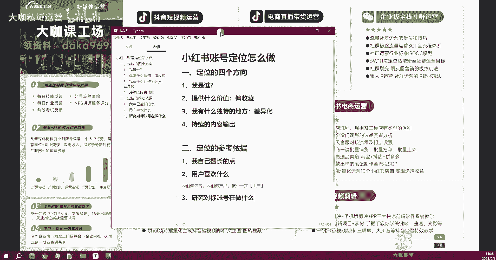
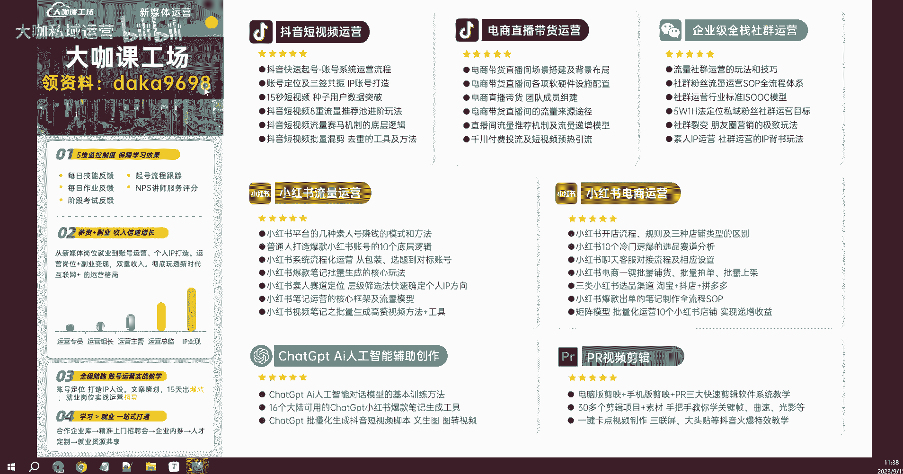

# 【2024B站新媒体运营精品教程】新媒体平台全套运营玩法 小红书运营起号／抖音起号涨粉／短视频拍摄剪辑／直播带货运营 小白7天入职包的！ - P11：01.9：新媒体运营-小红书Ai人工智能模型辅助定位工具分享 - 大咖私域运营 - BV1fz421q7Hq

OK好，那么上一节课呢我们跟大家聊了，小红书的一个账号定位怎么做啊，去做定位的思考的一个四个方向，分别是我是谁，我能提供什么价值啊，我这个账号呢有什么跟别的账号不一样的地方。

然后我这个账号是否有持续的一个，内容输出等等等等，通过这四个调整啊，通过这四个优化，去让用户能够对我们的账号产生，一个关注的冲动，好吧，那这是我们做定位的四个方向，然后呢我也给大家讲了。

我们要去做领域定位的四个三个点是吧，首先这个点呢我一定是自己擅长啊，哪怕不擅长，也是自己能够了解，或者有渠道深入了解的这么一个点，那么这一个方向，那其次啊，也就是我跟大家讲的用户。

用户这个词儿其实非常关键，我们不管是做产品还是做内容啊，还是做服务，我们的核心一定是用户，那么做内容运营这一块呢，你一定要明白一点，就是我们的这个内容，可以给用户带来什么价值啊。

一定是做的是用户喜欢的东西，那么这个喜欢的东西怎么去判定，我们可以通过分析平台对吧，分析大数据领域等等这些渠道来指导啊，我们这个行业诶，用户关注的是哪些点等等，对不对。

那么这个呢会涉及到一些相应的工具和平台的，一些数据的分析，那么这个我们会在后期跟大家来讲，具体我们怎么去查找和分析好吧，那么呢还有第三点，我们可以通过分析对标账号在做什么内容，来确定啊。

我们这个行业的领域里边的用户，他们喜欢什么对标账号做得好的，他的数据好的，一定代表的是用户喜好吧，那么这个就是我们可以参考的，你一定不要觉得哎这个账号爆了，他的内容呢就是因为平台随机给他推送了。

他运气好好吧，那么这个时候呢你一定要脱离这个误区，账号现在能做的好的啊，能起来有一定粉丝量的数据，能做得好的，一定不是运气好吧，一定不是凭运气，它绝对是在它的定位啊，他的选题等等各种方向是去做了优化的。

他做的内容也一定大部分都是用户喜欢的，那么这个时候，他就无形当中给你提供了一个方向，做内容的方向告诉你诶，你应该做什么内容，我都已经给你打好了榜样，对不对，那么这是我们给大家讲的定位的一个参考依据。

那么其实讲到这里啊，我们把这些内容点都已经讲的非常清楚了，但是有些同学可能根据自身的情况，他还是不太明白啊，还是不太明白自己应该做什么样的内容。

那如果说你确实不知道，那么老师这里也给大家推荐一个，非常好用的工具，那么这个工具呢，我自己或者说我们公司的员工呢。

本身也用的非常多啊，这个工具呢就是一个啊小红书的一个账号，的一个辅助的工具，那这个工具它本身是一个嗯，利用ChatGPT这么一个AI的智能模型的接口，来开发的这样的一个工具。

它的工具呢其实本质上就是一个聊天模型，但是它非常智能好吧，这个工具本身可以帮助我们去分析和复刻，同行这些已经做好的这些爆款笔记，他能够分析出这个笔记文案当中，爆款的一些内容因素，通过他的理解去分析。

然后呢还可以把这个呃笔记给我们复刻一下啊，复刻也就是爆款，复刻，相当于是呃我们以前理解的伪原创这个东西，就是说他的呃，把它里边的这个爆款的因子拿过来，然后我们再重新根据这些因子，围绕这些因子去做创作。

那么这个创作的文案，他也必定是具备这样的一个爆款的东西的啊，当然这个东西呢我觉得啊嗯可以做参考，但是你不能把它作为一个完全的依据，好吧，像呃爆款复刻对吧，还有我们经常用到的敏感词检测。

你发内容的时候呢是检测敏感词，这是我们现代新媒体人，你去发文案，有时候可能会被限流，莫名其妙莫名其妙被限流，就之前好好的一个阅读量，后面呢就掉到十几几个，挡也挡不动这种一个根本的因素好吧。

做敏感词检测还有很多非常的工很很多啊，非常多的一个工具，我在后面呢会推荐给大家，还有这个小红书的一个文案，它会根据你提供的选题方向，来帮你生成一个具备小红书风格的，这样的一个文案啊。

你只需要提供一些特别的啊这些点啊，告诉他他就能帮你生成文案，那么我们今天来用一个啊来用一个东西，就是人设定位，那么人设定位怎么去做，我给大家演示一下好吧，那么首先我们先把它提供的这些提示点。

我们来复制一下，那么我们需要填的内容，首先第一个就是兴趣爱好啊，兴趣爱好，比如说你是喜欢做什么的，然后你的工作和生活经历，然后你有哪些专业知识技能，然后你可以投入的时间，你的目标和期望啊，我们照着来。

首先第一个兴趣爱好是吧，兴趣爱好我们讲什么呢，那么我来啊打游戏好吧，我们接地气啊，打游戏看直播啊，兴趣爱好，然后呢唱歌对吧，好我们写这么几个呃，其次呢我们有什么工作和生活经历呢，比如说啊呃做过运营啊。

然后呢参加过游戏比赛，我们看一下这样的一个东西，它能给我们生成一个什么样的一个定位好吧，然后其次呢我们呃还有工作工作对吧，就职做过运营岗位，参加过什么呢，带过100人的运营团队，OK参加过游戏比赛。

嗯线上的啊，然后我们有哪些专业知识和技能啊，专业知识和技能，比如说比如说什么呢，呃新媒体运营吧，嗯然后，新媒体运营能力嗯，小红书起号能力写的非常杂啊，比如说暂时做一个参考啊，小红书请愿努力。

然后呢我们的啊数学非常好，数学非常好，就写这么几个可以投入的时间，每天三个小时好吧，然后呢我们的目标期望是个人IP的打造，就这样，OK我们先发给他看一下嗯，OK来了啊，来了来了嗯，写的这么杂。

你能给我出吗，首先啊游戏解说员，他告诉我依据我们哎我们经常打游戏，我们来参加过游戏比赛啊，我们经常看直播，然后呢可以去做这个游戏解说，匹配度呢非常高啊，那竞争难度一样也非常高，它的定位要求就是。

你要有有一定出色的游戏技术和娱乐能力，差异化建议对吧，这些东西也出来了嗯，游戏攻略，唱歌达人啊，还是很符合的啊，还是很符合的啊，兴趣爱好，专业知识技能，幽默段子，OK啊。

其实分享这个工具的作用呢就是帮助大家，你如果说真的在你的定位这一块，你有非常大的缺陷，你觉得自己真的就是很难去做定位啊，或者说我思考了很久，我也没办法去做好这样的一个定位，那你可以借助这样的一个工具啊。

当然你不能像我一样啊，就在这个地方写的特别特别乱，你一定是要啊有一定潜意识的，你你明白，比如说呃我平常对包包啊，我接触过所有包包品类这样的一个行情对吧，我对这些东西比较了解。

那如果说我可我我往这个方向去做，我就把我的兴趣爱好对吧，我喜欢收藏各种包包对吧，然后我的工作经生活经历，我去过国外，然后去过一些名牌的包包的一些展览等等，对不对，然后我的专业知识技能。

我能够分辨出呃哪些包包比较好，然后这些包包呢呃它的一个价值，未来的一个市场的一个走向等等等等，那么这个你根据你这样一个独特的领域，让他去给你出一份这样针对垂直性的报告，然后你在这些当当中去挑。

那当然你还有其他更擅长的领域，你同样多分析几次，那么你的结果就出来了，你就从这些当中挑出几个比较好的。

挑出几个比较好的之后，然后你再做深度的一个筛选，觉得哪个难度更大，哪一个难度更啊更适合你自己，你觉得你更做得来的，那么这个时候呢就是我们借助这样一个工具，能够帮我们完成的一个内容。

当然这个工具也会分享给大家啊，分享给大家呃，我们领取资料的这这个途径，在前面已经跟大家说过了，就是在这个你的右上角啊，左上左上角，在这个左上角。

我们会去啊把这个东西分享给大家好吧，那么关于定位的这一章节，我们就先讲到这里，具体的呢还是需要我们自己学了东西之后，再去自己私下啊做一些这个实操，那么走一遍过一会过走一遍这样的流程之后。

你就能知道这个东西怎么做好吧。