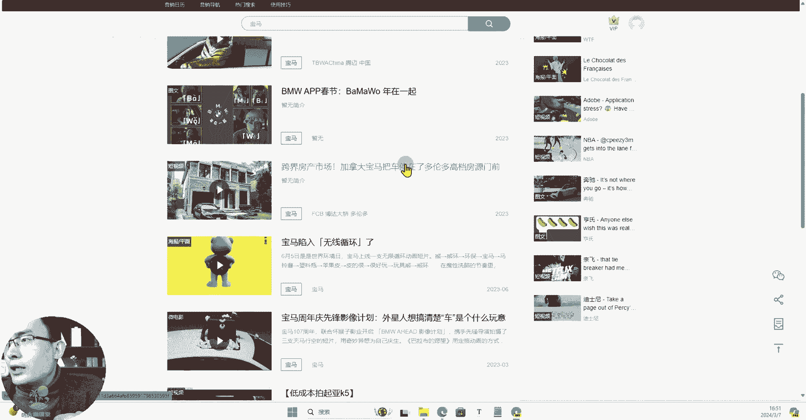

# 【2024B站新媒体运营精品教程】新媒体平台全套运营玩法 小红书运营起号／抖音起号涨粉／短视频拍摄剪辑／直播带货运营 小白7天入职包的！ - P19：02.4：工具篇-运营必备 营销日历 每天都可以蹭热点 - 大咖私域运营 - BV1fz421q7Hq

Hello，大家好，欢迎大家来到我们这一堂课，那么这堂课呢我给大家分享一个，我们做运营经常会用到的一个工具，那么这个工具呢我们一般叫它叫人营销日历，也就是说什么意思呢，我们做运营嘛。

我们不管说拍摄短视频，还是说我们需要去创作一些呃，符合热点的这样一个内容，其实呢我们有时候起号，或者说我们获取流量最快的方式，就是我们去抓取，或者说我们去了解今天明天，后天或者这一段时间有哪些节日。

有哪些热点，或者说有哪些日常呃，这个里边的一些经典故事什么的，我们可以去蹭的这些点，其实都是我们运营要关注的，因为作为运营，你就得了解，有哪些东西是我快速，可以让我们的短视频的流量可以起来的。

那么这个营销日历是什么呢。

我们一起来看一下，那么我们可以看到有这样的一个界面，它可以根据每一天提供当天这一天的一个呃，一些非常著名的，比如说中国大学的物理之父啊，中国物理学之父啊，这个逝世，或者说英国的这个保罗安德神的诞辰啊。

然后呢这些都是一些相当于是呃，可以说是什么呢，历史上的一些哎事件，我们呢去做内容，如果说你的内容呢能够刚好去挂靠上，这一块的一个热点呢，那么你的流量基数就不会特别少，像什么宝马公司成立。

那么做汽车的可不可以做，然后呢呃呃这个茶花女在威尼斯首演，然后呢还有一些国际妇女节，马航MH370等等这一些呃热点话题，都是我们可以去根据日期来规划做内容的。

那么除此之外呢，比如说中宝马汽车公司成立，我们点击进去，它还可以提供给我们一些其他人。

在这一块，其他的品牌方，他们在这一块做的非常不错的广告，那么这个工具呢我们在一些电商啊，和一些这个什么呢，比如说618啊，比如说双11或者是一些特别的节点。

在这个时间呢，就是很多人会提前去规划这样的一个节点，去做什么样的一个内容做调整啊，一周内。

一个月内，一个季度内，然后这个广告的一个，他的一个给我们提供的一些参考或者思路，是我们做运营的一个我觉得非常有效的工具。

那比如说我们找一个啊跨界房产市场啊。

你看这个结合这个就是房产和什么呀，房产和我们的这个呃宝马汽车的一个结合点啊。

我们可以看到他有具体的内容，我们可以结合相应的这样的一个内容。

来判断我们到底怎么去蹭上这个热点啊，像平台抖音有哪些啊。

INSTAGRAM有哪些B站，腾讯等等这些平台呢，他做了一个整合，那么能够提给我们提供非常好的。

运营这块一个思路的方向，那么这个工具呢它的领取地址也一样，我放在我们视频评论区的一个置顶评论，需要的同学可以去领取，然后呢呃我们后续也一样，会持续分享更多运营这一块非常有用的工具。

如果说你觉得内容还不错的，请给我的视频呢投个币点赞，然后呢分享给你身边有很多想学运营的朋友，让他们来看一看，这套非常强大。

