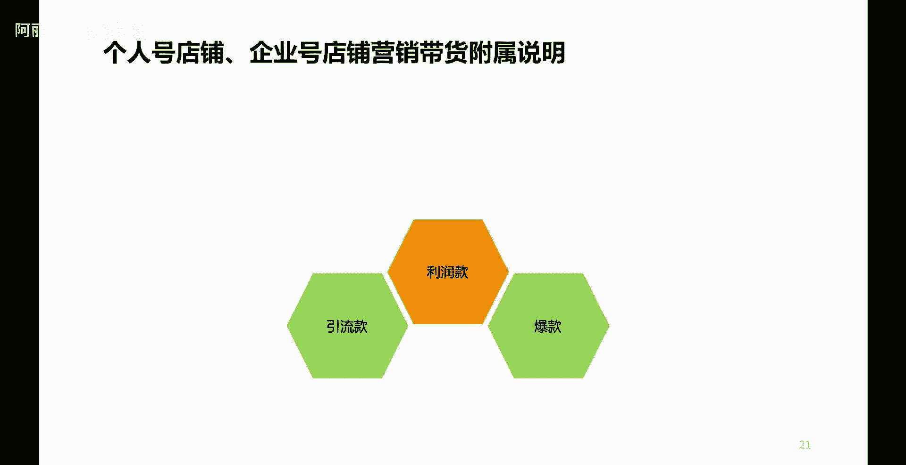
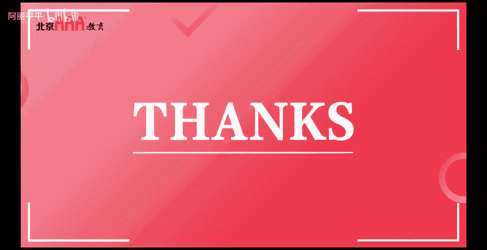

# 【2024B站最强小红书体运营教程】全B站最良心的小红书开店运营教程！小红书体开店，起号真的快，赶快点赞收藏起来 - P18：P17小红书店铺运营升级 - 阿丽平平 - BV1CH4qeqE2e

好那么接下来我们就看一下，我们都知道在任何一个电商平台，或者说在任何一个专业会做电商的店铺里头，我们都知道会有一个爆款，什么叫爆款呢，爆款肯定是热销款，很多人需要的，你不能说大伙都不需要。

哎你你你还要拿这个东西打爆款，那肯定是成不了爆款的对吧，拨款呢不一定赚钱，甚至有可能会赔钱，就像我们经常在一些电商平台上看到，九块九还包邮，而且这个商品还倍儿好，倍儿实用对吧。

所以呢这个一定程度上的就是爆款，你不要觉得爆款赔钱了，但事实上爆款给你的店铺带来了多少流量，带来了多少好评，带来了多少成就，那么你的访客量，成交量，评价量将直接影响你店铺店铺啊，店铺整体的一个什么呢。

权重啊，或者是在综合电商里头的一个店铺排名啊，都会受到这些影响，所以呢我们就要想我们店铺里头，我们的小红书店铺里头，我们所经营的这些商品，哪些商品是用户特别喜欢去买的，那么哪些商品我可以先拿来做爆款。

先为我的店铺引流，先为我的成交起到一个什么呢，破冰的作用好第二个呢叫做引流款，引流款呢看字面意思就知道，主要是为店铺引流的，引流款呢跟爆款呢，其实很多人呢觉得他们也是一样的。

但是呢严格意义上呢他俩还是有区别的，爆款呢是热销，热销是一个基本的前提，引流款呢它不是热销，是热需啊或者是热搜啊，准确的是热搜啊，热搜啊，比如说，之前有一些化妆品是吧，火了。

很多人呢都会通过网络上呢去搜这支化妆品，搜这支口红，但是一定会买吗，那倒不一定，所以大家呢会热搜，那么当你搜这支口红的时候呢，流量不就来了吗对吧，所以引流款的一定程度上不一定要卖的多好。

但是一定是用户愿意去高频次大批量去检索，去关注，去了解的一个东西啊，所以呢像这种的一般情况下可以做引流款，但是一般呢店铺呢主要是爆款加利润款，利润款不用说大家都知道是什么意思对吧。

利润款肯定是要赚钱的嘛是吧，通过爆款把流量引进来了，那么利润款肯定是要什么呢所变现盈利的，所以说呢很多时候呢，我们在做店铺带货的时候呢，一定要注意这个点是吧，先带什么样的货，先做怎样的一个销售方面的。

一个流量的一个什么呢转化，然后呢，再为自己的店铺呢进行一个利润的一个什么呢，提升是吧，或者是同步为自己的店铺呢，进行一个利润的提升，所以这个呢就是我们在带货方面，在商品的规划方面呢。

要给大家分享的一个技巧啊，在商品的规划方面有给大家分享的技巧，所以说呢啊不是说有一个小红书账号啊，放在那儿就可以变现了啊，不管是做流量还是做销量，这里头呢其实有很多的这样一个技巧和讲究啊。

所以说呢我们在做小红书的时候呢，一定要记住啊，先要把流量做起来，只有有了流量才有可能会有销量，你千万不要急着说流量还没有什么呢，就急着要销量，这种情况我们也很经常听说，而一个小红书的创作者。

或者是一个公司做了一个小红书账号，今天刚把账号弄下来啊，过两天就要问你药卖多少钱，这种呢基本上是不太现实的对吧，所以呢做流量呢需要一个过程啊，那有的人说啊，那难道我做流量的时候我就不挣钱了。

事实上应该是这样的，因为你没有流量，你拿什么变现呢，所以做流量他肯定需要时间，本身这种通过网络平台这种运营，这种软性类的东西啊，这种工作哈它一定是需要一个什么呢周期的啊，不可能说像那种啊广告投放啊。

立竿见影啊，这一一播广告马上就有一定的什么呢，知名度马上就有人知道对吧，所以说呢这个需要一定的一个时间啊，所以说呢有了账号之后，一定要认认真真的先把流量做好，流量是前提，流量是根本，先把这个做好。

我们才可能会有销量，那么同时呢在做销量的时候呢，一定要构思好自己的商品怎么去规划，什么是爆款，什么是利润款，甚至有些节点上面，比如说618双11，双12年年底是吧，哎什么是活动款。

有的时候还可以打造一些哎促销啊，或者优惠，或者是一些什么呢活动款对吧，做一些活动的这样一些商品啊，都是可以的，那么这个呢就共同构成了小红书的运营和促销，也叫做营销一体化，所以呢由此也看出来。

小红书呢本身呢就是一个内容电商的一个平台，而且这个内容呢一定程度上呢，解决了我们传统做电商流量很难获取，或者是高成本获取流量的这样一个痛点，所以呢很多企业呢也愿意通过小红书呢来优化。

或者是提升自身企业商品的一个营销啊，好我们这节课呢就讲到这里。

