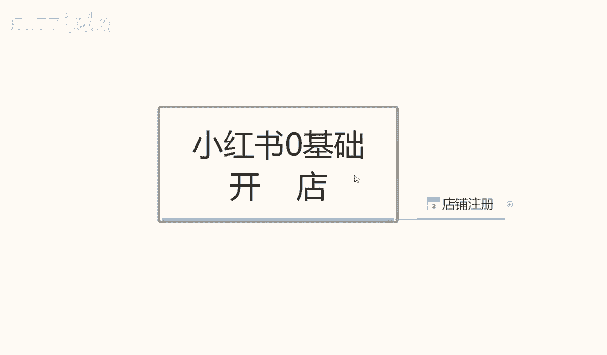
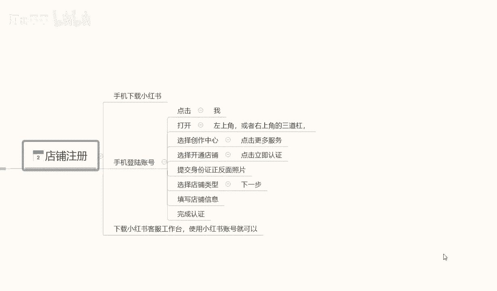

# 【2024B站最强小红书体运营教程】全B站最良心的小红书开店运营教程！小红书体开店，起号真的快，赶快点赞收藏起来 - P19：1.小红书店铺注册 - 阿丽平平 - BV1CH4qeqE2e

大家好，今天给大家分享个小红书，零基础开店的第二课时啊，小红书的一个店铺注册呃，废话不多说呢，直接进入我们今天的一个内容店铺注册。

小红书店铺注册的话，相当于来说的话，还是有一需要我们注意的一些选项，因为他的一些店铺注册的内容的话，他不是很好找啊，在我们戏台后台系统里面的话，它隐藏的比较深，它不像其他的呃。

其他的平台直接打开就可以注册，首先呢我们店铺注册的话，就说我们的用个人的手机就可以啊，当然你如果说有备用的多余的手机，用工作手机去操作的话也行啊，用手机下载小红书他的一个系统就可以了。

手机下载小红输系统以后的话，账号注册，首先我们手机号登录我们那个账号啊，账号登录进去以后的话，点击我们那个他这个的话其实和微信一样，在右下角啊，点击我们的那个人物头像就可以，就可以进入到我们的个人中心。

然后登录账号就行，登录账号的话呃，他这个里面的话有一个小红书注册之前的话，上节课内容也给大家讲过了，我们的一些开店基础的一个准备，让大家让大家是准备过，小红书注册的一个账号的，登录这个账号以后呢。

在右上角啊，点击我打开，在右上角或者是左上角，他有一个三角的一个斜杠啊，点击这三条杠以后的话，选择创作中心，点击创作中心以后呢，然后点击更多的一个服务，更多服务进去以后的话。

大概在嗯第三排选择开通店铺啊，就是第三个方框，它那里面的话是分为了四五个方框，每个方框里面的选项内容不一样啊，那个呢是设置我们的一个账户信息的，其他的不用管，直接选择我们的一个店铺开通就可以。

然后点击进去以后，它会显示一个界面，界面的话它是以广告的形式推荐给我们的，我们在里面的话，它有一个点击立即认证就可以了，点击进去就可以注册账号，其他的东西的话其实是不用看的，因为看了也没什么作用。

我们对我们新手来说的话，那些东西看不看无所谓啊，点击立即认证的以后的话，按照他的一个正常步骤走就可以了，然后提交我们之前准备提前准备好的一个材料，提交身份证的一个正反面，然后选择店铺的类型。

这个里面的话注意一点啊，店铺的类型的话，它是分为三个类型的个人店，企业店，或者说是啊旗舰店等等，这里面的话我们正常前期操作啊，不管大家怎么样，如果说有熟悉的话，可能就不需要了解这一点了。

如果说不熟悉的话啊，大家开个个人店就行了，用个人店的话，本来就是让我们上手去实验操作的，本来A做任何数据啊，我们不管是做电商也好，或者是做店下的店铺也好，我们大家都要有一个熟悉的过程，熟悉了以后的话。

我们再按照这个模式去操作就可以了，所以说大家一定就要注意了，我们前期开个个人店铺，自己先把所有的流程熟悉或者再去操作，不然的话我们所有的一个信息的话，基本上嗯就是我们前面用力过猛。

你后面就会对这些东西失去兴趣，为什么，因为我们前面已经失败了，你后面再做的话，就会对自己产生不那么信任的一种感觉，如果你做多了以后的话，你自己就放弃了，而我们在做任何东西的时候。

一定要先把自己的一个基础确认好啊，我们基础确认好了以后，我们有一定的基础了再去操作，所以说我给大家讲这些内容的话，就是我们按照步骤一步一步走，不要操之过急，前面的话我们没有必要直接就说上单。

一一下投个几万成呃，上10万哎，我非要把这个店做起来，没有必要啊，我们刚开始做店的话，投个两三千块钱，三五千块钱，其实是花个一个多月，两个月时间，把整套流程熟悉了以后的话，后面会节约我们很多时间的啊。

所以说大家注意点啊，然后继续我们的一个内容，首先要登录到达我们的一个选择店铺类型啊，选个人店铺就行了，其他的不用选了，用户能看这个课程的基本上都是新手，所以说大家了解一下就行啊，然后填写店铺的一个信息。

这些信息的话后面是可以修改的，我们随便填写一下，把信息尽量填准确就行啊，尽量的话就是在后期不要去修改，修改的话影响是有但不是很大啊，就是说没有必要啊，一次性弄好就行了，店铺信息填写完成以后呢。

我们再进入下一步啊，直接完成我们的一个认真完成，我们的一个小红书店铺，基本上呢就已经注册成功了，他注册成功的话是三天的，有三天的一个反馈时间，但是基本上的话五到10分钟。

他的反应对于其他平台来说的话会稍微慢一点，如果说我们去某多呀，或者说某宝去注册，或者说是呃其他的这种交易平台，去网网络交易平台去做的话，可能会快一点，但是小红书这边的话，因为他的系统还不是很完善。

所以说我们有很多操作的空间，但是呢它同时它的一个系统反应速度有点慢，快的话五到10分钟，慢的话可能要一天左右啊，基本上都在这个时间范围以内，他的店铺才会注册成功，注册成功，利润以后的话。

我们才会去操作项目，也然后呢，这节课最后一个点，就是说我们把账号注册成功以后，在手机里面还要下载一个东西，这个东西呢叫小红书的一个客服工作台啊，客服工作台的话，他和小红书的店铺的话呃是类似的。

但是他是做我们售后的，就是我们店铺里面来订单以后的话，会需要这个小红书的一个客服工作台，他直接在小红书里面操作好，操作不了的，没办法去聊天沟通，他相当于是额外引流到了，另外一个平台里面去做啊。

所以说大家一定要把那个小红书的客，客服工作台给下一下啊，这个呢就是这节课的一个店铺注册内容，下节课呢给大家讲解一下，小红书整体的一个店铺类型的一个区分啊，我们前面要做的话，我们到底去做什么店。

