# 【2024B站最强小红书体运营教程】全B站最良心的小红书开店运营教程！小红书体开店，起号真的快，赶快点赞收藏起来 - P20：2.小红书店铺分类 - 阿丽平平 - BV1CH4qeqE2e

大家好，今天给大家分享一个小红书，零基础开店第三课啊，店铺的一个类型，店铺类型，这一节课的话是让大家充分的了解小红书，他整个系统里面，他的所有店铺类型和他的一个类型区分。

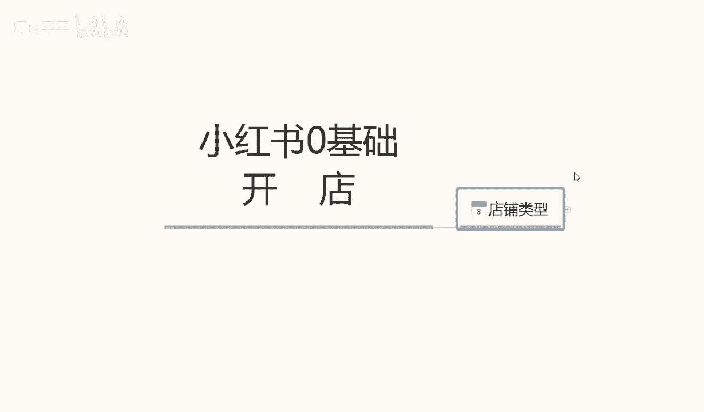

那么直接开始我们这节课的内容。

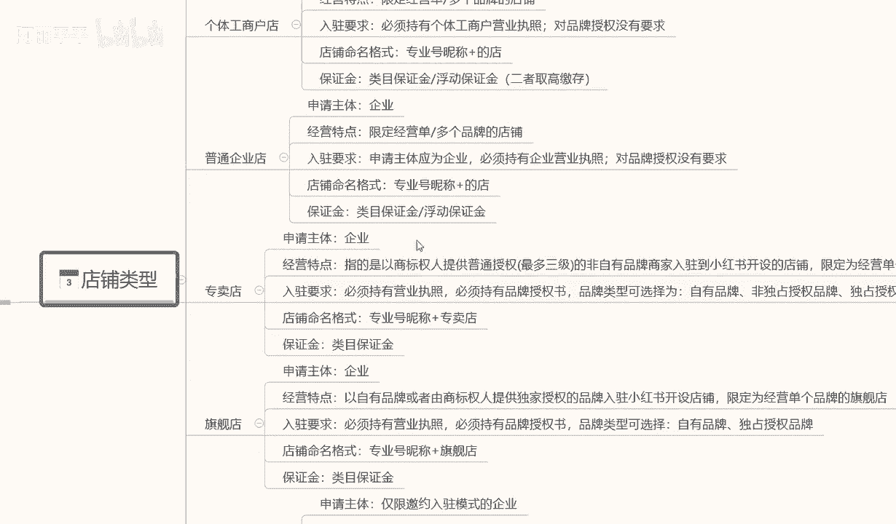

小红书的话，我们正常的一个店铺类型的话，它其实是可以分为很多种的。

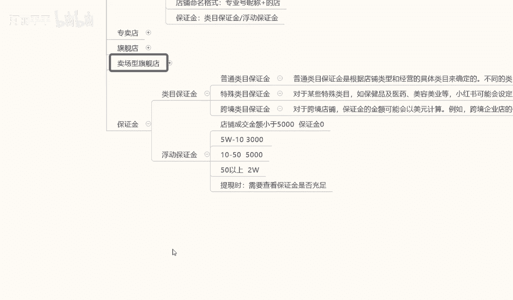

呃，这里面的话，我给大家把它全部都单独的列出来了，诶因为要给大家详细讲解一下，让大家了解整个小红书的一个，店铺类型的一个体系，我们在什么阶段应该怎么去操作啊，小红书的整体个人嗯。

整体的一个店铺体系的话就是第一个个体店，第二个呢是个体工商店户啊，第三个是普通的一个企业店，第四四个呢是专卖，第五个是旗舰啊，最后的话就是说一个是卖场型旗舰店，他这个的话其实也就是品牌推销商而已啊。

那首先我们来了解一下啊，个人店，什么是个人店呢，申请主体额，个人用户就是我们个人使用的，就是我们刚毕业也好，或者说是辞了工作，自己想做点小事情，就跟我们平常在外面摆地摊一样啊，这就是属于个体店。

摆地摊的话，你也要注册一个营业执照，或者说是一个小小规模的一个示范营业啊，让银行给你开通卡，然后给你开通支付权限，这个个体店的话就类似于这种啊，经营特点的话，就是说经营限定的精英零星的小额商品啊。

比方说首饰啊，服装啊，包包啊，包包啊，手机壳呀等等这些啊，多个品牌就是杂货铺，什么都可以卖，就看我们自己怎么去操作了啊，入住要求的话，这个的话基本上是比较简单的，他没有什么特定的一个入住要求。

就是我们个人有个身份证就行啊，额然后呢店铺命名的一个格式啊，专业号成泥就是然后加我们的一个店名，就我们个体店它自己会系统给我们匹配名称的，这个的话不用管保证金的话，内部保证金和浮动保证金嗯，二者取高。

这个怎么说呢，保证金这一块的话，我之前也给大家说过啊，就是说1000块钱的保证金，这个是个人店铺的一个数据准备，如果说是超过1000块钱的话，那都是个体工商或者说是旗舰店专卖店那种。

而且他的这一个整个保证金的话，他的浮动都很明显，待会的话最后一点我会给大家详细讲解一下，他这个整个小红书的一个保证内膜，它是怎么划分等级的，好吧，那下面呢我给大家讲一下，什么是个体工商的一个店铺。

个体工商店铺的话，他和个人店铺不同呢，就是说嗯他的入驻要求可能会稍微麻烦点，需要我们有一个营业执照啊，对品牌授权是没有需求的，只要我们自己有营业执照就可以了，其他的基本上都是一样的啊。

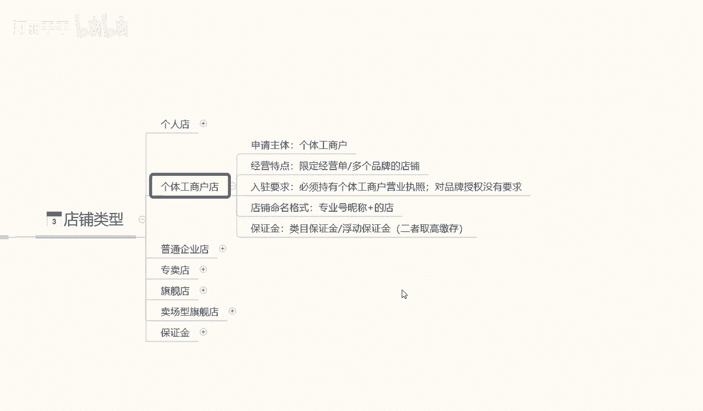

他和个体店的话就是一个入住需求，多了一个营业执照，其他都没什么区别，普通企业店的话，他和和其他的话也是包括下面的一些店铺。

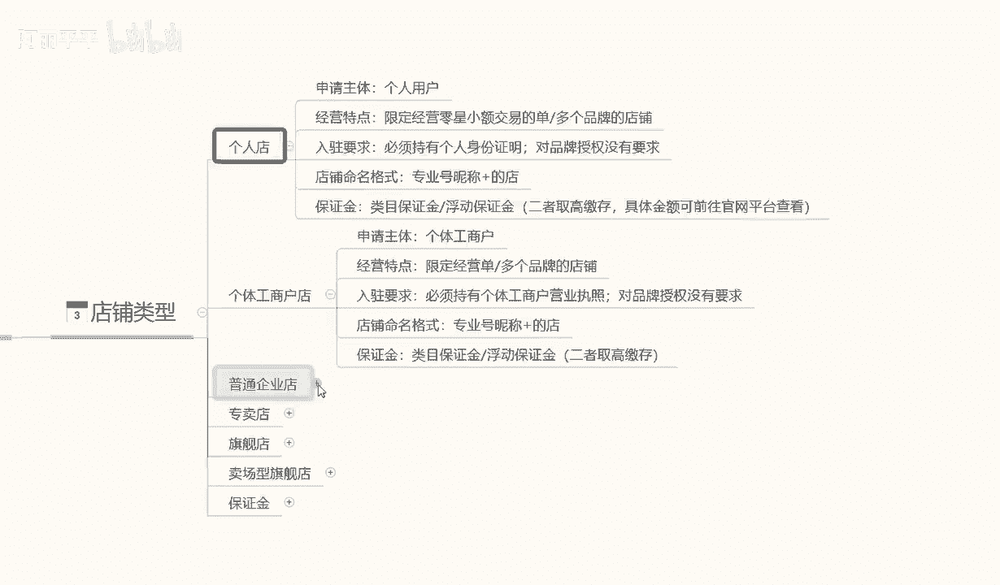

他所有的一个区别就是在入驻要求这一块啊，入住要求这一块，他每一个店铺入驻的一个要求是不同的，就看我们自己有没有这个资质去认证了，当然了，这个企业所有店铺的一个入驻要求，越简单的，你的权重肯定也就越低啊。

越复杂的你的权重也就越高，但是我们前面嗯新人刚开始操作店铺的时候啊，没有必要弄那么高的要求，做个个人店啊，自己测试一下有没有这个潜力，这个产品在这个小红书系统里面，好不好做就行啊，没有必要投入太多。

普通企业店的话，入驻要求的话就是说啊申请主体为企业，就是我也有自己的公司，或者我也要有自己的产品，我这个是有国家认证的啊，必须持有企业的营业执照就可以了啊。

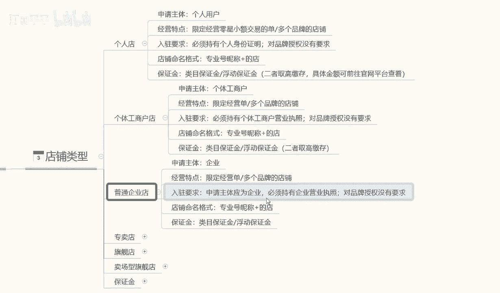

其他的话没什么需求，专卖点旗舰店。

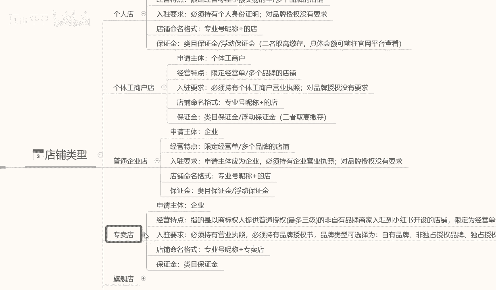

包括卖场型旗舰店啊，他只是说换了一个名称，专卖店的话入驻要求的话就是营业执照啊，品牌的一个认可，自有品牌，非独立品牌啊，就是你的品牌，我们自己，像阿迪啊那种都是国有的很知名的那种品牌。

我们自己小企业也有自己的品牌，你只要在国家上面注册认认证认可就可以，这都是属于专卖店，就是我卖我自己的产品啊，把我的知识创上去就可以了，旗舰店的话也是一样的，他只不过是啊必须持有营业执照。

必须持有品牌授权书，我自己没有品牌，但是我有别人品牌的一个授权书就行，卖场型专卖店的话，这个具体要求会如的话，可能根据平台的需求不同啊，它的内容也是不一样的，经营特点的话就是说零售的一个资质啊。

并且开设经营多个品牌的一个旗舰店，但是嗯基本上在小红书里面没有这种店铺啊，因为这种店铺的话，他小红书的流量和他不对标啊，因为小红书的整体流量的话，它是以女性为主的，所以说它的产品的话不对标很多。

很多的那种大型的旗舰店的话，他不会在小红书上面去操作，所以说他会给了我们一个小卖家，很有必要的一个生存空间，就说他的竞争压力的话，没有其他其他平台那么大啊，就非常适合我们小卖家去操作一些嗯。

小型的卖卖品，这个就是说呃所有店铺类型的一个区分内容。

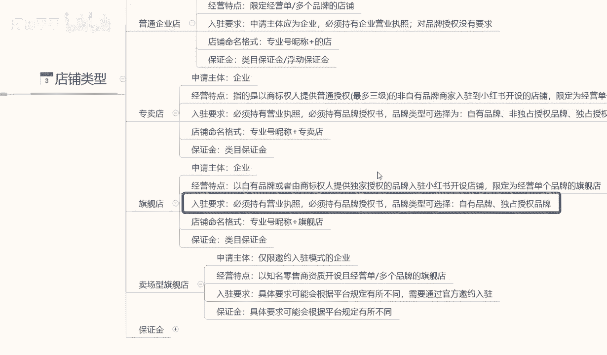

最后一个啊，就是给大家讲解一下，这些企业划分的一个保证金，因为他这个保证金的话嗯，基础保证金是1000块钱，但是基础保证金保证金之后的话，他还有额外的一个保证金，这个保证金的话呃。

在这里呢给大家讲解一下内部保证金，普通企业内部特殊类目和跨界内部。

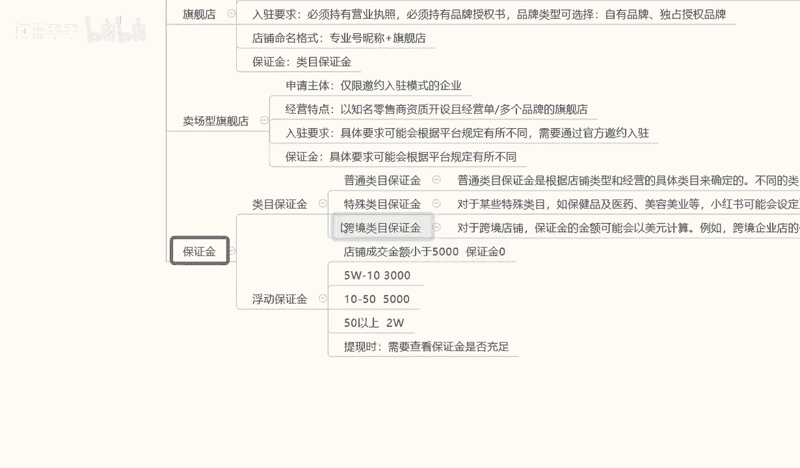

这里呢我给大家呃，把它具体内容呢给大家打出来。

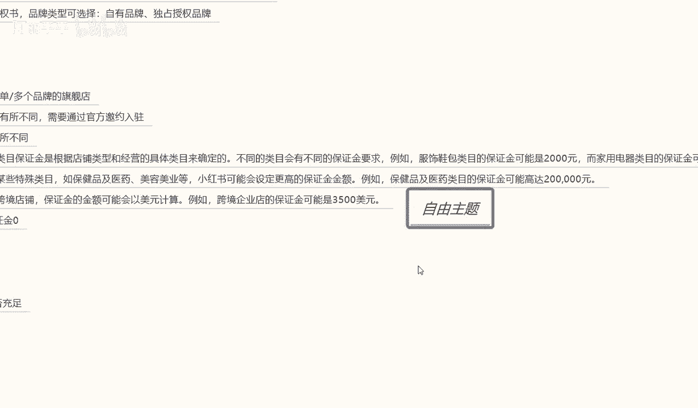

大家可以看一下啊，我在这里呢就不过多解释了，因为解释起来的话。

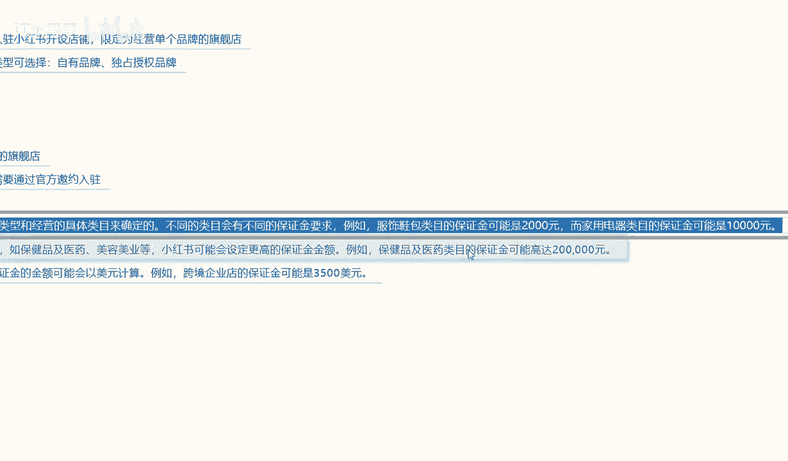

其实大家搜资料的话其实也能找到，只是说有些人的话嗯。

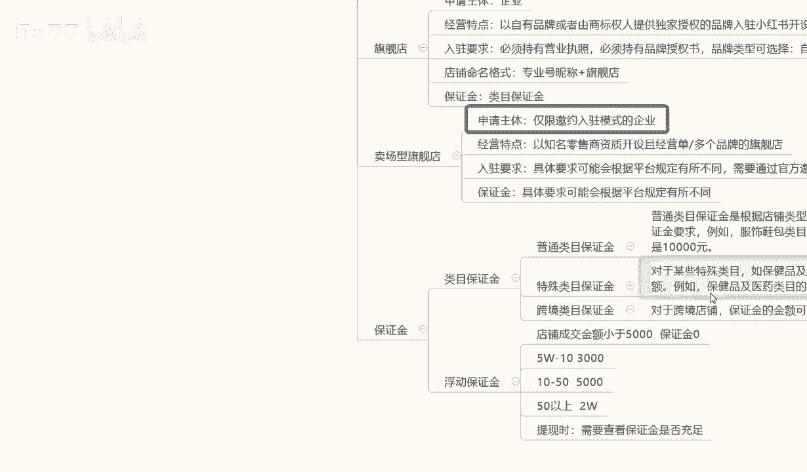

他懒得去说是吧，那我在这里呢就给大家打出来，大家看一下或者截图，对这方面感兴趣的话，可以去看一下，后面呢就是一个浮动保证金，内幕保证金的话，他基本上都是个固定的啊。

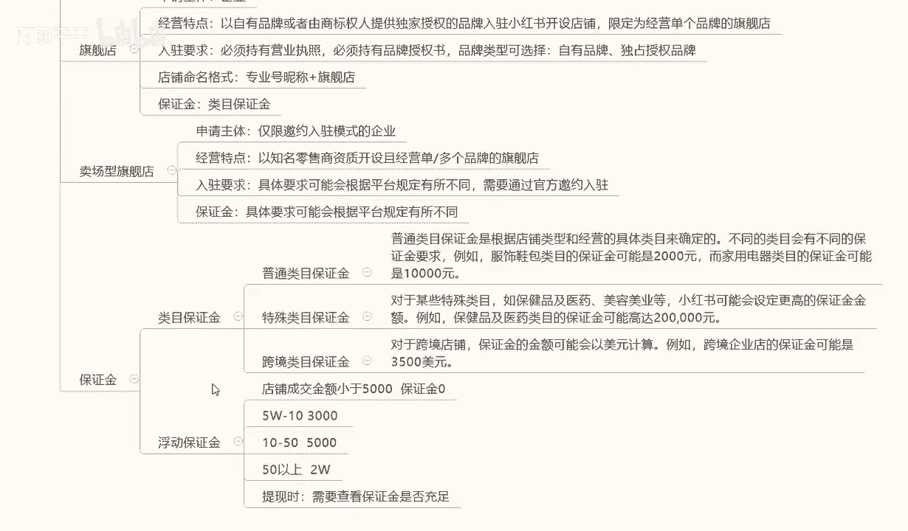

下面的就是浮动保证金，这个的话就是说所有内容的话，浮动保证金是最重要的，大家一定要了解一下什么是浮动保证金，浮动保证金的话，它是根据我们店铺的一个成交金额来计算的啊，店铺成交金额小于5000。

就是我们店铺前面如果说没有交保证金，或者是没有其他东西，成交金额在5000块钱左右的话，他的保证金是零，但是我们起始资金保证金金是1000，不交这1000块钱的话。

你这个成交金额小于5000块钱是没有用的，我们交了这1000块钱的保证金以后的话，我们在5万以内的一个店铺，就是一个月的流动资金，在5万以内的话都是没有问题的，超过5万的话就不行。

5万到10万的一个保证金的话是3000，10万到50万到50万是5000，50万以上是2万，他的这个保证金都是浮动的啊，但是大致的一个需求的话都是在这个地方，就是我们店铺成交每个月的成交金额啊。

超过5万到10万，我们需要3000块钱的保证金，才能把这个店铺里面的钱提出来，不然提不出来，10万到50万是5000，50万以上是每个月是2万啊，当然了，我们做到这个时候的话。

如果说每真的每个月50万以上上的，一个成交金额的话，2万块钱的保证金也无可非厚非是吧，提现，然后呢提现的时候，他会查证我们店铺，就是保证金账户里面的一个资金是否充足，如果说资金不充足的话。

我们的资金一旦超过了5万，就是我交了1000块钱，保证金我我的资成交资金一旦超过5万，那我一毛钱都提不出来的啊，所以说大家一定要注意了，不有时候提提现这个东西的话。

一定要注意自己查看自己的保证金是否充足啊，就是说大家很多时候的话做东西就是往这些点，觉得自己的钱找不出来，小红书坑我之类的啊，其实不会，他只是说他的一个内部的一个浮动保证金。

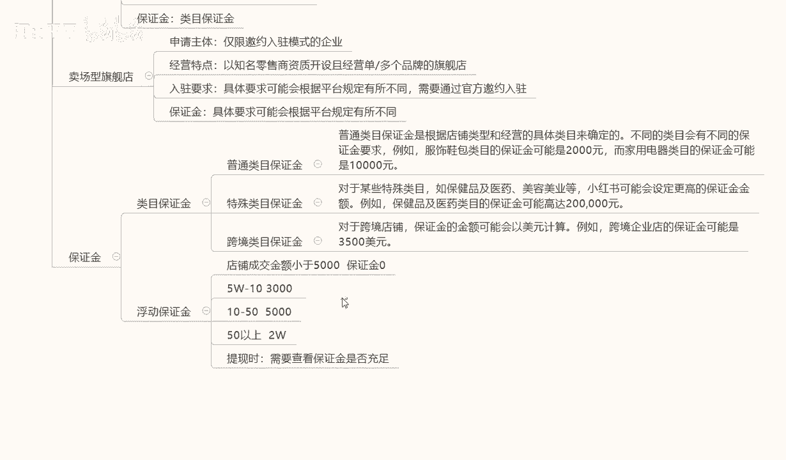

在这个地方啊，大家把这个这几个点注意好就可以了。

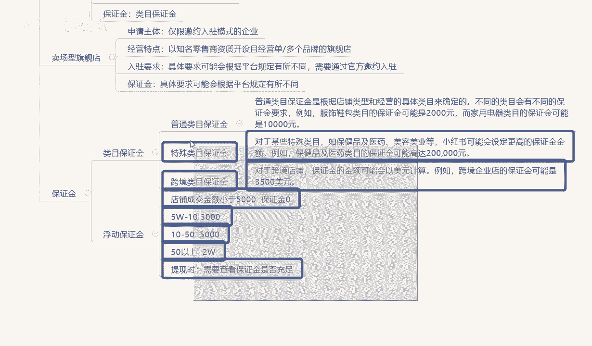

这个呢就是我们这节课的一个内容啊，给大家讲解了一下店铺的一个类型，和我们店铺类型里面对应的资金保证金，和我们的一个替换方式好吧，那么下一个节课呢给大家讲解一下选品与货源，小红书上面我们做什么样的产品。

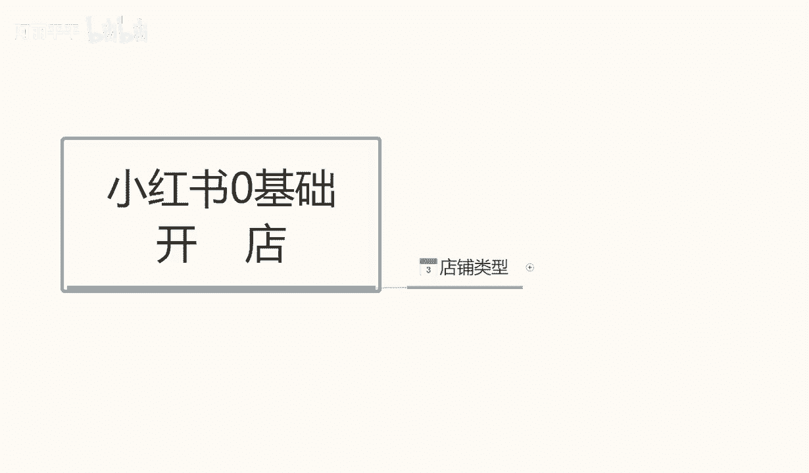

选什么样的货源。