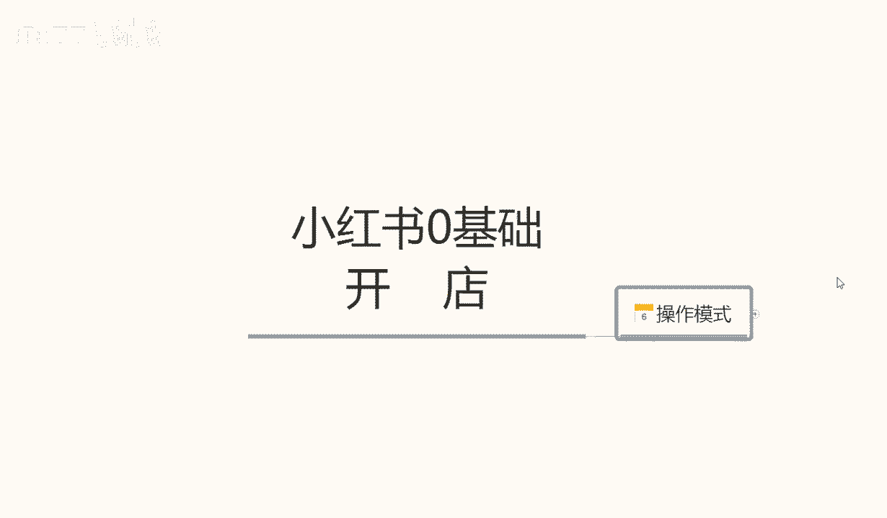
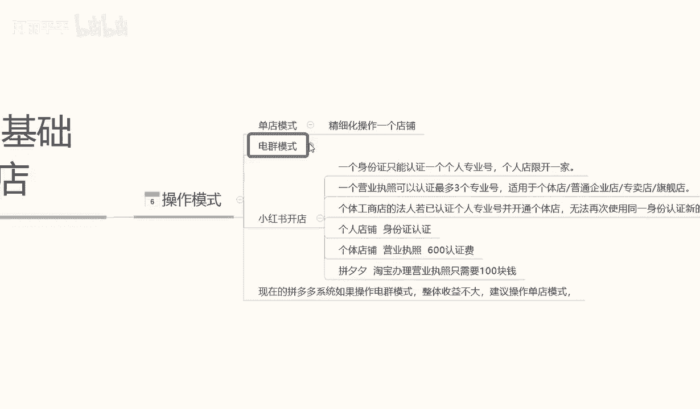
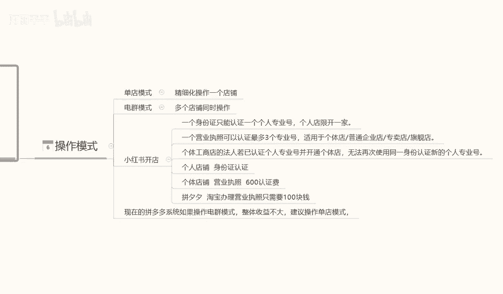
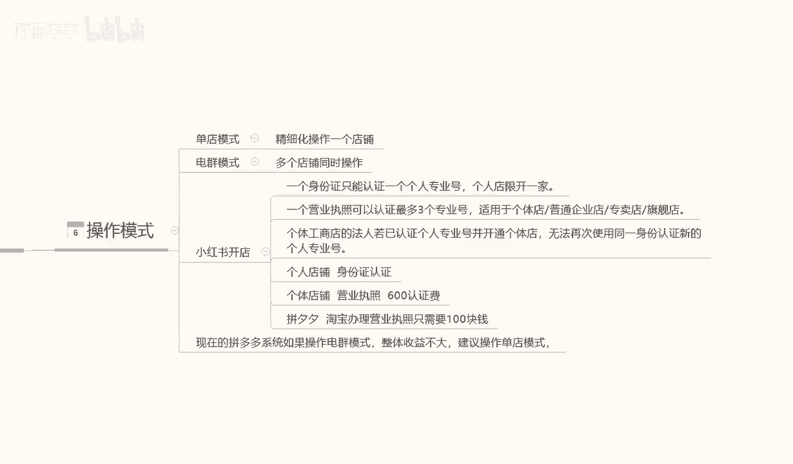

# 【2024B站最强小红书体运营教程】全B站最良心的小红书开店运营教程！小红书体开店，起号真的快，赶快点赞收藏起来 - P23：5.小红书店铺开店 - 阿丽平平 - BV1CH4qeqE2e

今天给大家分享小红书零基础开店的第六课时，店铺的一个操作模式。

小红书店铺的操作模式的话。

我们其实可以把它分为几种的一个类型。

这里呢我给大家简单列了两个点啊，第一个呢是单点模式，第二个呢是电驱模式，后面的呢是讲解我们小红书开店，我们需要准备的一些数据，首先我们讲解一下什么是单电模式啊，单电模式的话，它其实呢是比较简单理解的。

他就是精细化操作，我们做一个店铺就可以了，就是小红书的店铺，我们不用做，多做一个店铺就可以了，第二个呢是店群模式，是多店铺同时操作，就说做的是店群，我们可能拥有的店铺是十个，20个，30个。

40个或者是50个，店铺越多，我们投收益也就越大，当然了它相对的一个投入也比较多，首先呢我们了解一下单点模式，精细化超出一个点投，这个的话就是说我们在操作小红书的时候，我们不需要把这个精力的话。

全部用在那个电池模式里面，它和电驱模式的区别就是一个是单电，一个是多点，单店操作的话，它会相对来说，我们新人玩家操作，整个店铺的一个数据是简单一点啊，而且前期投入也比较小，呃不像电池模式，投入的话。

可能会稍微大一点，单电模式它的优点在什么地方呢，嗯投入小，侧重点高，什么叫侧重点高呢，就是说我们操作这个店铺的话，他可以一直操作，而且店铺的话不需要经常更新啊，只需要定期的发布一下我们的一个笔记。

或者是更新一下我们的产品的一个内容，然后呢参与整个小红书店铺里面的一些活动啊，等等之类的，他整个整个投入的话，对比店群模式来说的话要小很多，但是他的一个利润点的话，其实和电气模式的话差不多。

嗯可能会比电讯模式还要高啊，也可能如果说我们操作不当的话，就会比电讯模式稍微小一点，这个呢就是单点模式，它的一个操作模式的一个大概框架啊，为什么是大概框架呢，因为单电模式操作的话。

它精细化要求的话比电池模式要多很多，他所有的内容全部都是精细化的，也就是说我们要把这个单店啊做的非常精致，电群模式呢多店铺操作，这里呢我就给大家讲解一下什么是多电操作啊，多点操作的话。

它和单点模式不同的之处，就是说我们一个人要控制很多个账号，正常的话我们一个人控制甲虫数字，多电的话，一个人大概可以控制十个店铺左右，也就是说我们在操作电球模式的时候嗯，一个人一天。

因为他的操作是比较重复的，只能控制十个店铺左右，就是每天不不停的更新我们店铺里面的数据，一个人一个人的话大概可以招做十个，如果说说操作电驱模式，我们有很大的规模，或者说是我们整个产业链啊。

就是我单品产业链里面的话，我想把这个店铺做起来，我可能会找四个人，五个人或者六个人做5~60个店铺，然后每个店库里面去操作啊，当然操作它都是统一的，因为不统一的话，我们没办法操作这么多电。

操作模式是统一的，但是它的内容的话是每天重复的，需要去更新发送，也就是说我们这个店群模式的话，是没办法像单电模式一样去精细化，我们整个店铺里面的一个数据的，他这个就是单电模式和巡电模式两个区别啊。

第一个呢单电模式要对个人来说的话，额投入小简单一点，电池模式的话就是投入大啊，操作复杂一点，但是它的一个收益效果的话会比它起电啊，比单店模式会容易很多，收益的话其实是差不多的。

只是说它起电的话就不像小红书那样呃，小红书我们做的话可能兼职啊，或者是做些什么的，其他的事情都可以做单店模式，但是店群模式的话就一定要全职了，为什么呢，因为你没有其他精力再去做别的事情了。

你每天光管理这十个店铺的一个时间量嗯，就给你忙的了，所以说这就是单电模式和群电模式两个区别，那么下面呢我给大家讲解一下啊，单电模式嗯，今天在这节课里面呢，我就不给大家多讲，因为他的一个内容特别精细化啊。

不会涉及到的点非常多，没办法多讲，那我这里呢给大家，今天主要着重讲解一下电群模式，电球模式的一个操作方式，电群模式的话嗯，它整体的一个操作模式的话其实都是差不多的，这里面的话开店。

他这里面唯一涉及到一点，就是我们店群模式开店，怎么去开小红书开店啊，我们前期呢也有课程给大家讲解了，小红书开店的话，一个身份证只认认这一个专业号啊，限定开机啊店铺，但是如果说我们有营业执照的话。

是可以开三家店铺的啊，也就是说我们一个是一个一个本人的身份证，可以开三家的小红书的一个店铺，找三个人或者四个人，就可以开12家左右的一个店铺，适用于个体店铺，或者说是企业店普通店的一些营收。

然后呢这个里面给大家讲解一下啊，这个讲解的内容是什么呢，讲解的就是说我们怎么去办理，多个店铺的一个认证，个体工商的话，法人若已认证个人专业店并开通个体店的话。

无法再使使用同一身份证，所以说我们要找两三个人的身份证拿它去注册，你自己注册也可以，你找别人代办也可以啊，这个里面的话看你们个人代办的，可能的话可能啧价格方面的话可能还便宜一点，如果说自己办的话。

就是说安全稳定一点，代办的话有一定的风险性啊，这里能给大家说清楚，然后个人店铺的一个身份认证，个体店店铺营业执照认证费是600啊，如果说我们去拼夕夕，或者说是某宝办理营业执照的话，只需要100块钱。

但是营业执照个人认证认证费，是我们自己出的啊，要大家要搞清楚啊，营业执照认证费是自己出的，让找别人帮你代办，只是说帮你去完成，完成了一个跑腿的一个工作而已啊，也就是700块钱左右，办一个下来。

一个下来的话可以开三个店，三个店的话，你整个一个人一个人操作十几个店铺下来的话，大概就需要两三千块钱，3000块钱左右啊，这十个店铺你就能申请下来，也就是说你可以开十家店。

但这十家店的话我们再去操作的话，每家店有1000的保证金，就相当于是1万块钱，也就是13000UI3的话，再加上我们其他的一些投入，其他基本上也没什么投入了，因为它不需要像单店模式一样。

需要去啊整理资料啊，囤货呀，或者说是一个资金周转，因为它不需要啊，他只需要我们前面他也需要资金周转，但是没有像单店的话，可能需要左轮没那么多，他这个里面的资金周转的话，会费用会少很多啊。

但是他前期的花费高，不过这些钱呢都是可以取出来的，就看我们自己怎么去判断了，只是他前期第一笔投入的话，比对比单店的一个投入的话会大很多，单店前期投入的话大概在5000块钱左右，小店群模式。

一个人一个人啊，自己去操作的话，可能就要1万3，1万5左右，如果说是你要操作更多的电两，20个点，30个点，40个点，那么按照我这个方式，你们大家自己可以算一下大概需要多少钱啊，5万块钱左右。

就是说整个电锯模式做起来的话，大概前期投入的话需要5万块钱左右，所以大家一定要注意了啊，单电模式和电锯模式它的区别就在这个两个点，第一个单店模式的话投入小啊，收益可以，但是整体精细化的一个操作的话。

就看我们个人的一个操作能力了啊，能不能把自己的小红书店铺做起来，电锯模式就不一样了，电锯模式的话它的操作会简单一点，但是我们做小红书店铺之前，还可以做做电信模式，现在做电信模式的话。

收益其实也没那么高了啊，所以说大家嗯对于整个小红书，店铺的一个操作模式的话，怎么去操作，自己选什么模式去操作，就看我们大家自己了啊，然后现在的话嗯说实话现在整个系统里面的话，就是说嗯某淘也好，某多也好。

他的一个店群模式都是不适合的，但是在小红书里面的话，整整体来说电池模式可以操作，但是嗯对比其他两个平台啊，它可以操作小红书里面建设，操作店群也有一定的收益，但是这个收益时间的话不能保证。

因为它的整个系统的一个体系的话，正在慢慢的成熟，所以说我们大家在选择操作模式的时候啊，大家多注意一下，建议大家的话还是说去做单店模式好一点，店群模式的话，因为前期投入太多了，没有必要啊。

我们把单电模式学习透了以后的话，再去做电群也会容易很多，那么这节课的内容就到这里，下节课呢给大家详细讲解一下我们整个的一个，小红书的一个商品管理啊，它里面包含了单店模式的一个商品管理。

